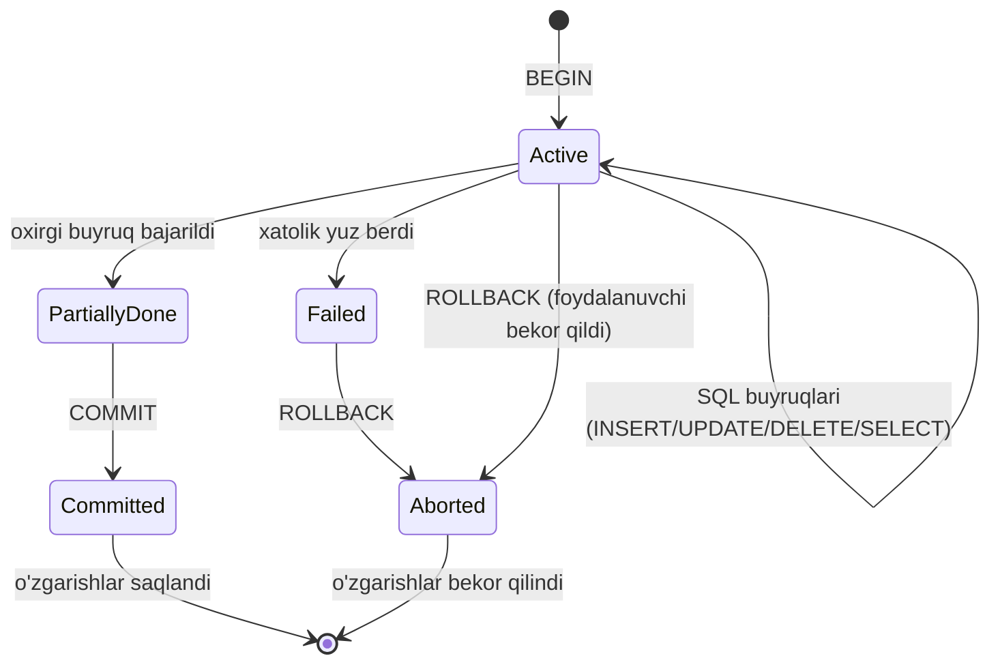
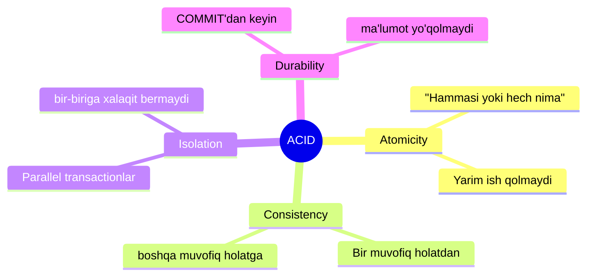
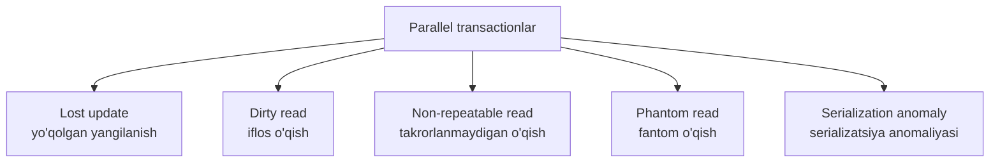
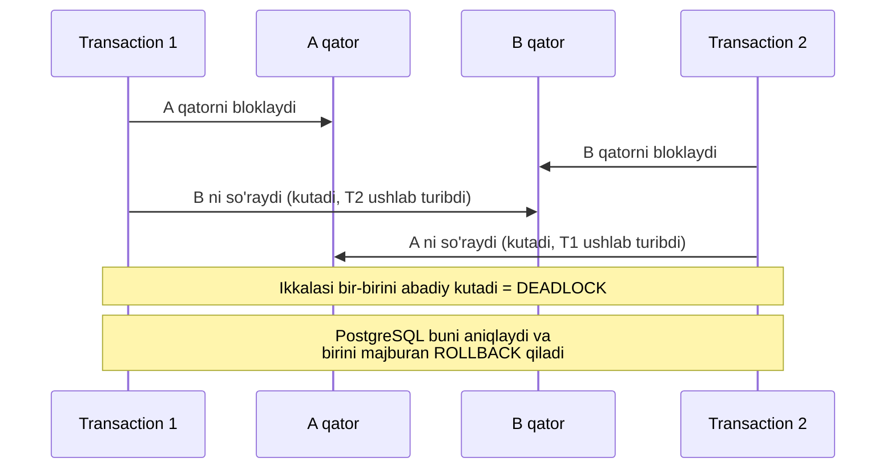

# 15. Transactionlar va Isolation levellar

> 📖 Manba: Моргунов, "PostgreSQL. Основы языка SQL", 9-bob ("Транзакции")

## Nima uchun kerak?

Tasavvur qiling, siz aviabiletni band qilyapsiz. Bu jarayonda bir necha jadvalga yozuv qo'shiladi:

- `bookings` — bron yozuvi (umumiy summa bilan),
- `tickets` — ikkita yo'lovchining ikkita bileti,
- `ticket_flights` — har bir bilet uchun perelyotlar (reyslar).

Endi tasavvur qiling, `bookings` va `tickets` ga yozuv qo'shildi-yu, lekin aynan `ticket_flights` ga yozayotgan paytda server o'chib qoldi. Natijada bazada **yarim ish** qoladi: bron bor, biletlar bor, lekin reyslar yo'q. Bunday holat **nomuvofiq (несогласованное)** holat deyiladi — bazadagi ma'lumotlar bir-biriga zid bo'lib qoladi.

**Transaction** aynan shu muammoni hal qiladi. Transaction — bu birgalikda **mantiqan yaxlit** bir protsedurani tashkil qiluvchi operatsiyalar to'plami. Ular yo **hammasi birga** bajariladi, yoki **hech biri** bajarilmaydi. Oraliq holat bo'lmaydi.

Bundan tashqari, transactionlar **parallel ishlash**ni ham boshqaradi: bir vaqtning o'zida yuzlab foydalanuvchi bazaga murojaat qilganda, ular bir-biriga xalaqit bermasligi kerak. Isolation levellar aynan shu "bir-biriga xalaqit bermaslik" darajasini belgilaydi.

> Bog'lanish: 14-darsdagi indexlar so'rovlarni **tezlashtiradi**, transactionlar esa ma'lumotlar **ishonchliligi va to'g'riligi**ni ta'minlaydi. Ikkalasi ham "yaxshi baza" degani.

---

## Transaction nima?

Transaction ikki xil natijaga ega bo'lishi mumkin:

1. **COMMIT** — bajarilgan barcha o'zgarishlar bazada muvaffaqiyatli fiksatsiya qilinadi (mustahkamlanadi).
2. **ROLLBACK** — transaction bekor qilinadi, uning ichida qilingan **barcha** o'zgarishlar ortga qaytariladi. Buni "откат" — ortga qaytarish deyiladi.

Eng oddiy holatda transaction bitta operatsiyadan iborat bo'lishi mumkin. Aslida PostgreSQL'da siz `BEGIN` yozmasangiz ham, har bitta alohida SQL buyrug'i **avtomatik** o'z transaction'ida bajariladi (autocommit).

### Transaction holatlari (state diagram)



Asosiy buyruqlar:

```sql
BEGIN;      -- transaction boshlandi
-- ... bir nechta SQL buyruq ...
COMMIT;     -- o'zgarishlarni saqlash

-- yoki
BEGIN;
-- ... SQL buyruqlar ...
ROLLBACK;   -- o'zgarishlarni bekor qilish
```

`COMMIT` o'rniga uning sinonimi `END` ni ham ishlatish mumkin — bu PostgreSQL kengaytmasi.

---

## ACID xususiyatlari

Transaction to'rtta muhim xususiyatga ega bo'lishi kerak. Ularning birinchi harflaridan **ACID** qisqartmasi tuziladi.



| Xususiyat | Ma'nosi |
|-----------|---------|
| **Atomicity** (atomarlik) | Transaction **to'liq** fiksatsiya qilinadi yoki **umuman** fiksatsiya qilinmaydi. Oraliq yo'q. |
| **Consistency** (muvofiqlik) | Transaction bazani bir muvofiq (constraint'larni buzmaydigan) holatdan boshqa muvofiq holatga o'tkazadi. |
| **Isolation** (izolyatsiya) | Bajarilayotgan transaction'ga boshqa parallel transactionlar iloji boricha kam ta'sir qilishi kerak. |
| **Durability** (bardoshlilik) | Muvaffaqiyatli COMMIT'dan keyin ma'lumot ishonchli saqlanadi — hatto keyin server nosozlik bersa ham. |

### PostgreSQL va MVCC

PostgreSQL izolyatsiyani **MVCC** (Multiversion Concurrency Control — ko'p versiyali parallellikni boshqarish) modeli orqali amalga oshiradi. Uning mohiyati:

- Har bir SQL operator ma'lumotlarning **snapshot** (surati) ni ko'radi — ya'ni bazaning ma'lum bir vaqtdagi muvofiq versiyasini.
- Parallel transactionlar bir xil qatorni o'zgartirsa, o'sha qatorning **alohida versiyalari** yaratiladi.
- Natijada muhim qoida: **o'qish operatsiyasi hech qachon yozishni bloklamaydi, yozish esa hech qachon o'qishni bloklamaydi.**

Bu tezlikni oshiradi, lekin ko'proq disk va xotira talab qiladi.

---

## Anomaliyalar (parallel transactionlarda muammolar)

Transactionlar parallel bajarilganda quyidagi noxush hodisalar (fenomenlar) yuzaga kelishi mumkin:



1. **Lost update (yo'qolgan yangilanish)** — ikki transaction bir vaqtda bitta ma'lumotni o'zgartiradi, natijada bittasining o'zgarishi ikkinchisining o'zgarishi ustidan yozilib, **yo'qoladi**.

2. **Dirty read (iflos o'qish)** — transaction boshqa transaction o'zgartirgan, lekin hali **COMMIT qilmagan** ma'lumotni o'qiydi. Agar u boshqa transaction keyin ROLLBACK qilsa, birinchi transaction **bazada aslida mavjud bo'lmagan** ma'lumotni o'qigan bo'lib chiqadi.

3. **Non-repeatable read (takrorlanmaydigan o'qish)** — bitta transaction ichida bir xil qatorni **ikki marta** o'qiganingizda, oradagi boshqa transaction uni o'zgartirib COMMIT qilgani uchun, ikkinchi o'qishda **boshqa natija** chiqadi.

4. **Phantom read (fantom o'qish)** — bir xil shart bo'yicha qatorlar to'plamini ikki marta tanlaganingizda, oradagi boshqa transaction **yangi qatorlar qo'shgani** uchun ikkinchi tanlovda qatorlar soni farq qiladi. "Fantom" qatorlar paydo bo'ladi.

5. **Serialization anomaly (serializatsiya anomaliyasi)** — parallel bajarilgan bir guruh transaction natijasi, ularni **ketma-ket** (biri tugab, keyin ikkinchisi) bajarganda chiqadigan **hech qanday** natijaga mos kelmaydi.

> **Serializatsiya nima?** Ikki transaction A va B ni ketma-ket bajarishning ikki varianti bor: "avval A, keyin B" yoki "avval B, keyin A". Bank misolida: hisobga pul qo'yish va foiz hisoblash — tartib muhim (avval pul qo'yilsa, foiz ko'proq bo'ladi). Transactionlarni parallel bajarish natijasi **shu ikki variantdan biriga** mos kelsa — serializatsiya muvaffaqiyatli. Qaysi variant chiqishi aniq emas, lekin natija ulardan biriga mos bo'lishi kerak.

---

## Isolation levellar

SQL standarti to'rtta isolation level belgilaydi. Har bir yuqori level oldingisining barcha imkoniyatlarini o'z ichiga oladi. Har bir level qaysi anomaliyalarga **yo'l qo'ymasligi** bilan tavsiflanadi.

### Standart va PostgreSQL amaliyoti

| Isolation level | Dirty read | Non-repeatable read | Phantom read | Serialization anomaly |
|-----------------|:----------:|:-------------------:|:------------:|:---------------------:|
| **Read Uncommitted** | ⚠️ standartda mumkin / **PG'da yo'q** | mumkin | mumkin | mumkin |
| **Read Committed** | yo'q | mumkin | mumkin | mumkin |
| **Repeatable Read** | yo'q | yo'q | ⚠️ standartda mumkin / **PG'da yo'q** | mumkin |
| **Serializable** | yo'q | yo'q | yo'q | yo'q |

> Muhim: PostgreSQL standartdan **qat'iyroq**. Read Uncommitted amalda Read Committed bilan bir xil ishlaydi (dirty read bo'lmaydi), Repeatable Read esa phantom read'ga ham yo'l qo'ymaydi.

Default isolation level'ni ko'rish:

```sql
SHOW default_transaction_isolation;

 default_transaction_isolation
-------------------------------
 read committed
```

Ya'ni PostgreSQL default holda **Read Committed** dan foydalanadi.

### Tayyorgarlik: tajriba jadvali

Tajribalarni `aircrafts` jadvali ustida qilamiz. Lekin undan qatorlarni o'chirsak, `seats` jadvalidagi bog'liq qatorlar ham o'chib ketmasligi uchun uning nusxasini yaratamiz:

```sql
CREATE TABLE aircrafts_tmp
  AS SELECT * FROM aircrafts;
-- SELECT 9  (9 ta samolyot nusxalandi)
```

Parallel transactionlarni ko'rish uchun psql ni **ikki terminalda** ishga tushiramiz. Quyida "1-terminal" va "2-terminal" deb ataymiz.

---

## Read Uncommitted — dirty read tekshiruvi

Tekshiramiz: transaction boshqa transaction'ning COMMIT qilinmagan o'zgarishini ko'radimi?

**1-terminal:**
```sql
BEGIN;
SET TRANSACTION ISOLATION LEVEL READ UNCOMMITTED;

UPDATE aircrafts_tmp
  SET range = range + 100
  WHERE aircraft_code = 'SU9';
-- UPDATE 1

SELECT * FROM aircrafts_tmp WHERE aircraft_code = 'SU9';
--  aircraft_code |      model       | range
-- ---------------+------------------+-------
--  SU9           | Sukhoi SuperJet-100 | 3100   <- o'zi ko'radi (hali COMMIT qilinmagan)
```

**2-terminal** (COMMIT qilinmagan holatda o'qiydi):
```sql
BEGIN;
SET TRANSACTION ISOLATION LEVEL READ UNCOMMITTED;

SELECT * FROM aircrafts_tmp WHERE aircraft_code = 'SU9';
--  aircraft_code |      model       | range
-- ---------------+------------------+-------
--  SU9           | Sukhoi SuperJet-100 | 3000   <- ESKI qiymat!
```

**Xulosa:** 2-transaction 1-transaction'ning COMMIT qilinmagan o'zgarishini **ko'rmadi** (range = 3000, 3100 emas). Demak PostgreSQL'da Read Uncommitted'da ham dirty read **bo'lmaydi** — u amalda Read Committed'ga teng.

Tozalash uchun ikkala terminalda ham `ROLLBACK;` qilamiz.

---

## Read Committed — non-repeatable read

Bu — PostgreSQL default'i. Bu level'da **lost update yo'q**, lekin **non-repeatable read bo'lishi mumkin**.

### Lost update yo'qligini ko'rsatish

**1-terminal:**
```sql
BEGIN ISOLATION LEVEL READ COMMITTED;

UPDATE aircrafts_tmp
  SET range = range + 100
  WHERE aircraft_code = 'SU9';
-- UPDATE 1  (range endi 3100, lekin hali COMMIT qilinmagan)
```

> Diqqat: `SET TRANSACTION` o'rniga isolation level'ni to'g'ridan-to'g'ri `BEGIN` ga yozdik — ikkalasi teng. Read Committed default bo'lgani uchun oddiy `BEGIN;` yozsa ham bo'laveradi.

**2-terminal** (o'sha qatorni o'zgartirmoqchi):
```sql
BEGIN;

UPDATE aircrafts_tmp
  SET range = range + 200
  WHERE aircraft_code = 'SU9';
-- ... KUTIB QOLADI (ожидание) ...
```

2-terminal'dagi `UPDATE` **kutib qoladi**, chunki 1-transaction o'sha qatorni **bloklab** qo'ygan. Bu blok faqat 1-transaction tugaganda (COMMIT yoki ROLLBACK) ochiladi.

**1-terminal:**
```sql
COMMIT;   -- 3100 fiksatsiya qilindi
```

Endi **2-terminal**'da UPDATE davom etadi:
```sql
-- UPDATE 1
SELECT * FROM aircrafts_tmp WHERE aircraft_code = 'SU9';
--  aircraft_code |      model       | range
-- ---------------+------------------+-------
--  SU9           | Sukhoi SuperJet-100 | 3300   <- 3100 + 200
```

**Xulosa:** natija **3300** (3000 + 100 + 200). Ikkala o'zgarish ham saqlandi. 2-transaction blok ochilganda qatorni **qayta o'qidi** (перечитывает) va yangilangan qiymat ustiga qo'shdi. Demak lost update **bo'lmadi**. 2-terminalni yakunlaymiz: `END;`

### Non-repeatable read'ni ko'rsatish

Endi bir transaction ichida ikki marta o'qib, natija o'zgarishini ko'ramiz.

**1-terminal:**
```sql
BEGIN;
SELECT * FROM aircrafts_tmp;   -- birinchi o'qish (masalan 9 qator)
```

**2-terminal** (oralig'ida o'chiradi va COMMIT qiladi):
```sql
BEGIN;
DELETE FROM aircrafts_tmp WHERE model ~ '^Boe';   -- Boeing'larni o'chirdi
-- DELETE 3
END;   -- COMMIT
```

**1-terminal** (yana o'qiydi):
```sql
SELECT * FROM aircrafts_tmp;   -- endi 6 qator!
```

**Xulosa:** bitta transaction ichida bir xil so'rov **boshqa natija** berdi (9 → 6), chunki oradagi 2-transaction tugadi. Bu — **non-repeatable read**, Read Committed'da bunga **yo'l qo'yiladi**.

---

## Repeatable Read — snapshot va serialization xatosi

Repeatable Read non-repeatable read'ga ham, PostgreSQL'da **phantom read'ga ham** yo'l qo'ymaydi.

**Sababi:** bu level'da transaction snapshot'ni **har bir so'rov oldidan emas**, balki **transactionning birinchi so'rovi oldidan bir marta** oladi va butun transaction davomida o'sha snapshot bilan ishlaydi.

Muhim: bu level'dagi ilova (dastur) transaction'ni **qayta ishga tushirishga** tayyor bo'lishi kerak, chunki PostgreSQL boshqa transaction o'zgartirib bo'lgan qatorni qayta o'zgartirmoqchi bo'lgan transaction'ni **rad etadi**.

### Phantom yo'qligini ko'rsatish

**1-terminal:**
```sql
BEGIN TRANSACTION ISOLATION LEVEL REPEATABLE READ;
SELECT * FROM aircrafts_tmp;   -- 6 qator (snapshot shu yerda olinadi)
```

**2-terminal** (yangi qator qo'shadi va bittasini o'zgartiradi):
```sql
BEGIN TRANSACTION ISOLATION LEVEL REPEATABLE READ;

INSERT INTO aircrafts_tmp VALUES ('IL9', 'Ilyushin IL96', 9800);
-- INSERT 0 1

UPDATE aircrafts_tmp SET range = range + 100 WHERE aircraft_code = '320';
-- UPDATE 1

END;   -- COMMIT
```

**1-terminal** (yana o'qiydi):
```sql
SELECT * FROM aircrafts_tmp;
-- HANUZ 6 qator! IL9 ko'rinmaydi, 320 ning range'i o'zgarmagan
END;   -- COMMIT
```

**Xulosa:** 1-transaction na yangi (fantom) qatorni, na o'zgargan qatorni ko'rdi — chunki u **birinchi so'rov paytidagi snapshot** bilan ishlaydi. Transaction tugagach, `SELECT` qilib ko'rsak, o'zgarishlar allaqachon bazada bor.

### Serialization xatosi (couldn't serialize access)

**1-terminal:**
```sql
BEGIN TRANSACTION ISOLATION LEVEL REPEATABLE READ;
UPDATE aircrafts_tmp SET range = range + 100 WHERE aircraft_code = '320';
-- UPDATE 1
```

**2-terminal** (o'sha qatorni o'zgartirmoqchi):
```sql
BEGIN TRANSACTION ISOLATION LEVEL REPEATABLE READ;
UPDATE aircrafts_tmp SET range = range + 200 WHERE aircraft_code = '320';
-- ... KUTIB QOLADI ...
```

**1-terminal:**
```sql
END;   -- COMMIT
```

**2-terminal**'da endi **xato** chiqadi:
```
ОШИБКА: не удалось сериализовать доступ из-за параллельного изменения
(ERROR: could not serialize access due to concurrent update)
```

`END` yozsak ham, PostgreSQL COMMIT emas, **ROLLBACK** qiladi. **Sababi:** Repeatable Read'da snapshot o'zgarmaydi, shuning uchun 2-transaction qatorning yangi versiyasini ko'rmaydi. Agar u qayta o'qimasdan yangilasa — lost update bo'lardi, bu esa taqiqlangan. Shu bois xato beriladi va ilova transaction'ni **qaytadan** bajarishi kerak.

---

## Serializable — eng yuqori level

Serializable eng qat'iy level: yuqoridagi barcha anomaliyalar, jumladan serialization anomaly ham bo'lmaydi. Transactionlar go'yo **ketma-ket** (biri tugab, keyin ikkinchisi) bajarilgandek natija beradi.

Klassik misolni ko'raylik. `modes` jadvalini yaratamiz:

```sql
CREATE TABLE modes (
  num  integer,
  mode text
);

INSERT INTO modes VALUES ( 1, 'LOW' ), ( 2, 'HIGH' );

SELECT * FROM modes;
--  num | mode
-- -----+------
--    1 | LOW
--    2 | HIGH
```

Ikkala transaction **rangni almashtirmoqchi**: birinchisi `LOW → HIGH`, ikkinchisi `HIGH → LOW`.

**1-terminal:**
```sql
BEGIN TRANSACTION ISOLATION LEVEL SERIALIZABLE;

UPDATE modes SET mode = 'HIGH' WHERE mode = 'LOW' RETURNING *;
--  num | mode
-- -----+------
--    1 | HIGH
-- UPDATE 1
```

**2-terminal:**
```sql
BEGIN TRANSACTION ISOLATION LEVEL SERIALIZABLE;

UPDATE modes SET mode = 'LOW' WHERE mode = 'HIGH' RETURNING *;
--  num | mode
-- -----+------
--    2 | LOW
-- UPDATE 1
```

Diqqat: **hech qaysi UPDATE kutib qolmadi** — har biri o'z snapshot'i bilan ishladi, boshqasining o'zgarishini ko'rmadi.

**1-terminal:**
```sql
COMMIT;   -- muvaffaqiyatli
```

**2-terminal:**
```sql
COMMIT;
-- ОШИБКА: не удалось сериализовать доступ из-за зависимостей чтения/записи
--         между транзакциями
-- ПОДРОБНОСТИ: Reason code: Canceled on identification as a pivot, during commit attempt.
-- ПОДСКАЗКА: Транзакция может завершиться успешно при следующей попытке.
```

Natija:
```sql
SELECT * FROM modes;
--  num | mode
-- -----+------
--    2 | HIGH
--    1 | HIGH
```

**Nima uchun xato?** Agar ikkinchi transaction ham saqlanganda, jadvalda `1 | HIGH` va `2 | LOW` bo'lardi. Lekin bu natija transactionlarni **ketma-ket bajarganda chiqadigan hech bir variantga** mos kelmaydi:
- Avval 1, keyin 2 → ikkalasi HIGH bo'lardi;
- Avval 2, keyin 1 → ikkalasi LOW bo'lardi.

`1 | HIGH, 2 | LOW` esa ikkalasiga ham teng emas → serializatsiya imkonsiz → PostgreSQL birinchi COMMIT qilganni saqlaydi, ikkinchisini rad etadi. Ilova uni qaytadan urinib ko'radi.

---

## Amaliy misol — bron rasmiylashtirish

Endi haqiqiy transaction'ni ko'raylik: yangi bron yaratamiz, ikkita yo'lovchiga ikkitadan perelyotli bilet rasmiylashtiramiz. Isolation level — Read Committed.

```sql
BEGIN;

-- 1. Bron yozuvi (total_amount hozircha 0)
INSERT INTO bookings ( book_ref, book_date, total_amount )
  VALUES ( 'ABC123', bookings.now(), 0 );

-- 2. Ikki yo'lovchiga ikkita bilet
INSERT INTO tickets ( ticket_no, book_ref, passenger_id, passenger_name)
  VALUES ( '9991234567890', 'ABC123', '1234 123456', 'IVAN PETROV' );
INSERT INTO tickets ( ticket_no, book_ref, passenger_id, passenger_name)
  VALUES ( '9991234567891', 'ABC123', '4321 654321', 'PETR IVANOV' );

-- 3. Har biletga ikkitadan perelyot (Moskva - Krasnoyarsk va qaytish)
INSERT INTO ticket_flights ( ticket_no, flight_id, fare_conditions, amount )
  VALUES ( '9991234567890', 5572,  'Business', 12500 ),
         ( '9991234567890', 13881, 'Economy',   8500 );
INSERT INTO ticket_flights ( ticket_no, flight_id, fare_conditions, amount )
  VALUES ( '9991234567891', 5572,  'Business', 12500 ),
         ( '9991234567891', 13881, 'Economy',   8500 );

-- 4. Umumiy summani hisoblab, bron yozuviga yozamiz
UPDATE bookings
  SET total_amount =
    ( SELECT sum( amount )
        FROM ticket_flights
        WHERE ticket_no IN
          ( SELECT ticket_no FROM tickets WHERE book_ref = 'ABC123' )
    )
  WHERE book_ref = 'ABC123';

-- Tekshiramiz
SELECT * FROM bookings WHERE book_ref = 'ABC123';
--  book_ref |       book_date        | total_amount
-- ----------+------------------------+--------------
--  ABC123   | 2016-10-13 22:00:00+08 |     42000.00

COMMIT;
```

Bu transaction'da uchta jadval qatnashdi. ACID xususiyatlarini shu misolda ko'rish oson:

- **Atomicity**: agar 3-qadamda server o'chsa, na bron, na biletlar saqlanadi — hammasi bekor bo'ladi;
- **Consistency**: `total_amount` (42000) perelyotlar summasiga (12500+8500+12500+8500) teng — baza muvofiq;
- **Isolation**: mos level tanlansa, parallel bronlar bu transaction'ga xalaqit bermaydi;
- **Durability**: COMMIT'dan keyin ma'lumot server nosozligida ham saqlanadi.

---

## Locklar (bloklashlar) haqida qisqacha

Isolation level'lardan tashqari, PostgreSQL **aniq (явные) lock**larni ham qo'yish imkonini beradi — ham alohida qator (row-level), ham butun jadval (table-level) darajasida. Ular odatda Read Committed level'da parallellikni **qo'lda nozikroq boshqarish** kerak bo'lganda ishlatiladi.

### Row-level lock — SELECT ... FOR UPDATE

`SELECT` ga `FOR UPDATE` qo'shsangiz, tanlangan qatorlar **keyin o'zgartirish uchun** bloklanadi. Boshqa transactionlar bu qatorlarni birinchi transaction tugagunicha bloklay olmaydi.

**1-terminal:**
```sql
BEGIN;   -- Read Committed
SELECT * FROM aircrafts_tmp WHERE model ~ '^Air' FOR UPDATE;
--  aircraft_code |     model      | range
-- ---------------+----------------+-------
--  320           | Airbus A320-200 | 5700
--  321           | Airbus A321-200 | 5600
--  319           | Airbus A319-100 | 6700
```

**2-terminal** (xuddi shu buyruq):
```sql
BEGIN;
SELECT * FROM aircrafts_tmp WHERE model ~ '^Air' FOR UPDATE;
-- ... KUTIB QOLADI ...
```

2-terminal 1-transaction tugagunicha **kutadi**. 1-terminal qatorni o'zgartirib COMMIT qilgach, 2-terminal **yangilangan** qiymatni ko'radi.

### Table-level lock — LOCK TABLE

Butun jadvalni ham eng qat'iy rejimda bloklash mumkin:

```sql
-- 1-terminal
BEGIN;
LOCK TABLE aircrafts_tmp IN ACCESS EXCLUSIVE MODE;
-- endi boshqa transactionlarga bu jadvalga har qanday murojaat taqiqlanadi
```

```sql
-- 2-terminal
SELECT * FROM aircrafts_tmp WHERE model ~ '^Air';
-- ... KUTIB QOLADI, hatto oddiy SELECT ham ...
```

1-terminalda `ROLLBACK;` qilinsa, 2-terminaldagi `SELECT` darhol bajariladi.

### Deadlock (o'lik qulf) tushunchasi

**Deadlock** — ikki transaction bir-birini **abadiy** kutib qolgan holat:



T1 A qatorni, T2 B qatorni bloklagan. Endi T1 B ni, T2 A ni so'raydi — ikkalasi ham hech qachon ochilmaydigan blokni kutadi. PostgreSQL bunday holatni **avtomatik aniqlaydi** va bittasini majburan bekor qiladi (`deadlock detected` xatosi bilan), qolgani davom etadi.

Deadlock'dan qochish uchun oddiy qoida: transactionlarda resurslarni (qatorlarni) **doim bir xil tartibda** bloklang.

---

## Xulosa

- **Transaction** — mantiqan yaxlit operatsiyalar to'plami: yo hammasi (`COMMIT`), yo hech biri (`ROLLBACK`) bajariladi.
- **ACID**: Atomicity (hammasi yoki hech nima), Consistency (muvofiqlik), Isolation (izolyatsiya), Durability (bardoshlilik).
- PostgreSQL izolyatsiyani **MVCC** orqali beradi: o'qish yozishni, yozish o'qishni bloklamaydi.
- **Anomaliyalar**: dirty read, non-repeatable read, phantom read, serialization anomaly, lost update.
- **4 ta isolation level** (past→yuqori): Read Uncommitted → Read Committed → Repeatable Read → Serializable. Level qanchalik yuqori bo'lsa, shuncha ko'p anomaliyaga yo'l qo'ymaydi.
- PostgreSQL standartdan qat'iyroq: default — **Read Committed**, dirty read hech qachon bo'lmaydi.
- **Lock**lar (row-level `FOR UPDATE`, table-level `LOCK TABLE`) parallellikni qo'lda boshqarish uchun. **Deadlock**'ni PostgreSQL o'zi aniqlab, birini bekor qiladi.

### Eslab qol
- `BEGIN` → o'zgarishlar → `COMMIT` (saqlash) yoki `ROLLBACK` (bekor).
- Repeatable Read va Serializable'da ilova **"could not serialize"** xatosiga tayyor bo'lib, transaction'ni **qaytadan** urinishi kerak.
- Yuqori level = ko'proq xavfsizlik, lekin ko'proq qayta urinish va sekinroq ish.

---

## Nazorat savollari

1. Transaction nima va uning ikkita mumkin bo'lgan natijasi qanday nomlanadi?
2. ACID qisqartmasidagi har bir harf nimani anglatadi? "Atomicity" ni bron misolida tushuntiring.
3. Dirty read, non-repeatable read va phantom read o'rtasidagi farq nimada? Har biriga bittadan misol keltiring.
4. Nima uchun PostgreSQL'da Read Uncommitted amalda Read Committed bilan bir xil ishlaydi?
5. Repeatable Read'da snapshot qachon olinadi va bu non-repeatable read'ni qanday oldini oladi?
6. "could not serialize access" xatosi qanday holatda chiqadi va ilova bunga qanday javob berishi kerak?
7. `SELECT ... FOR UPDATE` nima uchun kerak? Uni oddiy `SELECT`dan farqi nimada?
8. Deadlock nima va PostgreSQL uni qanday hal qiladi? Deadlock'dan qochishning oddiy qoidasi qanday?
