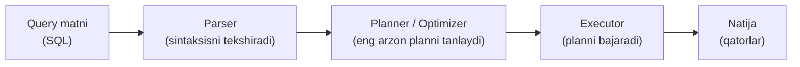
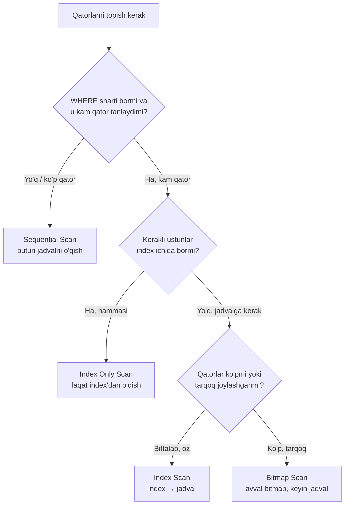
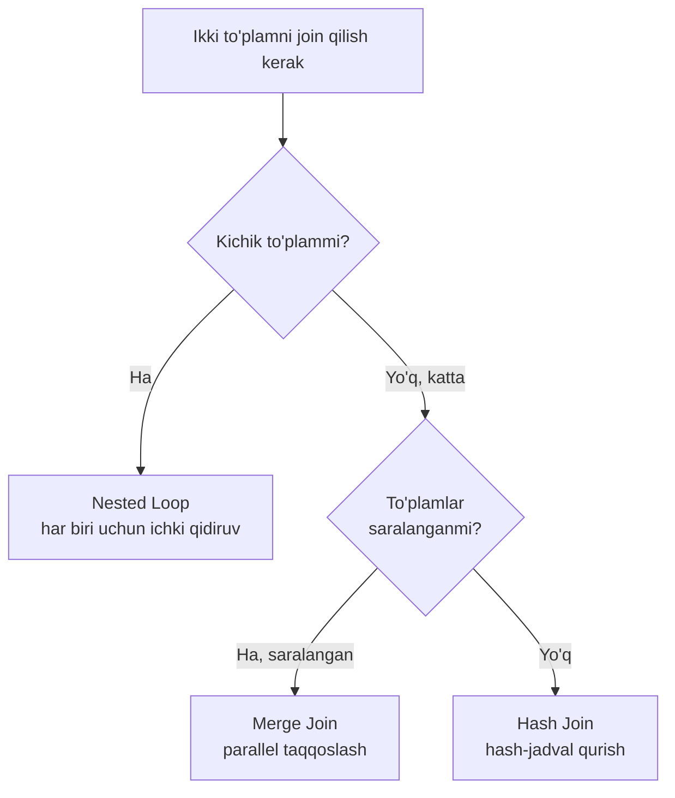

# 16. Performance — EXPLAIN va query optimizatsiya

> 📖 Manba: Моргунов, "PostgreSQL. Основы языка SQL", 10-bob

## Nima uchun kerak?

Bazadagi ma'lumotlar hajmi o'sib borgani sari bir xil query'lar sekinlashib
boradi. Kichik jadvalda millisekundda ishlagan so'rov, jadval millionlab
qatorga to'lganda soniyalab kutishga majbur qilishi mumkin. Aynan shu yerda
**performance** (unumdorlik) masalasi kelib chiqadi: bir xil natijani qanday
qilib tezroq olish mumkin?

Avvalgi darslarda biz `SELECT`, `JOIN`, `WHERE`, `ORDER BY` va `index`larni
o'rgandik. Ammo bitta muhim savolga javob bermadik: **PostgreSQL yozgan
query'imizni aynan qanday bajaradi?** Xuddi bir manzilga borishning bir necha
yo'li bo'lgani kabi, bitta query'ni ham server bir necha usulda bajarishi
mumkin. Ulardan qaysi biri eng tez ekanini server o'zi tanlaydi — bu qarorni
qabul qiladigan qism **planner** deb ataladi.

Bu darsda biz:

- query'ning "hayot yo'li"ni (parser → planner → executor) ko'ramiz;
- `EXPLAIN` buyrug'i orqali plannerning "fikrlash tarzi"ni o'qishni o'rganamiz;
- `scan` va `join` methodlari qachon tanlanishini tushunamiz;
- va oxirida sekin query'ni qanday tezlashtirishni amaliy misolda ko'ramiz.

Bu darsdagi barcha misollar kursimiz davomida ishlatib kelgan demo
"Aviaqatnovlar" bazasi (jadvallar: `aircrafts`, `seats`, `bookings`, `tickets`,
`ticket_flights`, `routes`) asosida beriladi.

---

## 1. Query qanday bajariladi: parser → planner → executor

Siz `psql`da bitta `SELECT` yozib, `Enter` bosganingizda, server orqada bir
necha bosqichni bosib o'tadi. Buni pochta xatiga o'xshatish mumkin: siz xat
yozasiz (query), uni tekshiradilar (parser), yetkazib berishning eng qulay
marshrutini tanlaydilar (planner), keyin kuryer haqiqatan yetkazib beradi
(executor).



Bosqichlarni tushuntiramiz:

1. **Parser** — query matnini o'qib, sintaksisni tekshiradi. Xato yozgan
   bo'lsangiz (masalan `SELET` deb), aynan shu bosqichda xato beradi. Parser
   query'ni serverga tushunarli ichki ko'rinishga (daraxtga) aylantiradi.

2. **Planner / Optimizer** — eng muhim va eng "aqlli" qism. U bitta query'ni
   bajarishning bir necha variantini (plan) tuzadi va har birining taxminiy
   "narxi"ni (cost) hisoblaydi. So'ng eng arzonini tanlaydi. Planner qaror
   qabul qilishda jadvallar haqidagi **statistika**ga (qancha qator bor, qiymatlar
   qanday taqsimlangan) tayanadi.

3. **Executor** — planner tanlagan planni amalda bajaradi: diskdan qatorlarni
   o'qiydi, `join`larni bajaradi, saralaydi va natijani qaytaradi.

Plan o'zi **daraxt** (tree) ko'rinishida bo'ladi. Daraxtning pastki tugunlari
(node) jadvaldan qatorlarni o'qish bilan shug'ullanadi, yuqoridagilari esa
`join`, saralash, agregatsiya kabi amallarni bajaradi. Aynan shu daraxtni bizga
`EXPLAIN` buyrug'i ko'rsatadi.

> Muhim tushuncha: **access method** (ma'lumotga kirish usuli) — jadvaldan kerakli
> qatorlarni qanday o'qib olish. **Join method** — ikki qator to'plamini qanday
> birlashtirish. Butun bob shu ikki tushuncha atrofida quriladi.

---

## 2. EXPLAIN bilan tanishuv: cost, rows, width

`EXPLAIN` buyrug'i query'ni **bajармaydi**, faqat planner tuzgan planni
ko'rsatadi. Eng oddiy misoldan boshlaymiz:

```sql
EXPLAIN SELECT *
  FROM aircrafts;
```

Natija:

```
                        QUERY PLAN
-----------------------------------------------------------
 Seq Scan on aircrafts  (cost=0.00..1.09 rows=9 width=52)
```

Bu yerda `aircrafts` jadvali kichkina va `WHERE` sharti yo'q, shuning uchun
planner butun jadvalni ketma-ket o'qishga (`Seq Scan`) qaror qildi. Qavs
ichidagi raqamlar — planning eng muhim qismi. Ularni birma-bir tahlil qilamiz:

| Parametr | Ma'nosi |
|----------|---------|
| `cost=0.00..1.09` | Ikki baho: birinchisi — **birinchi qatorni chiqara boshlashgacha** ketadigan resurs; ikkinchisi — **butun amalni oxirigacha** bajarish uchun ketadigan resurs |
| `rows=9` | Bu tugunda qaytariladigan qatorlar sonining **taxminiy** bahosi |
| `width=52` | Bir qatorning o'rtacha eni (bayt hisobida) |

**cost haqida muhim tafsilotlar:**

- **Birinchi raqam** (startup cost) — natijani chiqara boshlashdan oldin qancha
  ish qilish kerakligini bildiradi. Yuqoridagi misolda u `0.00` — chunki
  `Seq Scan` hech qanday tayyorgarliksiz darrov qator chiqara boshlaydi.
- **Ikkinchi raqam** (total cost) — butun amalni oxirigacha bajarish narxi.
  Planner har bir query uchun bir necha plan tuzadi va **eng kichik total cost**li
  planni tanlaydi.
- cost o'lchov birligi — shartli (условные единицы). U sekund yoki bayt emas.
  Muhimi — mutlaq qiymat emas, balki turli planlarning cost'larini **bir-biri
  bilan solishtirish**.

Agar raqamlar kerak bo'lmasa, ularni o'chirib qo'yish mumkin:

```sql
EXPLAIN ( COSTS OFF ) SELECT *
  FROM aircrafts;
```

```
       QUERY PLAN
------------------------
 Seq Scan on aircrafts
```

### WHERE qo'shsak nima o'zgaradi?

```sql
EXPLAIN SELECT *
  FROM aircrafts
  WHERE model ~ 'Air';
```

```
                        QUERY PLAN
-----------------------------------------------------------
 Seq Scan on aircrafts  (cost=0.00..1.11 rows=1 width=52)
   Filter: (model ~ 'Air'::text)
```

Endi planda yangi qator paydo bo'ldi — `Filter`. U qatorlarni saralash sharti.
`rows` bahosi 9 dan 1 ga o'zgardi (aslida esa 3 ta qator qaytadi — bu yerda
planner biroz noaniq baholadi). `Filter` degani: server barcha qatorlarni o'qib
chiqadi, so'ng shartga mos kelmaydiganlarini tashlab yuboradi.

### ORDER BY qo'shsak — saralash tuguni paydo bo'ladi

```sql
EXPLAIN SELECT *
  FROM aircrafts
  ORDER BY aircraft_code;
```

```
                          QUERY PLAN
-----------------------------------------------------------------
 Sort  (cost=1.23..1.26 rows=9 width=52)
   Sort Key: aircraft_code
   -> Seq Scan on aircrafts  (cost=0.00..1.09 rows=9 width=52)
```

Bu yerda bir necha nozik nuqta bor:

- `->` belgisi **bola tugun**ni (child node) bildiradi. Ya'ni pastdagi
  `Seq Scan` avval bajariladi, uning natijasi yuqoridagi `Sort` tugumiga beriladi.
- `aircraft_code` ustunida index bor (u primary key), lekin planner uni
  ishlatmadi! Jadval juda kichkina bo'lgani uchun index'dan foyda yo'q —
  ketma-ket o'qish arzonroq.
- `Sort` tugunining birinchi cost bahosi endi `1.23` — **noldan katta**. Chunki
  saralashni boshlash uchun avval hamma qatorni yig'ib olish, so'ng tartiblash
  kerak. Bu `1.23` ichiga pastdagi `Seq Scan`ning `1.09`i ham kiradi.

> **Eslatma:** kichik jadvalda index'ga murojaat qilish tezlik bermaydi, aksincha
> index sahifalarini ham qo'shimcha o'qish kerak bo'lgani uchun sekinlashtirishi
> mumkin.

---

## 3. Scan methodlari — jadvaldan qatorni qanday o'qib olish

Jadval va indexlar diskda **sahifa**lar (page) ko'rinishida saqlanadi (odatda
har biri 8 KB). Server ular bilan ishlash uchun sahifalarni xotiraga o'qib
oladi. Qatorlarni tanlab olishning bir necha usuli bor. Ularni jadvaldan kitob
o'qishga o'xshatib tushuntiramiz.



### 3.1. Sequential Scan (ketma-ket o'qish)

Jadvalning **barcha** sahifalarini boshidan oxirigacha o'qib chiqadi va shart
bo'yicha kerakligini tanlaydi. Index'ga umuman murojaat qilmaydi.

Qachon tanlanadi? Query'da `WHERE` yo'q bo'lsa, yoki jadvaldan qatorlarning
katta qismi tanlanadigan bo'lsa (ya'ni **selektivlik past** bo'lsa). Bunday
holatda index'dan foyda yo'q — baribir deyarli hamma qatorni o'qish kerak.

Bu — kitobning boshidan oxirigacha varaqlab, kerakli sahifalarni topishga
o'xshaydi. Agar deyarli hamma sahifa kerak bo'lsa, mundarijadan foydalanishning
ma'nosi yo'q.

### 3.2. Index Scan (index bo'yicha o'qish)

Avval index'dan kerakli kalitni topadi. Index'da har bir kalit uchun qatorning
noyob identifikatori bor. Shu identifikator bo'yicha jadvalning kerakli
sahifasiga borib, qatorni o'qib oladi.

`bookings` jadvalida index'ni ko'rish uchun (`book_ref` bo'yicha primary key
index mavjud):

```sql
EXPLAIN SELECT *
  FROM bookings
  ORDER BY book_ref;
```

```
                              QUERY PLAN
------------------------------------------------------------------
 Index Scan using bookings_pkey on bookings
   (cost=0.42..8511.24 rows=262788 width=21)
```

E'tibor bering: birinchi cost bahosi `0.42` — noldan katta. Chunki index
tartiblangan bo'lsa-da, birinchi qatorni tartib bo'yicha topish uchun ham biroz
vaqt ketadi.

`WHERE` sharti qo'shsak:

```sql
EXPLAIN SELECT *
  FROM bookings
  WHERE book_ref > '0000FF' AND book_ref < '000FFF'
  ORDER BY book_ref;
```

```
                              QUERY PLAN
------------------------------------------------------------------
 Index Scan using bookings_pkey on bookings
   (cost=0.42..9.50 rows=54 width=21)
   Index Cond: ((book_ref > '0000FF'::bpchar) AND (book_ref < '000FFF'::bpchar))
```

Muhim farq: ustun index'langani uchun tanlash `Filter` orqali emas, balki
`Index Cond` orqali amalga oshiriladi. Bu ancha samaraliroq — chunki server
kerakmas qatorlarni umuman o'qimaydi, to'g'ridan-to'g'ri index orqali topadi.

> **Diqqat:** Index'dagi yozuvlar tartiblangan, lekin jadval sahifalariga
> murojaat tartibsiz (xaotik) bo'ladi, chunki qatorlar jadvalda tartiblanmagan.
> Agar juda ko'p qator tanlansa, index bo'yicha qidiruv tezlik bermasligi, hatto
> sekinlashtirishi ham mumkin.

### 3.3. Index Only Scan (faqat index bo'yicha o'qish)

Nomidan ko'rinib turibdiki, bu usul jadval qatorlariga murojaat qilmasligi
kerak — chunki kerakli barcha ma'lumot index'ning o'zida bor. Lekin bir muammo
bor: index'da qatorning **ko'rinuvchanligi** (visibility) haqida ma'lumot yo'q.
Ya'ni index'dan olingan ma'lumot joriy tranzaksiyaga ko'rinadimi yoki yo'q —
buni index bilmaydi.

Shuning uchun server avval **visibility map**ga (ko'rinuvchanlik xaritasi)
murojaat qiladi. Bu xarita har bir jadval uchun mavjud va juda kichik. Unda bitta
bit orqali barcha tranzaksiyalarga ko'rinadigan qatorlar joylashgan sahifalar
belgilangan. Agar qator shunday sahifada bo'lsa — jadvalga borishning hojati yo'q.

```sql
EXPLAIN SELECT book_ref
  FROM bookings
  WHERE book_ref < '000FFF'
  ORDER BY book_ref;
```

```
                              QUERY PLAN
------------------------------------------------------------------
 Index Only Scan using bookings_pkey on bookings
   (cost=0.42..9.42 rows=57 width=7)
   Index Cond: (book_ref < '000FFF'::bpchar)
```

Bu usul, ayniqsa, ma'lumot kam o'zgarganda juda samarali. Faqat `SELECT`da
index yaratilgan ustunlar ko'rsatilgan bo'lsa ishlaydi.

### 3.4. Bitmap Scan (bitmap bo'yicha o'qish)

Bu — Index Scan'ning takomillashtirilgan varianti. G'oyasi: avval index bo'yicha
barcha kerakli qatorlarni topib, **bitmap** (bit xaritasi) tuziladi. Unda bu
qatorlar jadvalning qaysi sahifalarida joylashgani ko'rsatiladi. So'ng jadvaldan
qatorlar o'qiladi, lekin **har bir sahifaga faqat bir marta** murojaat qilinadi.

Bu Index Scan'ning muammosini hal qiladi: oddiy Index Scan'da bir sahifaga bir
necha marta tartibsiz murojaat bo'lishi mumkin, Bitmap Scan esa avval "reja"
tuzib, keyin har sahifaga bir marta boradi.

```sql
EXPLAIN SELECT *
  FROM seats
  WHERE aircraft_code = 'SU9';
```

```
                              QUERY PLAN
------------------------------------------------------------------
 Bitmap Heap Scan on seats  (cost=5.03..14.24 rows=97 width=15)
   Recheck Cond: (aircraft_code = 'SU9'::bpchar)
   -> Bitmap Index Scan on seats_pkey  (cost=0.00..5.00 rows=97 width=0)
        Index Cond: (aircraft_code = 'SU9'::bpchar)
```

Planni pastdan yuqoriga o'qiymiz:

- **Bitmap Index Scan** (pastki tugun) — index bo'yicha qidiruv qilib, bitmap
  tuzadi. E'tibor bering, `width=0` — chunki bu bosqichda qatorlarning o'zi hali
  tanlanmaydi, faqat qaysi sahifada ekani belgilanadi.
- **Bitmap Heap Scan** (yuqori tugun) — tayyor bitmap yordamida jadval
  (heap) sahifalarini o'qiydi. `Recheck Cond` — sahifadagi qatorlarni yana bir
  bor shart bo'yicha tekshiradi.

---

## 4. Join methodlari — ikki qator to'plamini birlashtirish

Avvalgi darslarda `JOIN` orqali jadvallarni birlashtirishni o'rgangan edik.
`JOIN` — bu SQL tilining yuqori darajali, mantiqiy tushunchasi. Server esa uni
**join method** orqali amalda bajaradi. Muhim jihat: bir vaqtda faqat **ikkita**
qator to'plami birlashtiriladi.

Uch xil join method bor. Ularni telefon kitobchasidan odam qidirishga o'xshatib
tushuntiramiz.



### 4.1. Nested Loop (ichki tsikl)

"Tashqi" to'plamdagi har bir qatorni oladi va uning har biri uchun "ichki"
to'plamdan mos qatorni qidiradi. Topilsa — birlashtiradi.

Bu — bir dasta ismni olib, har biri uchun telefon kitobchasidan raqam
qidirishga o'xshaydi. Agar ismlar kam bo'lsa — tez, ko'p bo'lsa — sekin.

Xususiyatlari: tayyorgarlik talab qilmaydi, shuning uchun natijani darrov chiqara
boshlaydi. **Kichik to'plamlar** uchun samarali. Har qanday shart (nafaqat
tenglik) bilan ishlaydi.

`seats` va `aircrafts` jadvallarini birlashtiramiz:

```sql
EXPLAIN SELECT a.aircraft_code,
    a.model,
    s.seat_no,
    s.fare_conditions
  FROM seats s
    JOIN aircrafts a ON s.aircraft_code = a.aircraft_code
  WHERE a.model ~ '^Air'
  ORDER BY s.seat_no;
```

```
                              QUERY PLAN
------------------------------------------------------------------
 Sort  (cost=23.28..23.65 rows=149 width=59)
   Sort Key: s.seat_no
   -> Nested Loop  (cost=5.43..17.90 rows=149 width=59)
        -> Seq Scan on aircrafts a  (cost=0.00..1.11 rows=1 width=48)
             Filter: (model ~ '^Air'::text)
        -> Bitmap Heap Scan on seats s  (cost=5.43..15.29 rows=149 width=15)
             Recheck Cond: (aircraft_code = a.aircraft_code)
             -> Bitmap Index Scan on seats_pkey  (cost=0.00..5.39 rows=149 width=0)
                  Index Cond: (aircraft_code = a.aircraft_code)
```

Bu yerda `Nested Loop`ning ikkita bola tuguni bor:

- **Tashqi** (outer) — `aircrafts` jadvali ketma-ket o'qiladi va `model ~ '^Air'`
  shartiga mos qatorlar tanlanadi.
- **Ichki** (inner) — har bir tanlangan `aircrafts` qatori uchun `seats`
  jadvalidan index orqali mos qatorlar qidiriladi.

Yuqori tugunda natija `seat_no` bo'yicha saralanadi.

### 4.2. Hash Join (hash bilan birlashtirish)

Bir to'plamning qatorlaridan xotirada **hash-jadval** tuziladi. So'ng ikkinchi
to'plamning har bir qatori uchun hash-jadvalda mos qator borligini tekshiradi.
Hash-jadvalning kaliti — join qilinayotgan ustun.

Bu — bir dasta odamning ismini oldindan alifbo bo'yicha kartochkalarga yozib
qo'yib, keyin har bir yangi ismni shu kartochkalar orasidan tez topishga
o'xshaydi. Kartochkalarni tuzishga vaqt ketadi, lekin keyingi qidiruvlar juda
tez.

Xususiyatlari: hash-jadval odatda **kichikroq** to'plamdan quriladi (tezroq
qidirish uchun). Faqat **tenglik** (`=`) sharti bilan ishlaydi. **Katta
to'plamlar** uchun samarali.

`routes` va `aircrafts` jadvallarini birlashtiramiz:

```sql
EXPLAIN SELECT r.flight_no,
    r.departure_airport_name,
    r.arrival_airport_name,
    a.model
  FROM routes r
    JOIN aircrafts a ON r.aircraft_code = a.aircraft_code
  ORDER BY flight_no;
```

```
                              QUERY PLAN
------------------------------------------------------------------
 Sort  (cost=24.25..24.31 rows=21 width=124)
   Sort Key: r.flight_no
   -> Hash Join  (cost=1.20..23.79 rows=21 width=124)
        Hash Cond: (r.aircraft_code = a.aircraft_code)
        -> Seq Scan on routes r  (cost=0.00..20.64 rows=464 width=108)
        -> Hash  (cost=1.09..1.09 rows=9 width=48)
             -> Seq Scan on aircrafts a  (cost=0.00..1.09 rows=9 width=48)
```

Eng ichki darajada `aircrafts` (9 qator, kichikroq) o'qilib, undan hash-jadval
tuziladi. Keyin `routes` (464 qator) o'qilib, har bir qatori uchun
`aircraft_code` hash-jadval kalitlari orasidan qidiriladi. Hash-jadval kichikroq
jadvaldan qurilgani bejiz emas — bu qidiruvni tezlashtiradi.

### 4.3. Merge Join (birlashtirib saralash)

"Merge sort" (birlashtirib saralash) algoritmiga o'xshaydi. Ikkala to'plam ham
join ustuni bo'yicha **oldindan saralangan** bo'lishi kerak. So'ng ikkala
to'plam parallel ravishda o'qiladi va qiymatlar taqqoslanadi. Qiymatlar mos
kelganda — natija qatori hosil bo'ladi. Bu jarayon ikkala to'plam tugaguncha
davom etadi.

Bu — ikkita alifbo bo'yicha saralangan ro'yxatni yonma-yon qo'yib, barmoq bilan
birga pastga tushib borib, mos ismlarni topishga o'xshaydi.

Xususiyatlari: faqat **tenglik** sharti bilan ishlaydi. **Katta to'plamlar**
uchun juda qulay.

`tickets` va `ticket_flights` jadvallarini birlashtiramiz:

```sql
EXPLAIN SELECT t.ticket_no,
    t.passenger_name,
    tf.flight_id,
    tf.amount
  FROM tickets t
    JOIN ticket_flights tf ON t.ticket_no = tf.ticket_no
  ORDER BY t.ticket_no;
```

```
                              QUERY PLAN
------------------------------------------------------------------
 Merge Join  (cost=1.51..98276.90 rows=1045726 width=40)
   Merge Cond: (t.ticket_no = tf.ticket_no)
   -> Index Scan using tickets_pkey on tickets t
        (cost=0.42..17230.42 rows=366733 width=30)
   -> Index Scan using ticket_flights_pkey on ticket_flights tf
        (cost=0.42..67058.74 rows=1045726 width=24)
```

Ikkala bola tugun jadvallarni **index bo'yicha** o'qiydi (`Index Scan`). Demak
to'plamlar allaqachon saralangan holda keladi — shuning uchun alohida saralash
tuguni kerak emas. E'tibor bering: `Merge Join`ning birinchi cost bahosi `1.51` —
pastki tugunlarning bahosidan (17230.42 va 67058.74) ancha kichik. Ya'ni natija
qatorlarini chiqarish, asosiy jadvallarni o'qib bo'lishdan ancha oldin boshlanadi.

---

## 5. EXPLAIN ANALYZE — haqiqiy vaqtni o'lchash

`EXPLAIN` faqat plannerning **taxmin**ini ko'rsatadi. `EXPLAIN ANALYZE` esa
query'ni **haqiqatan bajaradi** va rostakam sarflangan vaqt hamda haqiqiy qator
sonini ko'rsatadi. (Query bajarilsa-da, natija qatorlari ekranga chiqarilmaydi.)

```sql
EXPLAIN ANALYZE
  SELECT t.ticket_no,
      t.passenger_name,
      tf.flight_id,
      tf.amount
    FROM tickets t
      JOIN ticket_flights tf ON t.ticket_no = tf.ticket_no
    ORDER BY t.ticket_no;
```

```
                              QUERY PLAN
------------------------------------------------------------------
 Merge Join  (cost=1.51..98276.90 rows=1045726 width=40)
   (actual time=0.087..10642.643 rows=1045726 loops=1)
   Merge Cond: (t.ticket_no = tf.ticket_no)
   -> Index Scan using tickets_pkey on tickets t
        (cost=0.42..17230.42 rows=366733 width=30)
        (actual time=0.031..762.460 rows=366733 loops=1)
   -> Index Scan using ticket_flights_pkey on ticket_flights tf
        (cost=0.42..67058.74 rows=1045726 width=24)
        (actual time=0.006..7743.705 rows=1045726 loops=1)
 Planning time: 122.347 ms
 Execution time: 10948.791 ms
```

Yangi paydo bo'lgan `actual` qismini o'qiymiz:

| Parametr | Ma'nosi |
|----------|---------|
| `actual time=0.087..10642.643` | **Haqiqiy** vaqt (millisekundda): birinchi qatorgacha va oxirigacha |
| `rows=1045726` | **Haqiqiy** qaytgan qatorlar soni |
| `loops=1` | Bu tugun necha marta bajarilgani |
| `Planning time` | Planni tuzishga ketgan vaqt |
| `Execution time` | Query'ni bajarishga ketgan umumiy vaqt |

Diqqat qilinadigan asosiy narsa: planner qator sonini qanchalik aniq baholagan.
Bu misolda jadvallar tashqi kalit (foreign key) bilan bog'langan va `WHERE` yo'q,
shuning uchun baho (1045726) haqiqat bilan aynan mos keldi — bu plannerning yaxshi
ishlagani.

> **Muhim:** cost (shartli birlik) va actual time (millisekund) — har xil
> narsalar, ular mos kelmaydi. Bundan tashqari, haqiqiy vaqt turli
> kompyuterlarda, hatto bir kompyuterda takroriy bajarilganda ham farq qiladi
> (kesh va buferlash tufayli). Odatda ikkinchi bajarilish birinchisidan tezroq
> bo'ladi.

### loops — takrorlanishlar soni

`loops` parametri, ayniqsa, `Nested Loop`da muhim. Bir tugun bir necha marta
bajarilsa, `actual time` **bitta bajarilishning** vaqtini ko'rsatadi. Umumiy
vaqtni bilish uchun `actual time`ni `loops`ga ko'paytirish kerak.

```sql
EXPLAIN (ANALYZE, COSTS OFF)
  SELECT a.aircraft_code, a.model, s.seat_no, s.fare_conditions
    FROM seats s
      JOIN aircrafts a ON s.aircraft_code = a.aircraft_code
    WHERE a.model ~ '^Air'
    ORDER BY s.seat_no;
```

```
                              QUERY PLAN
------------------------------------------------------------------
 Sort (actual time=3.423..3.666 rows=426 loops=1)
   Sort Key: s.seat_no
   Sort Method: quicksort  Memory: 46kB
   -> Nested Loop (actual time=0.236..0.993 rows=426 loops=1)
        -> Seq Scan on aircrafts a (actual time=0.100..0.112 rows=3 loops=1)
             Filter: (model ~ '^Air'::text)
             Rows Removed by Filter: 6
        -> Bitmap Heap Scan on seats s (actual time=0.080..0.154 rows=142 loops=3)
             Recheck Cond: (aircraft_code = a.aircraft_code)
             Heap Blocks: exact=6
             -> Bitmap Index Scan on seats_pkey (actual time=0.064..0.064 rows=142 loops=3)
                  Index Cond: (aircraft_code = a.aircraft_code)
 Planning time: 0.554 ms
 Execution time: 3.840 ms
```

Bu yerda `seats` bo'yicha scan uchun `loops=3` — chunki `aircrafts`dan haqiqatan
3 qator tanlangan va har biri uchun `seats`da qidiruv bajarilgan. `Bitmap Index
Scan`ning umumiy vaqti: `0.064 × 3 = 0.192` ms. `Rows Removed by Filter: 6` —
filtr tashlab yuborgan qatorlar soni. `Sort Method: quicksort Memory: 46kB` —
saralash xotirada quicksort usulida bajarilgani.

### Ma'lumotni o'zgartiradigan query'ni tekshirish

`UPDATE`, `DELETE`, `INSERT`ni `EXPLAIN ANALYZE` bilan tekshirsak, ular
**haqiqatan bajariladi**. O'zgarish yuz bermasligi uchun tranzaksiya ochib,
oxirida `ROLLBACK` qilish kerak:

```sql
BEGIN;

EXPLAIN (ANALYZE, COSTS OFF)
  UPDATE aircrafts
    SET range = range + 100
    WHERE model ~ '^Air';

ROLLBACK;
```

```
                              QUERY PLAN
------------------------------------------------------------------
 Update on aircrafts (actual time=0.299..0.299 rows=0 loops=1)
   -> Seq Scan on aircrafts (actual time=0.111..0.121 rows=3 loops=1)
        Filter: (model ~ '^Air'::text)
        Rows Removed by Filter: 6
 Planning time: 0.235 ms
 Execution time: 0.414 ms
```

`ROLLBACK` tufayli o'zgarishlar bekor qilinadi va jadval o'zgarishsiz qoladi.

> **Ogohlantirish:** kichik jadval uchun olingan bahoni katta jadvalga
> "cho'zib" (ekstrapolyatsiya qilib) bo'lmaydi. Chunki turli hajmdagi jadvallar
> uchun planner **butunlay boshqa plan** tanlashi mumkin: kichik jadvalga
> Sequential Scan, kattasiga Index Scan.

---

## 6. Plannerni boshqarish (enable_* parametrlari)

Planner odatda to'g'ri qaror qabul qiladi. Lekin uni **o'rganish** maqsadida
biz turli methodlarni majburan o'chirib, planning qanday o'zgarishini ko'rishimiz
mumkin. Buning uchun `SET` buyrug'idan foydalaniladi — u parametrni faqat joriy
sessiya uchun o'zgartiradi.

| Buyruq | Nima o'chiradi |
|--------|----------------|
| `SET enable_seqscan = off;` | Sequential Scan |
| `SET enable_indexscan = off;` | Index Scan |
| `SET enable_indexonlyscan = off;` | Index Only Scan |
| `SET enable_bitmapscan = off;` | Bitmap Scan |
| `SET enable_nestloop = off;` | Nested Loop |
| `SET enable_hashjoin = off;` | Hash Join |
| `SET enable_mergejoin = off;` | Merge Join |

Sukut bo'yicha (default) barcha parametrlar `on` (yoqilgan).

> **Muhim nozik jihat:** bu buyruqlar methodni **butunlay taqiqlamaydi**. Ular
> shunchaki o'sha methodga juda katta cost belgilaydi. Planner baribir imkoniyat
> qoldiradi va zarur bo'lsa hatto "taqiqlangan" methodni ham ishlatishi mumkin.

Misol: Merge Join'ni o'chirib, oldingi query'ni takrorlaymiz:

```sql
SET enable_mergejoin = off;

EXPLAIN SELECT t.ticket_no,
    t.passenger_name,
    tf.flight_id,
    tf.amount
  FROM tickets t
    JOIN ticket_flights tf ON t.ticket_no = tf.ticket_no
  ORDER BY t.ticket_no;
```

```
                              QUERY PLAN
------------------------------------------------------------------
 Sort  (cost=226400.55..229014.87 rows=1045726 width=40)
   Sort Key: t.ticket_no
   -> Hash Join  (cost=16824.49..64658.49 rows=1045726 width=40)
        Hash Cond: (tf.ticket_no = t.ticket_no)
        -> Seq Scan on ticket_flights tf  (cost=0.00..18692.26 rows=1045726 width=24)
        -> Hash  (cost=9733.33..9733.33 rows=366733 width=30)
             -> Seq Scan on tickets t  (cost=0.00..9733.33 rows=366733 width=30)
```

Endi planner Merge Join o'rniga Hash Join tanladi. Lekin cost ancha yuqori
(`226400.55..229014.87` — avval `1.51..98276.90` edi!). Demak Merge Join bu
holatda samaraliroq ekan. Tajribadan so'ng parametrni qaytarib qo'yamiz:

```sql
SET enable_mergejoin = on;
```

> **Amaliy maslahat:** ishlab turgan (production) bazada bu parametrlarni
> o'zgartirmang. Ular faqat o'rganish va planning qanday tuzilishini tushunish
> uchun. Plannerni "tuzatish" uchun katta tajriba kerak.

---

## 7. Query optimizatsiya — amaliy maslahatlar (10.5)

Query'ni tezlashtirishdan oldin bitta savolga javob bering: **buni
tezlashtirishga arziydimi?** Query bir necha millisekundda ishlashi mumkin, lekin
agar u kuniga minglab marta chaqirilsa — server resurslari juda ko'p sarflanadi
va tezlashtirish o'rinli. Aksincha, oyiga bir marta ishlaydigan hisobot query'si
uchun bir necha millisekundni tejashga urinish ma'nosiz.

Query tezligiga ta'sir qiladigan asosiy usullar:

- **Statistikani yangilash** — planner shu statistikaga tayanib plan tuzadi.
  `ANALYZE aircrafts;` buyrug'i statistikani majburan yangilaydi. Eskirgan
  statistika noto'g'ri plan tanlanishiga olib keladi.
- **Query kodini o'zgartirish** — bir xil natijani boshqacha yozish (masalan,
  korrelatsiyalangan subquery o'rniga `JOIN`).
- **Sxemani o'zgartirish (denormalizatsiya)** — index yaratish, materialized
  view va vaqtinchalik jadvallar, hisoblanadigan ustunlar.
- **Planner parametrlari** — yuqorida ko'rgan `enable_*` va join tartibini
  boshqaradigan parametrlar (`join_collapse_limit`, `from_collapse_limit`).

### Amaliy misol: sekin query'ni tezlashtirish

**Vazifa:** 2016-yil sentyabr oyida aviakompaniya kassirlarining yuklamasini
aniqlash kerak. Ya'ni: nechta bronlash operatsiyasida bitta chipta, nechtasida
ikkita chipta va hokazo rasmiylashtirilgani hisoblanishi kerak.

Boshlang'ich yechim — `SELECT` ichida korrelatsiyalangan subquery:

```sql
EXPLAIN
  SELECT num_tickets, count( * ) AS num_bookings
    FROM
      ( SELECT b.book_ref,
          ( SELECT count( * ) FROM tickets t
              WHERE t.book_ref = b.book_ref
          )
        FROM bookings b
        WHERE date_trunc( 'mon', book_date ) = '2016-09-01'
      ) AS count_tickets( book_ref, num_tickets )
    GROUP by num_tickets
    ORDER BY num_tickets DESC;
```

```
                              QUERY PLAN
------------------------------------------------------------------
 GroupAggregate  (cost=14000017.12..27994373.35 rows=1314 width=16)
   Group Key: ((SubPlan 1))
   -> Sort  (cost=14000017.12..14000020.40 rows=1314 width=8)
        Sort Key: ((SubPlan 1)) DESC
        -> Seq Scan on bookings b  (cost=0.00..13999949.05 rows=1314 width=8)
             Filter: (date_trunc('mon'::text, book_date) = '2016-09-01 ...')
             SubPlan 1
             -> Aggregate  (cost=10650.17..10650.18 rows=1 width=8)
                  -> Seq Scan on tickets t  (cost=0.00..10650.16 rows=2 width=0)
                       Filter: (book_ref = b.book_ref)
```

Diqqat qiling: cost **juda ulkan** — `14000017.12..27994373.35`. Sababi: planner
subquery'da `tickets` jadvalini har safar **ketma-ket** (Seq Scan) o'qiydi, va
buni `bookings`ning har bir qatori uchun (taxminan 1314 marta) takrorlaydi.
Bunday query kuchsiz kompyuterda soatlab ishlashi mumkin.

**Yechim 1 — index yaratish.** `tickets` jadvalining `book_ref` ustuniga index
qo'shamiz (subquery aynan shu ustun bo'yicha qidiryapti):

```sql
CREATE INDEX tickets_book_ref_key
  ON tickets ( book_ref );
```

Endi `EXPLAIN ANALYZE` bilan takrorlaymiz:

```
                              QUERY PLAN
------------------------------------------------------------------
 GroupAggregate  (cost=22072.70..38484.52 rows=1314 width=16)
   (actual time=3656.554..3787.562 rows=5 loops=1)
   ...
   -> Seq Scan on bookings b (actual time=0.219..3332.162 rows=165534 loops=1)
        SubPlan 1
        -> Aggregate  (cost=12.46..12.47 rows=1 width=8) (actual ... loops=165534)
             -> Index Only Scan using tickets_book_ref_key on tickets t
                  (cost=0.42..12.46 rows=2 width=0) (actual ... loops=165534)
                  Index Cond: (book_ref = b.book_ref)
                  Heap Fetches: 230699
 Planning time: 0.290 ms
 Execution time: 3788.690 ms
```

Endi planner `tickets`ni index orqali qidiradi — hatto **Index Only Scan**,
chunki bizga faqat qatorlar soni (`count(*)`) kerak, mazmuni emas. Query **tartib
darajasida** (bir necha barobar) tezlashdi.

Natija:

```
 num_tickets | num_bookings
-------------+--------------
           5 |           13
           4 |          536
           3 |         7966
           2 |        47573
           1 |       109446
```

Ya'ni: bir chiptali 109446 ta bronlash, ikki chiptali 47573 ta va hokazo.

**Yechim 2 — query kodini o'zgartirish.** Index yaratmasdan ham, korrelatsiyalangan
subquery'ni oddiy `JOIN`ga aylantirish orqali tezlashtirish mumkin edi:

```sql
EXPLAIN ANALYZE
  SELECT num_tickets, count( * ) AS num_bookings
    FROM
      ( SELECT b.book_ref, count( * )
        FROM bookings b, tickets t
        WHERE date_trunc( 'mon', b.book_date ) = '2016-09-01'
          AND t.book_ref = b.book_ref
        GROUP BY b.book_ref
      ) AS count_tickets( book_ref, num_tickets )
    GROUP by num_tickets
    ORDER BY num_tickets DESC;
```

Bu planda server **Hash Join**ni tanlaydi (`tickets` index'siz, ketma-ket
o'qiladi). Vaqt jihatidan bu variant birinchisidan (index bilan) biroz sekinroq
chiqdi. Xulosa: bitta query'ni tezlashtirishning bir necha yo'li bor —
**index yaratish** yoki **query'ni qayta yozish**, ba'zan index yaratmasdan ham.

---

## Xulosa

- Har bir query serverda uch bosqichdan o'tadi: **parser** (sintaksis) →
  **planner** (eng arzon planni tanlaydi) → **executor** (bajaradi).
- **`EXPLAIN`** planni ko'rsatadi (bajarmaydi), **`EXPLAIN ANALYZE`** esa haqiqatan
  bajarib, real vaqtni o'lchaydi.
- Plan daraxt shaklida bo'ladi; `->` belgisi bola tugunni bildiradi, uni **pastdan
  yuqoriga** o'qiymiz.
- Cost ko'rsatkichlari: `cost=startup..total`, `rows` (qator soni bahosi),
  `width` (qator eni). Cost — shartli birlik, faqat solishtirish uchun.
- **Scan methodlari:** kichik jadval / ko'p qator → Sequential Scan; kam qator →
  Index Scan; kerakli ustunlar index'da → Index Only Scan; tarqoq ko'p qator →
  Bitmap Scan.
- **Join methodlari:** kichik to'plam → Nested Loop; katta + saralangan → Merge
  Join; katta + tenglik sharti → Hash Join. Hash va Merge faqat tenglik (`=`)
  bilan ishlaydi.
- Plannerni `enable_*` parametrlari orqali "o'rganish uchun" boshqarish mumkin,
  lekin production bazada tegmang.
- Query optimizatsiya: avval **arziydimi** deb o'ylang; keyin **statistikani
  yangilang**, **index qo'shing** yoki **query'ni qayta yozing**.

### Eslab qol

1. `EXPLAIN` — bajarmaydi (faqat plan), `EXPLAIN ANALYZE` — bajaradi (real vaqt).
2. Planni **pastdan yuqoriga** o'qing.
3. Cost ikkita: **birinchi** — birinchi qatorgacha, **ikkinchi** — oxirigacha.
4. Kichik jadvalda index'dan foyda yo'q — planner Seq Scan tanlaydi.
5. `UPDATE`/`DELETE`ni `EXPLAIN ANALYZE` bilan tekshirsangiz — `BEGIN ... ROLLBACK`
   ichida qiling.
6. Kichik jadval bahosini katta jadvalga "cho'zib" bo'lmaydi.
7. Sekin query'ning eng ko'p tarqalgan sababi — kerakli **index yo'qligi**.

### Amaliyot

1. `EXPLAIN SELECT * FROM flights WHERE flight_no = 'PG0001';` ni bajaring.
   Qaysi scan method tanlandi? Endi `flight_no` ustuniga index yarating va
   qaytadan ko'ring — plan o'zgardimi?
2. `EXPLAIN ANALYZE` bilan ikkita jadvalni `JOIN` qiluvchi query yozing. Qaysi
   join method tanlandi? `SET enable_hashjoin = off;` qilib, plan qanday
   o'zgarishini kuzating. So'ng `on` ga qaytaring.
3. `Index Only Scan` yuzaga keladigan query yozib ko'ring (faqat index'langan
   ustunni `SELECT` qiling). Keyin o'sha ustun bilan birga index'da yo'q ustunni
   qo'shsangiz, plan qanday o'zgaradi?
4. Bitta query'da `actual` va bahoviy `rows` ni solishtiring. Ular juda farq
   qilsa, `ANALYZE <jadval>;` bajarib, statistikani yangilang va qaytadan
   tekshiring.
5. Katta jadvalga `count(*)` qiluvchi, `WHERE` sharti bo'lgan query yozing.
   `WHERE` ustuniga index qo'shishdan oldin va keyin `Execution time`ni
   solishtiring.

---

## Nazorat savollari

1. Query serverda qaysi uch bosqichdan o'tadi va har biri nima qiladi?
2. `EXPLAIN` va `EXPLAIN ANALYZE` o'rtasidagi asosiy farq nima? Qaysi biri
   query'ni haqiqatan bajaradi?
3. `cost=0.42..9.50` yozuvidagi ikki raqam nimani anglatadi? `rows` va `width`-chi?
4. Planner qaysi hollarda Index Scan o'rniga Sequential Scan'ni tanlaydi?
5. Index Only Scan qanday ishlaydi va nima uchun unga **visibility map** kerak?
6. Nested Loop, Hash Join va Merge Join — har biri qaysi vaziyatda samarali?
   Ulardan qaysilari faqat tenglik (`=`) sharti bilan ishlaydi?
7. `SET enable_mergejoin = off;` buyrug'i Merge Join'ni butunlay taqiqlaydimi?
   Javobingizni izohlang.
8. `UPDATE` query'sining planini jadvalni haqiqatan o'zgartirmasdan qanday
   tekshirish mumkin?
