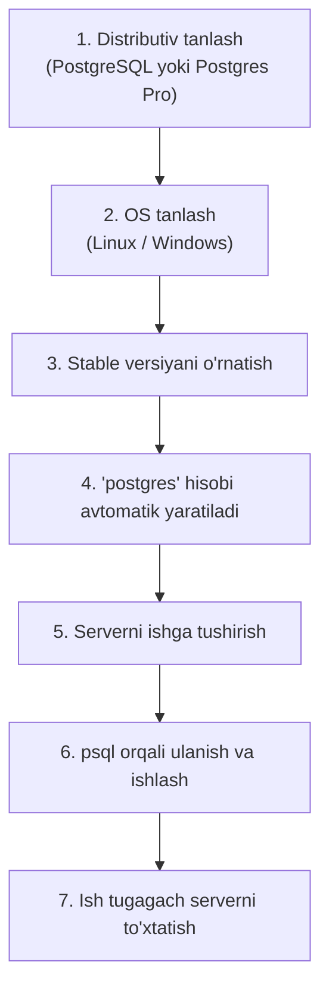
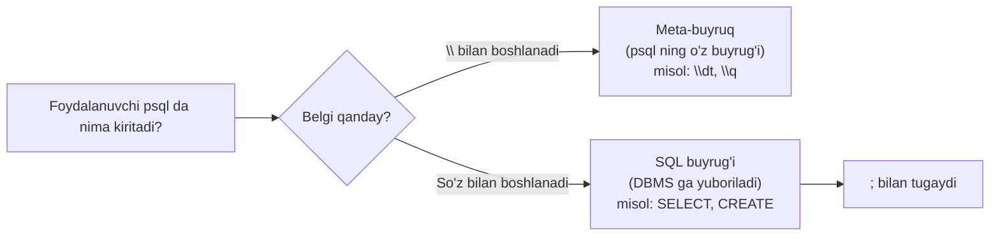
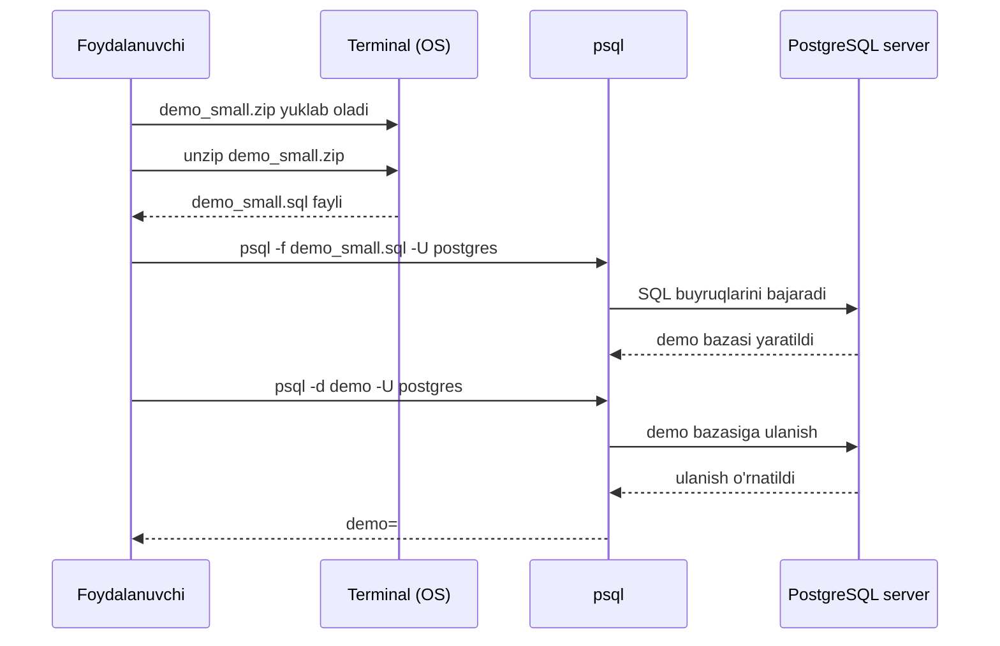

# 2. Ish muhiti — psql va demo baza

> 📖 Manba: Моргунов, "PostgreSQL. Основы языка SQL", 2-bob

## Nima uchun kerak?

Oldingi darsda biz database nima ekanini va SQL tilining guruhlarini nazariy o'rgandik. Endi amaliy ish boshlashdan oldin, o'zimizga **ish muhiti** tayyorlashimiz kerak — ya'ni PostgreSQL serverini o'rnatib, unga ulanadigan client dasturni ishga tushirishimiz kerak.

Bu darsda uch narsani o'rganamiz:

1. PostgreSQL DBMS ni qanday o'rnatish (qisqacha).
2. **psql** interaktiv terminalidan qanday foydalanish va uning asosiy meta-buyruqlari.
3. o'quv "Aviaqatnovlar" bazasini (demo) qanday yuklab o'rnatish.

SQL ni o'rganishdan avval PostgreSQL serveriga kirish huquqi bo'lishi kerak. Buni kompyuter sinfida yoki uzoq serverga terminal orqali ulanib qilish mumkin. Ammo eng qulayi — o'z kompyuteringizga PostgreSQL ning to'liq versiyasini (server + client dasturlar) o'rnatishdir. Bunda sizda sozlash va foydalanish bo'yicha ancha ko'p imkoniyat bo'ladi.

---

## 2.1. DBMS ni o'rnatish

Kitob SQL tilini o'rganishga bag'ishlangani uchun (PostgreSQL administratsiyasiga emas), o'rnatish bo'yicha faqat qisqa ko'rsatmalar beriladi.

### Distributiv tanlash

Avval qaysi **distributiv**ni o'rnatishni tanlaysiz:

- **Original PostgreSQL** — asl variant.
- **Postgres Pro** — Postgres Professional kompaniyasi taklif qiladigan variant. Unda standart distributivning barcha funksiyalari, hamda kompaniyaning qo'shimcha ishlanmalari mavjud.

SQL asoslarini o'rganish uchun ikkalasi ham teng darajada mos keladi. Ammo hujjatlar **rus tilida** faqat Postgres Pro tarkibiga kiritilgan.

### OS tanlash va o'rnatish manzillari

Distributivni tanlaganingizdan keyin **operatsion tizim** (OS) ni tanlaysiz. PostgreSQL ko'plab tizimlarni qo'llab-quvvatlaydi, jumladan Linux ning turli versiyalari va Windows.

> **Muhim maslahat:** har doim eng so'nggi **stable (barqaror)** versiyani o'rnatish tavsiya etiladi.

| Distributiv | O'rnatish yo'riqnomasi manzili |
| --- | --- |
| Original PostgreSQL | https://www.postgresql.org/download/ |
| Postgres Pro | https://postgrespro.ru/products/postgrespro/download/latest |

### Windows uchun qo'shimcha choralar

PostgreSQL yoki Postgres Pro ni **Windows** muhitida o'rnatgach, psql interaktiv terminalida rus alifbosi to'g'ri ko'rinishi uchun qo'shimcha choralar ko'rish kerak (bu haqda keyingi bo'limda).

### Foydalanuvchi hisobi

O'rnatish jarayonida **postgres** nomli alohida DBMS foydalanuvchi hisobi (учетная запись) yaratiladi. Kitobni o'rganish uchun qo'shimcha hisob yaratish shart emas — shu `postgres` hisobidan foydalanamiz.

### Serverni ishga tushirish va to'xtatish

Distributivni o'rnatgach, database serverini **ishga tushirishni** o'rganish kerak — aks holda ma'lumotlar bilan ishlab bo'lmaydi.

- Windows da o'rnatishda OS yuklanganda PostgreSQL serverini avtomatik ishga tushiradigan **service** (xizmat) yaratiladi.
- Ishni tugatgach, serverni to'g'ri **to'xtatish (o'chirish)** kerak.

| Amal | Hujjat bo'limi |
| --- | --- |
| Serverni ishga tushirish | 18.3 "Запуск сервера баз данных" |
| Serverni to'xtatish | 18.5 "Выключение сервера" |



---

## 2.2. psql — PostgreSQL interaktiv terminali

Database serveriga ulanish uchun PostgreSQL to'plamiga **psql** interaktiv terminali kiradi. Uni ishga tushirish uchun terminalda quyidagi buyruqni kiritamiz:

```
psql
```

### Windows da rus harflari muammosi

Windows da psql ni ishga tushirganda rus harflari noto'g'ri ko'rinishi mumkin. Buni tuzatish uchun:

1. psql oynasining xususiyatlarida shriftni **Lucida Console** ga o'zgartiring.
2. Kod sahifasini CP1251 ga o'tkazing:

```
chcp 1251
```

### SQL buyruqlari va service buyruqlari

psql muhitida ikki xil buyruq kiritish mumkin:

- **SQL buyruqlari** (`SELECT`, `CREATE TABLE` va h.k.) — SQL tilining o'zi.
- **Service (meta) buyruqlar** — psql utilitasining o'zi qo'llab-quvvatlaydigan yordamchi buyruqlar. Ular **`\`** (teskari slash) belgisi bilan boshlanadi.

> **Muhim farq:** `\` bilan boshlanadigan buyruqlar — bu psql utilitasining buyruqlari, SQL tilining buyruqlari EMAS. Ular foydalanuvchining qulayligi uchun.



### Asosiy meta-buyruqlar

| Meta-buyruq | Vazifasi |
| --- | --- |
| `\?` | Barcha service (meta) buyruqlar bo'yicha qisqa yordam ko'rsatadi |
| `\h` | Barcha SQL buyruqlari ro'yxatini ko'rsatadi |
| `\h CREATE TABLE` | Aniq bir SQL buyrug'i (masalan CREATE TABLE) tavsifini ko'rsatadi |
| `\dt` | Joriy bazadagi barcha table va view lar ro'yxatini ko'rsatadi |
| `\d` | Bazadagi barcha obyektlar (table, view, sequence...) ro'yxatini ko'rsatadi |
| `\d students` | Aniq bir jadval (masalan `students`) tuzilishini (definition) ko'rsatadi |
| `\i fayl.sql` | Faylda saqlangan SQL buyruqlarini bajaradi (input) |
| `\s fayl` | Kiritilgan buyruqlar tarixini faylga saqlaydi |
| `\e` | Joriy so'rov buferini tashqi tahrirlagichda (editor) ochadi |
| `\g` | `;` o'rniga buyruqni yakunlab bajaradi |
| `\q` | psql dan chiqadi (quit) |

> Ko'p meta-buyruqlar `\d` belgilaridan boshlanadi (`d` — description/definition, ya'ni tuzilish tavsifi).

### psql yordam buyruqlari bo'yicha misollar

```
\?
```
Bu — barcha service buyruqlar bo'yicha qisqacha ma'lumot beradi.

```
\dt
```
Bu — siz ulangan bazadagi barcha jadval va view lar ro'yxatini chiqaradi.

```
\d students
```
Bu — `students` jadvalining tuzilishini (ustunlari, tiplari, cheklovlari) ko'rsatadi.

```
\h
```
Bu — barcha SQL buyruqlari ro'yxatini beradi.

```
\h CREATE TABLE
```
Bu — `CREATE TABLE` buyrug'ining tavsifini chiqaradi. E'tibor bering: satr oxirida `;` **qo'yilmaydi**.

SQL buyruqning nomini kichik harflar bilan ham yozish mumkin:

```
\h create table
```

### Avtomatik to'ldirish (Tab)

psql qo'lda yozishni kamaytirishga yordam beradi. Buyruq kiritayotganda **Tab** klavishasi bilan kalit so'z yoki jadval nomini to'ldirish mumkin.

- `cr` yozib **Tab** bossangiz, psql uni `create` gacha to'ldiradi.
- `ta` yozib **Tab** bossangiz, `table` gacha to'ldiriladi.
- Agar kiritilgan harflar juda kam bo'lib, psql kalit so'zni bir ma'noda aniqlay olmasa, to'ldirish bajarilmaydi. Bunday holda **Tab** ni ikki marta bossangiz, kiritilgan harflar bilan boshlanadigan barcha kalit so'zlar ro'yxatini olasiz.

---

## 2.3. O'quv bazasini yuklab o'rnatish (developerlash)

Server o'rnatilgach, "Aviaqatnovlar" o'quv bazasini o'z PostgreSQL klasteringizga joylashtirishga o'tamiz. Bu bazani Postgres Professional kompaniyasi tayyorlagan.

### Baza versiyalari

Postgres Professional saytida bu bazaga bag'ishlangan bo'lim bor: https://postgrespro.ru/education/demodb. Baza uch versiyada beriladi, ular faqat **ma'lumot hajmi** bilan farqlanadi:

| Versiya | Qamragan davri | Tavsiya |
| --- | --- | --- |
| Eng ixcham (small) | 1 oy | O'rganishni shundan boshlash tavsiya etiladi |
| O'rtacha (medium) | 3 oy | — |
| To'liq (big) | Butun yil | Tajriba orttirgach, indekslar ta'sirini his qilish uchun |

Barcha ma'lumotlar maxsus algoritmlar bilan generatsiya qilingan bo'lib, ularning "haqiqatga o'xshashligi" ta'minlangan.

> **Maslahat:** Avval **ixcham (small)** versiyadan boshlang. Keyinroq so'rov yozishda tajriba orttirgach, to'liq versiyani o'rnatib, katta hajmdagi ma'lumotlar bilan ishlashning nozik jihatlarini (masalan, indekslarning kirish tezligiga ta'sirini) his qilasiz.

### O'rnatish qadamlari

**1-qadam. Bazaning arxivlangan nusxasini yuklab oling:**

```
https://edu.postgrespro.ru/demo_small.zip
```

**2-qadam. Arxivdan faylni chiqarib oling:**

```
unzip demo_small.zip
```

Chiqarilgan fayl `demo_small.sql` deb ataladi.

**3-qadam. Bazani yarating.** `postgres` hisobi ostida `demo` nomli baza yaratamiz. Eng qisqa variant:

```
psql -f demo_small.sql -U postgres
```

Bu yerda:
- `-f demo_small.sql` — bajariladigan SQL fayl.
- `-U postgres` — qaysi foydalanuvchi nomidan ulanamiz.

### Xabarlarni faylga yo'naltirish (ixtiyoriy)

DBMS o'rnatish jarayonida chiqaradigan xabarlarni ekrandan fayllarga yo'naltirish mumkin.

**Oddiy va xato xabarlarini alohida fayllarga:**

```
psql -f demo_small.sql -U postgres > demo.log 2>demo.err
```

- Oddiy xabarlar → `demo.log`
- Xato xabarlari → `demo.err`

> E'tibor bering: standart xato oqimini bildiruvchi `2` raqami bilan yo'naltirish belgisi `>` orasida **bo'sh joy bo'lmasligi** kerak.

**Barcha xabarlarni bitta faylga:**

```
psql -f demo_small.sql -U postgres > demo.log 2>&1
```

Bu yerdagi `2>&1` ifodasi ham bo'sh joysiz yoziladi. U OS ga xato xabarlarini oddiy xabarlar boradigan joyga yo'naltirishni bildiradi.

**Fon rejimida ishga tushirish (agar fayl juda katta bo'lsa):**

```
psql -f demo_small.sql -U postgres > demo.log 2>&1 &
tail -f demo.log
```

- Satr oxiridagi `&` — buyruqni fon rejimida bajaradi.
- `tail -f demo.log` — jarayonni real vaqtda kuzatib borish imkonini beradi.

### Yangi bazaga ulanish

Hammasi tayyor! Endi yangi bazaga ulanamiz:

```
psql -d demo -U postgres
```

- `-d demo` — qaysi bazaga ulanamiz (`demo`).
- `-U postgres` — qaysi foydalanuvchi nomidan.



---

## Xulosa

- SQL o'rganishdan avval PostgreSQL **server** ini o'rnatib, unga **client** (psql) orqali ulanish kerak.
- Distributiv sifatida **original PostgreSQL** yoki **Postgres Pro** ni tanlash mumkin; rus tilidagi hujjatlar faqat Postgres Pro da bor.
- Har doim eng so'nggi **stable** versiyani o'rnating.
- O'rnatishda **postgres** foydalanuvchi hisobi avtomatik yaratiladi.
- **psql** — interaktiv terminal. Unda ikki xil buyruq: **SQL buyruqlari** va **meta-buyruqlar** (`\` bilan boshlanadi).
- Eng muhim meta-buyruqlar: `\q` (chiqish), `\dt` (jadvallar ro'yxati), `\d table` (tuzilish), `\i` (fayldan buyruq), `\?` (meta-buyruqlar yordami), `\h` (SQL buyruqlari yordami).
- Demo baza uch versiyada: **small, medium, big**. O'rganishni **small** dan boshlang.
- Baza `psql -f demo_small.sql -U postgres` buyrug'i bilan o'rnatiladi va `psql -d demo -U postgres` bilan ulaniladi.

### Eslab qol

- `\q` — psql dan chiqish.
- `\dt` — jadvallar ro'yxati, `\d table_nomi` — jadvalning tuzilishi.
- `\?` — meta-buyruqlar yordami, `\h` — SQL buyruqlari yordami.
- `\` bilan boshlanadigan har qanday buyruq SQL emas — bu psql ning o'z buyrug'i.
- Baza o'rnatish: `-f` fayl, `-U` foydalanuvchi, `-d` baza nomi.

### Amaliyot

1. Tanlagan operatsion tizimingizda PostgreSQL o'rnatish jarayonini bajaring.
2. psql ni ishga tushirib, `psql --help` yordam ma'lumotini o'rganing. Keyin psql ichida `\?` va `\h` buyruqlarini sinab ko'ring.
3. psql dan tashqari grafik interfeysli **pgAdmin** dasturini o'rnating va u bilan ishlashning asosiy usullarini o'rganing.
4. `demo` o'quv bazasini o'rnating. Unga `psql -d demo -U postgres` bilan ulaning va `\dt` orqali jadvallarni ko'ring. Keyin `\q` bilan chiqing.

---

## Nazorat savollari

1. psql qanday dastur va u nima uchun kerak?
2. psql da SQL buyrug'i bilan meta-buyruq (service buyruq) qanday farqlanadi? Har biriga misol keltiring.
3. Quyidagi meta-buyruqlarning vazifasini ayting: `\q`, `\dt`, `\d table_nomi`, `\i`, `\?`, `\h`.
4. `\dt` va `\d` meta-buyruqlari orasidagi farq nimada?
5. Demo bazaning qaysi uch versiyasi mavjud va ular bir-biridan nimasi bilan farq qiladi? Nima uchun o'rganishni small versiyadan boshlash tavsiya etiladi?
6. `psql -f demo_small.sql -U postgres` buyrug'ida `-f` va `-U` parametrlari nimani bildiradi?
7. Windows da psql da rus harflari to'g'ri ko'rinishi uchun qanday choralar ko'riladi?
8. `demo` bazasiga ulanish buyrug'ini yozing va uning har bir qismini tushuntiring.
