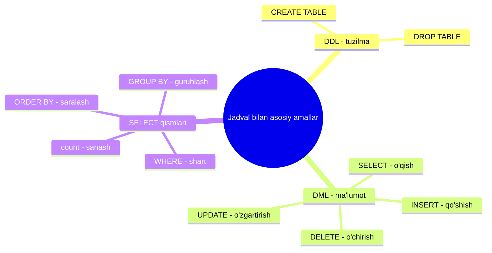
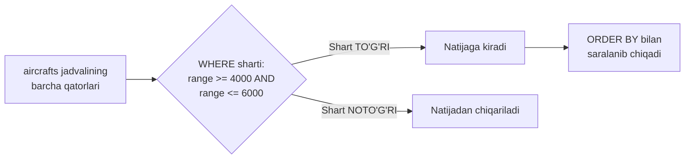
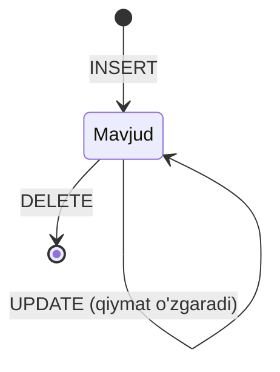
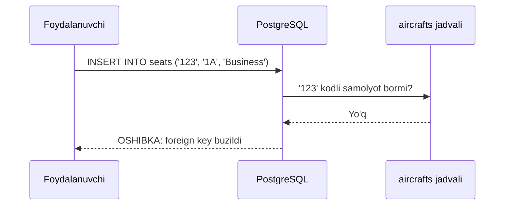

# 3. Jadvallar bilan asosiy amallar

> 📖 Manba: Моргунов, "PostgreSQL. Основы языка SQL", 3-bob

## Nima uchun kerak?

Oldingi darslarda biz database va SQL nima ekanini nazariy o'rgandik, keyin **psql** interaktiv terminalini ishga tushirib, `demo` o'quv bazasini o'rnatdik. Endi eng qiziq qism — SQL buyruqlarini o'z qo'limiz bilan yozib, natijani ko'rish boshlanadi.

SQL — juda boy til, u ko'plab buyruq va kalit so'zlardan iborat. Ammo chet tilini o'rganishdagi kabi, biz avval **eng sodda, lekin amaliy foydali** buyruqlardan boshlaymiz. Bu darsda siz to'rt asosiy amalni o'rganasiz:

1. **CREATE TABLE** — bazada jadval (table) yaratish.
2. **INSERT** — jadvalga yangi qator (satr) qo'shish.
3. **SELECT** — jadvaldan ma'lumot o'qish (WHERE, ORDER BY bilan).
4. **UPDATE** va **DELETE** — mavjud ma'lumotni o'zgartirish va o'chirish.

### Ikki yondashuv: tayyor baza yoki o'zing yaratish?

O'quvchi ishni ikki xil tashkil qilishi mumkin:

- **1-usul:** oldindan tayyorlangan jadvallar bo'lgan bazani ishlatib, faqat so'rov (query) yozish. Bu boshida osonroq ko'rinadi.
- **2-usul:** jadvallarni **o'zing yaratib**, ularga ma'lumotni **o'zing kiritib** ishlash. Bu ko'proq mehnat talab qiladi, lekin siz butun jarayonni "his qilasiz". Eng muhimi — ma'lumotni o'zingiz kiritganingiz uchun so'rov natijasi to'g'ri chiqqan yoki yo'qligini bemalol baholay olasiz.

Kitob ikkinchi usulni tavsiya qiladi, va biz ham shu yo'ldan boramiz. Shuning uchun avval jadval yaratamiz, keyin ma'lumot kiritamiz, undan so'ng esa turli so'rovlar bilan mashq qilamiz.



Ishni boshlash uchun `demo` bazasiga ulanamiz:

```
psql -d demo -U postgres
```

---

## 3.1. CREATE TABLE — birinchi jadvalni yaratish

Jadval yaratish uchun **CREATE TABLE** buyrug'i ishlatiladi. Uning soddalashtirilgan sintaksisi shunday:

```sql
CREATE TABLE jadval_nomi
(
  ustun_nomi  ma'lumot_tipi  [butunlik_cheklovi],
  ustun_nomi  ma'lumot_tipi  [butunlik_cheklovi],
  ...
  [butunlik_cheklovi],
  [primary_key],
  [foreign_key]
);
```

Kvadrat qavs `[ ]` ichidagilar — **majburiy bo'lmagan** (ixtiyoriy) qismlar. Buyruq oxiriga `;` (nuqta-vergul) qo'yiladi.

> psql da bu buyruqning to'liq tavsifini ko'rish uchun (oxiriga `;` **qo'ymasdan**) yozing: `\h CREATE TABLE`.

### Birinchi jadval — "Samolyotlar" (aircrafts)

Birinchi jadval sifatida **samolyotlar** jadvalini yaratamiz. Uning tuzilishi quyidagicha:

| Atribut tavsifi | Ustun nomi | Ma'lumot tipi | Cheklov |
| --- | --- | --- | --- |
| Samolyot kodi, IATA | `aircraft_code` | `char(3)` | NOT NULL |
| Samolyot modeli | `model` | `text` | NOT NULL |
| Maksimal uchish masofasi, km | `range` | `integer` | NOT NULL, `range > 0` |

Nima uchun aynan shu tiplar tanlandi:

- **`char(3)`** — samolyot kodi doim aynan 3 ta belgidan (harf va raqamlardan) iborat. `char` — belgili (matnli) tip, qavsdagi 3 — maksimal belgi soni.
- **`text`** — model nomi turli uzunlikda bo'ladi ("Boeing 777-300", "Cessna 208 Caravan"), shuning uchun uzunligi cheklanmagan `text` tipini oldik.
- **`integer`** — uchish masofasi butun son.

Har uch ustun ham qiymatsiz (bo'sh) bo'lmasligi kerak, shuning uchun ularga **NOT NULL** cheklovi qo'yiladi. Agar ustunda qiymat bo'lmasa, u yerda maxsus **NULL** qiymati turadi. Bu jadvalda NULL ga yo'l qo'yilmaydi. Bundan tashqari, uchish masofasi manfiy yoki nol bo'la olmaydi, shuning uchun `range > 0` cheklovini ham qo'shamiz.

**Primary key** (asosiy kalit) sifatida `aircraft_code` tanlandi. Bu — **tabiiy kalit** (natural key), chunki samolyot kodi haqiqiy hayotda ham mavjud va ishlatiladigan tushuncha. Tabiiy kalitdan farqli o'laroq ba'zan **surrogat kalitlar** (surrogate key) ham ishlatiladi, lekin ular haqida keyingi darslarda gaplashamiz.

### Jadval yaratish buyrug'i

```sql
CREATE TABLE aircrafts
( aircraft_code char( 3 ) NOT NULL,
  model text NOT NULL,
  range integer NOT NULL,
  CHECK ( range > 0 ),
  PRIMARY KEY ( aircraft_code )
);
```

Bu yerda:
- `CHECK ( range > 0 )` — qiymat shartga mos kelishini tekshiruvchi cheklov.
- `PRIMARY KEY ( aircraft_code )` — asosiy kalitni belgilaydi.

> **Register haqida:** SQL kalit so'zlarini (`CREATE`, `NOT NULL`, `PRIMARY KEY`...) an'anaviy ravishda **BOSH harflar** bilan yozadilar — bu buyruqni ko'rinarli qiladi. Ma'lumot tiplarini (`char`, `text`, `integer`) esa kichik harflar bilan yozish odat. Lekin DBMS uchun register muhim emas — istalgan usulda yozsangiz ham ishlaydi.

Buyruqni psql da bir qatorda ("ilon" ko'rinishida buklanib ketadi) yoki har qatorni alohida (har satr oxirida `<Enter>` bosib) kiritishingiz mumkin. Buyruq to'liq kiritilmaguncha psql ning taklif belgisi (`demo=#`) o'zgarib turadi (`demo-#`, `demo(#`), bu buyruq hali tugamaganini bildiradi.

Xatosiz kiritilsa, javob shunday bo'ladi:

```
CREATE TABLE
```

### Yaratilgan jadvalni ko'rish — `\d`

DBMS qanday jadval yaratganini `\d` meta-buyrug'i bilan tekshiramiz:

```
\d aircrafts
```

Natija taxminan shunday:

```
Таблица "public.aircrafts"
    Колонка     |     Тип      | Модификаторы
----------------+--------------+--------------
 aircraft_code  | character(3) | NOT NULL
 model          | text         | NOT NULL
 range          | integer      | NOT NULL
Индексы:
    "aircrafts_pkey" PRIMARY KEY, btree (aircraft_code)
Ограничения-проверки:
    "aircrafts_range_check" CHECK (range > 0)
```

Bu natijada e'tibor beradigan uch narsa bor:

1. **`public.aircrafts`** — bu yerdagi `public` so'zi **schema** nomi. Schema — bu bazaning bir bo'limi, unda jadvallar joylashadi. Standart holatda barcha obyektlar `public` schema da yaratiladi. (Schema haqida 8-darsda batafsil.)
2. **Индексы (indekslar):** primary key uchun avtomatik ravishda `aircrafts_pkey` nomli **index** yaratildi. Index — qatorlarga tez kirishni va kalit qiymatlarning takrorlanishini oldini olishni ta'minlaydigan maxsus ma'lumot tuzilmasi. Uning tipi `btree` (B-daraxt).
3. **Ограничения (cheklovlar):** `range > 0` cheklovi `aircrafts_range_check` nomini oldi. Biz nom bermaganimiz uchun PostgreSQL uni avtomatik generatsiya qildi.

### Jadvalni o'chirish — DROP TABLE

Agar jadvalni yaratishda xato qilsangiz, hozircha eng oson yo'l — uni o'chirib, qaytadan yaratish. Jadvalni o'chirish buyrug'i:

```sql
DROP TABLE jadval_nomi;
```

> Jadval tuzilishini o'zgartirish uchun `ALTER TABLE` buyrug'i ham bor, u haqda keyingi darslarda gaplashamiz.

---

## 3.2. INSERT — jadvalga qator qo'shish

Endi jadvalga ma'lumot kiritamiz. Buning uchun **INSERT** buyrug'i xizmat qiladi. Uning soddalashtirilgan sintaksisi:

```sql
INSERT INTO jadval_nomi [( ustun1, ustun2, ... )]
  VALUES ( qiymat1, qiymat2, ... );
```

Buyruq boshida jadval ustunlari sanaladi (ularni yaratilgan tartibda emas, istalgan tartibda yozish mumkin). Keyin `VALUES` da qiymatlar shu tartibda beriladi.

> **Muhim:** belgili tiplar (`char`, `text`, `varchar`) qiymatlari **bittalik qo'shtirnoq** (`' '`) ichida yoziladi. Son tiplar (`integer`) uchun qo'shtirnoq kerak emas.

Bitta qator qo'shamiz:

```sql
INSERT INTO aircrafts ( aircraft_code, model, range )
  VALUES ( 'SU9', 'Sukhoi SuperJet-100', 3000 );
```

E'tibor bering: `'SU9'` va `'Sukhoi SuperJet-100'` qo'shtirnoq ichida, `3000` esa qo'shtirnoqsiz.

Javob:

```
INSERT 0 1
```

Bu xabardagi ikkinchi son (**1**) — qo'shilgan qatorlar soni. Birinchi son (0) PostgreSQL ning ichki mexanizmiga tegishli, hozir bizni qiziqtirmaydi.

### Bir vaqtning o'zida bir nechta qator qo'shish

Bitta INSERT bilan bir nechta qatorni qo'shsa bo'ladi — qiymat ro'yxatlari vergul bilan ajratiladi:

```sql
INSERT INTO aircrafts ( aircraft_code, model, range )
  VALUES ( '773', 'Boeing 777-300', 11100 ),
         ( '763', 'Boeing 767-300', 7900 ),
         ( '733', 'Boeing 737-300', 4200 ),
         ( '320', 'Airbus A320-200', 5700 ),
         ( '321', 'Airbus A321-200', 5600 ),
         ( '319', 'Airbus A319-100', 6700 ),
         ( 'CN1', 'Cessna 208 Caravan', 1200 ),
         ( 'CR2', 'Bombardier CRJ-200', 2700 );
```

Javob 8 ta qator qo'shilganini bildiradi:

```
INSERT 0 8
```

---

## 3.3. SELECT — ma'lumotni o'qish

Jadvaldan ma'lumot olish uchun **SELECT** buyrug'i ishlatiladi. Eng sodda sintaksis:

```sql
SELECT ustun1, ustun2, ...
  FROM jadval_nomi;
```

Ko'pincha barcha ustunlar kerak bo'ladi. U holda ustunlarni sanamasdan `*` belgisini yozamiz:

```sql
SELECT * FROM aircrafts;
```

Natija (biz kiritgan 9 ta qator):

```
 aircraft_code |        model        | range
---------------+---------------------+-------
 SU9           | Sukhoi SuperJet-100 |  3000
 773           | Boeing 777-300      | 11100
 763           | Boeing 767-300      |  7900
 733           | Boeing 737-300      |  4200
 320           | Airbus A320-200     |  5700
 321           | Airbus A321-200     |  5600
 319           | Airbus A319-100     |  6700
 CN1           | Cessna 208 Caravan  |  1200
 CR2           | Bombardier CRJ-200  |  2700
(9 строк)
```

> **Diqqat:** oddiy SELECT da DBMS qatorlar tartibini **kafolatlamaydi**. Hozir tartib kiritish tartibiga o'xshaydi, lekin bunga tayanib bo'lmaydi. Tartibni kafolatlash uchun `ORDER BY` ishlatiladi.

### ORDER BY — qatorlarni saralash

Qatorlarni biror ustun qiymati bo'yicha saralash uchun `ORDER BY` qo'shamiz. Quyida `model` bo'yicha saralaymiz va ustunlar tartibini ham o'zgartiramiz:

```sql
SELECT model, aircraft_code, range
  FROM aircrafts
  ORDER BY model;
```

Natijada qatorlar `model` bo'yicha alifbo tartibida chiqadi. E'tibor bering: belgili qiymatlar ustunda **chapga**, son qiymatlar esa **o'ngga** tekislanadi.

```
        model         | aircraft_code | range
----------------------+---------------+-------
 Airbus A319-100      | 319           |  6700
 Airbus A320-200      | 320           |  5700
 Airbus A321-200      | 321           |  5600
 Boeing 737-300       | 733           |  4200
 Boeing 767-300       | 763           |  7900
 Boeing 777-300       | 773           | 11100
 Bombardier CRJ-200   | CR2           |  2700
 Cessna 208 Caravan   | CN1           |  1200
 Sukhoi SuperJet-100  | SU9           |  3000
(9 строк)
```

> **Tartib yo'nalishi:** standart holatda saralash **o'sish** bo'yicha (kichikdan kattaga). Kamayish bo'yicha saralash uchun ustun nomidan keyin `DESC` (descendant) yoziladi, masalan `ORDER BY range DESC`.

### WHERE — qatorlarni shart bo'yicha tanlash

Ko'pincha barcha qatorlar emas, faqat ma'lum shartga mos qatorlar kerak bo'ladi. Buning uchun `WHERE` sharti ishlatiladi. Masalan, uchish masofasi 4000 dan 6000 km gacha (shu sonlar ham kiradi) bo'lgan modellarni tanlaymiz:

```sql
SELECT model, aircraft_code, range
  FROM aircrafts
  WHERE range >= 4000 AND range <= 6000;
```

Bu yerda `AND` (mantiqiy "va") yordamida ikki shart birlashtirildi — shart **murakkab** (составное) bo'ldi.

```
     model      | aircraft_code | range
----------------+---------------+-------
 Boeing 737-300 | 733           |  4200
 Airbus A320-200| 320           |  5700
 Airbus A321-200| 321           |  5600
(3 строки)
```



---

## 3.4. UPDATE — ma'lumotni o'zgartirish

Jadvaldagi mavjud ma'lumotni o'zgartirish uchun **UPDATE** buyrug'i ishlatiladi. Soddalashtirilgan sintaksisi:

```sql
UPDATE jadval_nomi
  SET ustun1 = qiymat1,
      ustun2 = qiymat2, ...
  WHERE shart;
```

> **Juda muhim:** `WHERE` shartisiz UPDATE **BARCHA** qatorlarni o'zgartiradi! Faqat bir qism qatorni o'zgartirmoqchi bo'lsangiz, `WHERE` ni yozishni **unutmang**.

Aytaylik, Sukhoi SuperJet ning uchish masofasi 500 km ga oshdi. Faqat shu modelning qatorini yangilaymiz:

```sql
UPDATE aircrafts SET range = 3500
  WHERE aircraft_code = 'SU9';
```

Javob bitta qator o'zgarganini bildiradi:

```
UPDATE 1
```

Natijani tekshiramiz:

```sql
SELECT * FROM aircrafts WHERE aircraft_code = 'SU9';
```

```
 aircraft_code |        model        | range
---------------+---------------------+-------
 SU9           | Sukhoi SuperJet-100 |  3500
(1 строка)
```

> **Foydali imkoniyat:** UPDATE da arifmetik amal ham yozish mumkin. Masalan, masofani ikki barobar oshirish uchun: `SET range = range * 2`. Bunda avval joriy qiymatni bilib olishning hojati yo'q — DBMS o'zi hisoblab qo'yadi.

---

## 3.5. DELETE — qatorlarni o'chirish

Qatorlarni o'chirish uchun **DELETE** buyrug'i ishlatiladi, u SELECT ga o'xshaydi:

```sql
DELETE FROM jadval_nomi WHERE shart;
```

Bitta qatorni o'chiramiz:

```sql
DELETE FROM aircrafts WHERE aircraft_code = 'CN1';
```

```
DELETE 1
```

Murakkabroq shart ham berish mumkin. Masalan, uchish masofasi 10000 km dan ko'p **yoki** 3000 km dan kam bo'lgan samolyotlarni o'chiramiz (`OR` — mantiqiy "yoki"):

```sql
DELETE FROM aircrafts WHERE range > 10000 OR range < 3000;
```

Barcha qatorlarni o'chirish kerak bo'lsa, shart yozilmaydi:

```sql
DELETE FROM aircrafts;
```

> **Ehtiyot bo'ling:** `WHERE` siz DELETE jadvaldagi **barcha** qatorlarni o'chiradi! Agar shu tarzda ma'lumotni o'chirib yuborsangiz, uni tiklash uchun INSERT buyruqlarini qayta bajarish yoki `\s fayl` bilan saqlangan buyruqlar tarixidan foydalanish kerak bo'ladi.

Qatorning "hayoti" INSERT dan boshlanib, DELETE bilan tugaydi:



---

## 3.6. Ikkinchi jadval — "O'rindiqlar" (seats) va foreign key

Bazamizda jadvallar bir-biri bilan bog'langan bo'ladi. `aircrafts` jadvalining eng yaqin "qarindoshi" — **seats** (o'rindiqlar) jadvali. Uning tuzilishi:

| Atribut tavsifi | Ustun nomi | Ma'lumot tipi | Cheklov |
| --- | --- | --- | --- |
| Samolyot kodi, IATA | `aircraft_code` | `char(3)` | NOT NULL |
| O'rindiq raqami | `seat_no` | `varchar(4)` | NOT NULL |
| Xizmat sinfi | `fare_conditions` | `varchar(10)` | NOT NULL, faqat: Economy, Comfort, Business |

Yangi tushunchalar:

- **`varchar(4)`** — o'zgaruvchan uzunlikdagi belgili tip. Qavsdagi 4 — maksimal uzunlik. O'rindiq raqami "10A", "21D", "17F" kabi bo'ladi (raqam + harf).
- **`fare_conditions`** faqat cheklangan ro'yxatdan qiymat qabul qiladi — buni `CHECK ... IN (...)` cheklovi ta'minlaydi.

### Foreign key — jadvallarni bog'lash

Bu jadvalda **foreign key** (tashqi kalit) ishlatiladi. `FOREIGN KEY` cheklovi **ссылочная целостность** (havola butunligi) ni ta'minlaydi. `aircraft_code` ustuni `aircrafts` jadvalidagi shu nomli ustunga **havola qiladi**. Bunda:

- `seats` — havola qiluvchi (referencing) jadval;
- `aircrafts` — havola qilinuvchi (referenced) jadval.

O'rindiqlar aniq samolyot modeliga bog'langani uchun, agar `aircrafts` dan biror samolyot o'chirilsa, `seats` dan ham shu samolyotga tegishli barcha o'rindiqlar o'chirilishi kerak. Buni **ON DELETE CASCADE** ta'minlaydi — DBMS bog'langan qatorlarni o'zi avtomatik o'chiradi (bunday amalga **kaskadli o'chirish** deyiladi).

```sql
CREATE TABLE seats
(
  aircraft_code   char( 3 )     NOT NULL,
  seat_no         varchar( 4 )  NOT NULL,
  fare_conditions varchar( 10 ) NOT NULL,
  CHECK
  ( fare_conditions IN ( 'Economy', 'Comfort', 'Business' )
  ),
  PRIMARY KEY ( aircraft_code, seat_no ),
  FOREIGN KEY ( aircraft_code )
    REFERENCES aircrafts ( aircraft_code )
    ON DELETE CASCADE
);
```

E'tibor bering: primary key bu yerda **ikki ustundan** iborat — `( aircraft_code, seat_no )`. Bu **составной** (murakkab) kalit deyiladi.

```mermaid
erDiagram
    aircrafts ||--o{ seats : "ega bo'ladi (FK)"
    aircrafts {
        char(3) aircraft_code PK
        text model
        integer range
    }
    seats {
        char(3) aircraft_code PK_FK
        varchar(4) seat_no PK
        varchar(10) fare_conditions
    }
```

### Foreign key qanday himoya qiladi?

Foreign key mavjud bo'lmagan samolyotga o'rindiq qo'shishga yo'l qo'ymaydi. Masalan, `aircrafts` da 123 kodli samolyot yo'q:

```sql
INSERT INTO seats VALUES ( '123', '1A', 'Business' );
```

DBMS xato beradi:

```
ОШИБКА: INSERT или UPDATE в таблице "seats" нарушает ограничение внешнего
  ключа "seats_aircraft_code_fkey"
ПОДРОБНОСТИ: Ключ (aircraft_code)=(123) отсутствует в таблице "aircrafts"
```

Bu mantiqan to'g'ri: mavjud bo'lmagan samolyot uchun o'rindiqlar haqida ma'lumot saqlashning ma'nosi yo'q. Dasturchi bu qoidalarni "qo'lda" kuzatishdan xalos bo'ladi — DBMS o'zi ta'minlaydi.



Endi mavjud modellarga o'rindiqlar qo'shamiz (bitta INSERT bilan bir nechta qator):

```sql
INSERT INTO seats VALUES
  ( 'SU9', '1A',  'Business' ),
  ( 'SU9', '1B',  'Business' ),
  ( 'SU9', '10A', 'Economy' ),
  ( 'SU9', '10B', 'Economy' ),
  ( 'SU9', '10F', 'Economy' ),
  ( 'SU9', '20F', 'Economy' );
```

---

## 3.7. count va GROUP BY — qatorlarni sanash va guruhlash

Har bir samolyot modelida nechta o'rindiq borligini bilmoqchimiz. SQL da qatorlarni sanaydigan funksiya bor — **count**. Uni har bir model uchun alohida chaqirish mumkin, lekin bu noqulay:

```sql
SELECT count( * ) FROM seats WHERE aircraft_code = 'SU9';
```

Yaxshiroq yo'l — `GROUP BY` bilan qatorlarni **guruhlash**. GROUP BY bir xil `aircraft_code` qiymatiga ega qatorlarni bitta guruhga birlashtiradi, va `count` **har bir guruh** uchun alohida hisoblaydi:

```sql
SELECT aircraft_code, count( * ) FROM seats
  GROUP BY aircraft_code;
```

Natija (misol):

```
 aircraft_code | count
---------------+-------
 773           |   402
 733           |   130
 CR2           |    50
 319           |   116
 SU9           |    97
 321           |   170
 763           |   222
 320           |   140
(8 строк)
```

Natijani o'rindiq soni bo'yicha saralash uchun `ORDER BY count` qo'shamiz:

```sql
SELECT aircraft_code, count( * ) FROM seats
  GROUP BY aircraft_code
  ORDER BY count;
```

Ikkita ustun bo'yicha ham guruhlash mumkin — masalan, har bir model ichida xizmat sinflari bo'yicha:

```sql
SELECT aircraft_code, fare_conditions, count( * )
  FROM seats
  GROUP BY aircraft_code, fare_conditions
  ORDER BY aircraft_code, fare_conditions;
```

```
 aircraft_code | fare_conditions | count
---------------+-----------------+-------
 319           | Business        |    20
 319           | Economy         |    96
 320           | Business        |    20
 320           | Economy         |   120
 ...
(17 строк)
```

> `count` — **agregat funksiya** (bir nechta qatorni bitta qiymatga jamlaydigan funksiya). GROUP BY bilan birga u har bir guruh bo'yicha alohida ishlaydi.

---

## Xulosa

- **CREATE TABLE** bilan jadval yaratiladi: ustunlar, ularning tiplari va cheklovlari (NOT NULL, CHECK, PRIMARY KEY, FOREIGN KEY) ko'rsatiladi.
- **DROP TABLE** jadvalni butunlay o'chiradi.
- **INSERT INTO ... VALUES** bilan qator(lar) qo'shiladi. Belgili qiymatlar `' '` ichida, sonlar qo'shtirnoqsiz. Bitta INSERT bilan bir nechta qator qo'shsa bo'ladi.
- **SELECT** ma'lumotni o'qiydi. `*` — barcha ustunlar; `WHERE` — shart bo'yicha tanlash; `ORDER BY` — saralash (`DESC` — kamayish bo'yicha).
- **UPDATE ... SET ... WHERE** ma'lumotni o'zgartiradi; **DELETE FROM ... WHERE** o'chiradi. Ikkalasida ham `WHERE` siz **barcha** qatorlar ta'sirlanadi.
- **Primary key** — qatorni yagona qiladigan kalit (tabiiy yoki murakkab bo'lishi mumkin). Uning uchun avtomatik **index** yaratiladi.
- **Foreign key** jadvallarni bog'laydi va havola butunligini ta'minlaydi; `ON DELETE CASCADE` bog'langan qatorlarni avtomatik o'chiradi.
- **count** va **GROUP BY** — qatorlarni sanash va guruhlarga ajratish.

### Eslab qol

- Belgili qiymat doim `' '` ichida, son — qo'shtirnoqsiz.
- `WHERE` ni unutsang, UPDATE va DELETE **hamma** qatorni o'zgartiradi/o'chiradi.
- Oddiy SELECT qatorlar tartibini kafolatlamaydi — kerak bo'lsa `ORDER BY` yoz.
- Foreign key mavjud bo'lmagan qatorga havola qilishga yo'l qo'ymaydi.
- `INSERT 0 1` dagi ikkinchi son — qo'shilgan qatorlar soni.

### Amaliyot

1. `aircrafts` jadvaliga allaqachon mavjud `aircraft_code` ('SU9') qiymatli qator qo'shishga urinib ko'ring. Qanday xato chiqadi va nima uchun? (`aircrafts_pkey` — primary key takrorlanishiga yo'l qo'ymaydi.)
2. `range` (uchish masofasi) **kamayish** tartibida barcha samolyotlarni chiqaradigan SELECT yozing (`ORDER BY ... DESC`).
3. Sukhoi SuperJet dvigatellari tejamkorroq bo'lib, masofa aynan ikki barobar oshdi deb faraz qiling. `UPDATE aircrafts SET range = range * 2 WHERE ...` buyrug'ini to'liq yozib, natijani SELECT bilan tekshiring.
4. DELETE ning WHERE sharti sintaktik to'g'ri, lekin hech bir qatorga mos kelmaydigan holatni yarating (masalan mavjud bo'lmagan kod). Javobda `DELETE 0` chiqishini kuzating.
5. Har bir samolyot modelida qancha Economy va Business o'rindiq borligini `GROUP BY` yordamida sanang.

---

## Nazorat savollari

1. Nima uchun kitob jadvallarni tayyor holda olishdan ko'ra, ularni o'zi yaratishni tavsiya qiladi?
2. `NOT NULL`, `CHECK`, `PRIMARY KEY` cheklovlari har biri nimani ta'minlaydi? `aircrafts` jadvali misolida tushuntiring.
3. `char(3)`, `varchar(4)` va `text` tiplari orasidagi farq nimada? Har biri qachon qulay?
4. INSERT da belgili va son qiymatlar qanday yoziladi (qo'shtirnoq masalasi)? Misol keltiring.
5. UPDATE va DELETE buyruqlarida `WHERE` ni yozmaslik qanday xavf tug'diradi?
6. `ORDER BY` nima uchun kerak? Oddiy SELECT nima uchun qatorlar tartibini kafolatlamaydi?
7. Foreign key nima va u qanday himoya beradi? `ON DELETE CASCADE` nima qiladi? `seats` va `aircrafts` misolida tushuntiring.
8. `GROUP BY` va `count` birga qanday ishlaydi? Bitta ustun va ikkita ustun bo'yicha guruhlash natijasi qanday farq qiladi?
