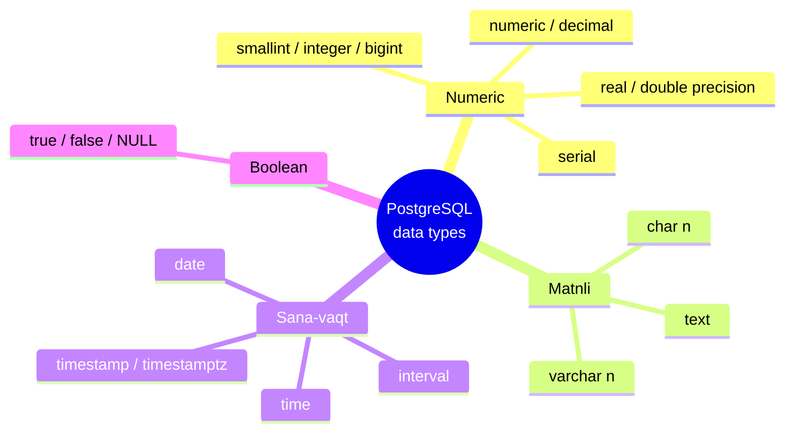
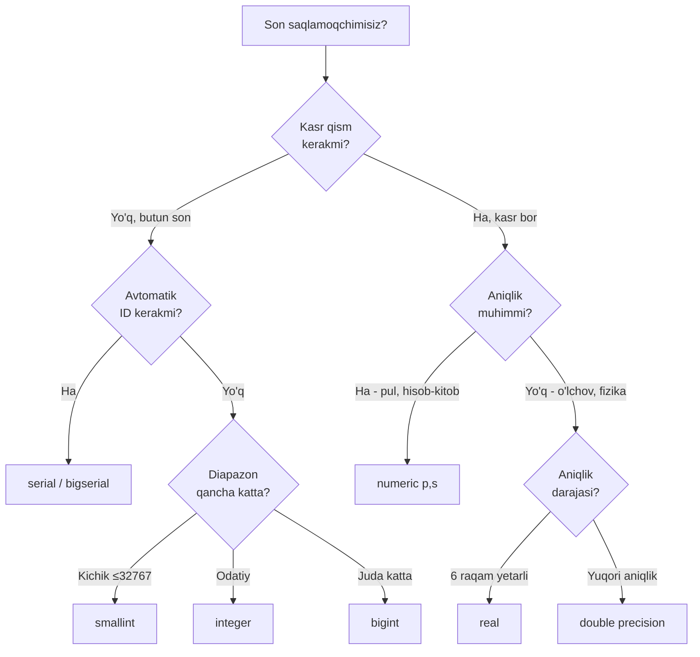
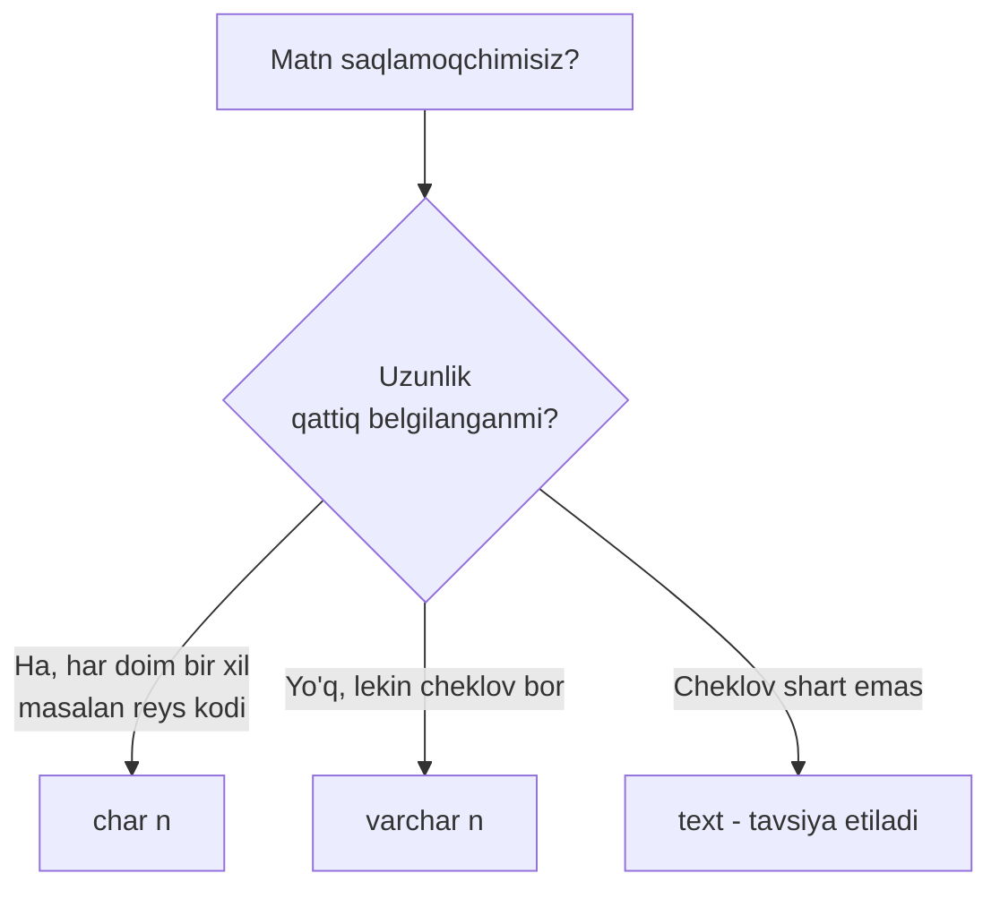
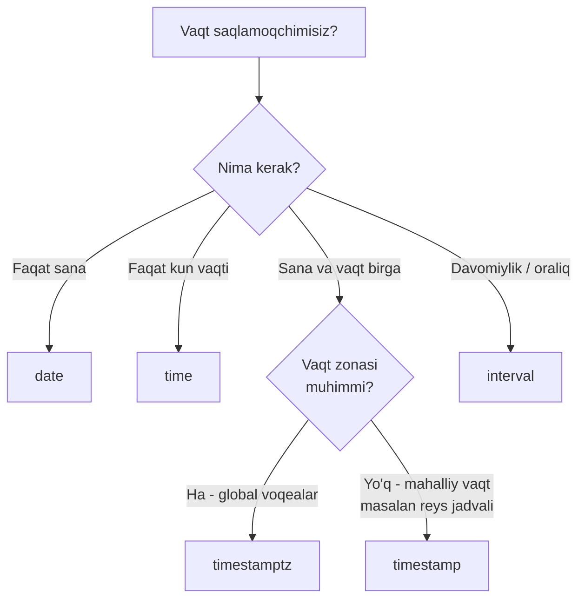
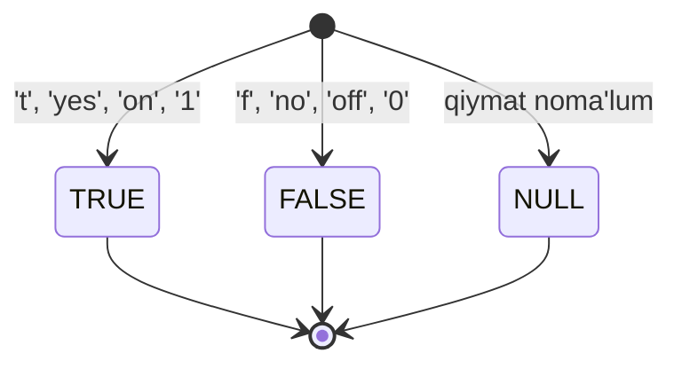

# 4. Data types — son, matn, sana-vaqt, boolean

> 📖 Manba: Моргунов, "PostgreSQL. Основы языка SQL", 4-bob (4.1–4.4 bo'limlar)

## Nima uchun kerak?

Har bir table'da ustun (column) yaratganda biz PostgreSQL'ga aytishimiz kerak: "Bu
ustunda qanday qiymatlar saqlanadi?". Butun son bo'ladimi, pul summasimi, matnmi,
sanami yoki "ha/yo'q" degan javobmi? Mana shu savolga javob beruvchi narsa —
**data type** (ma'lumot turi).

To'g'ri type tanlash juda muhim, chunki u:

- **Xotira** (disk va operativ) sarfini belgilaydi — `smallint` 2 bayt, `bigint` 8 bayt oladi;
- **Tezlik**ka ta'sir qiladi — butun sonlar bilan hisoblash o'nli sonlarga qaraganda tezroq;
- **Xatolardan himoya** qiladi — sana ustuniga "salom" degan matnni yozib bo'lmaydi, PostgreSQL uni rad etadi;
- **Ma'noni** aniqlashtiradi — `boolean` ustunni ko'rgan har kim "bu ha/yo'q qiymat" ekanini tushunadi.

PostgreSQL'ning kuchli tomoni — u juda boy va xilma-xil built-in (o'rnatilgan)
type'lar to'plamiga ega. Bu darsda eng asosiylarini o'rganamiz: son, matn,
sana-vaqt va mantiqiy (boolean) type'lar.



---

## 4.1. Numeric (son) type'lar

Numeric guruhga bir nechta xil son type'lari kiradi: butun sonlar, aniq
(fixed-precision) sonlar, suzuvchi nuqtali (floating-point) sonlar va ketma-ket
(serial) type'lar.

### Butun sonlar — smallint, integer, bigint

Butun sonlar faqat kasrsiz qiymatlarni saqlaydi. Ular bir-biridan **necha bayt
xotira** olishi va shunga mos ravishda **qanday diapazon**ni qamrab olishi bilan
farqlanadi.

| Type | Sinonim | Xotira | Diapazon |
|------|---------|--------|----------|
| `smallint` | `int2` | 2 bayt | -32 768 … 32 767 |
| `integer` | `int4` | 4 bayt | ≈ -2,1 mlrd … 2,1 mlrd |
| `bigint` | `int8` | 8 bayt | ≈ ±9,2 × 10¹⁸ |

Bayt soni type nomida ham aks etadi: `int2`, `int4`, `int8`.

Butun type tanlashda ikki narsani hisobga olamiz: **kerakli diapazon** va
**xotira sarfi**. Ko'p hollarda `integer` bu ikkisi o'rtasidagi eng qulay
murosa hisoblanadi va standart tanlov bo'ladi.

```sql
-- Aviaqatnovlar bazasidan: yo'lovchilar soni smallint uchun yetarli,
-- lekin barcha chiptalar summasi bigint talab qilishi mumkin
CREATE TABLE flights (
    flight_no    char(6),           -- reys raqami
    seats_total  smallint,          -- o'rindiqlar soni (masalan, 180)
    passengers   integer,           -- umumiy yo'lovchilar
    total_revenue bigint            -- umumiy daromad (tiyinlarda)
);
```

Izoh: o'rindiqlar soni hech qachon 32 767 dan oshmaydi, shuning uchun `smallint`
yetarli. Ammo umumiy daromadni katta olsak, `bigint` xavfsizroq.

### Aniq sonlar — numeric va decimal

`numeric` va `decimal` — bu bir xil type'ning ikki nomi (to'liq bir xil).
Odatda `numeric` ishlatiladi.

`numeric` ikkita parametr bilan aniqlanadi:

- **precision** (aniqlik) — jami raqamlar soni (nuqtadan oldin ham, keyin ham);
- **scale** (masshtab) — nuqtadan keyingi raqamlar soni.

Masalan, `12.3456` sonining precision'i **6** (jami 6 ta raqam), scale'i esa
**4** (nuqtadan keyin 4 ta).

Yozilishi: `numeric(precision, scale)`, masalan `numeric(6, 2)`.

`numeric`ning bosh afzalligi — **aniq (exact) natijalar** berishi. Qo'shish,
ayirish, ko'paytirishda hech qanday yaxlitlash xatosi bo'lmaydi. Aynan shuning
uchun **pul summalari** uchun har doim `numeric` ishlatiladi.

```sql
-- Chipta narxi: 8 ta raqam, nuqtadan keyin 2 ta (masalan, 123456.78)
CREATE TABLE ticket_prices (
    ticket_no  char(13),
    amount     numeric(8, 2)   -- pul uchun har doim numeric!
);

INSERT INTO ticket_prices VALUES ('0005432000284', 42500.00);
INSERT INTO ticket_prices VALUES ('0005432000285', 42500.50);
```

Eslatma: `numeric` juda katta sonlarni saqlay oladi (nuqtadan oldin 131 072
raqamgacha, keyin 16 383 raqamgacha), lekin buning evaziga butun va floating-point
type'larga qaraganda **sekinroq** ishlaydi va **ko'proq xotira** oladi.

Agar precision'dan oshib ketadigan son kiritmoqchi bo'lsak, PostgreSQL xato
beradi. Agar scale'dan oshsa esa, son **yaxlitlanadi**:

```sql
-- numeric(5, 2) ga kiritsak:
-- 999.9999 -> 1000.00 -> XATO! (nuqtadan oldin 4 raqam bo'lib ketdi)
-- 999.9009 -> 999.90   -> OK, yaxlitlandi
-- 999.1111 -> 999.11   -> OK, yaxlitlandi
```

### Suzuvchi nuqtali sonlar — real va double precision

`real` va `double precision` — IEEE 754 standartidagi floating-point sonlar.

| Type | Sinonim | Xotira | Aniqlik |
|------|---------|--------|---------|
| `real` | `float4` | 4 bayt | kamida 6 ta o'nlik raqam |
| `double precision` | `float8` | 8 bayt | kamida 15 ta o'nlik raqam |

Bular **taxminiy (approximate)** sonlar. Ular tez ishlaydi va katta diapazonni
qamrab oladi, lekin aniqligi cheklangan. Shuning uchun ularni **tenglikka
solishtirmang** — kutilmagan natija berishi mumkin:

```sql
SELECT 0.1::real * 10 = 1.0::real;
-- Natija:
--  ?column?
-- ----------
--  f          <- false! Chunki 0.1 ni float aniq saqlay olmaydi
```

Bu type'lar oddiy sonlardan tashqari maxsus qiymatlarni ham qo'llab-quvvatlaydi:
`Infinity` (cheksizlik), `-Infinity` (manfiy cheksizlik) va `NaN` (son emas —
not a number).

PostgreSQL yana `float(p)` type'ini ham qo'llab-quvvatlaydi: `p` 1–24 bo'lsa
`real`ga, 25–53 bo'lsa `double precision`ga teng bo'ladi.

### serial — avtomatik oshib boruvchi son

`serial` — bu aslida alohida type emas, balki qulay **qisqartma**. U ko'pincha
avtomatik unikal butun qiymatlar (masalan, surrogat primary key) kerak bo'lganda
ishlatiladi.

```sql
CREATE TABLE test_serial (
    id    serial,
    name  text
);
```

Bu buyruq aslida sahna ortida quyidagilarni bajaradi: `sequence`
(ketma-ketlik generatori) yaratadi va ustunga `DEFAULT nextval(...)` beradi.
Ya'ni har safar yangi qatorda id avtomatik oshadi:

```sql
INSERT INTO test_serial (name) VALUES ('Vishnevaya');  -- id = 1
INSERT INTO test_serial (name) VALUES ('Grushevaya');  -- id = 2
INSERT INTO test_serial (name) VALUES ('Zelenaya');    -- id = 3
```

`serial`ning ikkita "qarindoshi" bor: `bigserial` (asosida `bigint`) va
`smallserial` (asosida `smallint`). Agar table'da qatorlar tez-tez qo'shilib
o'chirilsa, sequence'dagi raqamlar tez sarflanadi — shuning uchun katta table
uchun `bigserial` tanlagan ma'qul.

> Muhim: qatorni o'chirsangiz ham, sequence orqaga qaytmaydi — nomerlashda
> "teshik" (bo'shliq) paydo bo'lishi mumkin. Bu normal holat.

### Qaysi numeric type'ni tanlash kerak?



---

## 4.2. Matn (character/string) type'lar

Matn saqlash uchun uchta asosiy type bor:

| Type | Sinonim | Tavsif |
|------|---------|--------|
| `character(n)` | `char(n)` | Fixed uzunlik — har doim `n` ta belgi |
| `character varying(n)` | `varchar(n)` | O'zgaruvchan uzunlik, maksimum `n` belgi |
| `text` | — | Uzunligi cheklanmagan |

Bu yerdagi `n` — **belgilar** soni (UTF-8 kabi ko'p baytli kodlashda ham baytlar
emas, aynan belgilar hisoblanadi).

Asosiy farq:

- **`char(n)`** — agar kiritilgan matn `n`dan qisqa bo'lsa, oxiriga **probellar
  qo'shib** to'ldiriladi (paddling). Ya'ni `char(10)` ga `'abc'` yozsangiz, u
  `'abc       '` bo'lib saqlanadi.
- **`varchar(n)`** — matn qanday kiritilgan bo'lsa, xuddi shundayligicha saqlanadi
  (ortiqcha probel qo'shilmaydi), lekin `n`dan uzun bo'lolmaydi.
- **`text`** — istalgancha uzun matn (SQBD kompilatsiya chegaralari doirasida).

> Amaliyot: hujjatlar `char`dan qochib, `text` yoki `varchar` ishlatishni tavsiya
> qiladi, chunki `char`ning probel bilan to'ldirish xususiyati amalda deyarli
> kerak bo'lmaydi. PostgreSQL'da odatda **`text`** ishlatiladi.

### Matn konstantalarini yozish

Matn konstantalari **bitta qo'shtirnoq** (') ichida yoziladi:

```sql
SELECT 'PostgreSQL';
--  ?column?
-- ----------
--  PostgreSQL
```

Agar matn ichida qo'shtirnoq (') yoki teskari slesh (\) bo'lsa, ularni
**ikkilantirish** kerak:

```sql
SELECT 'PGDAY''17';   -- natija: PGDAY'17
```

Agar bunday belgilar ko'p bo'lsa, matnni o'qish qiyinlashadi. Bunda **ikkita
dollar belgisi** (`$$`) chegaralovchi sifatida yordam beradi — ichida hech
narsani ikkilantirish shart emas:

```sql
SELECT $$PGDAY'17$$;   -- natija: PGDAY'17
```

C-uslubidagi konstantalar uchun boshiga `E` qo'yiladi (masalan, `\n` yangi qator
belgisi ishlashi uchun):

```sql
SELECT E'PGDAY\n17';
-- natija:
--  PGDAY
--  17
```



---

## 4.3. Sana/vaqt (date/time) type'lar

PostgreSQL SQL standarti nazarda tutgan barcha sana-vaqt type'larini
qo'llab-quvvatlaydi. Sanalar **grigorian kalendari** bo'yicha qayta ishlanadi.
Barcha sana-vaqt qiymatlari, xuddi matn kabi, **bitta qo'shtirnoq** ichida
yoziladi.

| Type | Nimani saqlaydi | Xotira |
|------|-----------------|--------|
| `date` | Faqat sana (yil-oy-kun) | 4 bayt |
| `time` | Faqat kun vaqti (soat:daqiqa:soniya) | 8 bayt |
| `time with time zone` | Vaqt + zona | 12 bayt (tavsiya etilmaydi) |
| `timestamp` | Sana + vaqt (zonasiz) | 8 bayt |
| `timestamptz` | Sana + vaqt + zona | 8 bayt |
| `interval` | Vaqt oralig'i (davomiylik) | 16 bayt |

### date — sana

Tavsiya etilgan kiritish formati (ISO 8601): `yyyy-mm-dd`. Lekin PostgreSQL
boshqa formatlarni ham tushunadi:

```sql
SELECT '2016-09-12'::date;   -- natija: 2016-09-12
SELECT 'Sep 12, 2016'::date; -- natija: 2016-09-12 (bir xil chiqadi)
```

Bu yerda `::date` — **type cast** (type'ga keltirish). U PostgreSQL'ga "bu
oddiy matn emas, bu sana" deb aytadi.

Joriy sanani olish uchun `current_date` funksiyasi ishlatiladi (qavssiz
chaqiriladi):

```sql
SELECT current_date;   -- masalan: 2016-09-21
```

Sanani boshqa formatda ko'rsatish uchun `to_char` funksiyasi yordam beradi:

```sql
SELECT to_char(current_date, 'dd-mm-yyyy');
-- natija: 21-09-2016
```

### time — kun vaqti

`time` faqat kun vaqtini saqlaydi. `time with time zone` ni PostgreSQL hujjatlari
tavsiya etmaydi (chunki sanasiz vaqt zonasi noaniq bo'ladi).

```sql
SELECT '21:15'::time;      -- natija: 21:15:00 (soniyalar to'ldiriladi)
SELECT '21:15:26'::time;   -- natija: 21:15:26

-- 12 soatlik formatda am/pm bilan:
SELECT '10:15:16 am'::time; -- natija: 10:15:16
SELECT '10:15:16 pm'::time; -- natija: 22:15:16

-- Noto'g'ri qiymat xato beradi:
SELECT '25:15'::time;
-- OSHIBKA: значение поля типа date/time вне диапазона: "25:15"
```

Joriy vaqtni olish — `current_time`:

```sql
SELECT current_time;   -- masalan: 23:51:57.293522+03
```

### timestamp va timestamptz — sana + vaqt

Sana va vaqtni birlashtirsak, **timestamp** (temporal belgi) hosil bo'ladi. Ikki
xili bor:

- **`timestamp`** — vaqt zonasiz;
- **`timestamptz`** (`timestamp with time zone`) — vaqt zonasi bilan.

```sql
-- Zona bilan:
SELECT timestamp with time zone '2016-09-21 22:25:35';
-- natija: 2016-09-21 22:25:35+03  (+03 avtomatik qo'shildi)

-- Zonasiz:
SELECT timestamp '2016-09-21 22:25:35';
-- natija: 2016-09-21 22:25:35
```

Ikkalasi ham 8 bayt oladi, lekin `timestamptz` qiymatlari ichkarida **UTC (nol
zona)** ga keltirilib saqlanadi, chiqishda esa foydalanuvchining zonasiga
qaytariladi.

**Qaysi birini tanlash kerak?** Bu qiymatni mahalliy zonaga keltirish kerakmi
yoki yo'qmi shunga bog'liq:

- Aviaqatnov jadvalida uchish/qo'nish vaqti **aeroportning mahalliy vaqti** bilan
  ko'rsatiladi. Bu vaqtni foydalanuvchining zonasiga aylantirish **kerak emas** —
  demak `timestamp` ishlatamiz.
- Umuman olganda amaliyotda ikkitasidan **`timestamptz`** ko'proq ishlatiladi.

Joriy sana + vaqtni olish — `current_timestamp` (yoki `now`):

```sql
SELECT current_timestamp;
-- natija: 2016-09-27 18:27:37.767739+03
```

### interval — vaqt oralig'i

`interval` ikki vaqt nuqtasi orasidagi **davomiylik**ni saqlaydi.

Kiritish formati: `quantity unit [quantity unit ...] direction`, bu yerda `unit`
o'lchov birligi (microsecond, second, minute, hour, day, week, month, year,
decade, century, millennium), `direction` esa `ago` (oldin) bo'lishi mumkin.

```sql
SELECT '1 year 2 months ago'::interval;
-- natija: -1 years -2 mons  (ago barcha maydonga minus qo'yadi)

-- ISO 8601 formati (P bilan boshlanadi, T sana bilan vaqtni ajratadi):
SELECT 'P0001-02-03T04:05:06'::interval;
-- natija: 1 year 2 mons 3 days 04:05:06
```

`interval` ni ikki timestamp'ni **ayirish** orqali ham olish mumkin:

```sql
SELECT ('2016-09-16'::timestamp - '2016-09-01'::timestamp)::interval;
-- natija: 15 days
```

### Sana/vaqt bilan foydali funksiyalar

`date_trunc` — timestamp'ni belgilangan aniqlikkacha "kesadi":

```sql
SELECT date_trunc('hour', current_timestamp);
-- natija: 2016-09-27 22:00:00+03  (daqiqa va soniya nolga tushdi)
```

`extract` — timestamp'dan alohida qismni (yil, oy, kun, soat...) ajratib oladi:

```sql
SELECT extract('mon' FROM timestamp '1999-11-27 12:34:56.123459');
-- natija: 11  (oy raqami)
```



---

## 4.4. Boolean (mantiqiy) type

`boolean` type **uchta** holatni qabul qila oladi: rost (true), yolg'on (false)
va noaniq (`NULL`). Demak, `boolean` **uch qiymatli mantiq**ni (three-valued
logic) amalga oshiradi.

PostgreSQL rost qiymat sifatida quyidagilarni qabul qiladi: `TRUE`, `'t'`,
`'true'`, `'y'`, `'yes'`, `'on'`, `'1'`.

Yolg'on qiymat sifatida: `FALSE`, `'f'`, `'false'`, `'n'`, `'no'`, `'off'`, `'0'`.

```sql
CREATE TABLE databases (
    is_open_source  boolean,
    dbms_name       text
);

INSERT INTO databases VALUES (TRUE,  'PostgreSQL');
INSERT INTO databases VALUES (FALSE, 'Oracle');
INSERT INTO databases VALUES (TRUE,  'MySQL');
INSERT INTO databases VALUES (FALSE, 'MS SQL Server');

SELECT * FROM databases;
--  is_open_source | dbms_name
-- ----------------+---------------
--  t              | PostgreSQL
--  f              | Oracle
--  t              | MySQL
--  f              | MS SQL Server
```

`WHERE` shartida boolean ustunni tekshirish uchun `= 'yes'` yozish shart emas —
faqat ustun nomini yozish yetarli:

```sql
-- Ochiq kodli SQBDlarni tanlaymiz:
SELECT * FROM databases WHERE is_open_source;
--  is_open_source | dbms_name
-- ----------------+------------
--  t              | PostgreSQL
--  t              | MySQL
```



---

## Xulosa

Bu darsda PostgreSQL'ning asosiy data type'larini o'rgandik. Har bir vazifa uchun
to'g'ri type tanlash — yaxshi baza dizaynining birinchi qadami.

**Umumiy jadval:**

| Guruh | Type | Qachon ishlatish |
|-------|------|------------------|
| Butun son | `smallint` | Kichik diapazon (≤ 32767), xotira tejash |
| Butun son | `integer` | Standart tanlov, aksariyat hollarda |
| Butun son | `bigint` | Juda katta sonlar |
| Aniq son | `numeric(p,s)` | Pul, moliyaviy hisob — aniqlik shart |
| Floating | `real` | Taxminiy o'lchovlar, 6 raqam yetarli |
| Floating | `double precision` | Yuqori aniqlikli ilmiy hisob |
| Auto ID | `serial` / `bigserial` | Avtomatik unikal identifikator |
| Matn | `char(n)` | Fixed uzunlik (kam ishlatiladi) |
| Matn | `varchar(n)` | Cheklangan uzunlikli matn |
| Matn | `text` | Cheksiz matn (tavsiya etiladi) |
| Sana-vaqt | `date` | Faqat sana |
| Sana-vaqt | `time` | Faqat kun vaqti |
| Sana-vaqt | `timestamp` | Sana+vaqt, zona muhim emas (mahalliy) |
| Sana-vaqt | `timestamptz` | Sana+vaqt+zona (global voqealar) |
| Sana-vaqt | `interval` | Vaqt oralig'i / davomiylik |
| Mantiqiy | `boolean` | Ha/yo'q/noma'lum (true/false/NULL) |

**Eslab qol:**

- Pul uchun **hech qachon** `real`/`double precision` emas, faqat `numeric` —
  chunki floating-point yaxlitlash xatosi beradi.
- `integer` — shubha bo'lganda standart butun son tanlovi.
- `text` — PostgreSQL'da matn uchun eng qulay va tavsiya etilgan type.
- `boolean` uch qiymatli: `true`, `false`, `NULL`.
- Sana-vaqt qiymatlari matn kabi bitta qo'shtirnoq ichida yoziladi.

---

## Nazorat savollari

1. `smallint`, `integer` va `bigint` type'lari bir-biridan nima bilan farqlanadi?
   Qaysi biri "standart tanlov" hisoblanadi va nega?

2. `numeric(6, 2)` yozuvidagi `6` va `2` sonlari nimani bildiradi? `numeric(6, 2)`
   ga `1234.567` sonini kiritsak nima bo'ladi?

3. Nima uchun pul summalarini saqlashda `real` yoki `double precision` emas, aynan
   `numeric` ishlatiladi? `SELECT 0.1::real * 10 = 1.0::real;` nima uchun `false`
   qaytaradi?

4. `serial` type asli alohida type emas — u nima? `serial` ustunga qator
   o'chirilganda nomerlashda nima uchun "teshik" paydo bo'ladi?

5. `char(10)` va `varchar(10)` orasidagi asosiy farq nima? PostgreSQL'da odatda
   qaysi matn type tavsiya etiladi?

6. `timestamp` va `timestamptz` orasidagi farqni tushuntiring. Aviaqatnov
   jadvalidagi uchish vaqti uchun qaysi birini tanlash to'g'ri va nima uchun?

7. `interval` type nima uchun kerak? Uni ikki `timestamp`ni ayirish orqali qanday
   olish mumkin?

8. `boolean` type qanchta holatni qabul qila oladi? `WHERE is_open_source = 'yes'`
   o'rniga qisqaroq qanday yozish mumkin?
