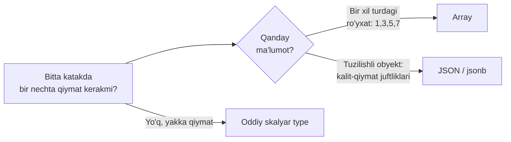
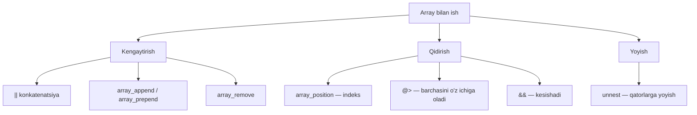
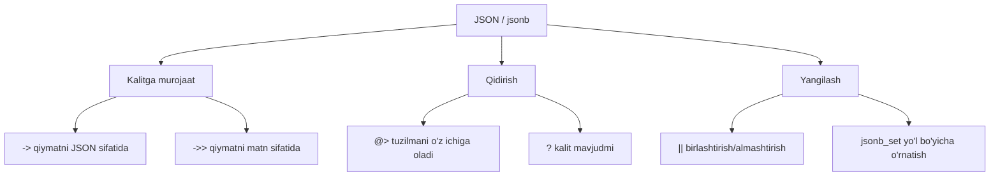

# 5. Data types — Array va JSON

> 📖 Manba: Моргунов, "PostgreSQL. Основы языка SQL", 4-bob (4.5–4.6 bo'limlar)

## Nima uchun kerak?

Oldingi darsda biz **skalyar** (yakka) qiymatlarni saqlaydigan type'lar bilan
tanishdik: bitta son, bitta matn, bitta sana. Lekin hayotda ba'zan bitta katakda
**bir nechta** qiymat saqlash qulayroq bo'ladi.

Masalan, aviakompaniyada har bir pilot haftaning qaysi kunlari uchishini bilishimiz
kerak. Bu — kunlar **ro'yxati**: `{1, 3, 5, 6, 7}`. Alohida table yaratib, har bir
kunni alohida qatorga yozish o'rniga, hammasini bitta katakda **array** sifatida
saqlash ancha qulay.

Yoki pilotning qiziqishlarini saqlashimiz kerak: sport turlari, uyida kutubxona
bormi, nechta davlatga borgan. Bu — tuzilishga ega **obyekt**. Uni **JSON**
formatida bitta katakda saqlashimiz mumkin.

PostgreSQL relational (jadvalli) baza bo'lsa-da, aynan shu ikki imkoniyat —
**array** va **JSON** — unga ba'zi hollarda "NoSQL" kabi moslashuvchanlik beradi.



---

## 5.1. Array (massiv) type'lar

PostgreSQL table'da shunday ustun yaratishga ruxsat beradiki, unda skalyar qiymat
emas, balki **o'zgaruvchan uzunlikdagi array** saqlanadi. Array'lar ko'p o'lchamli
bo'lishi va istalgan built-in yoki foydalanuvchi type'ini o'z ichiga olishi mumkin.

### Array ustunini e'lon qilish

Array ekanini bildirish uchun type nomiga **kvadrat qavs** `[]` qo'shiladi.
Elementlar sonini ko'rsatish shart emas.

```sql
CREATE TABLE pilots (
    pilot_name  text,
    schedule    integer[]   -- butun sonlar array'i (uchish kunlari)
);
```

Izoh: `schedule` ustuni har bir pilot uchun turli uzunlikdagi kunlar ro'yxatini
saqlaydi.

### Array'ga qiymat kiritish

INSERT'da array matn (string) literali sifatida yoziladi: figurali qavs `{}`
ichida, elementlar vergul bilan ajratiladi, oldiga type cast `::integer[]`:

```sql
INSERT INTO pilots
    VALUES ('Ivan',  '{ 1, 3, 5, 6, 7 }'::integer[]),
           ('Petr',  '{ 1, 2, 5, 7 }'::integer[]),
           ('Pavel', '{ 2, 5 }'::integer[]),
           ('Boris', '{ 3, 5, 6 }'::integer[]);

SELECT * FROM pilots;
--  pilot_name |  schedule
-- ------------+-------------
--  Ivan       | {1,3,5,6,7}
--  Petr       | {1,2,5,7}
--  Pavel      | {2,5}
--  Boris      | {3,5,6}
```

E'tibor bering: har bir array turli sonli elementga ega.

### Array'ni kengaytirish (element qo'shish/o'chirish)

**Konkatenatsiya (`||`)** — array oxiriga element qo'shadi:

```sql
-- Boris'ning grafigiga 7-kunni qo'shamiz:
UPDATE pilots
    SET schedule = schedule || 7
    WHERE pilot_name = 'Boris';
-- {3,5,6} -> {3,5,6,7}
```

**`array_append`** — oxiriga, **`array_prepend`** — boshiga qo'shadi (e'tibor
bering, parametrlar tartibi teskari):

```sql
-- Pavel grafigi oxiriga 6-kunni qo'shamiz:
UPDATE pilots
    SET schedule = array_append(schedule, 6)
    WHERE pilot_name = 'Pavel';
-- {2,5} -> {2,5,6}

-- Pavel grafigi boshiga 1-kunni qo'shamiz:
UPDATE pilots
    SET schedule = array_prepend(1, schedule)
    WHERE pilot_name = 'Pavel';
-- {2,5,6} -> {1,2,5,6}
```

**`array_remove`** — berilgan **qiymat**ga teng barcha elementlarni o'chiradi
(indeks emas, aynan qiymat):

```sql
-- Ivan grafigidan 5-kunni (payshanba) olib tashlaymiz:
UPDATE pilots
    SET schedule = array_remove(schedule, 5)
    WHERE pilot_name = 'Ivan';
-- {1,3,5,6,7} -> {1,3,6,7}
```

### Alohida elementga murojaat qilish (indekslash)

PostgreSQL'da array indekslari **1 dan** boshlanadi (0 dan emas!). Alohida
elementlarni xuddi alohida ustunlar kabi o'zgartirish mumkin:

```sql
-- Petr grafigining 1- va 2-elementini o'zgartiramiz:
UPDATE pilots
    SET schedule[1] = 2, schedule[2] = 3
    WHERE pilot_name = 'Petr';

-- Yoki slice (kesma) orqali bir vaqtda diapazonni:
UPDATE pilots
    SET schedule[1:2] = ARRAY[2, 3]
    WHERE pilot_name = 'Petr';
-- {1,2,5,7} -> {2,3,5,7}
```

Bu yerda `1:2` — array'ning birinchi va oxirgi element indekslari (slice).
`ARRAY[2, 3]` — array yaratishning muqobil (SQL standartiga mos) usuli.

### Array ichida qidirish

Endi table'dan tanlab olishda array bilan qanday amallar bajarish mumkinligini
ko'ramiz.

**`array_position`** — element birinchi marta qaysi indeksda uchrashini
qaytaradi (topilmasa `NULL`). Chorshanba (3) kuni uchadigan pilotlarni topamiz:

```sql
SELECT * FROM pilots
    WHERE array_position(schedule, 3) IS NOT NULL;
--  pilot_name |  schedule
-- ------------+-----------
--  Boris      | {3,5,6,7}
--  Ivan       | {1,3,6,7}
--  Petr       | {2,3,5,7}
```

**`@>` operatori (contains)** — chap array o'ng array'ning **barcha**
elementlarini o'z ichiga oladimi? Dushanba (1) VA yakshanba (7) uchadiganlar:

```sql
SELECT * FROM pilots
    WHERE schedule @> '{ 1, 7 }'::integer[];
--  pilot_name |  schedule
-- ------------+-----------
--  Ivan       | {1,3,6,7}
```

**`&&` operatori (overlap)** — ikki array'ning **umumiy** elementi bormi
(kesishadimi)? Seshanba (2) YOKI payshanba (5) uchadiganlar:

```sql
SELECT * FROM pilots
    WHERE schedule && ARRAY[2, 5];
--  pilot_name |  schedule
-- ------------+-----------
--  Boris      | {3,5,6,7}
--  Pavel      | {1,2,5,6}
--  Petr       | {2,3,5,7}
```

Savolni **inkor** qilish uchun `NOT` qo'shamiz — na seshanba, na payshanba
uchadiganlar:

```sql
SELECT * FROM pilots
    WHERE NOT (schedule && ARRAY[2, 5]);
--  pilot_name |  schedule
-- ------------+-----------
--  Ivan       | {1,3,6,7}
```

> Eslatma: `ANY` va `ALL` operatorlari ham keng ishlatiladi. `5 = ANY(schedule)`
> — array ichida kamida bitta 5 bormi; `5 < ALL(schedule)` — barcha elementlar
> 5 dan kattami. Kitobdagi `@>` va `&&` — bularning array-versiyalari.

### Array'ni ustunga yoyish — unnest

Ba'zan array'ni table ustuni ko'rinishida "yoyish" kerak bo'ladi. Bunda
**`unnest`** funksiyasi yordam beradi — har bir element alohida qatorga aylanadi:

```sql
SELECT unnest(schedule) AS days_of_week
    FROM pilots
    WHERE pilot_name = 'Ivan';
--  days_of_week
-- --------------
--  1
--  3
--  6
--  7
```



---

## 5.2. JSON type'lar

JSON type'lar table ustunlarida **JSON** (JavaScript Object Notation) formatidagi
qiymatlarni saqlash uchun mo'ljallangan. Ikki xili bor: **`json`** va **`jsonb`**.

### json va jsonb farqi

Asosiy farq — **tezlik** (ishlash unumdorligi):

| Xususiyat | `json` | `jsonb` |
|-----------|--------|---------|
| Saqlash | Matn ko'rinishida (kiritilganidek) | Binar (tahlil qilingan) ko'rinishda |
| Yozish (INSERT) | Tez | Sekinroq (bir marta tahlil qilinadi) |
| O'qish / qidirish | Sekin (har safar tahlil qilinadi) | Tez (qayta tahlil kerak emas) |
| Kalitlar tartibi | Saqlanadi | Saqlanmaydi |
| Takroriy kalitlar | Saqlanadi | Faqat oxirgisi qoladi |
| Indekslash (GIN) | Yo'q | Bor |

**`json`** qiymatni qanday kiritilgan bo'lsa, xuddi shundayligicha (matn sifatida)
saqlaydi — shuning uchun yozish tez. Lekin har safar bu qiymatni ishlatganda
PostgreSQL uni qaytadan tahlil (parse) qiladi, bu esa o'qishni sekinlashtiradi.

**`jsonb`** qiymatni **bir marta** — yozish paytida tahlil qilib, binar ko'rinishda
saqlaydi. Yozish biroz sekinroq, lekin keyingi barcha murojaatlar ancha tez bo'ladi.

> Tavsiya: agar maxsus sabab bo'lmasa, ilovalarda **`jsonb`** ishlatilsin.

### JSON ustuni yaratish va to'ldirish

Aviakompaniya pilotlar sog'lig'ini yaxshilashni qo'llab-quvvatlaydi. Har bir pilot
haqida: qaysi sport turlari bilan shug'ullanadi, uyida kutubxona bormi va nechta
davlatga borgan — shularni saqlaymiz.

```sql
CREATE TABLE pilot_hobbies (
    pilot_name  text,
    hobbies     jsonb
);

INSERT INTO pilot_hobbies
    VALUES ('Ivan',
            '{ "sports": [ "futbol", "suzish" ],
               "home_lib": true, "trips": 3 }'::jsonb),
           ('Petr',
            '{ "sports": [ "tennis", "suzish" ],
               "home_lib": true, "trips": 2 }'::jsonb),
           ('Pavel',
            '{ "sports": [ "suzish" ],
               "home_lib": false, "trips": 4 }'::jsonb),
           ('Boris',
            '{ "sports": [ "futbol", "suzish", "tennis" ],
               "home_lib": true, "trips": 0 }'::jsonb);
```

Izoh: JSON obyektida kalitlar (`"sports"`, `"home_lib"`, `"trips"`) qo'shtirnoq
ichida, qiymatlar esa turli type'da bo'lishi mumkin: array (`[...]`), boolean
(`true`), son (`3`).

`jsonb` ekani sababli, chiqishda kalitlar tartibi kiritilgandagidek saqlanmaydi:

```sql
SELECT * FROM pilot_hobbies;
--  pilot_name |                    hobbies
-- ------------+------------------------------------------------
--  Ivan       | {"trips": 3, "sports": ["futbol", "suzish"], "home_lib": true}
--  ...
```

### JSON ichida qidirish — operatorlar

**`@>` operatori (contains)** — JSON chap tomondagi o'ng tomondagi tuzilmani o'z
ichiga oladimi? Futbol o'ynaydigan pilotlarni topamiz:

```sql
SELECT * FROM pilot_hobbies
    WHERE hobbies @> '{ "sports": [ "futbol" ] }'::jsonb;
--  pilot_name | ...
-- ------------+----
--  Ivan       | ...
--  Boris      | ...
```

**`->` operatori** — kalit bo'yicha qiymatni **JSON sifatida** qaytaradi.
**`->>` operatori** — kalit bo'yicha qiymatni **matn (text) sifatida** qaytaradi:

```sql
-- Faqat sport ma'lumotini olamiz (-> JSON qaytaradi):
SELECT pilot_name, hobbies->'sports' AS sports
    FROM pilot_hobbies
    WHERE hobbies->'sports' @> '[ "futbol" ]'::jsonb;
--  pilot_name |          sports
-- ------------+---------------------------
--  Ivan       | ["futbol", "suzish"]
--  Boris      | ["futbol", "suzish", "tennis"]
```

> Diqqat: `->` va `->>` farqi — `->` natijasi hali ham JSON (u bilan yana JSON
> operatorlari ishlaydi), `->>` natijasi esa oddiy matn (WHERE'da matn sifatida
> solishtirish uchun qulay).

**`?` operatori** — obyektda berilgan **kalit** bor-yo'qligini tekshiradi. Bu
foydali, chunki turli qatorlarda JSON tuzilmasi har xil bo'lishi mumkin:

```sql
-- 'sport' (xato yozilgan) kaliti yo'q:
SELECT count(*) FROM pilot_hobbies WHERE hobbies ? 'sport';
--  count
-- -------
--      0

-- 'sports' kaliti bor:
SELECT count(*) FROM pilot_hobbies WHERE hobbies ? 'sports';
--  count
-- -------
--      4
```

### JSON'ni yangilash

**`||` operatori** — JSON obyektlarni birlashtiradi (mavjud kalit qiymati
almashtiriladi). Boris endi faqat xokkey bilan shug'ullanadi:

```sql
UPDATE pilot_hobbies
    SET hobbies = hobbies || '{ "sports": [ "xokkey" ] }'
    WHERE pilot_name = 'Boris';
-- "sports" endi ["xokkey"] bo'ldi
```

**`jsonb_set` funksiyasi** — JSON ichidagi aniq **yo'l (path)** bo'yicha qiymat
o'rnatadi. Boris array'iga futbolni qo'shamiz:

```sql
UPDATE pilot_hobbies
    SET hobbies = jsonb_set(hobbies, '{ sports, 1 }', '"futbol"')
    WHERE pilot_name = 'Boris';
-- "sports": ["xokkey"] -> ["xokkey", "futbol"]
```

Izoh: ikkinchi parametr — obyekt ichidagi yo'l: `sports` kaliti va array'ning
1-indeksi (array elementlari 0 dan sanaladi). Uchinchi parametr `jsonb`
turida bo'lgani uchun literal `'"futbol"'` ko'rinishida: tashqi bitta qo'shtirnoq
SQL uchun, ichki ikkita qo'shtirnoq JSON matn qiymati uchun.



### Qachon JSON ishlatish kerak?

JSON kuchli vosita, lekin uni **har doim** ishlatish to'g'ri emas. Relational
baza tabiatan **table + ustun** modeliga tayanadi, JSON esa istisno holatlar
uchun.

**JSON ishlatish mantiqli:**

- Ma'lumot tuzilmasi oldindan noma'lum yoki qatordan qatorga o'zgaradigan bo'lsa;
- Turli, kam ishlatiladigan atributlar to'plami bo'lsa (sozlamalar, metadata);
- Tashqi API'dan kelgan JSON'ni o'zgartirmasdan saqlash kerak bo'lsa.

**JSON'dan qochish kerak:**

- Ma'lumot aniq va barqaror tuzilmaga ega bo'lsa — oddiy ustunlar tez va aniq;
- Qiymatlar bo'yicha tez-tez qidiruv, JOIN, agregatsiya kerak bo'lsa;
- Ma'lumotlar yaxlitligini (foreign key, constraint) ta'minlash zarur bo'lsa.

---

## Xulosa

Bu darsda bitta katakda bir nechta qiymat saqlashning ikki yo'lini o'rgandik:
bir xil turdagi ro'yxat uchun **array**, tuzilishli obyekt uchun **JSON**.

**Umumiy jadval:**

| Vosita | Type | Qachon ishlatish |
|--------|------|-----------------|
| Ro'yxat | `type[]` (masalan `integer[]`) | Bir xil turdagi qiymatlar ketma-ketligi |
| Obyekt | `json` | JSON matnni qanday keldi, shundayligicha saqlash (tez yozish) |
| Obyekt | `jsonb` | Qidiruv/o'qish tez, indekslash — tavsiya etiladi |

**Array operatorlari:**

| Operator/funksiya | Vazifasi |
|-------------------|----------|
| `\|\|`, `array_append`, `array_prepend` | Element qo'shish |
| `array_remove` | Qiymat bo'yicha element o'chirish |
| `schedule[i]`, `schedule[i:j]` | Indeks / slice bo'yicha murojaat |
| `array_position` | Element indeksini topish |
| `@>` | Barcha elementlarni o'z ichiga oladi |
| `&&` | Kesishadi (umumiy element bor) |
| `unnest` | Array'ni qatorlarga yoyish |

**JSON operatorlari:**

| Operator/funksiya | Vazifasi |
|-------------------|----------|
| `->` | Kalit bo'yicha qiymat (JSON sifatida) |
| `->>` | Kalit bo'yicha qiymat (matn sifatida) |
| `@>` | Tuzilmani o'z ichiga oladi |
| `?` | Kalit mavjudligini tekshirish |
| `\|\|` | Obyektlarni birlashtirish |
| `jsonb_set` | Yo'l bo'yicha qiymat o'rnatish |

**Eslab qol:**

- Array indekslari PostgreSQL'da **1 dan** boshlanadi.
- `@>` "o'z ichiga oladi", `&&` "kesishadi" — array ham, JSON ham qo'llaydi.
- `->` JSON qaytaradi, `->>` matn qaytaradi — bu farqni yodda tuting.
- Deyarli har doim `json` emas, **`jsonb`** tanlang.
- Ma'lumot barqaror tuzilmaga ega bo'lsa — JSON emas, oddiy ustunlar ishlating.

---

## Nazorat savollari

1. Array ustunini qanday e'lon qilinadi? `integer[]` yozuvidagi `[]` nimani
   bildiradi?

2. PostgreSQL'da array indekslari qaysi raqamdan boshlanadi? `schedule[1]` array'ning
   nechanchi elementiga murojaat qiladi?

3. `array_append`, `array_prepend` va `array_remove` funksiyalarining farqini
   tushuntiring. `array_remove` indeks bo'yicha ishlaydimi yoki qiymat bo'yicha?

4. `@>` va `&&` operatorlari orasidagi farq nima? "Dushanba VA yakshanba uchadigan
   pilotlar" uchun qaysi birini, "dushanba YOKI yakshanba" uchun qaysi birini
   ishlatamiz?

5. `unnest` funksiyasi nima qiladi? Uni qaysi holatda ishlatasiz?

6. `json` va `jsonb` type'lari orasidagi asosiy farq nima? Qaysi biri yozishda,
   qaysi biri o'qishda tezroq? Odatda qaysi biri tavsiya etiladi?

7. JSON'da `->` va `->>` operatorlarining farqini tushuntiring. `WHERE`
   shartida matn bilan solishtirish uchun qaysi biri qulayroq?

8. Ma'lumotni oddiy ustunlar o'rniga JSON'da saqlash qachon mantiqli, qachon esa
   noto'g'ri? Kamida ikkitadan misol keltiring.
