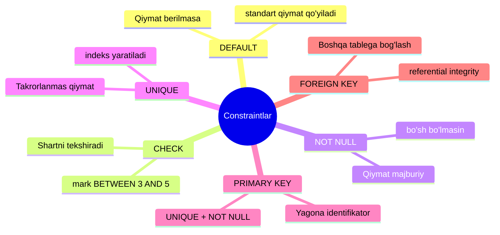
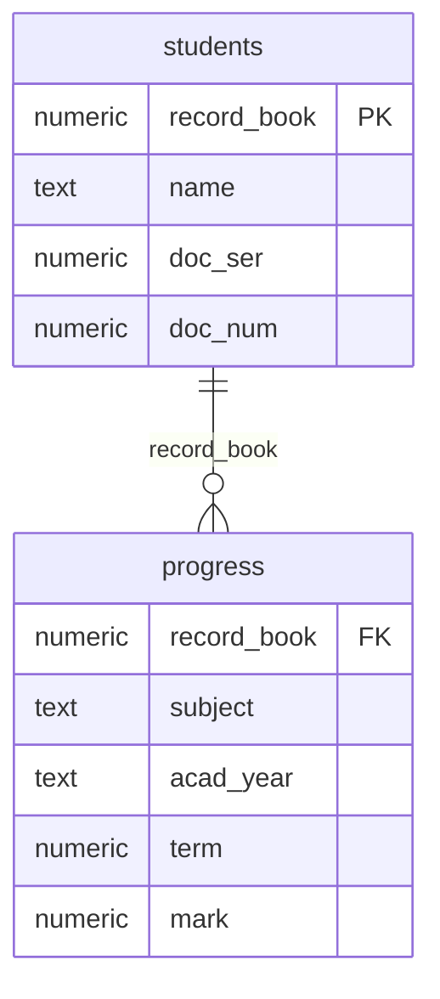
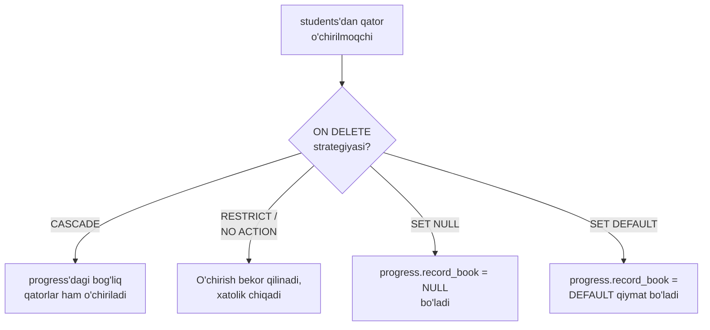

# 6. DDL — DEFAULT va Constraintlar

> 📖 Manba: Моргунов, "PostgreSQL. Основы языка SQL", 5-bob (5.1-bo'lim, 95–105-betlar)

## Nima uchun kerak?

SQL tili an'anaviy ravishda ikki guruh buyruqlarga bo'linadi:

- **DDL (Data Definition Language)** — ma'lumotlarni *aniqlash* tili. Bu guruh table kabi ma'lumotlar bazasi obyektlarini yaratish uchun ishlatiladi.
- **DML (Data Manipulation Language)** — ma'lumotlar bilan *ishlash* tili: qator qo'shish, so'rovlar yuborish, yangilash va o'chirish.

Bu darsda biz DDL bilan tanishamiz. Ammo faqat `CREATE TABLE` yozishning o'zi kifoya emas. Tasavvur qiling, siz talabalar bahosini saqlaydigan table yaratdingiz va kimdir u yerga baho sifatida `100` yoki `-5` qiymatini kiritdi. Yoki bir talabaning zachyot daftarchasi raqami boshqasiga to'g'ri keldi. Yoki mavjud bo'lmagan talabaga baho qo'yildi.

Bunday xatolardan himoyalanish uchun **constraint** (yaxlitlik cheklovlari) ishlatiladi. Constraint — bu ma'lumotlar bazasi darajasidagi qoidalar bo'lib, DBMS ularni doimo tekshirib turadi va qoidani buzadigan ma'lumotni kiritishga yo'l qo'ymaydi. Bu ma'lumotlarning to'g'riligini (consistency) kafolatlaydi.

Bu darsda tayanch misol sifatida ikkita oddiy table ishlatamiz — **«Talabalar»** (`students`) va **«O'zlashtirish»** (`progress`).

`students` table strukturasi:

| Atribut tavsifi | Atribut nomi | Tur (PostgreSQL) | Constraint |
| --- | --- | --- | --- |
| Zachyot daftarchasi № | `record_book` | numeric(5) | NOT NULL |
| F.I.Sh. | `name` | text | NOT NULL |
| Hujjat seriyasi | `doc_ser` | numeric(4) | |
| Hujjat raqami | `doc_num` | numeric(6) | |

`progress` table strukturasi:

| Atribut tavsifi | Atribut nomi | Tur (PostgreSQL) | Constraint |
| --- | --- | --- | --- |
| Zachyot daftarchasi № | `record_book` | numeric(5) | NOT NULL |
| Fan | `subject` | text | NOT NULL |
| O'quv yili | `acad_year` | text | NOT NULL |
| Semestr | `term` | numeric(1) | NOT NULL, term = 1 OR term = 2 |
| Baho | `mark` | numeric(1) | DEFAULT 5, mark >= 3 AND mark <= 5 |

## Constraint turlari — umumiy ko'rinish

Quyidagi diagramma PostgreSQL'dagi constraint turlarini va ularning vazifasini ko'rsatadi:



## DEFAULT — standart qiymat

Ma'lumotlar bazasi bilan ishlaganda ko'pincha biror ustun uchun qaysidir qiymat *tipik* (eng ko'p uchraydigan) bo'ladi. Masalan, talabalar odatda «a'lo» (`5`) baho oladi, deb faraz qilsak, `mark` ustuni uchun standart qiymatni `DEFAULT` kalit so'zi bilan ko'rsatamiz:

```sql
CREATE TABLE progress
( ...
  mark numeric( 1 ) DEFAULT 5,
  ...
);
```

Endi qator qo'shayotganda `mark` qiymatini ko'rsatmasak, DBMS avtomatik ravishda `5` qo'yadi. Bu ko'p mehnatni tejaydi.

## CHECK — shartni tekshirish

`CHECK` constraint qavs ichida yozilgan bir yoki bir nechta shartni tekshiradi. Uni ikki xil ko'rinishda yozish mumkin:

- **Atribut darajasida** — bitta ustun ta'rifining bir qismi sifatida
- **Table darajasida** — mustaqil element sifatida (bir nechta ustunga tegishli bo'lsa qulay)

Semestr faqat `1` yoki `2` bo'lishi mumkin, baho esa faqat `3`, `4` yoki `5`. Buni CHECK bilan atribut darajasida yozamiz:

```sql
CREATE TABLE progress
( ...
  term numeric( 1 ) CHECK ( term = 1 OR term = 2 ),
  mark numeric( 1 ) CHECK ( mark >= 3 AND mark <= 5 ),
  ...
);
```

Endi bu yerga `term = 3` yoki `mark = 100` kiritib bo'lmaydi — DBMS xatolik beradi.

### Constraint'ga nom berish — CONSTRAINT

Har bir constraint o'z nomiga ega. Uni `CONSTRAINT` kalit so'zi bilan o'zimiz berishimiz mumkin. Agar bermasak, DBMS nomni avtomatik shakllantiradi. O'zimiz nom bersak, uni cheklov mohiyatiga qarab tanlaymiz — shunda xatolik xabari chiqqanda uning sababini tushunish osonlashadi.

`mark` uchun CHECK'ni table darajasida, o'zimiz bergan nom bilan yozamiz:

```sql
CREATE TABLE progress
( ...
  mark numeric( 1 ),
  CONSTRAINT valid_mark CHECK ( mark >= 3 AND mark <= 5 ),
  ...
);
```

Endi bu shart buzilsa, xatolik xabarida `valid_mark` nomi ko'rinadi.

## NOT NULL — qiymat majburiy

`NOT NULL` constraint qo'yilgan ustunda albatta biror aniq qiymat bo'lishi shart, ya'ni u bo'sh (NULL) bo'lolmaydi. Predmet sohasi mantiqiga ko'ra biror maydon majburiy bo'lsa, bu cheklovni ishlatamiz.

Funksional jihatdan `NOT NULL` cheklovi `CHECK ( column_name IS NOT NULL )` ga teng, lekin PostgreSQL'da aniq `NOT NULL` yozish samaraliroq.

```sql
CREATE TABLE students
( record_book numeric( 5 ) NOT NULL,
  name        text          NOT NULL,
  ...
);
```

## UNIQUE — takrorlanmas qiymat

`UNIQUE` constraint qo'yilgan ustunda barcha qatorlardagi qiymatlar bir-birini takrorlamasligi kerak. Cheklov bitta ustunni ham, bir nechta ustunni ham qamrab olishi mumkin. Bir nechta ustun bo'lsa, ularning *kombinatsiyasi* takrorlanmas bo'lishi kerak.

Bitta ustun uchun UNIQUE'ni to'g'ridan-to'g'ri ustun ta'rifida yozamiz. Masalan, `students` table'da zachyot daftarchasi raqami takrorlanmasligi mantiqan to'g'ri:

```sql
CREATE TABLE students
( record_book numeric( 5 ) UNIQUE,
  ...
);
```

Xuddi shuni nom berib ham yozish mumkin:

```sql
CREATE TABLE students
( record_book numeric( 5 ),
  ...
  CONSTRAINT unique_record_book UNIQUE ( record_book ),
  ...
);
```

Bir nechta ustun uchun UNIQUE misoli — hujjat seriyasi va raqami kombinatsiyasi takrorlanmas bo'lishi kerak:

```sql
CREATE TABLE students
( ...
  doc_ser numeric( 4 ),
  doc_num numeric( 6 ),
  ...
  CONSTRAINT unique_passport UNIQUE ( doc_ser, doc_num ),
  ...
);
```

> Eslatma: UNIQUE constraint qo'shilganda uni qo'llab-quvvatlash uchun B-tree asosidagi indeks avtomatik yaratiladi.

## PRIMARY KEY — birlamchi kalit

Birlamchi kalit (primary key) — bu table'dagi qatorlarning **yagona identifikatori**. Kalit ikki xil bo'ladi:

- **oddiy** — faqat bitta atributdan iborat
- **tarkibli (composite)** — bir nechta atributdan iborat

UNIQUE'dan farqli o'laroq, primary key tarkibiga kiruvchi atributlar NULL qiymatga ega bo'lolmaydi. Ya'ni:

> **PRIMARY KEY = UNIQUE + NOT NULL**

Amaliyotda primary key'ni UNIQUE va NOT NULL kombinatsiyasi bilan almashtirmaslik kerak, chunki relyatsion nazariya har bir table'da aynan primary key bo'lishini talab qiladi. Primary key metama'lumotlarning (metadata) bir qismidir — uning mavjudligi boshqa table'larga ushbu table qatorlariga murojaat qilish imkonini beradi (bu foreign key uchun kerak bo'ladi).

Bitta atributdan iborat primary key'ni ustun ta'rifida yozamiz:

```sql
CREATE TABLE students
( record_book numeric( 5 ) PRIMARY KEY,
  ...
);
```

Yoki alohida constraint sifatida:

```sql
CREATE TABLE students
( record_book numeric( 5 ),
  ...
  PRIMARY KEY ( record_book )
);
```

Tarkibli primary key'da ustun nomlari vergul bilan sanaladi:

```sql
PRIMARY KEY ( ustun1, ustun2, ... )
```

> Muhim: Table'da NOT NULL bilan to'ldirilgan istalgancha UNIQUE cheklov bo'lishi mumkin, lekin **primary key faqat bitta** bo'ladi. PostgreSQL primary key bo'lmasligiga ham yo'l qo'yadi, lekin qat'iy nazariya bunday qilishni tavsiya etmaydi.

## FOREIGN KEY — tashqi kalit va referential integrity

Bu constraint'lar orasida eng muhimi. Foreign key (tashqi kalit) bog'langan table'lar orasida **referential integrity** (ссылочная целостность — bog'lanish yaxlitligi)ni ta'minlaydi.

Masalan, `students` table'da talabalar haqidagi ma'lumot, `progress` table'da esa ularning bahosi saqlanadi. Bir talabaga bir nechta baho to'g'ri kelishi mumkin. `progress`ning har bir qatorida talaba haqidagi barcha ma'lumotni (F.I.Sh., hujjat va h.k.) takrorlash shart emas — faqat talabaning yagona identifikatorini, ya'ni `record_book`ni ko'rsatish kifoya. Aynan shu `record_book` `progress` table'ning foreign key'i bo'ladi.

Terminlar bilan aytganda:

- `progress` — **bog'lovchi** (referencing, «podchinyonnaya») table
- `students` — **bog'lanuvchi** (referenced, «glavnaya») table

Foreign key bog'lanuvchi table'ning **primary key**iga (yoki UNIQUE kalitiga) murojaat qiladi.



Foreign key'ni atribut darajasida `REFERENCES` bilan yaratamiz:

```sql
CREATE TABLE progress
( record_book numeric( 5 ) REFERENCES students ( record_book ),
  ...
);
```

Bu shuni bildiradi: `progress` table'ga `record_book` qiymati `students`da mavjud bo'lmagan qator kiritib bo'lmaydi. Sodda qilib aytganda, avval `students` table'ga kiritilmagan talabaga baho qo'yib bo'lmaydi.

Foreign key primary key'ga murojaat qilganda ustun nomini ko'rsatmasdan, qisqartirilgan yozuv ishlatish mumkin:

```sql
CREATE TABLE progress
( record_book numeric( 5 ) REFERENCES students,
  ...
);
```

Table darajasida esa `FOREIGN KEY` bilan yoziladi:

```sql
CREATE TABLE progress
( record_book numeric( 5 ),
  ...
  FOREIGN KEY ( record_book )
    REFERENCES students ( record_book )
);
```

## ON DELETE / ON UPDATE — bog'lanish strategiyalari

Table'lar foreign key bilan bog'langanda muhim savol tug'iladi: agar bog'lanuvchi table'dagi (`students`) qator o'chirilsa yoki uning kaliti o'zgarsa, unga murojaat qilayotgan qatorlar (`progress`) bilan nima qilish kerak? Bu savolni **siyosat** (strategiya) belgilaydi.

Talaba o'qishdan chetlashtirilganda uning `students`dagi qatori o'chiriladi, deb faraz qilaylik. `progress`dagi bog'liq qatorlar bilan nima qilamiz? Bir nechta variant bor:



### 1. CASCADE — kaskadli o'chirish

Talaba chetlashtirilganda uning butun o'zlashtirish tarixi ham o'chiriladi. Buning uchun `ON DELETE CASCADE` qo'shamiz:

```sql
CREATE TABLE progress
( record_book numeric( 5 ),
  ...
  FOREIGN KEY ( record_book )
    REFERENCES students ( record_book )
    ON DELETE CASCADE
);
```

### 2. RESTRICT / NO ACTION — o'chirishni taqiqlash

`progress`da hech bo'lmasa bitta bog'liq qator bo'lsa, `students`dan qatorni o'chirishga yo'l qo'yilmaydi:

```sql
CREATE TABLE progress
( record_book numeric( 5 ),
  ...
  FOREIGN KEY ( record_book )
    REFERENCES students ( record_book )
    ON DELETE RESTRICT
);
```

Ikkala variant ham o'chirishni bekor qiladi va xatolik chiqaradi. Farqi: `NO ACTION` bilan cheklov tekshiruvini tranzaksiya doirasida keyinroqqa qoldirish mumkin, `RESTRICT` bilan esa tekshiruv **darhol** amalga oshiriladi. Agar strategiya aniq ko'rsatilmasa, standart holatda `NO ACTION` ishlatiladi.

### 3. SET NULL — NULL qiymat qo'yish

`students`dan qator o'chirilganda `progress`ning bog'liq qatorlarida `record_book = NULL` bo'ladi. Bu ishlashi uchun foreign key atributiga NOT NULL cheklovi qo'yilmagan bo'lishi kerak:

```sql
CREATE TABLE progress
( record_book numeric( 5 ),
  ...
  FOREIGN KEY ( record_book )
    REFERENCES students ( record_book )
    ON DELETE SET NULL
);
```

### 4. SET DEFAULT — standart qiymat qo'yish

`students`dan qator o'chirilganda `progress`ning bog'liq qatorlarida `record_book` uchun `DEFAULT` qiymat qo'yiladi (agar u table yaratishda ko'rsatilgan bo'lsa):

```sql
CREATE TABLE progress
( record_book numeric( 5 ) DEFAULT 12345,
  ...
  FOREIGN KEY ( record_book )
    REFERENCES students ( record_book )
    ON DELETE SET DEFAULT
);
```

> Ehtiyot bo'ling: agar bog'lanuvchi table'da (`students`) `DEFAULT`da ko'rsatilgan kalitga teng qator bo'lmasa, referential integrity buziladi va o'chirish bajarilmaydi.

### ON UPDATE — yangilashda ham xuddi shu strategiyalar

`UPDATE` operatsiyasida ham xuddi shu strategiyalar ishlaydi. Kaskadli o'chirishning analogi — kaskadli yangilash:

```sql
CREATE TABLE progress
( record_book numeric( 5 ),
  ...
  FOREIGN KEY ( record_book )
    REFERENCES students ( record_book )
    ON UPDATE CASCADE
);
```

Kaskadli yangilashda `students`dagi `record_book` yangi qiymatga o'zgartirilsa, bu yangi qiymat unga murojaat qilayotgan `progress`ning barcha qatorlariga ko'chiriladi.

## Yakuniy table ta'riflari

Barcha cheklov turlarini ko'rib chiqqach, `students` va `progress` table'larining to'liq ta'rifini keltiramiz. Avval `edu` bazasini yaratamiz va unga ulanamiz:

```bash
createdb -U postgres edu
psql -d edu -U postgres
```

`students` table (bog'lanuvchi, avval yaratiladi):

```sql
CREATE TABLE students
( record_book numeric( 5 ) NOT NULL,
  name        text          NOT NULL,
  doc_ser     numeric( 4 ),
  doc_num     numeric( 6 ),
  PRIMARY KEY ( record_book )
);
```

`progress` table (bog'lovchi, keyin yaratiladi):

```sql
CREATE TABLE progress
( record_book numeric( 5 ) NOT NULL,
  subject     text          NOT NULL,
  acad_year   text          NOT NULL,
  term        numeric( 1 ) NOT NULL CHECK ( term = 1 OR term = 2 ),
  mark        numeric( 1 ) NOT NULL CHECK ( mark >= 3 AND mark <= 5 )
    DEFAULT 5,
  FOREIGN KEY ( record_book )
    REFERENCES students ( record_book )
    ON DELETE CASCADE
    ON UPDATE CASCADE
);
```

Bu yerda bir qatorda bir nechta constraint jamlangan: `NOT NULL`, `CHECK`, `DEFAULT`, `FOREIGN KEY` — ular bir-biriga xalaqit qilmaydi.

## Xulosa

- **DDL** ma'lumotlar bazasi obyektlarini yaratadi, **constraint**lar esa ma'lumotlar to'g'riligini kafolatlaydi.
- **DEFAULT** — qiymat berilmaganda standart qiymat qo'yadi.
- **CHECK** — ustun qiymati biror shartga mos kelishini tekshiradi; atribut yoki table darajasida yozish mumkin.
- **NOT NULL** — ustunda qiymat bo'lishini majbur qiladi.
- **UNIQUE** — qiymatlar takrorlanmasligini ta'minlaydi (bitta yoki bir nechta ustun bo'yicha).
- **PRIMARY KEY** — qatorlarning yagona identifikatori, `UNIQUE + NOT NULL`ga teng, har table'da faqat bitta bo'ladi.
- **FOREIGN KEY** — table'larni bog'laydi va referential integrity'ni ta'minlaydi.
- **ON DELETE / ON UPDATE** strategiyalari: `CASCADE`, `RESTRICT`, `NO ACTION` (standart), `SET NULL`, `SET DEFAULT`.
- `CONSTRAINT` kalit so'zi bilan cheklovga mazmunli nom berish xatolarni tushunishni osonlashtiradi.

### Eslab qol

- **Constraint'lar ma'lumotlar bazasi darajasida ishlaydi** — dastur xato yozsa ham DBMS himoya qiladi.
- **Foreign key doim primary key'ga (yoki UNIQUE'ga) murojaat qiladi.**
- **Table'larni yaratishda avval bog'lanuvchi (glavnaya), keyin bog'lovchi (podchinyonnaya) table yaratiladi.**

### Amaliyot

1. `edu` bazasini yaratib, `students` va `progress` table'larini keltirilgan ta'rif bilan yarating.
2. `progress`ga `record_book` qiymati `students`da yo'q bo'lgan qator kiritib ko'ring — qanday xatolik chiqadi?
3. `mark = 2` yoki `term = 3` qiymati bilan qator kiritishga urinib ko'ring va CHECK cheklovi qanday ishlashini kuzating.
4. `students`dan biror talabani `DELETE` qiling. `ON DELETE CASCADE` tufayli `progress`dagi qatorlar bilan nima bo'ldi?
5. `ON DELETE`ni `CASCADE` o'rniga `RESTRICT` qilib table'ni qayta yarating va farqni kuzating.

## Nazorat savollari

1. SQL tilining ikki guruh buyruqlari (DDL va DML) qanday vazifalarni bajaradi?
2. `DEFAULT` qiymat qachon qo'llaniladi va uni qanday ko'rsatiladi?
3. `CHECK` constraint'ni atribut darajasida va table darajasida yozishning farqi nimada? Qachon table darajasi kerak bo'ladi?
4. `PRIMARY KEY` va `UNIQUE` cheklovlari orasidagi asosiy farq nima? Nima uchun primary key NOT NULL bo'lishi shart?
5. Referential integrity nima va foreign key uni qanday ta'minlaydi? Qaysi table «glavnaya», qaysi biri «podchinyonnaya» deyiladi?
6. `ON DELETE`ning beshta strategiyasini (CASCADE, RESTRICT, NO ACTION, SET NULL, SET DEFAULT) tushuntiring. `RESTRICT` va `NO ACTION` orasidagi farq nima?
7. Nima uchun table'larni yaratishda avval bog'lanuvchi, keyin bog'lovchi table yaratiladi?
8. `CONSTRAINT` kalit so'zi bilan cheklovga o'zimiz nom berishning qanday afzalligi bor?
