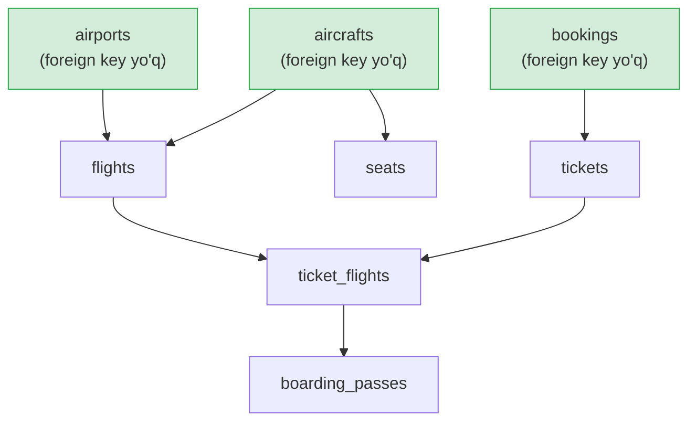
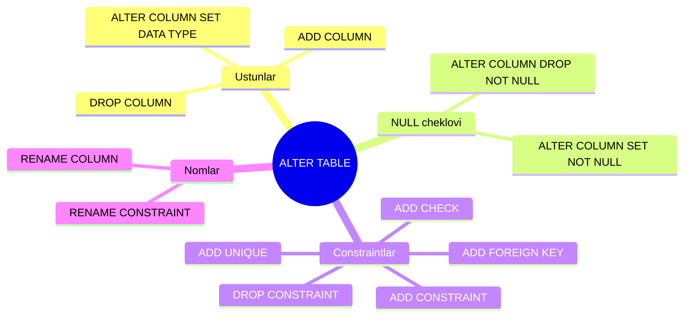

# 7. DDL — jadval yaratish va o'zgartirish

> 📖 Manba: Моргунов, "PostgreSQL. Основы языка SQL", 5-bob (5.2–5.3-bo'limlar, 105–123-betlar)

## Nima uchun kerak?

Oldingi darsda biz constraint'lar bilan tanishdik. Endi table'larni haqiqiy ma'lumotlar bazasida qanday yaratish, o'chirish va **o'zgartirish**ni o'rganamiz.

Table yaratish oson — `CREATE TABLE` yozasiz va tayyor. Lekin real hayotda ma'lumotlar bazasi vaqt o'tishi bilan o'zgaradi: yangi ustun kerak bo'ladi, biror cheklov qo'shiladi yoki olib tashlanadi, ustun turi o'zgaradi. Agar table bo'sh bo'lsa, uni o'chirib qayta yaratish mumkin. Lekin table millionlab qatorni saqlayotgan bo'lsa-chi? Uni o'chirib bo'lmaydi. Aynan shu yerda **`ALTER TABLE`** buyrug'i yordamga keladi — u table strukturasini ma'lumotni yo'qotmasdan o'zgartiradi.

Bu darsda tayanch baza sifatida birinchi bobdagi **«Aviaqatnovlar»** (`demo`) bazasidan foydalanamiz. `bookings` schema'sini joriy schema qilib olamiz:

```bash
psql -d demo -U postgres
```
```sql
SET search_path TO bookings;
```

## Table'lar yaratish tartibi

Table'larni yaratishda ular orasidagi bog'lanishlarni hisobga olish kerak. Foreign key qoidasiga ko'ra, **avval bog'lanuvchi (referenced) table, keyin bog'lovchi (referencing) table** yaratiladi.

Agar table'lar bir-biriga siklik murojaat qilmasa, doim boshqa hech qanday table'ga murojaat qilmaydigan (foreign key'i yo'q) table topiladi. Aynan shundan boshlaymiz.



Yashil rangdagi table'lar foreign key'ga ega emas — ulardan boshlaymiz.

## CREATE TABLE — to'liq sintaksis

Umumiy ko'rinishda CREATE TABLE quyidagicha:

```sql
CREATE TABLE table_nomi
( ustun_nomi tur [ constraint'lar ],
  ustun_nomi tur [ constraint'lar ],
  ...
  [ table darajasidagi constraint'lar ]
);
```

### «Aeroportlar» (airports) table

Bu table foreign key'ga ega emas, shuning uchun undan boshlashimiz mumkin. SQL'da izohlar (comment) ikkita `-` (defis) belgisi bilan yoziladi:

```sql
CREATE TABLE airports
( airport_code char( 3 ) NOT NULL, -- Aeroport kodi
  airport_name text       NOT NULL, -- Aeroport nomi
  city         text       NOT NULL, -- Shahar
  longitude    float      NOT NULL, -- Koordinata: uzunlik
  latitude     float      NOT NULL, -- Koordinata: kenglik
  timezone     text       NOT NULL, -- Vaqt zonasi
  PRIMARY KEY ( airport_code )
);
```

Table ta'rifini `\d` buyrug'i bilan ko'rish mumkin:

```
\d airports
```

Bunda `psql` quyidagicha chiqadi:

```
             Таблица "bookings.airports"
   Столбец    |       Тип        | Модификаторы
--------------+------------------+--------------
 airport_code | character(3)     | NOT NULL
 airport_name | text             | NOT NULL
 city         | text             | NOT NULL
 longitude    | double precision | NOT NULL
 latitude     | double precision | NOT NULL
 timezone     | text             | NOT NULL
Индексы:
    "airports_pkey" PRIMARY KEY, btree (airport_code)
```

`bookings.airports`dagi `bookings` — bu **schema** nomi (bu haqda keyingi darsda). Primary key uchun `airports_pkey` nomli B-tree indeks avtomatik yaratilgan.

### COMMENT — obyektga izoh

PostgreSQL o'z kengaytmasini taklif qiladi — `COMMENT` buyrug'i obyektlarga izoh (tavsif) qo'shadi:

```sql
COMMENT ON COLUMN airports.city IS 'Shahar';
```

Ustun izohlarini ko'rish uchun `\d` ga `+` qo'shiladi:

```
\d+ airports
```

### «Reyslar» (flights) table va surrogat kalit

Bu table'da uchta foreign key bor — ular `aircrafts` va `airports`ga murojaat qiladi:

```sql
CREATE TABLE flights
( flight_id          serial       NOT NULL, -- Reys identifikatori
  flight_no          char( 6 )    NOT NULL, -- Reys raqami
  scheduled_departure timestamptz NOT NULL, -- Reja bo'yicha jo'nash vaqti
  scheduled_arrival   timestamptz NOT NULL, -- Reja bo'yicha kelish vaqti
  departure_airport   char( 3 )   NOT NULL, -- Jo'nash aeroporti
  arrival_airport     char( 3 )   NOT NULL, -- Kelish aeroporti
  status             varchar( 20 ) NOT NULL, -- Reys statusi
  aircraft_code      char( 3 )    NOT NULL, -- Samolyot kodi (IATA)
  actual_departure   timestamptz,           -- Haqiqiy jo'nash vaqti
  actual_arrival     timestamptz,           -- Haqiqiy kelish vaqti
  CHECK ( scheduled_arrival > scheduled_departure ),
  CHECK ( status IN ( 'On Time', 'Delayed', 'Departed',
                      'Arrived', 'Scheduled', 'Cancelled' ) ),
  CHECK ( actual_arrival IS NULL OR
        ( actual_departure IS NOT NULL AND
          actual_arrival   IS NOT NULL AND
          actual_arrival > actual_departure ) ),
  PRIMARY KEY ( flight_id ),
  UNIQUE ( flight_no, scheduled_departure ),
  FOREIGN KEY ( aircraft_code )
    REFERENCES aircrafts ( aircraft_code ),
  FOREIGN KEY ( arrival_airport )
    REFERENCES airports ( airport_code ),
  FOREIGN KEY ( departure_airport )
    REFERENCES airports ( airport_code )
);
```

Bu yerda muhim tushunchalar:

- **Surrogat kalit (surrogate key)** — `flight_id`. Bu real dunyodagi biror mohiyatga mos kelmaydigan, faqat qatorlarni identifikatsiya qilish uchun ishlatiladigan sun'iy yagona kalit. Bu bog'lanuvchi table'larda foreign key'ni bitta atributga qisqartirish imkonini beradi.
- **`serial` turi** — butun sonli qiymatlar avtomatik ketma-ketlik (sequence)dan olinadi. Aslida bu `integer` turi bo'lib, unga standart qiymat `DEFAULT nextval('flights_flight_id_seq'::regclass)` biriktiriladi.
- **`timestamptz` turi** — vaqt zonasi bilan sana/vaqt. Reyslar turli vaqt zonalaridagi shaharlar orasida bo'lgani uchun bu muhim.
- **Tabiiy UNIQUE kalit** — `(flight_no, scheduled_departure)`. Bir vaqtda bir xil raqamli ikkita reys bo'lolmaydi.

CHECK cheklovlarining mazmuni:
1. Reja bo'yicha kelish vaqti jo'nash vaqtidan katta (parvoz davomiyligi doim noldan katta).
2. `status` faqat ro'yxatdagi qiymatlardan biri bo'lishi mumkin.
3. Agar samolyot hali kelmagan bo'lsa (`actual_arrival` NULL), muammo yo'q; agar kelgan bo'lsa, haqiqiy jo'nash vaqti aniq bo'lishi va haqiqiy kelish vaqti undan katta bo'lishi shart.

### «Bronlashlar» (bookings) va «Chiptalar» (tickets)

`bookings` — foreign key'i yo'q oddiy table:

```sql
CREATE TABLE bookings
( book_ref     char( 6 )      NOT NULL, -- Bronlash raqami
  book_date    timestamptz    NOT NULL, -- Bronlash sanasi
  total_amount numeric( 10, 2 ) NOT NULL, -- To'liq narx
  PRIMARY KEY ( book_ref )
);
```

Pul summalari uchun `numeric(10, 2)` ishlatiladi — bu aniq (fixed-point) hisob-kitobni kafolatlaydi. `tickets` esa `bookings`ga foreign key bilan bog'langan:

```sql
CREATE TABLE tickets
( ticket_no    char( 13 )   NOT NULL, -- Chipta raqami
  book_ref     char( 6 )    NOT NULL, -- Bronlash raqami
  passenger_id varchar( 20 ) NOT NULL, -- Yo'lovchi identifikatori
  passenger_name text        NOT NULL, -- Yo'lovchi ismi
  contact_data jsonb,                  -- Aloqa ma'lumotlari
  PRIMARY KEY ( ticket_no ),
  FOREIGN KEY ( book_ref )
    REFERENCES bookings ( book_ref )
);
```

`contact_data` uchun **`jsonb`** turi ishlatiladi — bu yarim-strukturalangan (kam-strukturali) ma'lumotlar uchun qulay. Ularni alohida ustunlarga ajratish maqsadga muvofiq emas.

### «Parvozlar» (ticket_flights) — tarkibli primary key

Bu table primary key sifatida ikkita atribut kombinatsiyasidan foydalanadi — `(ticket_no, flight_id)`. Bu ikkala atributning o'zi ham foreign key hisoblanadi:

```sql
CREATE TABLE ticket_flights
( ticket_no       char( 13 )  NOT NULL, -- Chipta raqami
  flight_id       integer     NOT NULL, -- Reys identifikatori
  fare_conditions varchar( 10 ) NOT NULL, -- Xizmat sinfi
  amount          numeric( 10, 2 ) NOT NULL, -- Parvoz narxi
  CHECK ( amount >= 0 ),
  CHECK ( fare_conditions IN ( 'Economy', 'Comfort', 'Business' ) ),
  PRIMARY KEY ( ticket_no, flight_id ),
  FOREIGN KEY ( flight_id )
    REFERENCES flights ( flight_id ),
  FOREIGN KEY ( ticket_no )
    REFERENCES tickets ( ticket_no )
);
```

### «Chiqish taloni» (boarding_passes) — 1:1 bog'lanish

Bu table `ticket_flights` bilan **1:1** turdagi bog'lanishga ega, shuning uchun foreign key primary key bilan mos keladi:

```sql
CREATE TABLE boarding_passes
( ticket_no   char( 13 )  NOT NULL, -- Chipta raqami
  flight_id   integer     NOT NULL, -- Reys identifikatori
  boarding_no integer     NOT NULL, -- Chiqish taloni raqami
  seat_no     varchar( 4 ) NOT NULL, -- O'rin raqami
  PRIMARY KEY ( ticket_no, flight_id ),
  UNIQUE ( flight_id, boarding_no ),
  UNIQUE ( flight_id, seat_no ),
  FOREIGN KEY ( ticket_no, flight_id )
    REFERENCES ticket_flights ( ticket_no, flight_id )
);
```

Ikkita UNIQUE cheklov muhim: bitta o'ringa ikkita yo'lovchi tushmasligi (`flight_id, seat_no`) va bir reysda chiqish taloni raqamlari takrorlanmasligi (`flight_id, boarding_no`).

Table ta'rifida bog'lanishlar ikki tomondan ko'rinadi: `\d tickets` bajarilsa, «Ограничения внешнего ключа» (bu table nimalarga murojaat qiladi) va «Ссылки извне» (bu table'ga kim murojaat qiladi) bo'limlari chiqadi.

## Temporary (vaqtinchalik) table'lar

Ba'zan bizga faqat joriy sessiya davomida yashaydigan vaqtinchalik table kerak bo'ladi (masalan, oraliq hisob-kitoblar uchun). Buning uchun `TEMPORARY` (yoki `TEMP`) kalit so'zi ishlatiladi:

```sql
CREATE TEMPORARY TABLE tmp_calc
( id    integer,
  total numeric( 10, 2 )
);
```

Bunday table sessiya yopilganda avtomatik o'chiriladi. U maxsus vaqtinchalik schema'da yaratiladi va boshqa sessiyalarga ko'rinmaydi. Tranzaksiya oxirida ma'lumotni tozalash uchun qo'shimcha parametrlar ham bor:

```sql
CREATE TEMP TABLE tmp_calc ( ... ) ON COMMIT DELETE ROWS;
```

## CREATE TABLE ... AS — so'rov natijasidan table

Mavjud so'rov natijasidan darhol yangi table yaratish uchun `CREATE TABLE ... AS` ishlatiladi. Bu table strukturasini ham, ma'lumotni ham bir buyruqda yaratadi:

```sql
CREATE TABLE moscow_airports AS
  SELECT airport_code, airport_name, city
    FROM airports
   WHERE city = 'Москва';
```

Bu buyruq `airports`dan Moskva aeroportlarini tanlab, `moscow_airports` nomli yangi table yaratadi va uni shu qatorlar bilan to'ldiradi. Agar faqat strukturani (ma'lumotsiz) olish kerak bo'lsa, `WITH NO DATA` qo'shiladi:

```sql
CREATE TABLE airports_copy AS
  TABLE airports
  WITH NO DATA;
```

## DROP TABLE — table'ni o'chirish

DDL buyruqlar to'plami `DROP TABLE`siz to'liq bo'lmaydi. Oddiy o'chirish:

```sql
DROP TABLE aircrafts;
```

Lekin `aircrafts` `flights` va `seats` table'lari uchun bog'lanuvchi table bo'lsa, DBMS xatolik beradi:

```
ОШИБКА: удалить объект таблица aircrafts нельзя, так как от него зависят
  другие объекты
ПОДСКАЗКА: Для удаления зависимых объектов используйте DROP ... CASCADE.
```

### DROP TABLE ... CASCADE

Bog'liq obyektlarni ham o'chirish uchun `CASCADE` qo'shamiz:

```sql
DROP TABLE aircrafts CASCADE;
```

Endi `aircrafts` muvaffaqiyatli o'chiriladi, shu bilan birga `flights` va `seats` table'laridagi unga murojaat qilayotgan foreign key'lar ham o'chiriladi (table'larning o'zi qoladi, faqat foreign key'lari yo'qoladi).

```
ЗАМЕЧАНИЕ: удаление распространяется на еще 2 объекта
...
DROP TABLE
```

### DROP TABLE ... IF EXISTS

Agar table mavjud bo'lmasa, oddiy `DROP TABLE` xatolik beradi:

```
ОШИБКА: таблица "aircrafts" не существует
```

Table bor-yo'qligiga ishonchimiz bo'lmasa, keraksiz xatolikdan qochish uchun `IF EXISTS` qo'shamiz:

```sql
DROP TABLE IF EXISTS aircrafts CASCADE;
```

Table mavjud bo'lsa — o'chiriladi, bo'lmasa — xatolik emas, faqat ogohlantirish (замечание) chiqadi.

## ALTER TABLE — table'ni o'zgartirish

`ALTER TABLE` juda ko'p qirrali buyruq. U real ishda uchraydigan barcha vaziyatlarni qamrab oladi. Quyidagi diagramma uning asosiy imkoniyatlarini ko'rsatadi:



### ADD COLUMN — ustun qo'shish

Faraz qilamiz, `aircrafts` table'iga samolyotlarning kreyser tezligini (`speed`) qo'shmoqchimiz. Ustun `integer`, `NOT NULL` va `CHECK(speed >= 300)` bo'lishi kerak:

```sql
ALTER TABLE aircrafts
  ADD COLUMN speed integer NOT NULL CHECK( speed >= 300 );
```

Lekin `aircrafts`da allaqachon qatorlar bor. Yangi ustun qo'shilganda ularda `speed = NULL` bo'ladi, biz esa `NOT NULL` qo'ydik. Shuning uchun xatolik chiqadi:

```
ОШИБКА: столбец "speed" содержит значения NULL
```

**Yechim** — bosqichma-bosqich harakat qilish: avval cheklovsiz ustun qo'shamiz, keyin mavjud qatorlarni to'ldiramiz, so'ng cheklovlarni qo'shamiz:

```sql
-- 1-qadam: cheklovsiz ustun qo'shish
ALTER TABLE aircrafts ADD COLUMN speed integer;

-- 2-qadam: mavjud qatorlarni to'ldirish
UPDATE aircrafts SET speed = 807 WHERE aircraft_code = '733';
UPDATE aircrafts SET speed = 851 WHERE aircraft_code = '763';
UPDATE aircrafts SET speed = 905 WHERE aircraft_code = '773';
UPDATE aircrafts SET speed = 840
  WHERE aircraft_code IN ( '319', '320', '321' );
-- ... qolgan modellar ...

-- 3-qadam: endi cheklovlarni qo'shish mumkin
ALTER TABLE aircrafts ALTER COLUMN speed SET NOT NULL;
ALTER TABLE aircrafts ADD CHECK( speed >= 300 );
```

### DROP NOT NULL / DROP CONSTRAINT / DROP COLUMN

Cheklovga ehtiyoj qolmasa, uni olib tashlaymiz. Diqqat: CHECK cheklovini o'chirish uchun uning nomi kerak (nomni `\d aircrafts` bilan bilib olish mumkin):

```sql
ALTER TABLE aircrafts ALTER COLUMN speed DROP NOT NULL;
ALTER TABLE aircrafts DROP CONSTRAINT aircrafts_speed_check;
```

Ustunning o'zini o'chirish (undagi cheklovlarni oldindan o'chirish shart emas):

```sql
ALTER TABLE aircrafts DROP COLUMN speed;
```

### ALTER COLUMN ... SET DATA TYPE — turni o'zgartirish

Ustunning ma'lumotlar turini o'zgartirish uchun. Masalan, `longitude` va `latitude`ni `float`dan `numeric(5,2)`ga o'zgartiramiz. Bir buyruqda bir nechta amal bajarilishi mumkin:

```sql
ALTER TABLE airports
  ALTER COLUMN longitude SET DATA TYPE numeric( 5, 2 ),
  ALTER COLUMN latitude  SET DATA TYPE numeric( 5, 2 );
```

Agar dastlabki va yangi tur bir guruhga tegishli bo'lsa (ikkalasi ham sonli), o'zgartirish avtomatik amalga oshadi va qiymatlar yaxlitlanadi.

### USING — turni murakkab o'zgartirish

Agar dastlabki va yangi turlar **turli guruhlarga** tegishli bo'lsa (masalan, matndan songa), qo'shimcha harakat kerak. `USING` bilan eski qiymatlarni yangisiga qanday aylantirishni ko'rsatamiz.

Masalan, `seats.fare_conditions` ustunini matnli (`varchar(10)`) qiymatdan sonli (`integer`) qiymatga o'zgartiramiz. `CASE WHEN ... THEN ... ELSE ... END` konstruksiyasidan foydalanamiz:

```sql
ALTER TABLE seats
  DROP CONSTRAINT seats_fare_conditions_check,
  ALTER COLUMN fare_conditions SET DATA TYPE integer
    USING ( CASE WHEN fare_conditions = 'Economy' THEN 1
                 WHEN fare_conditions = 'Business' THEN 2
                 ELSE 3 END
          );
```

Diqqat: bu yerda avval eski CHECK cheklovi (`'Economy'`, `'Comfort'`, `'Business'` matnlarini talab qiladigan) o'chirilmoqda, chunki tur o'zgargach u buziladi.

### ADD FOREIGN KEY — foreign key qo'shish

`seats` va yangi `fare_conditions` table'larini bog'laymiz:

```sql
ALTER TABLE seats
  ADD FOREIGN KEY ( fare_conditions )
    REFERENCES fare_conditions ( fare_conditions_code );
```

Nazariyadan ma'lumki, foreign key atributlari bog'lanuvchi table'dagi bir xil nomli atributlarga murojaat qilishi shart emas — nomlar har xil bo'lishi mumkin.

### RENAME COLUMN — ustun nomini o'zgartirish

Bazani boshqarish qulayligi uchun `seats.fare_conditions`ni `fare_conditions_code` deb qayta nomlaymiz:

```sql
ALTER TABLE seats
  RENAME COLUMN fare_conditions TO fare_conditions_code;
```

### RENAME CONSTRAINT — constraint nomini o'zgartirish

Ustun qayta nomlanganda cheklov nomi eski qoladi (`seats_fare_conditions_fkey`). Nomlash qoidasini saqlash uchun uni ham qayta nomlaymiz:

```sql
ALTER TABLE seats
  RENAME CONSTRAINT seats_fare_conditions_fkey
                 TO seats_fare_conditions_code_fkey;
```

### ADD UNIQUE — UNIQUE cheklovi qo'shish

`fare_conditions` table'ida `fare_conditions_name` qiymatlari ham takrorlanmas bo'lishi kerak:

```sql
ALTER TABLE fare_conditions ADD UNIQUE ( fare_conditions_name );
```

## Xulosa

- **CREATE TABLE** table'ni to'liq sintaksis bilan yaratadi; table'lar bog'lanish tartibida (avval bog'lanuvchi, keyin bog'lovchi) yaratiladi.
- **Surrogat kalit** (`serial` bilan) — qatorlarni identifikatsiya qiluvchi sun'iy yagona kalit; foreign key'ni soddalashtiradi.
- **COMMENT** obyektlarga izoh qo'shadi (`\d+` bilan ko'riladi).
- **TEMPORARY TABLE** — faqat sessiya davomida yashaydigan vaqtinchalik table.
- **CREATE TABLE ... AS** — so'rov natijasidan darhol table yaratadi (`WITH NO DATA` bilan faqat struktura).
- **DROP TABLE** table'ni o'chiradi; `CASCADE` bog'liq obyektlarni, `IF EXISTS` esa keraksiz xatolikdan qochish uchun ishlatiladi.
- **ALTER TABLE** table'ni ma'lumotni yo'qotmasdan o'zgartiradi: ustun qo'shish/o'chirish, tur o'zgartirish (`USING` bilan), cheklov qo'shish/o'chirish, nom o'zgartirish.

### Eslab qol

- **NOT NULL bilan ustun qo'shishda** avval cheklovsiz qo'shing, ma'lumotni to'ldiring, keyin cheklov qo' shing.
- **CHECK cheklovini o'chirish** uchun uning nomi kerak — `\d table_nomi` bilan bilib oling.
- **Turlar guruhi bir xil bo'lsa** o'zgartirish avtomatik, har xil bo'lsa `USING` kerak.
- **DROP TABLE CASCADE** ehtiyotkorlik talab qiladi — bog'liq obyektlarni ham o'chiradi.

### Amaliyot

1. `demo` bazasidagi `boarding_passes` table'ining ta'rifini `\d boarding_passes` bilan ko'ring va ikkita UNIQUE cheklovni toping.
2. `aircrafts` table'iga `speed` ustunini keltirilgan uch bosqichli usul bilan qo'shing.
3. `airports`dagi biror ustun turini `ALTER COLUMN ... SET DATA TYPE` bilan o'zgartirib ko'ring.
4. `CREATE TABLE ... AS` bilan `airports`dagi Moskva aeroportlaridan yangi table yarating.
5. `DROP TABLE aircrafts;` ni CASCADE'siz bajarib, xatolik xabarini o'qing, keyin CASCADE bilan takrorlang.

## Nazorat savollari

1. Nima uchun table'lar ma'lum tartibda (avval bog'lanuvchi, keyin bog'lovchi) yaratiladi?
2. Surrogat kalit nima va u tabiiy kalitdan qanday farq qiladi? `serial` turi qanday ishlaydi?
3. `timestamptz` va oddiy sana turi orasidagi farq nima, nima uchun reyslar uchun `timestamptz` tanlangan?
4. `TEMPORARY TABLE` qachon kerak bo'ladi va oddiy table'dan qanday farq qiladi?
5. `CREATE TABLE ... AS` buyrug'i nima qiladi? `WITH NO DATA` nima uchun kerak?
6. `DROP TABLE`da `CASCADE` va `IF EXISTS` iboralarining vazifasi nima?
7. `NOT NULL` cheklovli ustunni ma'lumotli table'ga qo'shishda nima uchun xatolik chiqadi va bu qanday hal qilinadi?
8. Ustun turini o'zgartirishda `USING` iborasi qachon kerak bo'ladi? Bir misol keltiring.
