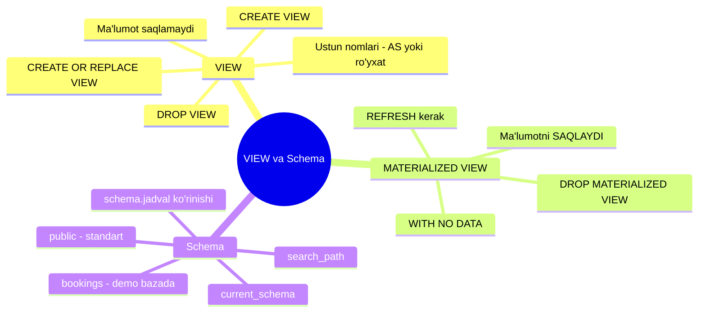
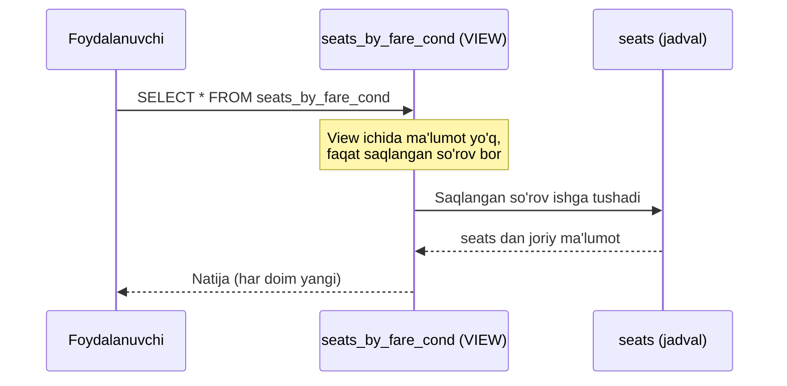
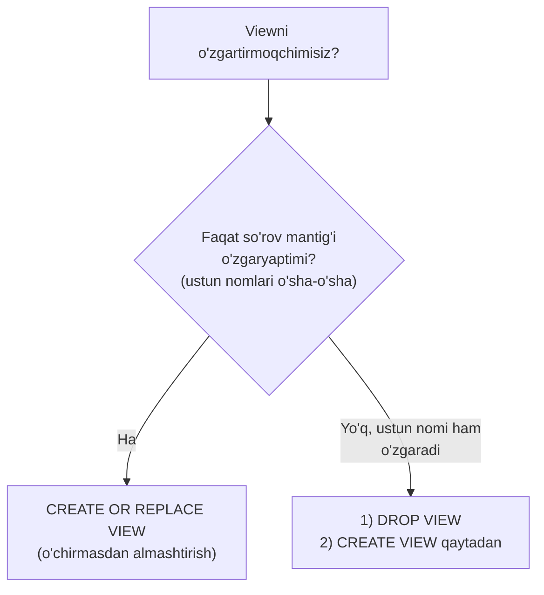
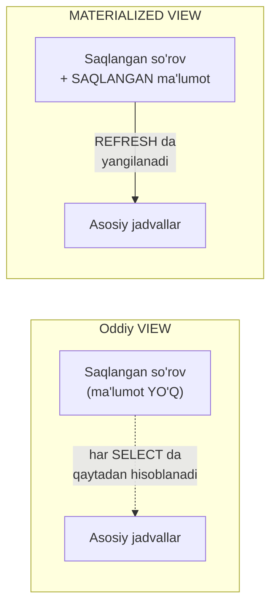
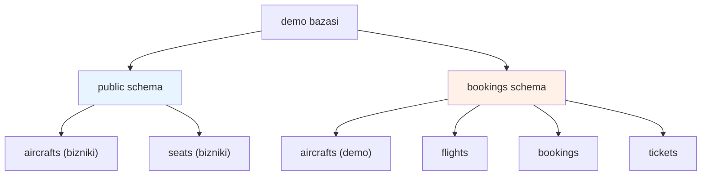
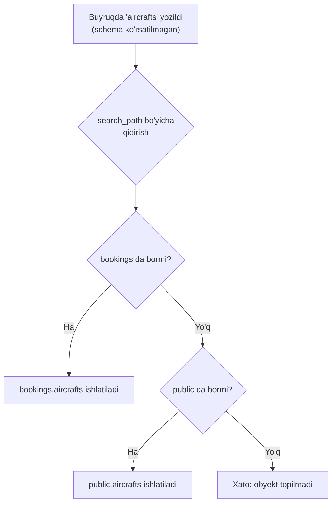

# 8. VIEW va Schema

> 📖 Manba: Моргунов, "PostgreSQL. Основы языка SQL", 5-bob (5.4–5.5 bo'limlar)

## Nima uchun kerak?

Oldingi darslarda biz jadval yaratish (CREATE TABLE), ma'lumot kiritish (INSERT), o'qish (SELECT), cheklovlar (constraint) va ma'lumot tiplarini o'rgandik. Endi ikki muhim tushuncha bilan tanishamiz:

1. **VIEW** (ko'rinish / tasavvur) — bu bazada **saqlangan so'rov** (query). Uni oddiy jadval kabi SELECT bilan o'qish mumkin.
2. **Schema** — bazaning mantiqiy bo'limi, unda jadvallar, viewlar, indekslar va boshqa obyektlar joylashadi.

Nima uchun bular kerak? Katta bazalar bilan ishlaganda ko'pincha bir xil, murakkab, bir nechta jadvalga murojaat qiladigan so'rovlarni **qayta-qayta** yozishga to'g'ri keladi. Har safar shunday uzun so'rovni yozib o'tirmaslik uchun uni bir marta **view** ko'rinishida saqlab qo'yamiz. Schema esa bazadagi obyektlarni tartibli guruhlarga ajratib, ularni boshqarishni osonlashtiradi.



---

## 8.1. VIEW nima?

**View** — bu bazaga saqlab qo'yilgan SELECT so'rovi. Ma'lumot **tanlash** nuqtai nazaridan view amalda oddiy jadvaldan farq qilmaydi: unga ham xuddi jadvaldek `SELECT * FROM view_nomi` deb murojaat qilamiz.

CREATE VIEW buyrug'ining soddalashtirilgan sintaksisi:

```sql
CREATE VIEW view_nomi [ ( ustun_nomi [, ...] ) ]
  AS so'rov;
```

Bu yerda majburiy qismlar — **view nomi** va uning asosidagi **so'rov**. Agar ustun nomlari ro'yxati berilmasa, ular so'rov matnidan avtomatik "hisoblab" olinadi.

### Sodda misol — 3-darsdagi so'rovni saqlash

3-darsda biz shunday masalani yechgan edik: har bir samolyot modelida xizmat sinfi (Business, Economy...) bo'yicha nechta o'rindiq borligini sanash. So'rov shunday edi:

```sql
SELECT aircraft_code,
       fare_conditions,
       count( * )
  FROM seats
  GROUP BY aircraft_code, fare_conditions
  ORDER BY aircraft_code, fare_conditions;
```

Har safar shu uzun so'rovni yozmaslik uchun uni view sifatida saqlaymiz va mazmunni aks ettiruvchi nom beramiz:

```sql
CREATE VIEW seats_by_fare_cond AS
  SELECT aircraft_code,
         fare_conditions,
         count( * )
    FROM seats
    GROUP BY aircraft_code, fare_conditions
    ORDER BY aircraft_code, fare_conditions;
```

Endi murakkab so'rov o'rniga to'g'ridan-to'g'ri view ga, xuddi oddiy jadvaldek murojaat qilamiz:

```sql
SELECT * FROM seats_by_fare_cond;
```

### Muhim: view ma'lumot SAQLAMAYDI

Jadvaldan farqli o'laroq, **view ichida ma'lumot yo'q**. View ga har murojaat qilganingizda, so'rov qaytadan ishga tushib, ma'lumot asosidagi jadvallardan (bu misolda `seats` dan) tanlab olinadi.



Ya'ni view — bu **oyna**: siz u orqali jadvallardagi ma'lumotning har doim **eng so'nggi** holatini ko'rasiz.

---

## 8.2. Viewni o'zgartirish va ustun nomlari

### CREATE OR REPLACE VIEW

PostgreSQL `CREATE VIEW` ga o'z kengaytmasini taklif qiladi — **OR REPLACE** iborasi. Agar view allaqachon mavjud bo'lsa, uni o'chirmasdan yangi versiya bilan almashtirish mumkin. Ammo bir shart bor: yangi versiyada **ustun nomlari o'zgarmasligi** kerak. Agar hech bo'lmasa bitta ustun nomini o'zgartirmoqchi bo'lsangiz, avval viewni `DROP VIEW` bilan o'chirib, keyin qaytadan yaratish kerak.

### Ustun nomi muammosi

Yuqoridagi viewda uchinchi ustun `count` funksiyasidan hosil bo'lgan, shuning uchun DBMS unga avtomatik `count` nomini bergan. Buni mazmunliroq nom — `num_seats` (o'rindiqlar soni) ga o'zgartirmoqchi bo'laylik. `OR REPLACE` va `AS` bilan urinib ko'ramiz:

```sql
CREATE OR REPLACE VIEW seats_by_fare_cond
AS
  SELECT aircraft_code,
         fare_conditions,
         count( * ) AS num_seats
    FROM seats
    GROUP BY aircraft_code, fare_conditions
    ORDER BY aircraft_code, fare_conditions;
```

DBMS xato beradi:

```
ОШИБКА: изменить имя столбца "count" на "num_seats" в представлении нельзя
```

Sababi: view birinchi yaratilganda uchinchi ustun `count` nomini olgan. `OR REPLACE` bilan ustun nomlarini o'zgartirib bo'lmaydi.

### Yechim: avval DROP, keyin CREATE

Ustun nomini o'zgartirish uchun avval viewni o'chirib, keyin qaytadan yaratamiz. Ustun nomini belgilashning **birinchi usuli** — SELECT ichida `AS` bilan alias (taxallus) berish:

```sql
DROP VIEW seats_by_fare_cond;

CREATE OR REPLACE VIEW seats_by_fare_cond
AS
  SELECT aircraft_code,
         fare_conditions,
         count( * ) AS num_seats
    FROM seats
    GROUP BY aircraft_code, fare_conditions
    ORDER BY aircraft_code, fare_conditions;
```

**Ikkinchi usul** — view nomidan keyin qavs ichida ustun nomlari ro'yxatini berish:

```sql
DROP VIEW seats_by_fare_cond;

CREATE OR REPLACE VIEW seats_by_fare_cond ( code, fare_cond, num_seats )
AS
  SELECT aircraft_code,
         fare_conditions,
         count( * )
    FROM seats
    GROUP BY aircraft_code, fare_conditions
    ORDER BY aircraft_code, fare_conditions;
```

Bu ikkala usul ham bir xil natija beradi — faqat ustunlar nomlanishi turlicha.



### View nima uchun rivojlanishni osonlashtiradi?

View bazani rivojlantirish va o'zgartirishni osonlashtiradi, chunki u **interfeysni** o'zgarmas saqlashi mumkin, ammo uning asosidagi so'rov o'zgarishi mumkin. Amaliy dasturchi uchun view o'zgarmagandek bo'lib qoladi, shuning uchun dasturdagi so'rovlarni qayta yozishga to'g'ri kelmaydi.

### Murakkabroq misol — flights_v view

`demo` bazasida (Aviaqatnovlar) **flights_v** ("Reyslar") nomli view yaratilgan. U `flights` jadvali asosida qurilgan, lekin qo'shimcha ma'lumotni ham ko'rsatadi:

- jo'nash aeroportining batafsil ma'lumotlari (`departure_airport`, `departure_airport_name`, `departure_city`);
- yetib borish aeroportining batafsil ma'lumotlari (`arrival_airport`, `arrival_airport_name`, `arrival_city`);
- jo'nash va yetib borishning **mahalliy vaqti** — rejadagi va haqiqiy (`scheduled_departure_local`, `actual_departure_local`, `scheduled_arrival_local`, `actual_arrival_local`);
- parvoz davomiyligi — rejadagi va haqiqiy (`scheduled_duration`, `actual_duration`).

> **Vaqt zonasi haqida:** mahalliy vaqt ustunlari uchun `timestamp without time zone` (qisqacha `timestamp`) tipi tanlangan, `timestamptz` emas. Sababi — `timestamptz` ma'lumot chiqarilganda vaqtni foydalanuvchi kompyuterining zonasiga o'zgartirib qo'yardi. Bizga esa jo'nash/yetib borish nuqtasidagi mahalliy vaqtni **o'zgarishsiz** saqlash kerak. Vaqt zonasini o'zgartirish uchun `AT TIME ZONE` konstruksiyasi ishlatiladi. (Bu haqda batafsil hujjatning 9.9 bo'limida.)

Bu view juda ko'p ustundan iborat, shuning uchun uni oddiy jadval ko'rinishida chiqarish noqulay ("ilon" bo'lib buklanadi). psql ning **kengaytirilgan** chiqarish rejimini yoqamiz:

```sql
\x
```

Endi ma'lumot har bir ustunni alohida qatorga ("RECORD" ko'rinishida) chiqaradi:

```sql
SELECT * FROM flights_v;
```

```
-[ RECORD 1 ]-------------+-------------------------
 flight_id                | 1
 flight_no                | PG0405
 scheduled_departure      | 2016-09-13 13:35:00+08
 scheduled_departure_local| 2016-09-13 08:35:00
 ...
 departure_airport        | DME
 departure_airport_name   | Домодедово
 departure_city           | Москва
 arrival_airport          | LED
 arrival_airport_name     | Пулково
 arrival_city             | Санкт-Петербург
 ...
```

> Kengaytirilgan rejimni **o'chirish** uchun `\x` ni yana bir marta bosing.

### DROP VIEW va IF EXISTS

Viewni o'chirish uchun `DROP VIEW` ishlatiladi. Ba'zan mavjud bo'lmagan viewni o'chirishga urinish bo'lishi mumkin. Keraksiz xato xabaridan qochish uchun `IF EXISTS` iborasini qo'shamiz:

```sql
DROP VIEW IF EXISTS flights_v;
```

Bunda view bo'lmasa ham xato chiqmaydi.

---

## 8.3. MATERIALIZED VIEW — ma'lumotni saqlaydigan view

Oddiy view — bu faqat saqlangan so'rov, unda ma'lumot yo'q. PostgreSQL yana bir kengaytmani taklif qiladi — **materialized view** (materiallashtirilgan view). Uning sintaksisi:

```sql
CREATE MATERIALIZED VIEW [ IF NOT EXISTS ] mat_view_nomi
  [ ( ustun_nomi [, ...] ) ]
  AS so'rov
  [ WITH [ NO ] DATA ];
```

**Farqi:** materialized view ma'lumotni **o'zida saqlaydi** — oddiy jadvalga juda o'xshaydi. Lekin jadvaldan farqi: u nafaqat ma'lumotni saqlaydi, balki bu ma'lumot qaysi **so'rov** yordamida yig'ilganini ham eslab qoladi.

Materialized view yaratilgan paytda ma'lumot bilan **to'ldiriladi** — agar buyruqda `WITH NO DATA` ibarasi bo'lmasa. Agar `WITH NO DATA` yozilsa, view bo'sh qoladi, va uni keyinroq ma'lumot bilan to'ldirish uchun **REFRESH MATERIALIZED VIEW** buyrug'i ishlatiladi.



### routes misoli — ortiqchalikni bartaraf etish

`demo` bazasida **routes** ("Marshrutlar") nomli materialized view bor. `flights` (reyslar) jadvalida **ortiqchalik** (избыточность) mavjud: bir xil reys raqami turli kunlarda takrorlanadi, va har safar jo'nash/yetib borish aeroporti kodi, samolyot kodi ham takror-takror yoziladi. Bu jadvaldan marshrut haqidagi ma'lumotni — reys raqami, jo'nash va yetib borish aeroportlarini — ajratib olish mumkin. Bu ma'lumot aniq parvoz sanasiga **bog'liq emas**, shuning uchun uni alohida saqlash mantiqli.

`routes` viewning ustunlari orasida `days_of_week` ("reyslar bajariladigan hafta kunlari") bor — bu **butun sonlar massivi** (`integer[]`).

Materialized view dagi ma'lumotni yangilash uchun:

```sql
REFRESH MATERIALIZED VIEW routes;
```

Va uni o'chirish uchun (istalgan boshqa obyekt kabi):

```sql
DROP MATERIALIZED VIEW routes;
```

> **Muhim:** materialized view ma'lumotni "muzlatib" saqlaydi. Asosiy jadvallar o'zgarsa, materialized view **o'z-o'zidan yangilanmaydi** — uni `REFRESH` bilan qo'lda yangilash kerak. Aks holda unda eskirgan ma'lumot qolib ketadi.

---

## 8.4. Viewlarning afzalliklari

Kitob viewlarning to'rt asosiy afzalligini keltiradi:

1. **Foydalanuvchilar huquqlarini boshqarishni soddalashtiradi.** Turli foydalanuvchilarga bir xil jadvallarda saqlanadigan turlicha ma'lumot kerak bo'lishi mumkin (ham ustunlar, ham qatorlar bo'yicha). Har bir foydalanuvchi uchun alohida view yaratish ma'lumotni takrorlaydigan qo'shimcha jadvallar yaratish zaruriyatidan xalos qiladi.

2. **Bazaga so'rovlarni soddalashtiradi.** Bir nechta jadvalni o'z ichiga oladigan murakkab va katta so'rovlarni tez-tez bajarishga to'g'ri keladi. View bu murakkablikni dasturchidan yashiradi va so'rovlarni soddaroq, ko'rinarli qiladi.

3. **Dasturlarning jadval tuzilishi o'zgarishlariga bog'liqligini kamaytiradi.** Baza rivojlanishida jadvallar tuzilishi o'zgarishi mumkin. View — bu so'rovga **interfeys**. Agar bu interfeys o'zgarmasa, undan foydalanadigan SQL so'rovlarni tuzatishga to'g'ri kelmaydi.

4. **Murakkab so'rovlarning bajarilish vaqtini kamaytiradi (materialized view orqali).** Uzoq vaqt hisoblanadigan so'rov natijalarini oldindan tayyorlab, materialized view da saqlab qo'yish mumkin. Masalan, biror yig'ma hisobot uzoq shakllansa, lekin unga so'rovlar ko'p marta bo'lsa, uni oldindan tayyorlab qo'yish maqsadga muvofiq.

> **Cheklov:** materialized view lardan ehtiyotkorlik bilan foydalanish kerak. Barcha murakkab so'rovlarni ular bilan almashtirmaslik lozim. Kamchiligi — ularni `REFRESH` bilan **o'z vaqtida** yangilab turish kerak, aks holda ma'lumot eskiradi.

---

## 8.5. Schema — bazaning mantiqiy bo'limi

**Schema** — bu bazaning mantiqiy fragmenti bo'lib, unda turli obyektlar joylashadi: jadvallar, viewlar, indekslar va boshqalar. Bazada doim kamida bitta schema bo'ladi. Baza yaratilganda unda avtomatik ravishda **public** nomli schema hosil bo'ladi. Oldingi darslarda `aircrafts` va `seats` jadvallarini yaratganimizda, ular aynan shu `public` schema da yaratilgan edi (`\d aircrafts` natijasidagi `public.aircrafts` ni eslang).

### Schema — nomlar fazosi (namespace)

Har bir bazada bittadan ortiq schema bo'lishi mumkin. Ularning nomlari baza doirasida **yagona** bo'lishi kerak. Obyekt nomlari (jadval, view, sequence...) esa **bitta schema doirasida** yagona bo'lishi kerak, lekin **turli schemalarda** takrorlanishi mumkin. Ya'ni schema **nomlar fazosini** (пространство имен, namespace) hosil qiladi.



> E'tibor bering: `aircrafts` nomi ikki schemada ham bo'lishi mumkin — ular boshqa-boshqa obyektlar hisoblanadi, chunki turli nomlar fazosida.

### Schemalar ro'yxatini ko'rish — `\dn`

Bazadagi schemalar ro'yxatini psql ning `\dn` meta-buyrug'i bilan ko'ramiz:

```
\dn
```

```
Список схем
    Имя    | Владелец
-----------+----------
 bookings  | postgres
 public    | postgres
(2 строки)
```

`demo` o'quv bazasida `bookings` schema mavjud. Barcha demo jadvallari (flights, bookings, tickets...) aynan shu schema da yaratilgan.

---

## 8.6. search_path — obyektlarga qanday murojaat qilinadi?

Bazada bir nechta schema bo'lsa, ma'lum schemadagi obyektlarga ikki xil murojaat qilish mumkin.

### 1-usul: schema nomini oldiga qo'yish

Obyekt nomidan oldin schema nomini nuqta bilan yozamiz:

```sql
SELECT * FROM bookings.aircrafts;
```

Bu aniq va tushunarli, lekin har safar `bookings.` yozish noqulay.

### 2-usul: schemani "joriy" (current) qilish

Qulayroq yo'l — biror schemani **joriy** qilib qo'yish. PostgreSQL da **search_path** nomli parametr bor. U DBMS obyektni qidirganda (buyruqda schema nomi ko'rsatilmasa) qaysi schemalarni ko'rib chiqishini belgilaydi. Uning joriy qiymatini `SHOW` bilan ko'ramiz:

```sql
SHOW search_path;
```

```
   search_path
-----------------
 "$user", public
(1 строка)
```

Bu yerdagi `"$user"` — foydalanuvchi nomi bilan bir xil nomli schema bo'lsa ishlatiladigan maxsus qiymat. `demo` bazasida bunday schema yo'q, shuning uchun schema ko'rsatilmagan barcha murojaatlar amalda `public` ga yo'naltiriladi.

Schemalarni ko'rish tartibini o'zgartirish uchun **SET** buyrug'ini ishlatamiz. Ro'yxatda birinchi qilib qaysi schemani yozsak, DBMS uni birinchi ko'rib chiqadi — u **joriy** schema bo'ladi:

```sql
SET search_path = bookings;
```

Endi `bookings.` prefiksisiz ham demo jadvallariga murojaat qila olamiz:

```sql
SELECT * FROM aircrafts;   -- endi bu bookings.aircrafts ni bildiradi
```

Joriy schemaning nomini `current_schema` funksiyasi bilan bilib olamiz (e'tibor bering — funksiya qavssiz chaqiriladi):

```sql
SELECT current_schema;
```

```
 current_schema
----------------
 bookings
(1 строка)
```

Ro'yxatga bir nechta schema kiritish ham mumkin — ular ketma-ket ko'rib chiqiladi:

```sql
SET search_path = bookings, public;
```

Bunda avval `bookings`, keyin `public` qidiriladi.



---

## 8.7. Ma'lum schemada obyekt yaratish

Obyekt (masalan jadval) yaratganda quyidagini yodda tuting:

- Agar buyruqda schema **ko'rsatilmasa**, obyekt **joriy** schemada yaratiladi.
- Agar obyektni joriy bo'lmagan aniq bir schemada yaratmoqchi bo'lsangiz, uning nomini obyekt nomidan oldin nuqta bilan yozing.

Masalan, `my_schema` schemasida `airports` jadvalini yaratish:

```sql
CREATE TABLE my_schema.airports
(
  ...
);
```

Xuddi shunday, `SELECT * FROM bookings.aircrafts` yozganimizda ham `bookings` schemasidagi jadvalga murojaat qilgan bo'lamiz.

---

## Xulosa

- **VIEW** — bazaga saqlangan SELECT so'rovi; unga oddiy jadval kabi murojaat qilinadi. View **ma'lumot saqlamaydi** — har murojaatda so'rov qaytadan bajariladi.
- `CREATE VIEW ... AS so'rov;` — view yaratadi; `CREATE OR REPLACE VIEW` — o'chirmasdan almashtiradi (lekin ustun nomlarini o'zgartirib bo'lmaydi).
- Ustun nomlarini ikki usulda berish mumkin: SELECT ichida `AS alias`, yoki view nomidan keyin qavsda ro'yxat.
- `DROP VIEW [IF EXISTS] nom;` — viewni o'chiradi.
- **MATERIALIZED VIEW** — ma'lumotni **o'zida saqlaydi** (jadvalga o'xshaydi), lekin so'rovni ham eslab qoladi. `WITH NO DATA` bilan bo'sh yaratiladi. Yangilash uchun `REFRESH MATERIALIZED VIEW` kerak.
- Viewlarning afzalliklari: huquqlarni boshqarishni soddalashtirish, so'rovlarni soddalashtirish, tuzilma o'zgarishlariga bog'liqlikni kamaytirish, murakkab so'rovlarni tezlashtirish (materialized).
- **Schema** — bazaning mantiqiy bo'limi, nomlar fazosi. Standart schema — `public`; demo bazada `bookings` schema bor.
- Obyektga murojaat: `schema.obyekt` ko'rinishida yoki **search_path** orqali joriy schemani belgilab. `SET search_path = ...`, `SHOW search_path`, `SELECT current_schema`.

### Eslab qol

- View — bu **saqlangan so'rov**, ma'lumot emas. Materialized view — **saqlangan ma'lumot + so'rov**.
- Materialized view o'z-o'zidan yangilanmaydi — `REFRESH` kerak.
- View ustun nomini o'zgartirish uchun: avval `DROP VIEW`, keyin `CREATE VIEW`.
- Schema — nomlar fazosi: bir xil nomli obyekt turli schemalarda bo'lishi mumkin.
- `SET search_path = schema;` — schemani joriy qiladi, prefiksni yozmaslik imkonini beradi.

### Amaliyot

1. `seats_by_fare_cond` viewini yarating va `SELECT * FROM seats_by_fare_cond;` bilan natijani ko'ring. Keyin `seats` jadvaliga yangi o'rindiq qo'shib, viewga qayta murojaat qiling — natija o'zgardimi? Nima uchun?
2. Uchinchi ustunni `num_seats` deb nomlash uchun viewni `DROP` qilib, ikki xil usulda (AS alias va qavsdagi ro'yxat) qayta yarating.
3. `\x` ni yoqib, `flights_v` viewdan bitta reysni chiqaring, keyin `\x` ni o'chiring. Ikki chiqarish rejimini solishtiring.
4. `\dn` bilan `demo` bazasidagi schemalarni ko'ring. `bookings` schemasidagi `aircrafts` jadvaliga ikki usulda murojaat qiling: `bookings.aircrafts` orqali va `SET search_path = bookings;` dan keyin oddiy `aircrafts` orqali.
5. `SHOW search_path;` va `SELECT current_schema;` buyruqlarini `SET search_path = bookings;` dan oldin va keyin bajarib, farqni kuzating.

---

## Nazorat savollari

1. View nima va u nima uchun kerak? Uni oddiy jadvaldan nima ajratib turadi?
2. `CREATE VIEW` va `CREATE OR REPLACE VIEW` orasidagi farq nimada? `OR REPLACE` da qanday cheklov bor?
3. Viewda ustun nomini o'zgartirishning ikki usulini ayting. Nima uchun ba'zan avval `DROP VIEW` qilishga to'g'ri keladi?
4. View va materialized view orasidagi asosiy farq nima? Qaysi biri ma'lumotni saqlaydi?
5. `WITH NO DATA` iborasi nima qiladi? Materialized view ni qanday yangilash mumkin va nima uchun bu kerak?
6. Viewlarning to'rtta asosiy afzalligini sanang.
7. Schema nima? Nima uchun uni "nomlar fazosi" (namespace) deb atashadi?
8. `search_path` parametri nima vazifa bajaradi? Bir schemadagi jadvalga murojaat qilishning ikki usulini misol bilan ko'rsating.
