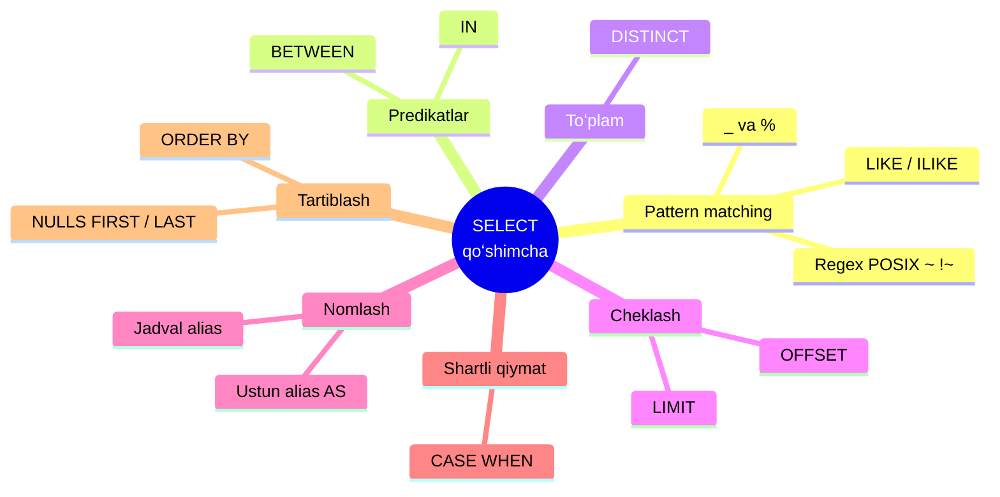
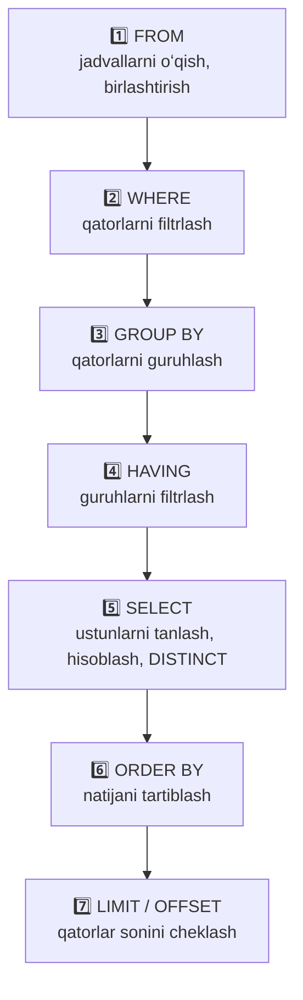

# 9. SELECT — qo'shimcha imkoniyatlar

> 📖 Manba: Моргунов, "PostgreSQL. Основы языка SQL", 6-bob ("Запросы", 6.1-bo'lim, 145–152-betlar)

## Nima uchun kerak?

Oldingi darslarda biz `SELECT` bilan tanishdik: bitta jadvaldan ustunlarni tanlab olish, `WHERE` bilan qatorlarni filtrlash va `ORDER BY` bilan tartiblashni o'rgandik. Lekin amaliyotda ko'pincha `= < > >= <=` kabi oddiy taqqoslash operatorlari yetmaydi:

- "Nomi `Airbus` bilan boshlanadigan hamma samolyotlarni top" — bu yerda oddiy tenglik ishlamaydi.
- "3000 dan 6000 gacha bo'lgan uchish masofasiga ega samolyotlarni top" — ikkita shartni birlashtirish kerak.
- "Faqat takrorlanmaydigan timezone'larni chiqar" — dublikatlarni olib tashlash kerak.
- "Eng sharqda joylashgan 3 ta aeroportni top" — natijani cheklash kerak.
- "Uchish masofasiga qarab samolyotni sinfga ajrat" — shartga qarab qiymat chiqarish kerak.

Ana shu vazifalarni hal qilish uchun `SELECT` ning qo'shimcha imkoniyatlari xizmat qiladi: `LIKE`, `BETWEEN`, `IN`, `DISTINCT`, `LIMIT`/`OFFSET`, alias'lar va `CASE` ifodasi.

Bu darsdagi hamma misollar kitobning demo "Aviaqatnovlar" (bookings) bazasidagi eng kichik jadvallar — `aircrafts` (samolyotlar) va `airports` (aeroportlar) ustida ishlaydi.



---

## 1. Demo jadvallar bilan tanishuv

Misollarga o'tishdan oldin `aircrafts` jadvali qanaqaligini ko'rib qo'yaylik. U juda kichik — atigi 9 ta qator:

```sql
SELECT * FROM aircrafts;
```

| aircraft_code | model               | range |
| ------------- | ------------------- | ----- |
| 773           | Boeing 777-300      | 11100 |
| 763           | Boeing 767-300      | 7900  |
| SU9           | Sukhoi SuperJet-100 | 3000  |
| 320           | Airbus A320-200     | 5700  |
| 321           | Airbus A321-200     | 5600  |
| 319           | Airbus A319-100     | 6700  |
| 733           | Boeing 737-300      | 4200  |
| CN1           | Cessna 208 Caravan  | 1200  |
| CR2           | Bombardier CRJ-200  | 2700  |

Bu yerda `range` — samolyotning maksimal uchish masofasi (km). `airports` jadvalida esa yuzdan ortiq qator bor, unda `airport_code`, `airport_name`, `city`, `longitude`, `latitude`, `timezone` ustunlari mavjud.

---

## 2. LIKE — shablon (pattern) bo'yicha qidirish

Vazifa: `Airbus` kompaniyasining barcha samolyotlarini topaylik. Nomlar `Airbus` bilan boshlanadi, lekin davomi har xil. Bu yerda `LIKE` operatori yordam beradi:

```sql
SELECT * FROM aircrafts WHERE model LIKE 'Airbus%';
```

`%` belgisi maxsus ma'noga ega: u **istalgan ketma-ketlikdagi belgilar**ga mos keladi (hech qanday belgi bo'lmasligi ham mumkin). Ya'ni `Airbus%` — "`Airbus` bilan boshlanib, keyin nimadir keladi" degani.

| aircraft_code | model           | range |
| ------------- | --------------- | ----- |
| 320           | Airbus A320-200 | 5700  |
| 321           | Airbus A321-200 | 5600  |
| 319           | Airbus A319-100 | 6700  |

**Muhim:** `LIKE` dagi shablon har doim butun satrni qamrab oladi. Agar satr ichidan biror bo'lakni qidirmoqchi bo'lsangiz, shablon ikki tomondan `%` bilan o'ralishi kerak, masalan `'%300%'`.

`NOT LIKE` esa teskari ma'no beradi. `Airbus` va `Boeing` dan boshqa samolyotlarni topamiz:

```sql
SELECT * FROM aircrafts
  WHERE model NOT LIKE 'Airbus%'
    AND model NOT LIKE 'Boeing%';
```

| aircraft_code | model               | range |
| ------------- | ------------------- | ----- |
| SU9           | Sukhoi SuperJet-100 | 3000  |
| CN1           | Cessna 208 Caravan  | 1200  |
| CR2           | Bombardier CRJ-200  | 2700  |

### `_` belgisi — aynan bitta belgi

`%` dan tashqari `_` (pastki chiziq) belgisi ham bor. U **aynan bitta istalgan belgi**ga mos keladi. Masalan, nomi 3 ta harfdan iborat aeroportlarni topaylik — shablon 3 ta `_` dan iborat bo'ladi:

```sql
SELECT * FROM airports WHERE airport_name LIKE '___';
```

Natijada `UFA` (Уфа) topiladi, chunki uning nomi aynan 3 belgidan iborat.

> 💡 `ILIKE` — `LIKE` ning katta-kichik harfga e'tibor bermaydigan (case-insensitive) varianti. `model ILIKE 'airbus%'` yozsangiz ham `Airbus` topiladi.

---

## 3. Regular expression (POSIX)

`LIKE` dan ham kuchliroq imkoniyat — POSIX **regular expression** operatorlari. `~` operatori shablonga (katta-kichik harfni hisobga olib) mos kelishni tekshiradi. Airbus va Boeing samolyotlarini bir shablon bilan topamiz:

```sql
SELECT * FROM aircrafts WHERE model ~ '^(A|Boe)';
```

Bu yerda:
- `^` — satr **boshiga** bog'lash (nom shu belgilar bilan boshlansin).
- `(A|Boe)` — qavs ichidagi variantlardan biri; `|` — "yoki". Ya'ni nom `A` yoki `Boe` bilan boshlansa mos keladi.

| aircraft_code | model           | range |
| ------------- | --------------- | ----- |
| 773           | Boeing 777-300  | 11100 |
| 763           | Boeing 767-300  | 7900  |
| 320           | Airbus A320-200 | 5700  |
| 321           | Airbus A321-200 | 5600  |
| 319           | Airbus A319-100 | 6700  |
| 733           | Boeing 737-300  | 4200  |

Operatorni teskari qilish uchun oldiga `!` qo'yiladi (`!~`). Nomi `300` raqami bilan **tugamaydigan** modellarni topamiz (`$` — satr oxiriga bog'lash):

```sql
SELECT * FROM aircrafts WHERE model !~ '300$';
```

> 💡 `~` — katta-kichik harfni hisobga oladi; `~*` — hisobga olmaydi. `LIKE` bilan farqi: regex shablon satrning istalgan qismiga mos kelishi mumkin (bog'lash `^` va `$` bilan majburlanadi).

---

## 4. BETWEEN — diapazon predikati

Oddiy taqqoslash operatorlari o'rniga **taqqoslash predikatlari** ishlatilishi mumkin. Ular ham xuddi operatorlar kabi ishlaydi, lekin sintaksisi boshqacha va o'qishga qulayroq.

Savol: uchish masofasi 3000 km dan 6000 km gacha bo'lgan samolyotlar qaysilar? `BETWEEN` predikati yordam beradi:

```sql
SELECT * FROM aircrafts WHERE range BETWEEN 3000 AND 6000;
```

| aircraft_code | model               | range |
| ------------- | ------------------- | ----- |
| SU9           | Sukhoi SuperJet-100 | 3000  |
| 320           | Airbus A320-200     | 5700  |
| 321           | Airbus A321-200     | 5600  |
| 733           | Boeing 737-300      | 4200  |

**Diqqat:** chegara qiymatlari (3000 va 6000) diapazonga **kiritiladi**. Ya'ni `BETWEEN 3000 AND 6000` bu `range >= 3000 AND range <= 6000` bilan bir xil.

---

## 5. IN — ro'yxatga tegishlilik predikati

`IN` predikati qiymat berilgan ro'yxatdan biriga teng-emasligini tekshiradi. Uzun `OR` zanjirining qisqa ko'rinishi:

```sql
-- OR bilan:
SELECT * FROM aircrafts
  WHERE aircraft_code = '773' OR aircraft_code = '763' OR aircraft_code = '733';

-- IN bilan (aynan shu narsa, lekin qisqaroq):
SELECT * FROM aircrafts WHERE aircraft_code IN ('773', '763', '733');
```

| aircraft_code | model          | range |
| ------------- | -------------- | ----- |
| 773           | Boeing 777-300 | 11100 |
| 763           | Boeing 767-300 | 7900  |
| 733           | Boeing 737-300 | 4200  |

Teskarisi — `NOT IN`: ro'yxatda yo'q qatorlarni tanlaydi. `IN` ichiga qiymatlar ro'yxati o'rniga subquery ham yozish mumkin — buni 12-darsda ko'ramiz.

---

## 6. Hisoblanadigan ustunlar va AS alias

`SELECT` da faqat mavjud ustunlarni emas, balki **hisoblab chiqilgan** qiymatlarni ham chiqarish mumkin. Masalan, uchish masofasini kilometrdan milga o'tkazamiz (1 mil ≈ 1.609 km) va yangi ustunga `AS` orqali **alias** (taxallus, ya'ni yangi nom) beramiz:

```sql
SELECT model, range, range / 1.609 AS miles FROM aircrafts;
```

| model          | range | miles              |
| -------------- | ----- | ------------------ |
| Boeing 777-300 | 11100 | 6898.6948415164698 |
| Boeing 767-300 | 7900  | 4909.8819142324425 |

Aniqlik juda katta chiqdi. `round()` funksiyasi bilan uni ikkita kasr xonasigacha qisqartiramiz:

```sql
SELECT model, range, round( range / 1.609, 2 ) AS miles
  FROM aircrafts;
```

| model          | range | miles   |
| -------------- | ----- | ------- |
| Boeing 777-300 | 11100 | 6898.69 |
| Boeing 767-300 | 7900  | 4909.88 |

`AS` ustunga nom berish uchun ishlatiladi. `AS` so'zining o'zi majburiy emas — `range / 1.609 miles` deb ham yozsa bo'ladi, lekin `AS` bilan yozilgani o'qishga tushunarli.

> 💡 Ustun aliasidan tashqari **jadval aliasi** ham bor: `FROM aircrafts AS a` yozsangiz, keyin `a.model` deb qisqa yozishingiz mumkin. Jadval aliaslari, ayniqsa, bir nechta jadvalni birlashtirganda (JOIN) juda qo'l keladi — bu haqda 10-darsda batafsil to'xtalamiz.

---

## 7. ORDER BY — qatorlarni tartiblash

Agar maxsus chora ko'rilmasa, DBMS natija qatorlarining tartibini **kafolatlamaydi**. Tartiblash uchun `ORDER BY` xizmat qiladi. `DESC` — kamayish tartibida, `ASC` — o'sish tartibida (standart holat). Samolyotlarni uchish masofasi kamayishi bo'yicha tartiblaymiz:

```sql
SELECT * FROM aircrafts ORDER BY range DESC;
```

| aircraft_code | model               | range |
| ------------- | ------------------- | ----- |
| 773           | Boeing 777-300      | 11100 |
| 763           | Boeing 767-300      | 7900  |
| 319           | Airbus A319-100     | 6700  |
| 320           | Airbus A320-200     | 5700  |
| 321           | Airbus A321-200     | 5600  |
| 733           | Boeing 737-300      | 4200  |
| SU9           | Sukhoi SuperJet-100 | 3000  |
| CR2           | Bombardier CRJ-200  | 2700  |
| CN1           | Cessna 208 Caravan  | 1200  |

### NULLS FIRST va NULLS LAST

`NULL` qiymatlar tartiblashda maxsus holat. Standart bo'yicha `ASC` da `NULL` lar eng oxirida, `DESC` da esa eng boshida chiqadi. Buni `NULLS FIRST` yoki `NULLS LAST` bilan boshqarish mumkin:

```sql
-- NULL qiymatlarni eng oxiriga surib qo'yamiz:
SELECT flight_no, actual_departure
  FROM flights
  ORDER BY actual_departure DESC NULLS LAST;
```

Bu, ayniqsa, hali uchmagan reyslarda (`actual_departure` hali `NULL`) qulay: aniq vaqtga ega reyslar avval, `NULL` lar oxirida turadi.

---

## 8. DISTINCT — takrorlanmaydigan qiymatlar

`airports` jadvalida `timezone` (soat mintaqasi) ustuni bor. Uni oddiy tanlasak, ko'p takrorlanuvchi qiymatlar chiqadi — noqulay. Faqat **takrorlanmaydigan** qiymatlarni qoldirish uchun `DISTINCT` ishlatiladi:

```sql
SELECT DISTINCT timezone FROM airports ORDER BY 1;
```

| timezone           |
| ------------------ |
| Asia/Anadyr        |
| Asia/Chita         |
| Asia/Irkutsk       |
| ...                |
| Europe/Moscow      |
| Europe/Volgograd   |

Natijada 17 ta noyob soat mintaqasi chiqadi. **Diqqat:** `ORDER BY 1` da ustun nomi emas, uning `SELECT` dagi **tartib raqami** (birinchi ustun) ishlatilgan. Bu qulay qisqartma.

---

## 9. LIMIT va OFFSET — qatorlar sonini cheklash

Vazifa: eng sharqda joylashgan 3 ta aeroportni topaylik. Algoritm oddiy — qatorlarni `longitude` (uzunlik) kamayishi bo'yicha tartiblaymiz va faqat birinchi 3 tasini olamiz. Qatorlar sonini cheklash uchun `LIMIT` xizmat qiladi:

```sql
SELECT airport_name, city, longitude
  FROM airports
  ORDER BY longitude DESC
  LIMIT 3;
```

| airport_name | city                     | longitude  |
| ------------ | ------------------------ | ---------- |
| Анадырь      | Анадырь                  | 177.741483 |
| Елизово      | Петропавловск-Камчатский | 158.453669 |
| Магадан      | Магадан                  | 150.720439 |

Endi 4-o'rindan 6-o'rin oralig'idagi aeroportlarni topmoqchimiz — ya'ni dastlabki 3 tasini **o'tkazib yuborishimiz** kerak. Buning uchun `OFFSET` ishlatiladi:

```sql
SELECT airport_name, city, longitude
  FROM airports
  ORDER BY longitude DESC
  LIMIT 3
  OFFSET 3;
```

| airport_name    | city              | longitude  |
| --------------- | ----------------- | ---------- |
| Хомутово        | Южно-Сахалинск    | 142.717531 |
| Хурба           | Комсомольск-на-Амуре | 136.934  |
| Хабаровск-Новый | Хабаровск         | 135.188361 |

`LIMIT n` — nechta qator qaytarishni, `OFFSET m` — boshidan nechtasini o'tkazib yuborishni bildiradi. Ular ko'pincha "sahifalash" (pagination) uchun ishlatiladi.

---

## 10. CASE — shartli ifoda

Hisoblanadigan ustunlardan tashqari, **shartga qarab** turli qiymat chiqarish uchun `CASE` ifodasi ishlatiladi. Uning umumiy ko'rinishi:

```sql
CASE WHEN shart THEN ifoda
   [ WHEN ... ]
   [ ELSE ifoda ]
END
```

Samolyotni uchish masofasiga qarab sinfga ajratamiz: yaqin, o'rta yoki uzoq masofali:

```sql
SELECT model, range,
  CASE WHEN range < 2000 THEN 'Yaqin masofali'
       WHEN range < 5000 THEN 'Oʻrta masofali'
       ELSE 'Uzoq masofali'
  END AS type
  FROM aircrafts
  ORDER BY model;
```

| model               | range | type            |
| ------------------- | ----- | --------------- |
| Airbus A319-100     | 6700  | Uzoq masofali   |
| Airbus A320-200     | 5700  | Uzoq masofali   |
| Airbus A321-200     | 5600  | Uzoq masofali   |
| Boeing 737-300      | 4200  | Oʻrta masofali  |
| Boeing 767-300      | 7900  | Uzoq masofali   |
| Boeing 777-300      | 11100 | Uzoq masofali   |
| Bombardier CRJ-200  | 2700  | Oʻrta masofali  |
| Cessna 208 Caravan  | 1200  | Yaqin masofali  |
| Sukhoi SuperJet-100 | 3000  | Oʻrta masofali  |

`CASE` shartlarni yuqoridan pastga qarab tekshiradi: birinchi to'g'ri kelgan `WHEN` ning qiymatini qaytaradi. Hech biri to'g'ri kelmasa — `ELSE` ni. `ELSE` bo'lmasa va hech biri mos kelmasa — `NULL` qaytariladi.

---

## 11. SELECT so'rovining bajarilish tartibi

`SELECT` so'rovini biz yozganda `SELECT ... FROM ... WHERE ...` tartibida yozamiz, lekin DBMS uni **boshqa tartibda** bajaradi. Buni tushunish juda muhim: masalan, `WHERE` da ustun aliasidan foydalanib bo'lmasligining sababi shu — `WHERE` `SELECT` dan **oldin** ishlaydi va alias hali mavjud emas.

Mantiqiy bajarilish tartibi quyidagicha:



| Bosqich | Nima qiladi | Muhim jihat |
| ------- | ----------- | ----------- |
| `FROM` | Jadvallarni oladi, kerak bo'lsa birlashtiradi (JOIN) | Dekartov ko'paytma shu yerda |
| `WHERE` | Alohida qatorlarni filtrlaydi | Guruhlashdan **oldin** ishlaydi, alias'ni bilmaydi |
| `GROUP BY` | Qatorlarni guruhlarga ajratadi | Aggregate funksiyalar shu yerdan foyda oladi |
| `HAVING` | Guruhlarni filtrlaydi | Guruhlashdan **keyin** ishlaydi |
| `SELECT` | Ustunlarni hisoblaydi, alias beradi, `DISTINCT` | Alias endi paydo bo'ladi |
| `ORDER BY` | Natijani tartiblaydi | Alias'dan foydalanishi mumkin |
| `LIMIT`/`OFFSET` | Qatorlar sonini cheklaydi | Eng oxirida |

Bu diagramma bilan biz 11 va 12-darslarda (JOIN, GROUP BY, subquery) yana ko'p marta uchrashamiz.

---

## Xulosa

- `LIKE` — shablon bo'yicha qidirish: `%` (istalgan ketma-ketlik), `_` (aynan bitta belgi). `ILIKE` — katta-kichik harfga befarq. `NOT LIKE` — teskari.
- POSIX regex operatorlari (`~`, `~*`, `!~`) `LIKE` dan kuchliroq: `^` boshiga, `$` oxiriga bog'laydi, `|` — "yoki".
- `BETWEEN a AND b` — diapazon (chegaralar kiritiladi), `IN (...)` — ro'yxatga tegishlilik.
- `AS` — ustun yoki jadvalga alias (taxallus) beradi; hisoblanadigan ustunlar `round()` kabi funksiyalar bilan boyitiladi.
- `ORDER BY` — tartiblash (`ASC`/`DESC`), `NULLS FIRST`/`NULLS LAST` — `NULL` lar joyini boshqaradi.
- `DISTINCT` — takrorlanmaydigan qiymatlar; `LIMIT`/`OFFSET` — qatorlar sonini cheklaydi (sahifalash).
- `CASE WHEN ... THEN ... ELSE ... END` — shartga qarab qiymat qaytaradi.
- `SELECT` so'rovi **FROM → WHERE → GROUP BY → HAVING → SELECT → ORDER BY → LIMIT** tartibida bajariladi.

### Eslab qol

> - `WHERE` da ustun aliasidan foydalanib bo'lmaydi, chunki `WHERE` `SELECT` dan oldin ishlaydi. Lekin `ORDER BY` da mumkin.
> - `LIKE 'Airbus%'` boshini tekshiradi; `'%300%'` — ichini; `'___'` — aniq uzunlikni.
> - `BETWEEN` chegaralarni **o'z ichiga oladi**.
> - `ORDER BY 1` — birinchi ustun bo'yicha tartiblash (tartib raqami bilan).

### Amaliyot

1. `Boeing` kompaniyasining, uchish masofasi 8000 km dan katta bo'lgan barcha samolyotlarini toping.
2. Nomi `-200` bilan tugaydigan samolyotlarni regex (`~`) yordamida toping.
3. `airports` jadvalidan eng g'arbda joylashgan (`longitude` eng kichik) 5 ta aeroportni toping.
4. `aircrafts` da `CASE` yordamida yangi ustun qo'shing: `range >= 6000` bo'lsa `'Katta'`, aks holda `'Kichik'`.
5. `airports` dan barcha noyob `city` (shaharlar) ro'yxatini alifbo tartibida chiqaring.
6. 6-dan 10-gacha bo'lgan (uzunlik bo'yicha) eng sharqiy aeroportlarni `LIMIT`/`OFFSET` bilan toping.

## Nazorat savollari

1. `LIKE 'A_r%'` shabloni qanday satrlarga mos keladi? `_` va `%` orasidagi farqni tushuntiring.
2. `LIKE` va `~` (regex) operatorlari orasidagi asosiy farq nima?
3. `BETWEEN 3000 AND 6000` chegara qiymatlarini o'z ichiga oladimi? Bu qanday oddiy shart bilan bir xil?
4. `IN (...)` predikati qaysi mantiqiy operatorning qisqartmasi hisoblanadi?
5. `DISTINCT` nima uchun kerak va u so'rovning qaysi bosqichida ishlaydi?
6. `LIMIT` va `OFFSET` birga ishlatilganda qanday natija beradi? Sahifalashda qanday qo'llaniladi?
7. `CASE` ifodasida bironta ham `WHEN` mos kelmasa va `ELSE` yozilmagan bo'lsa, natija nima bo'ladi?
8. Nima uchun `WHERE` da `SELECT` da yaratilgan ustun aliasidan foydalanib bo'lmaydi, ammo `ORDER BY` da mumkin? Bajarilish tartibi bilan bog'lab tushuntiring.
