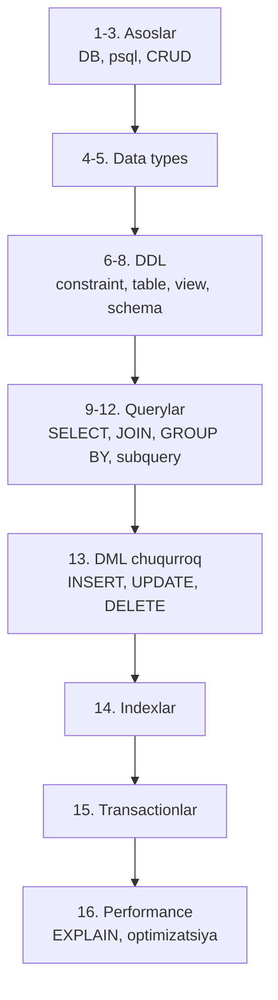

# 📘 Basic PostgreSQL — darslik

> 📖 Asosiy manba: Е. П. Моргунов — **"PostgreSQL. Основы языка SQL"** (Postgres Professional, 2018, 336 sah.)
> Qo'shimcha manba: `2. Database/2. Postgres/` papkasidagi mavjud konspektlar

Bu kurs PostgreSQL'ni **noldan boshlab** o'rganish uchun mo'ljallangan. Darslar kitobdagi o'rganish ketma-ketligiga mos ravishda joylashtirilgan — birinchisidan boshlab tartib bilan o'qib boring.

## 🗺 O'quv reja

## 📚 Darslar ro'yxati

| # | Dars | Kitob bobi | Mavzular |
|---|------|-----------|----------|
| 1 | Kirish — Database va SQL | 1-bob | Database nima, relational model, SQL guruhlari (DDL/DML/TCL/DCL), demo baza |
| 2 | Ish muhiti — psql va demo baza | 2-bob | O'rnatish, psql meta-buyruqlari, demo bazani yuklash |
| 3 | Jadvallar bilan asosiy amallar | 3-bob | CREATE TABLE, INSERT, SELECT, UPDATE, DELETE — birinchi tanishuv |
| 4 | Data types — son, matn, sana-vaqt, boolean | 4-bob | integer, numeric, varchar/text, date/timestamp/interval, boolean |
| 5 | Data types — Array va JSON | 4-bob | Array amallari, json vs jsonb, operatorlar |
| 6 | DDL — DEFAULT va Constraintlar | 5-bob | DEFAULT, CHECK, NOT NULL, UNIQUE, PK, FK, referential integrity |
| 7 | DDL — jadval yaratish va o'zgartirish | 5-bob | CREATE/DROP TABLE, temporary table, ALTER TABLE |
| 8 | VIEW va Schema | 5-bob | View, materialized view, schema, search_path |
| 9 | SELECT — qo'shimcha imkoniyatlar | 6-bob | DISTINCT, LIKE, BETWEEN, LIMIT/OFFSET, CASE, bajarilish tartibi |
| 10 | JOIN — jadvallarni birlashtirish | 6-bob | INNER, LEFT, RIGHT, FULL, CROSS, self join |
| 11 | Aggregation va GROUP BY | 6-bob | count/sum/avg/min/max, GROUP BY, HAVING |
| 12 | Subquery — ichma-ich so'rovlar | 6-bob | IN, EXISTS, ANY/ALL, correlated subquery, CTE asoslari |
| 13 | INSERT, UPDATE, DELETE — chuqurroq | 7-bob | INSERT...SELECT, COPY, ON CONFLICT, RETURNING, TRUNCATE |
| 14 | Indexlar | 8-bob | B-tree, multicolumn, unique, expression, partial index |
| 15 | Transactionlar va Isolation levellar | 9-bob | ACID, BEGIN/COMMIT/ROLLBACK, isolation levellar, anomaliyalar, lock |
| 16 | Performance — EXPLAIN va query optimizatsiya | 10-bob | EXPLAIN ANALYZE, scan methodlari, join methodlari, planner |

## 🎯 Qanday o'qish kerak?

1. Darslarni **tartib bilan** o'qing — har dars oldingisiga tayanadi.
2. Har darsdagi SQL misollarni **o'zingiz terib ko'ring** (demo baza yoki o'z bazangizda).
3. Dars oxiridagi **Nazorat savollari**ga javob bering — javob berolmagan joyni qayta o'qing.
4. Kurs tugagach `/quiz postgresql` bilan bilimingizni tekshiring.

## ⏭ Keyingi bosqich

Bu kursni tugatgandan so'ng **`Advanced PostgreSQL`** papkasidagi kursga o'ting — u yerda window functionlar, MVCC internals, WAL, replication, partitioning va boshqa chuqur mavzular yoritiladi.
