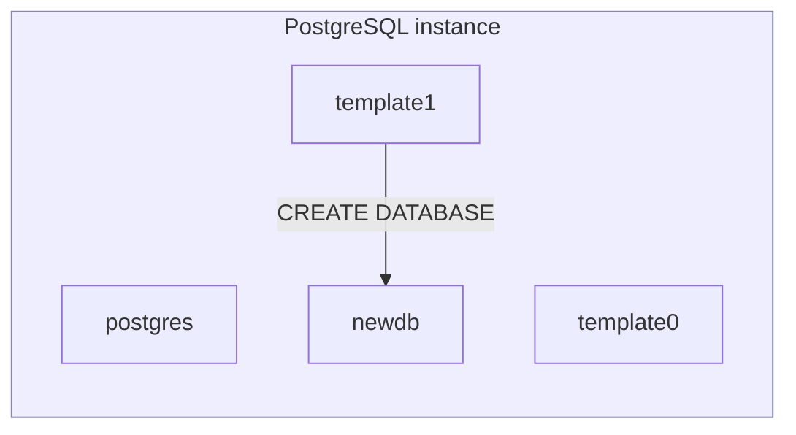
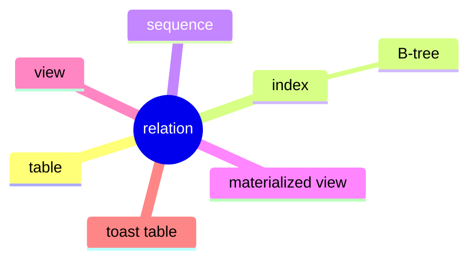
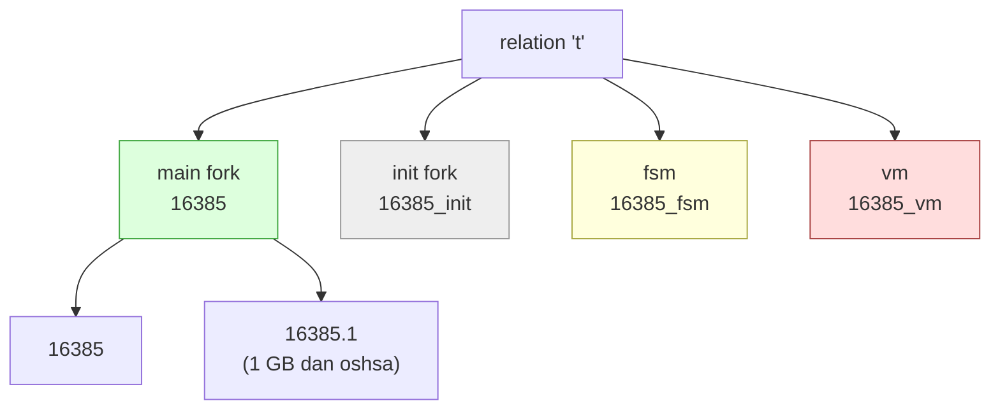
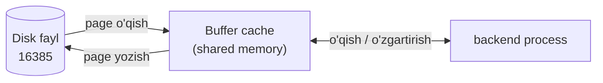
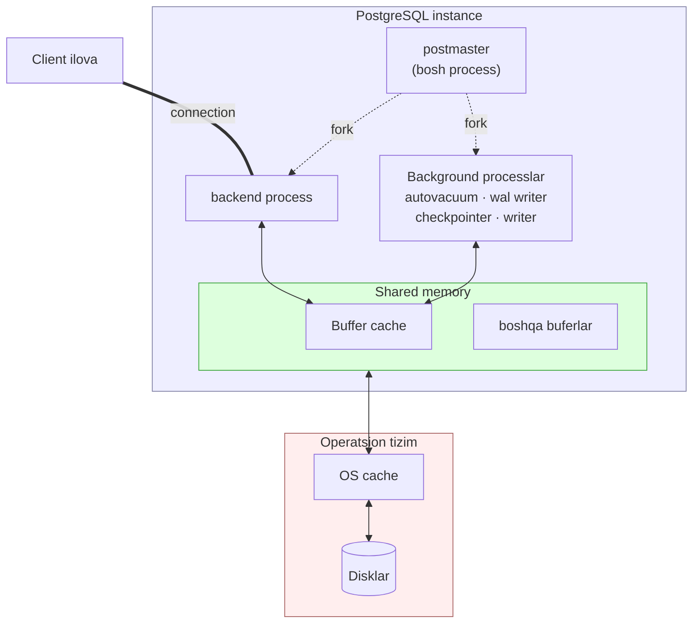

# 1. Kirish — PostgreSQL ichki tuzilishi

> 📖 Manba: Егор Рогов, "PostgreSQL 17 изнутри", 1-bob ("Введение", sah. 23–44)

## Nima uchun kerak?

"Basic PostgreSQL" kursida sen SQL yozishni, jadval yaratishni, index qo'yishni,
tranzaksiyalar bilan ishlashni o'rgangansan. U yerda PostgreSQL sen uchun "qora
quti" edi: so'rov yuborasan — natija qaytadi. Ammo endi biz shu qutini ochamiz.

Advanced darajada quyidagi savollarga javob berish kerak bo'ladi:

- Nega bitta jadval diskda **bir nechta faylga** bo'linib saqlanadi?
- `VACUUM` aslida nimani tozalaydi va nega u umuman kerak?
- Nega katta `text` yoki `json` qiymat jadval ustunini "shishirib yubormaydi"?
- Nega 1000 ta ochiq connection serverni sekinlashtiradi?
- Server ishga tushganda **qanday processlar** paydo bo'ladi va har biri nima qiladi?

Bu darsda biz PostgreSQL'ning ichki tuzilishini **umumiy xarita** darajasida
ko'rib chiqamiz. Bu — keyingi barcha mavzular (buffer cache, WAL, MVCC, VACUUM,
indexlar) uchun poydevor. Har bir tushunchani hozircha yuzaki tanishtiramiz,
keyingi darslarda esa har biriga alohida chuqur kirib boramiz.

---

## 1. Ma'lumotlarni tashkil etish

### 1.1. Cluster va PGDATA

PostgreSQL — bu **ma'lumotlar bazalarini boshqarish tizimi** (DBMS) sinfiga
tegishli dastur. Ishga tushirilgan PostgreSQL dasturini biz **server** yoki
serverning **instance**'i deb ataymiz.

Bitta PostgreSQL instance bir vaqtning o'zida bir nechta baza bilan ishlaydi.
Ular birgalikda **cluster** (ma'lumotlar bazalari klasteri) deb ataladi.

> ⚠️ Diqqat: bu yerdagi "cluster" — bir nechta serverdan iborat taqsimlangan
> tizim emas! PostgreSQL kontekstida cluster — bu **bitta** instance boshqaradigan
> bazalar to'plami.

Clusterni ishlatishdan oldin uni **initsializatsiya** qilish (yaratish) kerak
(`initdb` buyrug'i bilan). Clusterga tegishli barcha fayllar bitta katalogda
saqlanadi — bu katalog an'anaviy ravishda **PGDATA** deb ataladi (unga ishora
qiluvchi environment variable nomidan).

Analogiya: PGDATA — bu PostgreSQL yashaydigan "uy". Uydagi har bir xona
(database), har bir javon (tablespace), har bir daftar (fayl) — hammasi shu
uyning ichida.

### 1.2. Uchta boshlang'ich database

Initsializatsiya paytida PGDATA ichida uchta bir xil database yaratiladi:

| Database    | Vazifasi                                                                          |
| ----------- | --------------------------------------------------------------------------------- |
| `template0` | O'zgarmaydigan "toza namuna". Backup'dan tiklash yoki boshqa encoding'da baza yaratish uchun |
| `template1` | Yangi bazalar uchun **shablon** (`CREATE DATABASE` shu bazadan nusxa oladi)        |
| `postgres`  | Oddiy foydalanuvchi bazasi — xohlaganingcha ishlatishing mumkin                   |

`CREATE DATABASE newdb` bajarganingda, PostgreSQL aslida `template1`'ning
nusxasini ko'chiradi. Ya'ni `template1`'ga qo'shgan har bir extension yoki
sozlama avtomatik ravishda yangi bazalarga o'tadi.



### 1.3. System catalog — metama'lumotlar qaerda?

Clusterdagi barcha ob'ektlar (jadvallar, indexlar, ustunlar, tiplar, funksiyalar)
haqidagi metama'lumot maxsus jadvallarda saqlanadi. Bu jadvallar to'plami
**system catalog** deb ataladi.

Eng muhim jihat: **system catalog — bu oddiy SQL jadvallardan iborat.** Ularga
xuddi o'z jadvallaringga murojaat qilganingdek `SELECT` yuborishing mumkin. Sen
DDL buyruq (`CREATE TABLE`, `ALTER ...`) yozganingda, aslida bu jadvallarga
yozuv qo'shiladi yoki o'zgartiriladi.

Qoidalar:

- Barcha system catalog jadvallari nomi **`pg_`** prefiksi bilan boshlanadi
  (`pg_database`, `pg_class`, `pg_attribute`).
- Ustun nomlari odatda jadvalga mos **uch harfli kod** bilan boshlanadi
  (`pg_database` → `datname`, `pg_class` → `relname`).
- Har bir jadvalda primary key ustuni **`oid`** deb ataladi (Object Identifier) —
  32-bitli butun son. Bu clusterdagi har bir ob'ektning noyob "pasport raqami".

Eng ko'p ishlatiladigan system catalog jadvallari:

| Jadval          | Nima saqlaydi                                              |
| --------------- | --------------------------------------------------------- |
| `pg_database`   | Clusterdagi barcha databaselar ro'yxati                   |
| `pg_class`      | Relation'lar (jadval, index, sequence, view...) haqida    |
| `pg_attribute`  | Har bir relation ustunlari haqida                         |
| `pg_namespace`  | Schema'lar ro'yxati                                        |
| `pg_tablespace` | Tablespace'lar ro'yxati                                    |

> 🔎 Tarixiy fakt: `pg_class` jadvali dastlab `pg_relation` deb atalgan — shuning
> uchun ustunlari hali ham `rel` prefiksi bilan boshlanadi (`relname`,
> `relfilenode`, `relkind`).

Amaliyot — o'zing sinab ko'r:

```sql
-- Clusterdagi barcha bazalar
SELECT oid, datname FROM pg_database;

-- 'postgres' bazasining oid'i
SELECT oid FROM pg_database WHERE datname = 'postgres';
```

### 1.4. Schema — nomlar fazosi (namespace)

**Schema** — database ichidagi ob'ektlar uchun **namespace** (nomlar fazosi).
Turli schema'larda bir xil nomli jadvallar bo'lishi mumkin
(`sales.orders` va `archive.orders` — bir-biriga xalaqit bermaydi).

Foydalanuvchi schema'laridan tashqari maxsus xizmat schema'lari bor:

| Schema               | Vazifasi                                                       |
| -------------------- | -------------------------------------------------------------- |
| `public`             | Standart schema — sozlanmasa, ob'ektlar shu yerga tushadi      |
| `pg_catalog`         | System catalog jadvallari shu yerda                            |
| `information_schema` | SQL standarti belgilagan system catalog ko'rinishi (view'lar)  |
| `pg_toast`           | TOAST ob'ektlari (haqida quyida)                               |
| `pg_temp`            | Vaqtinchalik (temporary) jadvallar                             |

Ob'ektga murojaat qilganingda schema'ni aniq yozmasang (`SELECT * FROM orders`),
PostgreSQL **`search_path`** parametridagi schema'lar ro'yxatini navbat bilan
tekshirib, birinchi mos kelganini tanlaydi. `pg_catalog` ushbu ro'yxatga
avtomatik (yashirin) qo'shiladi — shuning uchun `pg_class`'ni schema'siz
yozaverasan.

```sql
SHOW search_path;   -- odatda: "$user", public
```

### 1.5. Tablespace — jismoniy joylashuv

Database va schema ob'ektlarni **mantiqiy** taqsimlaydi. **Tablespace** esa
ma'lumot diskda **jismonan qaerda** yotishini belgilaydi. Aslida tablespace —
bu fayl tizimidagi oddiy katalog.

Nega kerak? Masalan: kam ishlatiladigan arxiv ma'lumotni sekin (arzon) diskka,
faol ishlatiladigan ma'lumotni tez (SSD) diskka joylashtirish mumkin.

Muhim tamoyil: **mantiqiy va jismoniy struktura bir-biridan mustaqil.**
- Bitta tablespace'ni bir nechta database ishlatishi mumkin;
- Bitta database ma'lumotini bir nechta tablespace'ga tarqatishi mumkin.

Initsializatsiyada ikkita tablespace yaratiladi:

| Tablespace   | Joylashuvi       | Vazifasi                                          |
| ------------ | ---------------- | ------------------------------------------------- |
| `pg_default` | `PGDATA/base`    | Standart tablespace — boshqasi tanlanmasa, shu yerga |
| `pg_global`  | `PGDATA/global`  | Butun cluster uchun umumiy system catalog ob'ektlari |

Foydalanuvchi o'z tablespace'ini yaratganda ixtiyoriy katalog ko'rsatadi.
PostgreSQL esa `PGDATA/pg_tblspc` ichida unga **symbolic link** yaratadi. Barcha
PostgreSQL yo'llari (path) PGDATA'ga nisbatan hisoblanadi — shuning uchun serverni
to'xtatib, butun PGDATA'ni boshqa joyga ko'chirsa bo'ladi.

### 1.6. Relation — hamma narsa "qatorlar to'plami"

PostgreSQL'da eng muhim ob'ektlar — **jadvallar** va **indexlar** — turli
bo'lsa-da, ichki tuzilishi jihatidan o'xshash: ikkalasi ham **qatorlardan**
iborat. Jadval uchun bu tabiiy. Index uchun ham shunday: B-tree tugunlari
indekslangan qiymat va boshqa tugunlarga (yoki jadval qatorlariga) havolalarni
saqlaydigan qatorlardan tashkil topgan.

Xuddi shunday tuzilgan yana bir qancha ob'ektlar bor:

- **sequence** — aslida bir qatorli jadval;
- **materialized view** — so'rov natijasini eslab qoladigan jadval;
- **view** — o'zi ma'lumot saqlamaydi, lekin boshqa jihatdan jadvalga o'xshaydi.

Bularning barchasini PostgreSQL umumiy **relation** so'zi bilan ataydi. Shuning
uchun ko'p system catalog jadvallari (masalan `pg_class`) barcha relation
turlarini birga saqlaydi.



---

## 2. Fork (qatlam)lar va fayllar

### 2.1. Bitta relation — bir nechta fork

Relation bilan bog'liq ma'lumot bir necha **fork** (qatlam)ga bo'linadi. Har bir
fork ma'lum turdagi ma'lumotni saqlaydi va **alohida fayl(lar)** bilan
ifodalanadi.

Fayl nomi raqamli identifikatordan (`relfilenode`) iborat bo'lib, unga fork
turini bildiruvchi suffiks qo'shilishi mumkin.

Standart fork turlari:

| Fork              | Suffiks  | Nima saqlaydi                                                    |
| ----------------- | -------- | --------------------------------------------------------------- |
| **main fork**     | (yo'q)   | Asosiy ma'lumot: jadval yoki index qatorlari                    |
| **init fork**     | `_init`  | Faqat `UNLOGGED` ob'ektlar uchun — tiklash uchun bo'sh "qolip"  |
| **fsm** (free space map)  | `_fsm`   | Har bir page'dagi bo'sh joy hajmini kuzatadi           |
| **vm** (visibility map)   | `_vm`    | Qaysi page tozalash/muzlatishni talab qilmasligini belgilaydi |

Shuning uchun indexsiz eng kichik jadval ham diskda **kamida uch fayl**ga mos
keladi (majburiy fork'lar soni bo'yicha).



### 2.2. Segmentlar — 1 GB chegara

Fayl asta-sekin o'sadi. Hajmi **1 GB**ga yetganda, shu fork'ning keyingi fayli
(segment) yaratiladi. Segment tartib raqami fayl nomi oxiriga qo'shiladi:
`16385`, `16385.1`, `16385.2` ...

Nega 1 GB? Tarixiy sabab: ba'zi eski fayl tizimlari katta hajmli fayllar bilan
ishlay olmagan. Bu chegarani PostgreSQL'ni build qilishda o'zgartirsa bo'ladi
(`./configure --with-segsize`), lekin odatda hech kim tegmaydi.

Katalog tuzilishi: har bir tablespace ichida (pg_global'dan tashqari) har bir
database uchun alohida subkatalog yaratiladi. Bitta tablespace va bitta
database'ga tegishli barcha fayllar shu bitta subkatalogga tushadi.

### 2.3. Fayl yo'lini o'zing top

Kitobning klassik misolini takrorlaymiz. `UNLOGGED` jadval yaratamiz (chunki uning
init fork'i ham bo'ladi):

```sql
CREATE UNLOGGED TABLE t(
    a integer,
    b numeric,
    c text,
    d json
);

INSERT INTO t VALUES (1, 2.0, 'foo', '{}');

SELECT pg_relation_filepath('t');
```

Natija:

```
 pg_relation_filepath
----------------------
 base/16384/16385
```

Buni "o'qish": `base` — bu `pg_default` tablespace; `16384` — database'ning oid'i;
`16385` — main fork faylining nomi (`relfilenode`). Buni qismlarga ajratib
tekshiramiz:

```sql
SELECT oid FROM pg_database WHERE datname = current_database();  -- 16384
SELECT relfilenode FROM pg_class WHERE relname = 't';           -- 16385
```

Faylning haqiqiy hajmini ko'rish (yo'lni o'zingnikiga moslashtir):

```sql
SELECT size FROM pg_stat_file('base/16384/16385');
-- size = 8192  (bitta page)
```

### 2.4. Har bir fork'ni "ko'zga ko'rinadigan" qilish

**init fork** — faqat `UNLOGGED` jadvallar uchun. `UNLOGGED` jadval WAL'ga
yozilmaydi (shuning uchun tezroq), lekin crash bo'lsa uni izchil holatga
tiklab bo'lmaydi. Shu sababli tiklashda PostgreSQL bunday ob'ektning barcha
fork'larini o'chirib, `_init` fork'ni main fork o'rniga yozadi — natijada
**bo'sh jadval** qoladi.

```sql
SELECT size FROM pg_stat_file('base/16384/16385_init');
-- size = 0  (bo'sh qolip)
```

**fsm (free space map)** — page'lardagi bo'sh joyni kuzatadi. Yangi qator
qo'shilganda kamayadi, VACUUM'da ortadi. Yangi qatorni tez sig'diradigan page'ni
topish uchun ishlatiladi. Bu fayl darhol emas, kerak bo'lganda paydo bo'ladi —
eng oson usuli VACUUM chaqirish:

```sql
VACUUM t;
SELECT size FROM pg_stat_file('base/16384/16385_fsm');
-- size = 24576  (kamida 3 page — fsm daraxt shaklida tashkil etilgan)
```

**vm (visibility map)** — har bir jadval page'i uchun **ikki bit** ajratadi:
- 1-bit: page faqat **dolzarb** qator versiyalaridan iborat → VACUUM uni
  o'tkazib yuboradi, index-only scan mumkin bo'ladi;
- 2-bit: page'dagi barcha qatorlar **muzlatilgan** (frozen) → "muzlatish xaritasi".

```sql
SELECT size FROM pg_stat_file('base/16384/16385_vm');
-- size = 8192  (odatda eng kichik fayl)
```

> 📌 Eslatma: fsm va vm jadvallar uchun mavjud. Index uchun fsm bor (faqat
> to'liq tozalangan page'lar kuzatiladi), lekin vm **yo'q**.

---

## 3. Page (sahifa) — 8 KB bloklar

Fayllar mantiqan **page**'larga (yoki bloklarga) bo'linadi. Page — bu diskdan
o'qiladigan yoki diskka yoziladigan ma'lumotning **minimal birligi**. PostgreSQL
ning ko'p ichki algoritmlari aynan page'lar bilan ishlashga mo'ljallangan.

- Standart page hajmi — **8 KB** (8192 bayt).
- Uni 32 KB'gacha o'zgartirsa bo'ladi, lekin faqat build vaqtida
  (`./configure --with-blocksize`) — amalda deyarli hech kim o'zgartirmaydi.
- Bir instance faqat bitta o'lchamdagi page bilan ishlaydi.

Ishlash tartibi: qaysi fork'ga tegishli bo'lishidan qat'i nazar, page'lar avval
**buffer cache**'ga o'qiladi (u yerda processlar ularni o'qiydi va o'zgartiradi),
keyin kerak bo'lganda diskka qaytariladi. (Buffer cache — keyingi darslardan
birining asosiy mavzusi.)



---

## 4. TOAST — katta qiymatlarni saqlash

**Qoida:** har bir qator **butunligicha bitta page**'ga sig'ishi kerak. Qatorni
keyingi page'da "davom ettirish" mumkin emas. Lekin `text`, `json`, `bytea` kabi
tiplar page hajmidan (8 KB) kattaroq qiymat saqlashi mumkin. Bu muammoni
**TOAST** (The Oversized Attributes Storage Technique) hal qiladi.

TOAST'ning uchta usuli bor:
1. **Bo'lib yuborish** — uzun qiymatni kichik "tost" bo'laklarga bo'lib, alohida
   xizmat jadvaliga (**toast-table**) ko'chirish;
2. **Siqish (compression)** — qiymatni siqib, qator baribir bitta page'ga sig'sin;
3. **Ikkalasi** — avval siqish, keyin bo'lib yuborish.

Agar jadvalda potentsial uzun ustun bo'lsa (masalan `text` yoki `numeric`),
PostgreSQL avtomatik ravishda **alohida toast-table** yaratadi (barcha ustunlar
uchun bitta) — hatto u ustunda hech qachon uzun qiymat saqlanmasa ham.

### 4.1. TOAST strategiyalari

Har bir ustunning saqlash strategiyasi bor. Uni system catalog orqali ko'ramiz:

```sql
SELECT attname, atttypid::regtype,
       CASE attstorage
           WHEN 'p' THEN 'plain'
           WHEN 'e' THEN 'external'
           WHEN 'm' THEN 'main'
           WHEN 'x' THEN 'extended'
       END AS storage
FROM pg_attribute
WHERE attrelid = 't'::regclass AND attnum > 0;
```

```
 attname | atttypid | storage
---------+----------+----------
 a       | integer  | plain
 b       | numeric  | main
 c       | text     | extended
 d       | json     | extended
```

| Strategiya | Ma'nosi                                                          |
| ---------- | --------------------------------------------------------------- |
| `plain`    | TOAST ishlatilmaydi (qisqa tiplar: `integer`)                   |
| `extended` | Siqish ham, alohida toast-table'ga ko'chirish ham mumkin (default katta tiplar uchun) |
| `external` | Toast-table'ga ko'chiriladi, lekin **siqilmaydi**               |
| `main`     | Avval siqiladi; siqish yordam bermasagina toast-table'ga tushadi |

### 4.2. TOAST algoritmi (soddalashtirilgan)

PostgreSQL page'da kamida **4 ta qator** sig'ishiga intiladi. Shuning uchun qator
hajmi page'ning taxminan **to'rtdan bir**idan (standart page uchun ~2000 bayt)
oshsa, TOAST ishga tushadi. Qadamlar (qator chegaradan qisqargunча davom etadi):

1. `external`/`extended` atributlarni eng uzunidan boshlab ko'rib chiqadi:
   extended — siqadi, external — siqmaydi; agar qiymat hali ham ¼ page'dan katta
   bo'lsa, darhol toast-table'ga yuboradi.
2. Hali sig'masa — qolgan `external`/`extended` atributlarni bittalab
   toast-table'ga yuboradi.
3. Hali sig'masa — `main` atributlarni siqadi (page'da qoldirib).
4. Hali sig'masa — `main` atributlarni ham toast-table'ga yuboradi.

Chegarani jadval darajasida `toast_tuple_target` parametri bilan o'zgartirsa
bo'ladi. Ustun strategiyasini ham o'zgartirsa bo'ladi (masalan, JPEG saqlanadigan
va baribir siqilmaydigan ustun uchun `external` foydali):

```sql
ALTER TABLE t ALTER COLUMN d SET STORAGE external;
```

Siqish uchun ikkita algoritm bor: an'anaviy **PGLZ** va zamonaviyroq **LZ4**
(ikkalasi ham Lempel–Ziv turkumidan). Standart algoritm `default_toast_compression`
parametrida beriladi. LZ4 o'xshash siqish darajasida kamroq protsessor sarflaydi.

### 4.3. Toast-table ichini ko'rish

Toast-table `pg_toast` schema'sida joylashadi (search_path'ga kirmaydi, shuning
uchun odatda ko'rinmaydi). Uni topamiz:

```sql
SELECT relnamespace::regnamespace, relname
FROM pg_class WHERE oid = (
    SELECT reltoastrelid FROM pg_class WHERE relname = 't'
);
```

```
 relnamespace |    relname
--------------+----------------
 pg_toast     | pg_toast_16385
```

Toast-table tuzilishi doim bir xil: `chunk_id` (qiymat identifikatori),
`chunk_seq` (bo'lak tartibi), `chunk_data` (bo'lakning o'zi). Uzun qiymat shu
uch ustunli jadvalda bo'laklarga bo'linib yotadi.

Siqilishni sinash — takrorlanuvchi belgilar yaxshi siqiladi (toast-table bo'sh
qoladi):

```sql
UPDATE t SET c = repeat('A', 5000);
SELECT * FROM pg_toast.pg_toast_16385;   -- (0 rows) — page'ga sig'di
```

Tasodifiy belgilar siqilmaydi — natijada toast-table'ga bo'lib ko'chiriladi:

```sql
UPDATE t SET c = (
    SELECT string_agg(chr(trunc(65+random()*26)::integer), '')
    FROM generate_series(1,5000)
);
SELECT chunk_id, chunk_seq, length(chunk_data)
FROM pg_toast.pg_toast_16385;    -- bir nechta chunk qatori paydo bo'ladi
```

> 💡 Amaliy xulosa: uzun atributga murojaat qilinganda PostgreSQL qiymatni
> avtomatik tiklaydi. Ammo agar u atribut so'rovda kerak bo'lmasa, toast-table
> umuman o'qilmaydi. **Shuning uchun productionda `SELECT *` ishlatmaslik kerak** —
> keraksiz TOAST o'qishlar performansni yeydi. Umuman, juda katta ma'lumotni
> (masalan hujjat skanerlari) faylga saqlab, bazada faqat fayl nomini ushlash
> ko'pincha yaxshiroq g'oya.

---

## 5. Processlar va Memory

PostgreSQL instance — bu bir-biri bilan hamkorlik qiladigan **bir nechta
process**dan iborat. (Ba'zi DBMS'lar thread ishlatadi, PostgreSQL esa loyihaning
boshidan process modelini tanlagan — soddaligi va izolyatsiyasi uchun.)

### 5.1. postmaster — bosh process

Server ishga tushganda birinchi bo'lib `postgres` processi ishga tushadi — uni
an'anaviy ravishda **postmaster** deb ataladi. postmaster:

- boshqa **barcha** processlarni ishga tushiradi (Unix'da `fork` system call orqali);
- ularni "kuzatib" turadi — biror process avariyali tugasa, uni qayta ishga tushiradi
  (yoki umumiy ma'lumotga zarar yetgan bo'lishi mumkin deb hisoblasa — butun serverni);
- kiruvchi client ulanishlarini **tinglaydi**.

### 5.2. Background (xizmat) processlar

Serverni bir qancha xizmat processlari ta'minlaydi. Asosiylari:

| Process          | Vazifasi                                                         |
| ---------------- | --------------------------------------------------------------- |
| **startup**      | Crash'dan keyin tizimni tiklaydi                                |
| **autovacuum**   | Jadval va indexlarni dolzarb bo'lmagan ma'lumotdan tozalaydi     |
| **wal writer**   | WAL (journal) yozuvlarini diskka yozadi                          |
| **checkpointer** | Checkpoint bajaradi (kesh holatini diskka mustahkamlaydi)       |
| **writer** (background writer) | "Iflos" (dirty) page'larni diskka yozadi          |
| **wal sender**   | WAL yozuvlarini replikaga uzatadi                               |
| **wal receiver** | Replikada WAL yozuvlarini qabul qiladi                          |

Bularning ba'zilari vazifasini bajarib tugagach yopiladi, ba'zilari doim
background rejimda ishlaydi, ba'zilari esa o'chirib qo'yilishi mumkin.

### 5.3. Client ulanishi — backend process

Yangi client paydo bo'lganda postmaster u uchun alohida **backend** (xizmat
ko'rsatuvchi process) yaratadi. Client shu backend bilan **seans** (session)
o'rnatadi va u client uzilgunga qadar davom etadi. Ya'ni:

> **Har bir client ulanishi = serverda alohida process.**

### 5.4. Memory: shared vs local

- **Shared memory** (umumiy xotira) — postmaster ajratadigan, barcha processlar
  uchun **umumiy** xotira sohasi. Processlar shu orqali ma'lumot almashadi. Uning
  eng katta qismi — **buffer cache**: yaqinda o'qilgan page'lar shu yerda saqlanadi,
  bu diskka takroriy murojaatni tejaydi. O'zgargan ma'lumot ham darhol emas,
  biroz keyin diskka yoziladi.
- **Local memory** — har bir backend'ning **shaxsiy** xotirasi: system catalog
  keshi, prepared statement'lar, so'rov bajarilishidagi oraliq natijalar va h.k.

> ⚠️ Muhim xulosa: OS ham o'z keshiga ega. PostgreSQL to'g'ridan-to'g'ri (direct)
> I/O ishlatmaydi — natijada keshlash **ikki marta** (PostgreSQL buffer cache +
> OS cache) bo'ladi.

Crash bo'lsa (masalan, tok o'chsa) shared memory'dagi, jumladan buffer
cache'dagi ma'lumot **yo'qoladi**. Diskda esa turli vaqtlarda yozilgan page'lar
qoladi. Aynan shu sababli PostgreSQL **WAL (write-ahead log)** yuritadi — u
yo'qolgan operatsiyalarni qayta bajarib, izchillikni tiklashga imkon beradi.
(WAL — keyingi darslarning markaziy mavzusi.)



---

## 6. Client-server protokoli

Client va server bir-birini tushunishi uchun bitta **protokol**dan foydalanadi.
Odatda uni standart **libpq** kutubxonasi amalga oshiradi (mustaqil
implementatsiyalar ham bor).

Asosiy tushunchalar:

- **Connection (ulanish)** — har bir ulanish aniq bir **rol** (user) ostida va
  aniq bir **database**'ga o'rnatiladi. Server cluster bilan ishlasa-da, bitta
  ilovada bir nechta bazadan foydalanmoqchi bo'lsang, **har biriga alohida
  ulanish** kerak. Ulanishda **autentifikatsiya** o'tkaziladi: backend
  foydalanuvchi haqiqatan o'zi da'vo qilgan shaxs ekanligini tekshiradi
  (masalan parol so'rab) va uning serverga hamda tanlangan bazaga ulanish
  huquqini tekshiradi.
- **SQL so'rov** — clientdan backend'ga **matn** ko'rinishida yuboriladi. Backend
  uni parse qiladi, optimallashtiradi, bajaradi va natijani clientga qaytaradi.
- **Prepared statement (tayyorlangan so'rov)** — bir xil so'rovni ko'p marta
  (faqat parametrlari o'zgarib) bajarganda, uni bir marta parse/rejalashtirib,
  keyin faqat parametr uzatib qayta-qayta ishga tushirish mumkin. Bu ishni
  tezlashtiradi va SQL-injection'dan himoya qiladi. (Batafsil — keyingi darslarda.)
- **Cursor** — katta natijani bir zarbada emas, **qismlab** (qatorma-qator yoki
  bloklab) olib kelish mexanizmi. Server natijani ushlab turadi, client esa
  keraklicha "surib" o'qiydi.

### 6.1. Ko'p ulanish — muammo

Har bir clientga alohida process yaratish sodda va ishonchli, ammo ulanishlar
ko'payganda muammo tug'diradi:

- Har bir process local memory talab qiladi (catalog cache, prepared statement,
  oraliq natijalar). Qancha ko'p ulanish — shuncha ko'p xotira kerak.
- Ulanishlar tez-tez ochilib-yopilsa (qisqa seanslar), process yaratish va
  keshlarni to'ldirishga ko'p resurs ketadi.
- Processlar ro'yxatini ko'rib chiqish (juda tez-tez bajariladigan amal) uzayadi
  — natijada client soni oshgani sari performans **pasayishi** mumkin.

### 6.2. Yechim — connection pool

Bu holatlarda **connection pool** ishlatiladi — u backend processlar sonini
cheklaydi va bitta processni turli clientlar tranzaksiyalari uchun navbatma-navbat
ishlatadi. PostgreSQL'da **o'rnatilgan pool yo'q**, shuning uchun tashqi yechimlar
qo'llanadi: **PgBouncer**, **Odyssey** yoki application serverga o'rnatilgan pool
managerlari.

> ⚠️ Cheklov: pool bitta processni bir necha clientga bo'lgani uchun, faqat
> **tranzaksiya** doirasidagi vositalarga tayanish kerak — butun **seans**ga
> bog'liq narsalarga (masalan session-level prepared statement yoki temporary
> table) emas.

---

## Xulosa

- **Cluster** — bitta PostgreSQL instance boshqaradigan bazalar to'plami; barcha
  fayllar **PGDATA** katalogida yotadi. Initsializatsiyada `template0`,
  `template1`, `postgres` bazalari yaratiladi.
- **System catalog** — metama'lumot saqlaydigan oddiy SQL jadvallar (`pg_class`,
  `pg_attribute`...). Har bir ob'ekt noyob **`oid`**'ga ega.
- Ierarxiya ikki o'qda: **mantiqiy** (database → schema → ob'ekt) va **jismoniy**
  (**tablespace** → fayl tizimi katalogi). Ular bir-biridan mustaqil.
- Jadval, index, sequence, view — hammasi umumiy **relation** tushunchasiga birlashadi.
- Har bir relation bir necha **fork**'dan iborat: **main**, **init** (UNLOGGED
  uchun), **fsm**, **vm**. Har fork alohida fayl(lar); 1 GB'dan oshsa
  **segment**larga bo'linadi.
- Fayllar **page** (8 KB) birliklariga bo'linadi — bu I/O'ning minimal birligi.
- **TOAST** uzun qiymatlarni siqish yoki alohida **toast-table**'ga bo'lib
  saqlaydi (`plain`/`extended`/`external`/`main` strategiyalari).
- Server **postmaster** + **backend** (har client uchun bitta) + **background**
  processlardan iborat. Ular **shared memory** (asosan buffer cache) orqali
  ma'lumot almashadi; har biriga **local memory** ham tegishli.
- Ko'p ulanish resurs yeydi — yechim **connection pool** (PgBouncer, Odyssey).

### Eslab qol

1. **oid** — clusterdagi har bir ob'ektning noyob raqami.
2. **Bir relation = bir necha fayl** (main + fsm + vm, UNLOGGED bo'lsa + init;
   1 GB'dan oshsa segmentlar).
3. **Page = 8 KB** — o'qish/yozishning minimal birligi.
4. **Qator butunligicha bitta page'ga sig'ishi shart** — shuning uchun TOAST bor.
5. **Har client = alohida backend process** — shuning uchun connection pool muhim.
6. **Buffer cache — shared memory'da**; crash'da yo'qoladi, shuning uchun WAL kerak.

### Amaliyot

O'zingning test bazangda quyidagilarni bajarib ko'r:

1. `UNLOGGED` jadval yarat va `pg_relation_filepath` bilan uning fayl yo'lini top.
   Yo'lni qismlarga ajrat: qaysi qismi tablespace, qaysi biri database oid,
   qaysi biri relfilenode?
2. `pg_stat_file` bilan main, init, fsm, vm fork fayllari hajmini solishtir.
   (fsm paydo bo'lishi uchun avval `VACUUM` chaqir.)
3. `pg_attribute` orqali jadvalingdagi har bir ustunning TOAST strategiyasini
   chiqar. `text` ustunga `SET STORAGE external` qo'yib, natija o'zgarganini ko'r.
4. `repeat('A', 5000)` va tasodifiy belgilardan iborat 5000 belgili qiymat kirit.
   Ikkalasida toast-table (`pg_toast.pg_toast_...`) ichiga qara — farqni tushuntir.
5. `SELECT reltoastrelid FROM pg_class WHERE relname = '...'` orqali jadvalingning
   toast-table'ini top va uning uch ustunini (`chunk_id`, `chunk_seq`, `chunk_data`) ko'r.

## Nazorat savollari

1. PostgreSQL kontekstidagi "cluster" so'zi nimani anglatadi? U taqsimlangan
   tizimdagi "cluster"dan nimasi bilan farq qiladi?
2. `template0`, `template1` va `postgres` bazalarining har biri nima uchun kerak?
   `CREATE DATABASE` qaysi bazadan nusxa oladi?
3. System catalog nima va nega u "oddiy SQL jadvallar" deyiladi? `oid` nima
   vazifani bajaradi?
4. Database, schema va tablespace o'rtasidagi farqni tushuntir. Mantiqiy va
   jismoniy struktura nega bir-biridan mustaqil?
5. Relation nima? Qanday ob'ektlar shu tushunchaga kiradi?
6. main, init, fsm va vm fork'lari nima vazifani bajaradi? Nima uchun indexsiz
   kichik jadval ham kamida uch faylga mos keladi?
7. Page nima va uning standart hajmi qancha? TOAST qanday muammoni hal qiladi va
   qaysi to'rt strategiyaga ega?
8. postmaster, backend va background processlarning vazifalarini ayt. Shared va
   local memory nimasi bilan farq qiladi? Nega ko'p ulanishда connection pool
   kerak bo'ladi?
