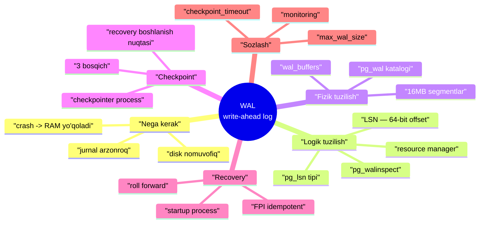
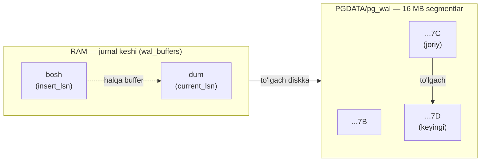
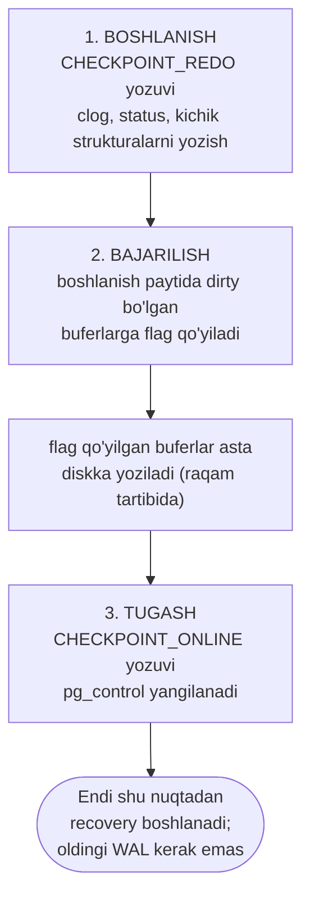
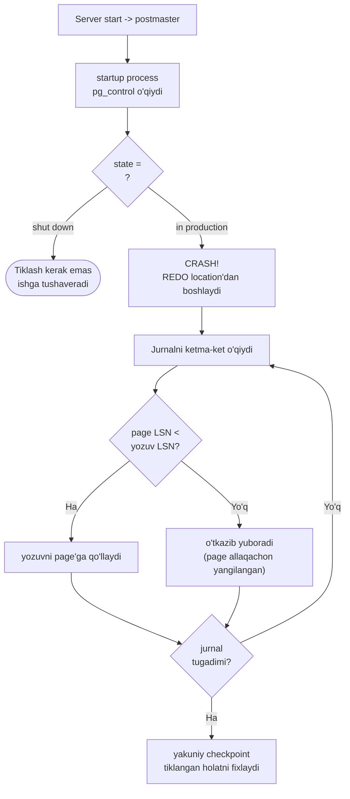
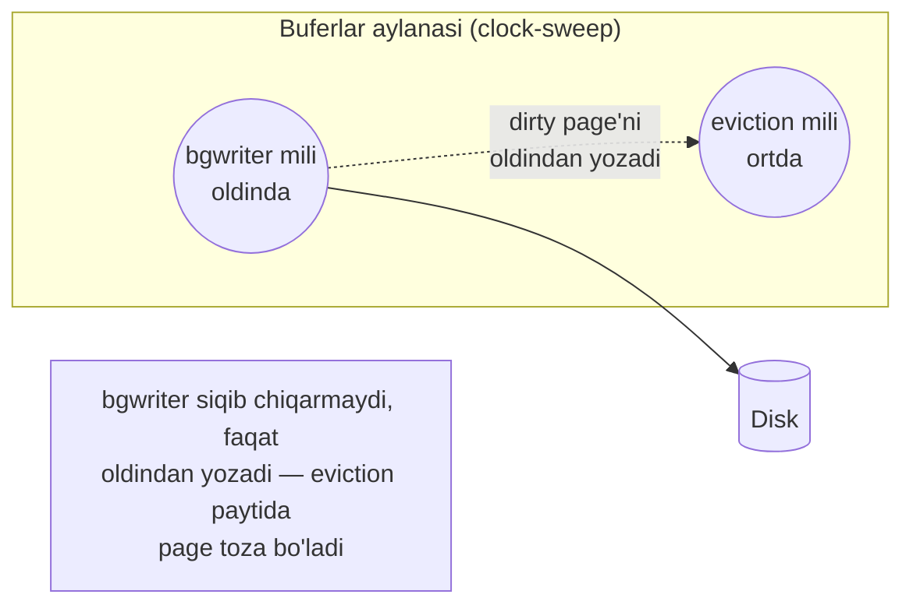
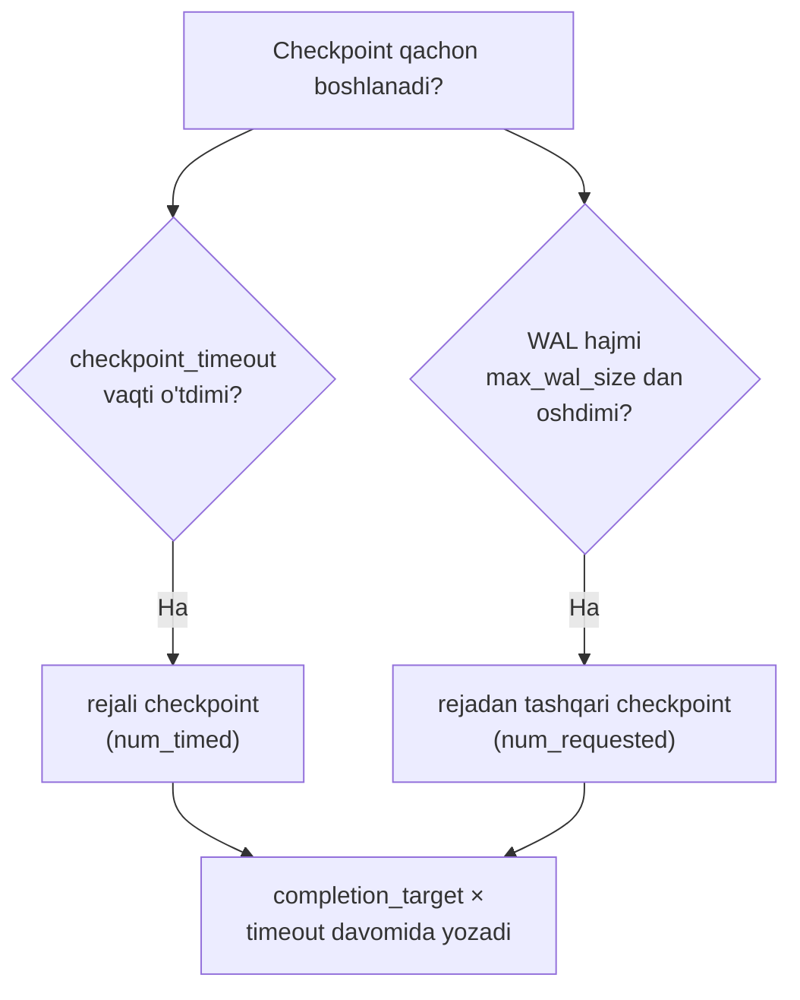
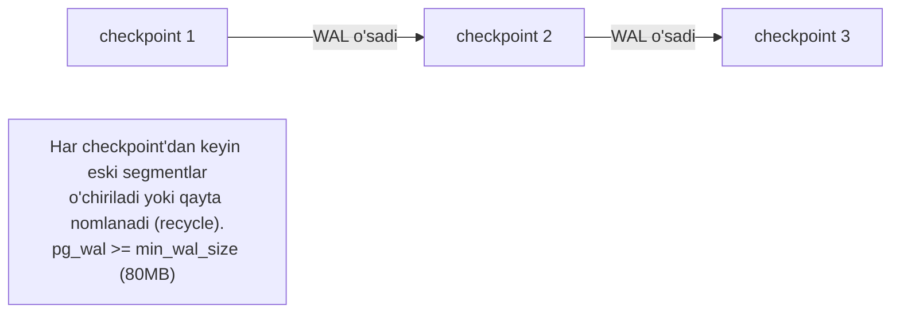

# 10. WAL — Write-Ahead Log

> 📖 Manba: Рогов, "PostgreSQL 17 изнутри", 10-bob ("Журнал предзаписи")

## Nima uchun kerak?

9-darsda **buffer cache** bilan tanishdik. Eng muhim faktni eslaylik: PostgreSQL page'ni o'zgartirganda uni **darhol diskka yozmaydi**. O'zgarish faqat RAM'dagi (operativ xotira) buferda sodir bo'ladi, page **dirty** (iflos) deb belgilanadi va diskka yozilishi **keyinga qoldiriladi** (eviction yoki checkpoint paytida).

Bu tezlik uchun ajoyib. Lekin bitta jiddiy muammo tug'diradi:

> Tok o'chsa, server yoki OS qulasa — RAM'dagi **hamma narsa yo'qoladi**. Diskda faqat oldin yozib ulgurilgan ma'lumot qoladi.

Va bu diskdagi ma'lumot **nomuvofiq** (rassoglasovan): turli page'lar turli vaqt holatida yozilgan. Masalan, `UPDATE` heap page'ni ham, index page'ni ham o'zgartiradi. Agar heap page diskka tushib, index page tushmasdan tok o'chsa — index endi mavjud bo'lmagan row'ga ishora qiladi. Baza buzildi.

Muammoni ikki xil hal qilsa bo'ladi:

1. **Diskni doim muvofiq holatda ushlash** — har o'zgarishni darhol, to'g'ri tartibda diskka yozish. Bu **juda qimmat**: tasodifiy (random) yozuv ketma-ket yozuvdan ancha sekin, murakkab index'lar uchun to'g'ri tartibni ta'minlash deyarli imkonsiz.
2. **O'zgarishlar jurnalini yuritish** — har bir o'zgarishni avval **ketma-ket jurnalga** yozib qo'yish, page'ni esa keyin bemalol yozish. Qulasa — jurnalni o'qib, yo'qolgan o'zgarishlarni **qaytadan bajarish**.

PostgreSQL (aksariyat DBMS'lar kabi) ikkinchi yo'lni tanlaydi. Bu jurnal — **WAL (write-ahead log)**, ya'ni **oldindan yozish jurnali**.

### Analogiya: buxgalteriya jurnali

WAL'ning g'oyasi buxgalteriyadan olingan. Buxgalter har bir operatsiyani avval **xronologik jurnalga** ketma-ket yozadi ("bugun 10:00 da hisobdan 100$ chiqdi"), keyin bo'sh vaqtda uni asosiy hisob kitoblariga (ledger) ko'chiradi. Jurnalga yozish tez — daftarning oxiriga qo'shib qo'yasan. Agar ish yarmida uzilib qolsa, jurnalni qaytadan o'qib, ko'chirilmagan yozuvlarni tiklaydi.

WAL'da ham xuddi shu: har bir o'zgarish avval **jurnalga** (ketma-ket, arzon), page esa asosiy faylga (keyinroq, dangasa) yoziladi.

> **Analogiya chegarasi:** buxgalter jurnalni qo'lda o'qiydi. WAL'da esa tiklashni server **avtomatik** bajaradi va WAL yozuvi har doim page'dan **oldin** diskka tushishi qat'iy kafolatlangan — aynan shu "oldindan yozish" so'zining ma'nosi.

### Nega jurnal arzonroq?

| | Alohida page'larni yozish | WAL yozish |
|---|---|---|
| Yozuv turi | tasodifiy (random) — sekin | ketma-ket (sequential) — hatto HDD ham uddalaydi |
| Hajmi | butun page (8 KB) | ko'pincha page'dan kichik |
| Tartib | murakkab, xatoga moyil | oddiy — oxiriga qo'shib borish |



---

## 10.1. Journalling — nima jurnalga tushadi?

WAL faqat crash'dan tiklash uchun emas — u **rezerv nusxadan istalgan momentga tiklash** (point-in-time recovery) va **replikatsiya** uchun ham ishlatiladi (bularni keyingi kurslarda ko'ramiz).

Ishlash davomida har bir amal RAM'da bajariladi (masalan, buffer cache'dagi page o'zgaradi) va shu bilan birga **jurnallanadi**: diskda **journal yozuvi** (jurnal yozuvi) yaratiladi va saqlanadi — u shu amalni **qaytadan bajarish** uchun yetarli minimal ma'lumotni saqlaydi.

> **Asosiy qoida (write-ahead):** page o'zgarishi haqidagi jurnal yozuvi diskka **o'zgargan page'dan oldin** tushishi shart. Aynan shu tartib crash'dan keyin jurnalni o'qib, diskka yetib bormay qolgan o'zgarishlarni tiklash imkonini beradi.

Diskda nomuvofiqlik xavfi bo'lgan **hamma amal** jurnalga yoziladi. Jumladan:

- **relation page'larining o'zgarishi** buffer cache'da (o'zgargan page'ni diskka tushirish keyinga qoldiriladi);
- **transaction'larni fiksatsiya va bekor qilish** — status clog buferlarida o'zgaradi va diskka darrov tushmaydi (clog'ni 3-darsda ko'rgan edik);
- **fayl amallari** (fayl/katalog yaratish yoki o'chirish, masalan table yaratishda) — bular ma'lumot o'zgarishi bilan **sinxron** bo'lishi kerak.

Jurnalga **yozilmaydi**:

- **unlogged** (`UNLOGGED`) table'lar bilan amallar;
- unlogged sequence'lar bilan amallar (v15, odatda unlogged table'larga tegishli);
- **temporary** (vaqtinchalik) table va sequence'lar bilan amallar — bunday obyektlar umri ularni yaratgan sessiya umridan oshmaydi, demak crash'dan keyin ular baribir kerak emas.

---

## 10.2. Jurnal tuzilishi

### Logik tuzilish — LSN va yozuvlar

Logik jihatdan jurnal — bu **turli uzunlikdagi yozuvlar ketma-ketligi**. Har bir yozuv biror amal haqidagi ma'lumotni saqlaydi va oldida standart **header** turadi. Header'da, boshqa narsalar qatorida:

- yozuv tegishli **transaction raqami**;
- yozuvni talqin qiluvchi **resource manager** (resurs boshqaruvchisi);
- ma'lumot buzilishini aniqlash uchun **checksum** (nazorat summasi);
- yozuv **uzunligi**;
- jurnalning **oldingi yozuviga havola**.

**Resource manager** — bu yozuvni qanday "o'qish" va qayta bajarishni biladigan modul. Table'lar uchun, har bir index turi uchun, transaction statusi uchun alohida menejer bor. To'liq ro'yxatni `pg_waldump -r list` beradi.

Har bir jurnal yozuviga murojaat qilish uchun **LSN** (log sequence number) ishlatiladi. Bu — `pg_lsn` tipidagi qiymat: jurnal boshidan yozuvgacha bo'lgan **64-bitli bayt offseti**. LSN ikkita 32-bitli o'n oltilik son sifatida, `/` bilan ajratib ko'rsatiladi: `2/7CECDF58`.

> **Notional machine:** LSN — bu shunchaki "jurnalning boshidan nechanchi bayt". Kattaroq LSN = jurnalda kechroq yozuv. Ikki LSN'ni ayirsak — orasidagi jurnal hajmini baytlarda olamiz. Xuddi kitobdagi sahifa raqami kabi: 250-sahifa 100-sahifadan keyin, orasida 150 sahifa.

Butun klaster uchun **bitta umumiy jurnal** ishlatiladi va unga doim yangi yozuvlar tushadi.

Ikkita foydali funksiya bor — "hozir qayerdamiz" ni ko'rsatadi:

```sql
=> SELECT pg_current_wal_lsn(), pg_current_wal_insert_lsn();
 pg_current_wal_lsn | pg_current_wal_insert_lsn
--------------------+---------------------------
 2/7CECDF58         | 2/7CECDF58
(1 row)
```

- `pg_current_wal_insert_lsn()` — **qo'yish pozitsiyasi** ("bosh"): keyingi yozuv qayerga qo'yiladi;
- `pg_current_wal_lsn()` — diskka **saqlangan** pozitsiya ("dum").

Yuklamasiz tizimda ikkalasi deyarli har doim mos keladi. (PostgreSQL 10'gacha bu funksiyalar nomida `wal` o'rniga `xlog` bo'lgan.)

#### Eksperiment: LSN qanday oldinga siljiydi

Table yaratamiz va bitta row qo'shamiz:

```sql
=> CREATE TABLE wal(id integer);
=> INSERT INTO wal VALUES (1);
```

Transaction ochib, qo'yish pozitsiyasini eslab qolamiz:

```sql
=> BEGIN;
=> SELECT pg_current_wal_insert_lsn();
 pg_current_wal_insert_lsn
---------------------------
 2/7CEE6290
(1 row)
```

Endi row'ni yangilaymiz. O'zgarish RAM'dagi buffer cache page'ida bajariladi, o'zgarish haqidagi ma'lumot esa RAM'dagi **jurnal page'iga** yoziladi — shuning uchun qo'yish pozitsiyasi **oshadi**:

```sql
=> UPDATE wal SET id = id + 1;
=> SELECT pg_current_wal_insert_lsn();
 pg_current_wal_insert_lsn
---------------------------
 2/7CEE62D8
(1 row)
```

#### Page header'idagi LSN — write-ahead qanday kafolatlanadi

O'zgargan data page diskka **jurnal yozuvidan keyin** tushishini kafolatlash uchun, page header'ida shu page'ga tegishli **oxirgi jurnal yozuvining LSN'i** saqlanadi. `pageinspect` orqali ko'ramiz:

```sql
=> SELECT lsn FROM page_header(get_raw_page('wal',0));
    lsn
------------
 2/7CEE62D8
(1 row)
```

> **Mana bu — write-ahead qoidasining mexanizmi.** Buffer cache'dan dirty page'ni diskka yozmoqchi bo'lgan har bir process avval tekshiradi: WAL shu page'ning LSN'igacha diskka tushganmi? Agar yo'q — avval WAL **majburan** diskka tushiriladi, keyingina page yoziladi. Shunday qilib jurnal yozuvi har doim page'dan oldinda bo'ladi.

`COMMIT` yozuvi ham jurnalga tushadi, pozitsiya yana o'zgaradi:

```sql
=> COMMIT;
=> SELECT pg_current_wal_insert_lsn();
 pg_current_wal_insert_lsn
---------------------------
 2/7CEE6300
(1 row)
```

Fiksatsiya transaction statusini clog page'larida o'zgartiradi (clog SLRU-cache'da yashaydi). Clog page'ni ham jurnal yozuvidan oldin diskka tushirib bo'lmasligi uchun uning oxirgi LSN'i kuzatiladi — lekin bu ma'lumot page ichida emas, **RAM'da** saqlanadi.

#### Ikki LSN orasidagi masofa = jurnal hajmi

`pg_lsn` tipiga keltirib, ikki pozitsiyani ayirsak — orasidagi jurnal hajmini (baytlarda) olamiz:

```sql
=> SELECT '2/7CEE6300'::pg_lsn - '2/7CEE6290'::pg_lsn;
 ?column?
----------
      112
(1 row)
```

Ya'ni row yangilash va fiksatsiya jurnalda taxminan 100 bayt joy egalladi. **Shu usul bilan** ma'lum yuklamada server vaqt birligida qancha WAL generatsiya qilishini o'lchash mumkin — bu checkpoint sozlashda kerak bo'ladi (pastda ko'ramiz).

### Fizik tuzilish — segmentlar va pg_wal

Diskda jurnal `PGDATA/pg_wal` katalogida **segment-fayllar** ko'rinishida saqlanadi. Faqat o'qish uchun bo'lgan `wal_segment_size` parametri segment hajmini ko'rsatadi — **16 MB**.



Jurnal yozuvlari joriy faylga tushadi; fayl tugagach, keyingisi ishlatiladi. Yozuvni qaysi faylda va faylning qaysi offsetida topishni bilish mumkin:

```sql
=> SELECT file_name, upper(to_hex(file_offset)) file_offset
   FROM pg_walfile_name_offset('2/7CEE6290');
        file_name         | file_offset
--------------------------+-------------
 00000001000000020000007C | EE6290
(1 row)
```

Fayl nomi ikki qismdan iborat. Yuqori **8 o'n oltilik razryad** — bu **time line** (vaqt shoxi) raqami (rezerv nusxadan tiklashda ishlatiladi), qolgani esa LSN'ning yuqori razryadlariga mos keladi (quyi razryadlar `file_offset`da).

Jurnal fayllarini `pg_ls_waldir()` funksiyasi bilan ko'rish mumkin:

```sql
=> SELECT * FROM pg_ls_waldir()
   WHERE name = '00000001000000020000007C';
           name           |   size   |    modification
--------------------------+----------+------------------------
 00000001000000020000007C | 16777216 | 2025-01-12 14:45:30+03
(1 row)
```

`16777216` bayt = aynan **16 MB**.

#### RAM'dagi jurnal keshi (WAL buffers)

Serverning umumiy xotirasida (shared memory) jurnal uchun maxsus **buferlar** ajratilgan. Hajmi `wal_buffers` parametri bilan beriladi (default `-1` = avtomatik: segment hajmicha, ya'ni **16 MB**, yoki buffer cache juda kichik bo'lsa kamroq).

Jurnal keshi buffer cache'ga o'xshaydi, lekin asosan **halqa buffer** (ring buffer) rejimida ishlaydi: yozuvlar "bosh"ga qo'shiladi, "dum"dan diskka saqlanadi. Juda kichik jurnal keshi diskka sinxronizatsiyani kerak bo'lgandan tez-tez bajarishga majbur qiladi.

#### Jurnal yozuvlarini o'qish: pg_walinspect

Yaratilgan yozuvlar header'iga `pg_waldump` utilitasi yoki `pg_walinspect` extension (v15) orqali qarash mumkin:

```sql
=> CREATE EXTENSION pg_walinspect;
=> SELECT start_lsn, resource_manager, xid, record_type,
     left(description,44) description, block_ref
   FROM pg_get_wal_records_info('2/7CEE6290', '2/7CEE6300') \gx
-[ RECORD 1 ]----+---------------------------------------------
start_lsn        | 2/7CEE6290
resource_manager | Heap
xid              | 900
record_type      | HOT_UPDATE
description      | old_xmax: 900, old_off: 1, old_infobits: [],
block_ref        | blkref #0: rel 1663/16391/16572 fork main blk 0
-[ RECORD 2 ]----+---------------------------------------------
start_lsn        | 2/7CEE62D8
resource_manager | Transaction
xid              | 900
record_type      | COMMIT
description      | 2025-01-12 14:45:30.734485+03
block_ref        |
```

Ikkita yozuv ko'rinadi:

1. **HOT_UPDATE** — `Heap` resource manager'ga tegishli (HOT update'ni 5-darsda ko'rgan edik). `block_ref`da o'zgargan fayl va page raqami turibdi.
2. **COMMIT** — `Transaction` resource manager'ga tegishli.

`block_ref`dagi `1663/16391/16572` — bu aynan `wal` table faylining yo'li:

```sql
=> SELECT pg_relation_filepath('wal');
 pg_relation_filepath
----------------------
 base/16391/16572
(1 row)
```

---

## 10.3. Checkpoint (nazorat nuqtasi)

Crash'dan keyin muvofiqlikni tiklash uchun jurnalni ketma-ket o'qib, yo'qolgan o'zgarishlarga tegishli yozuvlarni page'larga qo'llash kerak. Yo'qolgan o'zgarishni topish oson: diskdagi page LSN'ini jurnal yozuvi LSN'i bilan solishtirasan. Lekin **qaysi yozuvdan boshlash** kerak?

- **Juda kech** boshlasak — undan oldin diskka tushgan page'larga hamma o'zgarish qo'llanmaydi va bu **tuzatib bo'lmas** buzilishga olib keladi.
- **Eng boshdan** boshlash real emas: bunday ulkan jurnalni saqlab bo'lmaydi va tiklash cheksiz uzoq davom etadi.

Kerak bo'lgan narsa — **oldinga asta siljib boradigan nuqta**, undan boshlab tiklash **xavfsiz**. Bu — **checkpoint** (nazorat nuqtasi). Checkpoint'dan oldingi jurnal yozuvlarini **o'chirib tashlash** mumkin.

### Analogiya: kompyuter o'yinidagi save point

Checkpoint — bu o'yindagi **saqlash nuqtasi**. O'yin qulasa, eng boshidan emas, oxirgi save point'dan davom etasan. WAL'da ham: crash bo'lsa, tiklash eng boshdan emas, oxirgi checkpoint'dan boshlanadi.

### Checkpoint bir zumda emas, bir oraliqda

Eng sodda variant — tizimni to'xtatib, hamma dirty page'ni diskka tashlash. Lekin bu paytda tizim **noma'lum, lekin sezilarli vaqt qotib qoladi** — yaramaydi.

Shuning uchun amalda checkpoint **vaqtga cho'ziladi** va aslida bir **oraliqqa** aylanadi. Bu ish bilan maxsus fon process — **checkpointer** shug'ullanadi.



**1. Checkpoint boshlanishi.** Avval checkpointer bir zumda yozib bo'ladigan kichik strukturalarni diskka tashlaydi: transaction statuslari clog, ichki (nested) transaction ma'lumoti va ba'zi boshqalar.

**2. Checkpoint bajarilishi.** Asosiy vaqt **buffer cache'ning dirty page'larini yozish**ga ketadi:

- Avval boshlanish momentida dirty bo'lgan **hamma buferga maxsus flag** qo'yiladi. Bu tez — I/O bilan bog'liq emas.
- Keyin checkpointer asta hamma buferdan o'tib, flag qo'yilganlarini diskka yozadi. Page'lar cache'dan **siqib chiqarilmaydi**, faqat yoziladi.
- Page'lar **raqam tartibida** yoziladi (yozuv iloji boricha ketma-ket bo'lsin), turli tablespace'lar orasida navbatlashib (yukni bir tekis taqsimlash uchun).
- Flag qo'yilgan buferni **oddiy process'lar** ham yozib yuborishi mumkin (kim birinchi yetsa). Yozgach flag olib tashlanadi, shuning uchun bufer (checkpoint uchun) **faqat bir marta** yoziladi.
- Checkpoint davom etayotganda page'lar buffer cache'da o'zgarishda davom etadi. Lekin **yangi dirty buferlar flag qo'yilmagan** — checkpointer ularni yozmaydi.

**3. Checkpoint tugashi.** Boshlanish paytida dirty bo'lgan hamma bufer yozilib bo'lgach, checkpoint **tugagan** hisoblanadi. Endi (ilgari emas) boshlanish momenti **recovery boshlanadigan nuqta** bo'ladi. Shu momentgacha bo'lgan jurnal yozuvlari **endi kerak emas**.

Oxirida checkpointer jurnalga **checkpoint tugashi** haqida yozuv qo'yadi, unda boshlanish LSN'ini ko'rsatadi. Shuningdek `PGDATA/global/pg_control` faylida **oxirgi o'tilgan checkpoint**ga ishora yangilanadi (process tugaguncha pg_control oldingi checkpoint'ga ishora qiladi).

### Eksperiment: checkpoint qanday ko'rinadi

Buffer cache'da bir necha page'ni dirty qilamiz:

```sql
=> UPDATE big SET s = 'FOO';
=> SELECT count(*) FROM pg_buffercache WHERE isdirty;
 count
-------
  4131
(1 row)
```

Joriy pozitsiyani eslab qolamiz:

```sql
=> SELECT pg_current_wal_insert_lsn();
 pg_current_wal_insert_lsn
---------------------------
 2/7D7796D8
(1 row)
```

Endi checkpoint'ni **qo'lda** bajaramiz. Hamma dirty page diskka tushadi; tizimda boshqa hech narsa bo'lmagani uchun yangi dirty page paydo bo'lmaydi:

```sql
=> CHECKPOINT;
=> SELECT count(*) FROM pg_buffercache WHERE isdirty;
 count
-------
     0
(1 row)
```

Checkpoint jurnalda qanday aks etganini ko'ramiz. **CHECKPOINT_REDO** (v17) yozuvi boshlanishni, **CHECKPOINT_ONLINE** esa tugashni belgilaydi:

```sql
=> SELECT start_lsn, resource_manager, record_type,
     left(description,46)||'...' description
   FROM pg_get_wal_records_info('2/7D7796D8','FFFFFFFF/FFFFFFFF')
   WHERE record_type LIKE 'CHECKPOINT%' \gx
-[ RECORD 1 ]----+------------------------------------------------
start_lsn        | 2/7D7796D8
resource_manager | XLOG
record_type      | CHECKPOINT_REDO
description      | wal_level replica...
-[ RECORD 2 ]----+------------------------------------------------
start_lsn        | 2/7D779730
resource_manager | XLOG
record_type      | CHECKPOINT_ONLINE
description      | redo 2/7D7796D8; tli 1; prev tli 1; fpw true; ...
```

Ikki pozitsiya orasida serverning davom etayotgan ishidan tug'ilgan boshqa yozuvlar turadi. Xuddi shu ma'lumot boshqaruv faylida ham bor:

```
postgres$ pg_controldata -D /usr/local/pgsql/data | egrep 'Latest.*location'
Latest checkpoint location:        2/7D779730
Latest checkpoint's REDO location: 2/7D7796D8
```

> **Diqqat, ikki xil LSN:** `REDO location` (`2/7D7796D8`) — checkpoint **boshlanishi**, tiklash aynan shu nuqtadan boshlanadi. `checkpoint location` (`2/7D779730`) — checkpoint **tugash** yozuvining o'zi. Recovery uchun muhimi — **REDO location**.

---

## 10.4. Recovery (tiklash)

Server ishga tushganda avval **postmaster** process ishga tushadi. U esa **startup** process'ni ishga tushiradi — uning vazifasi crash bo'lgan bo'lsa **tiklashni ta'minlash**.

Tiklash kerakligini aniqlash uchun startup `pg_control` faylini o'qib klaster statusini tekshiradi:

```
postgres$ pg_controldata -D /usr/local/pgsql/data | grep state
Database cluster state: in production
```

- **`shut down`** — server ozoda to'xtatilgan, tiklash kerak emas.
- **`in production`** ishlamayotgan serverda — bu **crash** belgisi.

Crash aniqlansa, startup avtomatik ravishda **oxirgi o'tilgan checkpoint'ning REDO pozitsiyasidan** (o'sha `pg_control` faylidan) tiklashni boshlaydi.



Startup jurnalni topilgan pozitsiyadan ketma-ket o'qiydi va yozuvni page'ga qo'llaydi, **agar page LSN'i yozuv LSN'idan kichik** bo'lsa. Agar page LSN'i kattaroq bo'lsa — bu o'zgarish page'ga allaqachon yetgan, yozuvni qo'llash **kerak emas** (aniqrog'i — **mumkin emas**, chunki yozuvlar qat'iy ketma-ket qo'llanishga mo'ljallangan).

### FPI — idempotent yozuvlar

Ba'zi yozuvlar **full page image (FPI)** — page'ning **to'liq nusxasi** sifatida shakllanadi. To'liq nusxani page'ning **istalgan holatiga** qo'llash mumkin, chunki eski mazmun baribir ustidan yoziladi. Bunday o'zgarishlar **idempotent** deyiladi (necha marta qo'llasang ham natija bir xil).

Yana bir idempotent amal — transaction statusini o'zgartirish yozuvi: clog'da har bir transaction'ga alohida bitlar mos keladi, ularni o'rnatish oldingi qiymatga bog'liq emas. Shuning uchun clog page'lari ichida oxirgi o'zgarish LSN'ini saqlash shart emas.

Yozuvlar page'larga **buffer cache orqali** qo'llanadi — xuddi oddiy ishdagidek. Fayllar uchun ham: agar yozuv "fayl bo'lishi kerak" desa-yu, fayl yo'q bo'lsa — fayl yaratiladi.

Tiklash tugagach, hamma unlogged relation init-fayllardagi obraz orqali qayta yoziladi. Yakunida esa tiklangan holatni diskda mahkamlash uchun **checkpoint** bajariladi. Shu bilan startup ishi tugaydi.

### Nega PostgreSQL'da "roll back" bosqichi yo'q

Klassik tiklash **ikki bosqichli**:

1. **roll forward** — jurnal yozuvlarini qo'llash (crash'da yo'qolgan ishni takrorlash);
2. **roll back** — crash momentida fiksatsiya qilinmagan transaction'larni orqaga qaytarish.

> **PostgreSQL'ga ikkinchi bosqich kerak emas.** Tiklashdan keyin bunday transaction clog'ida na fiksatsiya biti, na uzilish biti o'rnatilgan bo'ladi (bu rasman "bajarilyapti" holatiga mos). Lekin transaction endi **aniq bajarilmayotgani** ma'lum bo'lgani uchun, u **uzilgan** deb hisoblanadi. MVCC bu holatni o'zi to'g'ri talqin qiladi (3-4 darslar).

### Eksperiment: crash'ni sun'iy chaqirish

`immediate` rejimda serverni majburan to'xtatib crash'ni imitatsiya qilamiz:

```
postgres$ pg_ctl stop -m immediate
postgres$ pg_controldata -D /usr/local/pgsql/data | grep 'state'
Database cluster state: in production
```

Serverni qayta ishga tushirganda startup crash'ni tushunib, tiklashni boshlaydi:

```
postgres$ pg_ctl start -l /home/postgres/logfile
postgres$ tail -n 8 /home/postgres/logfile
LOG:  database system was not properly shut down; automatic recovery in progress
LOG:  redo starts at 2/7D7796D8
LOG:  invalid record length at 2/7D7797A8: expected at least 24, got 0
LOG:  redo done at 2/7D779730 ...
LOG:  checkpoint starting: end-of-recovery immediate wait
LOG:  checkpoint complete: ...
LOG:  database system is ready to accept connections
```

- `redo starts at 2/7D7796D8` — tiklash aynan oxirgi checkpoint REDO'sidan boshlandi;
- `invalid record length ...` — jurnal oxiriga yetildi (bu xato emas, tugash belgisi);
- oxirida **end-of-recovery checkpoint** tiklangan holatni fixladi.

Taqqoslash uchun — **ozoda** to'xtatish. Bunda postmaster hamma clientni uzib, dirty page'larni tashlash uchun **yakuniy checkpoint** bajaradi (CHECKPOINT_SHUTDOWN yozuvi):

```
postgres$ pg_ctl stop
postgres$ pg_controldata -D /usr/local/pgsql/data | grep state
Database cluster state: shut down
```

Endi status `shut down` — qayta ishga tushganda tiklash kerak emas.

---

## 10.5. Background writer (fon yozuvi)

Muammoni eslaylik: agar oddiy process buferdan **dirty page'ni siqib chiqarmoqchi** bo'lsa (9-darsdagi clock-sweep eviction), uni **o'zi diskka yozishga** majbur bo'ladi. Bu yomon holat — process kutib qoladi. Yozuv **asinxron**, fonda bo'lgani ancha yaxshi.

Dirty page'larni tashlash ishining bir qismini checkpointer bajaradi, lekin bu **yetarli emas** (checkpointer faqat checkpoint boshlanish momentidagi dirty buferlarni yozadi).

Shuning uchun alohida **bgwriter** (background writer) process bor. U eviction bilan bir xil bufer qidirish algoritmini ishlatadi (clock-sweep), lekin **ikki farq** bilan:

- o'zining alohida "soat mili" bor, u eviction milidan **oldinda** yurishi mumkin, lekin hech qachon ortda qolmaydi;
- buferlardan o'tayotganda murojaat hisoblagichini (usage count) **kamaytirmaydi**.



Dirty page diskka yoziladi, agar bufer pin qilinmagan va murojaat soni nol bo'lsa. Shunday qilib bgwriter eviction'dan **oldinda** yurib, tez orada siqib chiqarilishi ehtimoli yuqori buferlarni oldindan yozib qo'yadi. Bu eviction paytida tanlanadigan buferlar **dirty bo'lmasligi** ehtimolini oshiradi.

> **Ikki process, ikki maqsad:** **checkpointer** — recovery nuqtasini oldinga suradi (davriy, katta partiya). **bgwriter** — eviction'ni tez ushlaydi (doimiy, kichik partiya). Ikkalasi birgalikda oddiy process'larni o'zi diskka yozishdan qutqaradi.

---

## 10.6. Sozlash

### Checkpoint sozlash

Checkpoint davomiyligini (aniqrog'i, dirty buferlarni yozish bosqichi davomiyligini) **`checkpoint_completion_target`** (default **0.9**) belgilaydi. U ikki qo'shni checkpoint boshlanishi orasidagi vaqtning qancha qismida yozuv sodir bo'lishini ko'rsatadi. Qiymatni **1** gacha oshirish tavsiya etilmaydi: keyingi checkpoint oldingisi tugamasdan boshlanishi kerak bo'lib qolishi mumkin.

Qolgan parametrlarni shunday sozlash mumkin:

**1) Checkpoint'lar orasida qancha WAL saqlashga rozimiz?** Qancha ko'p bo'lsa, shuncha kam ortiqcha xarajat, lekin bo'sh joy va tiklash vaqti bilan cheklangan.

**2) Bu hajm odatiy yuklamada qancha vaqtda generatsiya bo'ladi?** (Yuqorida ko'rsatilgan LSN ayirmasi usuli bilan o'lchaymiz.) Bu vaqtni checkpoint'lar orasidagi odatiy oraliq deb olib, **`checkpoint_timeout`** (default **5 daqiqa**) ga yozamiz. Default odatda **juda kichik** — ko'pincha uni **yarim soatgacha** oshiradilar.

**3) Yuklama oshib ketsa-chi?** U holda checkpoint tez-tez bo'lishi kerak. Buning uchun **`max_wal_size`** (default **1 GB**) tiklash uchun kerakli jurnal fayllari hajmini cheklaydi. Bu chegara oshsa, server **rejadan tashqari** checkpoint boshlaydi.



Tiklash uchun kerakli fayllar — o'tgan tugagan checkpoint va joriy (hali tugamagan) checkpoint yozuvlarini o'z ichiga oladi. Umumiy hajm taxminan `WAL_hajmi × (1 + checkpoint_completion_target)`.

Checkpoint jarayoni **haqiqiy** progressini **kutilgan** bilan doim solishtiradi:

- **haqiqiy progress** — ko'rib chiqilgan buffer cache page'lari ulushi;
- **vaqt bo'yicha kutilgan** — o'tgan vaqt ulushi (`checkpoint_timeout × completion_target` da tugashi kerak);
- **hajm bo'yicha kutilgan** — to'lgan jurnal fayllari ulushi (`max_wal_size × completion_target` dan hisoblanadi).

Agar yozuv grafikdan oldinda ketsa — to'xtatiladi; ikki parametrdan birortasidan ortda qolsa — kechikmasdan quvib yetadi.

Checkpoint o'tgach, server tiklash uchun keraksiz jurnal yozuvlaridan qutuladi: bir qism fayl **o'chiriladi**, qolgani **qayta nomlanib** (recycle) qayta ishlatiladi. `pg_wal`da har doim minimal hajm — **`min_wal_size`** (default **80 MB**) — saqlanadi.



> **Muhim:** haqiqiy `pg_wal` hajmi `max_wal_size` dan **kattaroq** bo'lishi mumkin. `max_wal_size` — qattiq chegara emas, **orientir**. Server hali replikatsiya slotlari orqali uzatilmagan yoki arxivga yozilmagan segmentlarni o'chira olmaydi — bu holda diskni to'ldirib yuborish oson, doimiy monitoring kerak. Bir qism fayl `wal_keep_size` (default **0**) bilan ham zaxiralanishi mumkin.

#### Muhim checkpoint parametrlari

| Parametr | Default | Ma'nosi |
|---|---|---|
| `checkpoint_timeout` | 5min | rejali checkpoint'lar orasidagi vaqt (odatda oshiriladi) |
| `max_wal_size` | 1GB | WAL hajmi chegarasi (oshsa — rejadan tashqari checkpoint) |
| `min_wal_size` | 80MB | `pg_wal`da saqlanadigan minimal hajm |
| `checkpoint_completion_target` | 0.9 | oraliqning qancha qismida yozish cho'zilsin |
| `wal_recycle` | on | eski segmentlarni qayta nomlab ishlatish |
| `wal_keep_size` | 0 | qo'shimcha zaxira segmentlar hajmi |
| `checkpoint_warning` | 30s | undan tez-tez WAL'dan checkpoint bo'lsa — ogohlantirish |

### Background writer sozlash

bgwriter'ni checkpoint'dan **keyin** sozlash mantiqiy — ikkalasi birgalikda dirty buferlarni oddiy process'larga kerak bo'lgunicha yozib ulgurishi kerak.

bgwriter sikllar bilan ishlaydi, oraliqda `bgwriter_delay` (default **200ms**) uxlaydi. Bir siklda yoziladigan page soni oxirgi vaqtda oddiy process'lar so'ragan buferlar o'rtacha soniga qarab hisoblanadi (silliqlangan o'rtacha) va `bgwriter_lru_multiplier` (default **2**) ga ko'paytiriladi. Lekin bir siklda `bgwriter_lru_maxpages` (default **100**) dan ko'p yozilmaydi.

Agar birorta ham dirty bufer topilmasa (tizimda hech narsa bo'lmayapti), bgwriter "uyquga ketadi" — uni server process'ning birinchi buferga murojaati uyg'otadi.

| Parametr | Default | Ma'nosi |
|---|---|---|
| `bgwriter_delay` | 200ms | sikllar orasidagi uyqu |
| `bgwriter_lru_multiplier` | 2.0 | prognoz koeffitsienti |
| `bgwriter_lru_maxpages` | 100 | bir siklda maksimal page |

### Monitoring

Detalli checkpoint ma'lumoti `log_checkpoints` (default **on**) yoqilganda server log'iga chiqadi:

```sql
=> UPDATE big SET s = 'BAR';
=> CHECKPOINT;
```

```
LOG:  checkpoint starting: immediate force wait
LOG:  checkpoint complete: wrote 4100 buffers (25.0%); 0 WAL file(s) added,
      1 removed, 0 recycled; write=0.295 s, sync=0.114 s, total=0.432 s;
      ... distance=9213 kB, estimate=9213 kB; ...
```

Log'da nechta bufer yozilgani, WAL fayllar tarkibi qanday o'zgargani, checkpoint qancha davom etgani va qo'shni checkpoint boshlanishlari orasidagi **masofa** (baytlarda) ko'rinadi.

Lekin sozlash uchun eng foydali ma'lumot — checkpointer statistikasi **`pg_stat_checkpointer`** (v17) view'ida:

```sql
=> SELECT * FROM pg_stat_checkpointer \gx
-[ RECORD 1 ]-------+-----------------------------
num_timed           | 0
num_requested       | 26
...
write_time          | 313461
sync_time           | 21508
buffers_written     | 101888
stats_reset         | 2025-01-12 14:38:15.939618+03
```

- `num_timed` — **rejali** checkpoint'lar (`checkpoint_timeout` bo'yicha);
- `num_requested` — **rejadan tashqari** (jumladan `max_wal_size` oshgani uchun).

> **Diagnostika qoidasi:** `num_requested` `num_timed` dan **ancha katta** bo'lsa — checkpoint'lar kutilgandan tez-tez sodir bo'lyapti. Yechim: `max_wal_size` ni oshirish (yuklamaga mos). `restartpoints` bilan boshlanadigan maydonlar faqat replika uchun.

(v17 gacha checkpoint va bgwriter bitta `pg_stat_bgwriter` view'ini bo'lishardi; endi ular ajratilgan.)

bgwriter statistikasi **`pg_stat_bgwriter`** view'ida:

```sql
=> SELECT * FROM pg_stat_bgwriter \gx
-[ RECORD 1 ]----+-----------------------------
buffers_clean    | 85694
maxwritten_clean | 816
buffers_alloc    | 493103
stats_reset      | 2025-01-12 14:38:15.939618+03
```

`maxwritten_clean` — bgwriter necha marta `bgwriter_lru_maxpages` chegarasiga urilib siklni to'xtatgani. Katta qiymat — bgwriter ulgurmayapti degani.

> **Yaxshi sozlangan tizimda** oddiy process'lar deyarli yozmaydi; asosiy yozuv hajmi checkpointer (`buffers_written`) va bgwriter (`buffers_clean`) ustiga tushadi.

Eng detalli I/O ma'lumotini (process turlariga bo'lib) **`pg_stat_io`** (v16) beradi:

```sql
=> SELECT backend_type, sum(reads) reads, sum(writes) writes, sum(fsyncs) fsyncs
   FROM pg_stat_io GROUP BY backend_type ORDER BY backend_type;
    backend_type    | reads  | writes | fsyncs
--------------------+--------+--------+--------
 background writer  |        |  85694 |      0
 checkpointer       |        | 101886 |    602
 client backend     | 631385 | 548682 |      0
 ...
```

---

## Xulosa

- Buffer cache tufayli o'zgarishlar avval RAM'da bo'ladi va diskka **dangasa** yoziladi — shu sabab crash'da diskdagi ma'lumot **nomuvofiq** qoladi. Buni **WAL (write-ahead log)** hal qiladi: har o'zgarish avval jurnalga (ketma-ket, arzon) yoziladi.
- **Write-ahead qoidasi:** page o'zgarishi haqidagi jurnal yozuvi diskka **page'dan oldin** tushadi. Buni page header'idagi **LSN** kafolatlaydi.
- **LSN** — jurnal boshidan bayt offseti (`pg_lsn`, `X/Y` shaklida). Ikki LSN ayirmasi — jurnal hajmi. Butun klaster uchun **bitta** WAL.
- Fizik jihatdan WAL — `pg_wal` katalogidagi **16 MB segmentlar**. RAM'dagi jurnal keshi (`wal_buffers`) halqa buffer sifatida ishlaydi.
- **Checkpoint** — recovery **xavfsiz boshlanadigan nuqta**; undan oldingi WAL o'chiriladi. Uni **checkpointer** process vaqtga cho'zib bajaradi: boshlanish → dirty buferlarni yozish → tugash (`pg_control` yangilanadi).
- **Recovery**'ni **startup** process bajaradi: `pg_control`dan crash'ni aniqlab, oxirgi checkpoint **REDO** nuqtasidan jurnalni qayta o'qiydi. Yozuv qo'llanadi, agar `page LSN < yozuv LSN`.
- **FPI** (full page image) va clog yozuvlari **idempotent** — istalgan holatga qo'llasa bo'ladi. PostgreSQL'ga **roll back** bosqichi kerak emas.
- **bgwriter** dirty page'larni eviction'dan oldinda yozadi, oddiy process'larni o'zi diskka yozishdan qutqaradi.
- Sozlash: `checkpoint_timeout` (odatda oshiriladi), `max_wal_size`, `checkpoint_completion_target=0.9`. Monitoring: `pg_stat_checkpointer` (`num_timed` vs `num_requested`), `pg_stat_bgwriter`, `pg_stat_io`.

## Nazorat savollari

1. Buffer cache dirty page'larni darhol diskka yozmaydi. Bu tezlik uchun yaxshi, lekin qanday muammo tug'diradi va WAL uni qanday hal qiladi?
2. "Write-ahead" (oldindan yozish) qoidasi nima? Page header'idagi LSN bu qoidani qanday amalda ta'minlaydi?
3. LSN nima va u qanday ko'rsatiladi? Ikkita LSN'ni bilib, siz nimani hisoblay olasiz va bu qayerda foydali?
4. Nima uchun checkpoint kerak? Agar checkpoint umuman bo'lmasa, crash'dan tiklash bilan qanday ikki muammo yuzaga keladi?
5. Checkpoint'ning uch bosqichini tartib bilan aytib bering. `pg_control`dagi "checkpoint location" va "REDO location" farqi nimada va recovery qaysinisidan boshlanadi?
6. Recovery paytida startup process yozuvni page'ga qachon qo'llaydi va qachon o'tkazib yuboradi? FPI nega istalgan holatga qo'llanishi mumkin?
7. Nega PostgreSQL'da klassik "roll back" tiklash bosqichi yo'q? Fiksatsiya qilinmagan transaction tiklashdan keyin qanday talqin qilinadi?
8. checkpointer va bgwriter process'lari qanday farq qiladi (maqsadi, qamrovi)? Ularning ikkalasi ham bo'lmasa nima bo'ladi?
9. `pg_stat_checkpointer`da `num_requested` `num_timed` dan ancha katta chiqsa — bu nimani bildiradi va qaysi parametrni qanday o'zgartirish kerak?
10. `max_wal_size` "qattiq chegara emas" deyiladi. Qaysi ikki holatda `pg_wal` haqiqiy hajmi undan oshib ketishi mumkin?
