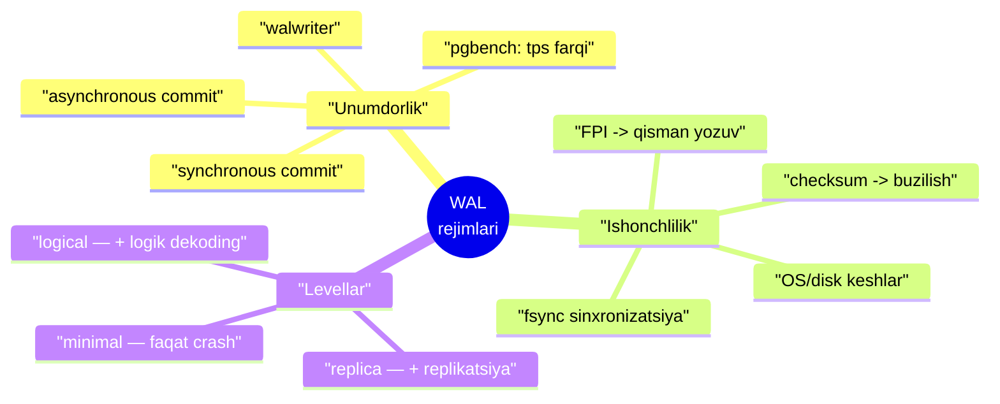
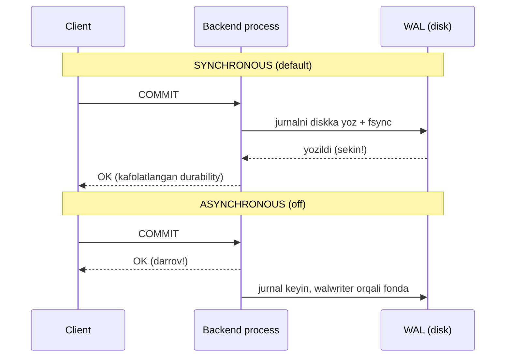
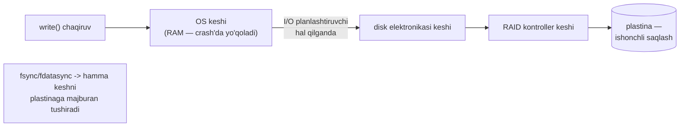
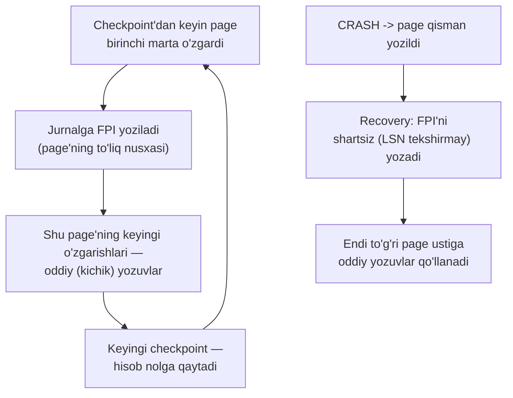
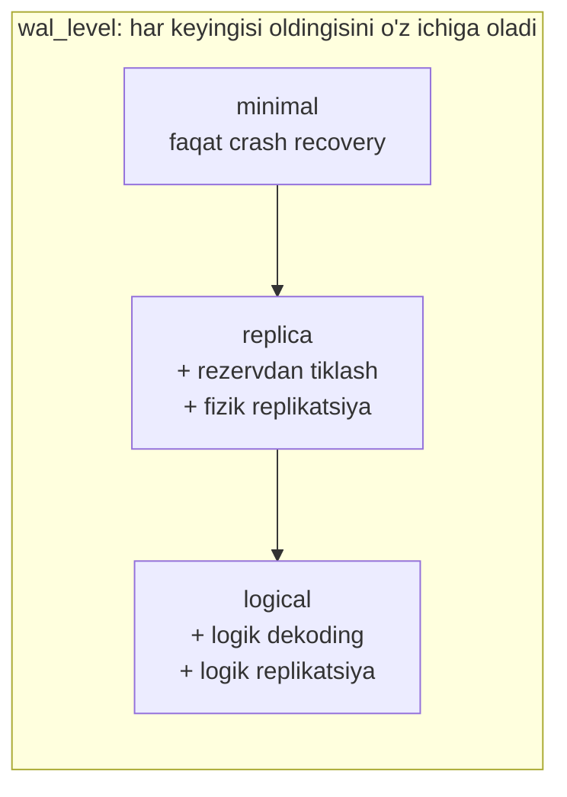

# 11. WAL rejimlari

> 📖 Manba: Рогов, "PostgreSQL 17 изнутри", 11-bob ("Режимы журнала")

## Nima uchun kerak?

10-darsda **WAL** mexanizmini o'rgandik: har o'zgarish avval jurnalga yoziladi, shu tufayli crash'dan keyin ma'lumotni tiklash mumkin. Lekin bitta savolga javob bermadik:

> `COMMIT` bosganingizda, transaction "muvaffaqiyatli" degan javob **qachon** qaytadi — jurnal diskka **fizik yozilgach**mi, yoki **darrov**mi?

Bu savol arzimasdek ko'rinadi, lekin u **ishonchlilik va tezlik** orasidagi eng muhim savdolashuv (trade-off). Diskka fizik yozuv **sekin** (millisekundlar). Agar har `COMMIT` shu yozuvni kutsa — tizim ishonchli, lekin sekin. Agar kutmasa — tez, lekin crash'da oxirgi bir necha transaction **yo'qolishi** mumkin.

Bu darsda uch mavzuni ochamiz:

1. **synchronous vs asynchronous commit** — `COMMIT` jurnalni kutadimi yoki yo'q, va bu tezlikka qanday ta'sir qiladi (pgbench bilan o'lchaymiz).
2. **Ishonchlilik** — OS va disk keshlari WAL'ni qanday aldashi mumkin (`fsync`), ma'lumot buzilishini **checksum** qanday ushlaydi, va nega **full page image** kerak.
3. **WAL levellari** — `minimal`, `replica`, `logical`: jurnalga qancha ma'lumot yoziladi, faqat crash recovery kerakmi yoki replikatsiya ham.



---

## 11.1. Unumdorlik (performance): synchronous vs asynchronous

Server ishlaganda WAL fayllariga doimiy, lekin **ketma-ket** yozuv boradi. Tasodifiy murojaat deyarli yo'q, shuning uchun HDD ham uddalaydi. Yozuv xarakteri data fayllaridagidan farq qilgani uchun **jurnalni alohida fizik diskka** joylashtirish foydali bo'lishi mumkin (`PGDATA/pg_wal` o'rniga symbolic link).

Jurnalga yozuv **ikki rejimdan birida** sodir bo'ladi:

- **synchronous** (sinxron) — transaction fiksatsiyasida, shu transaction'ning **hamma jurnal yozuvi diskka tushmaguncha**, ish davom eta olmaydi;
- **asynchronous** (asinxron) — transaction **darrov** tugaydi, jurnal esa **fonda** yoziladi.

Rejim `synchronous_commit` parametri bilan o'rnatiladi (default **on**).



### Synchronous rejim (default)

Fiksatsiya faktini ishonchli saqlash uchun jurnal yozuvini OS'ga uzatish **yetarli emas** — ularni disk bilan **sinxronizatsiya** qilish kerak (pastda "keshlar" bo'limida sababini ko'ramiz). Sinxronizatsiya haqiqiy (ya'ni sekin) I/O bilan bog'liq, shuning uchun uni iloji boricha **kamroq** bajarish foydali.

Buning uchun transaction'ni tugatayotgan process kichik **pauza** qilishi mumkin (`commit_delay`, default **0**). Lekin bu faqat tizimda kamida `commit_siblings` (default **5**) ta aktiv transaction bo'lsa sodir bo'ladi: kutish vaqtida ulardan bir nechasi tugab, hammasining jurnalini **bir marta** sinxronizatsiya qilib bo'ladi.

> **Analogiya (lift eshigi):** `commit_delay` — bu liftda eshikni bir soniya ushlab turishga o'xshaydi, boshqa birov ham kirib ulgursin deb. Bir marta "yurish" (fsync) bilan bir necha transaction'ni saqlaysan. Default qiymatda pauza qilinmaydi; uni faqat ko'p qisqa OLTP transaction'li tizimlarda o'zgartirish mantiqiy.

Pauzadan keyin process to'plangan hamma jurnal yozuvini diskka tashlaydi va sinxronizatsiya qiladi. Shu momentdan transaction **ishonchli tugagan** hisoblanadi — **durability** (ACID'ning D harfi) kafolatlanadi. Aynan shu sabab synchronous rejim **default**.

Salbiy tomoni: sinxron yozuv **javob vaqtini** (latency) oshiradi (`COMMIT` sinxronizatsiya tugamaguncha qaytmaydi) va tizim unumdorligini kamaytiradi, ayniqsa OLTP'da.

### Asynchronous rejim

Asinxron yozuvni `synchronous_commit = off` bilan olamiz. Bu rejimda jurnal yozuvlarini **walwriter** process tashlaydi, ish sikllarini kutish bilan navbatlashtirib. Pauza `wal_writer_delay` (default **200ms**) bilan beriladi.

Pauzadan keyin uyg'onib, walwriter keshda yangi **to'liq to'lgan** WAL page'lari paydo bo'lganini tekshiradi. Bo'lsa — ularni diskka yozadi, joriy (to'lmagan) page'ni e'tiborsiz qoldirib. Agar oxirgi safardan beri birorta ham page to'lmagan bo'lsa — baribir uyg'ongani uchun joriy to'lmagan page'ni yozadi.

> **Nega bunday algoritm?** Maqsad — bitta page'ni bir necha marta **qayta yozmaslik** (bu katta o'zgarish oqimida muhim). To'lmagan page tez-tez o'zgaradi, shuning uchun uni oxirigacha kutish tejamli.

Sinxronizatsiya har `wal_writer_flush_after` (default **1 MB**) megabaytda va sikl oxirida bir marta bo'ladi.

Asinxron yozuv sinxrondan **tezroq** — fiksatsiya fizik yozuvni kutmaydi. Lekin ishonchlilik pasayadi:

> **Asosiy xavf:** crash'da fiksatsiya qilingan ma'lumot **yo'qolishi mumkin**, agar fiksatsiyadan keyin `3 × wal_writer_delay` dan kam vaqt o'tgan bo'lsa (default sozlamada bu **0.6 soniya**).

### Ikki rejim bir-birini to'ldiradi

Amalda rejimlar **birga** ishlaydi. Sinxron fiksatsiyada ham uzun transaction'ning jurnal yozuvlari WAL buferlarini bo'shatish uchun **asinxron** yozilishi mumkin. Va aksincha: buffer cache'dan page tashlanayotganda uning jurnal yozuvi hali diskda bo'lmasa, u **asinxron rejimda ham darhol** tashlanadi (write-ahead qoidasi buzilmasligi uchun).

> **Nozik imkoniyat:** `synchronous_commit` ni **alohida transaction** uchun ham o'rnatsa bo'ladi. Agar dastur transaction'larni kritik (masalan, moliyaviy) va kam muhim (masalan, log yozish) ga ajratsa — faqat **kam muhim** qismning ishonchliligini qurbon qilib, unumdorlikni oshirish mumkin.

### Eksperiment: pgbench bilan o'lchash

Standart `pgbench` testida ikki rejimni solishtiramiz. Avval **sinxron** rejimda 30 soniyalik test:

```
postgres$ pgbench -i internals
postgres$ pgbench -T 30 internals
...
number of transactions actually processed: 7505
latency average = 3.998 ms
tps = 250.132807
```

Endi **asinxron** rejimga o'tib, xuddi shu testni takrorlaymiz:

```sql
=> ALTER SYSTEM SET synchronous_commit = off;
=> SELECT pg_reload_conf();
```

```
postgres$ pgbench -T 30 internals
...
number of transactions actually processed: 81500
latency average = 0.368 ms
tps = 2716.737845
```

| Ko'rsatkich | Synchronous | Asynchronous |
|---|---|---|
| Transaction soni (30s) | 7 505 | **81 500** |
| Latency (o'rtacha) | 3.998 ms | **0.368 ms** |
| TPS | 250 | **2716** |

Asinxron fiksatsiyada latency **keskin kamaydi**, tps **10 baravardan ko'p oshdi**. Albatta, har bir tizimda nisbat boshqacha bo'ladi, lekin qisqa OLTP transaction'larda effekt juda sezilarli. Testdan keyin default'ni tiklaymiz:

```sql
=> ALTER SYSTEM RESET synchronous_commit;
=> SELECT pg_reload_conf();
```

---

## 11.2. Ishonchlilik

WAL mexanizmi **istalgan holatda** (albatta, disk fizik buzilmagan bo'lsa) crash'dan tiklashni kafolatlashi kerak. Muvofiqlikka ko'p omil ta'sir qiladi, eng muhimlari: **keshlash**, **ma'lumot buzilishi** va **yozuvning atomar emasligi**.

### Keshlash — WAL nega fsync qiladi

Ma'lumot energiya-bog'liq bo'lmagan xotiragacha (masalan, qattiq disk plastinasi) borguncha **ko'p kesh** orqali o'tadi:



Diskka yozish system call (`write`) faqat OS'ni ma'lumotni **o'z keshiga** ko'chirishga majbur qiladi (bu kesh ham RAM'da, crash'da yo'qoladi). Haqiqiy yozuv **asinxron** sodir bo'ladi. Keyin ma'lumot disk keshiga, RAID kontroller keshiga tushadi — har biri yozuvni yana kechiktirishi mumkin.

Maxsus chora ko'rilmasa, ma'lumot **qachon ishonchli saqlanishi noma'lum**. Odatda bu muhim emas (WAL bor), lekin **jurnal yozuvlari darhol ishonchli saqlanishi shart**. Bu asinxron rejimda ham to'g'ri — aks holda WAL yozuvi o'zgargan ma'lumotdan oldin diskka tushishini kafolatlab bo'lmaydi.

OS'lar **darhol yozish**ni kafolatlash uchun vositalar beradi. Ular ikki asosiyga keladi: yozuvdan keyin **alohida sinxronizatsiya buyrug'i** (`fsync`, `fdatasync`), yoki faylni ochishda darhol yozuv talabi ko'rsatiladi. Usul `wal_sync_method` parametrida ko'rsatiladi; eng mos usulni tanlash uchun **`pg_test_fsync`** utilitasi yordam beradi.

> **Nozik nuqta:** usulni tanlashda apparatni hisobga olish kerak. Masalan, zaxira batareyali kontroller bo'lsa — uning keshini ishlatmaslikning ma'nosi yo'q, chunki batareya tok o'chganda ma'lumotni saqlab qoladi.

> **Muhim farq:** asinxron fiksatsiya va sinxronizatsiyani **butunlay o'chirish** — **printsipial** farqli narsalar. Sinxronizatsiyani o'chirish (`fsync = off`) tizimni yanada tezlashtiradi, lekin **istalgan crash'da hamma ma'lumot butunlay yo'qoladi**. Asinxron rejim esa muvofiq holatga tiklashni **kafolatlaydi** — faqat oxirgi bir necha transaction yo'qolishi mumkin. `fsync = off` ni deyarli hech qachon ishlatmang.

### Ma'lumot buzilishi — checksum

Apparat mukammal emas: ma'lumot xotirada yoki tashuvchida buzilishi, kabel orqali uzatishda o'zgarishi mumkin. Bir qism xato apparat darajasida ushlanadi, bir qismi — yo'q.

Muammoni o'z vaqtida aniqlash uchun jurnal yozuvlari **doim checksum** (nazorat summasi) bilan ta'minlanadi. Data page'larni ham checksum bilan himoyalash mumkin — klaster initsializatsiyasida yoki **`pg_checksums`** utilitasi bilan (server to'xtatilganda).

> **Production'da checksum majburiy yoqilishi kerak** — hisoblash xarajati arzimas, lekin crash'ni o'z vaqtida aniqlash imkoni katta. Lekin to'liq kafolat bermaydi:
> - checksum faqat page'ga **murojaatda** tekshiriladi — buzilish uzoq sezilmay, hatto hamma rezerv nusxaga tushishi mumkin;
> - **nollar** bilan to'lgan page to'g'ri hisoblanadi — fayl tizimi faylni "nol"lab yuborsa, tekshiruv ushlamaydi;
> - checksum faqat relation'ning **asosiy qatlamini** himoyalaydi — clog kabi boshqa fayllar himoyasiz.

Checksum yoqilganini tekshiramiz (`data_checksums` faqat o'qish uchun):

```sql
=> SHOW data_checksums;
 data_checksums
----------------
 on
(1 row)
```

#### Eksperiment: page'ni buzib checksum'ni sinash

Serverni to'xtatib, table asosiy qatlamining nol page'ida bir necha baytni nol'laymiz:

```sql
=> SELECT pg_relation_filepath('wal');
 pg_relation_filepath
----------------------
 base/16391/16572
(1 row)
```

```
postgres$ pg_ctl stop
postgres$ dd if=/dev/zero of=/usr/local/pgsql/data/base/16391/16572 \
          oflag=dsync conv=notrunc bs=1 count=8
8 bytes copied
postgres$ pg_ctl start -l /home/postgres/logfile
```

Endi table'ni o'qishga urinamiz:

```sql
=> SELECT * FROM wal LIMIT 1;
WARNING:  page verification failed, calculated checksum 59576 but expected 64167
ERROR:  invalid page in block 0 of relation base/16391/16572
```

Checksum mos kelmadi — page **buzilgan** deb rad etildi. Agar ma'lumotni rezerv nusxadan tiklab bo'lmasa, hech bo'lmasa buzilgan page'ni o'qishga urinib ko'rish mumkin (albatta, buzilgan ma'lumot olish xavfi bilan) — buning uchun `ignore_checksum_failure`:

```sql
=> SET ignore_checksum_failure = on;
=> SELECT * FROM wal LIMIT 1;
WARNING:  page verification failed, calculated checksum 59576 but expected 64167
 id
----
  2
(1 row)
```

Bu safar hammasi o'tdi, chunki biz page header'ning **kritik bo'lmagan** qismini (oxirgi jurnal yozuvi LSN'i) buzdik, ma'lumotning o'zini emas.

### Yozuvning atomar emasligi — full page image (FPI)

Baza page'i odatda **8 KB**, past darajada esa yozuv ko'pincha kichikroq bloklar bilan boradi (odatda **512 bayt** yoki **4 KB**). Shuning uchun crash'da page **qisman** yozilib qolishi mumkin — bir qismi yangi, bir qismi eski.

Bunday **buzilgan** page'ga oddiy jurnal yozuvlarini qo'llash **ma'nosiz** (yozuvlar butun, to'g'ri page'ga mo'ljallangan).

Qisman yozuvdan himoya uchun PostgreSQL checkpoint'dan keyin page **birinchi marta o'zgarganda** jurnalga uning **to'liq nusxasini** — **full page image (FPI)** — saqlaydi. Buni `full_page_writes` parametri (default **on**) boshqaradi.



Recovery jurnalda FPI'ga duch kelsa, uni **shartsiz** (LSN tekshirmay) diskka yozadi — chunki u ham har qanday jurnal yozuvi kabi checksum bilan himoyalangan va sezdirmay buzila olmaydi. Va shu **kafolatlangan to'g'ri** obraz ustiga oddiy yozuvlar qo'llanadi.

> **Diqqat:** checksum yoqilgan bo'lsa (yoki `wal_log_hints = on`), **hint bit** (5-6 darslardagi maslahat bitlari) birinchi o'zgarishi ham FPI yozdiradi — `full_page_writes` qiymatidan qat'i nazar. Sababi: har qanday bit o'zgarishi checksum'ni o'zgartiradi.

#### Eksperiment: FPI jurnalning katta qismini egallaydi

FPI'lar jurnal hajmini **sezilarli oshiradi**. `pgbench` bilan o'lchaymiz. Checkpoint qilib, darrov 20000 transaction ishga tushiramiz:

```sql
=> CHECKPOINT;
=> SELECT pg_current_wal_insert_lsn();  -- 2/8292A718
```

```
postgres$ pgbench -t 20000 internals
```

```sql
=> SELECT pg_current_wal_insert_lsn();  -- 2/8439C720
=> SELECT pg_size_pretty('2/8439C720'::pg_lsn - '2/8292A718'::pg_lsn);
 pg_size_pretty
----------------
 26 MB
(1 row)
```

`pg_waldump --stats` bilan hajmni resource turlariga bo'lib ko'ramiz. `FPI size` ustuni FPI hajmini beradi:

```
Type         N          Record size (%)     FPI size (%)
XLOG         1832       89768 ( 1.07)       14727824 (77.71)
Heap2        26885      1692836 (20.14)     3536904 (18.66)
Heap         80134      5935665 (70.61)     175164 ( 0.92)
...
Total        128981     8406279 [30.73%]    18951932 [69.27%]
```

> FPI'lar generatsiya qilingan jurnalning **69%** ini egallaydi! Bu — checkpoint'larni **juda tez-tez qilmaslik**ning yana bir sababi: page'lar checkpoint'lar orasida bir necha marta o'zgarsa, FPI ulushi kamayadi.

#### WAL siqish (compression)

FPI'lar hajmini **siqish** bilan ancha kamaytirish mumkin — `wal_compression` parametri (default **off**). Xuddi shu testni siqish yoqib takrorlaymiz:

```sql
=> ALTER SYSTEM SET wal_compression = on;  -- yoki pglz
=> SELECT pg_reload_conf();
=> CHECKPOINT;
```

Natijada o'sha 20000 transaction jurnali **26 MB o'rniga 11 MB** bo'ldi. Zstandard yanada yaxshiroq — **9870 kB**:

| Rejim | Jurnal hajmi (20000 tx) |
|---|---|
| Siqishsiz | 26 MB |
| `pglz` / `on` | 11 MB |
| `zstd` | 9870 kB |

An'anaviy **PGLZ** dan tashqari (v15) yana ikkitasi bor: **LZ4** (kam protsessor, taxminan bir xil siqish) va **Zstandard** (protsessorni ko'proq yuklaydi, lekin yaxshiroq siqadi).

> **Xulosa:** FPI'lar ko'p bo'lganda (checksum yoki `full_page_writes` tufayli — ya'ni **deyarli har doim**) `wal_compression` yoqish mantiqiy. Algoritm tanlash — protsessor yuki va jurnal hajmi orasida murosa.

---

## 11.3. WAL levellari

WAL'ning **asosiy** vazifasi — crash'dan tiklash. Lekin jurnalni boshqa vazifalarga ham ishlatish mumkin, unga **qo'shimcha yozuvlar** kiritib. Uch **level** bor: **minimal**, **replica**, **logical**. Har keyingi level oldingisining hammasini o'z ichiga oladi va yangi ma'lumot qo'shadi.

Level `wal_level` parametri bilan beriladi (default **replica**); o'zgartirish **serverni qayta ishga tushirishni** talab qiladi.



### Minimal

Boshlang'ich **minimal** level faqat **crash'dan tiklashni** kafolatlaydi. Joy tejash uchun **joriy transaction'da yaratilgan yoki bo'shatilgan** relation'lar bilan amallar jurnalga **yozilmaydi**, agar ular katta hajm qo'yish bilan bog'liq bo'lsa (masalan, `CREATE TABLE AS SELECT`, `CREATE INDEX`). Jurnallash o'rniga kerakli ma'lumot **darhol diskka** tashlanadi.

Mantiq oddiy: crash amal davomida bo'lsa — diskka yozilgan ma'lumot **ko'rinmas** qoladi va muvofiqlikni buzmaydi. Crash amal tugagach bo'lsa — keyingi yozuvlarni qo'llash uchun kerakli ma'lumot allaqachon diskda. Optimizatsiya ishga tushishi uchun kerakli hajm `wal_skip_threshold` (default **2 MB**) bilan beriladi.

#### Eksperiment: minimal levelda nima jurnalga tushadi

```sql
=> ALTER SYSTEM SET wal_level = minimal;
=> ALTER SYSTEM SET max_wal_senders = 0;
```

(minimal uchun `max_wal_senders` ni ham nol'lash kerak — u walsender process'lar sonini belgilaydi.) Server qayta ishga tushiriladi. Pozitsiyani eslab, `TRUNCATE` + katta `INSERT` qilamiz (bitta transaction'da, `wal_skip_threshold` dan oshib):

```sql
=> BEGIN;
=> TRUNCATE TABLE wal;
=> INSERT INTO wal SELECT id FROM generate_series(1,100_000) id;
=> COMMIT;
```

Jurnal mazmunini `pg_walinspect` bilan ko'ramiz:

```sql
=> SELECT start_lsn, resource_manager AS rmgr, record_type,
     (regexp_match(block_ref, '[0-9]+\/[0-9]+\/[0-9]+'))[1] AS rel
   FROM pg_get_wal_records_info('2/857D9460','FFFFFFFF/FFFFFFFF');
   start_lsn  |    rmgr     | record_type |       rel
--------------+-------------+-------------+-----------------
 2/857D9460   | Storage     | CREATE      |
 2/857D9490   | Heap        | UPDATE      | 1663/16391/1259
 2/857D9510   | Btree       | INSERT_LEAF | 1663/16391/2662
 2/857D9550   | Btree       | INSERT_LEAF | 1663/16391/2663
 2/857D9590   | Btree       | INSERT_LEAF | 1663/16391/3455
 2/857D95D0   | Transaction | COMMIT      |
(6 rows)
```

- **CREATE** — yangi fayl yaratilishi (`TRUNCATE` table'ni fizik qayta yozadi);
- keyingi yozuvlar — **system catalog** o'zgarishi (`pg_class` UPDATE va uch indexga INSERT_LEAF);
- oxirida **COMMIT**.

> **Diqqat:** 100 000 row'ning table'ga **qo'yilishi jurnalga umuman tushmadi!** Aynan shu — minimal level tejamkorligi. Lekin bu yozuvlar replikaga uzatilmaydi va rezervdan tiklashda takrorlanmaydi.

### Replica

Rezerv nusxadan tiklashda arxivlangan jurnal yozuvlari ishlatilishi mumkin — nafaqat muvofiqlikni tiklash, balki ma'lumotni **maqsad nuqtaga** yetkazish uchun. Bunday yozuvlar juda ko'p bo'lishi mumkin (bir necha kunlik), ya'ni tiklash davri bitta emas, **ko'p checkpoint**'ni qamraydi.

> Shuning uchun minimal yetarli emas: **jurnallanmagan amalni takrorlab bo'lmaydi**. Rezervdan tiklash va replikatsiya uchun jurnalga **hamma amal** tushishi kerak.

Bundan tashqari, agar replika **so'rovlarni bajarish** uchun ishlatilsa, yana ikki narsa kerak: asosiy serverdagi **exclusive locklar** haqida ma'lumot (replikadagi so'rovlar bilan konflikt qilishi mumkin — 12-dars) va **snapshot** qurish uchun aktiv transaction'lar ma'lumoti (4-dars). Bu ma'lumotni replikaga yetkazishning yagona yo'li — uni davriy jurnalga yozish (bg writer har 15 soniyada bajaradi).

Rezervdan tiklash va **fizik replikatsiya** aynan **replica** levelida kafolatlanadi — bu **default** level. Xuddi shu eksperimentni takrorlaymiz (endi bitta row bilan):

```sql
=> BEGIN;
=> TRUNCATE TABLE wal;
=> INSERT INTO wal VALUES (42);
=> COMMIT;
```

```sql
=> SELECT start_lsn, resource_manager AS rmgr, record_type, ... rel
   FROM pg_get_wal_records_info('2/85DFA8B8','FFFFFFFF/FFFFFFFF');
   start_lsn  |    rmgr     |  record_type  |       rel
--------------+-------------+---------------+------------------
 2/85DFA8B8   | Standby     | LOCK          |
 2/85DFA8E8   | Storage     | CREATE        |
 2/85DFA918   | Heap        | UPDATE        | 1663/16391/1259
 ...          | Btree       | INSERT_LEAF   | ...
 2/85DFAA58   | Heap        | INSERT+INIT   | 1663/16391/24797
 2/85DFAA98   | Standby     | LOCK          |
 2/85DFAAC8   | Standby     | RUNNING_XACTS |
 2/85DFAB00   | Transaction | COMMIT        |
(10 rows)
```

minimal levelga qo'shimcha paydo bo'ldi:

- **Standby** resource manager yozuvlari (replikatsiya bilan bog'liq): **LOCK** (locklar) va **RUNNING_XACTS** (aktiv transaction'lar);
- **INSERT+INIT** — yangi page initsializatsiyasi va unga row qo'yish (endi qo'yish **jurnalga tushdi** — minimaldan farqli).

### Logical

Maksimal **logical** level **logik dekoding** va **logik replikatsiyani** ta'minlaydi. U nashr etuvchi (publishing) serverda yoqilishi kerak.

Jurnal yozuvlari nuqtai nazaridan bu level replica'dan deyarli farq qilmaydi — mavjud yozuvlarga **row identifikatorlari** qo'shiladi; replikatsiya manbalari va kesh bekor qilinishi bilan bog'liq yozuvlar, hamda dastur qo'shadigan ixtiyoriy logik yozuvlar paydo bo'ladi. Asosan logik dekoding **RUNNING_XACTS** ga (aktiv transaction'lar) tayanadi, chunki u system catalog o'zgarishlarini kuzatish uchun snapshot qurishi kerak.

### Levellar taqqoslash

| Level | Nima qo'shadi | Nima uchun |
|---|---|---|
| **minimal** | faqat crash recovery yozuvlari; katta INSERT'lar jurnalga tushmaydi | eng tejamli; replikatsiya/rezerv **yo'q** |
| **replica** | hamma amal + Standby (LOCK, RUNNING_XACTS) + INSERT+INIT | rezervdan tiklash, fizik replikatsiya (**default**) |
| **logical** | + row identifikatorlari, logik yozuvlar | logik dekoding, logik replikatsiya |

---

## Xulosa

- `COMMIT` jurnalni diskka fizik yozuvni kutadimi — buni **`synchronous_commit`** hal qiladi. **synchronous** (default): kutadi, **durability** kafolatlangan. **asynchronous** (`off`): darrov qaytadi, jurnal fonda **walwriter** orqali yoziladi.
- Asinxron rejim **ancha tezroq** (pgbench'da tps 250 → 2716), lekin crash'da oxirgi `~0.6s` transaction **yo'qolishi** mumkin. Uni transaction darajasida ham qo'yish mumkin (kam muhim transaction'lar uchun).
- Ma'lumot diskkacha **ko'p kesh** (OS, disk, RAID) orqali o'tadi — shu sabab WAL yozuvi **`fsync`** bilan majburan plastinaga tushiriladi. `fsync = off` — istalgan crash'da **hamma ma'lumot yo'qoladi**, ishlatmang.
- Asinxron commit va `fsync = off` — **printsipial farqli**: birinchisi muvofiqlikni kafolatlaydi (faqat oxirgi transaction'lar yo'qoladi), ikkinchisi — umuman kafolatlamaydi.
- **checksum** (`data_checksums`) page buzilishini ushlaydi — production'da majburiy. Lekin faqat murojaatda tekshiriladi, nol page'ni va boshqa qatlamlarni himoyalamaydi.
- Page **8 KB**, disk bloki kichikroq — crash'da **qisman yozuv** bo'lishi mumkin. Undan **full page image (FPI)** himoyalaydi: checkpoint'dan keyin page birinchi o'zgarganda to'liq nusxasi jurnalga yoziladi.
- FPI'lar jurnalning katta qismini (misolda **69%**) egallaydi — checkpoint'larni tez-tez qilmang. **`wal_compression`** (pglz/lz4/zstd) hajmni ancha kamaytiradi.
- **wal_level**: **minimal** (faqat crash, katta INSERT'lar jurnalga tushmaydi), **replica** (default, rezerv + fizik replikatsiya), **logical** (+ logik dekoding). Har keyingisi oldingisini o'z ichiga oladi.

## Nazorat savollari

1. `synchronous_commit = on` va `off` orasidagi farq nimada? Har bir rejimda `COMMIT` javobi qachon qaytadi va durability qanday ta'sirlanadi?
2. Asinxron rejimda crash bo'lsa nima yo'qolishi mumkin va qancha vaqtlik? Bu qaysi parametr(lar)ga bog'liq?
3. `commit_delay` va `commit_siblings` nima uchun kerak? "Lift eshigi" analogiyasi bilan tushuntiring. Nega default'da pauza qilinmaydi?
4. Ma'lumot diskka borguncha qanday keshlardan o'tadi? Nega WAL yozuvi uchun oddiy `write()` yetarli emas va `fsync` kerak?
5. Asinxron commit va `fsync = off` — nega bu ikkisi printsipial farqli? Har birida crash'da nima bo'ladi?
6. Data checksum qanday himoya beradi va qaysi uch holatda **himoya qilmaydi**? `ignore_checksum_failure` qachon foydali?
7. "Yozuvning atomar emasligi" nima muammo? Full page image (FPI) uni qanday hal qiladi va nega FPI recovery'da LSN tekshirmasdan qo'llanadi?
8. Nima uchun checkpoint'larni tez-tez bajarish jurnal hajmini oshiradi (FPI bilan bog'lang)? `wal_compression` qanday yordam beradi?
9. `minimal`, `replica`, `logical` levellari qanday farq qiladi? minimal levelda `TRUNCATE` + katta `INSERT` da nima jurnalga tushmaydi va nega bu xavfsiz?
10. `replica` levelda `minimal` ga qo'shimcha qanday yozuvlar paydo bo'ladi (Standby, INSERT+INIT) va ular nima uchun kerak?
