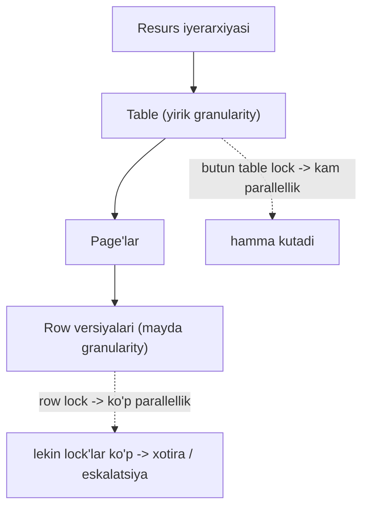
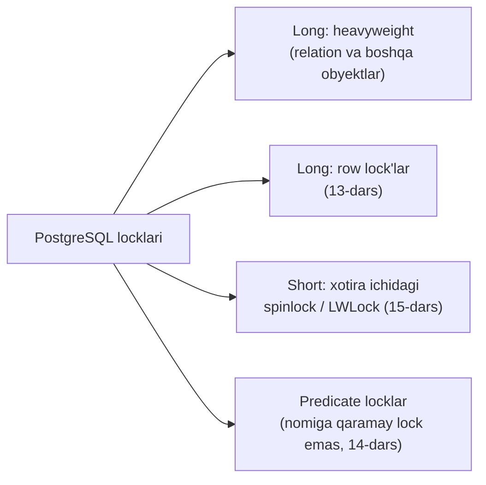
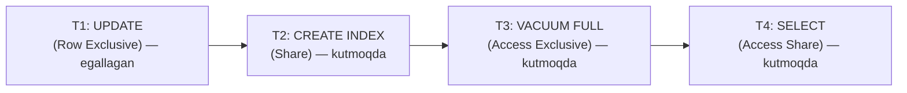

# 12. Relation locklar

> 📖 Manba: Рогов, "PostgreSQL 17 изнутри", 12-bob ("Блокировки отношений")

## Nima uchun kerak?

2-darsda **isolation**'ni o'rgandik va u yerda muhim g'oyani ko'rdik: PostgreSQL o'quvchi va yozuvchi transaction'larni bir-biridan **snapshot** (ma'lumot surati) orqali ajratadi. Shu sabab `SELECT` hech kimni bloklamaydi, `UPDATE` esa `SELECT`'ni bloklamaydi. Bu — ajoyib, lekin savol tug'iladi:

- Agar ikkita transaction **bir vaqtda bir xil row'ni** o'zgartirmoqchi bo'lsa nima bo'ladi?
- Agar biri `DROP TABLE accounts` qilayotganda, ikkinchisi shu table'dan `SELECT` qilsa-chi?

Snapshot bu holatlarni hal qilmaydi. Kimdir baribir **navbatga turishi**, kimdir kutishi kerak. Aynan shu ish uchun PostgreSQL'da **lock**'lar (qulflar) mavjud.

> **Lock** (lock, qulf) — bu bir necha jarayonning umumiy resursga (shared resource) bir vaqtda murojaatini **tartibga soluvchi** mexanizm. Resursga tegishdan oldin jarayon lock'ni **egallaydi** (acquire), ish tugagach uni **bo'shatadi** (release).

Bu darsda locklarning umumiy tuzilishini, eng «og'ir» (heavyweight) turini — **relation lock**'larni — va ular navbatga qanday tizilishini ko'ramiz. Keyingi darslarda esa row lock'lar (13-dars), boshqa obyekt locklari (14-dars) va xotira ichidagi locklar (15-dars) bo'ladi.

```mermaid
mindmap
  root(("Locklar"))
    "Umumiy tushuncha"
      "granularity"
      "rejimlar / compatibility"
      "long vs short"
    "Heavyweight locklar"
      "pg_locks"
      "max_locks_per_transaction"
      "deadlock aniqlash"
    "Transaction ID lock"
      "virtualxid"
      "transactionid"
    "Relation lock (8 rejim)"
      "SELECT -> Access Share"
      "UPDATE -> Row Exclusive"
      "DROP -> Access Exclusive"
    "Kutish navbati"
      "fair queue"
      "pg_blocking_pids"
      "log_lock_waits"
```

---

## 1-qism. Lock nima va u qanday ishlaydi?

### Konkurent murojaat va lock'ning zarurati

**Konkurent murojaat** (concurrent access) — bu bir resursga bir necha jarayonning bir vaqtda murojaat qilishi. Jarayonlar apparat imkon bersa **parallel**, aks holda vaqtni bo'lishib **ketma-ket** ishlashi mumkin — bu farq qilmaydi.

> Muhim: **agar konkurensiya bo'lmasa, lock ham kerak emas.** Masalan, umumiy **buffer cache** (9-dars) lock talab qiladi, chunki uni hamma backend'lar baham ko'radi; lekin har bir backend'ning **lokal** xotirasi lock'siz ishlaydi.

Past darajada lock — bu **umumiy xotiradagi** (shared memory) kichik uchastka bo'lib, unda lock'ning holati (bo'shmi yoki egallanganmi) va ba'zan qo'shimcha ma'lumot (qaysi jarayon egallagani, qachon) belgilab qo'yiladi.

### Ikkita muhim omil: granularity va rejimlar

Lock'lar samaradorligiga ikkita narsa kuchli ta'sir qiladi.

**1) Granularity** (granularity — detallashtirish darajasi). Resurslar **iyerarxiya** hosil qilganda muhim bo'ladi. Masalan: table → page'lardan iborat → page'lar row versiyalarini saqlaydi.

- Agar **butun table**'ni bloklasak (yirik granularity), turli page yoki row bilan ishlayotgan jarayonlar ham bir vaqtda ishlay olmaydi.
- Agar **alohida row**'larni bloklasak (mayda granularity), bu kamchilik yo'q, lekin lock'lar soni juda ko'payadi. Ular haddan tashqari xotira egallamasligi uchun **eskalatsiya** (uroven oshirish) qo'llaniladi: mayda lock'lar soni chegaradan oshsa, ular bitta yirikroq lock bilan almashtiriladi.

**2) Rejimlar to'plami** (lock modes). Ko'pincha ikki rejim ishlatiladi:

| Rejim | Ma'nosi | Kim bilan mos |
|-------|---------|---------------|
| **Shared** (razdelyaemyy) | o'qish uchun | boshqa shared bilan mos |
| **Exclusive** (isklyuchitelnyy) | o'zgartirish uchun | hech kim bilan, hatto o'zi bilan ham mos emas |

Rejimlar ko'proq ham bo'lishi mumkin. **Rejim nomlari muhim emas — muhimi ularning bir-biriga «moslik matritsasi»** (compatibility matrix). Granularity qancha mayda va mos rejimlar qancha ko'p bo'lsa, parallellik shuncha yaxshi.



### Long va short locklar

Lock'larni **ishlatilish vaqti** bo'yicha ikkiga bo'lish mumkin:

| | **Long (uzoq) lock** | **Short (qisqa) lock** |
|---|---|---|
| Qancha ushlab turiladi | odatda **transaction oxirigacha** | soniyaning ulushi (bir necha instruksiya) |
| Qanday resurslarni himoya qiladi | relation'lar, row'lar | xotiradagi strukturalar |
| Rejimlar soni | ko'p | minimal |
| Infratuzilma | boy: kutish navbati, deadlock aniqlash, monitoring | sodda, ba'zan monitoring ham yo'q |
| Bu darsda | **ha (heavyweight)** | 15-dars |

Long lock'lar uchun boy infratuzilma **arziydi**, chunki himoyalanadigan ma'lumot ustidagi amallarning narxi bu vositalar narxidan ancha katta.

### PostgreSQL'dagi lock turlari



- **Heavyweight** («og'ir») lock'lar — long turga kiradi, **obyekt darajasida** o'rnatiladi (birinchi navbatda relation'lar). Bu dars aynan shular haqida.
- **Row lock'lar** alohida ajratiladi (13-dars).
- **Short** lock'lar — xotira strukturalarini himoya qiladi (15-dars).
- **Predicate lock'lar** — nomiga qaramay hech nimani bloklamaydi; ular SSI uchun bog'liqliklarni kuzatadi (14-dars).

---

## 2-qism. Heavyweight (og'ir) locklar

Heavyweight lock'lar **obyekt darajasida** o'rnatiladi — asosan relation'lar (table, index), lekin boshqa obyektlar uchun ham. Odatda «lock» so'zi aniqlik kiritilmasa, aynan shu **og'ir** lock'lar nazarda tutiladi.

Ular server'ning **umumiy xotirasida** joylashadi va `pg_locks` view'ida ko'rinadi. Ularning umumiy soni ikki server parametri **ko'paytmasi** bilan cheklangan:

> **Parametr:** `max_locks_per_transaction` (default **64**) × `max_connections` (default **100**) = umumiy lock pool hajmi.

Muhim nozikliklar:

- Bu **pool barcha transaction'lar uchun umumiy** — ya'ni bitta transaction `max_locks_per_transaction`'dan **ko'proq** lock egallashi mumkin. Faqat tizimdagi **umumiy** lock soni chegaradan oshmasligi kerak.
- Pool server ishga tushganda yaratiladi, shuning uchun bu ikki parametrni o'zgartirish **server'ni qayta ishga tushirishni** (restart) talab qiladi.

Agar resurs allaqachon **mos kelmaydigan rejimda** bloklangan bo'lsa, lock egallamoqchi bo'lgan jarayon **navbatga** qo'yiladi. Kutayotgan jarayonlar **protsessor vaqtini sarflamaydi**: ular uxlaydi va resurs bo'shaganda operatsion tizim ularni uyg'otadi.

> **Deadlock (o'zaro qulflanish).** Bir transaction ikkinchisi egallagan resursni kutsa, ikkinchisi esa birinchisi egallagan resursni kutsa — ular **cheksiz** kutib qolar edi. PostgreSQL bunday holatlarni **avtomatik aniqlaydi** va transaction'lardan birini uzib tashlaydi (13-darsda batafsil).

### Heavyweight lock turlari (locktype)

`pg_locks.locktype` ustunidagi qiymatlar:

| locktype | Nima bloklanadi | Dars |
|----------|-----------------|------|
| `transactionid` / `virtualxid` | transaction raqami | shu dars, 3-qism |
| `relation` | relation (table, index) | shu dars, 4-qism |
| `tuple` | row versiyasi | 13-dars |
| `object` | relation bo'lmagan obyekt | 14-dars |
| `extend` | relation faylini kengaytirish | 14-dars |
| `page` | page (ba'zi index turlari) | 14-dars |
| `advisory` | rekomendatsion (foydalanuvchi) lock | 14-dars |

Amaliyotda deyarli barcha og'ir lock'lar **avtomatik** o'rnatiladi va transaction tugaganda avtomatik bo'shatiladi. Istisnolar bor: relation lock'larini `LOCK TABLE` bilan **aniq (explicit) so'rash** mumkin, advisory lock'lar esa **to'liq foydalanuvchi qo'lida** (14-dars).

---

## 3-qism. Transaction raqami lock'lari

Bu — eng oddiy, lekin fundamental lock turi.

> **Oltin qoida:** har bir transaction **doim o'z raqamining** (virtual raqamining, va agar bor bo'lsa — real raqamining) **exclusive** lock'ini ushlab turadi.

Bu nima uchun kerak? Chunki bir transaction ikkinchisining **tugashini kutmoqchi** bo'lsa, uning raqamining lock'ini so'raydi. Transaction o'z raqamining exclusive lock'ini ushlab turgani uchun, uni **olib bo'lmaydi** — so'rovchi jarayon navbatga turadi va uxlaydi. Transaction tugaganda lock bo'shaydi, kutayotgan jarayon uyg'onadi. Albatta, u so'ralgan lock'ni **ololmaydi** (resurs — transaction — endi yo'q), lekin bu **kerak ham emas**: maqsad tugashini kutish edi.

Ikki rejim: exclusive va shared. Matritsa juda sodda:

| | Shared | Exclusive |
|---|:---:|:---:|
| **Shared** | mos | ✗ |
| **Exclusive** | ✗ | ✗ |

Amalda ko'ramiz. Alohida seansda transaction boshlab, jarayon raqamini olamiz:

```sql
=> BEGIN;
=> SELECT pg_backend_pid();
 pg_backend_pid
----------------
          44244
(1 row)
```

Endigina boshlangan transaction o'z **virtual** raqamining exclusive lock'ini ushlaydi:

```sql
=> SELECT locktype, virtualxid, mode, granted
   FROM pg_locks WHERE pid = 44244;
  locktype  | virtualxid |     mode      | granted
------------+------------+---------------+---------
 virtualxid | 4/2        | ExclusiveLock | t
(1 row)
```

Bu yerda `locktype` — lock turi, `virtualxid` — virtual transaction raqami (resursni identifikatsiya qiladi), `mode` — rejim, `granted` — so'ralgan lock **olindimi** (t/f).

Transaction **real** raqam olsa (masalan, biror row'ni o'zgartirganda), uning lock'i ham ro'yxatga qo'shiladi:

```sql
=> SELECT pg_current_xact_id();
 pg_current_xact_id
--------------------
             149947
(1 row)

=> SELECT locktype, virtualxid, transactionid AS xid, mode, granted
   FROM pg_locks WHERE pid = 44244;
   locktype    | virtualxid |  xid   |     mode      | granted
---------------+------------+--------+---------------+---------
 virtualxid    | 4/2        |        | ExclusiveLock | t
 transactionid |            | 149947 | ExclusiveLock | t
(2 rows)
```

Endi transaction **ikkala** raqamining ham exclusive lock'ini ushlaydi.

---

## 4-qism. Relation lock'lari — 8 ta rejim

Relation'lar uchun **sakkizta** turli rejim aniqlangan. Bunday xilma-xillik — bir relation'ga tegishli **imkon qadar ko'p buyruq bir vaqtda** ishlashi uchun.

> **Kitobning maslahati:** bu rejimlarni yodlashga yoki nomlarida mantiq izlashga urinmang. Lekin matritsaga diqqat bilan qarab, umumiy xulosalar chiqarish va kerak bo'lganda unga murojaat qilish — albatta arziydi.

### Compatibility matrix (moslik matritsasi)

Rejimlar (eng zaifdan eng kuchligacha), qisqartma bilan:

| # | Rejim | Qisqartma | Tipik buyruq |
|---|-------|:---:|-------------|
| 1 | Access Share | AS | `SELECT` |
| 2 | Row Share | RS | `SELECT FOR UPDATE/SHARE` |
| 3 | Row Exclusive | RE | `INSERT`, `UPDATE`, `DELETE` |
| 4 | Share Update Exclusive | SUE | `VACUUM`, `ANALYZE`, `CREATE INDEX CONCURRENTLY` |
| 5 | Share | S | `CREATE INDEX` |
| 6 | Share Row Exclusive | SRE | `CREATE TRIGGER` |
| 7 | Exclusive | E | `REFRESH MATERIALIZED VIEW CONCURRENTLY` |
| 8 | Access Exclusive | AE | `DROP`, `TRUNCATE`, `VACUUM FULL`, `LOCK TABLE`, `REFRESH MATERIALIZED VIEW` |

Endi konfliktlar matritsasi (**✗** = ikki rejim bir-biriga **mos kelmaydi**, ya'ni bir vaqtda bo'la olmaydi):

| So'ralgan \ Mavjud | AS | RS | RE | SUE | S | SRE | E | AE |
|---|:---:|:---:|:---:|:---:|:---:|:---:|:---:|:---:|
| **AS** (SELECT) |  |  |  |  |  |  |  | ✗ |
| **RS** (SELECT FOR..) |  |  |  |  |  |  | ✗ | ✗ |
| **RE** (INSERT/UPDATE/DELETE) |  |  |  |  | ✗ | ✗ | ✗ | ✗ |
| **SUE** (VACUUM, CIC) |  |  |  | ✗ | ✗ | ✗ | ✗ | ✗ |
| **S** (CREATE INDEX) |  |  | ✗ | ✗ |  | ✗ | ✗ | ✗ |
| **SRE** (CREATE TRIGGER) |  |  | ✗ | ✗ | ✗ | ✗ | ✗ | ✗ |
| **E** (REFRESH MV CONC.) |  | ✗ | ✗ | ✗ | ✗ | ✗ | ✗ | ✗ |
| **AE** (DROP, TRUNCATE..) | ✗ | ✗ | ✗ | ✗ | ✗ | ✗ | ✗ | ✗ |

Matritsadan chiqadigan asosiy xulosalar:

- **Access Share** eng zaif: `Access Exclusive`'dan boshqa **hamma bilan mos**. Shuning uchun `SELECT` deyarli hech qanday buyruqqa xalaqit bermaydi — lekin, masalan, so'rov murojaat qilayotgan table'ni **o'chirishga** yo'l qo'ymaydi.
- **Access Exclusive** eng kuchli: **hech kim bilan mos emas**, hatto o'zi bilan ham. `DROP`, `TRUNCATE`, `VACUUM FULL` shu rejimni oladi.
- Birinchi **to'rt rejim** (AS, RS, RE, SUE) table'da ma'lumotni **bir vaqtda o'zgartirishga** yo'l qo'yadi, keyingi to'rttasi — yo'q.

### Nega CREATE INDEX CONCURRENTLY kerak?

`CREATE INDEX` **Share** rejimini oladi. U o'zi bilan mos (bir table'ga bir necha index bir vaqtda yaratish mumkin) va o'quvchi buyruqlar bilan mos. Shuning uchun index yaratilayotganda `SELECT`'lar ishlaydi, lekin `INSERT`/`UPDATE`/`DELETE` **bloklanadi** (RE ↔ S konflikti).

Va aksincha — table'ni o'zgartirayotgan tugallanmagan transaction'lar `CREATE INDEX`'ni bloklaydi. Aynan shuning uchun **`CREATE INDEX CONCURRENTLY`** varianti bor: u zaifroq **Share Update Exclusive** rejimini oladi. Bunday buyruq index'ni odatdagidan uzoqroq yaratadi (hatto xato bilan tugashi ham mumkin), lekin ma'lumotni bir vaqtda o'zgartirishga **yo'l qo'yadi**.

> `ALTER TABLE`'ning ko'p variantlari bor va ular turli rejimlarni talab qiladi (SUE, SRE, AE) — hujjatda batafsil ko'rsatilgan.

### Amalda: UPDATE qanday lock oladi?

Tajribalar uchun tanish `accounts` table'ni ishlatamiz (2-darsdan):

```sql
=> TRUNCATE accounts;
=> INSERT INTO accounts(id, client, amount)
   VALUES (1, 'alice', 100.00),
          (2, 'bob', 200.00),
          (3, 'charlie', 300.00);
```

`pg_locks`'ga tez-tez murojaat qilamiz, shuning uchun qulaylik uchun barcha identifikatorlarni bitta ustunga yig'adigan view yaratamiz:

```sql
=> CREATE VIEW locks AS
   SELECT pid,
          locktype,
          CASE locktype
            WHEN 'relation' THEN relation::regclass::text
            WHEN 'transactionid' THEN transactionid::text
            WHEN 'virtualxid' THEN virtualxid
          END AS lockid,
          mode,
          granted
   FROM pg_locks
   ORDER BY 1, 2, 3;
```

Birinchi seansda (tugatmasdan) row'ni yangilaymiz. Table bilan birga uning **barcha index'lari ham** bloklanadi, shuning uchun `relation` turida va `Row Exclusive` rejimida **ikki yangi lock** paydo bo'ladi:

```sql
=> UPDATE accounts SET amount = amount + 100.00 WHERE id = 1;
=> SELECT locktype, lockid, mode, granted
   FROM locks WHERE pid = 44244;
   locktype    |    lockid     |       mode       | granted
---------------+---------------+------------------+---------
 relation      | accounts      | RowExclusiveLock | t
 relation      | accounts_pkey | RowExclusiveLock | t
 transactionid | 149947        | ExclusiveLock    | t
 virtualxid    | 4/2           | ExclusiveLock    | t
(4 rows)
```

Diqqat qiling: `UPDATE` table'ning o'ziga **ham**, uning `accounts_pkey` index'iga **ham** `Row Exclusive` oldi, hamda transaction o'z ikki raqamining exclusive lock'larini ushlab turibdi (3-qism).

---

## 5-qism. Kutish navbati (queue)

Heavyweight lock'lar **«halol» (fair) navbat** taqdim etadi.

> **Fair queue qoidasi:** jarayon navbatga turadi, agar u lock'ni **allaqachon egallangan** rejimga mos kelmaydigan rejimda so'rasa, **YOKI** navbatda **allaqachon kutayotgan** biror jarayonning rejimiga mos kelmasa.

Ikkinchi shart juda muhim: hatto sizning rejimingiz mavjud lock bilan **mos** bo'lsa ham, agar sizdan oldin navbatda mos kelmaydigan rejim kutayotgan bo'lsa — siz ham navbatga turasiz. Bu **och qolishning** (starvation) oldini oladi.

Buni to'rt seans bilan ko'rsatamiz.

**1-seans** hali ham `UPDATE`'ni bajarib turibdi (`Row Exclusive` ushlab turibdi). **2-seansda** shu table'ga index yaratamiz:

```sql
=> SELECT pg_backend_pid();
 pg_backend_pid
----------------
          44723
(1 row)
=> CREATE INDEX ON accounts(client);
-- buyruq "osilib qoldi" — resurs bo'shashini kutmoqda
```

Transaction table'ni `Share` rejimida bloklamoqchi, lekin **ololmaydi** (S ↔ RE konflikti):

```sql
=> SELECT locktype, lockid, mode, granted
   FROM locks WHERE pid = 44723;
  locktype  |  lockid  |   mode    | granted
------------+----------+-----------+---------
 relation   | accounts | ShareLock | f
 virtualxid | 6/3      | ExclusiveLock | t
(2 rows)
```

`granted = f` — lock **berilmadi**. Endi **3-seansda** `VACUUM FULL` ishga tushiramiz. U ham navbatga tushadi, chunki kerakli `Access Exclusive` rejim hech kim bilan mos emas:

```sql
=> VACUUM FULL accounts;
-- osilib qoldi

=> SELECT locktype, lockid, mode, granted
   FROM locks WHERE pid = 44926;
   locktype    |  lockid  |        mode         | granted
---------------+----------+---------------------+---------
 relation      | accounts | AccessExclusiveLock | f
 transactionid | 149951   | ExclusiveLock       | t
 virtualxid    | 8/4      | ExclusiveLock       | t
(3 rows)
```

Endi eng qiziq joyi. **4-seansda** oddiy `SELECT` bajaramiz:

```sql
=> SELECT * FROM accounts;
-- OSILIB QOLDI!

=> SELECT locktype, lockid, mode, granted
   FROM locks WHERE pid = 45136;
  locktype  |  lockid  |      mode       | granted
------------+----------+-----------------+---------
 relation   | accounts | AccessShareLock | f
 virtualxid | 10/3     | ExclusiveLock   | t
(2 rows)
```

`SELECT`'ning `Access Share` rejimi 1-seansning `Row Exclusive`'i bilan **mos** bo'lsa ham, u kutadi — chunki **halol navbatda** undan oldin `VACUUM FULL` (Access Exclusive) turibdi. Navbat qat'iy tartib bilan boradi:



### Navbatni ko'rish: pg_blocking_pids

`pg_blocking_pids(pid)` funksiyasi berilgan jarayondan **oldin turgan va uni bloklayotgan** jarayonlar raqamlarini ko'rsatadi:

```sql
=> SELECT pid, pg_blocking_pids(pid), wait_event_type, state,
          left(query, 40) AS query
   FROM pg_stat_activity
   WHERE pid IN (44244, 44723, 44926, 45136) \gx
-[ RECORD 1 ]----+---------------------------------
pid              | 44244
pg_blocking_pids | {}
wait_event_type  | Client
state            | idle in transaction
query            | UPDATE accounts SET amount = amount
-[ RECORD 2 ]----+---------------------------------
pid              | 44723
pg_blocking_pids | {44244}
wait_event_type  | Lock
state            | active
query            | CREATE INDEX ON accounts(client);
-[ RECORD 3 ]----+---------------------------------
pid              | 44926
pg_blocking_pids | {44244,44723}
wait_event_type  | Lock
query            | VACUUM FULL accounts;
-[ RECORD 4 ]----+---------------------------------
pid              | 45136
pg_blocking_pids | {44926}
query            | SELECT * FROM accounts;
```

- 1-jarayon hech kimni kutmaydi (`{}`), u `Client` (psql'dan buyruq) kutmoqda.
- 2-jarayonni 1-si bloklamoqda.
- 3-jarayonni 1 va 2 bloklamoqda.
- 4-jarayonni bevosita 3-si (VACUUM FULL) bloklamoqda.

### Navbat qanday bo'shaydi

Transaction tugaganda (commit yoki abort — farqi yo'q) **uning barcha lock'lari bo'shaydi**. Navbatda **birinchi** turgan jarayon so'ralgan lock'ni oladi va uyg'onadi.

> **Nozik nuqta — savepoint.** `ROLLBACK TO SAVEPOINT` bajarilganda (yoki PL/pgSQL blokidagi `EXCEPTION` seksiyasiga tushganda) shu savepoint o'rnatilgandan **beri** egallangan barcha lock'lar bo'shaydi. Sababi — ichki (nested) transaction rollback qilinadi va uning lock'lari bo'shaydi.

Bizning misolda 1-seans transaction'ni tugatsa (masalan `ROLLBACK`), navbatdagi barcha so'rovlar **ketma-ket** bajariladi:

```sql
=> ROLLBACK;
ROLLBACK
-- endi CREATE INDEX bajarildi, keyin VACUUM, keyin SELECT natijasi chiqadi
```

### Uzoq kutishlarni log'ga yozish: log_lock_waits

Amalda «kim kimni bloklab turibdi» degan savol tez-tez chiqadi. Buning uchun eng oddiy vosita:

> **Parametr:** `log_lock_waits` (default **off**). Yoqilganda, transaction lock'ni `deadlock_timeout` (default **1s**) dan uzoq kutsa, server log'iga **batafsil** ma'lumot yoziladi. Bu ma'lumot transaction deadlock tekshiruvini yakunlagan paytda chiqariladi — parametr nomi ham shundan (deadlock haqida 13-darsda).

```sql
=> ALTER SYSTEM SET log_lock_waits = on;
=> SELECT pg_reload_conf();
```

Endi biror buyruq 1 soniyadan ko'proq navbatda tursa, server log'ida uni **kim** bloklab turgani va qaysi rejim so'ralgani ko'rinadi. Bu — production'da «nega so'rovlarim sekin» degan savolga javob topishning asosiy yo'llaridan biri.

---

## Xulosa

- **Lock** — umumiy resursga konkurent murojaatni tartibga soluvchi mexanizm: resursdan foydalanishdan oldin lock **egallanadi** (acquire), keyin **bo'shatiladi** (release).
- Ikki muhim omil: **granularity** (mayda → ko'p parallellik, lekin ko'p lock; yirik → kam parallellik) va **rejimlar to'plami** (asosiysi — moslik matritsasi).
- Vaqt bo'yicha: **long lock'lar** (heavyweight, transaction oxirigacha, boy infratuzilma) va **short lock'lar** (xotira strukturalari, 15-dars).
- **Heavyweight** lock'lar umumiy xotirada, `pg_locks`'da; soni `max_locks_per_transaction` (64) × `max_connections` (100) bilan cheklangan, pool umumiy, o'zgartirish restart talab qiladi.
- Har bir transaction **o'z raqamining** exclusive lock'ini ushlaydi — bu boshqa transaction'ning tugashini kutish mexanizmi asosidir.
- Relation lock'lari **8 rejim**: `Access Share` (SELECT) eng zaif, `Access Exclusive` (DROP/TRUNCATE/VACUUM FULL) eng kuchli. `UPDATE` table'ga **va uning index'lariga** `Row Exclusive` oladi.
- `CREATE INDEX` (Share) yozuvchilarni bloklaydi; `CREATE INDEX CONCURRENTLY` (SUE) — bloklamaydi, lekin sekinroq.
- Navbat **«halol»**: hatto rejiming mos bo'lsa ham, oldingdagi mos kelmaydigan kutuvchi tufayli navbatga turasan — bu **starvation**'ning oldini oladi.
- Kuzatuv: `pg_locks`, `pg_blocking_pids()`, `pg_stat_activity`, va `log_lock_waits = on`.

## Nazorat savollari

1. Granularity nima va u nega faqat resurslar iyerarxiya hosil qilganda muhim? Yirik va mayda granularity'ning bir-biriga qarama-qarshi afzallik/kamchiliklarini ayting.
2. Long va short lock'lar qaysi mezonlar bo'yicha farqlanadi? Nega long lock'lar uchun boy infratuzilma (kutish navbati, deadlock aniqlash) «arziydi»?
3. `max_locks_per_transaction`'ni oshirsangiz, nega server'ni qayta ishga tushirish kerak? Bitta transaction bu qiymatdan ko'proq lock egallashi mumkinmi?
4. Nima uchun har bir transaction o'z raqamining exclusive lock'ini ushlaydi? Boshqa transaction bir transaction'ning tugashini qanday «kutadi»?
5. `UPDATE accounts SET ... WHERE id = 1` bajarilganda `pg_locks`'da qanday lock'lar paydo bo'ladi va nega index ham bloklanadi?
6. `CREATE INDEX` va `CREATE INDEX CONCURRENTLY` qaysi rejimlarni oladi? Nima uchun birinchisi `INSERT`'ni bloklaydi, ikkinchisi esa yo'q?
7. «Halol navbat» qoidasini tushuntiring. Nima uchun `Row Exclusive` ushlab turilgan table'ga kelgan `SELECT` (Access Share bilan mos) baribir kutishi mumkin?
8. `pg_blocking_pids()` va `log_lock_waits` qanday holatlarda yordam beradi? `log_lock_waits` qaysi vaqtdan keyin log'ga yozadi?
