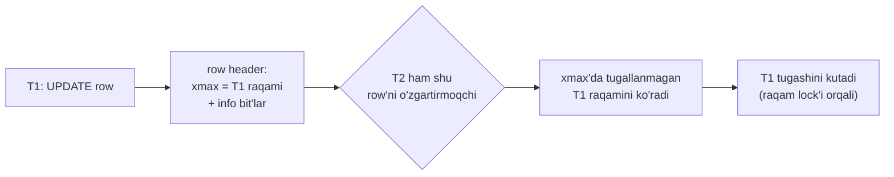
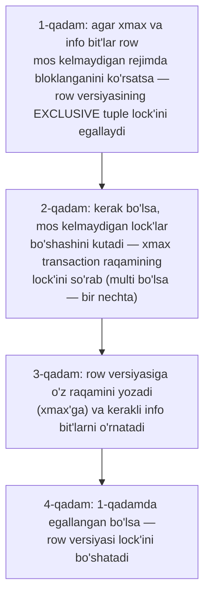
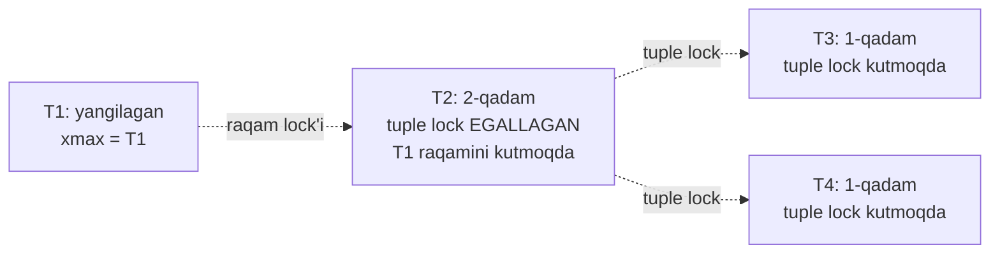
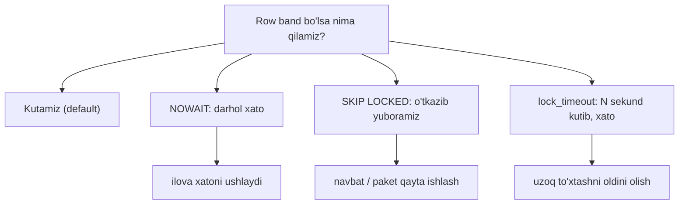
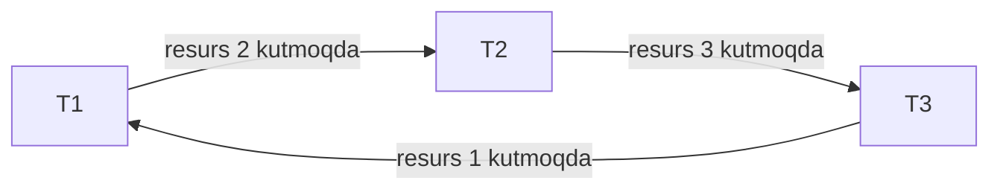
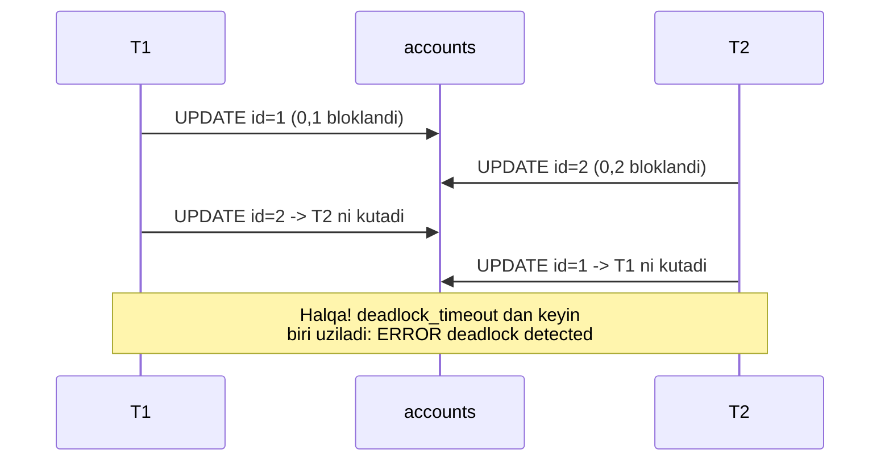

# 13. Row locklar

> 📖 Manba: Рогов, "PostgreSQL 17 изнутри", 13-bob ("Блокировки строк")

## Nima uchun kerak?

12-darsda **heavyweight** (og'ir) lock'larni ko'rdik. Ular relation'lar uchun juda yaxshi, lekin bitta jiddiy muammosi bor: **har biri umumiy xotirada joy egallaydi** (yuzlab bayt). Endi tasavvur qiling — bir yuklama ostidagi baza bir soniyada millionlab row'ni yangilaydi. Agar har bir row uchun og'ir lock ochsak, umumiy xotira **portlaydi**.

2-darsda ko'rgan edik: snapshot isolation tufayli row'larni **o'qishda bloklash kerak emas**. Lekin bitta narsani hech qanday holatda ruxsat etib bo'lmaydi:

> **Ikki transaction bir vaqtda bir xil row'ni o'zgartira olmasligi kerak.**

Demak, row'larni **bloklash kerak**, lekin og'ir lock'lar bu vazifaga to'g'ri kelmaydi. PostgreSQL bunga nihoyatda nafis yechim topgan: **row lock haqidagi ma'lumot alohida saqlanmaydi — u to'g'ridan-to'g'ri row versiyasining o'zida (tuple header'da) yashaydi.**

Bu darsda ko'ramiz: row lock qanday saqlanadi (`xmax`), qanday 4 rejim bor, multitransaction'lar nima, kutish navbati qanday ikki bosqichda ishlaydi, `NOWAIT`/`SKIP LOCKED` va nihoyat **deadlock** — u qanday paydo bo'ladi va undan qanday qochish kerak.

```mermaid
mindmap
  root(("Row locklar"))
    "Saqlanishi"
      "xmax field"
      "info bit'lar"
      "xotirada emas!"
    "4 rejim"
      "FOR UPDATE"
      "FOR NO KEY UPDATE"
      "FOR SHARE"
      "FOR KEY SHARE"
    "Multitransaction"
      "shared lock ko'p egaga"
      "MultiXact raqami"
    "Kutish navbati"
      "tuple lock (2 bosqich)"
      "starvation"
      "NOWAIT / SKIP LOCKED"
    "Deadlock"
      "aniqlash: kutish grafi"
      "deadlock_timeout"
      "qochish: bir xil tartib"
```

---

## 1-qism. Row lock qanday saqlanadi?

Boshqa ba'zi DBMS'larda row lock'lar ko'payib ketsa, ular **eskalatsiya** qilinadi — bir necha row lock o'rniga bitta page yoki table lock. Bu amalga oshirishni soddalashtiradi, lekin samaradorlikni keskin tushiradi.

PostgreSQL boshqacha yo'l tutadi:

> **Oltin qoida:** row bloklanganligi haqidagi ma'lumot **faqat row versiyasining header'ida** saqlanadi. Bu shunchaki page ichidagi **belgilar** (info bit'lar), umumiy xotirada esa **hech qanday** aks etmaydi.

Odatda row **o'zgartirilganda yoki o'chirilganda** bloklanadi (3-darsda ko'rgan mexanizm). Ikkala holatda ham aktual row versiyasi **o'chirilgan deb belgilanadi**: belgi — `xmax` maydonidagi transaction raqami. Aynan shu raqam (qo'shimcha info bit'lar bilan birga) row bloklanganini bildiradi.

Qanday transaction row'ni o'zgartirmoqchi bo'lib, aktual versiya `xmax`'ida **tugallanmagan** transaction raqamini ko'rsa — u o'sha transaction tugashini **kutishi shart**. Tugagach barcha lock'lar bo'shaydi va kutuvchi transaction o'z amalini davom ettiradi.



Bu yechimning **afzalligi**: xohlagancha ko'p row'ni bloklash mumkin, **hech qanday resurs sarflamasdan**.

Lekin **teskari tomoni** ham bor: xotirada lock haqida ma'lumot bo'lmagani uchun, boshqa jarayonlar **navbatga tura olmaydi**. Shuning uchun baribir oddiy og'ir lock'lardan foydalanishga to'g'ri keladi. Row'ning bo'shashini kutish — bu **bloklovchi transaction'ning tugashini** kutish, buning uchun esa uning **raqamining lock'ini** so'rash kerak (12-dars, 3-qism).

> Natijada: ishlatilgan og'ir lock'lar soni **bir vaqtda ishlayotgan jarayonlar soniga** proporsional, o'zgartirilayotgan **row'lar soniga emas**. Aynan shu — dizaynning kaliti.

---

## 2-qism. Row bloklashning 4 rejimi

Row'ni bloklash uchun **to'rtta** rejim bor: ikkitasi **exclusive** (bir vaqtda faqat bitta transaction ushlaydi), ikkitasi **shared** (bir necha transaction ushlashi mumkin).

### Compatibility matrix

| So'ralgan \ Mavjud | Key Share | Share | No Key Update | Update |
|---|:---:|:---:|:---:|:---:|
| **Key Share** |  |  |  | ✗ |
| **Share** |  |  | ✗ | ✗ |
| **No Key Update** |  | ✗ | ✗ | ✗ |
| **Update** | ✗ | ✗ | ✗ | ✗ |

### Exclusive rejimlar

| Rejim | Qachon | Ma'nosi |
|-------|--------|---------|
| **Update** | `SELECT FOR UPDATE`, key o'zgaradigan `UPDATE`/`DELETE` | row'ning **istalgan** maydonini o'zgartirish yoki o'chirish |
| **No Key Update** | `SELECT FOR NO KEY UPDATE`, key o'zgarmaydigan `UPDATE` | **faqat** unique index'ga kirmaydigan maydonlarni o'zgartirish (foreign key'larga tegmaydigan) |

`UPDATE` buyrug'i **o'zi** minimal mos rejimni tanlaydi. Key'lar odatda o'zgarmagani uchun, ko'pincha row'lar **No Key Update** rejimida bloklanadi.

Buni ko'rish uchun `pageinspect` bilan `xmax` va info bit'larni ko'rsatadigan funksiya yaratamiz:

```sql
=> CREATE FUNCTION row_locks(relname text, pageno integer)
   RETURNS TABLE(
     ctid tid, xmax text,
     lock_only text, is_multi text,
     keys_upd text, keyshr text, shr text
   ) AS $$
   SELECT (pageno, lp)::text::tid,
          t_xmax,
          CASE WHEN t_infomask & 128 = 128 THEN 't' END,     -- xmax_lock_only
          CASE WHEN t_infomask & 4096 = 4096 THEN 't' END,   -- xmax_is_multi
          CASE WHEN t_infomask2 & 8192 = 8192 THEN 't' END,  -- keys_updated
          CASE WHEN t_infomask & 16 = 16 THEN 't' END,       -- keyshr
          CASE WHEN t_infomask & 16+64 = 16+64 THEN 't' END  -- shr
   FROM heap_page_items(get_raw_page(relname, pageno))
   ORDER BY lp;
   $$ LANGUAGE sql;
```

Transaction boshlab, birinchi hisob **summasini** (key o'zgarmaydi) va ikkinchi hisob **raqamini** (key o'zgaradi) yangilaymiz:

```sql
=> BEGIN;
=> UPDATE accounts SET amount = amount + 100.00 WHERE id = 1;
=> UPDATE accounts SET id = 20 WHERE id = 2;

=> SELECT * FROM row_locks('accounts', 0) LIMIT 2;
 ctid  |  xmax  | lock_only | is_multi | keys_upd | keyshr | shr
-------+--------+-----------+----------+----------+--------+-----
 (0,1) | 149956 |           |          |          |        |
 (0,2) | 149956 |           |          | t        |        |
(2 rows)
```

Farqni ko'ryapsizmi: (0,2) row'da `keys_upd = t` — bu **Update** rejimini bildiradi (key o'zgardi), (0,1) da esa u yo'q — **No Key Update**.

```sql
=> ROLLBACK;
```

`SELECT FOR` ham xuddi shu `xmax` maydonini belgi sifatida ishlatadi, lekin qo'shimcha **`xmax_lock_only`** bit'i qo'yiladi. U row versiyasi **faqat bloklangan, lekin o'chirilmagan** va hali **aktual** ekanini bildiradi:

```sql
=> BEGIN;
=> SELECT * FROM accounts WHERE id = 1 FOR NO KEY UPDATE;
=> SELECT * FROM accounts WHERE id = 2 FOR UPDATE;

=> SELECT * FROM row_locks('accounts', 0) LIMIT 2;
 ctid  |  xmax  | lock_only | is_multi | keys_upd | keyshr | shr
-------+--------+-----------+----------+----------+--------+-----
 (0,1) | 149957 | t         |          |          |        |
 (0,2) | 149957 | t         |          | t        |        |
(2 rows)
=> ROLLBACK;
```

`lock_only = t` — row o'chirilmagan, faqat bloklangan.

### Shared rejimlar

| Rejim | Qachon | Ma'nosi |
|-------|--------|---------|
| **Share** | `SELECT FOR SHARE` | row'ni o'qish kerak, lekin boshqa transaction uni **o'zgartirmasin** |
| **Key Share** | `SELECT FOR KEY SHARE` | **key'lardan tashqari** har qanday maydonni o'zgartirishga ruxsat |

Shared rejimlardan **PostgreSQL yadrosining o'zi** faqat **Key Share**'ni ishlatadi — **foreign key**'larni tekshirishda. U `No Key Update` bilan **mos**, ya'ni foreign key tekshiruvi noqiy maydonlarni bir vaqtda yangilashga xalaqit bermaydi.

> Yana bir bor ta'kidlaymiz: **o'qishda hech qanday row lock ishlatilmaydi**. `FOR SHARE`/`FOR KEY SHARE` — bu **atayin** bloklash, oddiy `SELECT` emas.

```sql
=> BEGIN;
=> SELECT * FROM accounts WHERE id = 1 FOR KEY SHARE;
=> SELECT * FROM accounts WHERE id = 2 FOR SHARE;

=> SELECT * FROM row_locks('accounts', 0) LIMIT 2;
 ctid  |  xmax  | lock_only | is_multi | keys_upd | keyshr | shr
-------+--------+-----------+----------+----------+--------+-----
 (0,1) | 149958 | t         |          |          | t      |
 (0,2) | 149958 | t         |          |          | t      | t
(2 rows)
```

Ikkala holatda ham `xmax_keyshr_lock` bit'i (`keyshr = t`) o'rnatilgan; `Share` rejimini boshqa info bit'lar (`shr = t`) orqali ajratish mumkin.

---

## 3-qism. Multitransaction'lar

Endi qiziq muammo. Bloklash belgisi — `xmax`'dagi **bitta** transaction raqami. Lekin shared lock'ni **bir necha transaction bir vaqtda** ushlashi mumkin. Bitta maydonga bir necha raqamni qanday yozamiz?

> **Yechim: multitransaction** (MultiXact). Bu — alohida raqam berilgan transaction'lar **guruhi**. Guruh a'zolari va ularning bloklash rejimlari haqidagi batafsil ma'lumot `PGDATA/pg_multixact` katalogidagi fayllarda saqlanadi.

MultiXact raqami oddiy transaction raqami bilan **bir xil o'lchamda** (32 bit), lekin raqamlar **mustaqil** ajratiladi — ya'ni transaction va multitransaction raqamlari **kesishishi** mumkin. Ularni ajratish uchun `xmax_is_multi` bit'i ishlatiladi.

Mavjud lock'larga yana bitta exclusive lock qo'shamiz (bu mumkin, chunki Key Share va No Key Update o'zaro mos):

```sql
=> BEGIN;
=> UPDATE accounts SET amount = amount + 100.00 WHERE id = 1;

=> SELECT * FROM row_locks('accounts', 0) LIMIT 2;
 ctid  | xmax | lock_only | is_multi | keys_upd | keyshr | shr
-------+------+-----------+----------+----------+--------+-----
 (0,1) | 1    |           | t        |          |        |
 (0,2) | 149958 | t       |          |          | t      | t
(2 rows)
```

Birinchi row'da oddiy raqam **multitransaction raqamiga** almashdi — buni `is_multi = t` bildiradi. (`xmax = 1` — bu MultiXact raqami, oddiy `xid` emas.)

Implementatsiya tafsilotlariga kirmaslik uchun **`pgrowlocks`** extension'ini ishlatish qulay — u barcha row lock turlari haqida to'liq ma'lumotni beradi:

```sql
=> CREATE EXTENSION pgrowlocks;
=> SELECT * FROM pgrowlocks('accounts') \gx
-[ RECORD 1 ]-----------------------------------
locked_row | (0,1)
locker     | 1
multi      | t
xids       | {149958,149959}
modes      | {"For Key Share","No Key Update"}
pids       | {45687,45987}
-[ RECORD 2 ]-----------------------------------
locked_row | (0,2)
locker     | 149958
multi      | f
xids       | {149958}
modes      | {"For Share"}
pids       | {45687}
```

`pgrowlocks` `pg_locks`'ga o'xshab ko'rinsa ham, u **table page'larini o'qiydi** — chunki xotirada row lock haqida ma'lumot yo'q.

### MultiXact va freezing

MultiXact raqamlari ham 32-bitli bo'lgani uchun, ularda ham oddiy raqam kabi **wraparound** (perepolneniye) muammosi bor (7-dars). Shuning uchun ular uchun ham **freezing analogini** bajarish kerak — eski raqamlarni yangilariga (yoki, agar freezing paytida lock allaqachon bitta transaction tomonidan ushlab turilsa — oddiy raqamga) almashtirish.

Muhim farq: oddiy raqamlar freezing'i faqat **`xmin`** maydonida bajariladi (`xmax`'i bo'sh bo'lmagan versiyalar aktual emas). Lekin MultiXact uchun aksincha — **`xmax`** freeze qilinadi: aktual row versiyasi doimo **yangi** transaction'lar tomonidan shared rejimda bloklanib turishi mumkin.

> **Parametrlar:** MultiXact freezing'ini oddiy freezing'ga o'xshash parametrlar boshqaradi: `vacuum_multixact_freeze_min_age`, `vacuum_multixact_freeze_table_age`, `autovacuum_multixact_freeze_max_age`, va `vacuum_multixact_failsafe_age` (v14).

---

## 4-qism. Kutish navbati — ikki bosqichli mexanizm

Row lock — shunchaki bir belgi bo'lgani uchun, navbat **oddiy emas** tarzda tashkil qilinadi. Transaction row'ni o'zgartirmoqchi bo'lganda quyidagi **4 qadamni** bajaradi:



> **Muhim atama:** **tuple lock** — row versiyasining lock'i, bu og'ir lock'larning yana bir turi (`locktype = tuple`). Uni **row lock**'ning o'zi bilan **chalkashtirmang**: row lock — `xmax`'dagi belgi, tuple lock — navbatni boshqaradigan alohida og'ir lock.

**Nega 1 va 4 qadamlar kerak?** Ular ortiqchadek ko'rinishi mumkin — «shunchaki bloklovchi transaction'larni kutsak bo'lmaydimi?». Yo'q. Agar bir necha transaction bir row'ni bir vaqtda o'zgartirmoqchi bo'lsa, ular hammasi **hozir ishlab turgan** transaction tugashini kutadi. U tugaganda, kutuvchilar orasida row'ga **egalik uchun poyga** (race) boshlanadi — va ba'zi «omadsiz» transaction'lar noaniq uzoq kutib qolishi mumkin. Bu **starvation** (och qolish) deb ataladi.

**Tuple lock** navbatdagi **birinchi** transaction'ni ajratib, aynan u keyingi lock'ni olishini **kafolatlaydi**.

### Exclusive rejimlar bilan navbat

Yangi view yaratamiz (faqat bizni qiziqtirgan lock'lar bilan):

```sql
=> CREATE VIEW locks_accounts AS
   SELECT pid, locktype,
          CASE locktype
            WHEN 'relation' THEN relation::regclass::text
            WHEN 'transactionid' THEN transactionid::text
            WHEN 'tuple' THEN relation::regclass||'('||page||','||tuple||')'
          END AS lockid,
          mode, granted
   FROM pg_locks
   WHERE locktype IN ('relation','transactionid','tuple')
     AND (locktype != 'relation' OR relation = 'accounts'::regclass)
   ORDER BY 1, 2, 3;
```

**T1** row'ni yangilaydi va 4 qadamni **muvaffaqiyatli** bajaradi — endi u faqat table lock'ini ushlaydi:

```sql
=> BEGIN;
=> UPDATE accounts SET amount = amount + 100.00 WHERE id = 1;  -- pid 45987

=> SELECT * FROM locks_accounts WHERE pid = 45987;
  pid  |   locktype    |  lockid  |       mode       | granted
-------+---------------+----------+------------------+---------
 45987 | relation      | accounts | RowExclusiveLock | t
 45987 | transactionid | 149961   | ExclusiveLock    | t
(2 rows)
```

**T2** shu row'ni yangilamoqchi — **2-qadamda** to'xtaydi:

```sql
=> BEGIN;
=> UPDATE accounts SET amount = amount + 100.00 WHERE id = 1;  -- pid 46058, osildi

=> SELECT * FROM locks_accounts WHERE pid = 46058;
  pid  |   locktype    |    lockid     |       mode       | granted
-------+---------------+---------------+------------------+---------
 46058 | relation      | accounts      | RowExclusiveLock | t
 46058 | transactionid | 149961        | ShareLock        | f       <- T1'ni kutmoqda
 46058 | transactionid | 149962        | ExclusiveLock    | t
 46058 | tuple         | accounts(0,1) | ExclusiveLock    | t       <- tuple lock EGALLANGAN
(4 rows)
```

T2 tuple lock'ni (0,1) **egalladi** (1-qadam), endi T1'ning raqamini (ShareLock) kutmoqda (2-qadam).

**T3** ham shu row'ni yangilamoqchi — lekin u **1-qadamdayoq** to'xtaydi, chunki tuple lock allaqachon T2'da:

```sql
=> BEGIN;
=> UPDATE accounts SET amount = amount + 100.00 WHERE id = 1;  -- pid 46129, osildi

=> SELECT * FROM locks_accounts WHERE pid = 46129;
  pid  |   locktype    |    lockid     |       mode       | granted
-------+---------------+---------------+------------------+---------
 46129 | relation      | accounts      | RowExclusiveLock | t
 46129 | transactionid | 149963        | ExclusiveLock    | t
 46129 | tuple         | accounts(0,1) | ExclusiveLock    | f       <- tuple lock KUTMOQDA
(3 rows)
```

**T4** va keyingilari ham T3 kabi — hammasi bitta tuple lock'ni kutadi:



Umumiy manzarani `pg_stat_activity` ko'rsatadi:

```sql
=> SELECT pid, wait_event_type, wait_event, pg_blocking_pids(pid)
   FROM pg_stat_activity WHERE pid IN (45987,46058,46129,46200);
  pid  | wait_event_type |  wait_event   | pg_blocking_pids
-------+-----------------+---------------+------------------
 45987 | Client          | ClientRead    | {}
 46058 | Lock            | transactionid | {45987}
 46129 | Lock            | tuple         | {46058}
 46200 | Lock            | tuple         | {46058,46129}
(4 rows)
```

### Commit'dan keyin: navbat tarqalishi

Agar T1 **rollback** bilan tugasa — hammasi kutilganidek: qolgan transaction'lar navbatda bir qadam siljiydi.

Lekin ko'proq ehtimol T1 **commit** qiladi. `Repeatable Read`/`Serializable` levellarida bu ikkinchi transaction'ni **serialization xatosi** bilan uzadi (2-darsda ko'rgan `could not serialize`). `Read Committed`'da esa o'zgargan row **qayta o'qiladi** va yangilash urinishi qayta boshlanadi.

T1 commit qiladi. T2 uyg'onib, 3 va 4-qadamlarni bajaradi (`UPDATE 1`). Lekin T2 tuple lock'ni bo'shatgach, T3 uyg'onadi va yangi versiyaning `xmax`'ida **boshqa** raqamni ko'radi. Yuqoridagi qadamlar ketma-ketligi **muvaffaqiyatsiz** tugaydi. `Read Committed`'da row'ni bloklashning **qayta** urinishi bo'ladi, lekin bu urinish endi **yuqoridagi ketma-ketlikka amal qilmaydi** — T3 tuple lock'ni **egallamasdan** T2 tugashini kutadi:

```sql
=> SELECT * FROM locks_accounts WHERE pid = 46129;
  pid  |   locktype    | lockid   |       mode       | granted
-------+---------------+----------+------------------+---------
 46129 | relation      | accounts | RowExclusiveLock | t
 46129 | transactionid | 149962   | ShareLock        | f       <- T2 raqamini kutmoqda
 46129 | transactionid | 149963   | ExclusiveLock    | t
(3 rows)
```

Endi T3 ham, T4 ham **T2 tugashini** kutadi — tuple lock'ni egallash poygasi bilan. **Navbat tarqaldi.** Agar navbat mavjud bo'lgan payt yana transaction'lar kelgan bo'lsa, ular ham shu poyganing beixtiyor ishtirokchisi bo'lib qoladi.

> **Amaliy xulosa:** bitta table row'ini **ko'p parallel jarayonda** bir vaqtda yangilash — yaxshi g'oya emas. Bu **hot point** (issiq nuqta) hosil qiladi, u yetarlicha yuqori yuklamada **bottleneck**'ga (tor joyga) aylanadi.

### Shared rejimlar bilan navbat

Shared row lock'lar PostgreSQL'da faqat **referensial yaxlitlik** (foreign key) tekshiruvida ishlatiladi. Ilovada ularni ishlatish starvation'ga olib kelishi mumkin. Muhim nuqta: agar rejimlar **mos** bo'lsa, transaction **navbatsiz** o'tadi (yuqoridagi 4 qadamning birinchi ikkitasi shundan darak beradi).

Masalan, T1 row'ni `FOR SHARE` bilan bloklaydi, T3 ham `FOR SHARE` bilan — ular mos, T3 **navbatsiz** o'tadi va endi row'ni **ikki transaction** bloklaydi (multi):

```sql
=> SELECT * FROM pgrowlocks('accounts') \gx
-[ RECORD 1 ]---------------------
locked_row | (0,1)
locker     | 2
multi      | t
xids       | {149967,149969}
modes      | {"For Share","For Share"}
pids       | {45987,46129}
```

Bu orada T2 (`UPDATE`, No Key Update — Share bilan **mos emas**) kutib turadi. T1 tugasa, T2 uyg'onadi, lekin row lock hali ham **T3 tomonidan** ushlab turilganini ko'radi va yana navbatga turadi — bu safar T3 orqasiga.

---

## 5-qism. Kutmasdan bloklash: NOWAIT va SKIP LOCKED

Odatda SQL buyruqlari kerakli resurs bo'shashini **kutadi**. Lekin ba'zan lock darhol olinmasa, buyruqni bajarishdan **voz kechish** kerak.

**NOWAIT** — resurs band bo'lsa darhol xato beradi:

```sql
=> BEGIN;
=> UPDATE accounts SET amount = amount + 100.00 WHERE id = 1;  -- boshqa seansda

=> SELECT * FROM accounts FOR UPDATE NOWAIT;
ERROR:  could not obtain lock on row in relation "accounts"
```

Bu xatoni ilova kodida **ushlab, qayta ishlash** mumkin. `UPDATE`/`DELETE`'da `NOWAIT` yo'q — standart usul avval `SELECT FOR UPDATE NOWAIT` bilan urinib ko'rish, agar olsa — keyin yangilash/o'chirish.

**SKIP LOCKED** — allaqachon bloklangan row'larni **o'tkazib yuborib**, faqat bo'shlarini oladi:

```sql
=> SELECT * FROM accounts
   ORDER BY id
   FOR UPDATE SKIP LOCKED
   LIMIT 1;
 id | client | amount
----+--------+--------
  2 | bob    | 200.00
(1 row)
```

Bu yerda birinchi (bloklangan) row o'tkazib yuborildi, so'rov ikkinchi row'ni bloklab qaytardi. Bu yondashuv **ko'p oqimli navbat** (queue) qayta ishlash yoki row guruhlarini paketli qayta ishlash uchun ideal. Lekin boshqa maqsadlarda ishlatmaslik kerak — ko'p vazifalar oddiyroq vositalar bilan hal bo'ladi.

**lock_timeout** — uzoq kutishni cheklashning yana bir yo'li:

```sql
=> SET lock_timeout = '1s';
=> ALTER TABLE accounts DROP COLUMN amount;
ERROR:  canceling statement due to lock timeout
```

Buyruq lock'ni 1 soniyada ololmadi va xato bilan tugadi.

> **Farq:** `lock_timeout` faqat **lock kutish** vaqtini cheklaydi, `statement_timeout` esa operatorning **umumiy bajarilish** vaqtini. Bu ayniqsa yuklama ostidagi table'da `Access Exclusive` talab qiladigan buyruqni bajarganda foydali — uzoq to'xtab qolishning oldini oladi.



---

## 6-qism. Deadlock (o'zaro qulflanish)

Bir transaction ikkinchisi egallagan resursni, ikkinchisi uchinchisinikini kutishi mumkin — transaction'lar navbat hosil qiladi. Lekin **navbat orqasida** turgan transaction'ga **yana bir resurs** kerak bo'lib, u **o'sha navbatga** turishi kerak bo'lsa — **deadlock** yuzaga keladi: navbat halqaga aylanadi va o'zi tarqala olmaydi.

### Aniqlash mexanizmi: kutish grafi

Manzarani **kutish grafi** (wait-for graph) bilan tasavvur qilamiz. Uchlar — ishlayotgan transaction'lar. Yo'nalishlar — lock kutayotgan transaction'dan uni ushlab turgan transaction'ga strelka. Grafda **kontur** (aylana) bo'lsa — deadlock yuz bergan.



Agar deadlock yuzaga kelib, hech kim timeout o'rnatmagan bo'lsa, transaction'lar bir-birini **cheksiz** kutadi. Shuning uchun **lock manager** bunday holatlarni avtomatik kuzatadi.

Lekin tekshiruv **arziydi** (deadlock'lar kam uchraydi), shuning uchun uni har safar lock so'ralganda qilish istalmaydi. Optimizatsiya shunday ishlaydi:

> **Parametr:** `deadlock_timeout` (default **1s**). Jarayon lock'ni ololmay navbatga turganda, shu vaqtga **taymer** o'rnatiladi. Agar resurs bundan oldin bo'shasa — ajoyib, tekshiruvni tejadik. Agar `deadlock_timeout`'dan keyin ham kutish davom etsa — jarayon uyg'onib, tekshiruvni ishga tushiradi.

Tekshiruv — kutish grafini qurish va unda kontur qidirish. Tekshiruv davomida barcha og'ir lock'lar bilan ishlash **to'xtatiladi** (graf holatini «muzlatish» uchun).

- Kontur topilmasa — jarayon yana uxlaydi.
- Deadlock topilsa — transaction'lardan biri **majburan uziladi**. Ko'p hollarda tekshiruvni **boshlagan** transaction uziladi.

Deadlock — odatda ilova **noto'g'ri loyihalanganini** bildiradi. Aniqlash: (1) server log'ida xabar, va (2) `pg_stat_database.deadlocks` qiymati oshadi.

### Tipik stsenariy 1: row update'da har xil tartib

Deadlock'ning eng keng tarqalgan sababi — table row'larini **har xil tartibda** bloklash.

**T1** birinchi hisobdan ikkinchisiga 100₽ o'tkazmoqchi, birinchisidan kamaytirishdan boshlaydi:

```sql
=> BEGIN;
=> UPDATE accounts SET amount = amount - 100.00 WHERE id = 1;   -- (0,1) bloklandi
```

**T2** ikkinchisidan birinchisiga 10₽ o'tkazmoqchi, ikkinchisidan boshlaydi:

```sql
=> BEGIN;
=> UPDATE accounts SET amount = amount - 10.00 WHERE id = 2;    -- (0,2) bloklandi
```

Endi **T1** ikkinchi hisobni oshirmoqchi — lekin (0,2) T2'da:

```sql
=> UPDATE accounts SET amount = amount + 100.00 WHERE id = 2;   -- T2'ni kutadi
```

**T2** birinchi hisobni oshirmoqchi — lekin (0,1) T1'da:

```sql
=> UPDATE accounts SET amount = amount + 10.00 WHERE id = 1;    -- T1'ni kutadi
```

Aylanma kutish hosil bo'ldi. 1 soniyadan keyin T1 tekshiruvni boshlaydi va server uni uzadi:

```
ERROR:  deadlock detected
DETAIL:  Process 45687 waits for ShareLock on transaction 149975; blocked by process 45987.
Process 45987 waits for ShareLock on transaction 149974; blocked by process 45687.
HINT:  See server log for query details.
CONTEXT:  while updating tuple (0,2) in relation "accounts"
```



> **Qochish yo'li:** resurslarni **bir xil tartibda** bloklash. Bu holatda — hisoblarni **id o'sish tartibida** yangilash. Agar ikkala transaction ham avval id=1, keyin id=2 ni bloklasa, deadlock **umuman bo'lmaydi**.

### Tipik stsenariy 2: ikkita UPDATE buyrug'ida

Ba'zan deadlock **imkonsizdek** ko'rinadi, lekin baribir yuzaga keladi. SQL buyruqlarini **atomar** deb qabul qilish qulay, lekin `UPDATE` row'larni **yangilagani sari** (hammasini bir vaqtda emas) bloklaydi. Agar bir `UPDATE` row'larni **bir tartibda**, boshqasi **boshqa tartibda** yangilasa — ular deadlock bo'lishi mumkin.

Buni ko'rish uchun `amount DESC` bo'yicha index va sekinlashtiruvchi funksiya yaratamiz:

```sql
=> CREATE INDEX ON accounts(amount DESC);
=> CREATE FUNCTION inc_slow(n numeric) RETURNS numeric AS $$
   SELECT pg_sleep(1);
   SELECT n + 100.00;
   $$ LANGUAGE sql;
```

Row'lar page'da **summa o'sishi** tartibida yotibdi:

```sql
=> SELECT ctid, * FROM accounts;
 ctid  | id | client  | amount
-------+----+---------+--------
 (0,1) |  1 | alice   | 100.00
 (0,2) |  2 | bob     | 200.00
 (0,3) |  3 | charlie | 300.00
(3 rows)
```

**T1** — butun table'ni Seq Scan bilan yangilaydi (row'lar **(0,1) → (0,2) → (0,3)** tartibida):

```sql
=> UPDATE accounts SET amount = inc_slow(amount);
```

**T2** — Seq Scan'ni o'chirib, Index Scan ishlatadi. Index `amount DESC` bo'yicha, shuning uchun row'lar **teskari** tartibda ((0,3) → (0,2)) yangilanadi:

```sql
=> SET enable_seqscan = off;
=> UPDATE accounts SET amount = inc_slow(amount) WHERE amount > 100.00;
```

`pgrowlocks` bilan kuzatamiz: T1 (0,1) ni, T2 (0,3) ni bloklab oldi:

```sql
=> SELECT locked_row, locker, modes FROM pgrowlocks('accounts');
 locked_row | locker |       modes
------------+--------+-------------------
 (0,1)      | 149981 | {"No Key Update"}    <- T1
 (0,3)      | 149982 | {"No Key Update"}    <- T2
(2 rows)
```

Bir soniyadan keyin T1 (0,2) ga o'tadi, T2 ham (0,2) ni xohlaydi lekin ololmaydi. Endi T1 (0,3) ni xohlaydi — lekin u T2'da. **Deadlock:**

```
ERROR:  deadlock detected
DETAIL:  Process 46058 waits for ShareLock on transaction 149981; blocked by process 45987.
Process 45987 waits for ShareLock on transaction 149982; blocked by process 46058.
CONTEXT:  while updating tuple (0,2) in relation "accounts"
```

Bunday holatlar paketli row yangilaydigan yuklamali tizimlarda **haqiqatan** yuzaga keladi. Qochish yo'li — buyruqlarni row'larni **bir xil tartibda** yangilashga majbur qilish (masalan, `ORDER BY` bilan yoki bir xil scan usulini kafolatlash).

---

## Xulosa

- Row lock haqidagi ma'lumot **xotirada saqlanmaydi** — u to'g'ridan-to'g'ri **tuple header**'ida, `xmax` maydoni va info bit'lar orqali. Bu xohlagancha ko'p row'ni **resurssiz** bloklash imkonini beradi.
- Kutish uchun baribir og'ir lock kerak: row bo'shashini kutish = **bloklovchi transaction'ning tugashini** kutish (uning raqami lock'i orqali). Shuning uchun og'ir lock'lar soni **jarayonlar soniga** proporsional, row'larga emas.
- **4 rejim**: exclusive — `Update` (istalgan maydon/o'chirish), `No Key Update` (key'siz maydonlar); shared — `Share`, `Key Share` (yadro faqat foreign key tekshiruvida ishlatadi).
- **MultiXact** — shared lock'ni bir necha transaction ushlaganda ishlatiladigan guruh raqami (`xmax_is_multi` bit'i). Uning ham wraparound muammosi bor, `xmax` freeze qilinadi.
- Kutish navbati **ikki bosqichli**: **tuple lock** (og'ir, `locktype=tuple`) navbatning birinchi transaction'ini ajratib, **starvation**'ning oldini oladi. Commit'dan keyin `Read Committed`'da navbat qisman **tarqaladi**.
- Bir row'ni ko'p parallel jarayonda yangilash — **hot point**, bottleneck sababi.
- `NOWAIT` (darhol xato), `SKIP LOCKED` (o'tkazib yuborish, navbat qayta ishlash uchun), `lock_timeout` (kutishni cheklash) — kutmasdan ishlash vositalari.
- **Deadlock** — kutish grafida kontur. `deadlock_timeout` (1s) dan keyin aniqlanadi, transaction'lardan biri uziladi. Aniqlash: server log + `pg_stat_database.deadlocks`.
- Deadlock'ning eng keng tarqalgan sababi — resurslarni **har xil tartibda** bloklash. Yechim: har doim **bir xil tartibda** (masalan id o'sishi bo'yicha).

## Nazorat savollari

1. Row lock haqidagi ma'lumot qayerda saqlanadi va nega bu og'ir lock'lardan afzalroq? Bu yechimning «teskari tomoni» nimada?
2. Row bloklashning 4 rejimini ayting. `UPDATE` qaysi rejimni tanlaydi va nega ko'pincha `No Key Update` bo'ladi? `Update`'dan farqi nimada?
3. MultiXact nima uchun kerak va u qanday holatda paydo bo'ladi? Nima uchun oddiy raqamlarda `xmin`, MultiXact'da esa `xmax` freeze qilinadi?
4. Kutish navbatining 4 qadamini tartib bilan ayting. **Tuple lock** nima va u qanday muammoni (starvation) hal qiladi? Uni row lock bilan chalkashtirmang.
5. `Read Committed`'da bloklovchi T1 commit qilgach, navbat nega «tarqaladi»? Bu qanday amaliy muammoga (hot point) olib keladi?
6. `NOWAIT`, `SKIP LOCKED` va `lock_timeout` orasidagi farqni ayting. `SKIP LOCKED` qaysi amaliy vazifa uchun ideal? `lock_timeout` va `statement_timeout` farqi nima?
7. Deadlock qanday yuzaga keladi va u kutish grafida qanday ko'rinadi? `deadlock_timeout` nega darhol emas, kechikib tekshiradi?
8. Ikkita `UPDATE` buyrug'i «atomar» ko'rinsa ham qanday qilib deadlock bo'lishi mumkin? Ikkala tipik stsenariydan qochishning umumiy qoidasi nima?
