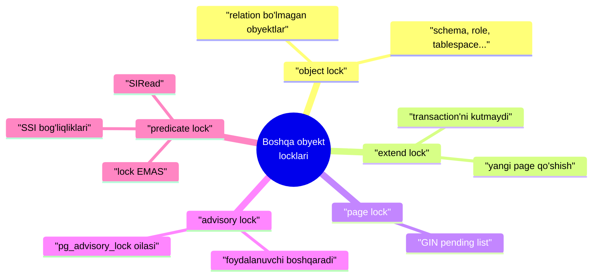
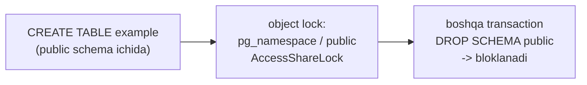
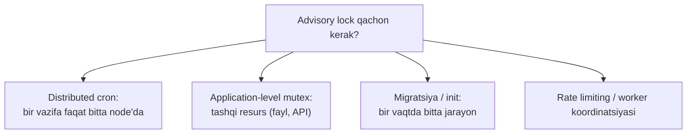
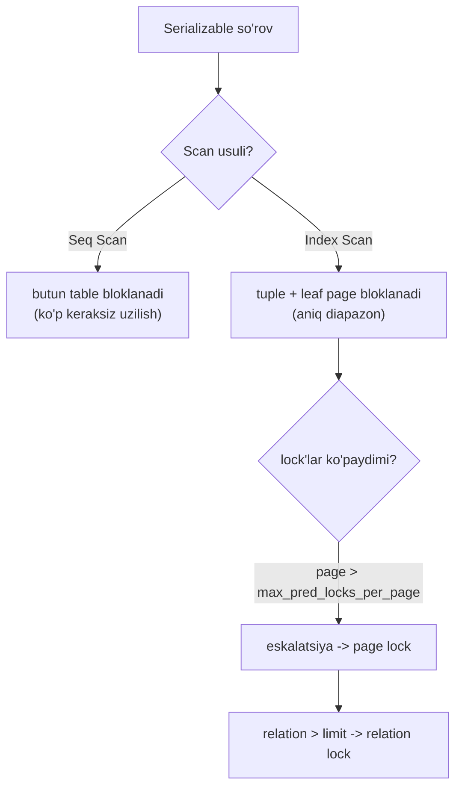

# 14. Boshqa obyekt locklari

> 📖 Manba: Рогов, "PostgreSQL 17 изнутри", 14-bob ("Блокировки разных объектов")

## Nima uchun kerak?

12-darsda relation lock'larni, 13-darsda row lock'larni ko'rdik. Lekin PostgreSQL faqat table va row'lardan iborat emas. Bir necha savolni o'ylab ko'ring:

- Bir transaction schema ichida table yaratayotganda, boshqa transaction o'sha **schema'ni o'chirmasligi** kerak. Buni nima ta'minlaydi?
- Ikki jarayon bir vaqtda table oxiriga **yangi page qo'shsa** nima bo'ladi? Fayl buziladi-ku?
- Table yoki row'ga bog'lanmagan, umuman baza tashqarisidagi resursni (masalan, tashqi API yoki cron-job) bloklash kerak bo'lsa-chi?

Bularning har biriga PostgreSQL'da alohida lock turi javob beradi. Bu dars — **relation va row'dan tashqari** hamma narsa haqida: object lock'lar, relation extension lock'lar, page lock'lar, **advisory** (rekomendatsion) lock'lar va **predicate** lock'lar (SSI).



---

## 1-qism. Object lock'lar (relation bo'lmagan obyektlar)

PostgreSQL tushunchasidagi **relation bo'lmagan** resursni bloklash kerak bo'lganda, `object` turidagi og'ir lock ishlatiladi. Bunday resurs — tizim katalogidagi deyarli hamma narsa: **tablespace**'lar, subscription'lar, **schema**'lar, **role**'lar, policy'lar, sanab o'tiladigan (enum) data type'lar.

Transaction boshlab, unda table yaratamiz:

```sql
=> BEGIN;
=> CREATE TABLE example(n integer);
```

Endi `pg_locks`'dagi object lock'larni ko'ramiz:

```sql
=> SELECT database,
          (SELECT datname FROM pg_database WHERE oid = database) AS dbname,
          classid,
          (SELECT relname FROM pg_class WHERE oid = classid) AS classname,
          objid, mode, granted
   FROM pg_locks
   WHERE locktype = 'object' AND pid = pg_backend_pid() \gx
-[ RECORD 1 ]------------------
database  | 16391
dbname    | internals
classid   | 2615
classname | pg_namespace
objid     | 2200
mode      | AccessShareLock
granted   | t
```

Bloklanadigan resurs uchta maydon bilan aniqlanadi:

| Maydon | Ma'nosi |
|--------|---------|
| `database` | obyekt tegishli baza oid'i (yoki 0 — agar butun cluster'ning umumiy obyekti bo'lsa) |
| `classid` | `pg_class`'dagi oid — resurs **turini** aniqlaydigan tizim katalogi table nomi |
| `objid` | `classid` ko'rsatgan tizim table'idagi oid — aniq obyekt |

Bizning misolda: `classid = 2615` → bu **`pg_namespace`** table'i (schema'larni saqlaydi). `objid = 2200` ni ochib ko'ramiz:

```sql
=> SELECT nspname FROM pg_namespace WHERE oid = 2200;
 nspname
---------
 public
(1 row)
```

Demak, **`public` schema'si bloklangan** — transaction tugamaguncha hech kim uni o'chira olmasin. Mos ravishda, obyektlarni **o'chirishda** obyektning o'zi va **u bog'liq bo'lgan hamma narsaning** exclusive lock'lari egallanadi.

```sql
=> ROLLBACK;
```



---

## 2-qism. Relation extension lock'lari

Table'dagi row'lar soni o'sganda, PostgreSQL imkon qadar mavjud page'lardagi bo'sh joyni ishlatadi. Lekin bir payt keladi — yangi page qo'shish, ya'ni relation'ni **kengaytirish** (extend) kerak bo'ladi. Fizik jihatdan page fayl-segment oxiriga qo'shiladi (va yangi segment yaratilishiga olib kelishi mumkin).

> **Muammo:** ikki jarayon bir vaqtda page qo'shsa, fayl buziladi. Buning oldini olish uchun bu operatsiya maxsus **`extend`** turidagi og'ir lock bilan himoyalanadi. Shu lock index tozalashda ham ishlatiladi — boshqa jarayonlar scan davomida yangi page qo'sha olmasligi uchun.

Extension lock ilgari ko'rganlarimizdan biroz **boshqacha** ishlaydi:

- U kengaytirish tugashi bilan **darhol** bo'shaydi — transaction oxirini **kutmaydi**.
- U **deadlock'ga olib kelmaydi**, shuning uchun aniqlash protsedurasida u uchun istisno qilingan: u **kutish grafiga tushmaydi**.

> **Nozik nuqta:** shunga qaramay, agar extension kutishi `deadlock_timeout`'dan uzoq davom etsa, tekshiruv baribir chaqiriladi. Bu — normal bo'lmagan holat, lekin ko'p parallel jarayonlardan katta `INSERT` oqimi kelganda yuzaga kelishi mumkin. Bu holda tekshiruv ko'p marta ishga tushib, tizimni deyarli falaj qilishi mumkin.

Samaradorlik uchun table fayllari **bittadan emas, bir vaqtda bir nechta** page'ga kengaytiriladi — kutayotgan jarayonlar soniga proporsional, lekin bir martada **64 page'dan ko'p emas** (v16). Ammo **B-tree** index fayllari faqat **bittadan** page'ga o'sadi.

---

## 3-qism. Page lock'lari

Page darajasidagi `page` turidagi og'ir lock **yagona** holatda ishlatiladi — bu **GIN** index'larining xususiyati bilan bog'liq (28-darsda GIN batafsil).

GIN index'lar tarkibiy (composite) qiymatlarda element qidirishni tezlashtiradi — masalan, matn hujjatlaridagi so'zlarni. Bunday index'ni birinchi yaqinlashuvda oddiy **B-tree** kabi tasavvur qilish mumkin, faqat unda hujjatlarning o'zi emas, ularning **alohida so'zlari** saqlanadi. Shuning uchun yangi hujjat qo'shilganda index'ni ancha kuchli qayta qurish kerak — har bir so'zni kiritish bilan.

Samaradorlikni oshirish uchun GIN index'lar **kechiktirilgan qo'shish** (deferred insert) imkonini beradi — `fastupdate` storage parametri orqali yoqiladi:

> Yangi so'zlar avval tez-tez tartibsiz **pending list** (kutish ro'yxati) ga qo'shiladi, keyin bir vaqt o'tib to'plangan hammasi asosiy index strukturasiga **ko'chiriladi**. Tejamkorlik shundan — turli hujjatlar katta ehtimol bilan **takrorlanuvchi** so'zlar saqlaydi.

So'zlarni pending list'dan asosiy index'ga bir vaqtda bir necha jarayon ko'chirmasligi uchun, ko'chirish davomida index'ning **metapage'i** exclusive rejimda bloklanadi. Bu index'ning oddiy ishlatilishiga xalaqit bermaydi.

Extension lock kabi, page lock ham ish tugashi bilan **darhol** bo'shaydi (transaction oxirida emas) va **deadlock'ga olib kelmaydi**.

---

## 4-qism. Advisory (rekomendatsion) lock'lar

Boshqa og'ir lock'lardan farqli o'laroq (masalan, relation lock'lar), **advisory** (rekomendatsion) lock'lar **hech qachon avtomatik o'rnatilmaydi** — ularni **ilova ishlab chiquvchisi** boshqaradi. Ular ilova biror maqsad uchun **nostandart bloklash mantig'i** talab qilganda qulay.

> **Analogiya:** advisory lock — bu **umumiy taxta** (whiteboard) ustidagi «band» yozuvi kabi. PostgreSQL taxtani va yozuvni ta'minlaydi, lekin unga **qarab yurish** — hammaning o'z ixtiyorida. Kimdir yozuvni o'qimasdan ishga kirishsa, PostgreSQL to'xtatmaydi.

Faraz qilaylik, bazadagi hech qanday obyektga mos kelmaydigan resurs bor (uni `SELECT FOR` yoki `LOCK TABLE` bilan bloklab bo'lmaydi). Bloklash uchun resursga **son identifikatori** biriktirish kerak. Agar resursda unikal nom bo'lsa — oddiy variant nomning hash-kodini olish:

```sql
=> SELECT hashtext('resurs1');
 hashtext
-----------
 243773337
(1 row)
```

Advisory lock'larni boshqarish uchun butun **funksiyalar oilasi** bor. Nomlari `pg_advisory` bilan boshlanib, vazifani aniqlaydigan so'zlar qo'shiladi:

| Bo'lak | Ma'nosi |
|--------|---------|
| `lock` | lock'ni egallash |
| `try` | lock'ni **kutmasdan** egallash (bo'lsa) |
| `unlock` | lock'ni bo'shatish |
| `shared` | shared rejim (default — exclusive) |
| `xact` | **transaction oxirigacha** bloklash (default — **seans oxirigacha**) |

Masalan, seans oxirigacha exclusive lock egallaymiz:

```sql
=> BEGIN;
=> SELECT pg_advisory_lock(hashtext('resurs1'));
=> SELECT locktype, objid, mode, granted
   FROM pg_locks WHERE locktype = 'advisory' AND pid = pg_backend_pid();
 locktype |   objid   |     mode      | granted
----------+-----------+---------------+---------
 advisory | 243773337 | ExclusiveLock | t
(1 row)
```

Bloklash haqiqatan ishlashi uchun **boshqa jarayonlar ham** shu tartibga amal qilishi shart. Bu qoidaga rioya qilishni **ilova kuzatishi** kerak.

Diqqat: o'rnatilgan lock transaction tugagach ham **bo'shamaydi** (chunki `xact` emas, default seans oxirigacha):

```sql
=> COMMIT;
=> SELECT locktype, objid, mode, granted
   FROM pg_locks WHERE locktype = 'advisory' AND pid = pg_backend_pid();
 locktype |   objid   |     mode      | granted
----------+-----------+---------------+---------
 advisory | 243773337 | ExclusiveLock | t
(1 row)
```

Resurs bilan ish tugagach, lock'ni **aniq** (explicit) bo'shatamiz:

```sql
=> SELECT pg_advisory_unlock(hashtext('resurs1'));
```

### Amaliy ishlatish holatlari



- **Distributed cron/leader election:** bir necha ilova nusxasi ishlayotganda, biror vazifani faqat bittasi bajarsin. `pg_try_advisory_lock` bilan urinib ko'ramiz — kim birinchi olsa, o'sha bajaradi.
- **Application mutex:** bazaga bog'lanmagan tashqi resursni (fayl, tashqi tizim) himoya qilish.
- **Migratsiya/inicializatsiya:** bir vaqtda faqat bitta jarayon sozlashni bajarsin.

> **Muhim:** advisory lock — bu **mas'uliyat sizda** degan lock. Boshqa lock'lar avtomatik ishlaydi; advisory esa faqat hamma unga rioya qilgandagina himoya beradi.

---

## 5-qism. Predicate lock'lar (SSI)

**Predicate lock** atamasi lock'lar asosida to'liq isolation'ni amalga oshirishning birinchi urinishlarida paydo bo'lgan. Muammo shu edi: hatto barcha **o'qilgan va o'zgartirilgan** row'larni bloklash ham to'liq isolation bermaydi — table'ga eski tanlash shartiga mos **yangi row'lar** paydo bo'lib, **phantom** (fantom) yuzaga keladi (2-darsda ko'rgan phantom read).

Shuning uchun row'larni emas, **shartlarni (predikatlarni)** bloklash taklif qilingan. `a > 10` shartli so'rovda predikatning o'zini bloklash bu shartga tushadigan yangi row qo'shishga yo'l qo'ymaydi. Qiyinligi: `a < 20` degan boshqa so'rov kelganda, bu shartlar **kesishadimi** yo'qmi aniqlash kerak — umumiy holda bu **algoritmik yechilmaydigan** masala.

### PostgreSQL'da SSI

2-darsda **Serializable** level va **SSI** (Serializable Snapshot Isolation) bilan tanishdik. PostgreSQL Serializable'ni aynan SSI orqali beradi. **Predicate lock** atamasi qolgan, lekin ma'nosi tubdan o'zgargan:

> **Oltin qoida:** PostgreSQL'da predicate lock'lar **hech nimani bloklamaydi**. Ular transaction'lar orasidagi **ma'lumot bog'liqliklarini kuzatish** uchun ishlatiladi. Transaction commit qilganda tekshiruv bo'ladi va «yomon» bog'liqlik strukturasi topilsa, transaction **uziladi**.

2-darsda ko'rgan edik: Repeatable Read darajasidagi snapshot isolation faqat **ikki** anomaliyaga yo'l qo'yadi — **write skew** va **read-only transaction anomaliyasi**. Bu ikkalasiga bog'liqliklar grafida aniq qonuniyatlar mos keladi, ularni ko'p resurs sarflamasdan aniqlash mumkin.

Ikki xil bog'liqlikni ajratish kerak:

| Bog'liqlik | Ma'nosi | Qanday kuzatiladi |
|-----------|---------|-------------------|
| **RW** | bir transaction row'ni **o'qiydi**, keyin boshqasi uni **o'zgartiradi** | **predicate lock** orqali (qo'shimcha) |
| **WR** | bir transaction row'ni **o'zgartiradi**, keyin boshqasi uni **o'qiydi** | oddiy lock'lar orqali (allaqachon bor) |

Aynan **RW** bog'liqliklarni kuzatish uchun predicate lock kerak. Bu kuzatuv **Serializable** tanlanganda yoqiladi — shuning uchun barcha (yoki hech bo'lmasa o'zaro bog'liq) transaction'lar shu levelni ishlatishi muhim. Aks holda Serializable **Repeatable Read** darajasiga «tushib» qoladi (2-darsda ham aytilgan).

### Amalda: Seq Scan butun table'ni «bloklaydi»

Ma'lumot va sahifalarni egallaydigan index bilan table yaratamiz:

```sql
=> CREATE TABLE pred(n numeric, s text);
=> INSERT INTO pred(n) SELECT n FROM generate_series(1, 10000) n;
=> CREATE INDEX ON pred(n) WITH (fillfactor = 10);
=> ANALYZE pred;
```

So'rov **Seq Scan** bilan bajarilsa, predicate lock **butun table'ga** o'rnatiladi (garchi filtrga hamma row tushmasa ham):

```sql
=> BEGIN ISOLATION LEVEL SERIALIZABLE;
=> EXPLAIN (analyze, costs off, timing off, summary off)
   SELECT * FROM pred WHERE n > 100;
                 QUERY PLAN
--------------------------------------------
 Seq Scan on pred (actual rows=9900 loops=1)
   Filter: (n > '100'::numeric)
   Rows Removed by Filter: 100
(3 rows)
```

Predicate lock'lar `pg_locks`'da og'ir lock'lar bilan birga ko'rinadi, lekin doim **maxsus `SIRead`** (Serializable Isolation Read) rejimida:

```sql
=> SELECT relation::regclass, locktype, page, tuple
   FROM pg_locks WHERE mode = 'SIReadLock' AND pid = 50014;
 relation | locktype | page | tuple
----------+----------+------+-------
 pred     | relation |      |
(1 row)
=> ROLLBACK;
```

`relation` darajasida bitta lock — butun table «bloklandi».

### Index Scan — ancha aniqroq

Agar so'rov **Index Scan** bilan bajarilsa, holat yaxshilanadi. B-tree'da **o'qilgan row'larga** va **ko'rilgan barg (leaf) page'larga** predicate lock qo'yish yetarli. Shu bilan aniq qiymatlar emas, **o'qilgan butun diapazon** «bloklanadi»:

```sql
=> BEGIN ISOLATION LEVEL SERIALIZABLE;
=> EXPLAIN (analyze, costs off, timing off, summary off)
   SELECT * FROM pred WHERE n BETWEEN 1000 AND 1001;
                 QUERY PLAN
-------------------------------------------------
 Index Scan using pred_n_idx on pred (actual rows=2 loops=1)
   Index Cond: ((n >= '1000') AND (n <= '1001'))

=> SELECT relation::regclass, locktype, page, tuple
   FROM pg_locks WHERE mode = 'SIReadLock' AND pid = 50014;
  relation  | locktype | page | tuple
------------+----------+------+-------
 pred       | tuple    | 4    | 96
 pred       | tuple    | 4    | 97
 pred_n_idx | page     | 28   |
(3 rows)
```

Endi butun table emas, faqat **2 ta tuple** va **1 ta index page** bloklandi. Yangi row'lar qo'shilganda barg page'lar bo'linishi mumkin, lekin implementatsiya buni hisobga olib **yangi page'larni ham** bloklaydi.

### Eskalatsiya — xotira cheklovi

Har bir o'qilgan row versiyasiga alohida predicate lock yaratiladi, lekin ularning soni juda ko'p bo'lishi mumkin. Predicate lock'lar uchun alohida pool bor:

> **Parametr:** predicate lock'lar soni `max_pred_locks_per_transaction` (default **64**) × `max_connections` (100) bilan cheklangan.

13-darsdagi row lock muammosining aynan o'zi — lekin bu yerda **eskalatsiya** (uroven oshirish) bilan hal qilinadi:

| Chegara | Nima bo'ladi |
|---------|--------------|
| Bir page'ga tegishli tuple lock'lar `max_pred_locks_per_page` (default **2**) dan oshsa | ular **bitta page lock** bilan almashtiriladi |
| Bir relation'ga tegishli page lock'lar `max_pred_locks_per_relation` dan oshsa | ular **bitta relation lock** bilan almashtiriladi |

Masalan, `BETWEEN 1000 AND 1002` uchta tuple topsa (bir page'da 2 dan ko'p) — uch tuple lock o'rniga bitta **page** lock paydo bo'ladi:

```sql
=> SELECT relation::regclass, locktype, page, tuple
   FROM pg_locks WHERE mode = 'SIReadLock' AND pid = 50014;
  relation  | locktype | page | tuple
------------+----------+------+-------
 pred       | page     | 4    |
 pred_n_idx | page     | 28   |
 ...
```

> **Trade-off:** eskalatsiya xotirani tejaydi, lekin muqarrar ravishda **ko'proq transaction bekorga serialization xatosi** bilan uziladi. Throughput tushadi. Xotira va samaradorlik orasida balans izlash kerak.

Predicate lock'lar quyidagi index turlarini qo'llab-quvvatlaydi: **B-tree**, **hash**, **GiST**, **GIN** (v11). Agar index predicate lock bilan ishlamasa, lock **butun index'ga** qo'yiladi — bu ham keraksiz uzilishlarni ko'paytiradi.

> **Optimizatsiya:** Serializable'da faqat o'quvchi transaction'larni aniq `READ ONLY` deb belgilash foydali. Agar lock manager bunday transaction konflikt qila olmasligiga ishonch hosil qilsa, uning predicate lock'larini bo'shatadi. Agar qo'shimcha `DEFERRABLE` deb e'lon qilinsa — read-only anomaliyasidan qochish mumkin (2-darsda `READ ONLY DEFERRABLE` ko'rgan edik).



---

## Xulosa

- **Object lock** (`locktype=object`) — relation bo'lmagan obyektlar (schema, role, tablespace, enum type...) uchun. Resurs `database` + `classid` + `objid` bilan aniqlanadi; obyektni o'chirishda u va bog'liqlarining exclusive lock'lari olinadi.
- **Extension lock** (`extend`) — table/index'ga yangi page qo'shishni himoya qiladi. **Transaction oxirini kutmaydi**, deadlock'ga olib kelmaydi (kutish grafiga tushmaydi). Table bir vaqtda 64 page'gacha, B-tree — bittadan o'sadi.
- **Page lock** (`page`) — faqat **GIN** index'lar uchun: `fastupdate` pending list'dan asosiy strukturaga ko'chirishda metapage bloklanadi. Darhol bo'shaydi, deadlock'siz.
- **Advisory lock** (`advisory`) — **foydalanuvchi boshqaradigan** lock. `pg_advisory_lock` oilasi (`lock`/`try`/`unlock`/`shared`/`xact`). Rioya qilishga **ilova** javobgar. Distributed cron, application mutex, migratsiya uchun.
- **Predicate lock** — **lock emas**: SSI (Serializable) uchun **RW-bog'liqliklarni** kuzatadi. Doim `SIRead` rejimida. Seq Scan → butun table; Index Scan → tuple + leaf page (aniqroq).
- Predicate lock'lar `max_pred_locks_per_transaction` (64) × `max_connections` bilan cheklangan; ko'payib ketsa **eskalatsiya**: tuple → page → relation. Eskalatsiya xotirani tejaydi, lekin ko'proq keraksiz serialization xatosi keltiradi.
- Serializable'da o'quvchi transaction'larni `READ ONLY` (va `DEFERRABLE`) deb belgilash — samaradorlikni oshiradi va read-only anomaliyadan qochiradi.

## Nazorat savollari

1. Object lock qaysi obyektlar uchun ishlatiladi va bloklanadigan resurs qaysi uchta maydon bilan aniqlanadi? `CREATE TABLE` nega `public` schema'siga lock oladi?
2. Relation extension lock ilgari ko'rilgan lock'lardan qanday ikki jihati bilan farq qiladi? Nima uchun u kutish grafiga tushmaydi?
3. Page lock qaysi yagona holatda ishlatiladi? GIN'ning `fastupdate` mexanizmi nima uchun tejamkor va bu bilan page lock qanday bog'liq?
4. Advisory lock boshqa og'ir lock'lardan nimasi bilan tubdan farq qiladi? `pg_advisory_lock` va `pg_try_advisory_lock` orasidagi farq nima?
5. Advisory lock qaysi amaliy holatlarda ishlatiladi (kamida 2 ta)? Nima uchun uni «mas'uliyat sizda» lock deb atash mumkin?
6. Predicate lock nima uchun aslida «lock» emas? U qaysi ikki anomaliyani (write skew va read-only) aniqlash uchun kerak? RW va WR bog'liqliklari qanday farqlanadi?
7. Seq Scan va Index Scan predicate lock hajmiga qanday ta'sir qiladi? Nima uchun Index Scan afzalroq?
8. Predicate lock eskalatsiyasi qanday bosqichlarda boradi (tuple → page → relation)? Eskalatsiyaning ijobiy va salbiy tomonlari nima?
