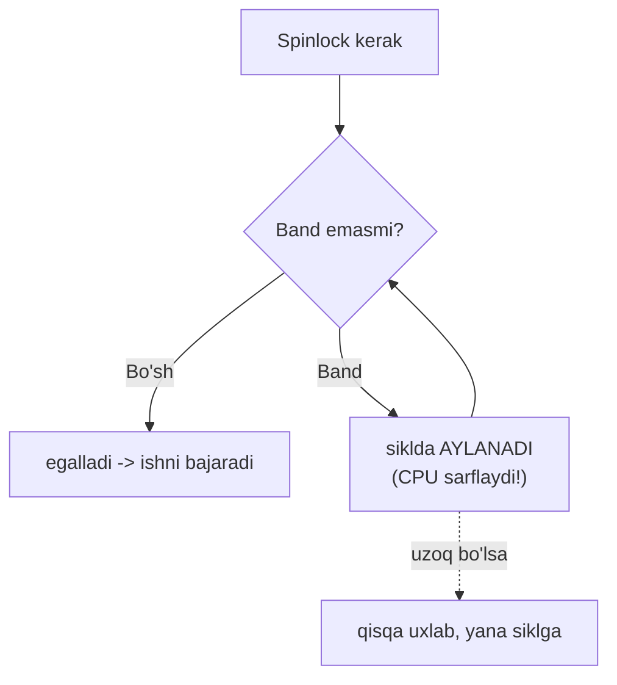
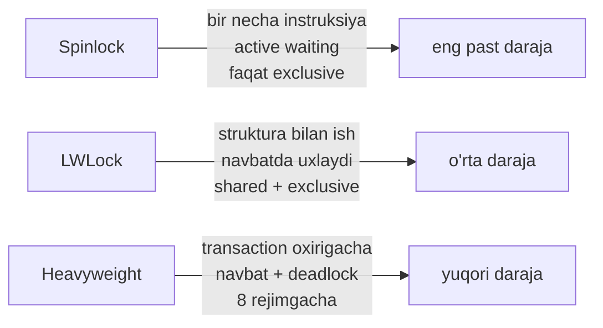
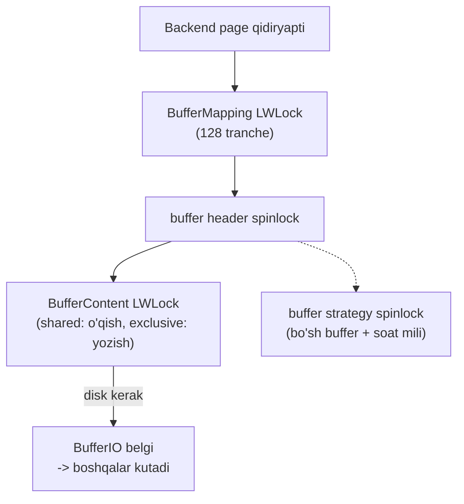
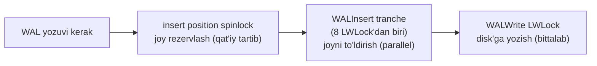
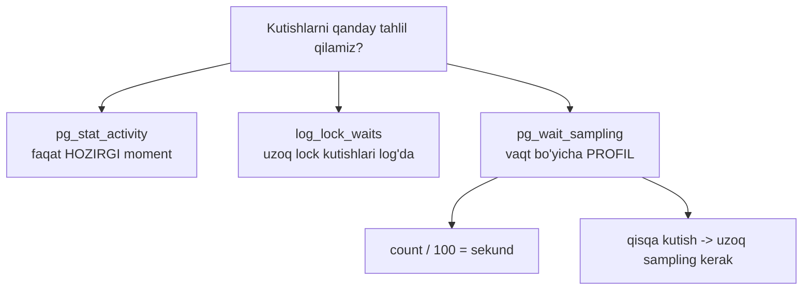

# 15. Memory locklar

> 📖 Manba: Рогов, "PostgreSQL 17 изнутри", 15-bob ("Блокировки в памяти")

## Nima uchun kerak?

12–14-darslarda **heavyweight** (og'ir) lock'larni o'rgandik: relation, row, object, advisory. Ular transaction oxirigacha ushlab turiladi, kutish navbati, deadlock aniqlash — hammasi bor. Bu boy infratuzilma **arziydi**, chunki himoyalanadigan ma'lumot ustidagi amallar undan qimmatroq (12-dars, 1-qism).

Lekin endi boshqa savol. 9-darsda **buffer cache**'ni o'rgandik — undagi hash table'ni **hamma backend'lar** baham ko'radi. Har safar biror backend cache'da page qidirsa, u shu hash table'ga tegadi. Bu **soniyada millionlab marta** sodir bo'ladi.

> Agar bunday tez-tez, juda qisqa amal uchun og'ir lock ochsak — infratuzilmaning o'zi (navbat, deadlock tekshiruvi) amalning o'zidan **ancha qimmatga** tushadi. Bu — poyafzalni bog'lash uchun har safar kran chaqirishga o'xshaydi.

Aynan shuning uchun umumiy xotiradagi strukturalarni himoya qilishga **yengilroq va arzonroq** lock'lar kerak. Bu dars ular haqida: **spinlock**, **lightweight lock (LWLock)**, ular buffer cache va WAL buffer'da qanday ishlatilishi, SLRU cache, va nihoyat — **wait event**'lar orqali monitoring.

```mermaid
mindmap
  root(("Memory locklar"))
    "Spinlock"
      "eng oddiy"
      "active waiting"
      "faqat exclusive"
    "LWLock"
      "hash table / ro'yxat"
      "shared + exclusive"
      "navbat bor"
    "Misollar"
      "buffer cache (9-dars)"
      "WAL buffer (10-dars)"
      "SLRU (clog, multixact)"
    "Monitoring"
      "wait_event_type"
      "pg_stat_activity"
      "pg_wait_sampling"
```

---

## 1-qism. Spinlock (spin-blokirovka)

Umumiy xotiradagi strukturalarni himoya qilish uchun oddiy og'ir lock'lar emas, bir necha turdagi **yengilroq va kam xarajatli** lock'lar ishlatiladi. Ularning eng oddiylari — **spinlock** (spinlok).

> **Spinlock** — juda qisqa vaqtga (bir necha protsessor instruksiyasi) egallash uchun mo'ljallangan; xotiraning alohida uchastkalarini bir vaqtda o'zgartirishdan himoya qiladi.

Spinlock protsessorning **atomar instruksiyalari** (masalan, **compare-and-swap**) asosida amalga oshiriladi. U **yagona exclusive rejimni** qo'llab-quvvatlaydi.

Eng qiziq jihati — **active waiting** (aktiv kutish):

> Agar lock band bo'lsa, kutayotgan jarayon **aktiv kutadi** — buyruq siklda **«aylanadi»** (spinning), nomi ham shundan. Agar lock ma'lum vaqtda olinmasa, jarayon qisqa to'xtaydi, keyin yana aktiv kutish siklini boshlaydi.



Bu strategiya **konflikt ehtimoli juda past** deb baholanganda mantiqiy: rad javob olsak ham, lock bir necha instruksiyadan keyin bo'shashini kutish mumkin.

> **Muhim:** oddiy heavyweight lock kutayotgan jarayon **uxlaydi** (CPU sarflamaydi, 12-dars). Spinlock esa **aktiv kutadi** — CPU sarflaydi. Shuning uchun spinlock faqat **juda qisqa** amallar uchun to'g'ri keladi.

Spinlock'lar **deadlock'ni aniqlay olmaydi**. Amaliy nuqtai nazardan faqat ularning mavjudligini bilish kifoya — butun mas'uliyat PostgreSQL ishlab chiquvchilarida.

---

## 2-qism. Lightweight lock (LWLock)

Keyingi tur — **lightweight lock** (yengil lock, LWLock). Ular data struktura bilan ishlash uchun kerakli qisqa vaqtga egallanadi (masalan, hash table yoki ko'rsatkichlar ro'yxati). Odatda qisqa ushlab turiladi, lekin ba'zi hollarda ular **I/O amallarini** himoya qiladi — shunda vaqt sezilarli bo'lishi mumkin.

Spinlock'dan farqli o'laroq, LWLock **ikki rejimga** ega:

| Rejim | Uchun |
|-------|-------|
| **Exclusive** | ma'lumotni o'zgartirish |
| **Shared** | faqat o'qish |

**Kutish navbati** qo'llab-quvvatlanadi, lekin lock shared rejimda ushlab turilganda **boshqa o'quvchilar navbatsiz o'tadi**. Yuqori parallellik va katta yuklamali tizimlarda bu **noxush effektlar** keltirishi mumkin (masalan, yozuvchi doim navbat oxirida qolib ketishi).

LWLock ham **deadlock tekshiruviga ega emas** — spinlock kabi, to'g'ri ishlatish mas'uliyati PostgreSQL ishlab chiquvchilarida.

### Spinlock vs LWLock vs Heavyweight



| | **Spinlock** | **LWLock** | **Heavyweight** |
|---|---|---|---|
| Vaqti | bir necha instruksiya | qisqa (ba'zan I/O) | transaction oxirigacha |
| Kutish | active (CPU sarflaydi) | navbatda uxlaydi | navbatda uxlaydi |
| Rejimlar | faqat exclusive | shared + exclusive | 8 tagacha |
| Deadlock aniqlash | yo'q | yo'q | **bor** |
| Monitoring | deyarli yo'q (v17: SpinDelay) | wait_event | pg_locks + wait_event |

---

## 3-qism. Misollar

Spinlock va LWLock qayerda va qanday ishlatilishini tushunish uchun umumiy xotiradagi ikki strukturani ko'ramiz: **buffer cache** (9-dars) va **WAL buffer'lar** (10-dars). Bu yerda lock'larning **hammasini emas**, faqat asosiylarini sanaymiz — to'liq manzara juda murakkab va faqat yadro ishlab chiquvchilariga qiziq.

### Buffer cache locklari (9-dars)

9-darsda ko'rgan edik: cache'da page topish uchun **hash table** ishlatiladi. Unga murojaat qilish uchun jarayon **`BufferMapping`** LWLock'ini egallashi kerak: o'qish uchun shared, o'zgartirish uchun exclusive.

Hash table'ga murojaat **juda faol** bo'lgani uchun bu lock ko'pincha **bottleneck** (tor joy) ga aylanadi. Granularity oshirish uchun u aslida **128 ta alohida LWLock'dan** iborat **tranche** (transh) sifatida tuzilgan — har biri hash table'ning o'z qismini himoya qiladi.

> **Tarixiy nuqta:** hash table'ni himoya qiluvchi yagona lock birinchi marta **16 o'lchamli** tranche'ga PostgreSQL 8.2 (2006) da aylantirildi. 10 yildan keyin, 9.5 versiyada tranche **128 gacha** oshirildi. Zamonaviy ko'p yadroli tizimlarda ba'zan bu ham kam.

Boshqa buffer cache lock'lari:

| Lock | Turi | Vazifasi |
|------|------|----------|
| `buffer header` | spinlock | buffer header'ga murojaat (nomi shartli — spinlock'larda tashqi nom yo'q) |
| `BufferContent` | LWLock | buffer mazmunini o'qish/o'zgartirish |
| `BufferIO` | «belgi» | disk'dan o'qish/yozish paytida — boshqalarga «I/O tugashini kut» signali |
| `buffer strategy` | spinlock | bo'sh buffer'lar ko'rsatkichi va **«soat mili»** (clock hand, siqib chiqarish mexanizmi) |

Ba'zi amallar (masalan, murojaat hisoblagichini oshirish) **umuman lock'siz** — protsessorning atomar instruksiyalari orqali bajariladi.

`BufferContent` odatda faqat row versiyalariga ko'rsatkichlarni o'qish uchun ushlab turiladi, keyin buffer'ning **pin** (zakreplenie, 9-dars) himoyasi yetarli bo'ladi. Mazmunni o'zgartirish uchun `BufferContent` **exclusive** rejimda olinishi kerak.



### WAL buffer locklari (10-dars)

10-darsda WAL (write-ahead log) mexanizmini ko'rgan edik. WAL cache'i uchun ham page → buffer moslashtiruvchi **hash table** ishlatiladi. Lekin buffer cache'dan farqli, u **yagona** LWLock — **`WALBufMapping`** bilan himoyalangan, chunki WAL cache ancha kichik (odatda bitta segmentga teng) va buffer'larga murojaat tartibliroq.

WAL page'larini disk'ga yozish **`WALWrite`** LWLock bilan himoyalangan — har momentda faqat **bitta jarayon** bu amalni bajarishi uchun.

WAL yozuvini yaratish ikki bosqichli:

1. Jarayon avval WAL page ichida **joy rezervlaydi**. Rezervlash **qat'iy tartibli** — jarayon insert ko'rsatkichini himoya qiluvchi **`insert position`** spinlock'ini egallashi kerak.
2. Rezervlangan joyni **to'ldirish** esa bir necha jarayon tomonidan bir vaqtda bajarilishi mumkin — buning uchun jarayon **`WALInsert`** tranche'ini tashkil qiluvchi **8 ta LWLock'dan istalganini** egallaydi.



### SLRU cache

**SLRU** (simple least-recently-used) cache'lari quyidagi strukturalar page'lari uchun ishlatiladi:

- **multixact** — multitransaction'lar (13-darsda ko'rdik);
- **clog** — transaction statuslari (commit/abort);
- **subtrans** — ichki (nested) transaction'lar.

Buffer cache'dan farqli, SLRU **ancha sodda** va shunga mo'ljallangan: asosiy o'zgarish va o'qish oqimi **oxirgi page'larga** to'g'ri keladi. Masalan, transaction'ni tugatish va uning holatini tekshirish odatda **taxminan bir vaqtda** bo'ladi, keyin bu holatga hech kim murojaat qilmaydi. Eng uzoq murojaat qilinmagan page'lar siqib chiqariladi.

> **Bank strukturasi:** cache **16 page'li banklarga** bo'lingan; page qaysi bankka tegishliligini uning raqamining **4 ta kichik biti** aniqlaydi. Bu sxema hash table'siz ishlashga imkon beradi — kichik bank ichida **chiziqli qidiruv** yetarli.

Har bank o'z LWLock'i bilan himoyalangan (tranche nomi strukturaga bog'liq: clog uchun tranche = **`XactSLRU`**). Har page ham o'z LWLock'iga ega — **`Buffer`** (clog uchun — **`XactBuffer`**).

Jarayonlar bankdagi buffer'lar holatini olish/o'zgartirish uchun **bank lock'ini** ushlaydi. Bank lock disk'ga yozish/o'qish uchun page lock'ini egallashda ham kerak, lekin **I/O vaqtida bank lock bo'shatiladi** — shunda boshqa jarayonlar shu bankning boshqa page'lari bilan ishlay oladi.

---

## 4-qism. Wait event'lar orqali monitoring

Lock'lar to'g'ri ishlash uchun kerak, lekin ular **nomaqbul kutishlar**ga ham olib kelishi mumkin. Bu kutishlarni kuzatish sabab topishga yordam beradi.

### Eng oddiy usul: log_lock_waits

12-darsda ko'rdik: `log_lock_waits` (default **off**) yoqilganda, transaction lock'ni `deadlock_timeout` (1s) dan uzoq kutsa, server log'iga batafsil ma'lumot yoziladi.

### To'liqroq usul: pg_stat_activity

Ancha to'liq ma'lumot `pg_stat_activity` view'ida. Jarayon (tizim yoki backend) ishini bajara olmay biror narsani kutganda, bu **`wait_event_type`** (kutish turi) va **`wait_event`** (aniq kutish nomi) ustunlarida ko'rinadi.

Barcha kutishlarni bir necha turga bo'lish mumkin:

**Lock'lar kutishi (katta kategoriya):**

| wait_event_type | Nima |
|-----------------|------|
| `Lock` | heavyweight lock'lar (12–14-dars) |
| `LWLock` | lightweight lock'lar (bu dars) |
| `BufferPin` | pin qilingan buffer (9-dars) |

`LWLock` uchun aniq nom — lock yoki tegishli **tranche** nomi (masalan `WALWrite`, `BufferMapping`).

**Boshqa kutishlar:**

| wait_event_type | Nima |
|-----------------|------|
| `IO` | ma'lumot yozish/o'qish |
| `Client` | klientdan ma'lumot (psql ko'p vaqtini shunda o'tkazadi) |
| `IPC` | boshqa jarayondan ma'lumot |
| `Extension` | extension ro'yxatdan o'tkazgan maxsus hodisa |
| `InjectionPoint` (v17) | test uchun kod nuqtasi (ekspluatatsiyada chiqmaydi) |

**«Normal» kutishlar** (odatda muammo emas):

| wait_event_type | Nima |
|-----------------|------|
| `Activity` | fon jarayonlari asosiy siklida (autovacuum launcher, walwriter...) |
| `Timeout` | taymer |

> **Nozik nuqta:** `Timeout` turidagi **`SpinDelay`** (v17) hodisasi — **spinlock kutishini** bildiradi. Spinlock'lar odatda monitoring'siz edi, lekin v17'da bu qo'shildi.

Muhim ogohlantirish: view faqat **kodda tegishli tarzda qayta ishlangan** kutishlarni ko'rsatadi. Agar kutish turi nomi aniqlanmagan bo'lsa, jarayon hech qanday ma'lum kutishda emas — bu vaqt **«hisobga olinmagan»** (unaccounted) deb qaraladi, chunki bu 100% jarayon hech nima kutmayapti degani emas.

```sql
=> SELECT backend_type, wait_event_type AS event_type, wait_event
   FROM pg_stat_activity;
         backend_type          | event_type |    wait_event
-------------------------------+------------+-------------------
 client backend                |            |
 autovacuum launcher           | Activity   | AutovacuumMain
 logical replication launcher  | Activity   | LogicalLauncherMain
 walwriter                     | Activity   | WalWriterMain
 background writer             | Activity   | BgwriterMain
 checkpointer                  | Activity   | CheckpointerMain
(6 rows)
```

Bu holatda barcha fon jarayonlari «bekor turibdi» (Activity), backend esa so'rov bajarib, hech nima kutmayapti (bo'sh event).

---

## 5-qism. Sampling (pg_wait_sampling)

`pg_stat_activity`'ning jiddiy cheklovi bor:

> U kutishlarni **faqat joriy moment** uchun ko'rsatadi; statistika **to'planmaydi**. Vaqt bo'yicha manzara olishning yagona yo'li — view holatini ma'lum interval bilan **sampling** qilish (namuna olish).

Sampling **ehtimollik xarakteriga** ega: kutish sampling davriga nisbatan qancha qisqa bo'lsa, uning qayd etilishi ehtimoli shuncha past. Shuning uchun qisqa umrli seanslar tahlili uchun sampling deyarli befoyda; ishonchli manzara uchun uzoq vaqt kerak. Sampling chastotasini oshirish esa qo'shimcha xarajatni oshiradi.

O'rnatilgan sampling vositasi yo'q, lekin **`pg_wait_sampling`** extension'i shu ishni bajaradi. Kutubxonani `shared_preload_libraries`'ga yozib, server'ni **qayta ishga tushirish** kerak:

```sql
=> ALTER SYSTEM SET shared_preload_libraries = 'pg_wait_sampling';
-- server restart
=> CREATE EXTENSION pg_wait_sampling;
```

Extension kutishlar **profilini** — butun ish davomida to'plangan statistikani — beradi. Masalan, `pgbench` etalon testi ishlaganda kutishlarni ko'ramiz:

```sql
=> SELECT pid, event_type, event, count
   FROM pg_wait_sampling_profile WHERE pid = 51625
   ORDER BY count DESC LIMIT 4;
  pid  | event_type |  event   | count
-------+------------+----------+-------
 51625 | IO         | WalSync  | 5259
 51625 |            |          | 518
 51625 | IO         | WalWrite | 20
 51625 | LWLock     | WALWrite | 3
(4 rows)
```

> **Parametr:** `pg_wait_sampling.profile_period` (default **10ms**) — qiymatlar sekundiga **100 marta** saqlanadi. Shuning uchun kutish davomiyligini sekundlarda baholash uchun `count`'ni **100 ga bo'lish** kerak.

Bu misolda kutishlarning katta qismi **WAL yozuvlarini disk bilan sinxronlash** (`WalSync`) ga to'g'ri keladi. Ikkinchi qatordagi bo'sh `event` — aynan yuqorida aytilgan **«hisobga olinmagan vaqt»**.

Agar fayl tizimini **sun'iy sekinlashtirsak** (masalan `slowfs` bilan, har I/O 0.1s), profil o'zgaradi:

```sql
=> SELECT pid, event_type, event, count
   FROM pg_wait_sampling_profile WHERE pid = 52056
   ORDER BY count DESC LIMIT 4;
  pid  | event_type |     event      | count
-------+------------+----------------+-------
 52056 | IO         | WalWrite       | 5310
 52056 | LWLock     | WALWrite       | 110
 52056 | IO         | WalSync        | 99
 52056 | IO         | DataFileExtend | 19
(4 rows)
```

Endi birinchi o'ringa **I/O amallari** chiqdi (WAL'ni sinxron rejimda yozish). WAL yozuvi `WALWrite` LWLock bilan himoyalangani uchun, mos qator ham profilda bor. Bu lock oldingi misolda ham so'ralgan edi, lekin uning kutishi sampling davridan qisqaroq bo'lgani uchun namunaga juda kam tushgan yoki umuman tushmagan.

> **Asosiy xulosa:** qisqa kutishlarni tahlil qilish **yetarlicha uzoq** sampling talab qiladi — aks holda ular statistikaga tushmasligi mumkin.



---

## Xulosa

- Umumiy xotira strukturalarini og'ir lock bilan himoya qilish **juda qimmat** (infratuzilma amaldan qimmat), shuning uchun **yengilroq** lock'lar ishlatiladi: spinlock va LWLock.
- **Spinlock** — bir necha instruksiyaga, faqat **exclusive**, **active waiting** (CPU sarflab siklda aylanadi). Konflikt ehtimoli juda past bo'lganda mantiqiy. Deadlock aniqlamaydi.
- **LWLock** — struktura bilan ishlash uchun, **shared + exclusive**, kutish navbati bor (lekin shared ushlanganda o'quvchilar navbatsiz o'tadi). Deadlock aniqlamaydi.
- **Buffer cache** (9-dars): hash table `BufferMapping` LWLock (**128 tranche**), buffer header — spinlock, `BufferContent` — LWLock, `BufferIO` — belgi, `buffer strategy` — spinlock.
- **WAL buffer** (10-dars): hash table `WALBufMapping` (bitta LWLock), disk yozish `WALWrite`, joy rezervlash `insert position` spinlock, to'ldirish `WALInsert` (**8 tranche**).
- **SLRU cache** — multixact, clog, subtrans uchun; **16 page'li banklarga** bo'lingan (hash table'siz, chiziqli qidiruv), har bank va page o'z LWLock'iga ega; I/O vaqtida bank lock bo'shatiladi.
- Monitoring: `pg_stat_activity`'ning `wait_event_type` (`Lock`/`LWLock`/`BufferPin`/`IO`/`Client`/...) va `wait_event`. `SpinDelay` (v17) — spinlock kutishi. Aniqlanmagan kutish — «hisobga olinmagan vaqt».
- `pg_stat_activity` faqat **joriy moment**; vaqt bo'yicha manzara uchun **sampling** kerak — `pg_wait_sampling` (profile_period 10ms → count/100 = sekund). Qisqa kutishlar uzoq sampling talab qiladi.

## Nazorat savollari

1. Nima uchun umumiy xotira strukturalarini heavyweight lock bilan himoya qilish samarasiz? Spinlock va LWLock bu muammoni qanday hal qiladi?
2. Spinlock qanday kutadi (active waiting) va bu heavyweight lock'ning kutishidan qanday farq qiladi? Bu strategiya qaysi shartda mantiqiy?
3. LWLock spinlock'dan qanday farq qiladi (rejimlar, navbat)? Shared rejimda «o'quvchilar navbatsiz o'tishi» qanday noxush effekt keltirishi mumkin?
4. Buffer cache'dagi `BufferMapping` nima uchun **128 ta** alohida lock'dan iborat tranche sifatida tuzilgan? Bu qanday muammoni hal qiladi?
5. WAL yozuvini yaratishning ikki bosqichini ayting. Nima uchun rezervlash (`insert position`) bittalab, to'ldirish (`WALInsert`) esa parallel bo'ladi?
6. SLRU cache buffer cache'dan qanday farq qiladi? Nima uchun u hash table'siz ishlaydi (bank sxemasi)? I/O vaqtida bank lock nega bo'shatiladi?
7. `pg_stat_activity`'dagi `wait_event_type`'ning asosiy turlarini ayting. `Activity` va `Lock` orasidagi farq nima? `SpinDelay` nimani bildiradi?
8. Nima uchun `pg_stat_activity` yetarli emas va sampling kerak? Sampling'ning ehtimollik xarakteri nima uchun qisqa kutishlarni «yashiradi»? `count`'ni sekundga qanday aylantiramiz?
