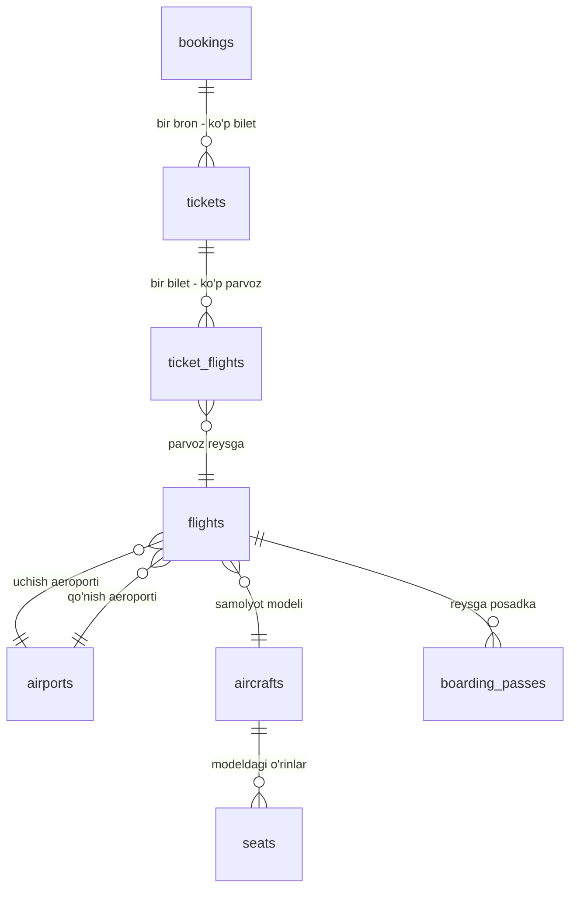
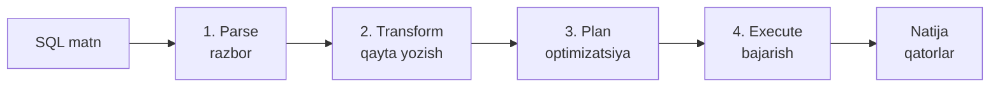
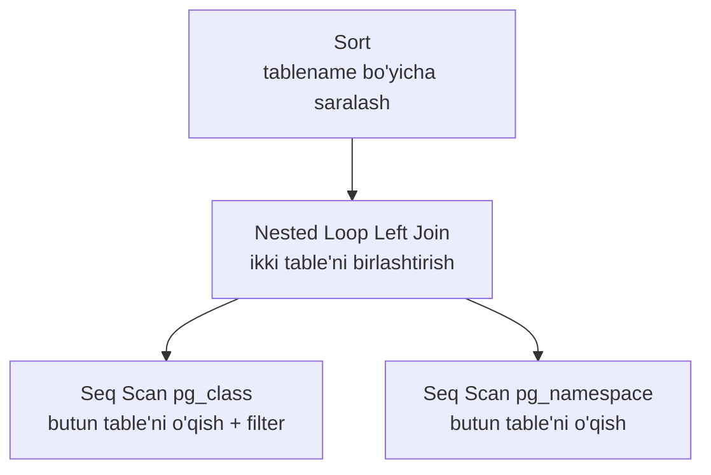
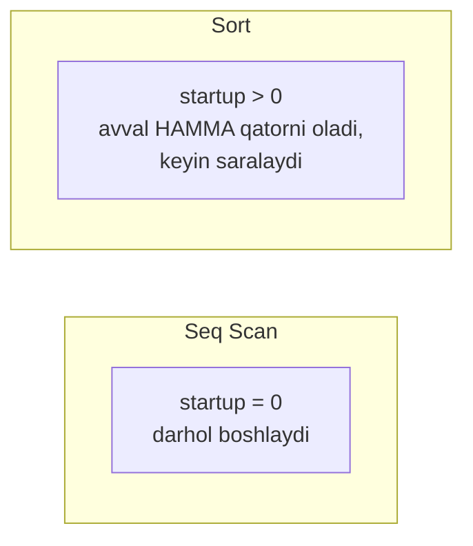
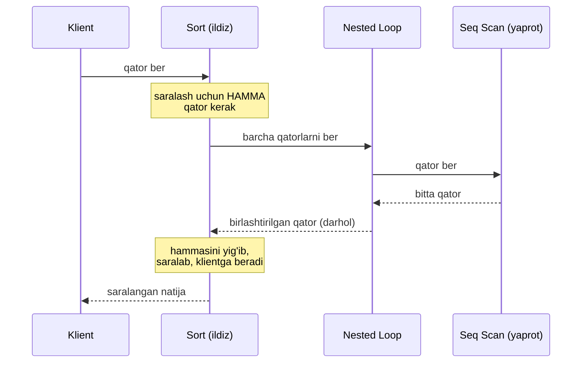
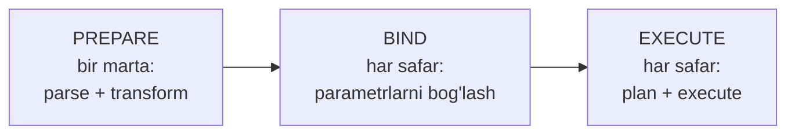
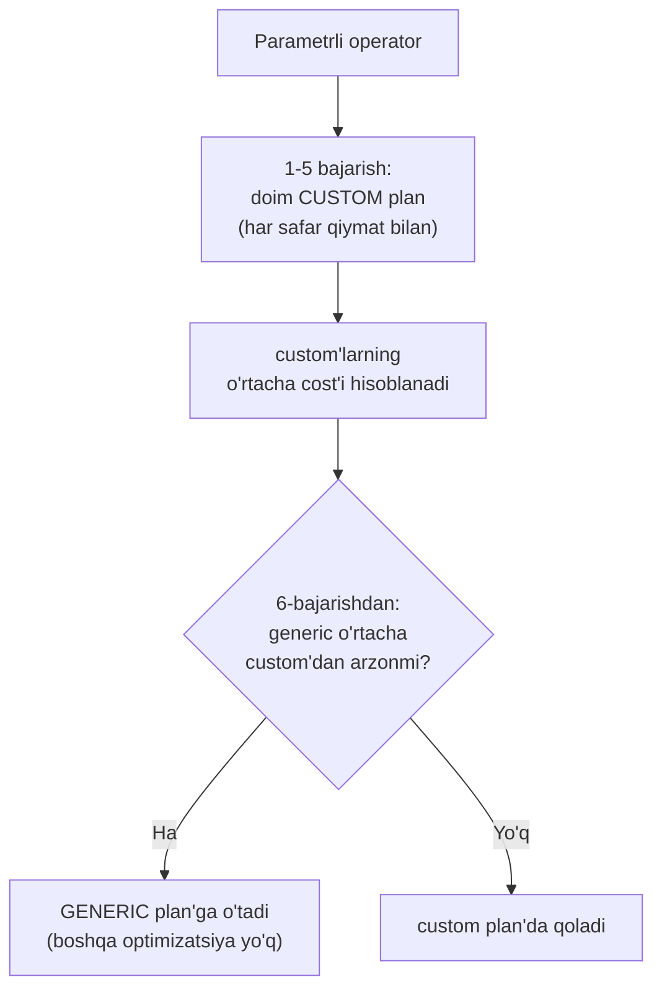

# 16. Query bajarilish bosqichlari

> 📖 Manba: Рогов, "PostgreSQL 17 изнутри", 16-bob ("Этапы выполнения запросов")

## Nima uchun kerak?

Bu darsdan kitobning **IV qismi** — "Query execution" (so'rovlarni bajarish) boshlanadi. Shu paytgacha biz PostgreSQL'ni **quyidan yuqoriga** o'rgandik: ma'lumot page va tuple ko'rinishida qanday saqlanadi (3-dars), snapshot orqali qanday ko'rinadi (4-dars), VACUUM uni qanday tozalaydi (6-dars), WAL uni qanday himoya qiladi (10-11-dars), lock'lar parallel ishni qanday muvofiqlashtiradi (12-15-dars).

Endi **yuqoridan** qaraymiz: siz `SELECT ... FROM ... WHERE ...` yozib `Enter` bosganingizda, server aynan **nima qiladi**? Bu savolning javobi ikki sababdan muhim:

- **EXPLAIN'ni tushunish uchun.** Har bir sekin so'rovni tahlil qilishda siz `EXPLAIN` chiqishini o'qiysiz. Uning ichida `cost`, `rows`, `Seq Scan`, `Nested Loop` degan narsalar bor — bularning har biri aynan shu darsda tug'iladi.
- **Nega so'rov sekin ekanini tushunish uchun.** Bir xil natijani beradigan so'rovni server o'nlab xil usulda bajarishi mumkin — ba'zilari millisekund, ba'zilari daqiqa. Tanlovni **planner** qiladi. Planner qanday ishlashini bilmasangiz, uni to'g'ri yo'naltira olmaysiz.

Bir jumlada: **bu dars — keyingi 15 ta darsning (table access, index, join, sort, hashing) xaritasi.** Bu yerda umumiy manzarani ko'ramiz, keyin har bir tugunni alohida ochamiz.

```mermaid
mindmap
  root(("Query<br/>bajarilishi"))
    "Demo baza"
      "avia parvozlar"
      "bookings, tickets, flights"
      "keyingi darslar shu bazada"
    "Simple protocol"
      "parse (razbor)"
      "transform (rewrite)"
      "plan (optimizatsiya)"
      "execute (portal)"
    "Plan tree"
      "cost + rows"
      "EXPLAIN"
      "cardinality va selectivity"
    "Extended protocol"
      "prepare"
      "parameter binding"
      "generic vs custom plan"
      "cursor, fetch"
```

---

## 1-qism. Demo baza — avia parvozlar

Shu paytgacha biz bir necha qatorli oddiy table'lar (`accounts`, `vac`) bilan ishladik. Ular izolyatsiya yoki VACUUM'ni ko'rsatish uchun yetarli edi. Lekin so'rovlarni bajarishni o'rganish uchun bizga **o'zaro bog'langan, ko'p qatorli** table'lar kerak — planner faqat katta ma'lumotda o'zini ko'rsatadi.

Har bir misol uchun alohida ma'lumot to'plami o'ylab topish o'rniga, kitob **avia parvozlar demo bazasi**dan foydalanadi. Biz ham shundan foydalanamiz — **17-darsdan boshlab barcha keyingi darslar** aynan shu bazada ishlaydi, shuning uchun uni bir marta yaxshilab tanishtirib olamiz.

> **Eslatma.** Demo baza — real aviakompaniya tizimining **rezerv nusxasi** kabi: u ma'lum bir momentgacha bo'lgan haqiqiy ma'lumotni saqlaydi. O'sha "hozir" momenti `bookings.now()` funksiyasida yozilgan — so'rovlarda oddiy `now()` o'rniga shuni ishlatish kerak (chunki ma'lumot 2017-yildagi holatda muzlatilgan).

### Asosiy obyektlar

| Table / View | Ma'nosi |
|---|---|
| `bookings` | **Bron** — asosiy sushnost. Bitta bronga bir necha yo'lovchi kirishi mumkin |
| `tickets` | **Bilet** — har bir yo'lovchiga elektron bilet beriladi |
| `ticket_flights` | **Bilet parvozlari** — bir bilet bir yoki bir necha parvozni o'z ichiga oladi (transfer yoki "u yoq-bu yoq") |
| `flights` | **Reys** — bir aeroportdan boshqasiga uchish, aniq sana bilan |
| `airports` | **Aeroportlar** (view) |
| `aircrafts` | **Samolyot modellari** (view) |
| `boarding_passes` | **Posadka taloni** — ro'yxatdan o'tganda beriladi, o'rin raqami bilan |
| `seats` | **O'rinlar** — samolyot modelidagi o'rinlar va ularning xizmat klasslari |
| `routes` | **Marshrutlar** (view) — reyslardan aniq sanaga bog'liq bo'lmagan marshrut ma'lumotini ajratadi |



> **Nozik nuqta — ikki til.** Aeroport, shahar va samolyot modellari nomlari `airports_data` va `aircrafts_data` bazaviy table'larida **ikki tilda** (ruscha va inglizcha) saqlanadi. So'rovlarda odatda `airports` va `aircrafts` **view'lari** ishlatiladi — ular `bookings.lang` parametriga qarab tarjimani almashtiradi. Lekin **plan'da** bazaviy table nomlari (`airports_data`, `aircrafts_data`) ko'rinib qolishi mumkin — buni EXPLAIN o'qiyotganda esda tuting.

---

## 2-qism. Simple query protocol

Klient serverga so'rov yuborishning eng oddiy usuli — **simple query protocol** (oddiy so'rov protokoli). Klient so'rov **matnini** yuboradi, server esa javobda **to'liq natijani** qaytaradi — qatorlar soni qancha bo'lishidan qat'i nazar.

Serverga kelgan so'rov to'rt bosqichdan o'tadi. Buni **restoran** bilan solishtiring: siz ofitsiantga buyurtma aytasiz (matn), oshxona uni **tushunadi** (parse), retsept bo'yicha **qayta ifodalaydi** (transform), pishirishning **eng tez yo'lini rejalashtiradi** (plan), va nihoyat **tayyorlaydi** (execute).



### Bosqich 1 — Parse (razbor)

Avvalo so'rov matnini **tahlil qilish** (parse) kerak — server nima talab qilinayotganini tushunishi shart.

Bu ikki qadamda bo'ladi:

1. **Leksik tahlil** — matnni **leksema**larga (kalit so'zlar, satr va son literallari, vergul kabi belgilar) ajratadi.
2. **Sintaktik tahlil** — leksemalar to'plami tilning **grammatikasiga** mos kelishini tekshiradi.

PostgreSQL bu ish uchun standart vositalarni — **Flex** (leksik) va **Bison** (sintaktik) utilitalarini ishlatadi. Natija xotirada **abstrakt sintaksis daraxti** (AST — abstract syntax tree) ko'rinishida saqlanadi.

Masalan, quyidagi so'rov:

```sql
SELECT schemaname, tablename
FROM pg_tables
WHERE tableowner = 'postgres'
ORDER BY tablename;
```

Bundan daraxt quriladi. Uning tugunlarida so'rovning qismlari joylashadi: `QUERY` ildizi, `TARGETENTRY` (nima tanlanadi), `FROMEXPR`, ichida `RTE` va shartlar uchun `OPEXPR`.

> **RTE nima?** Bu — **Range Table Entry** qisqartmasi. PostgreSQL manba kodida *range table* deb table'lar, subquery'lar, join natijalari — bir so'z bilan, SQL operatorlari ustida ishlaydigan **qator to'plamlari** ataladi.

Keyin **semantik tahlil** bo'ladi: so'rov nomlar bilan murojaat qilayotgan table va obyektlar bazada **bor-yo'qligini** hamda foydalanuvchida ularga **huquq bor-yo'qligini** tekshiradi. Bu ma'lumotning hammasi **system catalog**da (1-darsda ko'rganmiz) saqlanadi. Semantik analizator daraxtni aniq obyektlarga havolalar va ma'lumot tiplari bilan **boyitadi**.

> To'liq razbor daraxtini `debug_print_parse` parametri orqali server log'ida ko'rish mumkin, ammo amalda undan foyda kam.

### Bosqich 2 — Transform (qayta yozish / rewrite)

Keyin so'rov **transformatsiya** (qayta yozish) qilinishi mumkin. Buning bir necha maqsadi bor, eng muhimi — **VIEW'ni ochish**.

Yuqoridagi misolda `pg_tables` — bu **view**. Uning ta'rifini so'rov matniga qo'ysak, taxminan mana bunday bo'ladi:

```sql
SELECT schemaname, tablename
FROM (
  -- pg_tables view'ning ichi
  SELECT n.nspname AS schemaname,
         c.relname AS tablename,
         pg_get_userbyid(c.relowner) AS tableowner,
         ...
  FROM pg_class c
  LEFT JOIN pg_namespace n ON n.oid = c.relnamespace
  LEFT JOIN pg_tablespace t ON t.oid = c.reltablespace
  WHERE c.relkind = ANY (ARRAY['r'::char, 'p'::char])
) 
WHERE tableowner = 'postgres'
ORDER BY tablename;
```

Diqqat: server aslida **matn bilan ishlamaydi** — barcha manipulyatsiyalarni faqat **daraxt ustida** bajaradi. Yuqoridagi matn — bizga tushunarli bo'lishi uchun. Transformatsiyadan keyin daraxtda uchta `RTE` (`pg_class`, `pg_namespace`, `pg_tablespace`) va ular orasidagi `JOINEXPR` tugunlari paydo bo'ladi.

Transformatsiyaning boshqa qo'llanishlari:

- **Row-level security** (qatorlar darajasida ruxsatni cheklash) — so'rovga yashirin shartlar qo'shadi.
- Rekursiv so'rovlar uchun `SEARCH` va `CYCLE` tugunlarini ochish.
- Foydalanuvchi o'zi yozadigan **qayta yozish qoidalari** (rules) — kuchli, lekin murakkab va tushunish qiyin mexanizm.

> **Amaliy maslahat.** Aksariyat hollarda `rules` o'rniga **trigger** ishlatish qulayroq va xavfsizroq. Rules'ni faqat juda zarur bo'lganda qo'llang. Qayta yozilgan daraxtni `debug_print_rewritten` parametri orqali ko'rish mumkin.

Muhim jihat: razbor daraxti so'rovning **sintaktik tuzilishini** aks ettiradi, lekin operatsiyalar **qanday tartibda** bajarilishi haqida hech narsa aytmaydi. Buni keyingi bosqich hal qiladi.

### Bosqich 3 — Plan (planlashtirish / optimizatsiya)

SQL — **deklarativ** til: so'rov *qanday* ma'lumot kerakligini aytadi, lekin uni *qanday olishni* aytmaydi. Bu — GPS'da manzilni kiritganga o'xshaydi: siz "qayerga borishni" aytasiz, marshrutni **navigator** tanlaydi.

Har bir so'rovni **turli usullar** bilan bajarish mumkin:

- Table'dan ma'lumotni butun table'ni o'qib (keraksizini tashlab) yoki **index** orqali kerakli qatorlarni topib olish mumkin.
- Qator to'plamlari doim **juftma-juft** birlashtiriladi — bu join tartibiga qarab juda ko'p variant beradi.
- Join'ning o'zi ham turli algoritmlar bilan bo'ladi (nested loop, hash join, merge join — keyingi darslar).

Optimal va noptimal reja o'rtasidagi bajarilish vaqti farqi **necha barobar** bo'lishi mumkin, shuning uchun **planner** — tizimning eng murakkab komponentlaridan biri.

**Plan tree (reja daraxti).** Bajarilish rejasi ham daraxt ko'rinishida, lekin uning tugunlarida **mantiqiy emas, fizik** operatsiyalar turadi. Amalda bu daraxtning matnli ko'rinishini **EXPLAIN** buyrug'i chiqaradi:

```sql
=> EXPLAIN SELECT schemaname, tablename
   FROM pg_tables
   WHERE tableowner = 'postgres'
   ORDER BY tablename;
                              QUERY PLAN
-----------------------------------------------------------------
 Sort  (cost=22.36..22.37 rows=1 width=128)
   Sort Key: c.relname
   ->  Nested Loop Left Join  (cost=0.00..22.35 rows=1 width=128)
         Join Filter: (n.oid = c.relnamespace)
         ->  Seq Scan on pg_class c  (cost=0.00..21.26 rows=1 width=72)
               Filter: ((relkind = ANY ('{r,p}'::"char"[])) AND ...)
         ->  Seq Scan on pg_namespace n  (cost=0.00..1.04 rows=4 ...)
(7 rows)
```

Bu chiqishda ikki narsaga e'tibor bering:

- So'rovdagi **uch table'dan** rejada faqat **ikkitasi** qoldi. Planner tushundiki, uchinchi table (`pg_tablespace`) natija uchun kerak emas — uni daraxtdan **olib tashladi**.
- Har bir tugunga **kutilayotgan qatorlar soni** (`rows`) va **narx** (`cost`) yozilgan.



`Seq Scan` (sequential scan) tugunlari table'ni o'qishga, `Nested Loop` esa join'ga mos keladi (bularning har birini keyingi darslarda ochamiz).

#### Rejalar orasidan tanlash — cost-based optimizer

PostgreSQL **narxga asoslangan optimizator** (cost-based optimizer) ishlatadi. Optimizator mumkin bo'lgan rejalarni ko'rib chiqadi va har biri uchun kerak bo'ladigan **resurslarni** (disk I/O, protsessor takti) baholaydi. Bu baho raqamli ko'rinishga keltirilgani — rejaning **cost'i** (narxi). Ko'rilgan rejalardan **eng kichik narxlisi** tanlanadi.

Muammo: mumkin bo'lgan rejalar soni birlashtirilayotgan table'lar soniga **eksponensial** bog'liq. 10 tadan ortiq join bo'lsa, barcha variantni ko'rib chiqish **imkonsiz**. Buni cheklash uchun bir necha mexanizm bor:

| Parametr | Default | Vazifasi |
|---|---|---|
| `join_collapse_limit` | 8 | `JOIN`'larni tekis ro'yxatga "yassilash" chegarasi |
| `from_collapse_limit` | 8 | Subquery'larni yassilash chegarasi |
| `geqo` | on | Ko'p join'da genetik algoritmga o'tish |
| `geqo_threshold` | 12 | Genetik algoritm yoqiladigan element soni |

> **Nega bu muhim?** `join_collapse_limit = 1` qo'ysangiz, `JOIN`'lar tartibi so'rovda yozilganidek **saqlanadi** — planner ularni qayta tartiblamaydi. Bu — juda ko'p join'li murakkab so'rovda planner adashsa, tartibni **qo'lda boshqarish** usuli. `EXPLAIN (MEMORY)` (v17) planlashga ketgan xotirani ham ko'rsatadi — table qo'shilgani sayin u eksponensial "pog'onalar" bilan o'sadi.

#### Eng yaxshi reja: startup cost va total cost

Klient uchun reja "optimalligi" natijadan **qanday foydalanishga** bog'liq. Agar natija **to'liq** kerak bo'lsa (hisobot qurish), reja barcha qatorlarni olishni optimallashtirishi kerak. Agar **birinchi qatorlarni tez** ko'rsatish kerak bo'lsa (ekranga chiqarish), butunlay boshqa reja kerak bo'ladi.

PostgreSQL buni **ikkita narx komponentasi** hisoblab hal qiladi. `cost=22.36..22.37` yozuvidagi ikki son:

- **Startup cost** (`22.36`) — tugunni **ishga tushirishga** tayyorgarlik xarajati (birinchi qator chiqishidan oldingi ish).
- **Total cost** (`22.37`) — **barcha** natija qatorlarini olishning to'liq xarajati.



Ba'zi tugunlar (masalan `Seq Scan`) darhol ishlay boshlaydi — ularda **startup cost = 0**. Boshqalari (masalan `Sort`) avval **hamma** qatorni olishga majbur — ularda startup cost **noldan katta** (yuqori tugunga bitta qator kerak bo'lsa ham, bu narxni to'lash kerak).

Planner qaysi rejani afzal ko'rishni **cursor ishlatilishiga** qarab hal qiladi:

- Cursor **yo'q** bo'lsa — barcha qatorlar darhol kerak deb, eng kichik **total cost'li** reja tanlanadi.
- Cursor **bor** bo'lsa — faqat bir ulush qatorni olish optimallashtiriladi. Formula:

```
startup_cost + cursor_tuple_fraction × (total_cost − startup_cost)
```

`cursor_tuple_fraction` default'da **0.1** — ya'ni cursor natijaning **10%**ini oladi deb faraz qilinadi.

> **Muhim.** Cost — bu planner'ning **bahosi**, real bajarilish vaqti emas. U faqat **bir xil so'rovning turli rejalarini** taqqoslash uchun kerak. Ikki **har xil** so'rovni cost bo'yicha solishtirish — **noto'g'ri va ma'nosiz**.

#### Cardinality va selectivity — rows qayerdan keladi?

`EXPLAIN`dagi `rows` sonini planner **qayerdan oladi?** Bu — **cardinality** (kardinallik) bahosi, ya'ni tugundan chiqadigan qatorlar soni. U rekursiv hisoblanadi:

1. Har bir **bola tugun**ning cardinality'sini baholab, tugunga **kiradigan** qatorlar sonini olamiz.
2. Tugunning o'zining **selectivity'sini** — kiruvchi qatorlarning **chiqishda qoladigan ulushini** baholaymiz.
3. **Ko'paytma** — tugunning cardinality'sini beradi.

> **Selectivity — 0 dan 1 gacha son.** Nolga yaqin selectivity **yuqori** (kam qator qoldiradi), birga yaqin — **past** (deyarli hamma qatorni qoldiradi) deyiladi. Bu mantiqsiz tuyulishi mumkin, lekin selectivity — bu **tanlanuvchanlik**: oz qator tanlaydigan shart yuqori tanlanuvchan hisoblanadi.

Oddiy shartlarning selectivity'si ma'lum bo'lsa, mantiqiy operatsiyalar bilan tuzilgan shartlar **formulalar** bilan hisoblanadi:

```
sel(x AND y) = sel(x) × sel(y)
sel(x OR y)  = 1 − (1 − sel(x)) × (1 − sel(y)) = sel(x) + sel(y) − sel(x) × sel(y)
```

> **Ehtiyot bo'ling!** Bu formulalar `x` va `y` predikatlar **bir-biridan mustaqil** deb faraz qiladi. Agar predikatlar **korrelyatsiyalangan** bo'lsa (masalan "shahar = Moskva AND aeroport = SVO"), baho **noto'g'ri** chiqadi. Buni tuzatish uchun **multivariate statistics** kerak — bu 17-darsning mavzusi.

Bir muhim ogohlantirish: pastki tugunda yuzaga kelgan cardinality **xatosi yuqoriga tarqaladi**, oxirida butun reja noto'g'ri tanlanishiga olib keladi. Planner'ning asosiy xatolari aynan noto'g'ri cardinality baholashdan kelib chiqadi. Va bularning hammasi to'g'ri **statistikaga** bog'liq (17-dars).

### Bosqich 4 — Execute (bajarish / portal)

Optimizatsiyada qurilgan reja **bajarishga** uzatiladi. Xizmat ko'rsatuvchi jarayon xotirasida **portal** yaratiladi — bu bajarilayotgan so'rovning holatini saqlaydigan obyekt. Holat reja daraxtini takrorlaydigan daraxt ko'rinishida.

Amalda daraxt tugunlari **konveyer** kabi ishlaydi — bir-biridan qatorlarni **so'rab-uzatib** turadi. Bu — **iterator (pull) modeli**: ildiz tugun boladan qator so'raydi, u o'z boladan so'raydi va hokazo — to yaprot tugunga (table o'qishga) yetguncha.



Bu modelda tugunlar ikki xil bo'ladi:

- **Qator saqlamaydigan** tugunlar (masalan `Nested Loop`, `Seq Scan`) — qatorni oladi, darhol yuqoriga uzatadi va **unutadi**. Shu tufayli `LIMIT` bilan cheklangan so'rov **to'liq bajarilmaydi**: yuqori tugunga yetarli qator yetkazilgach, ish to'xtaydi.
- **Qator saqlashi kerak** bo'lgan tugunlar (masalan `Sort`) — ishni boshlash uchun **hamma** ma'lumotni yig'ib olishi shart.

Saqlash uchun xotirada `work_mem` (default **4MB**) hajmli fragment ajratiladi; xotira yetmasa, ma'lumot **vaqtinchalik faylga** disk'ga tushiriladi.

> **Muhim.** Bir rejada bir necha saqlovchi tugun bo'lsa, har biriga **alohida** `work_mem` fragment ajratiladi. Ya'ni bitta so'rov ishlatadigan umumiy operativ xotira `work_mem` bilan **cheklanmagan** — bu ko'p ulanishli serverda xotira portlashiga sabab bo'lishi mumkin.

---

## 3-qism. Extended query protocol

Simple protokolda har bir buyruq, **takrorlansa ham**, to'rt bosqichning barchasidan qaytadan o'tadi: parse → transform → plan → execute. Bu ikki muammoni tug'diradi:

1. **Bir xil so'rovni qayta-qayta razbor qilishning ma'nosi yo'q.** Faqat **konstantalari** farq qiladigan so'rovlar (masalan `WHERE id = 1` va `WHERE id = 2`) ham bir xil razbor daraxtiga ega — ularni qayta razbor qilish behuda ish.
2. **Klient butun natijani birdaniga oladi** — qanchalik katta bo'lmasin.

**Extended query protocol** (kengaytirilgan protokol) ushbu bosqichlarni **alohida-alohida** boshqarish imkonini beradi. SQL darajasida buni `PREPARE`/`EXECUTE` va `DECLARE`/`FETCH` buyruqlari orqali ko'rish mumkin.



### Prepare (tayyorlash)

**Tayyorlash** bosqichida so'rov odatdagidek razbor va transformatsiya qilinadi, lekin natija daraxti xotirada **saqlab qolinadi**. Endi keyingi bajarishda razbor takrorlanmaydi.

> **PostgreSQL'da global query cache YO'Q.** Har bir xizmat jarayoni so'rovlarni **mustaqil** razbor qiladi. Minusi: bir xil so'rovni turli jarayonlar qayta-qayta razbor qiladi. Plusi: umumiy xotiradagi cache **lock**'lar tufayli (15-darsda ko'rgan bottleneck) butun serverni sekinlashtirishi mumkin edi — bu xavf yo'q.

SQL darajasida parametrli tayyorlash:

```sql
=> PREPARE plane(text) AS
     SELECT * FROM aircrafts WHERE aircraft_code = $1;
```

Nomlangan tayyorlangan operatorlarni `pg_prepared_statements` view'da ko'rish mumkin:

```sql
=> SELECT name, statement, parameter_types
   FROM pg_prepared_statements \gx
-[ RECORD 1 ]---+--------------------------------------------------
name            | plane
statement       | PREPARE plane(text) AS                           +
                | SELECT * FROM aircrafts WHERE aircraft_code = $1;
parameter_types | {text}
```

### Parameter binding (parametrlarni bog'lash)

Tayyorlangan so'rovni bajarishdan oldin **haqiqiy qiymatlar bog'lanadi**:

```sql
=> EXECUTE plane('733');
 aircraft_code |     model      | range
---------------+----------------+-------
 733           | Boeing 737-300 |  4200
(1 row)
```

v16'dan psql'da bog'lash bosqichini `\bind` bilan bevosita ko'rish mumkin:

```sql
=> \bind '733'
=> SELECT * FROM aircrafts WHERE aircraft_code = $1;
 aircraft_code |     model      | range
---------------+----------------+-------
 733           | Boeing 737-300 |  4200
(1 row)
```

> **Xavfsizlik — SQL injection.** Parametrlarning konstantani so'rov satriga **yopishtirishdan** ustunligi: parametr qiymati **allaqachon qurilgan razbor daraxtini o'zgartira olmaydi**. Ya'ni SQL kod kiritish (injection) **prinsipial jihatdan imkonsiz**. Tayyorlangan operatorlarsiz shu darajadagi xavfsizlikka erishish uchun har bir ishonchsiz qiymatni ehtiyotkorlik bilan **ekranlash** kerak bo'lardi.

### Generic vs custom plan — 5 marta qoidasi

Bajarishga navbat kelganda planlashtirish **parametr qiymatlarini hisobga olib** bajariladi. Bu muhim, chunki turli qiymatlar uchun **optimal reja har xil** bo'lishi mumkin.

Masalan, `bookings` table'ida indeks yaratamiz va bir juda **noyob** shart beramiz — juda qimmat bronlar kam, shuning uchun indeks foydali:

```sql
=> CREATE INDEX ON bookings(total_amount);
=> EXPLAIN SELECT * FROM bookings WHERE total_amount > 1000000;
                              QUERY PLAN
-----------------------------------------------------------------
 Bitmap Heap Scan on bookings  (cost=81.83..9149.93 rows=4310 ...)
   Recheck Cond: (total_amount > '1000000'::numeric)
   ->  Bitmap Index Scan on bookings_total_amount_idx  (cost=0.00...)
         Index Cond: (total_amount > '1000000'::numeric)
(4 rows)
```

Endi shart deyarli **barcha** bronlarni qamrab oladi — indeks foydasiz, table butunlay o'qiladi:

```sql
=> EXPLAIN SELECT * FROM bookings WHERE total_amount > 100;
                            QUERY PLAN
-----------------------------------------------------------------
 Seq Scan on bookings  (cost=0.00..39876.88 rows=2111110 width=21)
   Filter: (total_amount > '100'::numeric)
(2 rows)
```

Ko'ryapsizmi — **bir xil so'rov, turli parametr, butunlay boshqa reja.** Shu sabab planner har safar parametrni hisobga oladi.

Lekin har safar qaytadan planlashtirish ham qimmat. Shu bois PostgreSQL ba'zan **rejani ham** eslab qoladi. Parametr qiymatisiz qurilgan reja — **generic plan** (umumiy reja); aniq qiymat bilan qurilgani — **custom plan** (xususiy reja).

Qaror qanday qabul qilinadi? Bu — **5 marta qoidasi**:



- **Birinchi 5 marta** — har doim custom plan (aniq qiymat bilan optimallashtiriladi), va custom rejalarning **o'rtacha cost'i** hisoblanadi.
- **6-martadan boshlab** — agar generic plan o'rtacha **arzonroq** bo'lsa (custom'ni har safar qayta qurish kerakligini hisobga olib), planner generic plan'ni eslab qoladi va boshqa optimizatsiya qilmaydi.

Amalda ko'ramiz. `plane` operatori bir marta bajarilgan. Yana uch marta bajaramiz — hali custom plan (EXPLAIN parametr **qiymatini** ko'rsatadi):

```sql
=> EXECUTE plane('763');
=> EXECUTE plane('773');
=> EXPLAIN EXECUTE plane('319');
                            QUERY PLAN
-----------------------------------------------------------------
 Seq Scan on aircrafts_data ml  (cost=0.00..1.39 rows=1 width=52)
   Filter: ((aircraft_code)::text = '319'::text)
(2 rows)
```

Yana ikki bajarishdan (jami 5+1) so'ng planner generic plan'ga o'tadi. Endi EXPLAIN qiymat o'rniga parametr **raqamini** (`$1`) ko'rsatadi:

```sql
=> EXECUTE plane('320');
=> EXPLAIN EXECUTE plane('321');
                            QUERY PLAN
-----------------------------------------------------------------
 Seq Scan on aircrafts_data ml  (cost=0.00..1.39 rows=1 width=52)
   Filter: ((aircraft_code)::text = $1)
(2 rows)
```

Reja tanlash statistikasini `pg_prepared_statements` ko'rsatadi:

```sql
=> SELECT name, generic_plans, custom_plans
   FROM pg_prepared_statements;
 name  | generic_plans | custom_plans
-------+---------------+--------------
 plane |             1 |            6
(1 row)
```

> **Xavf.** Baxtsizlik yuz berib, birinchi 5 ta custom plan qimmat chiqib, keyingilari arzon bo'lsa — planner ularni endi ko'rmaydi (generic'ga qamalib qoladi). Bundan tashqari planner **cost baholarni** taqqoslaydi, real resurslarni emas — bu ham xatoga olib kelishi mumkin. Shu sabab (v12'dan) tanlovni **qo'lda majburlash** mumkin:

```sql
=> SET plan_cache_mode = 'force_custom_plan';
=> EXPLAIN EXECUTE plane('CN1');
                            QUERY PLAN
-----------------------------------------------------------------
 Seq Scan on aircrafts_data ml  (cost=0.00..1.39 rows=1 width=52)
   Filter: ((aircraft_code)::text = 'CN1'::text)
(2 rows)
```

`plan_cache_mode` uch qiymat oladi: `auto` (default, 5 marta qoidasi), `force_custom_plan`, `force_generic_plan`.

### Natijalarni olish — cursor va fetch

Extended protokol klientga **butun natijani birdaniga emas**, balki bir necha qatordan olish imkonini beradi. SQL darajasida deyarli xuddi shu effektni **cursor** beradi:

```sql
=> BEGIN;
=> DECLARE cur CURSOR FOR
     SELECT * FROM aircrafts ORDER BY aircraft_code;
=> FETCH 3 FROM cur;
 aircraft_code |     model      | range
---------------+----------------+-------
 319           | Airbus A319-100 |  6700
 320           | Airbus A320-200 |  5700
 321           | Airbus A321-200 |  5600
(3 rows)
=> FETCH 2 FROM cur;
 aircraft_code |     model      | range
---------------+----------------+-------
 733           | Boeing 737-300 |  4200
 763           | Boeing 767-300 |  7900
(2 rows)
=> COMMIT;
```

`FETCH N` — cursor'dan navbatdagi **N ta qator**ni oladi. Diqqat: cursor bilan planner (yuqorida ko'rganimizdek) butun natijani emas, `cursor_tuple_fraction` ulushini optimallashtiradi.

> **Fetch hajmi (fetch_count) tezlikka qanday ta'sir qiladi?** Agar so'rov ko'p qator qaytarsa va klientga hammasi kerak bo'lsa, bir martada olinadigan **paket hajmi** juda muhim. Paket qancha katta — serverga murojaat va javob olishning **kommunikatsion xarajati** shuncha kam. Lekin paket o'sgani sayin bu tejamkorlik **kamayadi**: 1 va 10 qator orasidagi farq juda katta, 100 va 1000 orasidagi farq deyarli sezilmaydi. Amalda draylerlar (masalan psycopg) `fetch_count`/`fetchmany` orqali shuni sozlaydi.

---

## Muhim parametrlar

| Parametr | Default | Ma'nosi |
|---|---|---|
| `join_collapse_limit` | 8 | `JOIN`'larni yassilash chegarasi (1 = tartibni saqlash) |
| `from_collapse_limit` | 8 | Subquery'larni yassilash chegarasi |
| `geqo` | on | Ko'p join'da genetik algoritm |
| `geqo_threshold` | 12 | Genetik algoritm yoqiladigan chegara |
| `cursor_tuple_fraction` | 0.1 | Cursor optimallashtiradigan qatorlar ulushi |
| `work_mem` | 4MB | Sort/hash uchun bitta xotira fragmenti |
| `plan_cache_mode` | auto | Generic/custom plan tanlash rejimi |
| `debug_print_parse` | off | Razbor daraxtini log'ga chiqarish |
| `debug_print_rewritten` | off | Qayta yozilgan daraxtni chiqarish |
| `debug_print_plan` | off | To'liq reja daraxtini chiqarish |

---

## Xulosa

- So'rov serverda to'rt bosqichdan o'tadi: **parse** (razbor) → **transform** (qayta yozish) → **plan** (optimizatsiya) → **execute** (bajarish).
- **Parse** — Flex/Bison matnni **razbor daraxtiga** (AST) aylantiradi; semantik tahlil uni **system catalog**dagi obyektlar bilan bog'laydi.
- **Transform** — asosan **VIEW'ni ochadi**, shuningdek RLS, rules, rekursiv `SEARCH`/`CYCLE`'ni qayta yozadi. Server matn bilan emas, **daraxt** bilan ishlaydi.
- **Plan** — SQL deklarativ bo'lgani uchun planner bir necha rejadan **eng kichik cost'lisini** tanlaydi. Rejalar soni eksponensial, shuning uchun `join_collapse_limit`, `geqo` kabi cheklovlar bor.
- **Cost** ikki qismli: **startup** (tayyorgarlik) va **total** (to'liq). Cursor bo'lmasa total, bo'lsa `cursor_tuple_fraction` optimallashtiriladi. Cost — faqat **bir so'rovning** rejalarini taqqoslash uchun.
- `EXPLAIN`dagi `rows` — bu **cardinality** bahosi: `kiruvchi qatorlar × selectivity`. Selectivity mustaqil predikatlar uchun `AND` da ko'paytiriladi. Xato pastdan yuqoriga tarqaladi.
- **Execute** — xotirada **portal** yaratiladi, tugunlar **konveyer** (iterator/pull) modelida qatorlarni so'rab-uzatadi. `Sort` hamma qatorni yig'adi (`work_mem`), `LIMIT` esa ishni erta to'xtatadi.
- **Extended protocol** parse'ni bir marta bajaradi (**prepare**), parametrlarni alohida **bog'laydi** (SQL injection'dan himoya), natijani paket-paket **fetch** qiladi.
- **Generic vs custom plan**: birinchi **5 marta** custom, 6-martadan generic arzon bo'lsa — unga o'tadi. `plan_cache_mode` bilan majburlash mumkin.

## Nazorat savollari

1. So'rovning to'rt bosqichini tartib bilan sanang. Har bir bosqichda **razbor daraxti** bilan aniq nima sodir bo'ladi?
2. Transformatsiya bosqichida VIEW bilan nima bo'ladi? `pg_tables` misolida tushuntiring. Nega server so'rov matni bilan emas, daraxt bilan ishlaydi?
3. `EXPLAIN`da `cost=22.36..22.37` — ikki son nimani anglatadi? Qaysi tugun turida birinchi son noldan katta bo'ladi va nega?
4. Cursor bor va yo'q holatda planner qaysi rejani afzal ko'radi? `cursor_tuple_fraction` bunga qanday ta'sir qiladi?
5. `EXPLAIN`dagi `rows` qiymati qanday hisoblanadi? `sel(x AND y)` formulasi qachon **noto'g'ri** natija beradi va nega?
6. Execute bosqichida "konveyer" (iterator) modeli nima? Nega `LIMIT` bilan so'rov to'liq bajarilmaydi, lekin `Sort` bilan bajariladi?
7. Simple va extended protocol o'rtasidagi farq nima? Extended protocol qaysi ikki muammoni hal qiladi?
8. Generic va custom plan farqi nimada? "5 marta qoidasi"ni tushuntiring. `plan_cache_mode` qanday holatda kerak bo'ladi?
9. Tayyorlangan operator parametrlari nega SQL injection'dan himoya qiladi (satrga konkatenatsiyadan farqli o'laroq)?
