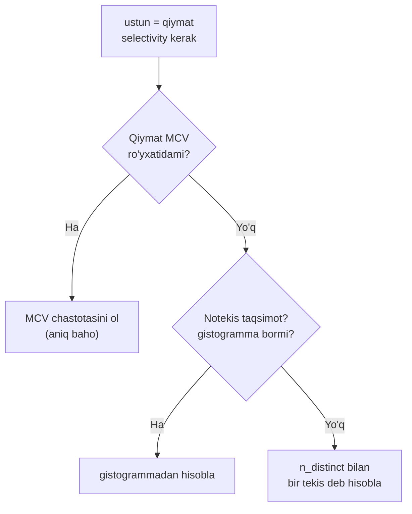
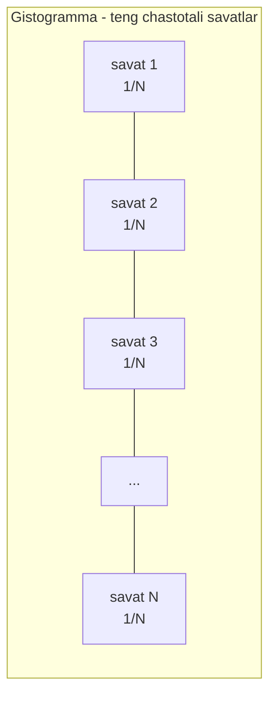
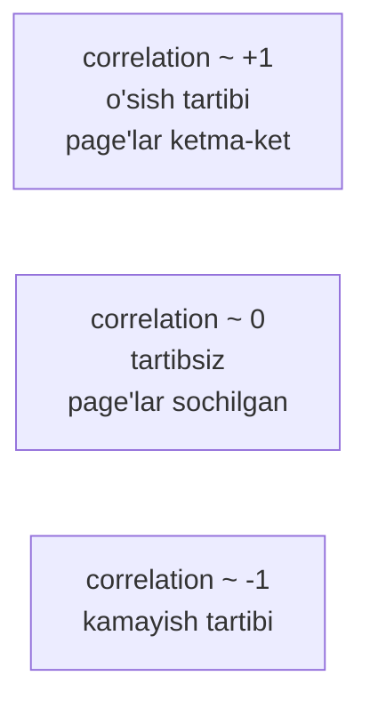

# 17. Statistika

> 📖 Manba: Рогов, "PostgreSQL 17 изнутри", 17-bob ("Статистика")

## Nima uchun kerak?

16-darsda planner haqida bitta savolni ochiq qoldirdik: `EXPLAIN`dagi **`rows`** soni (cardinality) va **`cost`** aynan **qayerdan** olinadi? Javob bitta so'z — **statistika**.

Planner so'rovni ko'rmaydi, ma'lumotni ham to'liq o'qib chiqmaydi (aks holda optimallashtirish o'zi so'rovdan sekin bo'lardi). Uning yagona tayanchi — table haqidagi **qisqacha statistik portret**: nechta qator bor, ustunda qancha noyob qiymat bor, eng ko'p uchraydigan qiymatlar qaysi, ma'lumot qanday taqsimlangan. Shu portret asosida u har bir shartning **selectivity'sini** baholaydi va rejalarni taqqoslaydi.

Bu darsning ahamiyati katta, chunki **planner'ning aksariyat xatolari aynan noto'g'ri statistikadan** kelib chiqadi:

- Statistika **eskirgan** bo'lsa (masalan katta `INSERT`'dan keyin `ANALYZE` bo'lmagan) — planner qatorlar sonini noto'g'ri baholab, yomon reja tanlaydi.
- Ustunlar **korrelyatsiyalangan** bo'lsa (16-darsda ko'rgan `AND` formulasi buziladi) — baho keskin xato bo'ladi.
- Statistika **yetarlicha batafsil** bo'lmasa — noyob qiymatli ustunda selectivity noto'g'ri chiqadi.

Bir jumlada: **statistikani tushunmasangiz, EXPLAIN'dagi noto'g'ri `rows`ni ko'rib nega unday ekanini va uni qanday tuzatishni bilolmaysiz.** Statistika ANALYZE tomonidan yig'iladi (6-darsda ko'rganmiz) — endi u aynan **nima** yig'ishini va planner uni **qanday** ishlatishini o'rganamiz.

```mermaid
mindmap
  root(("Statistika"))
    "Bazaviy (pg_class)"
      "reltuples - qatorlar"
      "relpages - page'lar"
      "relallvisible"
    "Ustun (pg_statistic / pg_stats)"
      "null_frac"
      "n_distinct"
      "MCV ro'yxati"
      "gistogramma"
      "correlation"
      "avg_width"
    "Kengaytirilgan (pg_statistic_ext)"
      "expression stats"
      "functional dependencies"
      "multivariate n_distinct"
      "multivariate MCV"
```

---

## 1-qism. Bazaviy statistika — pg_class

Eng oddiy, **relation darajasidagi** statistika **system catalog**ning `pg_class` table'ida saqlanadi. Unga uch qiymat kiradi:

| Ustun | Ma'nosi |
|---|---|
| `reltuples` | table'dagi **qatorlar soni** (taxminiy) |
| `relpages` | table **hajmi**, page'larda |
| `relallvisible` | **visibility map**da belgilangan page'lar soni (6-darsda ko'rganmiz) |

`flights` table'ida ko'ramiz:

```sql
=> SELECT reltuples, relpages, relallvisible
   FROM pg_class WHERE relname = 'flights';
 reltuples | relpages | relallvisible
-----------+----------+---------------
    214867 |     2624 |          2624
(1 row)
```

`reltuples` cardinality bahosi sifatida ishlatiladi, qachonki so'rov qatorlarga **hech qanday shart qo'ymasa**:

```sql
=> EXPLAIN SELECT * FROM flights;
                          QUERY PLAN
------------------------------------------------------------
 Seq Scan on flights  (cost=0.00..4772.67 rows=214867 width=63)
(1 row)
```

`rows=214867` — bu to'g'ridan-to'g'ri `reltuples`.

### Statistika qachon yig'iladi va namuna qanchalik katta?

Statistika asosan **ANALYZE**da (qo'lda yoki autovacuum orqali) yig'iladi. Lekin ahamiyati katta bo'lgani uchun **bazaviy** statistika boshqa amallarda ham qayta hisoblanadi: `VACUUM FULL`, `CLUSTER`, `CREATE INDEX`, `REINDEX`, va oddiy VACUUM'da **aniqlashtiriladi**.

Muhim nozik nuqta — **namuna hajmi**:

> ANALYZE tasodifiy **`300 × default_statistics_target`** qator tanlaydi (default'da `300 × 100 = 30000`). Statistika uchun yetarli namuna hajmi table hajmiga **deyarli bog'liq emas**, shuning uchun table hajmi hisobga olinmaydi. Ya'ni million qatorli ham, milliard qatorli table ham bir xil miqdordagi namuna bilan tahlil qilinadi. Bu tufayli katta table'da statistika real holatdan **biroz farq qilishi mumkin** — bu normal, "tartibiga tushsa" (order of magnitude) yetarli.

### reltuples = -1 — statistikasi yo'q table

`flights`ning nusxasini yaratamiz (autovacuum'ni o'chirib, ANALYZE momentini boshqarish uchun):

```sql
=> CREATE TABLE flights_copy (LIKE flights)
   WITH (autovacuum_enabled = false);
=> SELECT reltuples, relpages, relallvisible
   FROM pg_class WHERE relname = 'flights_copy';
 reltuples | relpages | relallvisible
-----------+----------+---------------
        -1 |        0 |             0
(1 row)
```

> **v14 nozikligi.** `reltuples = -1` — bu maxsus konstanta (6-darsda VACUUM kontekstida ham uchratganmiz). U statistikasi **hech qachon yig'ilmagan** table'ni, statistika yig'ilgan **haqiqatan bo'sh** table'dan farqlaydi.

Statistika yo'q bo'lgani uchun planner table **10 page** egallaydi deb faraz qiladi (ehtimol darhol qator qo'shiladi degan taxmin bilan):

```sql
=> EXPLAIN SELECT * FROM flights_copy;
                          QUERY PLAN
------------------------------------------------------------
 Seq Scan on flights_copy  (cost=0.00..14.10 rows=410 width=170)
(1 row)
```

Bu yerda `width=170` — bir qatorning taxminiy hajmi (ustun tiplaridan hisoblangan, chunki real statistika yo'q). `rows=410` esa `10 page` ichiga necha qator sig'ishidan chiqadi.

Endi ma'lumotni ko'chirib, ANALYZE qilamiz:

```sql
=> INSERT INTO flights_copy SELECT * FROM flights;
INSERT 0 214867
=> ANALYZE flights_copy;
=> SELECT reltuples, relpages, relallvisible
   FROM pg_class WHERE relname = 'flights_copy';
 reltuples | relpages | relallvisible
-----------+----------+---------------
    214867 |     2624 |             0
(1 row)
```

Endi `reltuples` real songa mos keldi. `relallvisible` esa hali **0** — u faqat VACUUM'da yangilanadi (chunki visibility map'ni VACUUM boshqaradi):

```sql
=> VACUUM flights_copy;
=> SELECT relallvisible FROM pg_class WHERE relname = 'flights_copy';
 relallvisible
---------------
          2624
(1 row)
```

`relallvisible` **Index Only Scan** narxini baholashda ishlatiladi (20-darsda ko'ramiz).

### Eskirgan statistikani planner qanday "tuzatadi"?

Endi qator sonini **ikki barobar** oshiramiz, lekin ANALYZE **qilmaymiz** — statistika eskiradi:

```sql
=> INSERT INTO flights_copy SELECT * FROM flights;
=> SELECT count(*) FROM flights_copy;
 count
--------
 429734
(1 row)

=> EXPLAIN SELECT * FROM flights_copy;
                          QUERY PLAN
------------------------------------------------------------
 Seq Scan on flights_copy  (cost=0.00..9545.34 rows=429734 width=63)
(1 row)
```

Ajablanarlisi — `rows=429734` **to'g'ri chiqdi**, garchi `pg_class`da hali eski `reltuples=214867` tursa ham! Sababi: planner faylning **haqiqiy hajmini** `relpages` bilan solishtirib, `reltuples`ni **masshtablaydi**. Fayl ikki barobar o'sgani uchun (ma'lumot zichligi o'zgarmagan deb faraz qilib) qator soni ham ikki barobarga tuzatildi:

```sql
=> SELECT reltuples *
     (pg_relation_size('flights_copy') / 8192) / relpages AS tuples
   FROM pg_class WHERE relname = 'flights_copy';
 tuples
--------
 429734
(1 row)
```

> **Amaliy xulosa.** Bu tuzatish har doim ishlamaydi (masalan qatorlar **o'chirilsa**, fayl kichraymaydi va baho o'zgarmaydi). Lekin katta o'zgarishlarda u ANALYZE kelguncha "ushlab turishga" yordam beradi. Ma'lumot zichligi o'zgarsa yoki qatorlar o'chsa — `ANALYZE` shart.

---

## 2-qism. NULL ulushi — null_frac

Bazaviy statistikadan tashqari, ANALYZE **har bir ustun uchun** ham statistika yig'adi. U `pg_statistic` table'ida saqlanadi, lekin u **o'qishga noqulay** (ichki formatda). Buning o'rniga **`pg_stats`** view'dan foydalanamiz — u xuddi shu ma'lumotni qulay ko'rinishda beradi.

Birinchi ustun statistikasi — **NULL qiymatlar ulushi**, `null_frac` atributida. NULL — ma'lumotlar bazasida "qiymat yo'q yoki noma'lum" degan maxsus holat; u oddiy boolean mantiqni **uch qiymatlik**ka aylantiradi va planner uchun **alohida hisob** talab qiladi.

Masalan, hali **uchmagan reyslar**ni topish uchun `actual_departure IS NULL` shartidan foydalanamiz:

```sql
=> EXPLAIN SELECT * FROM flights WHERE actual_departure IS NULL;
                          QUERY PLAN
------------------------------------------------------------
 Seq Scan on flights  (cost=0.00..4772.67 rows=16251 width=63)
   Filter: (actual_departure IS NULL)
(2 rows)
```

Baho oddiy hisoblanadi: **umumiy qatorlar × NULL ulushi**:

```sql
=> SELECT round(reltuples * s.null_frac) AS rows
   FROM pg_class
   JOIN pg_stats s ON s.tablename = relname
   WHERE s.tablename = 'flights'
     AND s.attname = 'actual_departure';
 rows
-------
 16251
(1 row)
```

Aniq qiymat bilan solishtiramiz — juda yaqin (16251 vs 16348):

```sql
=> SELECT count(*) FROM flights WHERE actual_departure IS NULL;
 count
-------
 16348
(1 row)
```

---

## 3-qism. Noyob qiymatlar — n_distinct

`pg_stats`ning **`n_distinct`** ustuni ustundagi **noyob qiymatlar sonini** ko'rsatadi. Uning belgisi muhim ma'no beradi:

| `n_distinct` qiymati | Ma'nosi |
|---|---|
| **Musbat** (masalan `104`) | aniq noyob qiymatlar soni |
| **Manfiy** (masalan `-1`) | noyob qiymatlar **ulushi**: `-1` = hammasi noyob |
| `-3` | har bir qiymat **o'rtacha 3 qatorda** uchraydi |

> **Nega ba'zan ulush?** Agar hisoblangan noyob qiymatlar soni umumiy qatorlarning **10%**idan oshsa, analizator **ulush**ni saqlaydi — chunki bunday holatda proporsiya ma'lumot o'zgarsa ham saqlanib qolishi ehtimoli yuqori.

`n_distinct` **ma'lumot bir tekis taqsimlangan** deb faraz qilinadigan barcha holatda ishlatiladi. Masalan, `ustun = ifoda` shartida, agar ifoda qiymati planlashtirishda **noma'lum** bo'lsa, ustunning istalgan qiymati **teng ehtimol** bilan chiqishi mumkin deb hisoblanadi:

```sql
=> EXPLAIN SELECT * FROM flights
   WHERE departure_airport = (
     SELECT airport_code FROM airports WHERE city = 'St. Petersburg'
   );
                          QUERY PLAN
------------------------------------------------------------
 Seq Scan on flights  (cost=30.56..5340.40 rows=2066 width=63)
   Filter: (departure_airport = (InitPlan 1).col1)
   InitPlan 1
     ->  Seq Scan on airports_data ml  (cost=0.00..30.56 rows=1 ...)
           Filter: ((city ->> lang()) = 'St. Petersburg'::text)
(5 rows)
```

Bu yerda `InitPlan` tuguni **bir marta** bajariladi, natijasi asosiy rejada ishlatiladi. Baho — `reltuples / n_distinct`:

```sql
=> SELECT round(reltuples / s.n_distinct) AS rows
   FROM pg_class
   JOIN pg_stats s ON s.tablename = relname
   WHERE s.tablename = 'flights'
     AND s.attname = 'departure_airport';
 rows
------
 2066
(1 row)
```

Agar noyob qiymatlar soni namuna cheklovi tufayli **noto'g'ri** hisoblansa, uni qo'lda ko'rsatish mumkin:

```sql
ALTER TABLE ... ALTER COLUMN ... SET (n_distinct = ...);
```

**Lekin bu faqat bir tekis taqsimotda aniq ishlaydi.** Amalda taqsimot ko'pincha **notekis** bo'ladi — o'shanda o'rtacha bilan hisoblash xato beradi. `departure_airport` bo'yicha ko'ramiz: bir aeroportda 113 ta reys, boshqasida 20875 ta, o'rtacha 2066:

```sql
=> SELECT min(cnt), round(avg(cnt)) avg, max(cnt) FROM (
     SELECT departure_airport, count(*) cnt
     FROM flights GROUP BY departure_airport
   ) t;
 min | avg  |  max
-----+------+-------
 113 | 2066 | 20875
(1 row)
```

Ana shu **notekislik** muammosini keyingi ikki mexanizm — MCV va gistogramma — hal qiladi.



---

## 4-qism. Most common values — MCV

Notekis taqsimotda bahoni aniqlashtirish uchun **eng ko'p uchraydigan qiymatlar** (most common values, **MCV**) va ularning **chastotalari** yig'iladi. `pg_stats` bularni ikki massivda ko'rsatadi: `most_common_vals` (qiymatlar) va `most_common_freqs` (chastotalar).

Samolyot tiplari bo'yicha misol:

```sql
=> SELECT most_common_vals AS mcv,
     left(most_common_freqs::text, 60) || '...' AS mcf
   FROM pg_stats
   WHERE tablename = 'flights' AND attname = 'aircraft_code' \gx
-[ RECORD 1 ]-------------------------------------------------------
mcv | {CN1,CR2,SU9,321,733,319,763,773}
mcf | {0.278,0.27163333,0.25873333,0.059766665,0.039566666,0.03756...
```

`ustun = qiymat` shartining selectivity'sini topish oson: qiymatni `most_common_vals`dan topib, **o'sha raqamli** `most_common_freqs` elementini olamiz:

```sql
=> EXPLAIN SELECT * FROM flights WHERE aircraft_code = '733';
                          QUERY PLAN
------------------------------------------------------------
 Seq Scan on flights  (cost=0.00..5309.84 rows=8502 width=63)
   Filter: (aircraft_code = '733'::bpchar)
(2 rows)
```

Qo'lda tekshiramiz — `reltuples × chastota`:

```sql
=> SELECT round(reltuples * s.most_common_freqs[
     array_position((s.most_common_vals::text::text[]), '733')
   ])
   FROM pg_class
   JOIN pg_stats s ON s.tablename = relname
   WHERE s.tablename = 'flights'
     AND s.attname = 'aircraft_code';
 round
-------
  8502
(1 row)
```

Aniq qiymat — 8263, baho — 8502, juda yaqin.

MCV ro'yxati **tengsizliklar** uchun ham ishlatiladi: `ustun < qiymat` shartida `most_common_vals`dagi qidirilayotgandan **kichik** qiymatlarni topib, ularning chastotalarini **qo'shamiz**.

MCV ajoyib ishlaydi, qachonki **turli qiymatlar soni juda katta bo'lmasa**. Massiv maksimal hajmi `default_statistics_target` (default **100**) bilan cheklangan. Uni ustun darajasida oshirish mumkin:

```sql
ALTER TABLE ... ALTER COLUMN ... SET STATISTICS ...;
```

> **Nozik nuqta.** MCV massivi qiymatlarning **o'zini** saqlagani uchun juda katta bo'lib ketishi mumkin. Shu bois hajmi **1KB'dan oshadigan** qiymatlar tahlil va statistikaga umuman kiritilmaydi — bunday katta qiymatlar odatda noyob bo'lib, MCV'ga tushmasligi ham kerak.

---

## 5-qism. Gistogramma

Turli qiymatlar soni **massivga sig'maydigan** darajada ko'p bo'lsa, **gistogramma** yordamga keladi. U bir necha **savat**dan (bin) iborat bo'lib, qiymatlar shu savatlarga joylanadi. Savatlar soni ham `default_statistics_target` bilan cheklangan.

Savat kengligi shunday tanlanadiki, **har biriga taxminan bir xil miqdordagi** qiymat tushsin. Faqat MCV ro'yxatiga **tushmagan** qiymatlar hisobga olinadi. Bu qurilishda bitta savatning umumiy chastotasi `1 / savatlar_soni`ga teng.



Diqqat: savat **kengligi** har xil (notekis taqsimotni aks ettiradi), lekin har savatdagi **qatorlar soni** bir xil. Gistogramma `pg_stats.histogram_bounds`da savatlarni ajratuvchi qiymatlar massivi sifatida saqlanadi:

```sql
=> SELECT left(histogram_bounds::text, 60) || '...' AS hist_bounds
   FROM pg_stats s
   WHERE s.tablename = 'boarding_passes' AND s.attname = 'seat_no';
                          hist_bounds
-------------------------------------------------------------
 {10B,10D,10D,10E,10F,11B,11E,11G,12B,12K,13H,14G,15B,16B,17B...
(1 row)
```

Gistogramma `>` / `<` operatorlari selectivity'sini baholashda (MCV bilan **birga**) ishlatiladi. Misol — uzoq qatorlarga berilgan posadka talonlari soni:

```sql
=> EXPLAIN SELECT * FROM boarding_passes WHERE seat_no > '30C';
                          QUERY PLAN
------------------------------------------------------------
 Seq Scan on boarding_passes  (cost=0.00..157381.25 rows=2981982 ...)
   Filter: ((seat_no)::text > '30C'::text)
(2 rows)
```

O'rin raqami maxsus tanlangan — u **savat chegarasiga** aynan to'g'ri keladi. Selectivity `N / savatlar_soni`ga teng, bu yerda `N` — shartga mos savatlar soni. Lekin **MCV gistogrammaga kirmasligini** hisobga olish kerak. `seat_no`da NULL yo'q:

```sql
=> SELECT s.null_frac FROM pg_stats s
   WHERE s.tablename = 'boarding_passes' AND s.attname = 'seat_no';
 null_frac
-----------
         0
(1 row)
```

Baho ikki qismdan iborat. Avval shartga mos keluvchi **MCV chastotalari** yig'indisini topamiz:

```sql
=> SELECT sum(s.most_common_freqs[
     array_position((s.most_common_vals::text::text[]), v)
   ])
   FROM pg_stats s, unnest(s.most_common_vals::text::text[]) v
   WHERE s.tablename = 'boarding_passes' AND s.attname = 'seat_no'
     AND v > '30C';
    sum
------------
 0.22866668
(1 row)
```

Keyin **umumiy MCV ulushi**ni (gistogramma buni hisobga olmaydi) topamiz — `0.6792334`. Interval to'liq 46 ta savatni egallagani uchun (100 dan) yakuniy baho:

```sql
=> SELECT round(reltuples * (
     0.22866668                          -- MCV hissasi
     + (1 - 0.6792334 - 0) * (46 / 100.0) -- gistogramma hissasi
   ))
   FROM pg_class WHERE relname = 'boarding_passes';
  round
---------
 2981982
(1 row)
```

Formula tuzilishi:

> **selectivity = (mos MCV chastotalari) + (1 − umumiy MCV ulushi − null_frac) × (mos savatlar / jami savatlar)**

Aniq qiymat — 2986429, baho — 2981982, juda yaqin. Qiymat savat **chegarasida emas**, o'rtasida bo'lsa, savatning qaysi ulushiga to'g'ri kelishi **chiziqli interpolyatsiya** bilan hisoblanadi.

`seat_no`da noyob qiymatlar soni 461 — MCV massiviga sig'maydi, lekin gistogramma MCV bilan birga **yaxshi natija** beradi:

```sql
=> SELECT n_distinct FROM pg_stats
   WHERE tablename = 'boarding_passes' AND attname = 'seat_no';
 n_distinct
------------
        461
(1 row)
```

> **default_statistics_target haqida.** Uni oshirish bahoni yaxshilashi mumkin, lekin **faqat** bu yaxshi rejaga olib kelsa mantiqli. Ko'r-ko'rona oshirish tahlil va planlashtirishni sekinlashtiradi, hech narsani yaxshilamay. Kamaytirish (hatto nolgacha) tahlilni tezlashtiradi, lekin yomon rejalarga sabab bo'lishi mumkin — bunday "tejamkorlik" odatda o'zini oqlamaydi.

---

## 6-qism. Skalyar bo'lmagan tiplar uchun statistika

Massiv (array), `tsvector` kabi **skalyar bo'lmagan** tiplar uchun nafaqat qiymatlarning o'zi, balki ular **iborat elementlar** taqsimoti bo'yicha ham statistika yig'iladi:

- `most_common_elems` / `most_common_elem_freqs` — eng ko'p uchraydigan **elementlar** va chastotalari (massiv va `tsvector` uchun).
- `elem_count_histogram` — qiymatdagi noyob elementlar sonining gistogrammasi (faqat massiv uchun).
- Diapazon (range) tiplari uchun (v17) — chegaralar (`range_bounds_histogram`) va uzunlik (`range_length_histogram`) gistogrammalari, hamda bo'sh diapazonlar ulushi (`range_empty_frac`).

Bu statistika 1-normal formadagi bo'lmagan ustunli so'rovlarni aniqroq planlashtirish imkonini beradi.

---

## 7-qism. O'rtacha maydon hajmi — avg_width

`pg_stats.avg_width` ustundagi qiymatlarning **o'rtacha hajmini** ko'rsatadi. `integer` yoki `char(3)` kabi tiplar uchun u doim bir xil, lekin `text` kabi **o'zgaruvchan uzunlikdagi** tiplar uchun ustundan ustunga sezilarli farq qiladi:

```sql
=> SELECT attname, avg_width FROM pg_stats
   WHERE (tablename, attname) IN (VALUES
     ('tickets', 'passenger_name'), ('ticket_flights', 'fare_conditions')
   );
     attname     | avg_width
-----------------+-----------
 fare_conditions |         8
 passenger_name  |        16
(2 rows)
```

Bu statistika **sort** yoki **hashing** kabi amallar uchun kerak bo'ladigan **xotira hajmini** baholashda ishlatiladi (22-23-darslarda ko'ramiz).

---

## 8-qism. Correlation

`pg_stats.correlation` — ma'lumotning **fizik joylashuvi** bilan **mantiqiy tartibi** (taqqoslash operatsiyalari ma'nosida) o'rtasidagi korrelyatsiyani ko'rsatadi:

- qiymatlar **o'sish** tartibida saqlangan bo'lsa — 1 ga yaqin;
- **kamayish** tartibida — −1 ga yaqin;
- disk'da **tartibsiz** joylashsa — 0 ga yaqin.

```sql
=> SELECT attname, correlation
   FROM pg_stats WHERE tablename = 'airports_data'
   ORDER BY abs(correlation) DESC;
   attname    | correlation
--------------+-------------
 coordinates  |
 airport_code | -0.21120238
 city         | -0.1970127
 airport_name | -0.18223621
 timezone     |  0.17961165
(5 rows)
```



`coordinates` uchun statistika **yig'ilmaydi**, chunki `point` tipida `>` va `<` operatorlari aniqlanmagan. Correlation **index scan narxini** baholashda ishlatiladi (20-darsda ko'ramiz) — chunki tartibli ma'lumotni index orqali o'qish disk'da ketma-ket, tartibsizini esa sakrab-sakrab o'qishga to'g'ri keladi.

---

## 9-qism. Expression statistics — ifoda bo'yicha statistika

Odatda ustun statistikasi faqat taqqoslashda **ustunning o'zi** turgan holatda ishlatiladi, **ifoda** emas. Planner ustun ustidan funksiya hisoblanganda statistika qanday o'zgarishini **bilmaydi**, shuning uchun `funksiya(ustun) = konstanta` shartiga har doim **qat'iy 0.5%** bahosini qo'yadi:

```sql
=> EXPLAIN SELECT * FROM flights
   WHERE extract(month FROM scheduled_departure AT TIME ZONE 'Europe/Moscow') = 1;
                          QUERY PLAN
------------------------------------------------------------
 Seq Scan on flights  (cost=0.00..6384.17 rows=1074 width=63)
   Filter: (EXTRACT(month FROM (scheduled_departure AT TIME ZONE ...
(2 rows)
```

`rows=1074` — bu `reltuples × 0.005`. Lekin biz bilamizki, yanvarda uchgan reyslar taxminan `1/12` — ya'ni **taxminan 10 barobar ko'p**. Planner buni bilmaydi. Ikki yo'l bilan tuzatish mumkin.

### Yo'l 1 — CREATE STATISTICS ifoda bo'yicha

Kengaytirilgan statistikani **qo'lda** yaratamiz (u avtomatik yig'ilmaydi):

```sql
=> CREATE STATISTICS flights_expr_stat ON (
     extract(month FROM scheduled_departure AT TIME ZONE 'Europe/Moscow')
   ) FROM flights;
=> ANALYZE flights;
=> EXPLAIN SELECT * FROM flights
   WHERE extract(month FROM scheduled_departure AT TIME ZONE 'Europe/Moscow') = 1;
                          QUERY PLAN
------------------------------------------------------------
 Seq Scan on flights  (cost=0.00..6384.17 rows=17325 width=63)
   Filter: (EXTRACT(month FROM (scheduled_departure AT TIME ZONE ...
(2 rows)
```

Baho `1074` → `17325` ga o'zgardi — endi haqiqatga yaqin.

> **Muhim shart.** Yig'ilgan statistika ishlatilishi uchun so'rovdagi ifoda `CREATE STATISTICS`dagi bilan **aynan bir xil** yozilishi kerak.

Kengaytirilgan statistika umumiy ma'lumoti `pg_statistic_ext` table'ida, yig'ilgan statistika esa alohida `pg_statistic_ext_data` table'ida saqlanadi (bu ajratish maxfiy ma'lumotga ruxsatni cheklash uchun). Foydalanuvchiga ochiq ifoda statistikasini `pg_stats_ext_exprs` view orqali ko'rish mumkin:

```sql
=> SELECT left(expr, 50) || '...' AS expr, null_frac, avg_width, n_distinct,
     most_common_vals AS mcv
   FROM pg_stats_ext_exprs WHERE statistics_name = 'flights_expr_stat' \gx
-[ RECORD 1 ]------------------------------------------------
expr       | EXTRACT(month FROM (scheduled_departure AT TIME ZO...
null_frac  | 0
avg_width  | 8
n_distinct | 12
mcv        | {8,9,10,1,12,3,4,7,6,5,11,2}
```

Ko'rinib turibdiki, `n_distinct = 12` (12 oy) — endi planner "ifoda 12 xil qiymat oladi" deb biladi.

### Yo'l 2 — ifoda bo'yicha index

Agar index **haqiqatan kerak** bo'lsa, ifoda bo'yicha index yaratishning o'zi ham statistika yig'adi:

```sql
=> DROP STATISTICS flights_expr_stat;
=> CREATE INDEX ON flights(
     extract(month FROM scheduled_departure AT TIME ZONE 'Europe/Moscow')
   );
=> ANALYZE flights;
=> EXPLAIN SELECT * FROM flights
   WHERE extract(month FROM scheduled_departure AT TIME ZONE 'Europe/Moscow') = 1;
                          QUERY PLAN
------------------------------------------------------------
 Bitmap Heap Scan on flights  (cost=326.58..3253.52 rows=17311 ...)
   Recheck Cond: (EXTRACT(month FROM (scheduled_departure AT TIME...
   ->  Bitmap Index Scan on flights_extract_idx  (cost=0.00..322.2...)
(4 rows)
```

Baho ham tuzatildi (`rows=17311`), bonusiga index paydo bo'ldi.

---

## 10-qism. Multivariate statistics — ko'p ustunli statistika

16-darsda ko'rdik: `sel(x AND y) = sel(x) × sel(y)` formulasi predikatlar **mustaqil** deb faraz qiladi. Ustunlar **bog'liq** bo'lsa, bu baho keskin xato beradi. Buni tuzatish uchun **bir necha ustunni qamrab oluvchi** kengaytirilgan statistika (`CREATE STATISTICS`) kerak. Uch tur bor.

### 10.1. Functional dependencies — funksional bog'liqlik

Bir ustun qiymati boshqasini (to'liq yoki qisman) **aniqlasa** va so'rovda ikkalasiga ham shart bo'lsa, baho **kamaytirilgan** chiqadi. `flight_no` (reys raqami) `departure_airport`ni bir qiymatli aniqlaydi — ya'ni ikkinchi shart **ortiqcha**:

```sql
=> SELECT count(*) FROM flights
   WHERE flight_no = 'PG0007' AND departure_airport = 'VKO';
 count
-------
   396
(1 row)

=> EXPLAIN SELECT * FROM flights
   WHERE flight_no = 'PG0007' AND departure_airport = 'VKO';
                          QUERY PLAN
------------------------------------------------------------
 Bitmap Heap Scan on flights  (cost=10.49..814.25 rows=15 width=63)
   Recheck Cond: (flight_no = 'PG0007'::bpchar)
   Filter: (departure_airport = 'VKO'::bpchar)
   ->  Bitmap Index Scan on ...  (cost=0.00..10.48 rows=275 width=0)
(6 rows)
```

Baho `rows=15` — real 396 dan **26 barobar** kam! `flight_no` bo'yicha 275 ta qator topildi, keyin `departure_airport` filtri uni (mustaqil deb) 15 gacha "kamaytirdi". Bog'liqlik statistikasini yaratamiz:

```sql
=> CREATE STATISTICS flights_dep_stat(dependencies)
   ON flight_no, departure_airport FROM flights;
=> ANALYZE flights;
=> EXPLAIN SELECT * FROM flights
   WHERE flight_no = 'PG0007' AND departure_airport = 'VKO';
                          QUERY PLAN
------------------------------------------------------------
 Bitmap Heap Scan on flights  (cost=11.92..1185.77 rows=451 width...)
   ...
(6 rows)
```

Endi `rows=451` — 396 ga juda yaqin. Yig'ilgan bog'liqlikni ko'ramiz:

```sql
=> SELECT dependencies
   FROM pg_stats_ext WHERE statistics_name = 'flights_dep_stat';
              dependencies
----------------------------------------
 {"2 => 5": 1.000000, "5 => 2": 0.010900}
(1 row)
```

`2` va `5` — ustun raqamlari (`pg_attribute`dan). `"2 => 5": 1.0` — ikkinchi ustun (`flight_no`) beshinchisini (`departure_airport`) **to'liq** (1.0 daraja) aniqlaydi. Teskarisi esa deyarli yo'q (0.0109).

### 10.2. Multivariate n_distinct — ko'p ustunli noyob qiymatlar

Bir necha ustundagi **noyob kombinatsiyalar soni** ko'p ustun bo'yicha **guruhlash** (GROUP BY) cardinality'sini aniqroq baholaydi. Aeroport juftliklari sonini planner "aeroportlar soni kvadrati" deb baholaydi, lekin real qiymat ancha kam (har juft aeroport to'g'ridan-to'g'ri reys bilan bog'lanmagan):

```sql
=> SELECT count(*) FROM (
     SELECT DISTINCT departure_airport, arrival_airport FROM flights
   ) t;
 count
-------
   618

=> EXPLAIN SELECT DISTINCT departure_airport, arrival_airport FROM flights;
                          QUERY PLAN
------------------------------------------------------------
 HashAggregate  (cost=5847.01..5955.16 rows=10816 width=8)
   Group Key: departure_airport, arrival_airport
   ->  Seq Scan on flights  (cost=0.00..4772.67 rows=214867 width=8)
(3 rows)
```

Baho `rows=10816`, real 618. Statistika yaratamiz:

```sql
=> CREATE STATISTICS flights_nd_stat(ndistinct)
   ON departure_airport, arrival_airport FROM flights;
=> ANALYZE flights;
=> EXPLAIN SELECT DISTINCT departure_airport, arrival_airport FROM flights;
                          QUERY PLAN
------------------------------------------------------------
 HashAggregate  (cost=5847.01..5853.19 rows=618 width=8)
   ...
(3 rows)
```

Endi `rows=618` — aniq. Yig'ilgan qiymat: `{"5, 6": 618}`.

### 10.3. Multivariate MCV — ko'p ustunli chastotali qiymatlar

Notekis taqsimotda faqat funksional bog'liqlikni bilish **yetarli emas** — baho aniq **qiymat juftligiga** bog'liq. Planner SVO aeroportidan Boeing 737 (kod `733`) bilan uchadigan reyslar sonini noto'g'ri baholaydi:

```sql
=> SELECT count(*) FROM flights
   WHERE departure_airport = 'SVO' AND aircraft_code = '733';
 count
-------
  2037

=> EXPLAIN SELECT * FROM flights
   WHERE departure_airport = 'SVO' AND aircraft_code = '733';
                          QUERY PLAN
------------------------------------------------------------
 Seq Scan on flights  (cost=0.00..5847.00 rows=732 width=63)
   Filter: ((departure_airport = 'SVO'::bpchar) AND (aircraft_cod...
(2 rows)
```

Baho `rows=732`, real 2037. Ko'p ustunli MCV yaratamiz:

```sql
=> CREATE STATISTICS flights_mcv_stat(mcv)
   ON departure_airport, aircraft_code FROM flights;
=> ANALYZE flights;
=> EXPLAIN SELECT * FROM flights
   WHERE departure_airport = 'SVO' AND aircraft_code = '733';
                          QUERY PLAN
------------------------------------------------------------
 Seq Scan on flights  (cost=0.00..5847.00 rows=2249 width=63)
   ...
(2 rows)
```

Endi `rows=2249` — ancha aniq. Planner tizim katalogdagi saqlangan chastotadan foydalandi:

```sql
=> SELECT values, frequency
   FROM pg_statistic_ext stx
   JOIN pg_statistic_ext_data stxd ON stx.oid = stxd.stxoid,
        pg_mcv_list_items(stxdmcv) m
   WHERE stxname = 'flights_mcv_stat' AND values = '{SVO,733}';
   values   |      frequency
------------+---------------------
 {SVO,733}  | 0.00603333333333333
(1 row)
```

### Uchta turni taqqoslash

| Tur | Nimani yaxshilaydi | Qachon |
|---|---|---|
| `dependencies` | bir necha `AND` shart bilan cardinality | ustun ustunni aniqlaganda |
| `ndistinct` | ko'p ustunli `GROUP BY`/`DISTINCT` | noyob kombinatsiyalar kam bo'lganda |
| `mcv` | aniq qiymat juftliklari bilan cardinality | notekis taqsimotli bog'liq ustunlar |

> **Qo'shimcha imkoniyatlar.** Bir obyektda bir necha turni **vergul bilan** birlashtirish mumkin (tur ko'rsatilmasa — barcha mumkin variant yig'iladi). Ustunlar soni ikkitadan ko'p bo'lishi mumkin. v14'dan multivariate statistikada oddiy ustun nomi o'rniga **ifodalar** ham ishlatsa bo'ladi.

---

## Muhim parametrlar va obyektlar

| Nomi | Default | Ma'nosi |
|---|---|---|
| `default_statistics_target` | 100 | Namuna hajmi, MCV va gistogramma o'lchami |
| `pg_class.reltuples` | — | Qatorlar soni (−1 = statistikasi yo'q) |
| `pg_class.relpages` | — | Page'lar soni |
| `pg_class.relallvisible` | — | Visibility map'dagi page'lar (Index Only Scan uchun) |
| `pg_stats` | view | Ustun statistikasi (null_frac, n_distinct, MCV, gistogramma, correlation, avg_width) |
| `pg_statistic_ext` / `_ext_data` | catalog | Kengaytirilgan (expression, multivariate) statistika |
| `ALTER TABLE ... ALTER COLUMN ... SET STATISTICS n` | — | Ustun uchun target'ni o'zgartirish |
| `ALTER STATISTICS ... SET STATISTICS n` | — | Kengaytirilgan statistika o'lchamini o'zgartirish |

---

## Xulosa

- Planner'ning `rows` (cardinality) bahosi **statistikaga** tayanadi; uning aksariyat xatolari **noto'g'ri yoki eskirgan** statistikadan kelib chiqadi.
- **Bazaviy statistika** `pg_class`da: `reltuples` (qatorlar), `relpages` (page'lar), `relallvisible`. `reltuples = -1` — statistikasi hech yig'ilmagan table.
- ANALYZE **`300 × default_statistics_target`** qator tanlaydi — namuna hajmi table hajmiga bog'liq emas. Eskirgan `reltuples`ni planner fayl hajmiga qarab masshtablaydi.
- **Ustun statistikasi** `pg_stats` view'da: `null_frac` (NULL ulushi), `n_distinct` (noyob qiymatlar — manfiy bo'lsa ulush), `avg_width`, `correlation`.
- **Bir tekis taqsimot** uchun `n_distinct` yetadi (`reltuples / n_distinct`), lekin **notekis** taqsimot uchun MCV va gistogramma kerak.
- **MCV** — eng ko'p qiymatlar va chastotalari; `ustun = qiymat` selectivity'sini aniq beradi. **Gistogramma** — qolgan qiymatlarni teng chastotali savatlarga bo'ladi, `>`/`<` uchun ishlatiladi.
- `>`/`<` selectivity = (mos MCV chastotalari) + (1 − umumiy MCV ulushi − null_frac) × (mos savatlar / jami savatlar).
- **Correlation** fizik va mantiqiy tartib mosligini o'lchaydi (index scan narxi uchun); **avg_width** sort/hash xotirasi uchun.
- **Expression statistics** (`CREATE STATISTICS ON (ifoda)` yoki ifoda bo'yicha index) `funksiya(ustun)` uchun qat'iy 0.5% bahosini tuzatadi.
- **Multivariate statistics** korrelyatsiyalangan ustunlar muammosini hal qiladi: `dependencies` (funksional bog'liqlik), `ndistinct` (guruhlash), `mcv` (aniq juftliklar).

## Nazorat savollari

1. `pg_class`da qanday uch bazaviy statistika saqlanadi? `reltuples = -1` nimani anglatadi va `reltuples = 0` dan farqi nima?
2. ANALYZE namuna hajmi nega table hajmiga bog'liq emas? Katta `INSERT`dan keyin ANALYZE bo'lmasa, planner cardinality'ni qanday "tuzatib" turadi va bu qachon **ishlamaydi**?
3. `n_distinct` musbat va manfiy bo'lsa nima anglatadi? U qaysi taqsimot faraziga tayanadi va nega notekis taqsimotda xato beradi?
4. `ustun = '733'` shartida planner selectivity'ni qanday hisoblaydi (MCV misolida)? Bir juda katta (>1KB) qiymat nega MCV'ga tushmaydi?
5. Gistogramma nima uchun kerak, MCV yetmagan holatda? `seat_no > '30C'` uchun to'liq selectivity formulasini yozing va uning ikki qismini tushuntiring.
6. `correlation` nima o'lchaydi? Nega u index scan narxiga ta'sir qiladi (tartibli va tartibsiz ma'lumot misolida)?
7. `funksiya(ustun) = konstanta` shartiga planner nega qat'iy 0.5% qo'yadi? Buni tuzatishning ikki yo'lini ayting.
8. Korrelyatsiyalangan ustunlarda `sel(x AND y) = sel(x) × sel(y)` nega xato beradi? `flight_no` va `departure_airport` misolida tushuntiring.
9. Multivariate statistikaning uch turi (`dependencies`, `ndistinct`, `mcv`) qaysi muammoni hal qiladi? Har biriga bittadan misol keltiring.
