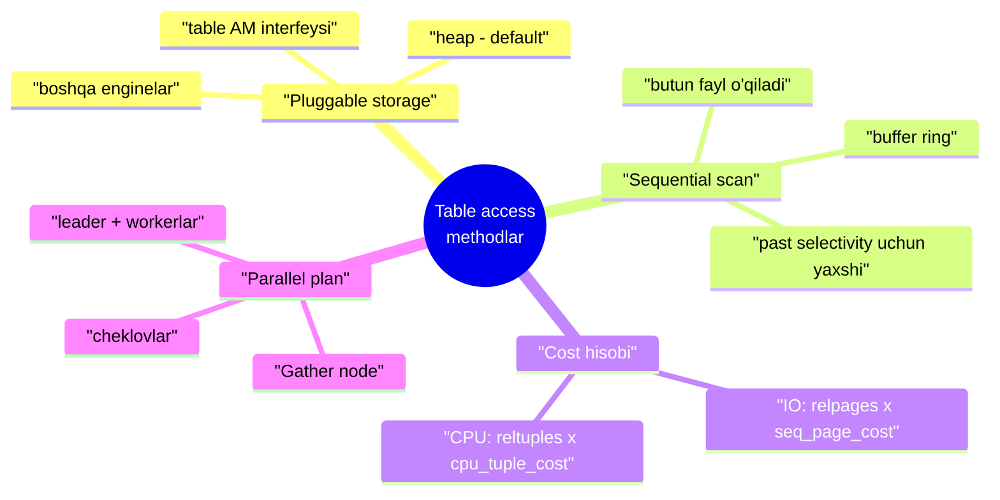
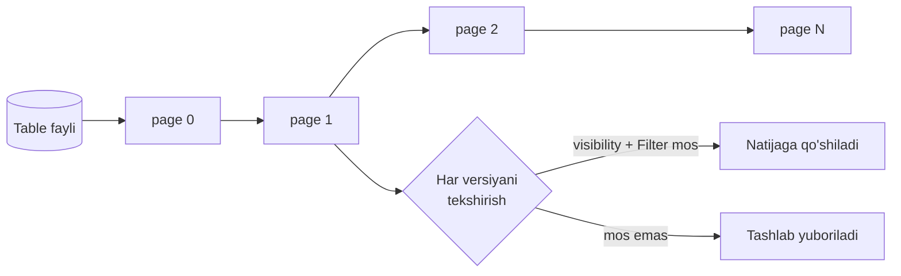
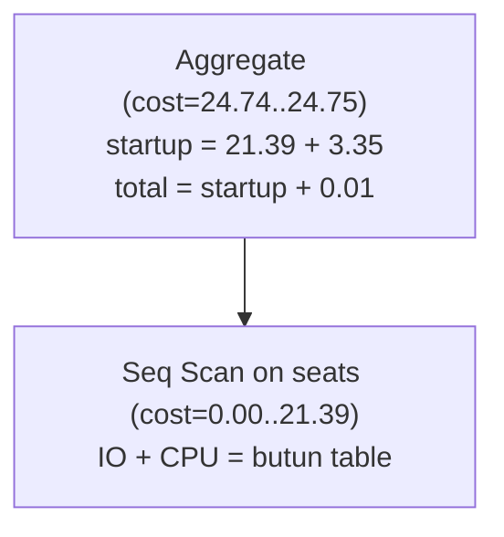
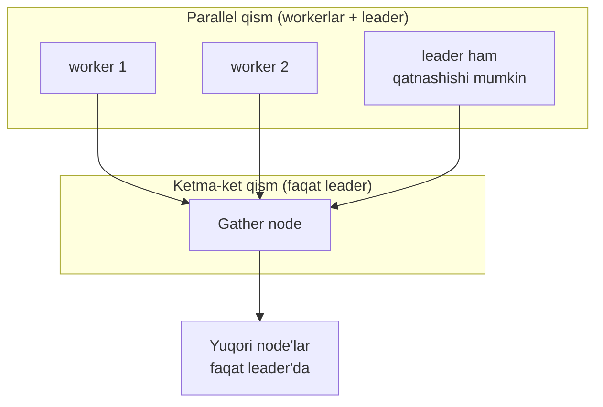
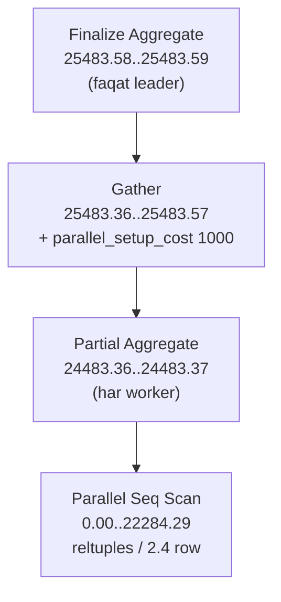
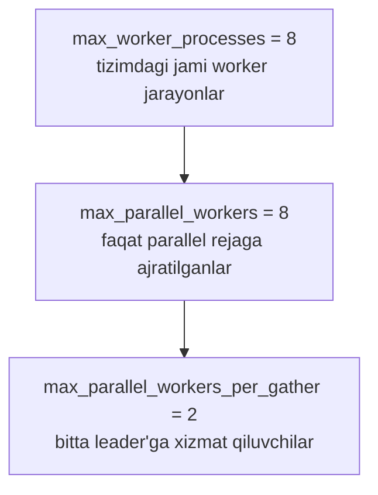

# 18. Table access methodlar

> 📖 Manba: Рогов, "PostgreSQL 17 изнутри", 18-bob ("Табличные методы доступа")

## Nima uchun kerak?

Oldingi darslarda so'rov **qanday bajarilishini** bosqichma-bosqich ko'rdik: 16-darsda so'rov parse → plan → execute bosqichlaridan o'tishini, 17-darsda esa planner **statistika**ga tayanib reja tuzishini o'rgangan edik. Lekin bir savolga hali javob bermadik: **planner table'ni fizik jihatdan qanday o'qiydi va bu o'qishning "narxi" (cost) qanday hisoblanadi?**

Bu darsdan boshlab kursning IV qismi — **access method'lar** (ma'lumotga kirish usullari) boshlanadi. Ikki katta savol bor:

- Ma'lumot disk'da **qanday tashkil qilingan** — bu **table access method** (jadval saqlash mexanizmi) ishi.
- Uni **qanday o'qiymiz** — sequential scan (ketma-ket o'qish), index scan va boshqalar.

Bu darsda birinchi va eng oddiy usul bilan tanishamiz: **sequential scan** — butun table'ni boshdan-oxir o'qish. Shu bilan birga uning **cost**'ini qanday hisoblanishini va **parallel** (bir necha jarayon bilan) bajarilishini ko'ramiz.

> **Asosiy g'oya:** PostgreSQL'da ma'lumotni saqlash usuli — «yagona to'g'ri yechim» emas, balki **almashtiriladigan (pluggable) modul**. Standart modul — `heap`, biz shu paytgacha (3-darsdan buyon) aynan uning tuzilishini o'rganib keldik.



---

## 1-qism. Pluggable storage — almashtiriladigan saqlash moduli

PostgreSQL disk'dagi ma'lumot tuzilishini **yagona to'g'ri usul** deb hisoblamaydi. **Kengaytiriluvchanlik** (extensibility) g'oyasiga ergashib, u v12'dan boshlab turli **table access method'lar** (saqlash modullari) yaratish va ulashga imkon beradi. Hozircha «qutidan chiqib» faqat bittasi ishlaydi:

```sql
=> SELECT amname, amhandler FROM pg_am WHERE amtype = 't';
 amname |      amhandler
--------+----------------------
 heap   | heap_tableam_handler
(1 row)
```

`pg_am` — bu **access method**'lar ro'yxati saqlanadigan tizim katalogi. `amtype = 't'` — table (jadval) modullari, `amtype = 'i'` — index modullari (keyingi darsda ko'ramiz).

### Modul qanday tanlanadi?

- Table yaratishda modulni ko'rsatish mumkin: `CREATE TABLE ... USING`.
- Ko'rsatilmasa, `default_table_access_method` parametri qiymati (default `heap`) ishlatiladi.
- Keyinchalik modulni almashtirish ham mumkin (v15): `ALTER TABLE ... SET ACCESS METHOD` — lekin, tabiiyki, **barcha ma'lumotni qayta yozish** hisobiga.

`amhandler` ustunidagi funksiya (masalan `heap_tableam_handler`) **interfeys strukturasi**ni qaytaradi — unda kernel uchun kerakli barcha ma'lumot bo'ladi. Shu tufayli kernel har xil modullar bilan **bir xilda** ishlay oladi.

### Kernel nima beradi, modul nima aniqlaydi?

Kernel'ning katta qismi barcha table modullari uchun **umumiy** qoladi. Modul esa faqat o'ziga xos qismni belgilaydi:

```mermaid
flowchart LR
    subgraph kernel["Kernel (barcha modullar uchun umumiy)"]
        K1[transaction menejeri<br/>ACID va snapshot izolyatsiya]
        K2[buffer menejeri]
        K3[WAL journali]
        K4[I/O quyi tizimi + TOAST]
        K5[planner + executor]
        K6[index qo'llab-quvvatlashi]
    end
    subgraph engine["Table access method (modul)"]
        E1[row versiya formati va<br/>ma'lumot strukturasi]
        E2[table scan va uning cost'i]
        E3[insert / delete / update / lock]
        E4[versiya ko'rinish qoidalari]
        E5[vacuum va analyze protseduralari]
    end
    kernel -.- engine
```



> **Muhim nozik nuqta:** tarixan PostgreSQL yagona saqlash tizimiga ega edi va u kernel'ga **hech qanday aniq interfeyssiz** o'rnatilgan edi. Shuning uchun avvalgi qismlarda aytilgan ko'p narsalar (page, tuple, MVCC) rasman kernel'ga emas, aynan **heap moduli xususiyatlariga** tegishli. Ehtimol `heap` PostgreSQL'da **universal standart modul** bo'lib qoladi, boshqalari esa alohida nishalarni egallaydi.

### Boshqa saqlash modullari

Table AM mexanizmi ustida bir necha loyiha rivojlangan:

| Modul | G'oyasi | Holati |
|---|---|---|
| **Zheap** | Table bloat'ni yo'q qilish: row versiyasini **joyida** yangilash, tarixiy ma'lumotni alohida **undo**-omborga chiqarish (Oracle uslubi) | To'xtatilgan |
| **Zedstore** | **Ustunli** (columnar) saqlash, OLAP so'rovlar uchun samarali (har ustun alohida B-tree'da) | To'xtatilgan |
| **OrioleDB** | Zamonaviy apparat va bulut xizmatlariga moslangan; table bloat'ni undo-journal bilan yo'qotadi | Faol rivojlanmoqda |
| **Citus Columnar** | Klassik siqilgan ustunli saqlash; analitik yuklama uchun, `UPDATE`'ni qo'llab-quvvatlamaydi | Faol |

> **Xulosa:** modul mexanizmi hali «yosh» — interfeys yetarlicha ishlanmagan (masalan OrioleDB o'rnatish uchun kernel'ni o'zgartirish talab qilinadi). Lekin yo'nalish aniq: kelajakda bitta PostgreSQL'da turli yuklamalar uchun turli saqlash modullaridan foydalanish mumkin bo'ladi.

---

## 2-qism. Sequential scan — ketma-ket o'qish

`heap` moduli table ma'lumotining fizik tashkilini boshqaradi va unga eng oddiy kirish usulini beradi — **sequential scan** (ketma-ket skanlash). Bunda table'ning asosiy qatlami (main fork) fayli **to'liq** o'qiladi. Har o'qilgan page'da har bir row versiyasining **ko'rinishi (visibility)** tekshiriladi (3-4-darslarda ko'rganmiz); so'rov shartiga mos kelmaydigan versiyalar tashlab yuboriladi.



### Buffer ring — cache'ni ifloslantirmaslik

O'qish **buffer cache** orqali bajariladi (9-darsda ko'rganmiz). Katta table'lar foydali ma'lumotni cache'dan siqib chiqarmasligi uchun sequential scan **kichik buffer ring** (buffer halqasi) ishlatadi. Bundan tashqari, ayni paytda **shu table'ni skanlayotgan** boshqa jarayonlar shu halqaga qo'shilib, disk o'qishlarini **tejaydi**. Shu sabab skanlash umumiy holda fayl **boshidan boshlanmasligi** ham mumkin.

> **Qachon yaxshi?** Sequential scan — butun table'ni yoki uning **katta qismini** o'qishning eng samarali usuli. Boshqacha aytganda, u **past selectivity**'da yaxshi ishlaydi (juda ko'p row kerak bo'lganda). Selectivity yuqori bo'lsa (butun table'dan ozgina row kerak bo'lsa), **index** afzalroq — buni 20-darsda ko'ramiz.

### Cost hisobi

So'rov rejasida sequential scan **Seq Scan** node'i bilan ko'rinadi:

```sql
=> EXPLAIN SELECT * FROM flights;
                          QUERY PLAN
--------------------------------------------------------------
 Seq Scan on flights (cost=0.00..4772.67 rows=214867 width=63)
(1 row)
```

`rows` — bazaviy statistika, ya'ni table'dagi row'lar taxminiy soni:

```sql
=> SELECT reltuples FROM pg_class WHERE relname = 'flights';
 reltuples
-----------
    214867
(1 row)
```

`cost` ikki qismdan iborat: **disk I/O** va **protsessor resurslari**.

**1) I/O narxi** — table'dagi page'lar soni × bitta page o'qish narxi, **ketma-ket** o'qish sharti bilan. Nega ketma-ket o'qish arzon? Buffer menejeri operatsion tizimdan bitta page so'raganda, disk'dan bir yo'la **kattaroq blok** o'qiladi, shu sabab keyingi bir necha page **katta ehtimol bilan OS cache'da** bo'ladi. Shuning uchun ketma-ket bitta page o'qish narxi (`seq_page_cost`) tasodifiy (random) kirishdan (`random_page_cost`) arzonroq.

| Parametr | Default | Ma'nosi |
|---|---|---|
| `seq_page_cost` | **1** | ketma-ket bitta page o'qish (tayanch qiymat) |
| `random_page_cost` | **4** | tasodifiy bitta page o'qish |

> **Amaliy maslahat:** default nisbat (1 : 4) HDD-disklar uchun. SSD uchun `random_page_cost`'ni sezilarli **kamaytirish** mantiqiy (`seq_page_cost`'ni odatda tegmaydi, uni 1 tayanch qiymat sifatida qoldirishadi). Nisbat apparatga bog'liq bo'lgani uchun bu parametrlarni **tablespace darajasida** belgilash odatiy: `ALTER TABLESPACE ... SET`.

Hisoblaymiz — `flights` uchun I/O qismi:

```sql
=> SELECT relpages,
     current_setting('seq_page_cost') AS seq_page_cost,
     relpages * current_setting('seq_page_cost')::real AS total
   FROM pg_class WHERE relname = 'flights';
 relpages | seq_page_cost | total
----------+---------------+-------
     2624 | 1             |  2624
(1 row)
```

> Bu formula **table bloat**'ning (8-dardsa ko'rganmiz) oqibatini yaqqol ko'rsatadi: table faylining hajmi qancha katta bo'lsa, **shuncha ko'p page skanlanadi** — undagi aktual versiyalar soni qancha oz bo'lishidan qat'i nazar. O'z vaqtida vacuum qilmaslik sequential scan'ni to'g'ridan-to'g'ri sekinlashtiradi.

**2) CPU narxi** — har bir row versiyasini qayta ishlash narxi (`cpu_tuple_cost`, default **0.01**):

```sql
=> SELECT reltuples,
     current_setting('cpu_tuple_cost') AS cpu_tuple_cost,
     reltuples * current_setting('cpu_tuple_cost')::real AS total
   FROM pg_class WHERE relname = 'flights';
 reltuples | cpu_tuple_cost |  total
-----------+----------------+---------
    214867 | 0.01           | 2148.67
(1 row)
```

Ikki qismning yig'indisi — reja'ning to'liq narxi:

```
IO (2624) + CPU (2148.67) = 4772.67
```

Aynan shu `cost=0.00..4772.67`. **Boshlang'ich (startup) narx nolga teng**, chunki sequential scan hech qanday tayyorgarlik ishini talab qilmaydi — natija darhol chiqa boshlaydi.

### Filter va EXPLAIN ANALYZE

Agar table'ga shart qo'yilsa, u `Seq Scan` ostida **Filter** bo'limida ko'rinadi. `EXPLAIN ANALYZE` esa **haqiqiy** row sonini va **filter tashlab yuborgan** row sonini ham chiqaradi:

```sql
=> EXPLAIN (analyze, timing off, summary off)
   SELECT * FROM flights WHERE status = 'Scheduled';
                       QUERY PLAN
---------------------------------------------------------
 Seq Scan on flights
   (cost=0.00..5309.84 rows=15383 width=63)
   (actual rows=15383 loops=1)
   Filter: ((status)::text = 'Scheduled'::text)
   Rows Removed by Filter: 199484
(5 rows)
```

`rows=15383` — shartga mos kelganlar, `Rows Removed by Filter: 199484` — tashlab yuborilganlar. Ko'rib turibmiz: filter bo'lsa ham **butun table skanlangan** (15383 + 199484 ≈ 214867).

### Aggregatsiyali reja

Ancha murakkabroq misol — `count(*)`:

```sql
=> EXPLAIN SELECT count(*) FROM seats;
                          QUERY PLAN
----------------------------------------------------------
 Aggregate (cost=24.74..24.75 rows=1 width=8)
   ->  Seq Scan on seats (cost=0.00..21.39 rows=1339 width=0)
(2 rows)
```

Reja ikki node'dan iborat: yuqoridagi **Aggregate** (`count` hisoblanadi) pastdagi **Seq Scan**'dan ma'lumot oladi.

`Aggregate`'ning **boshlang'ich narxi** aynan agregatsiyani o'z ichiga oladi: barcha row'ni pastdagi node'dan olmasdan turib birinchi (va yagona) natijani berib bo'lmaydi. Bu narx har kirish row'i ustidagi shartli operatsiya narxi (`cpu_operator_cost`, default **0.0025**) orqali hisoblanadi:

```sql
=> SELECT reltuples,
     current_setting('cpu_operator_cost') AS cpu_operator_cost,
     round((reltuples * current_setting('cpu_operator_cost')::real)::numeric, 2) AS cpu_cost
   FROM pg_class WHERE relname = 'seats';
 reltuples | cpu_operator_cost | cpu_cost
-----------+-------------------+----------
      1339 | 0.0025            |     3.35
(1 row)
```

Demak `Aggregate` boshlang'ich narxi = Seq Scan to'liq narxi + agregatsiya = `21.39 + 3.35 = 24.74`. To'liq narxi esa bitta natija row'ini chiqarish narxini (`cpu_tuple_cost = 0.01`) qo'shadi: `24.74 + 0.01 = 24.75`.



> **Qoida:** node narxlari orasidagi bog'liqlik shundan kelib chiqadi: agregatsiya **barcha** kirish row'ini olmasdan natija bera olmaydi, shuning uchun uning boshlang'ich narxi pastdagi node'ning **to'liq** narxiga tayanadi.

---

## 3-qism. Parallel bajarish rejasi

Katta table'larda bitta jarayon sekin ishlaydi. PostgreSQL **parallel bajarishni** qo'llab-quvvatlaydi. G'oyasi: so'rovni bajarayotgan **leader** (yetakchi) jarayon (postmaster yordamida) bir necha **worker** (ishchi) jarayon yaratadi; ular reja'ning **parallel qismini** bir vaqtda bajaradi. Natijalar leader'ga uzatiladi va u ularni **Gather** node'ida yig'adi.



- **Gather node'idan pastdagi** hamma narsa — parallel qism, u har bir worker'da (va, agar o'chirilmagan bo'lsa, leader'da ham) bajariladi.
- **Gather va undan yuqori** — ketma-ket qism, faqat leader'da bajariladi.
- Leader'ni parallel qismdan chetlashtirish mumkin (v11): `parallel_leader_participation = off`.

> **Diqqat:** jarayon ishga tushirish va ma'lumot uzatish resurs talab qiladi. Shuning uchun **har bir so'rovni parallel bajarish mantiqiy emas**. Bundan tashqari, parallel bajarishda ham rejaning **hamma bosqichi** bir vaqtda ishlamaydi — ba'zi operatsiyalarni leader **yolg'iz, ketma-ket** bajaradi.

---

## 4-qism. Parallel sequential scan

Parallel bajarish uchun mo'ljallangan node'ga misol — **Parallel Seq Scan**. Nomi biroz ziddiyatli («parallel»mi yoki «sequential»mi?), lekin mohiyatni aks ettiradi: faylga murojaat nuqtai nazaridan page'lar **ketma-ket** o'qiladi (xuddi oddiy sequential scan tartibida), lekin o'qishni **bir necha jarayon** parallel bajaradi. Jarayonlar bir page'ni ikki marta o'qimaslik uchun umumiy xotiradagi maxsus soha orqali sinxronlanadi.

> **Nozik moment (v14):** OS sequential scan'ning umumiy manzarasini emas, balki **tasodifiy o'qish** qilayotgan bir necha jarayonni ko'radi. Shu sabab ketma-ket o'qishni tezlashtiruvchi **prefetch** (oldindan o'qish) yomon ishlaydi. Buni yumshatish uchun har bir jarayonga bitta emas, **ketma-ket bir necha page** ajratiladi.

Parallel scan **o'z-o'zidan** foydali emas: page o'qish xarajatiga jarayonlararo ma'lumot uzatish qo'shiladi. Lekin agar worker'lar o'qilgan row'lar ustida **biror ish** qilsa (masalan agregatsiya), umumiy vaqt sezilarli **kamayishi** mumkin.

### Cost hisobi

Katta table (`bookings`) ustida agregatsiyali so'rovni ko'ramiz — planner parallelizmni tanlaydi:

```sql
=> EXPLAIN SELECT count(*) FROM bookings;
                              QUERY PLAN
----------------------------------------------------------------------
 Finalize Aggregate (cost=25483.58..25483.59 rows=1 width=8)
   ->  Gather (cost=25483.36..25483.57 rows=2 width=8)
         Workers Planned: 2
         ->  Partial Aggregate (cost=24483.36..24483.37 rows=1 width=8)
               ->  Parallel Seq Scan on bookings
                     (cost=0.00..22284.29 rows=879629 width=0)
(7 rows)
```

Rejani pastdan yuqoriga o'qiymiz.

**Parallel Seq Scan.** `rows` maydonida bitta jarayon **o'rtacha** qancha row berishi ko'rsatiladi. Jami uchta jarayon ishlaydi (leader + 2 worker), lekin leader to'liq band emas: uning ulushi worker soni ortgani sari kamayadi. Bu yerda **2.4 koeffitsienti** ishlatiladi:

```sql
=> SELECT reltuples::numeric, round(reltuples / 2.4) AS per_process
   FROM pg_class WHERE relname = 'bookings';
 reltuples | per_process
-----------+-------------
   2111110 |      879629
(1 row)
```

Parallel Seq Scan narxi oddiy sequential scan bilan **deyarli bir xil** hisoblanadi. Yutuq shundan iboratki, har jarayon **kamroq row** qayta ishlaydi; lekin I/O qismi **to'liq** hisobga olinadi — table baribir to'liq, page-po-page o'qiladi:

```sql
=> SELECT round((
     relpages * current_setting('seq_page_cost')::real +
     reltuples / 2.4 * current_setting('cpu_tuple_cost')::real
   )::numeric, 2)
   FROM pg_class WHERE relname = 'bookings';
  round
----------
 22284.29
(1 row)
```

**Partial Aggregate** — har worker olgan ma'lumot ustida agregatsiya (bu yerda row sanash). Narxi yuqorida ko'rganimizdek: `22284.29 + cpu_operator_cost × per_process = 24483.36`, to'liq narx `+ cpu_tuple_cost = 24483.37`.

**Gather** — leader bajaradi, worker'larni ishga tushiradi va ulardan ma'lumot yig'adi. Uning narxida:

| Parametr | Default | Ma'nosi |
|---|---|---|
| `parallel_setup_cost` | **1000** | jarayonlarni ishga tushirish (soniga bog'liq emas) |
| `parallel_tuple_cost` | **0.1** | jarayonlararo bitta row uzatish |

Bu yerda boshlang'ich narx (ishga tushirish) ustunlik qiladi: `24483.36 + 1000 = 25483.36`. To'liq narx ikki row uzatishni ham hisoblaydi: `24483.37 + 1000 + 2 × 0.1 = 25483.57`.

**Finalize Aggregate** — Gather orqali kelgan qisman yig'indilarni yakuniy agregatsiya qiladi (`0.01`-ga oshadi): `25483.58..25483.59`.



> **Bog'liqlik qoidasi:** `Gather` row'larni pastdan olgani hamono yuqoriga beradi — shuning uchun uning boshlang'ich narxi pastdagi node'ning **boshlang'ich**, to'liq narxi esa **to'liq** narxiga bog'liq. Agregatsiya esa, aksincha, hammasini kutadi — uning boshlang'ich narxi pastdagi to'liq narxga tayanadi.

---

## 5-qism. Parallel bajarish cheklovlari

### Worker'lar sonini uchta parametr belgilaydi

Ular ierarxiya hosil qiladi:



- `max_worker_processes` (**8**) — barcha background worker'lar (logik replikatsiya, extension'lar ham shundan foydalanadi).
- `max_parallel_workers` (**8**) — aynan parallel so'rovlarga ajratilganlar.
- `max_parallel_workers_per_gather` (**2**) — bitta leader'ga (bitta Gather'ga) xizmat qiluvchilar.

### Qachon parallel scan umuman ko'rilmaydi?

Planner table'dan o'qiladigan ma'lumot hajmi `min_parallel_table_scan_size` (**8MB**) dan oshmasa, parallel scan'ni **umuman ko'rib chiqmaydi**.

Table darajasida `parallel_workers` parametri ko'rsatilmagan bo'lsa, worker soni formula bilan hisoblanadi:

```
worker_soni = 1 + ⌊ log₃( table_hajmi / min_parallel_table_scan_size ) ⌋
```

Ya'ni table **uch barobar** oshgani sari **yana bitta** worker qo'shiladi:

| Table hajmi (MB) | Worker soni |
|---|---|
| 8 | 1 |
| 24 | 2 |
| 72 | 3 |
| 216 | 4 |
| 648 | 5 |
| 1944 | 6 |

Har qanday holatda ham son `max_parallel_workers_per_gather` dan oshmaydi.

**Kichik table (19 MB)** — bitta worker rejalashtiriladi va ishga tushadi:

```sql
=> EXPLAIN (analyze, costs off, timing off, summary off)
   SELECT count(*) FROM flights;
                    QUERY PLAN
-----------------------------------------------
 Finalize Aggregate (actual rows=1 loops=1)
   ->  Gather (actual rows=2 loops=1)
         Workers Planned: 1
         Workers Launched: 1
         ->  Partial Aggregate (actual rows=1 loops=2)
               ->  Parallel Seq Scan on flights (actual rows=107434 lo...
(6 rows)
```

**Kattaroq table (105 MB)** — formula bo'yicha 3 ta kerak, lekin `max_parallel_workers_per_gather = 2` cheklaydi:

```sql
=> EXPLAIN (analyze, costs off, timing off, summary off)
   SELECT count(*) FROM bookings;
                    QUERY PLAN
-----------------------------------------------
 Finalize Aggregate (actual rows=1 loops=1)
   ->  Gather (actual rows=3 loops=1)
         Workers Planned: 2
         Workers Launched: 2
         ...
```

Cheklovni yechsak — hisoblangan uchta jarayon paydo bo'ladi:

```sql
=> ALTER SYSTEM SET max_parallel_workers_per_gather = 4;
=> SELECT pg_reload_conf();
=> EXPLAIN (analyze, costs off, timing off, summary off)
   SELECT count(*) FROM bookings;
                    QUERY PLAN
-----------------------------------------------
 Finalize Aggregate (actual rows=1 loops=1)
   ->  Gather (actual rows=4 loops=1)
         Workers Planned: 3
         Workers Launched: 3
         ...
```

> **Slotlar yetmasa** (`Workers Planned` > `Workers Launched`): agar so'rov bajarilayotganda bo'sh slotlar rejalashtirilgan sondan kam bo'lsa, faqat **mavjud** miqdorda worker ishga tushadi. Masalan `max_parallel_workers = 5` bo'lganda ikki bir xil so'rovni bir vaqtda ishga tushirsangiz, biriga faqat ikkita slot qolishi mumkin — reja 3 ta rejalashtirsa ham.

### Umuman parallellashmaydigan so'rovlar

Ba'zi so'rovlar parallel rejada **umuman** bajarilmaydi:

- **Ma'lumotni o'zgartiruvchi/bloklovchi** so'rovlar: `UPDATE`, `DELETE`, `SELECT FOR UPDATE` va shunga o'xshashlar. (Istisno: `CREATE TABLE AS`, `SELECT INTO`, `CREATE MATERIALIZED VIEW`, `REFRESH MATERIALIZED VIEW` ichidagi `SELECT` parallel bo'lishi mumkin, lekin qatorlar **insert**'i ketma-ket bajariladi.)
- **To'xtatib qo'yish mumkin bo'lgan** so'rovlar: cursor'lardagi so'rovlar, jumladan PL/pgSQL `FOR` sikllaridagilar.
- **PARALLEL UNSAFE** deb belgilangan xavfli funksiyalarni chaqiruvchi so'rovlar. Default holda **barcha foydalanuvchi funksiyalari** va standart funksiyalarning bir qismi shunday. Ro'yxatni olish mumkin: `SELECT * FROM pg_proc WHERE proparallel = 'u';`
- **Parallellashgan so'rovdan chaqirilgan funksiya ichidagi** so'rovlar (worker'lar rekursiv ko'payib ketmasligi uchun).

### So'rov aynan **nega** parallellashmadi?

Bir necha sabab bo'lishi mumkin:

1. So'rov **printsipial** parallellashmaydi (yuqoridagi ro'yxat).
2. Konfiguratsiya parametrlari parallel rejani **taqiqlagan** (jumladan table hajmi cheklovidan).
3. Parallel reja ketma-ketiga qaraganda **qimmatroq** chiqqan.

Birinchi holatni tekshirish uchun `debug_parallel_query` (v16) parametrini vaqtincha yoqish mumkin — shunda planner imkoni bor joyda **majburan** parallel reja quradi:

```sql
=> EXPLAIN SELECT * FROM flights;
                          QUERY PLAN
--------------------------------------------------------------
 Seq Scan on flights (cost=0.00..4772.67 rows=214867 width=63)
(1 row)

=> SET debug_parallel_query = on;
=> EXPLAIN SELECT * FROM flights;
                              QUERY PLAN
----------------------------------------------------------------------
 Gather (cost=1000.00..27259.37 rows=214867 width=63)
   Workers Planned: 1
   Single Copy: true
   ->  Seq Scan on flights (cost=0.00..4772.67 rows=214867 width=63)
(4 rows)
```

Endi tushunamiz: planner parallel rejani **ko'rib chiqdi**, lekin bu holatda arzonroq bo'lgan oddiy sequential scan'ni tanladi (`27259.37` >> `4772.67`).

### Cheklangan parallellashuvchi operatsiyalar

Ba'zi operatsiyalar parallellashuvga **halaqit bermaydi**, lekin o'zlari faqat leader'da, ketma-ket bajariladi — ya'ni ular reja daraxtida **Gather'dan pastda** turolmaydi:

- **Materiallashgan CTE (`CTE Scan`).** Materiallashgan umumiy jadval ifodasi natijasini o'qish parallellashmaydi (lekin CTE'ning **ichi** parallel hisoblanishi mumkin). Materiallashmagan CTE'da `CTE Scan` node bo'lmaydi va bu cheklov ishlamaydi.
- **Korrelyatsiyali quyi so'rovlar (`SubPlan`).** Korrelyatsiyalanmagan, bir marta hisoblanadigan `InitPlan` parallel rejada qatnashishi mumkin (v17), lekin `SubPlan` — yo'q.
- **Temporary table'lar.** Ular faqat yaratgan jarayonga ko'rinadi va **lokal buffer cache**'da ishlaydi (9-darsda ko'rganmiz), shuning uchun parallel skanlanmaydi.
- **PARALLEL RESTRICTED funksiyalar** — faqat rejaning ketma-ket qismida bajariladi. Ro'yxat: `SELECT * FROM pg_proc WHERE proparallel = 'r';`

> Bu cheklovlarning bir qismi keyingi versiyalarda olib tashlanishi mumkin. Masalan `Serializable` izolyatsiya darajasida so'rovlarni parallellash imkoni v12'da paydo bo'lgan edi.

---

## Muhim parametrlar (xulosa jadvali)

| Parametr | Default | Ta'siri |
|---|---|---|
| `default_table_access_method` | `heap` | yangi table'lar uchun saqlash moduli |
| `seq_page_cost` | 1 | ketma-ket page o'qish narxi (tayanch) |
| `random_page_cost` | 4 | tasodifiy page o'qish narxi (SSD'da kamaytiriladi) |
| `cpu_tuple_cost` | 0.01 | bitta row versiyasini qayta ishlash |
| `cpu_operator_cost` | 0.0025 | bitta operator/funksiya hisoblash |
| `parallel_setup_cost` | 1000 | parallel jarayonlarni ishga tushirish |
| `parallel_tuple_cost` | 0.1 | jarayonlararo bitta row uzatish |
| `max_worker_processes` | 8 | jami background worker'lar |
| `max_parallel_workers` | 8 | parallel rejaga ajratilganlar |
| `max_parallel_workers_per_gather` | 2 | bitta Gather'ga xizmat qiluvchilar |
| `min_parallel_table_scan_size` | 8MB | shundan kichik table parallel skanlanmaydi |
| `parallel_leader_participation` | on | leader parallel qismda qatnashadimi |
| `debug_parallel_query` | off | majburan parallel reja (tekshirish uchun) |

---

## Xulosa

- PostgreSQL disk'dagi saqlashni **pluggable** qiladi: **table access method'lar** almashtirilishi mumkin. Standart va yagona tayyor modul — **`heap`** (biz shu paytgacha o'rgangan tuzilma aynan uniki). `pg_am` katalogidan ko'rish mumkin (`amtype = 't'`).
- Kernel'ning katta qismi (transaction menejeri, buffer, WAL, planner, executor, index) barcha modullar uchun **umumiy**; modul faqat row formati, scan, DML, visibility va vacuum'ni belgilaydi.
- **Sequential scan** — table faylini to'liq o'qish. **Buffer ring** cache'ni ifloslantirmaydi. **Past selectivity**'da (ko'p row kerak bo'lganda) eng samarali usul.
- Sequential scan **cost** = I/O (`relpages × seq_page_cost`) + CPU (`reltuples × cpu_tuple_cost`); boshlang'ich narx **0**. Filter shartlar `Rows Removed by Filter` sifatida ko'rinadi, lekin table baribir to'liq skanlanadi.
- **Table bloat** to'g'ridan-to'g'ri cost'ni oshiradi: `relpages` katta bo'lsa, aktual row soni ozligidan qat'i nazar hamma page o'qiladi.
- **Parallel plan**: leader bir necha worker yaratadi; parallel qism **Gather**'dan pastda, ketma-ket qism yuqorida. `Parallel Seq Scan` I/O'ni to'liq, CPU'ni jarayonlar orasida bo'lib hisoblaydi (leader ulushi uchun **2.4** bo'luvchi).
- Worker soni uch parametr ierarxiyasi bilan cheklanadi; table `min_parallel_table_scan_size` (**8MB**) dan kichik bo'lsa parallel scan umuman ko'rilmaydi. Son formula `1 + ⌊log₃(hajm/min)⌋` bo'yicha oshadi.
- `UPDATE`/`DELETE`, cursor, `PARALLEL UNSAFE` funksiyalar parallellashmaydi. `debug_parallel_query = on` bilan planner parallel rejani ko'rib chiqqanini tekshirish mumkin.

## Nazorat savollari

1. `pg_am` katalogida `amtype = 't'` bo'yicha nechta yozuv bor va nega? `heap` moduliga tegishli bo'lgan, lekin biz avvalgi darslarda «PostgreSQL'ning umumiy xususiyati» deb o'rgangan uchta narsani ayting.
2. Sequential scan'ning to'liq cost'i qanday ikki qismdan tashkil topadi? `flights` misolida (`relpages = 2624`, `reltuples = 214867`) `4772.67` qiymati qanday kelib chiqqanini ko'rsating.
3. Nega sequential scan boshlang'ich narxi (startup cost) doim 0 ga teng, `Aggregate`'niki esa emas? `count(*) FROM seats` misolida `24.74` va `24.75` qanday hisoblangan?
4. Table bloat sequential scan cost'iga qanday ta'sir qiladi va nega? Bu qaysi darsdagi vacuum mavzusi bilan bog'liq?
5. Parallel rejada `Gather` node'idan pastda va yuqorida nima bajariladi? `Parallel Seq Scan` cost'ida nega I/O to'liq, CPU esa bo'lingan holda hisoblanadi?
6. `Parallel Seq Scan`'dagi `rows` maydoni nima ko'rsatadi? `bookings` uchun (`reltuples = 2111110`) `879629` qiymati qayerdan chiqadi va **2.4** koeffitsienti nimani anglatadi?
7. Worker sonini cheklaydigan uchta parametrni ierarxiya tartibida ayting. 105 MB'li table uchun formula 3 ta worker bersa ham, nega faqat 2 tasi ishga tushishi mumkin?
8. Qaysi turdagi so'rovlar umuman parallellashmaydi (kamida uchtasini ayting)? So'rov parallel bo'lishi mumkinligini qanday tekshirasiz va `debug_parallel_query = on` natijasi nimani isbotlaydi?
