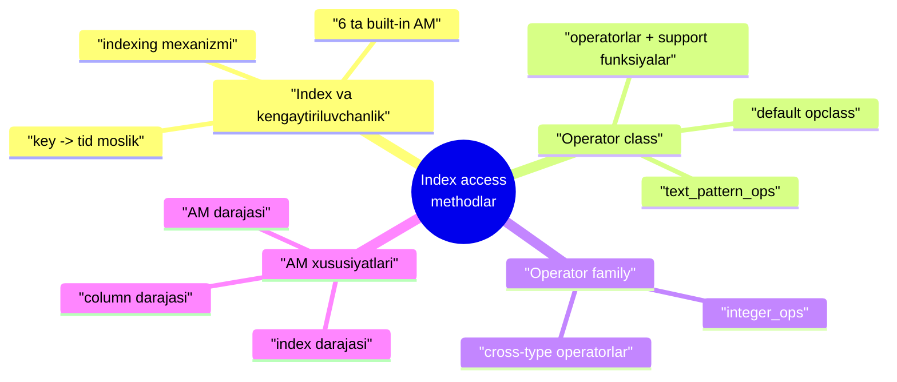
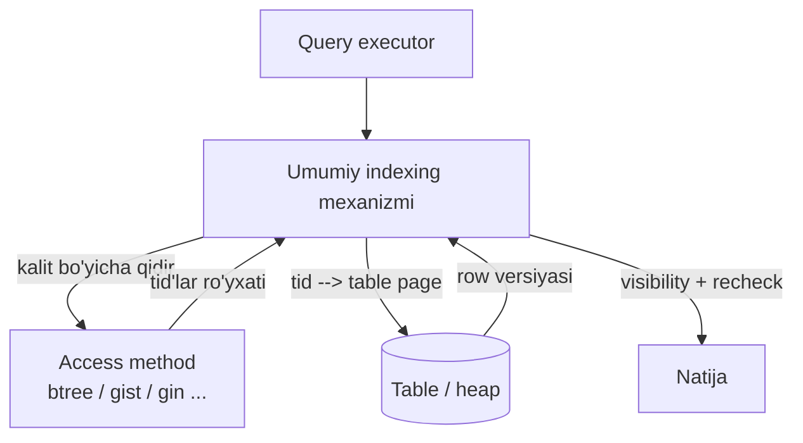
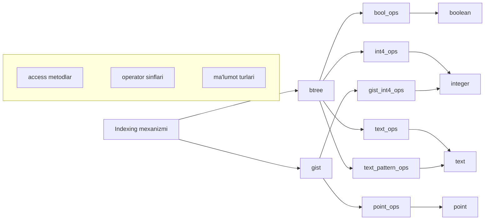
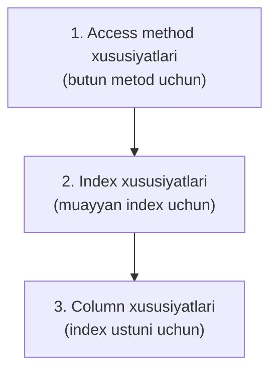

# 19. Index access methodlar

> 📖 Manba: Рогов, "PostgreSQL 17 изнутри", 19-bob ("Индексные методы доступа")

## Nima uchun kerak?

18-darsda sequential scan bilan tanishdik: butun table'ni boshdan-oxir o'qish. U **past selectivity**'da (ko'p row kerak bo'lganda) yaxshi ishlaydi, lekin million row'li table'dan **bitta** yozuvni topish uchun butun faylni o'qish — dahshatli isrofgarchilik.

Aynan shu yerda **index** yordamga keladi. Index — bu table'dagi ma'lumotga **tez kirish** uchun yordamchi struktura. U kalit (masalan, ustun qiymati) bilan shu kalit uchraydigan **row versiyalari** o'rtasida moslik o'rnatadi.

Lekin bu darsda index'ning *ichki tuzilishini* (B-tree qanday ishlaydi va h.k. — bu 25-darsda) o'rganmaymiz. Bu darsda **bir bosqich yuqoriroq** savolga javob beramiz:

- **Nega PostgreSQL'da index turlari shunchalik ko'p** (btree, hash, gist, gin, spgist, brin, ...)?
- Kernel bu har xil index'lar bilan **qanday bir xilda ishlaydi**?
- **operator class** nima va `text_pattern_ops` qachon kerak bo'ladi?
- Planner index haqida **nima bilishi** kerak, bu ma'lumot qayerda saqlanadi?

> **Asosiy g'oya:** table access method'lar (18-dars) kabi index'lar ham **pluggable** (almashtiriladigan) va **kengaytiriluvchan**. Kernel'da index'ni qanday qurishni bilmaydigan **umumiy indexing mexanizmi** bor; har bir index turi esa maxsus **interfeys** orqali o'z imkoniyatlari va xususiyatlarini bildiradi.



---

## 1-qism. Index va kengaytiriluvchanlik

Index — yordamchi obyekt: uni istagan paytda **o'chirib**, table'dagi ma'lumot asosida qaytadan qurish mumkin. Tezlashtirishdan tashqari index'lar ba'zi **integrity** cheklovlarini (masalan `UNIQUE`) qo'llab-quvvatlash uchun ham xizmat qiladi.

Kernel'da **oltita** index access method (index turi) mavjud:

```sql
=> SELECT amname FROM pg_am WHERE amtype = 'i';
 amname
--------
 btree
 hash
 gist
 gin
 spgist
 brin
(6 rows)
```

Kengaytiriluvchanlik g'oyasiga ko'ra, kernel'ni o'zgartirmasdan **yangi** index turlarini qo'shish mumkin. Bunga misol — standart extension'lar to'plamidagi **`bloom`** metodi.

Barcha farqlarga qaramay, har qanday index oxir-oqibat **kalit** (masalan indekslangan ustun qiymati) va shu kalit uchraydigan table **row versiyalari** o'rtasida moslik o'rnatadi. Havola sifatida oltibaytli **tid** (tuple id — row versiyasi identifikatori) ishlatiladi. Kalitni bilib, butun table'ni ko'rmasdan kerakli row versiyalarini tez o'qish mumkin.

### Umumiy indexing mexanizmi va AM ishlarini ajratish

Yangi metodni **extension** sifatida qo'shish mumkin bo'lishi uchun **umumiy indexing mexanizmi** ajratilgan. Uning vazifasi — access method'dan tid'larni olib, ular bilan ishlash:

- tid ko'rsatgan row versiyalarini table'dan **o'qish**;
- row versiyalari **visibility**'sini (3-4-darslar) snapshot'da tekshirish;
- agar metod shartlarni bajarilishini kafolatlamasa, shartlarni **qayta tekshirish**.

Access method'ning o'z vazifalari esa:

- index qurish, row qo'shish/o'chirish algoritmlari;
- ma'lumotni page'larga bo'lish (buffer menejeri bilan ishlash uchun — 9-dars);
- tozalash algoritmi (6-dars);
- konkurent ishlash uchun lock qo'yish (12-15-darslar);
- WAL yozuvlarini shakllantirish (10-dars);
- kalit bo'yicha qidirish va index cost'ini baholash.



> **Nega bunday bo'linish muhim?** Planner reja tuzayotganda har bir potentsial index'ning **xususiyatlarini** bilishi kerak: metod ma'lumotni darhol **kerakli tartibda** bera oladimi yoki alohida sort kerakmi? faqat **birinchi bir necha** qiymatni qaytara oladimi yoki butun tanlovnimi? Index yaratishda ham savollar bor: metod **composite** (ko'p ustunli) index'ni qo'llaydimi? **uniqueness**'ni ta'minlaydimi?

---

## 2-qism. Operator class

Kengaytiriluvchanlik yana bir tomonda ham namoyon bo'ladi: tizimga **yangi ma'lumot turlari** qo'shilishi mumkin, ular haqida access method oldindan hech narsa bilmaydi. Shuning uchun metodlar ixtiyoriy ma'lumot turlarini ulash uchun **o'z interfeyslarini** belgilaydi.

Muayyan turdagi qiymatlarni muayyan metod bilan ishlatish uchun shu interfeysni amalga oshirish kerak — ya'ni index qo'llanadigan **operatorlarni** va, ehtimol, ba'zi yordamchi **support funksiyalarni** taqdim etish. Bunday operatorlar va funksiyalar to'plami **operator class** (operatorlar sinfi) deb ataladi.



Diqqat: bitta tur uchun (masalan `text`) **bir necha operator class** bo'lishi mumkin — turli xatti-harakat bilan. Foydalanuvchi eng mosini tanlaydi.

### Default operator class

Operator class'lar `pg_opclass` katalogida saqlanadi. Ko'p hollarda ular haqida hech narsa bilishning hojati yo'q — index yaratamiz, va **default** operator class ishlatiladi. Masalan `btree` + `text` uchun to'rtta class bor, biri default:

```sql
=> SELECT opcname, opcdefault
   FROM pg_am am
   JOIN pg_opclass opc ON opcmethod = am.oid
   WHERE amname = 'btree' AND opcintype = 'text'::regtype;
       opcname       | opcdefault
---------------------+------------
 text_ops            | t
 varchar_ops         | f
 text_pattern_ops    | f
 varchar_pattern_ops | f
(4 rows)
```

Shuning uchun oddiy `CREATE INDEX ON aircrafts(model, range);` — aslida quyidagining **qisqartmasi**:

```sql
CREATE INDEX ON aircrafts
  USING btree                 -- default access method
  (
    model text_ops,           -- text uchun default operator class
    range int4_ops            -- integer uchun default operator class
  );
```

Boshqa turdagi index yoki nostandart xatti-harakat kerak bo'lsa, metod yoki operator class'ni **aniq** ko'rsatish kerak.

### Strategiya raqamlari

Metod uchun yaratilgan operator class shu metod kutgan **semantikaga** ega operatorlarni o'z ichiga olishi shart. Masalan `btree` beshta majburiy **taqqoslash operatorini** belgilaydi. Har bir class shularning **beshtasini ham** o'z ichiga olishi kerak:

```sql
=> SELECT opcname, amopstrategy, amopopr::regoperator
   FROM pg_am am
   JOIN pg_opfamily opf ON opfmethod = am.oid
   JOIN pg_opclass opc ON opcfamily = opf.oid
   JOIN pg_amop amop ON amopfamily = opcfamily
   WHERE amname = 'btree'
     AND opcname IN ('text_ops', 'text_pattern_ops')
     AND amoplefttype = 'text'::regtype
     AND amoprighttype = 'text'::regtype
   ORDER BY opcname, amopstrategy;
     opcname      | amopstrategy |    amopopr
------------------+--------------+-----------------
 text_ops         |            1 | <(text,text)
 text_ops         |            2 | <=(text,text)
 text_ops         |            3 | =(text,text)
 text_ops         |            4 | >=(text,text)
 text_ops         |            5 | >(text,text)
 text_pattern_ops |            1 | ~<~(text,text)
 text_pattern_ops |            2 | ~<=~(text,text)
 text_pattern_ops |            3 | =(text,text)
 text_pattern_ops |            4 | ~>=~(text,text)
 text_pattern_ops |            5 | ~>~(text,text)
(10 rows)
```

Operator semantikasi **strategiya raqamida** (`amopstrategy`) aks etadi: `btree` uchun 1 = «kichik», 2 = «kichik yoki teng» va h.k. **Operator nomlari esa ixtiyoriy bo'lishi mumkin** — shuning uchun `text_pattern_ops`'da tilda (`~<~`) operatorlar bor. Ular oddiy operatorlardan farqi — **collation** (sort qoidasi) ni hisobga olmaydi, satrlarni **baytma-bayt** taqqoslaydi. Lekin ikkalasi ham **bir xil ma'nodagi** taqqoslash operatsiyasini bajaradi.

### `text_pattern_ops` qachon kerak?

Bu — darsning eng amaliy qismi. `text_pattern_ops` operator class `~~` operatori (ya'ni `LIKE`) cheklovini **yengib o'tishga** imkon beradi. **C'dan farqli collation'ga ega bazada** oddiy text index'i `LIKE` uchun ishlamaydi:

```sql
=> SELECT datcollate FROM pg_database WHERE datname = current_database();
 datcollate
-------------
 en_US.UTF-8
(1 row)
```

**Yomon holat — oddiy index, `LIKE` ishlamaydi:**

```sql
=> CREATE INDEX ON tickets(passenger_name);
=> EXPLAIN (costs off)
   SELECT * FROM tickets WHERE passenger_name LIKE 'ELENA%';
                     QUERY PLAN
--------------------------------------------
 Seq Scan on tickets
   Filter: (passenger_name ~~ 'ELENA%'::text)
(2 rows)
```

Index bor, lekin planner uni ishlatmaydi — **Seq Scan**. Sababi: default `text_ops` collation'ga tayanadi, `LIKE`'ni esa index sharti'ga aylantirib bo'lmaydi.

**Yaxshi holat — `text_pattern_ops` bilan index:**

```sql
=> CREATE INDEX tickets_passenger_name_pattern_idx
   ON tickets(passenger_name text_pattern_ops);
=> EXPLAIN (costs off)
   SELECT * FROM tickets WHERE passenger_name LIKE 'ELENA%';
                     QUERY PLAN
--------------------------------------------------------------
 Bitmap Heap Scan on tickets
   Filter: (passenger_name ~~ 'ELENA%'::text)
   ->  Bitmap Index Scan on tickets_passenger_name_pattern_idx
         Index Cond: ((passenger_name ~>=~ 'ELENA'::text) AND
                      (passenger_name ~<~ 'ELENB'::text))
(5 rows)
```

E'tibor bering, `Index Cond` qanday o'zgardi: qidiruv uchun shablonning **`%` gacha bo'lgan prefiksi** ishlatiladi (`'ELENA' <= passenger_name < 'ELENB'`), ortiqcha mosliklar esa `Filter` orqali chiqarib tashlanadi. `text_pattern_ops` operatorlari collation'ni hisobga olmagani uchun `LIKE` shartini **ekvivalent** taqqoslash shartiga almashtirish mumkin bo'ldi.

### Index qachon ishlatiladi?

Index shart bo'yicha kirishni tezlashtirish uchun ikkita talab bajarilsa ishlatiladi:

1. Shart **`indekslangan-ustun operator ifoda`** ko'rinishida (yoki, operator uchun **commutator** — o'rin almashtiruvchi operator ko'rsatilgan bo'lsa, `ifoda operator indekslangan-ustun` ham).
2. Operator index yaratishda ko'rsatilgan operator class'ga **kiradi**.

Masalan, argumentlar teskari tartibda turgan so'rov ham index ishlatishi mumkin — bajarilishda indekslangan maydon **chap argument** bo'lishi kerak, operator commutator'ga almashadi (tenglik kommutativ, shuning uchun aynan o'zi):

```sql
=> EXPLAIN (costs off)
   SELECT * FROM tickets WHERE 'ELENA BELOVA' = passenger_name;
                       QUERY PLAN
-------------------------------------------------------
 Index Scan using tickets_passenger_name_idx on tickets
   Index Cond: (passenger_name = 'ELENA BELOVA'::text)
(2 rows)
```

### Ifoda bo'yicha index (expression index)

Ustun nomi o'rniga **funksiya chaqiruvi** bo'lsa, oddiy index printsipial ishlamaydi:

```sql
=> EXPLAIN (costs off)
   SELECT * FROM tickets WHERE initcap(passenger_name) = 'Elena Belova';
                       QUERY PLAN
--------------------------------------------------------
 Seq Scan on tickets
   Filter: (initcap(passenger_name) = 'Elena Belova'::text)
(2 rows)
```

Bunday holatda **ifoda bo'yicha index** yaratish mumkin — ustun emas, ixtiyoriy ifodani ko'rsatib:

```sql
=> CREATE INDEX ON tickets( (initcap(passenger_name)) );
=> EXPLAIN (costs off)
   SELECT * FROM tickets WHERE initcap(passenger_name) = 'Elena Belova';
                       QUERY PLAN
--------------------------------------------------------------
 Bitmap Heap Scan on tickets
   Recheck Cond: (initcap(passenger_name) = 'Elena Belova'::text)
   ->  Bitmap Index Scan on tickets_initcap_idx
         Index Cond: (initcap(passenger_name) = 'Elena Belova'::text)
(4 rows)
```

> ⚠️ **Muhim cheklov — IMMUTABLE.** Ifoda faqat table row'idagi maydon qiymatlariga bog'liq bo'lishi, boshqa ma'lumotga yoki sozlamalarga (masalan locale) **bog'liq bo'lmasligi** kerak. Ya'ni ifodadagi funksiyalar `IMMUTABLE` (o'zgarmas) toifada bo'lishi shart. Aks holda index orqali bajarilgan so'rov natijasi to'liq skanlash natijasidan **farq qilishi** mumkin — bu jimgina noto'g'ri ma'lumotga olib keladi.

### Support funksiyalar

Operatorlardan tashqari operator class metod uchun kerakli **support funksiyalarni** ham beradi. Masalan `btree` beshta support funksiyani belgilaydi, ulardan faqat birinchisi (ikki qiymatni taqqoslovchi) **majburiy**, qolganlari bo'lmasligi mumkin:

```sql
=> SELECT amprocnum, amproc::regproc
   FROM pg_am am
   JOIN pg_opfamily opf ON opfmethod = am.oid
   JOIN pg_opclass opc ON opcfamily = opf.oid
   JOIN pg_amproc amproc ON amprocfamily = opcfamily
   WHERE amname = 'btree' AND opcname = 'text_ops'
     AND amproclefttype = 'text'::regtype
     AND amprocrighttype = 'text'::regtype
   ORDER BY amprocnum;
 amprocnum |       amproc
-----------+--------------------
         1 | bttextcmp
         2 | bttextsortsupport
         4 | btvarstrequalimage
(3 rows)
```

---

## 3-qism. Operator family

Operator class doim biror **operator family**'ga (operatorlar oilasi, `pg_opfamily` katalogi) kiradi. Bir umumiy oilaga bir necha class kirishi mumkin — agar ular **o'xshash turlar** bilan **bir xilda** ishlasa.

Masalan `integer_ops` oilasi ma'nosi bir xil, lekin **o'lchami turlicha** son turlari uchun class'larni birlashtiradi:

```sql
=> SELECT opcname, opcintype::regtype
   FROM pg_am am
   JOIN pg_opfamily opf ON opfmethod = am.oid
   JOIN pg_opclass opc ON opcfamily = opf.oid
   WHERE amname = 'btree' AND opfname = 'integer_ops';
 opcname  | opcintype
----------+-----------
 int2_ops | smallint
 int4_ops | integer
 int8_ops | bigint
(3 rows)
```

Xuddi shunday `datetime_ops` oilasi sana/vaqt turlari uchun class'larni (`date_ops`, `timestamp_ops`, `timestamptz_ops`) birlashtiradi.

Har bir operator class **bitta** tur bilan ishlaydi. Oila esa **turli turlarni** qabul qiluvchi operatorlarni ham o'z ichiga oladi (cross-type):

```sql
=> SELECT opcname, amopopr::regoperator
   FROM pg_am am
   JOIN pg_opfamily opf ON opfmethod = am.oid
   JOIN pg_opclass opc ON opcfamily = opf.oid
   JOIN pg_amop amop ON amopfamily = opcfamily
   WHERE amname = 'btree' AND opfname = 'integer_ops'
     AND amoplefttype = 'integer'::regtype AND amopstrategy = 1
   ORDER BY opcname;
 opcname  |      amopopr
----------+--------------------
 int2_ops | <(integer,bigint)
 int2_ops | <(integer,smallint)
 int2_ops | <(integer,integer)
 int4_ops | <(integer,bigint)
 ...
(9 rows)
```

> **Nega bu foydali?** Operatorlarni oilaga guruhlash tufayli planner index'ni **turli turdagi** qiymatlar bilan shartlar uchun ishlatishi mumkin — aniq **type cast** (tur o'zgartirish) talab qilmasdan. Masalan `integer` ustunni `bigint` qiymat bilan taqqoslaganda ham index ishlaydi.

---

## 4-qism. Indexing mexanizmi interfeysi va uch daraja xususiyat

Table AM'lar (18-dars) kabi, `pg_am.amhandler` ustunida interfeysni amalga oshiruvchi funksiya nomi turadi:

```sql
=> SELECT amname, amhandler FROM pg_am WHERE amtype = 'i';
 amname | amhandler
--------+-------------
 btree  | bthandler
 hash   | hashhandler
 gist   | gisthandler
 gin    | ginhandler
 spgist | spghandler
 brin   | brinhandler
(6 rows)
```

Bu funksiya interfeys strukturasini to'ldiradi. Berilgan ma'lumotning bir qismi — **funksiyalar** (index'ni skanlash, tid qaytarish va h.k.), bir qismi — indexing mexanizmi oldindan bilishi kerak bo'lgan **xususiyatlar**. Barcha xususiyatlar **uch darajaga** bo'linadi:



> Metod va index darajasini ajratish **kelajakni** ko'zlab qilingan: hozircha bitta metod asosida yaratilgan barcha index'lar bu ikki darajada **bir xil** xususiyatga ega bo'ladi.

### 4.1. Access method xususiyatlari

`pg_indexam_has_property` bilan tekshiriladi (`btree` misolida beshtasi ham `t`):

```sql
=> SELECT a.amname, p.name, pg_indexam_has_property(a.oid, p.name)
   FROM pg_am a, unnest(array[
     'can_order', 'can_unique', 'can_multi_col',
     'can_exclude', 'can_include'
   ]) p(name)
   WHERE a.amname = 'btree';
 amname |     name      | pg_indexam_has_property
--------+---------------+-------------------------
 btree  | can_order     | t
 btree  | can_unique    | t
 btree  | can_multi_col | t
 btree  | can_exclude   | t
 btree  | can_include   | t
(5 rows)
```

**`can_order`** — ma'lumotni **saralangan tartibda** berish. Hozircha faqat `btree`'da. Sort'ni har doim alohida qilish mumkin (Seq Scan + Sort), lekin bu xususiyatli index natijani **darhol** kerakli tartibda beradi:

```sql
=> EXPLAIN (costs off) SELECT * FROM seats ORDER BY seat_no;   -- index yo'q
       QUERY PLAN            =>  EXPLAIN ... ORDER BY aircraft_code;  -- index bor
--------------------             Index Scan using seats_pkey on seats
 Sort
   Sort Key: seat_no
   ->  Seq Scan on seats
```

**`can_unique`** — `UNIQUE` va primary key qo'llab-quvvatlashi. Faqat `btree`. Unique yoki PK e'lon qilinganda **avtomatik** unique index yaratiladi:

```sql
=> INSERT INTO bookings(book_ref, book_date, total_amount)
   VALUES ('000004', now(), 100.00);
ERROR:  duplicate key value violates unique constraint "bookings_pkey"
DETAIL:  Key (book_ref)=(000004) already exists.
```

> **Constraint va index farqi:** integrity constraint — bu **bajarilishi kerak bo'lgan xususiyat deklaratsiyasi**, index esa uni **ta'minlovchi mexanizm**. Ba'zan constraint boshqa vosita bilan ham kafolatlanishi mumkin (masalan partitsiyalangan table'da global uniqueness lokal unique index'lar orqali).

**`can_multi_col`** — bir necha ustunli **composite** index. Masalan `ticket_flights` composite PK:

```sql
=> EXPLAIN (costs off)
   SELECT * FROM ticket_flights
   WHERE ticket_no = '0005432001355' AND flight_id = 51618;
                       QUERY PLAN
-------------------------------------------------------
 Index Scan using ticket_flights_pkey on ticket_flights
   Index Cond: ((ticket_no = '0005432001355'::bpchar) AND
                (flight_id = 51618))
(3 rows)
```

Composite index qism shartlar uchun ham ishlaydi, lekin `btree`'da faqat shart **boshlang'ich ustunlarni** qamrasa samarali (masalan faqat `ticket_no` bo'yicha — ishlaydi; faqat `flight_id` bo'yicha — index boshlang'ich ustundan cheklanadi, qolgani filter bo'ladi). Boshqa index turlarida (28-dars, GIN) bu boshqacha bo'lishi mumkin.

**`can_exclude`** — `EXCLUDE` cheklovi. Operator (odatda kesishish `&&`) orqali aniqlangan shart table'ning **hech bir juft row'i uchun bajarilmasligini** kafolatlaydi. Masalan bitta xona ikki marta bir vaqtga bron qilinmasligini deklarativ e'lon qilish. `=` operatori bilan u uniqueness ma'nosini oladi (lekin baribir unique constraint bilan **bir xil emas**: EXCLUDE kalitiga foreign key qo'yib bo'lmaydi, `ON CONFLICT`'da ishlatib bo'lmaydi).

**`can_include`** — index kalitiga **kirmaydigan** ustunlarni qo'shib, index'ni **covering** (qamrovchi) qilish (v11). Masalan unique index'ga qo'shimcha ustun qo'shib, table'ga murojaat qilmasdan uni o'qish:

```sql
=> CREATE UNIQUE INDEX ON flights(flight_id) INCLUDE (status);
=> EXPLAIN (costs off)
   SELECT status FROM flights WHERE flight_id = 51618;
                          QUERY PLAN
-------------------------------------------------------------
 Index Only Scan using flights_flight_id_status_idx on flights
   Index Cond: (flight_id = 51618)
(2 rows)
```

**SQL'da ko'rinmaydigan yana ikki muhim AM xususiyati:**

- **`can_pred_locks`** — predikat lock'lar (14-dars) qo'llab-quvvatlashi. `spgist` va `brin`'da **yo'q**: `Serializable` darajasida bunday index'ni skanlaganda predikat lock **butun table'ga** qo'yiladi (xuddi sequential scan kabi) — bu unumdorlikni pasaytiradi.
- **`can_build_parallel`** — index'ni bir necha jarayon bilan **parallel qurish**. `btree` va `brin` (v17) qo'llaydi.

### 4.2. Index xususiyatlari

`pg_index_has_property` bilan tekshiriladi (mavjud index misolida):

```sql
=> SELECT p.name, pg_index_has_property('seats_pkey', p.name)
   FROM unnest(array[
     'clusterable', 'index_scan', 'bitmap_scan', 'backward_scan'
   ]) p(name);
     name      | pg_index_has_property
---------------+-----------------------
 clusterable   | t
 index_scan    | t
 bitmap_scan   | t
 backward_scan | t
(4 rows)
```

| Xususiyat | Ma'nosi |
|---|---|
| **clusterable** | `CLUSTER` bilan row versiyalarini index tartibiga fizik joylashtirish mumkin (8-dars) |
| **index_scan** | oddiy **index scan** (tid'larni **bittalab** qaytarish). Ajablanarli, lekin hamma index buni qo'llamaydi |
| **bitmap_scan** | **bitmap scan** (barcha tid bo'yicha bir yo'la **bitmap** qurish) — 20-darsda |
| **backward_scan** | natijani index yaratishdagi tartibga **teskari** qaytarish |

### 4.3. Column (ustun) xususiyatlari

`pg_index_column_has_property` bilan tekshiriladi (birinchi ustun uchun):

```sql
=> SELECT p.name,
     pg_index_column_has_property('seats_pkey', 1, p.name)
   FROM unnest(array[
     'asc', 'desc', 'nulls_first', 'nulls_last', 'orderable',
     'distance_orderable', 'returnable', 'search_array', 'search_nulls'
   ]) p(name);
        name        | pg_index_column_has_property
--------------------+------------------------------
 asc                | t
 desc               | f
 nulls_first        | f
 nulls_last         | t
 orderable          | t
 distance_orderable | f
 returnable         | t
 search_array       | t
 search_nulls       | t
(9 rows)
```

**`asc` / `desc` / `nulls_first` / `nulls_last`** — qiymatlar o'sish yoki kamayish tartibida saqlanishi va `NULL`'lar qayerda turishi. Faqat `btree`'ga tegishli.

**`orderable`** — ustunni `ORDER BY`'da saralash imkoni. Faqat `btree`.

**`distance_orderable`** — **saralash operatorlarini** qo'llab-quvvatlash. Oddiy index operatorlari mantiqiy (boolean) qiymat qaytaradi; saralash operatorlari esa haqiqiy son — bir argumentdan ikkinchisiga «masofa» qaytaradi. Masalan `gist` va `<->` operatori bilan berilgan nuqtaga **eng yaqin** aeroportlarni topish:

```sql
=> CREATE INDEX ON airports_data USING gist(coordinates);
=> EXPLAIN (costs off)
   SELECT * FROM airports
   ORDER BY coordinates <-> point(43.578, 57.593) LIMIT 3;
                          QUERY PLAN
--------------------------------------------------------------
 Limit
   ->  Index Scan using airports_data_coordinates_idx on airpo...
         Order By: (coordinates <-> '(43.578,57.593)'::point)
(3 rows)
```

**`returnable`** — table'ga murojaat qilmasdan index'dan ma'lumot olish, ya'ni **index only scan** (20-dars) qo'llab-quvvatlashi. Index indekslangan qiymatlarni **tiklab** bera olishini bildiradi. Bu har doim mumkin emas: ba'zi index'lar qiymatning o'zini emas, **hash-kod**'ini saqlaydi — bunday holda `can_include` ham ishlamaydi.

**`search_array`** — massivdan bir necha qiymatni qidirish. Planner `IN (ro'yxat)` konstruksiyasini **massiv bo'yicha qidiruvga** aylantiradi:

```sql
=> EXPLAIN (costs off)
   SELECT * FROM bookings WHERE book_ref IN ('C7C821', 'A5D060', 'DDE1BB');
                     QUERY PLAN
-------------------------------------------
 Index Scan using bookings_pkey on bookings
   Index Cond: (book_ref = ANY ('{C7C821,A5D060,DDE1BB}'::bpchar[]))
(3 rows)
```

**`search_nulls`** — `IS NULL` va `IS NOT NULL` shartlari bo'yicha qidirish. `NULL`'larni indekslash `IS [NOT] NULL` shartlarida va (table'ga shart umuman bo'lmaganda) covering index sifatida index ishlatishga imkon beradi. Lekin `NULL`'siz index **ixchamroq** bo'lishi mumkin.

### Partial (qisman) index

Agar `NULL`'lar kerak bo'lmasa yoki umuman faqat ma'lum row'lar qiziqtirsa — **partial index** qurish mumkin (faqat kerakli row'lar bo'yicha):

```sql
=> CREATE INDEX ON flights(actual_arrival)
   WHERE actual_arrival IS NOT NULL;
=> EXPLAIN (costs off)
   SELECT * FROM flights
   WHERE actual_arrival = '2017-06-13 10:33:00+03';
                          QUERY PLAN
--------------------------------------------------------------
 Index Scan using flights_actual_arrival_idx on flights
   Index Cond: (actual_arrival = '2017-06-13 10:33:00+03'::ti...
(2 rows)
```

Partial index to'liqidan **kichikroq** va indeksga kirmaydigan row'lar o'zgarganda **yangilanmaydi** — bu sezilarli yutuq berishi mumkin. `WHERE` shartida istalgan (IMMUTABLE talabiga javob beradigan) shart bo'lishi mumkin. Partial index **metodga bog'liq emas**, uni indexing mexanizmi ta'minlaydi.

> Interfeys **hamma** imkoniyatlarni qamramaydi — faqat to'g'ri qaror uchun oldindan bilish kerak bo'lganlarini. Masalan `CONCURRENTLY` (bloklamay index qurish) uchun alohida xususiyat yo'q — u interfeys funksiyalari kodida aniqlanadi.

---

## Xulosa

- **Index** — kalit va row versiyalari (**tid**) o'rtasida moslik o'rnatuvchi yordamchi struktura. Kernel'da oltita index AM bor (btree, hash, gist, gin, spgist, brin), extension bilan yangilarini qo'shish mumkin (masalan `bloom`).
- **Umumiy indexing mexanizmi** AM'dan tid oladi, table'dan row o'qiydi, visibility'ni tekshiradi va, kerak bo'lsa, shartlarni qayta tekshiradi. AM esa qurish/qidirish/tozalash/lock/WAL/cost bilan shug'ullanadi.
- **Operator class** — muayyan tur uchun operatorlar + support funksiyalar to'plami. Index qaysi shartlar uchun ishlatilishini u belgilaydi. Odatda **default** class ishlatiladi.
- **`text_pattern_ops`** — collation'ni hisobga olmaydigan, baytma-bayt taqqoslovchi class. C'dan farqli collation'da **`LIKE 'prefix%'`** uchun index ishlashini ta'minlaydi.
- Index ishlatilishi uchun shart **`ustun operator ifoda`** ko'rinishida va operator index class'ida bo'lishi kerak. Funksiya chaqiruvli shart uchun **expression index** kerak (funksiyalar **IMMUTABLE** bo'lsin).
- **Operator family** o'xshash turlar uchun class'larni birlashtiradi va **cross-type** taqqoslashda index'dan foydalanishga imkon beradi (aniq type cast'siz).
- AM xususiyatlari uch darajada: **AM** (`can_order`, `can_unique`, `can_multi_col`, `can_exclude`, `can_include`), **index** (`clusterable`, `index_scan`, `bitmap_scan`, `backward_scan`), **column** (`asc/desc`, `orderable`, `distance_orderable`, `returnable`, `search_array`, `search_nulls`).
- **Partial index** — faqat kerakli row'lar bo'yicha; kichikroq va kamroq yangilanadi. Metodga bog'liq emas.

## Nazorat savollari

1. Nega PostgreSQL'da index turlari (access method'lar) shunchalik ko'p, va kernel ular bilan qanday **bir xilda** ishlaydi? Umumiy indexing mexanizmi va access method vazifalarini ajrating.
2. Operator class nima? `CREATE INDEX ON aircrafts(model, range);` buyrug'i «ostida» aslida nima yashiringan?
3. `text_ops` va `text_pattern_ops` orasidagi farq nimada? C'dan farqli collation'ga ega bazada `WHERE name LIKE 'ELENA%'` so'rovi uchun qaysi biri kerak va nega?
4. Index shart bo'yicha ishlatilishi uchun qanday ikki talab bajarilishi kerak? `WHERE initcap(name) = 'Elena'` so'rovi oddiy index ishlatmaydi — nima uchun va yechim nima? Bu yechimda `IMMUTABLE` talabi nega muhim?
5. Operator family class'dan qanday farq qiladi? `integer` ustunni `bigint` qiymat bilan taqqoslaganda index nega ishlayveradi?
6. AM, index va column darajasidagi xususiyatlarga bittadan misol keltiring. `can_unique` xususiyati va unga bog'liq «constraint va index farqi» nima?
7. `returnable` va `distance_orderable` xususiyatlari nimani anglatadi? Har biriga qaysi scan turi yoki operator misol bo'ladi?
8. Partial index nima uchun to'liq index'dan afzal bo'lishi mumkin? Uni `NULL`'larni indekslamaslik uchun qanday ishlatasiz?
