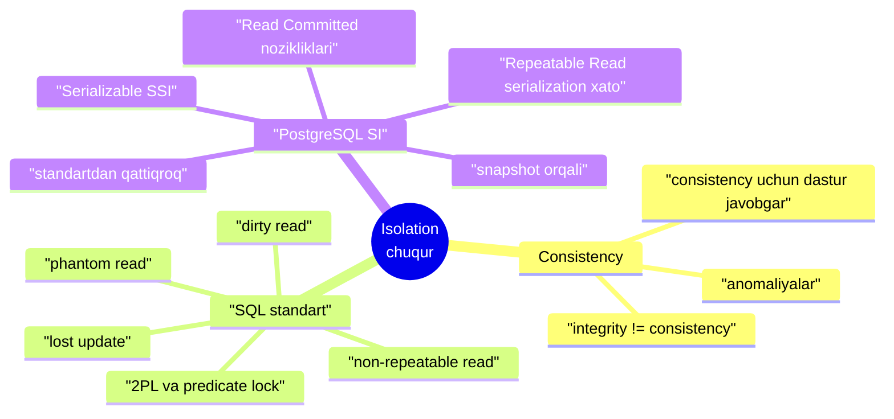
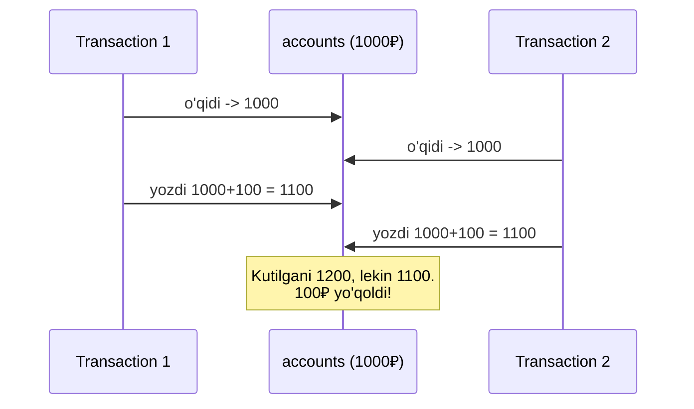
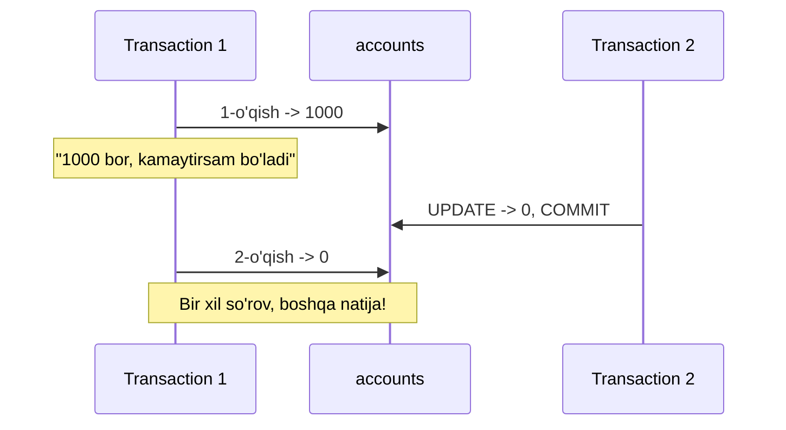
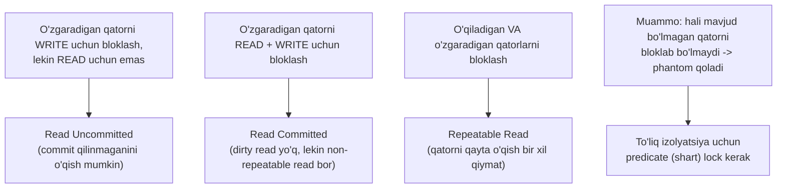
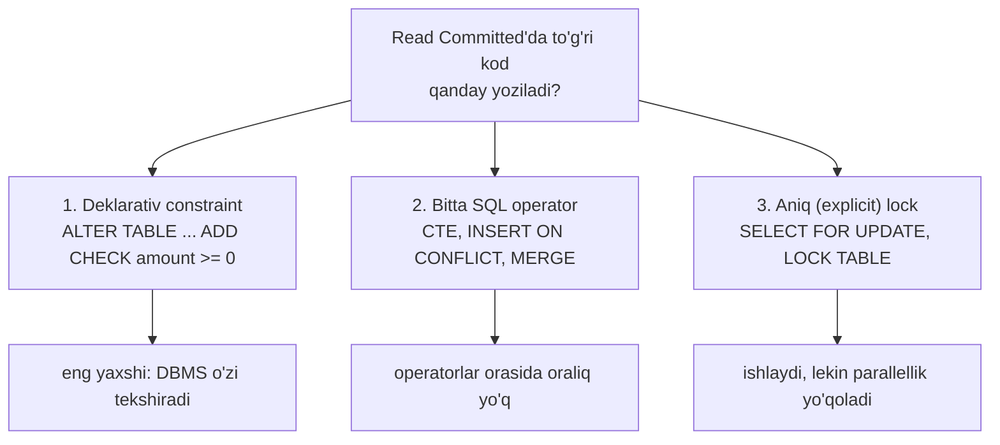
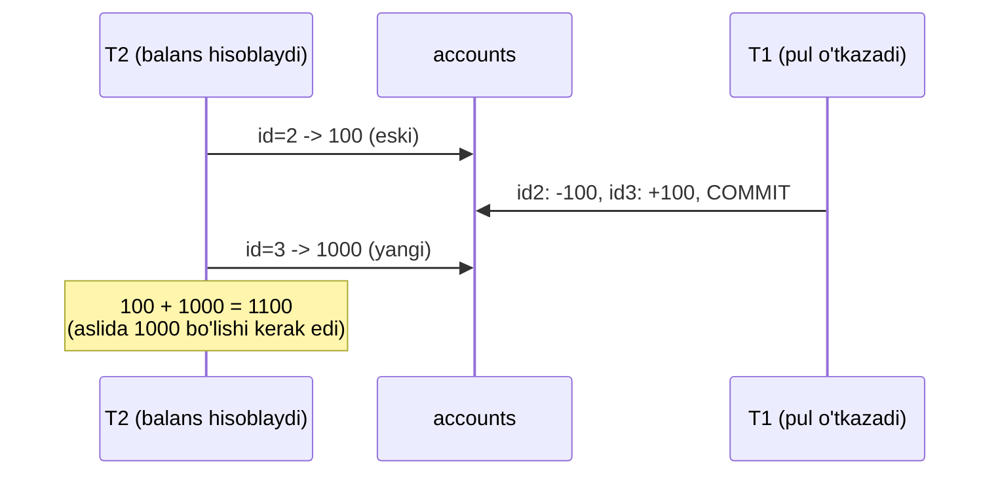
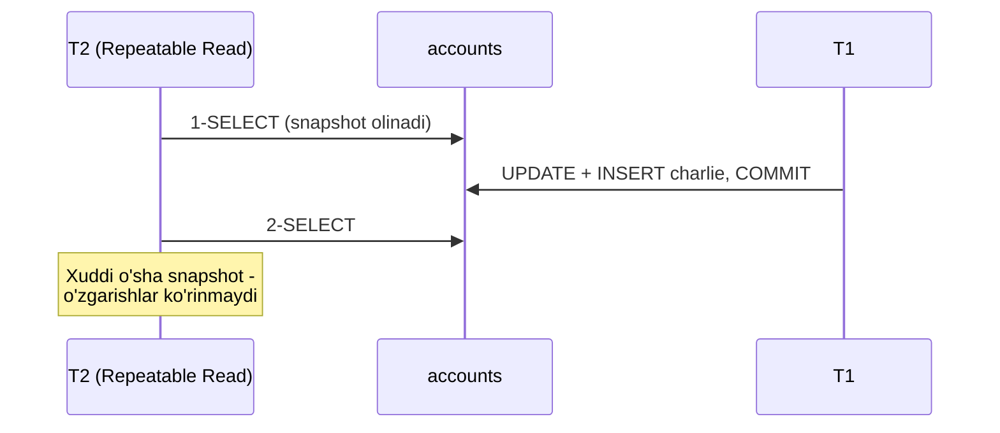
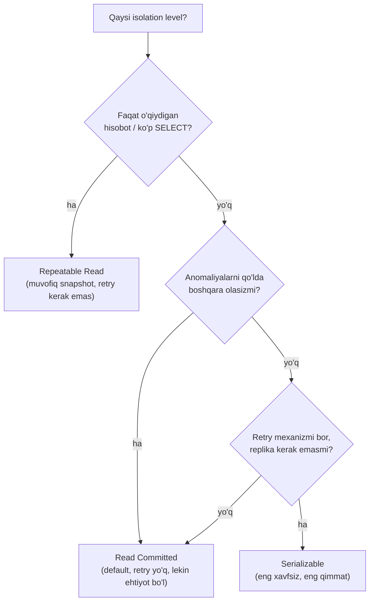

# 2. Isolation — chuqur

> 📖 Manba: Рогов, "PostgreSQL 17 изнутри", 2-bob ("Изоляция")

## Nima uchun kerak?

Basic kursning **15-darsi**da siz transaction, ACID va isolation levellar bilan tanishgansiz: `BEGIN ... COMMIT`, dirty read, non-repeatable read, phantom read va PostgreSQL default holda `Read Committed` ishlatishini ko'rgansiz. U yerda biz bularni **foydalanuvchi ko'zi** bilan ko'rdik — "nima bo'ladi" ni.

Bu darsda esa **muhandis ko'zi** bilan qaraymiz — "**nega** aynan shunday bo'ladi" ga. Bu juda muhim, chunki:

- PostgreSQL isolation'ni **locklar** orqali emas, **snapshot** (ma'lumot surati) orqali beradi. Shu sabab uning xatti-harakati SQL standartidan farq qiladi.
- `Read Committed` — eng ko'p ishlatiladigan level, lekin unda **standartda tilga olinmagan** yashirin anomaliyalar bor (read skew, lost update). Ularni bilmasangiz, production'da jimgina noto'g'ri ma'lumot yozib qo'yasiz.
- `Repeatable Read` va `Serializable`'da `could not serialize` xatosi chiqadi — kodni **retry** (qayta urinish)ga tayyorlash kerak.

Bir jumlada aytganda: **qaysi level qanday kafolat beradi va qanday bermaydi — buni bilmasdan turib ishonchli backend kodini yozib bo'lmaydi.**



---

## 1-qism. Consistency — integrity'dan kuchliroq

Relyatsion DBMS'ning asosiy vazifasi — ma'lumotlarning **consistency**'sini (to'g'riligini) ta'minlash. Lekin bu yerda ikkita tushunchani aniq ajratish kerak:

| Tushuncha | Kim ta'minlaydi | Misol |
|-----------|-----------------|-------|
| **Integrity** (yaxlitlik) | DBMS o'zi | `NOT NULL`, `UNIQUE`, `CHECK`, `FOREIGN KEY` |
| **Consistency** (muvofiqlik) | Ko'p hollarda **dastur** | "o'tkazma hisoblardagi umumiy summani o'zgartirmaydi" |

Integrity cheklovlarini SQL'da e'lon qilish oson va DBMS ularni hech qachon buzilishiga yo'l qo'ymaydi. Lekin ba'zi consistency qoidalari juda murakkab (bir necha jadvalni qamrab oladi) yoki umuman SQL'da ifodalab bo'lmaydi. Shuning uchun ular **dastur darajasida** yashaydi va DBMS ular haqida hech narsa bilmaydi.

> **Klassik misol.** Bir hisobdan ikkinchisiga pul o'tkazish. Qoida: *o'tkazma hisoblardagi umumiy summani o'zgartirmaydi*. O'tkazma ikki amaldan iborat: birinchisi bir hisobdan pulni ayiradi (bu paytda consistency **vaqtincha buziladi**), ikkinchisi boshqasiga qo'shadi (consistency **tiklanadi**). Agar ikki amal orasida nosozlik bo'lsa — pul yo'qoladi.

Aynan shu yerda DBMS'ning roli ochiladi. To'g'ri yozilgan transactionlar ham **parallel** ishlaganda noto'g'ri natija berishi mumkin — chunki ularning amallari bir-biriga aralashib ketadi. Bunday holatlar **konkurent bajarilish anomaliyalari** deb ataladi.

DBMS'ning vazifasi — transactionlarni bir-biridan **izolyatsiya** qilib, bu anomaliyalarni yo'q qilish. Shunday qilib, ACID akronimining birinchi uch harfi bir-biridan ajralmas:

- **A**tomicity — transaction to'liq bajariladi yoki umuman bajarilmaydi;
- **C**onsistency — baza bir to'g'ri holatdan boshqa to'g'ri holatga o'tadi;
- **I**solation — parallel transactionlar bir-biriga xalaqit bermaydi.

> ⚠️ **Muhim haqiqat.** To'liq izolyatsiya — texnik jihatdan qimmat. Shuning uchun amalda deyarli har doim **zaiflashtirilgan izolyatsiya** ishlatiladi: u ba'zi anomaliyalarni bartaraf etadi, lekin **hammasini emas**. Demak consistency'ni ta'minlash ishining **bir qismi dasturga** tushadi. Aynan shu sabab qaysi level qanday kafolat berishini bilish kritik ahamiyatga ega.

---

## 2-qism. SQL standartidagi anomaliyalar

SQL standarti to'rtta isolation level'ni **ruxsat etilgan/etilmagan anomaliyalar** orqali ta'riflaydi. Shuning uchun avval anomaliyalarni ko'rib chiqamiz.

Barcha misollarda bank hisoblari ishlatiladi (`alice`, `bob`). Bu — ko'rgazmali, lekin haqiqiy bank operatsiyalari qanday qurilganiga aloqasi yo'q, shunchaki o'quv modeli.

### Lost update (yo'qolgan yangilanish)

Ikki transaction bitta qatorni o'qiydi, keyin biri uni yangilaydi, so'ng ikkinchisi **birinchisining o'zgarishini hisobga olmasdan** yangilaydi.



> Standart bo'yicha lost update **hech bir level'da ruxsat etilmaydi.**

### Dirty read (iflos o'qish)

Transaction boshqa transaction qilgan, lekin hali **commit qilinmagan** o'zgarishni o'qiydi.

Misol: birinchi transaction bo'sh hisobga 100₽ o'tkazadi (lekin commit qilmaydi), ikkinchisi bu "yangilangan" holatni o'qib, mijozga naqd pul beradi. So'ng birinchi transaction bekor qilinadi — hisobda pul yo'q, lekin naqd allaqachon berilgan.

> Standart bo'yicha dirty read faqat **Read Uncommitted** level'da ruxsat etiladi.

### Non-repeatable read (takrorlanmaydigan o'qish)

Transaction bitta qatorni **ikki marta** o'qiydi, oralig'ida boshqa transaction uni o'zgartirib (yoki o'chirib) commit qiladi. Natijada ikkinchi o'qishda boshqa qiymat chiqadi.



> Standart bo'yicha Read Uncommitted va **Read Committed** level'larida ruxsat etiladi.

### Phantom read (fantom o'qish)

Transaction bitta **shart** bo'yicha qatorlar to'plamini ikki marta o'qiydi, oralig'ida boshqa transaction shu shartga mos **yangi qator** qo'shib commit qiladi. Natijada ikkinchi o'qishda "fantom" qatorlar paydo bo'ladi.

Misol: qoida "mijozda uchtadan ko'p hisob bo'lmasin". Birinchi transaction hisoblar sonini sanaydi (2 ta), yangi hisob ochmoqchi. Shu payt ikkinchisi ham yangi hisob ochib commit qiladi. Natijada mijozda 4 ta hisob bo'lib qoladi.

> Standart bo'yicha Read Uncommitted, Read Committed va **Repeatable Read** level'larida ruxsat etiladi.

### Serializable — anomaliyalarning to'liq yo'qligi

Standart yana bitta level — **Serializable** — belgilaydi, unda **hech qanday** anomaliya bo'lmaydi. Diqqat: bu "yuqoridagi 4 tasini taqiqlash" bilan **bir xil emas**. Chunki ma'lum anomaliyalar sanab o'tilganidan ko'proq, bundan tashqari hali noma'lumlari ham bor. Serializable esa **har qanday** anomaliyani (ma'lum va noma'lumini ham) oldini olishi kerak.

### Standart jadvali

| Isolation level | Lost update | Dirty read | Non-repeatable read | Phantom read | Boshqa anomaliyalar |
|-----------------|:-----------:|:----------:|:-------------------:|:------------:|:-------------------:|
| **Read Uncommitted** | — | ha | ha | ha | ha |
| **Read Committed** | — | — | ha | ha | ha |
| **Repeatable Read** | — | — | — | ha | ha |
| **Serializable** | — | — | — | — | — |

### Nega aynan bu anomaliyalar? Locklar va 2PL

Standart yaratilganda izolyatsiya **locklar** ustiga quriladi deb faraz qilingan edi. Keng tarqalgan **ikki fazali locklash protokoli (2PL)** g'oyasi: transaction bajarilish davomida tegishli qatorlarni bloklaydi, tugagach bo'shatadi. Qancha ko'p lock — shuncha yaxshi izolyatsiya, lekin shuncha yomon parallellik.

Standart level'lar orasidagi farqni aynan **kerakli locklar soni** bilan tushuntirsa bo'ladi:



Serializable bilan muammo shundaki: **hali yo'q qatorni bloklab bo'lmaydi**. Shu sabab phantom read qoladi. To'liq izolyatsiya uchun qatorlarni emas, **shartlarni (predikatlarni)** bloklash kerak edi — lekin bunday predicate lock amalda hech qaysi tizimda to'liq amalga oshirilmadi.

---

## 3-qism. PostgreSQL: locklar o'rniga snapshot

Vaqt o'tishi bilan lock protokollari o'rnini **Snapshot Isolation (SI)** protokoli egalladi. Uning g'oyasi:

> Har bir transaction ma'lum vaqt momentidagi ma'lumotlarning **consistency snapshot**'i bilan ishlaydi. Snapshot'ga o'sha moment**gacha commit qilingan** barcha o'zgarishlar tushadi.

SI minimal lock bilan ishlaydi:

- **yozuvchi** transactionlar **o'quvchi**larni hech qachon bloklamaydi;
- **o'quvchilar** umuman hech kimni bloklamaydi;
- faqat **bitta qatorni ikki marta o'zgartirish** bloklanadi.

PostgreSQL SI'ning **ko'p versiyali** (multiversion) variantini ishlatadi: bir vaqtda bitta qatorning bir nechta **versiyasi** yashaydi. Bu snapshot'ga mos versiyani tanlash imkonini beradi — eskirgan ma'lumotni o'qimoqchi bo'lgan transaction'ni to'xtatish o'rniga. (Versiyalar mexanizmini **3-darsda** — page va tuple darajasida — ochamiz.)

### PostgreSQL standartdan qattiqroq

Snapshot tufayli PostgreSQL izolyatsiyasi standartdan farq qiladi va umuman **qattiqroq**:

- **Dirty read** ta'rif bo'yicha mumkin emas. Rasman `Read Uncommitted` ko'rsatsa bo'ladi, lekin u aynan `Read Committed` kabi ishlaydi (shu sabab bu darajani alohida ko'rmaymiz).
- **Repeatable Read** nafaqat non-repeatable read'ni, balki **phantom read'ni ham** oldini oladi.
- Lekin **Read Committed**'da ba'zi hollarda **lost update** bo'lishi mumkin.

| Isolation level (PostgreSQL) | Lost update | Dirty read | Non-repeatable read | Phantom read | Boshqa anomaliyalar |
|-----------------|:-----------:|:----------:|:-------------------:|:------------:|:-------------------:|
| **Read Committed** | **ha** | — | ha | ha | ha |
| **Repeatable Read** | — | — | — | — | ha |
| **Serializable** | — | — | — | — | — |

### Tajriba uchun baza

Barcha eksperimentlarni ikkita psql sessiyasida bajaramiz — quyida **1-session** va **2-session** deb ataymiz (kitobdagidek). Baza:

```sql
CREATE TABLE accounts(
    id integer PRIMARY KEY GENERATED BY DEFAULT AS IDENTITY,
    client text,
    amount numeric
);

INSERT INTO accounts VALUES
    (1, 'alice', 1000.00),
    (2, 'bob',    100.00),
    (3, 'bob',    900.00);
```

Ya'ni Alice'da 1000₽ (bitta hisob), Bob'da ham 1000₽, lekin **ikkita** hisobda (100 + 900).

---

## 4-qism. Read Committed — nozikliklar

### Dirty read yo'q

`Read Committed` — default level. Uni tekshiramiz:

**1-session:**
```sql
BEGIN;                              -- default: Read Committed
SHOW transaction_isolation;         -- -> read committed

UPDATE accounts SET amount = amount - 200 WHERE id = 1;
SELECT * FROM accounts WHERE client = 'alice';
--  id | client | amount
-- ----+--------+--------
--   1 | alice  | 800.00    <- o'z o'zgarishini ko'radi
```

**2-session** (birinchisi hali commit qilmagan):
```sql
BEGIN;
SELECT * FROM accounts WHERE client = 'alice';
--  id | client | amount
-- ----+--------+---------
--   1 | alice  | 1000.00   <- ESKI qiymat, dirty read yo'q!
```

2-session commit qilinmagan o'zgarishni **ko'rmaydi** — dirty read mumkin emas.

### Non-repeatable read bor

Endi 1-session commit qiladi, 2-session esa **shu so'rovni takrorlaydi**:

**1-session:**
```sql
COMMIT;
```

**2-session:**
```sql
SELECT * FROM accounts WHERE client = 'alice';
--   1 | alice | 800.00    <- endi YANGI qiymat!
COMMIT;
```

So'rov endi yangi ma'lumotni oldi — bu **non-repeatable read**, `Read Committed`'da ruxsat etilgan.

> 💡 **Amaliy xulosa.** `Read Committed`'da **oldingi operator o'qigan ma'lumot asosida qaror qabul qilib bo'lmaydi** — operatorlar orasida hamma narsa o'zgarishi mumkin.

### Klassik antipattern

Bu kod dastur kodida shunchalik ko'p uchraydiki, u klassik antipattern hisoblanadi:

```sql
IF (SELECT amount FROM accounts WHERE id = 1) >= 1000 THEN
    UPDATE accounts SET amount = amount - 1000 WHERE id = 1;
END IF;
```

`SELECT` va `UPDATE` orasidagi vaqtda boshqa transaction hisobni istagancha o'zgartirishi mumkin — bu "tekshirish" hech narsadan saqlamaydi. Ikki operator orasiga boshqa transaction operatorlari "kirib" kelayotganini tasavvur qiling:

```sql
IF (SELECT amount FROM accounts WHERE id = 1) >= 1000 THEN
    -- <<< bu yerga boshqa transaction "kirdi":
    -- UPDATE accounts SET amount = amount - 200 WHERE id = 1; COMMIT;
    UPDATE accounts SET amount = amount - 1000 WHERE id = 1;   -- minusga ketadi
END IF;
```

> **Qoida:** agar operatorlarni almashtirsangiz hamma narsa buzilsa — kod noto'g'ri yozilgan. "Bunday hol bo'lmaydi" deb aldanmang: agar noxushlik **mumkin** bo'lsa, u **albatta** yuz beradi.

### To'g'ri kod yozishning yo'llari



1. **Protsedura kodini deklarativ kodga aylantirish** — masalan tekshiruvni constraint'ga: `ALTER TABLE accounts ADD CHECK (amount >= 0);`. Endi kodda tekshiruv kerak emas — shunchaki amalni bajarasiz, buzilsa exception chiqadi.
2. **Bitta SQL operatordan foydalanish** — bitta operator ichida oraliq bo'lmaydi. CTE (`WITH ... INSERT/UPDATE/DELETE/MERGE`) va `INSERT ON CONFLICT` ("bor bo'lsa yangila") yordam beradi.
3. **Aniq lock** — `SELECT FOR UPDATE` yoki `LOCK TABLE`. Har doim ishlaydi, lekin ko'p versiyalilik afzalligini yo'qotadi: operatsiyalar ketma-ket bajariladi.

### Read skew (несогласованное чтение) — yashirin anomaliya

Endi standartda tilga olinmagan anomaliya. Bob bir hisobdan ikkinchisiga pul o'tkazmoqda, boshqa transaction esa uning **umumiy balansini** hisoblamoqda (har bir hisob bo'yicha alohida so'rov bilan):

**2-session** (Bob balansini hisoblaydi, birinchi hisobdan boshlaydi):
```sql
BEGIN;
SELECT amount FROM accounts WHERE id = 2;
--  amount
-- --------
--  100.00     <- eski holat
```

**1-session** (o'tkazmani tugatadi):
```sql
BEGIN;
UPDATE accounts SET amount = amount - 100 WHERE id = 2;
UPDATE accounts SET amount = amount + 100 WHERE id = 3;
COMMIT;
```

**2-session** (ikkinchi hisobni o'qiydi — endi yangi qiymatni ko'radi):
```sql
SELECT amount FROM accounts WHERE id = 3;
--  amount
-- ---------
--  1000.00    <- yangi holat!
COMMIT;
```

Natijada 2-session jami **1100₽** oldi (100 + 1000) — noto'g'ri ma'lumot. Bir qatorni bir moment holatida, boshqasini boshqa moment holatida ko'rdi. Bu **read skew** (несогласованное чтение).



Bundan qutulish yo'li — **bitta operator** ishlatish: `SELECT sum(amount) FROM accounts WHERE client = 'bob';`

> ⚠️ **Nozik nuqta — VOLATILE funksiyalar.** Bitta `SELECT` ham xavfsiz emas, agar unda `VOLATILE` toifasidagi funksiya chaqirilsa va u funksiya ichida boshqa so'rov bajarilsa. Bu ichki so'rov asosiy so'rov bilan **nomuvofiq** ma'lumot ko'rishi mumkin. `pg_sleep` bilan sun'iy kechikish kiritib tekshirsangiz, oddiy `SELECT amount, pg_sleep(2) ...` to'g'ri (bir moment) natija beradi, lekin `SELECT get_amount(id), pg_sleep(2) ...` (bunda `get_amount` — VOLATILE funksiya) noto'g'ri natija berishi mumkin. Bu effekt **faqat** `Read Committed`'da va **faqat** `VOLATILE` toifada yuz beradi — va ikkalasi ham default bo'lgani uchun "grabli juda qulay joylashgan".

### Read skew — lost update o'rniga

Kutilmaganda read skew'ni **UPDATE** paytida ham olish mumkin. Hozir Bob'da 200 + 800 = 1000₽:

**1-session** (Bob balansini kamaytiradi):
```sql
BEGIN;
UPDATE accounts SET amount = amount - 100 WHERE id = 3;
```

**2-session** (umumiy balansi ≥ 1000 bo'lgan mijozlarga 1% foiz hisoblaydi):
```sql
UPDATE accounts SET amount = amount * 1.01
WHERE client IN (
    SELECT client FROM accounts
    GROUP BY client
    HAVING sum(amount) >= 1000
);
-- id=3 qatori 1-session tomonidan bloklangan -> KUTADI
```

**1-session:**
```sql
COMMIT;
```

Endi 2-session davom etadi. Natija:
```sql
SELECT * FROM accounts WHERE client = 'bob';
--  id | client |  amount
-- ----+--------+----------
--   2 | bob    | 202.0000
--   3 | bob    | 707.0000
```

`UPDATE` bloklangan qatorni **qayta o'qiydi** (faqat o'shanisini!) va 900 dan emas, **707+ chiqadi** — id=3 uchun 900-100=800 emas, balki hisob buziladi. Aslida Bob'da 900₽ bo'lganida uning hisoblari umuman shartga tushmasligi kerak edi. Bu — yana **read skew**, lost update o'rniga.

### Lost update — haqiqiy

Bloklangan qatorni qayta o'qish hiylasi lost update'dan **saqlamaydi**, agar yangilash bitta operatorda bo'lmasa. Dastur balansni o'qib eslab qoladi (baza tashqarisida):

**1-session:**
```sql
BEGIN;
SELECT amount FROM accounts WHERE id = 1;   -- 800.00 (eslab qoldi)
```

**2-session:**
```sql
BEGIN;
SELECT amount FROM accounts WHERE id = 1;   -- 800.00 (u ham eslab qoldi)
```

**1-session:**
```sql
UPDATE accounts SET amount = 800.00 + 100 WHERE id = 1 RETURNING amount;
--  900.00
COMMIT;
```

**2-session:**
```sql
UPDATE accounts SET amount = 800.00 + 100 WHERE id = 1 RETURNING amount;
--  900.00
COMMIT;
```

Natija — Alice 100₽ yo'qotdi. DBMS eslab qolingan 800 qiymat `accounts.amount` bilan bog'liqligini bilmaydi va **lost update**'ga yo'l qo'yadi. `Read Committed`'da bunday kod noto'g'ri.

---

## 5-qism. Repeatable Read — snapshot va serialization xato

`Repeatable Read` transaction'ning **birinchi operatori** paytida bitta snapshot oladi va butun transaction davomida o'sha snapshot bilan ishlaydi.

### Non-repeatable va phantom yo'q

Avval Bob'ni tiklaymiz va Charlie'ga hisob ochamiz.

**1-session:**
```sql
BEGIN;
UPDATE accounts SET amount = 200.00 WHERE id = 2;
UPDATE accounts SET amount = 800.00 WHERE id = 3;
INSERT INTO accounts VALUES (4, 'charlie', 100.00);
```

**2-session** (Repeatable Read):
```sql
BEGIN ISOLATION LEVEL REPEATABLE READ;
SELECT * FROM accounts ORDER BY id;
-- 1..3 qatorlar (charlie va yangi qiymatlar YO'Q — snapshot)
```

**1-session:**
```sql
COMMIT;
```

**2-session** (so'rovni takrorlaydi):
```sql
SELECT * FROM accounts ORDER BY id;
-- HANUZ o'sha 3 qator, o'sha qiymatlar. Charlie yo'q.
COMMIT;
```

2-session boshida ko'rgan ma'lumotni **oxirigacha** ko'radi: na o'zgargan qatorlar, na yangi (fantom) qatorlar. Non-repeatable read ham, phantom read ham yo'q.



### Serialization xato — lost update o'rniga

`Read Committed`'da bir xil qatorni ikki transaction yangilaganda read skew bo'lardi. `Repeatable Read`'da bunga yo'l qo'yilmaydi — lekin qatorni to'g'rilab bo'lmasa, transaction **serialization xatosi** bilan uziladi. Foizli senariyni takrorlaymiz (Bob: 200 + 800):

**1-session:**
```sql
BEGIN;
UPDATE accounts SET amount = amount - 100.00 WHERE id = 3;
```

**2-session:**
```sql
BEGIN ISOLATION LEVEL REPEATABLE READ;
UPDATE accounts SET amount = amount * 1.01
WHERE client IN (
    SELECT client FROM accounts GROUP BY client HAVING sum(amount) >= 1000
);
-- KUTADI (id=3 bloklangan)
```

**1-session:**
```sql
COMMIT;
```

**2-session** — endi xato:
```
ERROR: could not serialize access due to concurrent update
```
```sql
ROLLBACK;
```

Ma'lumot **muvofiq** qoldi (Bob: 200 + 700). Xuddi shu xato qatorning **istalgan** konkurent o'zgarishida yuz beradi, hatto bizni qiziqtirmagan ustunlar o'zgarsa ham.

> 💡 **Amaliy xulosa.** Agar dastur **yozuvchi** transactionlar uchun `Repeatable Read` ishlatsa, u serialization xatosi bilan uzilgan transactionni **qayta bajarishga (retry)** tayyor bo'lishi shart. Faqat o'quvchi transactionlar uchun bu xato bo'lmaydi.

### Write skew (несогласованная запись)

SI ikkita anomaliyani **qoldiradi**. Birinchisi — **write skew**. Qoida: *mijozning alohida hisobida manfiy summa mumkin, agar umumiy summa manfiy bo'lmasa.* Bob'da 900₽ (100 + 800 emas, hozir 100 + 800 = 900 deb faraz qilamiz).

**1-session:**
```sql
BEGIN ISOLATION LEVEL REPEATABLE READ;
SELECT sum(amount) FROM accounts WHERE client = 'bob';   -- 900.00
```

**2-session:**
```sql
BEGIN ISOLATION LEVEL REPEATABLE READ;
SELECT sum(amount) FROM accounts WHERE client = 'bob';   -- 900.00
```

**1-session** (bitta hisobdan 600 ayirsa bo'ladi deb qaror qiladi):
```sql
UPDATE accounts SET amount = amount - 600.00 WHERE id = 2;
```

**2-session** (u ham shunday qaror qiladi, lekin BOSHQA hisobni kamaytiradi):
```sql
UPDATE accounts SET amount = amount - 600.00 WHERE id = 3;
COMMIT;
```

**1-session:**
```sql
COMMIT;
```

Natija:
```sql
SELECT * FROM accounts WHERE client = 'bob';
--   2 | bob | -400.00
--   3 | bob |  100.00     <- jami -300, qoida buzildi!
```

Har bir transaction **alohida** to'g'ri ishladi, lekin ular bir xil qatorlarni o'zgartirmagani uchun (biri id=2, biri id=3) `Repeatable Read` ularni bir-biridan xabardor qilmadi. Bob balansi minusga ketdi.

### Read-only transaction anomaliyasi

`Repeatable Read`'da qoladigan **ikkinchi** anomaliya. Uni ko'rsatish uchun 3 ta transaction kerak — ikkitasi yozadi, biri faqat o'qiydi. Bob: id=2 → 900, id=3 → 100.

**1-session** (barcha hisoblardagi summaga 1% foiz, id=2 ga yozadi):
```sql
BEGIN ISOLATION LEVEL REPEATABLE READ;   -- T1
UPDATE accounts SET amount = amount + (
    SELECT sum(amount) FROM accounts WHERE client = 'bob'
) * 0.01
WHERE id = 2;
```

**2-session** (boshqa hisobdan pul yechadi va commit qiladi):
```sql
BEGIN ISOLATION LEVEL REPEATABLE READ;   -- T2
UPDATE accounts SET amount = amount - 100.00 WHERE id = 3;
COMMIT;
```

**3-session** (faqat o'qiydi — T2 ni ko'radi, T1 ni ko'rmaydi):
```sql
SELECT * FROM accounts WHERE client = 'bob';   -- T3
--   2 | bob | 900.00
--   3 | bob |   0.00     <- T2 ko'rinadi (jami 900)
```

**1-session:**
```sql
COMMIT;
```

Natija: Bob'da jami 900₽ (T3 shuni ko'rdi), lekin foiz **1000₽** ga hisoblangan (T1 eski holatni ko'rib):
```sql
SELECT * FROM accounts WHERE client = 'bob';
--   2 | bob | 910.0000
--   3 | bob |    0.00
```

T3 ko'rgani ("Bob'da 900") va real natija ("foiz 1000 ga") bir-biriga zid — bu **read-only transaction anomaliyasi**.

---

## 6-qism. Serializable — SSI (Serializable Snapshot Isolation)

`Serializable` barcha anomaliyalarni oldini oladi. U SI ustiga **qo'shimcha** sifatida qurilgan: `Repeatable Read`'da yo'q anomaliyalar bu yerda ham yo'q, qoladigan ikkitasi (write skew va read-only anomaliya) esa **maxsus aniqlanadi** va transaction **serialization xatosi** bilan uziladi.

### Write skew endi ushlanadi

Yuqoridagi write skew senariysini `Serializable`'da takrorlaymiz:

**1-session:**
```sql
BEGIN ISOLATION LEVEL SERIALIZABLE;
SELECT sum(amount) FROM accounts WHERE client = 'bob';
UPDATE accounts SET amount = amount - 600.00 WHERE id = 2;
```

**2-session:**
```sql
BEGIN ISOLATION LEVEL SERIALIZABLE;
SELECT sum(amount) FROM accounts WHERE client = 'bob';
UPDATE accounts SET amount = amount - 600.00 WHERE id = 3;
COMMIT;   -- muvaffaqiyatli
```

**1-session:**
```sql
COMMIT;
-- ERROR: could not serialize access due to read/write dependencies among transactions
-- DETAIL: Reason code: Canceled on identification as a pivot, during commit attempt.
-- HINT: The transaction might succeed if retried.
```

Ikkinchi transaction **commit paytida** uzildi — SI ushlay olmagan write skew endi aniqlandi.

### Read-only transaction'ni kechiktirish (DEFERRABLE)

`Serializable`'da faqat o'quvchi transaction anomaliyaga olib kelmasligi uchun PostgreSQL qiziq mexanizm taklif qiladi: bunday transactionni **xavfsiz bo'lgunicha kechiktirish** mumkin. Bu `SELECT` qatorlar bilan bloklanishi mumkin bo'lgan **yagona** holat.

```sql
BEGIN ISOLATION LEVEL SERIALIZABLE READ ONLY DEFERRABLE;   -- T3
SELECT * FROM accounts WHERE client = 'alice';
-- so'rovni bajarishga urinsa BLOKLANADI, chunki aks holda anomaliya bo'lardi.
-- Faqat T1 commit qilgach, T3 davom etadi.
```

> **Serializable narxi.** Level dasturlashni soddalashtiradi (anomaliya haqida o'ylamaysiz), lekin narxi bor: anomaliyalarni aniqlash va transactionlarni uzish qo'shimcha resurs talab qiladi. Amalga oshirish **false positive**'ga (yolg'on ishga tushish) yo'l qo'yadi — mutlaqo normal transactionlar ham "omadi kelmagani uchun" uziladi. Omad indekslar, xotira hajmi kabi ko'p narsaga bog'liq va oldindan bashorat qilib bo'lmaydi.
>
> Yana: `Serializable` **barcha** transactionlar uchun qo'llanilishi kerak. Turli levellarni aralashtirsangiz, `Serializable` (ogohlantirmasdan) `Repeatable Read` kabi ishlaydi. Shuningdek u **replikalarda ishlamaydi**.

---

## 7-qism. Qaysi levelni qachon tanlash?



| Level | Afzalligi | Kamchiligi | Qachon |
|-------|-----------|------------|--------|
| **Read Committed** | serialization xato yo'q, retry kerak emas | ko'p yashirin anomaliya, kod yozish/test qiyin | default, dasturlarning aksariyati |
| **Repeatable Read** | muvofiq snapshot, kamroq anomaliya | write skew qoladi, retry kerak | **read-only** hisobotlar (bir necha SQL so'rov) |
| **Serializable** | anomaliya haqida umuman o'ylamaysiz | qo'shimcha xarajat, false positive, replikada yo'q | murakkab konkurent yozuvlar, retry bor bo'lsa |

- **Read Committed** — default va aksariyat dasturlarda ishlatiladi. Uzilish faqat nosozlikda bo'ladi (serialization xato yo'q). Lekin ko'p yashirin anomaliya bor — dasturchi doim ularni yodda tutib, kodni ehtiyot bilan yozishi kerak.
- **Repeatable Read** — bir qism anomaliyani yechadi (hammasini emas). Yozuvchi transactionlar uchun retry kerak. Lekin **faqat o'quvchi** transactionlar uchun ideal — masalan bir necha SQL so'rovdan iborat hisobotlar.
- **Serializable** — consistency haqida umuman o'ylamaslik imkonini beradi. Yagona talab: har qanday transactionni serialization xatosida qayta bajara olish. Lekin uzilgan transactionlar ulushi va qo'shimcha xarajat throughput'ni sezilarli kamaytirishi mumkin; replikada ishlamaydi.

---

## Xulosa

- **Integrity ≠ consistency.** DBMS integrity'ni (constraint'larni) kafolatlaydi, lekin to'liq consistency uchun ko'p hollarda **dastur** javobgar.
- To'g'ri transactionlar ham parallel ishlaganda **anomaliyalar** beradi. Izolyatsiya — bularni bartaraf etish vositasi, lekin zaiflashtirilgan izolyatsiya ishning bir qismini dasturga qoldiradi.
- **SQL standart** 4 ta anomaliya (lost update, dirty read, non-repeatable read, phantom read) va 4 ta level belgilaydi; ular tarixan **2PL locklar** soni bilan bog'liq.
- **PostgreSQL** locklar o'rniga **Snapshot Isolation (ko'p versiyali)** ishlatadi — o'quvchi va yozuvchilar bir-birini bloklamaydi. Shu sabab standartdan **qattiqroq**: dirty read yo'q, Repeatable Read'da phantom ham yo'q.
- **Read Committed** — dirty read yo'q, lekin non-repeatable read, **read skew** va **lost update** mumkin. Yechim: deklarativ constraint, bitta SQL operator yoki aniq lock.
- **Repeatable Read** — snapshot bir marta olinadi; non-repeatable va phantom yo'q. Qoladi: **write skew** va **read-only anomaliya**. Yozuvchilar uchun **retry** kerak.
- **Serializable** — SSI orqali barcha anomaliyani ushlaydi, lekin qimmat va replikada ishlamaydi.

### Eslab qol
- `Read Committed`'da **oldingi operator natijasiga tayanib qaror qabul qilma** — bitta SQL operator yoki `SELECT FOR UPDATE` ishlat.
- `VOLATILE` funksiya ichidagi so'rov `Read Committed`'da nomuvofiq ma'lumot ko'rishi mumkin.
- `Repeatable Read` va `Serializable`'da kodni **`could not serialize`** xatosiga tayyorla — transactionni qaytadan urinishi kerak.
- `Serializable` — barcha transactionlarga bir xil qo'llanilsin, aks holda `Repeatable Read` kabi ishlaydi.

### Amaliyot
1. Baza yaratib (`accounts`), ikkita psql sessiyasida **read skew** senariysini takrorlang va `SELECT sum(...)` bitta operatorga o'tkazib, anomaliya yo'qolishini ko'ring.
2. `Read Committed`'da `pg_sleep(2)` bilan oddiy `SELECT` va `VOLATILE` funksiyali `SELECT` farqini o'z bazangizda tekshiring.
3. `Repeatable Read`'da bir xil qatorni ikki sessiyadan yangilab, `could not serialize access due to concurrent update` xatosini chaqiring.
4. `Serializable`'da **write skew** senariysini qurib, `Canceled on identification as a pivot` xatosini oling.
5. Bir kichik funksiya yozing (masalan Go/Python'da) — u serialization xatosini ushlab, transactionni 3 martagacha **retry** qilsin.

---

## Nazorat savollari

1. Integrity va consistency o'rtasidagi farq nimada? Nega DBMS o'zi to'liq consistency'ni kafolatlay olmaydi? Pul o'tkazish misolida tushuntiring.
2. Lost update, dirty read, non-repeatable read va phantom read anomaliyalarini bittadan misol bilan farqlang.
3. Nega SQL standartida aynan shu 4 ta anomaliya sanab o'tilgan? Bu levellarning 2PL locklar soni bilan qanday bog'liqligi bor?
4. Snapshot Isolation nima? Nega uning tufayli PostgreSQL dirty read'ga umuman yo'l qo'ymaydi va Repeatable Read'da phantom bo'lmaydi?
5. `Read Committed`'da read skew (несогласованное чтение) qanday yuzaga keladi? Undan qutulishning uchta yo'lini ayting.
6. `VOLATILE` funksiya `Read Committed`'da qanday yashirin anomaliyaga sabab bo'lishi mumkin va nega bu faqat shu levelda uchraydi?
7. `Repeatable Read`'da qoladigan ikkita anomaliya qaysi (write skew va read-only anomaliya)? Har biriga sessiyalar ketma-ketligini tasvirlang.
8. `Serializable` write skew'ni qanday aniqlaydi va u qanday xato bilan tugaydi? Bu levelning uchta cheklovi (narxi) nima?
