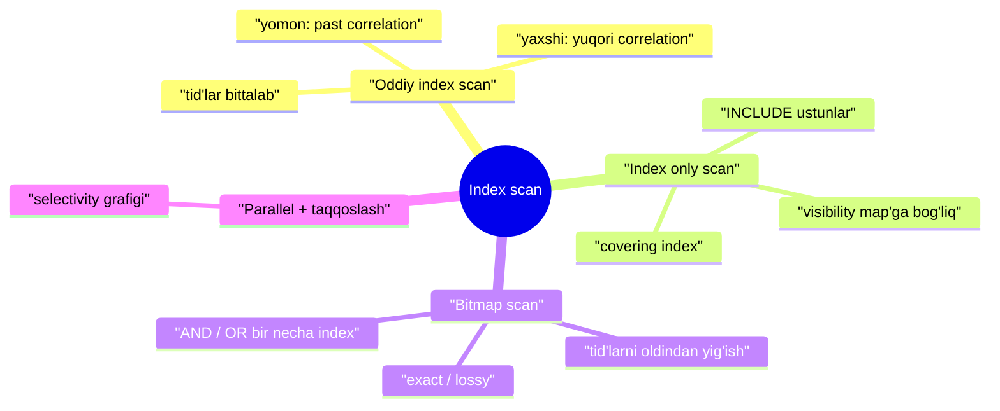
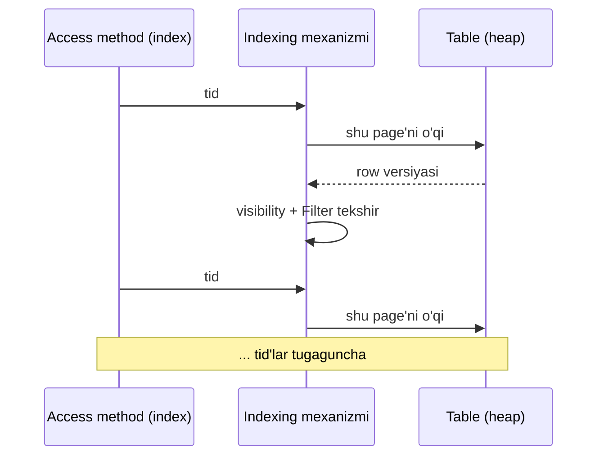
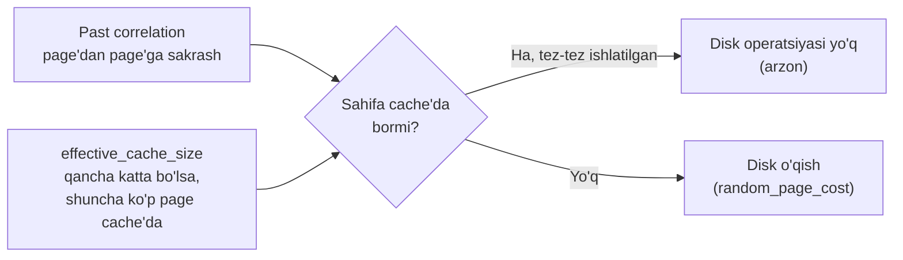
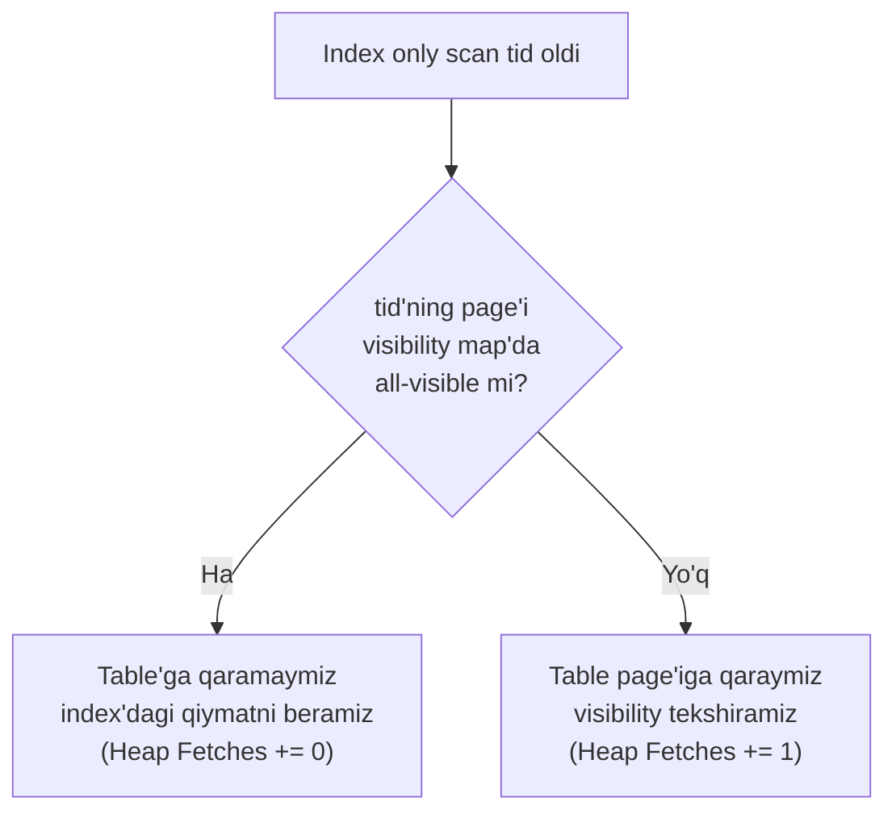
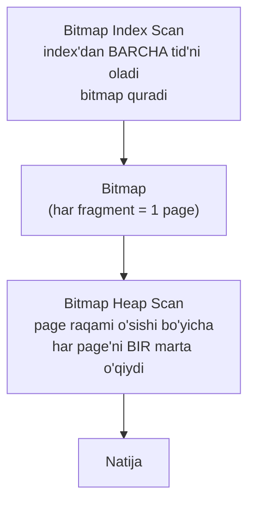
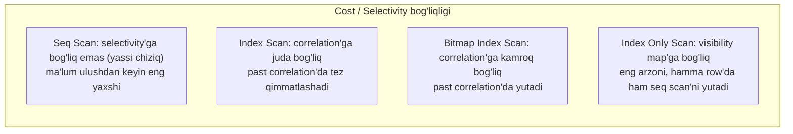

# 20. Index scan

> 📖 Manba: Рогов, "PostgreSQL 17 изнутри", 20-bob ("Индексное сканирование")

## Nima uchun kerak?

19-darsda **index** nima ekanini o'rgandik: kalit va row versiyalari (**tid** — tuple identifikatori) o'rtasidagi moslik. Lekin bitta muhim savol qoldi: index bergan tid'lardan **qanday** foydalanamiz? Ma'lum bo'lishicha, buning **ikki asosiy usuli** bor va planner har bir aniq holatda eng arzonini tanlaydi.

Nega bu muhim? Chunki index **har doim ham** foyda keltirmaydi. 18-darsda sequential scan cost'ini ko'rgan edik. Bu darsda:

- **oddiy index scan** cost'i **correlation**'ga (row'lar fizik joylashuvining index tartibiga mosligiga) qanchalik keskin bog'liqligini,
- **index only scan** nega visibility map'ga (6-dars) tayanishini,
- **bitmap scan** past correlation muammosini qanday hal qilishini,
- va nihoyat **barcha usullarni** qanday taqqoslashni ko'ramiz.

> **Asosiy g'oya:** universal g'olib access method yo'q. Har biri o'z holatida ustun. Planner selectivity, correlation, visibility map va cache hajmini baholab, eng arzonini tanlaydi. Bu darsdan keyin `EXPLAIN` chiqishidagi har bir scan node'ni **nega** tanlanganini tushuna olasiz.



---

## 1-qism. Oddiy index scan

Index bergan tid'lar bilan ishlashning birinchi usuli — **index scan**. Ko'p (lekin hamma emas) index metodlari `INDEX SCAN` xususiyatiga ega (19-dars) va shu usulni qo'llaydi.

Rejada **Index Scan** node'i bilan ko'rinadi:

```sql
=> EXPLAIN SELECT * FROM bookings
   WHERE book_ref = '9AC0C6' AND total_amount = 48500.00;
                    QUERY PLAN
--------------------------------------------
 Index Scan using bookings_pkey on bookings
   (cost=0.43..8.45 rows=1 width=21)
   Index Cond: (book_ref = '9AC0C6'::bpchar)
   Filter: (total_amount = 48500.00)
(4 rows)
```

**Qanday ishlaydi?** Access method tid'larni **bittalab** qaytaradi. Indexing mexanizmi navbatdagi tid'ni oladi → u ko'rsatgan table page'iga murojaat qiladi → row versiyasini oladi → visibility qoidalariga mos bo'lsa, kerakli maydonlarni qaytaradi. Bu jarayon shartga mos tid'lar tugaguncha davom etadi.



> **Index Cond va Filter farqi:** `Index Cond`'da faqat **index orqali tekshiriladigan** shartlar turadi. Table bo'yicha qayta tekshirish kerak bo'lgan qo'shimcha shartlar alohida **`Filter`** qatorida ko'rinadi. Yuqoridagi misolda `book_ref` — index sharti, `total_amount` — filter.

Diqqat: index'ga va table'ga murojaat **ikki alohida node**'ga ajratilmagan — ikkalasi ham bitta `Index Scan` node'ida bajariladi. (Faqat oldindan ma'lum tid bo'yicha o'qish uchun alohida `Tid Scan` node bor: `WHERE ctid = '(0,1)'`.)

### Cost hisobi: ikki qism

Index scan cost'i **ikki qismdan** iborat: **index'ga kirish** + **table page'larini o'qish**.

- **Index qismi** metodga bog'liq. `btree` uchun asosiy xarajat — index page'larini o'qish va ulardagi row'larni qayta ishlash. Nechta page/row o'qilishini index hajmi va selectivity belgilaydi. **Index page'lariga kirish tasodifiy** (mantiqan qo'shni page'lar fizik jihatdan qayerda bo'lishi noma'lum).
- **Table qismi** — page'larga kirish + o'qilgan versiyalarni qayta ishlash. Muhimi: I/O baholovi faqat selectivity'ga emas, balki **correlation**'ga ham bog'liq.

### Yaxshi holat: yuqori correlation

Agar row'larning **fizik tartibi** disk'da index'dagi tid'lar **mantiqiy tartibi** bilan ideal mos kelsa, `Index Scan` page'dan page'ga **ketma-ket** o'tadi va har biriga **faqat bir marta** murojaat qiladi.

Correlation statistika sifatida yig'iladi (17-dars):

```sql
=> SELECT attname, correlation
   FROM pg_stats WHERE tablename = 'bookings'
   ORDER BY abs(correlation) DESC;
   attname    | correlation
--------------+--------------
 book_ref     |            1
 total_amount | 0.0026738467
 book_date    | 8.02188e-05
(3 rows)
```

Modul bo'yicha 1 ga yaqin (masalan `book_ref`) — **yuqori tartiblanganlik**; 0 ga yaqin — **xaotik** taqsimot. `book_ref` uchun 1 bo'lishining sababi: ma'lumot table'ga aynan shu ustun o'sish tartibida yuklangan (xuddi shu natijani `CLUSTER` ham beradi).

Ko'p row tanlaydigan index scan misoli:

```sql
=> EXPLAIN SELECT * FROM bookings WHERE book_ref < '100000';
                    QUERY PLAN
--------------------------------------------
 Index Scan using bookings_pkey on bookings
   (cost=0.43..4640.91 rows=132999 width=21)
   Index Cond: (book_ref < '100000'::bpchar)
(3 rows)
```

Selectivity ≈ `132999 / reltuples = 0.0630` (bu `book_ref` diapazoni `000000..FFFFFF` bo'lgani uchun ~1/16 baholoviga yaqin). Cost'ni qo'lda hisoblaymiz:

```sql
=> WITH costs(idx_cost, tbl_cost) AS (
     SELECT
       ( SELECT round(
           current_setting('random_page_cost')::real * pages +
           current_setting('cpu_index_tuple_cost')::real * tuples +
           current_setting('cpu_operator_cost')::real * tuples )
         FROM ( SELECT relpages * 0.0630 AS pages, reltuples * 0.0630 AS tuples
                FROM pg_class WHERE relname = 'bookings_pkey' ) c ),
       ( SELECT round(
           current_setting('seq_page_cost')::real * pages +
           current_setting('cpu_tuple_cost')::real * tuples )
         FROM ( SELECT relpages * 0.0630 AS pages, reltuples * 0.0630 AS tuples
                FROM pg_class WHERE relname = 'bookings' ) c )
   )
   SELECT idx_cost, tbl_cost, idx_cost + tbl_cost AS total FROM costs;
 idx_cost | tbl_cost | total
----------+----------+-------
     2457 |     2180 |  4637
(1 row)
```

- Index qismi (`2457`): **`random_page_cost`** (index page'lar tasodifiy) × page + CPU (`cpu_index_tuple_cost = 0.005` × row + `cpu_operator_cost` × row).
- Table qismi (`2180`): ideal correlation'da versiyalar qo'shni bo'lgani uchun **`seq_page_cost`** (ketma-ket) × page + `cpu_tuple_cost` × row.

Natija (`4637`) planner baholoviga (`4640.91`) yaqin.

### Yomon holat: past correlation

Endi correlation'i **deyarli nol** bo'lgan `book_date` bo'yicha index yaratamiz va o'xshash ulushdagi row'ni tanlaymiz. Index kirishi shu qadar qimmat bo'ladiki, planner uni faqat **boshqa barcha muqobilni taqiqlaganda** tanlaydi:

```sql
=> CREATE INDEX ON bookings(book_date);
=> SET enable_seqscan = off;
=> SET enable_bitmapscan = off;
=> EXPLAIN SELECT * FROM bookings
   WHERE book_date < '2016-08-23 12:00:00+03';
                          QUERY PLAN
--------------------------------------------------------------
 Index Scan using bookings_book_date_idx on bookings
   (cost=0.43..57121.48 rows=132403 width=21)
   Index Cond: (book_date < '2016-08-23 12:00:00+03'::timestamp w...
(3 rows)
```

**Nega qimmat?** Correlation qancha past bo'lsa, navbatdagi tid **boshqa page**'da bo'lish ehtimoli shuncha yuqori. `Index Scan` ketma-ket o'qish o'rniga page'dan page'ga **«sakraydi»**, va page murojaatlari soni tanlangan row soniga yaqinlashishi mumkin.

Lekin yuqoridagi formulada shunchaki `seq_page_cost`'ni `random_page_cost`'ga, `relpages`'ni `reltuples`'ga almashtirish **noto'g'ri** — u `535787` beradi, planner esa `57121.48` (bir tartib kam) ko'rsatgan. Farq **cache effekti** hisobiga:



Tez-tez ishlatiladigan page'lar buffer cache'da (va OS cache'da) qoladi. Rejalash uchun cache hajmi **`effective_cache_size`** (default **4GB**) parametri bilan belgilanadi. U qancha kichik bo'lsa, o'qiladigan page soni baholovi shuncha yuqori. Parametrni minimalga tushirsak, cache'siz eng yomon qiymatga yaqin baho olamiz:

```sql
=> SET effective_cache_size = '8kB';
=> EXPLAIN SELECT * FROM bookings WHERE book_date < '2016-08-23 12:00:00+03';
                          QUERY PLAN
--------------------------------------------------------------
 Index Scan using bookings_book_date_idx on bookings
   (cost=0.43..532745.48 rows=132403 width=21)
   ...
=> RESET effective_cache_size;
=> RESET enable_seqscan;
=> RESET enable_bitmapscan;
```

> **Muhim:** `effective_cache_size` **haqiqiy xotira ajratmaydi** — u faqat rejalash uchun. Table I/O narxi «yaxshi» (ideal correlation) va «yomon» (nol correlation) holatlar o'rtasida, real correlation'ga qarab **oraliq** qiymat sifatida olinadi.

> **Xulosa (oddiy index scan):** table'ning **bir qismi** kerak bo'lganda samarali. Row'lar index tartibi bilan **korrelyatsiyalangan** bo'lsa, bu qism ancha katta bo'lishi mumkin. Correlation zaif bo'lsa (real hayotda ko'proq shunday), selectivity kamayishi bilan index kirishi tez orada jozibasini yo'qotadi.

---

## 2-qism. Index only scan

So'rovni bajarish uchun kerakli **barcha** ustunlarni o'z ichida saqlaydigan index shu so'rov uchun **covering** (qamrovchi) deb ataladi. Covering index bo'lsa, table'ga ortiqcha murojaatdan qochib, metoddan tid emas, **ma'lumotning o'zini** olish mumkin. Bu variatsiya — **index only scan** (faqat index skanlash). Uni `RETURNABLE` xususiyatli metodlar qo'llaydi (19-dars).

```sql
=> EXPLAIN SELECT book_ref FROM bookings WHERE book_ref < '100000';
                     QUERY PLAN
------------------------------------------------
 Index Only Scan using bookings_pkey on bookings
   (cost=0.43..3793.91 rows=132999 width=7)
   Index Cond: (book_ref < '100000'::bpchar)
(3 rows)
```

### «Only» — lekin baribir table'ga qaraydi

Nom «table'ga **hech qachon** murojaat qilmaydi» degan taassurot beradi, lekin bu **noto'g'ri**. PostgreSQL index'lari row **visibility** haqida ma'lumot saqlamaydi (89-betdagi mavzu, 3-dars). Shuning uchun metod shartga mos **barcha** versiyalarni qaytaradi — ular joriy transaction'ga ko'rinadimi yoki yo'qmi, ahamiyati yo'q. Visibility keyin indexing mexanizmi tomonidan tekshiriladi.

Agar har safar visibility uchun table'ga qarash kerak bo'lsa, bu usul oddiy index scan'dan farq qilmasdi. Muammoni **visibility map** (6-dars) hal qiladi: unda vacuum jarayoni **barcha transaction'larga ko'rinadigan** versiyalarni saqlovchi page'larni belgilaydi. Agar tid **shunday page**'ga tegishli bo'lsa, visibility'ni tekshirmasa ham bo'ladi.



Index only scan cost'iga **visibility map'dagi page ulushi** ta'sir qiladi. Bu ham statistikada:

```sql
=> SELECT relpages, relallvisible
   FROM pg_class WHERE relname = 'bookings';
 relpages | relallvisible
----------+---------------
    13488 |         13446
(1 row)
```

Cost farqi: table I/O faqat **visibility map'ga kirmagan page ulushiga** proporsional olinadi. Bizning misolda deyarli hamma page ko'rinadigan, shuning uchun table I/O amalda **butunlay tashlab yuboriladi**:

```sql
=> WITH costs(idx_cost, tbl_cost) AS (
     SELECT
       ( SELECT round(
           current_setting('random_page_cost')::real * pages +
           current_setting('cpu_index_tuple_cost')::real * tuples +
           current_setting('cpu_operator_cost')::real * tuples )
         FROM ( SELECT relpages * 0.0630 AS pages, reltuples * 0.0630 AS tuples
                FROM pg_class WHERE relname = 'bookings_pkey' ) c ) AS idx_cost,
       ( SELECT round(
           (1 - frac_visible) *          -- visibility map'dan tashqari page ulushi
           current_setting('seq_page_cost')::real * pages +
           current_setting('cpu_tuple_cost')::real * tuples )
         FROM ( SELECT relpages * 0.0630 AS pages, reltuples * 0.0630 AS tuples,
                  relallvisible::real / relpages::real AS frac_visible
                FROM pg_class WHERE relname = 'bookings' ) c ) AS tbl_cost
   )
   SELECT idx_cost, tbl_cost, idx_cost + tbl_cost AS total FROM costs;
 idx_cost | tbl_cost | total
----------+----------+-------
     2457 |     1333 |  3790
(1 row)
```

### Heap Fetches — vacuum ta'siri

Hali **horizon ortiga o'tmagan** (6-dars) va vacuum ishlamagan o'zgarishlar cost'ni oshiradi. Haqiqiy majburiy table murojaatlarini `EXPLAIN ANALYZE` **`Heap Fetches`** qatorida ko'rsatadi.

**Vacuum'dan oldin** — hamma versiya qayta tekshiriladi:

```sql
=> CREATE TEMP TABLE bookings_tmp WITH (autovacuum_enabled = off)
   AS SELECT * FROM bookings ORDER BY book_ref;
=> ALTER TABLE bookings_tmp ADD PRIMARY KEY (book_ref);
=> ANALYZE bookings_tmp;
=> EXPLAIN (analyze, timing off, summary off)
   SELECT book_ref FROM bookings_tmp WHERE book_ref < '100000';
                          QUERY PLAN
--------------------------------------------------------------
 Index Only Scan using bookings_tmp_pkey on bookings_tmp
   (cost=0.43..4716.86 rows=135110 ...) (actual rows=132109 l...
   Index Cond: (book_ref < '100000'::bpchar)
   Heap Fetches: 132109
(4 rows)
```

**Vacuum'dan keyin** — visibility map yaratildi, tekshiruv keraksiz bo'ldi:

```sql
=> VACUUM bookings_tmp;
=> EXPLAIN (analyze, timing off, summary off)
   SELECT book_ref FROM bookings_tmp WHERE book_ref < '100000';
                          QUERY PLAN
--------------------------------------------------------------
 Index Only Scan using bookings_tmp_pkey on bookings_tmp
   (cost=0.43..3855.86 rows=135110 ...) (actual rows=132109 l...
   Index Cond: (book_ref < '100000'::bpchar)
   Heap Fetches: 0
(4 rows)
```

> **Amaliy xulosa:** index only scan unumdorligi visibility map'ga **juda kuchli** bog'liq. `Heap Fetches` yuqori chiqsa — table yaxshi vacuum qilinmagan (yoki uzoq transaction horizon'ni ushlab turibdi, 6-dars). Ideal holatda `Heap Fetches: 0`.

### INCLUDE index'lar

Ba'zan index'ni kerakli ustunlarni saqlaydigan qilib **kengaytirib bo'lmaydi**:

- unique index'ga ustun qo'shsak, asl ustunlar uniqueness'i kafolatlanmaydi;
- qo'shimcha ustun turining index metodi uchun operator class'i bo'lmasligi mumkin.

Bu holda ustunlarni index **kalitiga kiritmasdan** qo'shish mumkin (v11, `INCLUDE`). Ular bo'yicha qidirish mumkin bo'lmaydi, lekin shu ustunlarni o'z ichiga olgan so'rovlar uchun index **covering** ishlaydi:

```sql
=> CREATE UNIQUE INDEX ON bookings(book_ref) INCLUDE (book_date);
=> EXPLAIN SELECT book_ref, book_date
   FROM bookings WHERE book_ref < '100000';
                          QUERY PLAN
--------------------------------------------------------------
 Index Only Scan using bookings_pkey on bookings (cost=0.43..438...
   Index Cond: (book_ref < '100000'::bpchar)
(2 rows)
```

> **Muhim atama nozikligi:** ko'pincha aynan bunday INCLUDE-index'larni «covering» deb ataydi — bu **noto'g'ri**. Index **covering** bo'ladi, agar uning ustunlar to'plami **muayyan so'rov** uchun kerakli ustunlarni qoplasa. Kalit ustunmi yoki `INCLUDE` ustunmi — farqi yo'q. Bundan tashqari, bitta index bir so'rov uchun covering bo'lib, boshqasi uchun bo'lmasligi mumkin.

---

## 3-qism. Bitmap scan

Oddiy index scan cheklovi: correlation kamayishi bilan page murojaatlari ko'payadi va o'qish **ketma-ketdan tasodifiyga** o'tadi. Buni yengish yo'li: **table'ga murojaatdan oldin barcha tid'ni yig'ib, ularni page raqami o'sishi bo'yicha tartiblash**. Aynan shu — tid'lar bilan ishlashning ikkinchi asosiy usuli, **bitmap scan**. Uni `BITMAP SCAN` xususiyatli metodlar qo'llaydi (19-dars).

Oddiy index scan'dan farqli, u rejada **ikkita node** bilan ko'rinadi:

```sql
=> CREATE INDEX ON bookings(total_amount);
=> EXPLAIN SELECT * FROM bookings WHERE total_amount = 48500.00;
                          QUERY PLAN
--------------------------------------------------------------
 Bitmap Heap Scan on bookings (cost=54.63..7045.60 rows=2865 wid...
   Recheck Cond: (total_amount = 48500.00)
   ->  Bitmap Index Scan on bookings_total_amount_idx
         (cost=0.00..53.92 rows=2865 width=0)
         Index Cond: (total_amount = 48500.00)
(5 rows)
```



- **Bitmap Index Scan** metoddan **barcha** tid'larning **bitmap**'ini (bit xaritasini) oladi. Bitmap fragmentlardan iborat, har biri **bitta table page'iga** mos. Fragment hajmi page'dagi barcha versiyani qamrashga yetadi (standart page'da 256 versiya, ularni 32 baytda ifodalash mumkin).
- **Bitmap Heap Scan** bitmap'ni fragment-fragment ko'rib chiqadi, mos page'ni o'qiydi va undagi belgilangan versiyalarni tekshiradi. Shu tariqa page'lar **raqam o'sishi tartibida** va **har biri bir marta** o'qiladi.

Lekin o'qish baribir ketma-ketdan farq qiladi (page'lar odatda yonma-yon emas). OS'ning oddiy prefetch'i bu yerda yordam bermaydi, shuning uchun `Bitmap Heap Scan` — **yagona** node — o'z **prefetch**'ini amalga oshiradi, `effective_io_concurrency` (default **1**) parametrida ko'rsatilgancha page'ni asinxron o'qiydi (OS'da `posix_fadvise` orqali). Xizmat jarayonlari uchun esa `maintenance_io_concurrency` (default **10**) ishlatiladi.

### Bitmap aniqligi: exact va lossy

Bitmap so'rovga mos row'lar ko'p page'ni qamrasa, **katta joy** egallaydi. U jarayonning lokal xotirasida quriladi va **`work_mem`** (default **4MB**) bilan cheklangan. Xotira yetmasa, ba'zi fragmentlar **«qo'pollashtiriladi»** (lossy): endi bitta bit butun page'ga mos keladi (aniq versiya emas). Bu bitmap'ni kichraytiradi, lekin **aniqlik** yo'qoladi.

**Exact (aniq) bitmap** — xotira yetdi:

```sql
=> EXPLAIN (analyze, costs off, timing off, summary off)
   SELECT * FROM bookings WHERE total_amount > 150000.00;
                          QUERY PLAN
--------------------------------------------------------------
 Bitmap Heap Scan on bookings (actual rows=242691 loops=1)
   Recheck Cond: (total_amount > 150000.00)
   Heap Blocks: exact=13447
   ->  Bitmap Index Scan on bookings_total_amount_idx (actual rows...
         Index Cond: (total_amount > 150000.00)
(5 rows)
```

**Lossy (qo'pol) bitmap** — `work_mem`'ni kamaytirsak:

```sql
=> SET work_mem = '512kB';
=> EXPLAIN (analyze, costs off, timing off, summary off)
   SELECT * FROM bookings WHERE total_amount > 150000.00;
                          QUERY PLAN
--------------------------------------------------------------
 Bitmap Heap Scan on bookings (actual rows=242691 loops=1)
   Recheck Cond: (total_amount > 150000.00)
   Rows Removed by Index Recheck: 1145721
   Heap Blocks: exact=5178 lossy=8269
   ->  Bitmap Index Scan on bookings_total_amount_idx (actual rows...
         Index Cond: (total_amount > 150000.00)
(6 rows)
=> RESET work_mem;
```

Qo'pol fragmentga mos page o'qilganda undagi **har bir versiya** shartga qayta tekshiriladi. Shart doim `Recheck Cond` sifatida ko'rinadi (haqiqatda qayta tekshirish bo'ladimi-yo'qmi — baribir), qayta tekshirish tashlagan versiyalar soni esa `Rows Removed by Index Recheck` da ko'rinadi.

| | Exact fragment | Lossy fragment |
|---|---|---|
| Bit nimaga mos | bitta row versiyasi | butun page |
| Xotira | ko'proq | kamroq |
| Recheck | kerak emas | har versiya qayta tekshiriladi |
| Ko'rinishi | `Heap Blocks: exact=...` | `Heap Blocks: lossy=...` |

> Juda katta tanlovda hatto to'liq lossy bitmap ham `work_mem`'ga sig'masligi mumkin — bu holda cheklov buziladi va bitmap kerakli joyni egallaydi (disk'ga tushirish ko'zda tutilmagan).

### Bir necha index'ni birlashtirish: AND / OR

Turli ustunlarga shart qo'yilib, ular uchun turli index bo'lsa, bitmap scan **bir necha index'ni bir vaqtda** ishlatishga imkon beradi. Har index uchun bitmap quriladi, so'ng ular **bitli** birlashtiriladi: `AND` uchun **ko'paytirish** (`BitmapAnd`), `OR` uchun **qo'shish** (`BitmapOr`):

```sql
=> EXPLAIN (costs off)
   SELECT * FROM bookings
   WHERE book_date < '2016-08-28' AND total_amount > 250000;
                          QUERY PLAN
--------------------------------------------------------------
 Bitmap Heap Scan on bookings
   Recheck Cond: ((total_amount > '250000'::numeric) AND (book_da...
   ->  BitmapAnd
         ->  Bitmap Index Scan on bookings_total_amount_idx
               Index Cond: (total_amount > '250000'::numeric)
         ->  Bitmap Index Scan on bookings_book_date_idx
               Index Cond: (book_date < '2016-08-28 00:00:00+03'::tim...
(7 rows)
```

> **Nozik nuqta:** ikki bitmap birlashtirilganda, agar kamida bittasi qo'pol (lossy) bo'lsa, natija fragment ham **past aniqlikda** bo'ladi.

### Cost hisobi

**Bitmap Index Scan** narxi oddiy index kirishi kabi, lekin **table murojaatisiz** hisoblanadi (`random_page_cost` × page + CPU). `total_amount = 28000.00` (sel ≈ 0.0151) misolida u `589` chiqadi.

**Bitmap Heap Scan** I/O baholovi ideal correlation'li oddiy index scan'dan farq qiladi: bitmap page'larni tartib bilan va takrorsiz o'qishga imkon beradi, lekin mos versiyalar endi yonma-yon emas. O'qiladigan page soni formula bilan baholanadi:

```
pages_fetched = min( 2·relpages·reltuples·sel / (2·relpages + reltuples·sel),  relpages )
```

bitta page o'qish narxi esa o'qilgan page ulushiga qarab `seq_page_cost` va `random_page_cost` oralig'ida bo'ladi. To'liq misol:

```sql
=> WITH t AS (
     SELECT 1 AS cost_per_page, 13488 AS pages_fetched, 31878 AS tuples_fetched
   ),
   costs(startup_cost, run_cost) AS (
     SELECT
       ( SELECT round(
           589 /* pastdagi node baholovi */ +
           0.1 * current_setting('cpu_operator_cost')::real * reltuples * 0.0151 )
         FROM pg_class WHERE relname = 'bookings_total_amount_idx' ),
       ( SELECT round(
           cost_per_page * pages_fetched +
           current_setting('cpu_tuple_cost')::real * tuples_fetched +
           current_setting('cpu_operator_cost')::real * tuples_fetched )
         FROM t )
   )
   SELECT startup_cost, run_cost, startup_cost + run_cost AS total_cost FROM costs;
 startup_cost | run_cost | total_cost
--------------+----------+------------
          597 |    13886 |      14483
(1 row)
```

`Bitmap Heap Scan`'ning **boshlang'ich narxi** `Bitmap Index Scan` to'liq narxiga bitmap bilan ishlash narxini qo'shadi. Bir necha bitmap birlashtirilsa, alohida index kirishlar yig'indisiga (kichik) birlashtirish narxi qo'shiladi.

---

## 4-qism. Index scan'ning parallel variantlari

Barcha usullar — oddiy index scan, index only scan, bitmap scan — parallel rejalar uchun (18-dars) variantlarga ega. Parallel cost ketma-ketiga o'xshash baholanadi, lekin **CPU resurslari jarayonlar orasida bo'linadi** (I/O bo'linmaydi, chunki page o'qish jarayonlar orasida sinxronlanadi va ketma-ket bo'ladi).

**Parallel Index Scan** — B-tree parallel skanlashda joriy index page raqami umumiy xotirada saqlanadi. Skanlashni boshlagan jarayon ildizdan barggacha tushib, uni eslab qoladi; worker'lar kerak bo'lganda navbatdagi index page'ni oladi va saqlangan raqamni o'zgartiradi:

```sql
=> EXPLAIN SELECT sum(total_amount) FROM bookings WHERE book_ref < '400000';
                              QUERY PLAN
----------------------------------------------------------------------
 Finalize Aggregate ...
   ->  Gather
         Workers Planned: 2
         ->  Partial Aggregate ...
               ->  Parallel Index Scan using bookings_pkey on bookings
                     Index Cond: (book_ref < '400000'::bpchar)
```

**Parallel Index Only Scan** — faqat shu bilan farq qiladiki, visibility map imkon bersa, table page'lariga murojaat qilmaydi.

**Parallel Bitmap Heap Scan** — bitmap qurish **doim ketma-ket**, bitta leader tomonidan bajariladi; shuning uchun `Bitmap Index Scan` nomiga **`Parallel`** qo'shilmaydi. Bitmap tayyor bo'lgach, table skanlash `Parallel Bitmap Heap Scan` node'ida parallel ketadi:

```sql
=> EXPLAIN SELECT sum(total_amount) FROM bookings WHERE book_date < '2016-10-01';
                              QUERY PLAN
----------------------------------------------------------------------
 Finalize Aggregate ...
   ->  Gather
         Workers Planned: 2
         ->  Partial Aggregate ...
               ->  Parallel Bitmap Heap Scan on bookings
                     Recheck Cond: (book_date < '2016-10-01 ...)
                     ->  Bitmap Index Scan on bookings_book_date_idx
```

---

## 5-qism. Barcha access method'larni taqqoslash

Turli usullar cost'ining selectivity'ga bog'liqligini shunday tasvirlash mumkin (grafik sifat xarakterida — aniq raqamlar table va server parametrlariga bog'liq):



| Access method | Qachon eng yaxshi | Zaif tomoni |
|---|---|---|
| **Seq Scan** | ko'p row kerak (past selectivity); ma'lum ulushdan keyin eng yaxshi | butun table, oz row kerak bo'lsa isrof |
| **Index Scan** | **bitta** row (yoki oz row); yuqori correlation'da ko'p row ham | past correlation'da tez qimmatlashadi, hatto seq scan'dan ham oshadi |
| **Index Only Scan** | covering index bor va visibility map to'liq | visibility map yomon bo'lsa oddiy index scan'ga «degradatsiya» |
| **Bitmap Scan** | past correlation, o'rtacha selectivity; bir necha index AND/OR | `work_mem` yetmasa lossy → recheck |

Asosiy kuzatuvlar:

- **Seq Scan** selectivity'ga bog'liq emas; ma'lum ulushdan boshlab odatda boshqalardan yaxshi.
- **Index Scan** cost'i **correlation**'ga juda bog'liq. Ideal correlation'da katta ulushda ham samarali. Zaif correlation'da (real hayotda ko'proq) tez qimmatlashadi va seq scan'dan ham oshadi. Lekin **bitta row** (ko'pincha unique index) tanlashda — shubhasiz g'olib.
- **Index Only Scan** (agar qo'llansa) seq scan'ni **hatto barcha row'da** ham yutishi mumkin, lekin visibility map'ga juda bog'liq; eng yomon holda oddiy index scan'ga tushadi.
- **Bitmap Scan** cost'i mavjud xotiraga bog'liq, lekin **correlation'ga** index scan'chalik kuchli bog'liq **emas**. Zaif correlation'da sezilarli yutadi.

> **Yakuniy xulosa:** har bir usul o'z holatida boshqalardan ustun — hamma vaqt yutqazadigan usul yo'q. Planner har bir holatda jiddiy ish qiladi. Lekin bu baholovlarning realga yaqinligi **statistika dolzarbligiga** kuchli bog'liq (17-dars) — shuning uchun `ANALYZE`'ni unutmaslik kerak.

---

## Xulosa

- Index bergan **tid**'lar bilan ishlashning **ikki asosiy usuli** bor: **index scan** (tid'lar bittalab) va **bitmap scan** (avval hammasini yig'ib, page bo'yicha tartiblash).
- **Oddiy index scan** cost'i ikki qism: index (page tasodifiy → `random_page_cost`) + table. Table I/O **correlation**'ga bog'liq: yuqori correlation'da ketma-ket (arzon), past correlation'da page'dan page'ga sakrash (qimmat).
- Past correlation cost'i naive formuladan kam chiqadi, chunki model **`effective_cache_size`** orqali cache effektini hisobga oladi (bu parametr haqiqiy xotira ajratmaydi).
- **Index only scan** covering index'da table'ga murojaatni kamaytiradi, lekin visibility index'da yo'qligi uchun **visibility map**'ga tayanadi (6-dars). `Heap Fetches` majburiy table murojaatlarini ko'rsatadi — vacuum'dan keyin 0 ga tushadi.
- **INCLUDE** ustunlar index'ni kalitga kiritmasdan kengaytiradi. «Covering» — bu INCLUDE emas, balki index ustunlari **muayyan so'rovni qoplashi** demakdir.
- **Bitmap scan** past correlation muammosini yechadi: `Bitmap Index Scan` bitmap quradi, `Bitmap Heap Scan` page'larni tartib bilan bir marta o'qiydi. `work_mem` yetmasa fragmentlar **lossy** bo'ladi (`Recheck Cond`, `Rows Removed by Index Recheck`).
- Bir necha index'ni **`BitmapAnd`/`BitmapOr`** bilan birlashtirish mumkin. Kamida bitta fragment lossy bo'lsa, natija ham lossy.
- Parallel variantlarda **CPU bo'linadi, I/O bo'linmaydi**. Bitmap qurish doim ketma-ket (`Bitmap Index Scan`'da `Parallel` bo'lmaydi).
- **Universal g'olib yo'q**: seq scan ko'p row uchun, index scan bitta row / yuqori correlation uchun, index only scan covering + visibility map uchun, bitmap scan past correlation uchun ustun.

## Nazorat savollari

1. Index bergan tid'lar bilan ishlashning ikki asosiy usulini ayting. `Index Scan` node'idagi `Index Cond` va `Filter` orasidagi farq nima?
2. Oddiy index scan cost'i nega **correlation**'ga bog'liq? `book_ref` (correlation = 1) va `book_date` (correlation ≈ 0) misolida table I/O nega turlicha baholanadi?
3. Past correlation'da naive cost formulasi `535787`, planner esa `57121.48` beradi. Bu farqni qaysi parametr va qanday mexanizm tushuntiradi? `effective_cache_size = '8kB'` nima uchun eng yomon holatga yaqinlashtiradi?
4. Nega «index only scan» nomiga qaramay ba'zan table'ga murojaat qiladi? Buni qaysi mexanizm kamaytiradi va `Heap Fetches: 0` ga erishish uchun nima kerak? (6-darsga bog'lang.)
5. «Covering index» to'g'ri ta'rifi nima? Nega INCLUDE-index'ni «covering» deb atash aniq emas?
6. Bitmap scan past correlation muammosini qanday hal qiladi? `exact` va `lossy` fragment farqi nima, va `work_mem` bunga qanday ta'sir qiladi?
7. `BitmapAnd` qachon paydo bo'ladi? Ikki bitmap birlashganda aniqlik (exact/lossy) qanday o'zgaradi?
8. Parallel scan'da nega CPU bo'linadi, lekin I/O bo'linmaydi? Nega `Bitmap Index Scan` nomiga `Parallel` qo'shilmaydi?
9. Bitta row'ni unique index bo'yicha tanlashda, butun table'ni o'qishda, past correlation'li o'rtacha tanlovda — har biriga qaysi access method mos va nega?
