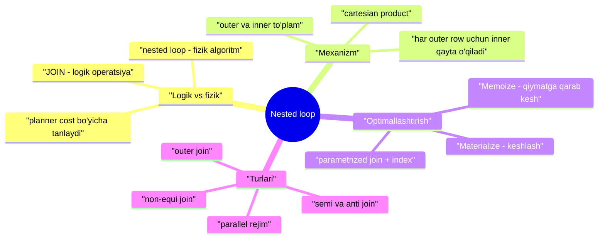
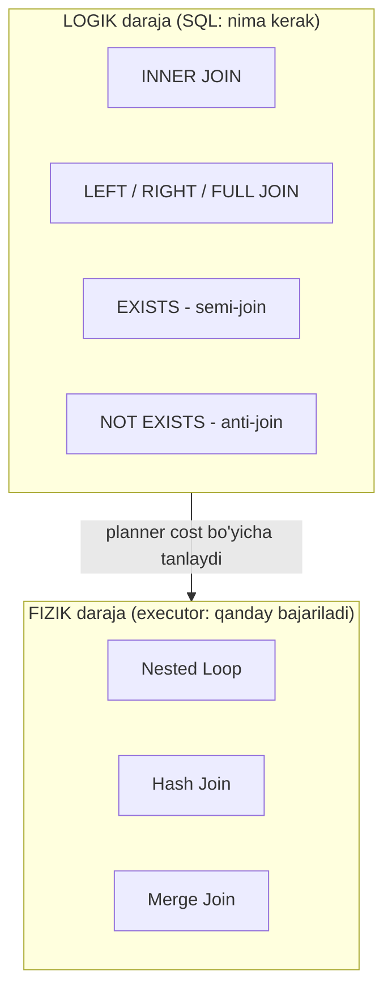
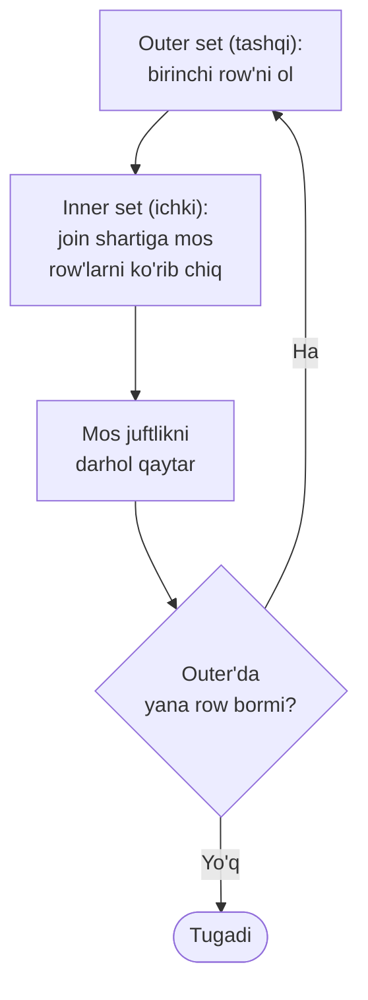
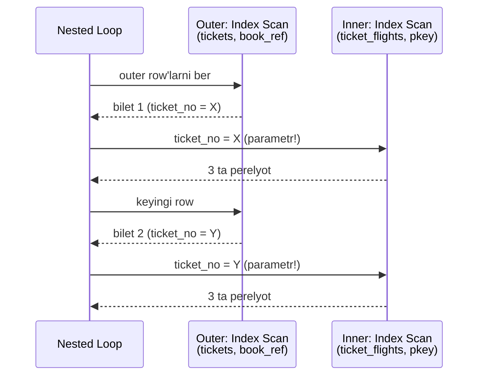
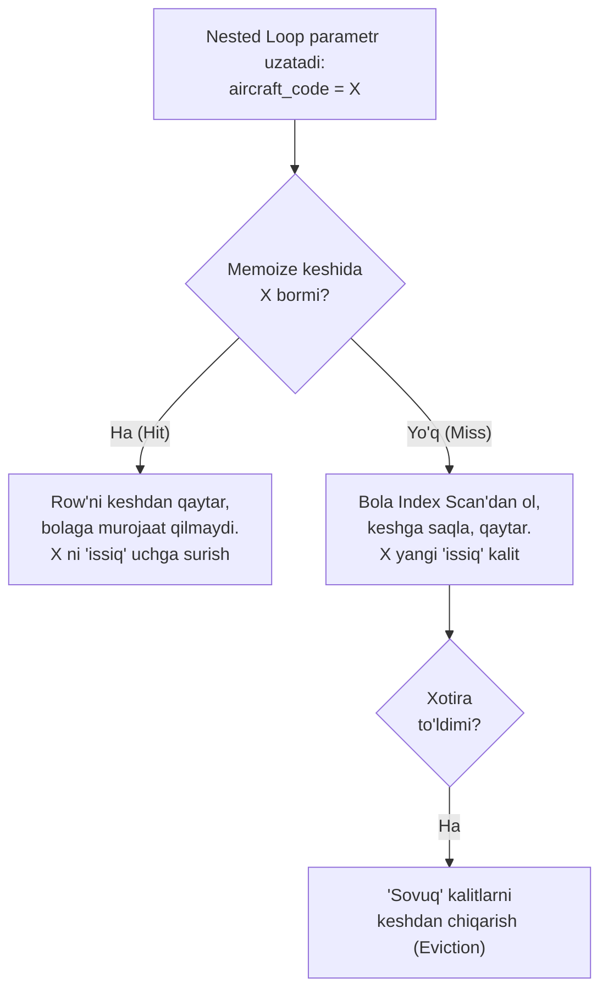
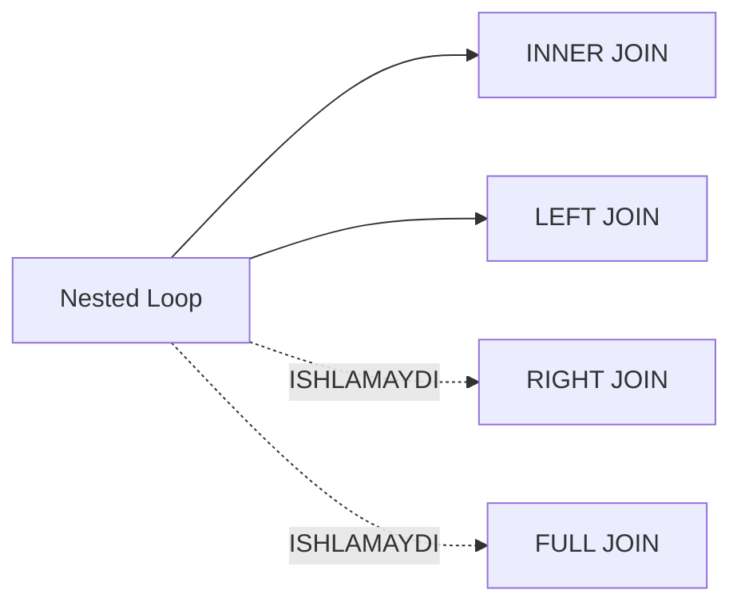

# 21. Nested loop join

> 📖 Manba: Рогов, "PostgreSQL 17 изнутри", 21-bob ("Вложенный цикл")

## Nima uchun kerak?

Oldingi to'rt darsda biz bitta table'dan qanday qilib row'lar olinishini ko'rdik: 18-darsda sequential scan (table'ni to'liq o'qish), 19-20 darslarda index access va index scan. Lekin real so'rovlar deyarli hech qachon bitta table bilan cheklanmaydi — biletni uning perelyotlari bilan, perelyotni samolyoti bilan, samolyotni o'rindiqlari bilan bog'lash kerak.

**Join** — ikki row to'plamini birlashtirish — SQL tilining eng kuchli imkoniyati. Lekin bu yerda muhim bir nozik nuqta bor: `JOIN` so'zi SQL'da **nima** qilish kerakligini aytadi (logik operatsiya), ammo PostgreSQL uni **qanday** bajarishini o'zi tanlaydi (fizik algoritm). Bir xil `JOIN` uchta butunlay boshqacha algoritm bilan bajarilishi mumkin, va planner (16-darsda ko'rganmiz — so'rovni rejaga aylantiruvchi qism) ular orasidan eng arzonini tanlaydi.

Bu darsda birinchi va eng oddiy algoritm — **nested loop** (ichma-ich sikl) bilan tanishamiz. Uni tushunmasdan turib EXPLAIN natijasini o'qib bo'lmaydi va nega so'rovingiz sekin ishlayotganini anglab bo'lmaydi.



---

## 1-qism. Join turlari va usullari: logikani fizikadan ajrat

Bu darsning eng muhim g'oyasi — **logik join turi** bilan **fizik join usulini** aralashtirmaslik. Ular butunlay boshqa narsalar.

### Logik join turlari (SQL nima so'raydi)

Row to'plamlari (table'lardan yoki boshqa operatsiyalar natijasidan olingan) doim **juft-juft** birlashtiriladi. SQL bir necha logik join turini beradi:

| Logik tur | SQL sintaksisi | Nima qaytaradi |
|---|---|---|
| **Inner join** | `INNER JOIN` / `JOIN` | Shartga mos row juftliklari |
| **Cartesian product** | `CROSS JOIN` | Ikki to'plamning barcha mumkin juftliklari (shart = doim rost) |
| **Left outer join** | `LEFT JOIN` | Inner join + o'ng tomonda jufti topilmagan chap row'lar (bo'sh ustunlar `NULL`) |
| **Right outer join** | `RIGHT JOIN` | Xuddi shu, lekin to'plamlar joyi almashtirilgan |
| **Full outer join** | `FULL JOIN` | Chap va o'ng outer join'larni birlashtiradi |
| **Semi-join** | `EXISTS` | Ikkinchi to'plamda **jufti bor** birinchi to'plam row'lari (bir marta) |
| **Anti-join** | `NOT EXISTS` | Ikkinchi to'plamda **jufti yo'q** birinchi to'plam row'lari |

Ba'zi atamalarni aniqlaymiz. **Join sharti** (join condition) — bir to'plamning ustunlarini boshqasining ustunlari bilan bog'laydi; ishtirok etuvchi barcha ustunlar **join key** (birlashtirish kaliti) ni tashkil qiladi. Agar shart ustunlar **tengligini** talab qilsa (`a.x = b.y`), bu **equi-join** (ekvibirlashtirish) deyiladi — eng ko'p uchraydigan holat.

Semi-join va anti-join uchun SQL'da alohida operator yo'q, lekin ularga `EXISTS` va `NOT EXISTS` konstruksiyalari olib keladi.

### Fizik join usullari (PostgreSQL qanday bajaradi)

Yuqoridagilarning hammasi — **logik operatsiyalar**. Masalan, inner join'ni ko'pincha "cartesian product'dan faqat shartga mos row'larni qoldirish" deb ta'riflashadi. Lekin **fizik** jihatdan inner join'ni odatda ancha tejamli usullar bilan bajarish mumkin.

PostgreSQL uchta join usulini beradi:

- **nested loop** (ichma-ich sikl) — bu dars mavzusi;
- **hash join** (xeshlash bilan birlashtirish) — 22-dars;
- **merge join** (birlashtirish bilan birlashtirish) — 23-dars.

> **Oltin qoida:** join usuli — bu SQL'ning logik birlashtirish operatsiyasini amalga oshiruvchi **algoritm**. Bir algoritm bir necha logik turga xizmat qilishi mumkin (variatsiyalar bilan), lekin hammasiga emas.

Masalan, nested loop inner join uchun ham (rejada `Nested Loop` node'i), left outer join uchun ham (`Nested Loop Left Join`) ishlaydi, lekin full join uchun ishlamaydi. Bundan tashqari, xuddi shu algoritmlarning variantlari **boshqa operatsiyalar** — masalan agregatsiya — uchun ham ishlatiladi (buni 22 va 23-darslarda ko'ramiz).



Turli vaziyatlarda turli usullar samaraliroq bo'ladi; planner har birining **cost**'ini (narxini — 16-darsda ko'rganmiz) hisoblab, eng arzonini tanlaydi.

---

## 2-qism. Nested loop mexanizmi

Asosiy g'oya juda oddiy. Ikkita ichma-ich sikl bor:

- **Tashqi (outer) siklda** birinchi to'plam — **outer set** (tashqi to'plam) — row'lari birma-bir ko'rib chiqiladi.
- Har bir shunday row uchun **ichki (inner) siklda** ikkinchi to'plam — **inner set** (ichki to'plam) — ning join shartiga mos row'lari ko'rib chiqiladi.
- Topilgan har bir juftlik **darhol** natija sifatida qaytariladi (kutish yo'q).



Notional machine nuqtai nazaridan: algoritm **inner set'ga outer set'da nechta row bo'lsa, shuncha marta murojaat qiladi**. Aynan shu sabab nested loop samaradorligiga uchta narsa ta'sir qiladi:

1. **Outer set kardinalligi** (row'lar soni) — inner necha marta o'qilishini belgilaydi;
2. **Inner set'ga samarali kirish usuli** bormi — kerakli row'larni tez topish (masalan index orqali);
3. **Bir xil inner row'larga takroriy murojaat** — ularni keshlash foydali bo'lishi mumkin.

Bu uch omil butun darsning o'zagi: keyingi bo'limlarning har biri shulardan birini optimallashtiradi.

---

## 3-qism. Cartesian product — eng sodda holat

Cartesian product'ni (barcha juftliklar) hisoblashda nested loop — **eng samarali** usul, to'plamlar hajmidan qat'i nazar. Kitobdagi misolni ko'ramiz:

```sql
=> EXPLAIN SELECT * FROM aircrafts_data a1
   CROSS JOIN aircrafts_data a2
   WHERE a2.range > 5000;
                    QUERY PLAN
-----------------------------------------------------
 Nested Loop  (cost=0.00..2.78 rows=45 width=144)
   ->  Seq Scan on aircrafts_data a1
         (cost=0.00..1.09 rows=9 width=72)
   ->  Materialize  (cost=0.00..1.14 rows=5 width=72)
         ->  Seq Scan on aircrafts_data a2
               (cost=0.00..1.11 rows=5 width=72)
               Filter: (range > 5000)
(7 rows)
```

`Nested Loop` node'i doim **ikkita bola node**ga ega. Reja chiqishida **yuqoridagi** bola — outer set (bu yerda `a1` bo'yicha Seq Scan, 9 row), **pastdagi** bola — inner set (`a2`, 5 row).

### Materialize — birinchi keshlash mexanizmi

Diqqat qiling: inner set bevosita Seq Scan emas, **Materialize** node'i orqali kelmoqda. Materialize bola node'idan olgan row'larni **eslab qoladi** va takroriy murojaatda ularni qaytadan o'qimaydi.

> **Materialize qanday ishlaydi:** birinchi o'tishda bola node'dan olingan barcha row'larni saqlaydi (hajm `work_mem` — default **4MB** — dan oshmaguncha xotirada, keyin temp faylga yoziladi). Keyingi murojaatlarda esa allaqachon eslab qolingan row'larni o'qiydi, bolaga umuman murojaat qilmaydi.

Bu nima uchun kerak? Bu yerda outer'da 9 ta row bor. Materialize bo'lmasa, `a2` table'i (filter bilan) **9 marta** to'liq skanlanardi. Materialize esa row'larni bir marta eslab, keyin ularni tezroq qaytaradi. Notional machine: birinchi murojaatda 5 row xotiraga yig'iladi, qolgan 8 murojaatda esa disk/table'ga bormasdan xotiradan olinadi.

### Cartesian product kardinalligini baholash

Cartesian product kardinalligi — birlashtirilayotgan to'plamlar kardinalliklarining **ko'paytmasi**. Yuqoridagi rejada outer 9 row, inner 5 row (filterdan keyin), lekin `rows=45` — ya'ni 9 × 5 = 45.

### Cost hisoblanishi

Cartesian product uchun to'liq cost quyidagilardan yig'iladi:

- outer set'ning **barcha** row'larini olish narxi;
- inner set'ni **birinchi marta** to'liq olish narxi (materializatsiya paytida);
- inner set'ni **(N−1) marta** takroriy olish narxi (N — outer'dagi row soni);
- har bir natija row'ini qayta ishlash narxi.

Kitobdagi hisobni takrorlaymiz (inner takroriy o'qish narxi bu yerda 0.0125):

```sql
=> SELECT 0.00 + 0.00 AS startup_cost,
   round((
     1.09 + (1.14 + 8 * 0.0125) +
     45 * current_setting('cpu_tuple_cost')::real
   )::numeric, 2) AS total_cost;
 startup_cost | total_cost
--------------+------------
         0.00 |       2.78
(1 row)
```

Bu aniq rejadagi `cost=0.00..2.78` ga to'g'ri keldi.

---

## 4-qism. Parametrized join — index bilan kuchaytirilgan nested loop

Cartesian product amalda kam uchraydi. Ancha tipik va foydali holat — **parametrized join** (parametrlangan birlashtirish), unda outer row'ning qiymati inner set'ga **parametr** sifatida uzatiladi va inner index orqali tezda o'qiladi.

Avval index yaratamiz, keyin so'rovni ko'ramiz:

```sql
=> CREATE INDEX ON tickets(book_ref);

=> EXPLAIN SELECT *
   FROM tickets t
   JOIN ticket_flights tf ON tf.ticket_no = t.ticket_no
   WHERE t.book_ref = '03A76D';
                             QUERY PLAN
--------------------------------------------------------------------
 Nested Loop  (cost=0.99..45.67 rows=6 width=136)
   ->  Index Scan using tickets_book_ref_idx on tickets t
         (cost=0.43..12.46 rows=2 width=104)
         Index Cond: (book_ref = '03A76D'::bpchar)
   ->  Index Scan using ticket_flights_pkey on ticket_flights tf
         (cost=0.56..16.57 rows=3 width=32)
         Index Cond: (ticket_no = t.ticket_no)
(7 rows)
```

Mana bu yerda sehr ko'rinadi. `Nested Loop` outer set (biletlar) row'larini birma-bir ko'rib chiqadi va **har biri uchun** inner set (perelyotlar) ga murojaat qiladi, `t.ticket_no` bilet raqamini **parametr** sifatida uzatib. Ichki `Index Scan` chaqirilganda, u endi `ticket_no = konstanta` shartiga ega bo'ladi — ya'ni butun table'ni emas, index orqali faqat kerakli 3 row'ni tez topadi.



### Join selektivligini baholash

**Join selektivligi** (join selectivity) — cartesian product'dan birlashtirishdan keyin qolgan row'lar ulushi. Kardinallik cartesian kardinalligini (ikki to'plam kardinalliklari ko'paytmasi) selektivlikka ko'paytirib baholanadi.

Bu misolda outer set kardinalligi — 2 row. Inner set (`ticket_flights`) uchun join shartidan boshqa shart yo'q, shuning uchun uning kardinalligi butun table kardinalligi deb olinadi.

Table'lar **foreign key** (tashqi kalit) bilan bog'langani uchun selektivlik shunga asoslanadi: bola table'ning har bir row'i ota table'da roppa-rosa bitta jufti bor. Selektivlik ota table hajmiga **teskari** miqdor deb olinadi:

```sql
=> SELECT round(2 * tf.reltuples * (1.0 / t.reltuples)) AS rows
   FROM pg_class t, pg_class tf
   WHERE t.relname = 'tickets'
     AND tf.relname = 'ticket_flights';
 rows
------
    6
(1 row)
```

Aynan rejadagi `rows=6`. Table'larni foreign key'siz ham birlashtirish mumkin — u holda konkret join shartlari selektivligi ishlatiladi. Equi-join uchun bazaviy formula `min(1/nd1, 1/nd2)`, bu yerda `nd1` va `nd2` — join key'ning ikki to'plamdagi noyob qiymatlar soni.

> **Amaliy ogohlantirish:** foreign key'siz birlashtirishda, ayniqsa **tarkibli (composite) kalit** bo'lganda, selektivlik baholanishi ancha yomon bo'lishi mumkin — planner kardinalikni juda past baholab, noto'g'ri reja tanlashi mumkin.

### EXPLAIN ANALYZE: loops sonini ko'rish

`EXPLAIN ANALYZE` nafaqat haqiqiy row sonini, balki inner siklga **necha marta murojaat** qilinganini ko'rsatadi:

```sql
=> EXPLAIN (analyze, timing off, summary off) SELECT *
   FROM tickets t
   JOIN ticket_flights tf ON tf.ticket_no = t.ticket_no
   WHERE t.book_ref = '03A76D';
                             QUERY PLAN
---------------------------------------------------------------
 Nested Loop (cost=0.99..45.67 rows=6 width=136)
             (actual rows=8 loops=1)
   ->  Index Scan using tickets_book_ref_idx on tickets t
         (cost=0.43..12.46 rows=2 width=104) (actual rows=2 loops=1)
         Index Cond: (book_ref = '03A76D'::bpchar)
   ->  Index Scan using ticket_flights_pkey on ticket_flights tf
         (cost=0.56..16.57 rows=3 width=32) (actual rows=4 loops=2)
         Index Cond: (ticket_no = t.ticket_no)
(8 rows)
```

Buni o'qiymiz:

- outer'da 2 row topildi (`actual rows=2`) — baho tasdiqlandi;
- shuning uchun ichki `Index Scan` **2 marta** bajarildi (`loops=2`) va har safar o'rtacha 4 row tanladi (`actual rows=4`);
- umumiy natija: `actual rows=8` (2 × 4).

> ⚠️ **Ko'p uchraydigan xato:** `loops=2` bo'lganda, ichki node'dagi `actual rows=4` — bu **o'rtacha** qiymat, umumiy emas. To'liq row sonini olish uchun uni loops'ga ko'paytirish kerak (4 × 2 = 8). Xuddi shu narsa vaqt (`timing`) uchun ham amal qiladi — chiqarilgan vaqt o'rtacha, uni loops'ga ko'paytirish kerak.

---

## 5-qism. Memoize — qiymatga qarab keshlash (v14)

Ba'zan inner set'ni bir xil parametr qiymati bilan **qayta-qayta** o'qishga to'g'ri keladi, va u har safar bir xil natija beradi. Bunday holda inner row'larni **keshlash** foydali bo'ladi.

Bu vazifani **Memoize** node'i bajaradi. U Materialize'ga o'xshaydi, lekin parametrized join uchun mo'ljallangan va ancha murakkabroq:

| | Materialize | Memoize |
|---|---|---|
| Nimani saqlaydi | Bola node'ning **barcha** row'larini | Har bir **parametr qiymati** uchun alohida row'larni |
| Xotira to'lganda | Disk'ka (temp fayl) tashlaydi | Disk'ka **tashlamaydi** (bu keshning barcha foydasini yo'q qilardi) |
| Ishlash printsipi | Oddiy ro'yxat | Hash table (ochiq adreslash) |

Memoize ishlatuvchi reja:

```sql
=> EXPLAIN SELECT *
   FROM flights f
   JOIN aircrafts_data a ON f.aircraft_code = a.aircraft_code
   WHERE f.flight_no = 'PG0003';
                             QUERY PLAN
-----------------------------------------------------------------
 Nested Loop  (cost=5.44..387.10 rows=113 width=135)
   ->  Bitmap Heap Scan on flights f
         (cost=5.30..382.22 rows=113 width=63)
         Recheck Cond: (flight_no = 'PG0003'::bpchar)
         ->  Bitmap Index Scan on flights_flight_no_scheduled_depart...
               (cost=0.00..5.27 rows=113 width=0)
               Index Cond: (flight_no = 'PG0003'::bpchar)
   ->  Memoize  (cost=0.15..0.27 rows=1 width=72)
         Cache Key: f.aircraft_code
         Cache Mode: logical
         ->  Index Scan using aircrafts_pkey on aircrafts_data a
               (cost=0.14..0.26 rows=1 width=72)
               Index Cond: (aircraft_code = f.aircraft_code)
(13 rows)
```

### Memoize ichida nima bor?

Keshlash uchun `work_mem × hash_mem_multiplier` hajmda xotira ajratiladi (default **4MB × 2.0 = 8MB**). Ikkinchi parametr nomidan ko'rinib turibdiki, ichkarida **hash table** ishlatiladi. Keshning **kaliti** (`Cache Key`) — parametr qiymati (bu yerda `f.aircraft_code`). Logik rejimda (`Cache Mode: logical`) kalitlar tenglik operatori bilan taqqoslanadi, binar rejimda — bit-bit.

Kalitlar bitta ro'yxatga bog'langan: bir uchi **"sovuq"** (uzoq ishlatilmagan kalitlar), boshqa uchi **"issiq"** (yaqinda ishlatilgan).



Notional machine: kesh yangi ma'lumot bilan to'lganda, xotira tugashi mumkin. Uni bo'shatish uchun **sovuq kalitlarga** mos row'lar keshdan chiqariladi (bu buffer cache'dagi 9-darsda ko'rgan siqib chiqarish algoritmidan farq qiladi, lekin bir xil vazifani bajaradi).

Ba'zan bir parametr qiymatiga shunchalik ko'p row mos keladiki, ular keshga umuman sig'maydi. Bunday parametrlar **o'tkazib yuboriladi** (Overflow) — row'larning faqat bir qismini eslab qolishning ma'nosi yo'q, chunki keyingi safar baribir bolaga to'liq tanlab olish uchun murojaat qilishga to'g'ri keladi.

### EXPLAIN ANALYZE bilan keshni ko'rish

```sql
=> EXPLAIN (analyze, costs off, timing off, summary off)
   SELECT * FROM flights f
   JOIN aircrafts_data a ON f.aircraft_code = a.aircraft_code
   WHERE f.flight_no = 'PG0003';
                             QUERY PLAN
-----------------------------------------------------------------
 Nested Loop (actual rows=113 loops=1)
   ->  Bitmap Heap Scan on flights f (actual rows=113 loops=1)
         Recheck Cond: (flight_no = 'PG0003'::bpchar)
         Heap Blocks: exact=2
         ->  Bitmap Index Scan on flights_flight_no_scheduled_depart...
               (actual rows=113 loops=1)
               Index Cond: (flight_no = 'PG0003'::bpchar)
   ->  Memoize (actual rows=1 loops=113)
         Cache Key: f.aircraft_code
         Cache Mode: logical
         Hits: 112  Misses: 1  Evictions: 0  Overflows: 0  Memory Usage: 1kB
         ->  Index Scan using aircrafts_pkey on aircrafts_data a
               (actual rows=1 loops=1)
               Index Cond: (aircraft_code = f.aircraft_code)
(16 rows)
```

Bu misolda barcha 113 ta reys bitta marshrutda, bitta tur samolyot bilan xizmat ko'rsatiladi — shuning uchun keshning kaliti hamma murojaatda bir xil. Birinchi marta samolyotni table'dan olishga to'g'ri keldi (`Misses: 1`), qolgan 112 murojaat esa keshdan xizmat ko'rildi (`Hits: 112`). Bularning barchasiga atigi 1KB xotira yetdi.

> **Muhim ko'rsatkichlar:** `Evictions` (keshdan chiqarish) va `Overflows` (row'lar sig'magani) **nol** bo'lishi kerak. Katta raqamlar — keshga ajratilgan xotira yetmagani belgisi, ko'pincha parametrlar noyob qiymatlari sonini noto'g'ri baholash sababli. Bunday sharoitda Memoize juda qimmatga tushishi mumkin. Kerak bo'lsa, `enable_memoize = off` bilan uni butunlay o'chirish mumkin.

Cost baholash haqida bir nozik nuqta: rejada ko'rsatilgan Memoize node'ining cost'i **haqiqatga aloqasi yo'q** — bu shunchaki bola node cost'iga 0.01 (`cpu_tuple_cost`) qo'shilgan qiymat. Haqiqiy foyda **takroriy** skanlashda ko'rinadi (huddi Materialize kabi), lekin u rejada chiqmaydi.

---

## 6-qism. Outer join nested loop'da

Nested loop **left outer join** uchun ham ishlatilishi mumkin (`Nested Loop Left Join` node'i). Bu misolda planner parametrlanmagan birlashtirishni tanladi:

```sql
=> EXPLAIN SELECT *
   FROM ticket_flights tf
   LEFT JOIN boarding_passes bp ON bp.ticket_no = tf.ticket_no
     AND bp.flight_id = tf.flight_id
   WHERE tf.ticket_no = '0005434026720' and tf.flight_id = 82977;
                             QUERY PLAN
--------------------------------------------------------------
 Nested Loop Left Join  (cost=1.12..17.17 rows=1 width=57)
   ->  Index Scan using ticket_flights_pkey on ticket_flights tf
         (cost=0.56..8.58 rows=1 width=32)
         Index Cond: ((ticket_no = '0005434026720'::bpchar) AND
                      (flight_id = 82977))
   ->  Index Scan using boarding_passes_pkey on boarding_passes bp
         (cost=0.56..8.58 rows=1 width=25)
         Index Cond: ((ticket_no = '0005434026720'::bpchar) AND
                      (flight_id = 82977))
(9 rows)
```

### Muhim uchta xususiyat

**1. Kardinallik.** Outer join kardinalligi inner join kabi baholanadi, lekin natija sifatida baho va **outer set kardinalligining maksimumi** olinadi. Boshqacha aytganda, outer join row sonini **hech qachon kamaytirmaydi** (lekin ko'paytirishi mumkin) — bu mantiqan to'g'ri, chunki jufti topilmagan outer row'lar ham natijaga tushadi.

**2. Right join qo'llab-quvvatlanmaydi.** Nested loop algoritmi uchun outer va inner to'plamlar **teng huquqli emas**: outer to'liq ko'rib chiqiladi, inner'dan esa index orqali faqat shartga mos row'lar o'qiladi. Bunda inner'ning bir qismi umuman ko'rilmay qolishi mumkin. Right join'da esa aynan inner (o'ng) tomonning jufti topilmagan row'lari kerak bo'lardi — ular ko'rilmasdan qolgani uchun bu ishlamaydi.

**3. Full join qo'llab-quvvatlanmaydi** — xuddi shu sababga ko'ra.



---

## 7-qism. Semi-join va anti-join (EXISTS / NOT EXISTS)

Anti-join va semi-join bir jihat bilan o'xshaydi: birinchi (outer) to'plamning har bir row'i uchun ikkinchi (inner) to'plamda faqat **bitta** mos row topsa yetadi — natija shu bilan aniqlanadi, keyingilarini tekshirish shart emas.

### Anti-join — NOT EXISTS

Anti-join birinchi to'plam row'ini **faqat unga jufti topilmasa** qaytaradi. Agar ikkinchi to'plamda bitta mos row topilsa, bu row natijaga tushmaydi va keyingisini tekshirish shart emas.

Salon konfiguratsiyasi berilmagan samolyot modellarini topamiz:

```sql
=> EXPLAIN SELECT *
   FROM aircrafts a
   WHERE NOT EXISTS (
     SELECT * FROM seats s WHERE s.aircraft_code = a.aircraft_code
   );
                             QUERY PLAN
-----------------------------------------------------------------
 Nested Loop Anti Join  (cost=0.28..4.65 rows=1 width=40)
   ->  Seq Scan on aircrafts_data ml (cost=0.00..1.09 rows=9 widt...
   ->  Index Only Scan using seats_pkey on seats s
         (cost=0.28..5.55 rows=149 width=4)
         Index Cond: (aircraft_code = ml.aircraft_code)
(5 rows)
```

Xuddi shu reja `NOT EXISTS`'siz, `LEFT JOIN ... WHERE s.aircraft_code IS NULL` orqali yozilgan ekvivalent so'rov uchun ham quriladi. Ya'ni planner mantiqan bir xil operatsiyalarni bir xil tarzda bajaradi.

### Semi-join — EXISTS

Semi-join birinchi to'plam row'ini **kamida bitta** mos jufti bo'lsa qaytaradi (yana keyingi mosliklarni tekshirmasa ham bo'ladi — natija ma'lum). O'rindiqlari o'rnatilgan modellarni topamiz:

```sql
=> EXPLAIN SELECT *
   FROM aircrafts a
   WHERE EXISTS (
     SELECT * FROM seats s WHERE s.aircraft_code = a.aircraft_code
   );
                             QUERY PLAN
-----------------------------------------------------------------
 Nested Loop Semi Join  (cost=0.28..6.67 rows=9 width=40)
   ->  Seq Scan on aircrafts_data ml (cost=0.00..1.09 rows=9 widt...
   ->  Index Only Scan using seats_pkey on seats s
         (cost=0.28..5.55 rows=149 width=4)
         Index Cond: (aircraft_code = ml.aircraft_code)
(5 rows)
```

Rejada `seats` uchun oddiy baho (`rows=149`) ko'rsatilgan, garchi aslida bitta row olsa yetarli. Bajarilishda sikl **birinchi row'dan keyin to'xtaydi** — buni EXPLAIN ANALYZE tasdiqlaydi:

```sql
=> EXPLAIN (analyze, costs off, timing off, summary off)
   SELECT * FROM aircrafts a
   WHERE EXISTS (
     SELECT * FROM seats s WHERE s.aircraft_code = a.aircraft_code
   );
                             QUERY PLAN
--------------------------------------------------------
 Nested Loop Semi Join (actual rows=9 loops=1)
   ->  Seq Scan on aircrafts_data ml (actual rows=9 loops=1)
   ->  Index Only Scan using seats_pkey on seats s
         (actual rows=1 loops=9)
         Index Cond: (aircraft_code = ml.aircraft_code)
         Heap Fetches: 0
(6 rows)
```

`actual rows=1 loops=9` — har bir 9 ta model uchun ichki scan atigi **1 ta** row olib to'xtadi. Bu semi-join'ning asosiy afzalligi.

> **Kardinallik va cost:** semi-join uchun inner set kardinalligi **1 ga teng** deb olinadi. Anti-join uchun esa hisoblangan selektivlik birdan ayiriladi (inkor kabi). Cost baholash ikkalasida ham inner'ning to'liq emas, faqat birinchi juftlik topilgunicha o'qilishini hisobga oladi.

---

## 8-qism. Non-equi join'lar

Nested loop algoritmi to'plamlarni **istalgan shart** bo'yicha birlashtira oladi — bu uning eng kuchli tomoni. Boshqa ikki algoritm (hash join va merge join) faqat equi-join bilan ishlaydi, nested loop esa cheklovsiz.

Agar inner set bazaviy table bo'lsa, unda index bor va join sharti operatori shu index operatorlari sinfiga kirsa — inner'ga samarali kirish mumkin. Lekin har doim **shart bilan filtrlangan cartesian product** varianti qoladi — bu holda shart **butunlay ixtiyoriy** bo'lishi mumkin.

Masalan, bir-biriga yaqin joylashgan aeroport juftliklarini topuvchi so'rov:

```sql
=> CREATE EXTENSION earthdistance CASCADE;

=> EXPLAIN (costs off) SELECT *
   FROM airports a1
   JOIN airports a2 ON a1.airport_code != a2.airport_code
     AND a1.coordinates <@> a2.coordinates < 100;
                             QUERY PLAN
-----------------------------------------------------------------
 Nested Loop
   Join Filter: ((ml.airport_code <> ml_1.airport_code) AND
                ((ml.coordinates <@> ml_1.coordinates) < '100'::double precisi...
   ->  Seq Scan on airports_data ml
   ->  Materialize
         ->  Seq Scan on airports_data ml_1
(6 rows)
```

Bu yerda shart `!=` va masofa hisobini o'z ichiga oladi — index bilan bajarib bo'lmaydi. Shuning uchun `Join Filter` (birlashtirish filtri) ishlatilgan: har bir juftlik shart bo'yicha tekshiriladi, inner esa Materialize orqali keshlangan.

> ⚠️ **Ko'p uchraydigan xato:** katta table'larda non-equi join yozish. Nested loop bu holda cartesian product hisoblab (kvadratik murakkablik), juda sekin ishlaydi. Non-equi birlashtirishni imkon qadar equi-join yoki qo'shimcha index shartlari bilan qisqartirishga harakat qiling.

---

## 9-qism. Parallel rejim

Nested loop parallel rejimda (16-darsda ko'rgan Gather/worker mexanizmi) ishlatilishi mumkin. Parallellashtirish **faqat outer set darajasida** sodir bo'ladi — uni bir necha worker jarayoni bir vaqtda o'qiy oladi. Navbatdagi outer row'ni olgach, har bir jarayon unga mos inner row'larni **o'zi ketma-ket** ko'rib chiqadi.

Bir necha birlashtirishli, ma'lum reysga bilet olgan yo'lovchilarni topuvchi misol:

```sql
=> EXPLAIN (costs off) SELECT t.passenger_name
   FROM tickets t
   JOIN ticket_flights tf ON tf.ticket_no = t.ticket_no
   JOIN flights f ON f.flight_id = tf.flight_id
   WHERE f.flight_id = 12345;
                             QUERY PLAN
-----------------------------------------------------------------
 Nested Loop
   ->  Index Only Scan using flights_flight_id_status_idx on fligh...
         Index Cond: (flight_id = 12345)
   ->  Gather
         Workers Planned: 2
         ->  Nested Loop
               ->  Parallel Seq Scan on ticket_flights tf
                     Filter: (flight_id = 12345)
               ->  Index Scan using tickets_pkey on tickets t
                     Index Cond: (ticket_no = tf.ticket_no)
(10 rows)
```

Yuqori darajada nested loop oddiy, ketma-ket rejimda ishlaydi: outer set noyob kalit bo'yicha olingan bitta reys row'idan iborat, shuning uchun katta inner set uchun ham nested loop o'zini oqlaydi. Inner set esa parallel reja bilan olinadi — har bir jarayon `ticket_flights`'ning o'z qismini o'qiydi va uni `tickets` bilan nested loop orqali birlashtiradi.

---

## Muhim parametrlar

| Parametr | Default | Ma'nosi |
|---|---|---|
| `work_mem` | **4MB** | Materialize va sort/hash uchun bir operatsiya xotirasi |
| `hash_mem_multiplier` | **2.0** | Memoize/hash uchun `work_mem` ga ko'paytma (ya'ni 8MB) |
| `enable_nestloop` | **on** | Nested loop'ni yoqish/o'chirish (test uchun) |
| `enable_memoize` | **on** | Memoize keshini yoqish/o'chirish |
| `cpu_tuple_cost` | 0.01 | Bir row'ni qayta ishlash shartli narxi |
| `cpu_operator_cost` | 0.0025 | Bir operator/taqqoslash shartli narxi |

---

## Xulosa

- **Logik JOIN** (SQL nima so'raydi) va **fizik join usuli** (executor qanday bajaradi) — butunlay boshqa narsalar. Planner cost bo'yicha uchta usuldan (nested loop, hash join, merge join) birini tanlaydi.
- **Nested loop** — outer set'ni birma-bir kezib, har bir row uchun inner set'ni ko'rib chiqadi. Inner set **outer'dagi row soni marta** o'qiladi.
- Samaradorligi uchta narsaga bog'liq: outer kardinalligi, inner'ga tez kirish (index), takroriy inner o'qishlarni keshlash.
- **Cartesian product** uchun nested loop ideal; kardinallik = kardinalliklar ko'paytmasi. **Materialize** node'i inner'ni keshlab, takroriy skanlashdan qutqaradi.
- **Parametrized join** — outer row qiymati inner index scan'ga parametr sifatida uzatiladi (`ticket_no = konstanta`). Bu qisqa OLTP so'rovlar uchun ideal.
- **Memoize** (v14) — parametr qiymatiga qarab inner row'larni hash table'da keshlaydi; disk'ga tashlamaydi. `Hits/Misses/Evictions/Overflows` ko'rsatkichlari bilan kuzatiladi.
- Nested loop **left outer join** uchun ishlaydi (`Nested Loop Left Join`), lekin **right** va **full** join uchun ishlamaydi (outer/inner teng huquqli emas).
- **Semi-join** (EXISTS) birinchi mos row'da to'xtaydi; **anti-join** (NOT EXISTS) jufti yo'q row'larni qaytaradi.
- Nested loop **istalgan shartni** (non-equi) qo'llab-quvvatlaydi — bu uning noyob afzalligi, lekin katta hajmda sekin.
- Parallel rejim faqat outer set darajasida ishlaydi.

## Nazorat savollari

1. Logik JOIN turi bilan fizik join usuli o'rtasidagi farq nimada? Bir `LEFT JOIN` so'rovi qanday qilib turli algoritmlar bilan bajarilishi mumkin?
2. Nested loop algoritmini o'z so'zingiz bilan tushuntiring. Nima uchun inner set bir necha marta o'qiladi va bu qaysi uchta omilga bog'liq?
3. Materialize node'i nima uchun kerak va u qanday ishlaydi? Uni cartesian product misolida tushuntiring.
4. Parametrized join'da outer row qanday qilib inner index scan'ni tezlashtiradi? `Index Cond: (ticket_no = t.ticket_no)` qatori nimani anglatadi?
5. `EXPLAIN ANALYZE`'da ichki node'da `actual rows=4 loops=2` ko'rinsa, umumiy nechta row olingan? Nega bu qiymat o'rtacha?
6. Memoize va Materialize orasidagi ikkita asosiy farq nima? Nima uchun Memoize disk'ga tashlamaydi?
7. Nested loop nega right va full join'ni qo'llab-quvvatlamaydi? Buni outer va inner to'plamlarning teng huquqli emasligi bilan tushuntiring.
8. Semi-join va anti-join qanday farq qiladi? `EXISTS` misolida `loops=9, actual rows=1` nimani ko'rsatadi?
9. Nested loop'ning boshqa ikki algoritm oldida qanday noyob afzalligi bor? U qachon xavfli bo'ladi?
