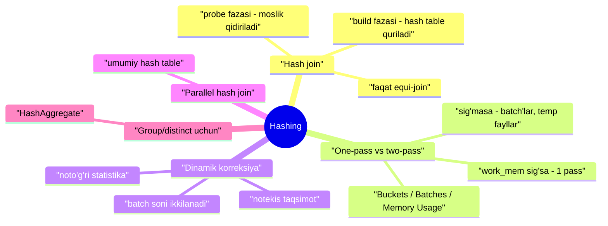
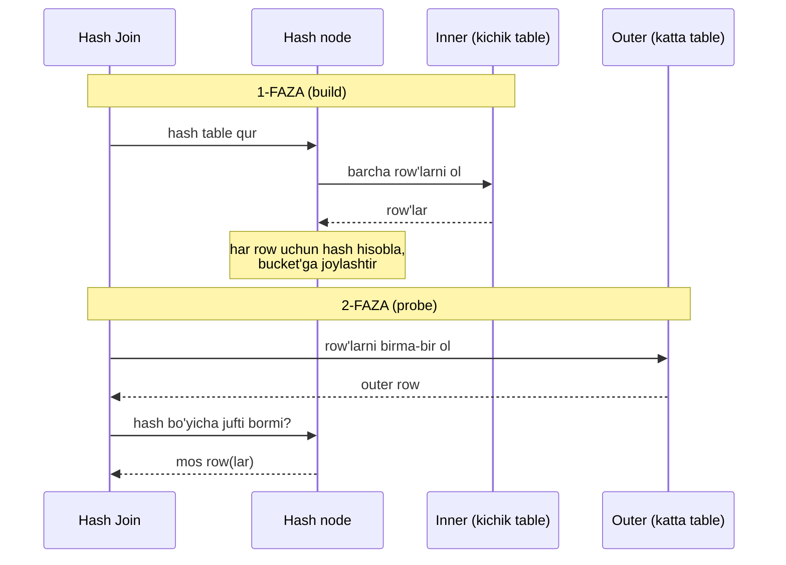
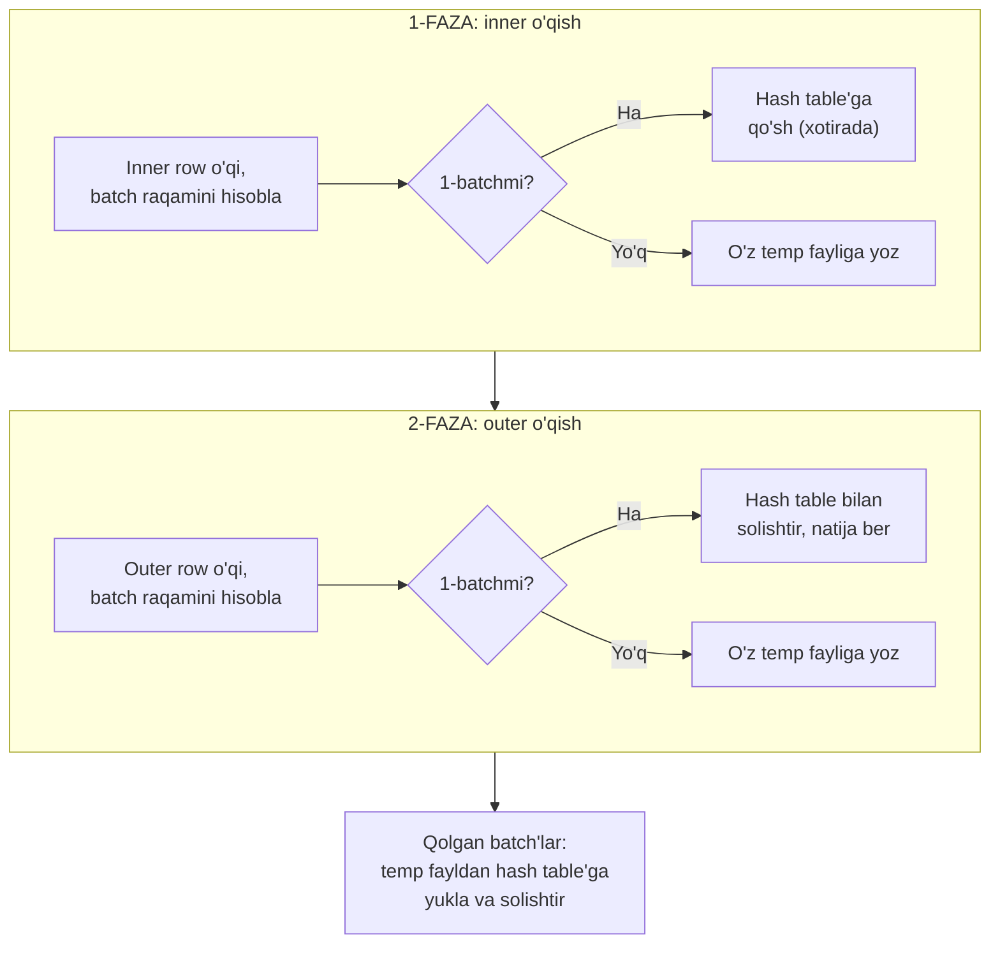
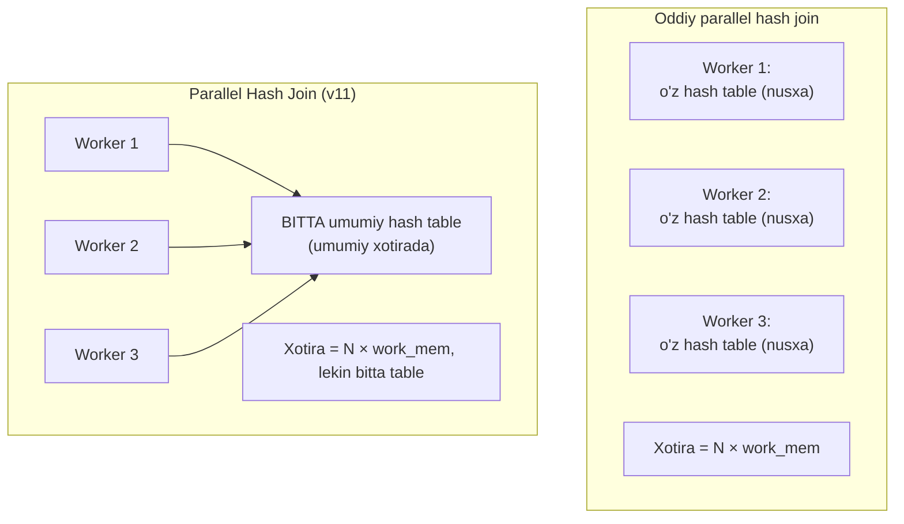

# 22. Hashing

> 📖 Manba: Рогов, "PostgreSQL 17 изнутри", 22-bob ("Хеширование")

## Nima uchun kerak?

21-darsda nested loop bilan tanishdik. U qisqa OLTP so'rovlarda ajoyib ishlaydi: outer'da kam row bo'lsa, har biri uchun inner'ni index orqali tez o'qiydi. Lekin tasavvur qiling — ikkita **katta** table'ni birlashtirmoqchisiz, masalan 2 mln buyurtma va 3 mln biletni. Nested loop bu yerda halokatli bo'ladi: 2 mln outer row uchun inner'ga 2 mln marta murojaat.

Bunday holatda boshqa strategiya kerak: inner set'ni **oldindan tayyorlab qo'yish**, shunda har bir outer row'ga jufti bir marta, tez topilsin. Aynan shuni **hash join** qiladi.

Analogiya: kutubxonada 2 mln kitobni topmoqchisiz. Nested loop — har bir kitob uchun butun javonlarni boshdan-oxir aylanib chiqish. Hash join — avval barcha kitoblarni **katalogga** (kitob raqami → javon) joylashtirib, keyin har bir so'rovga katalogdan bir zumda javob berish. Katalog tuzishga vaqt ketadi, lekin keyin qidiruv o'ta tez.



---

## 1-qism. Hash join g'oyasi va bir passli algoritm

Hash join g'oyasi: mos row'larni **oldindan tayyorlangan hash table** yordamida qidirish. Mana shunday birlashtirishning rejasi:

```sql
=> EXPLAIN (costs off) SELECT *
   FROM tickets t
   JOIN ticket_flights tf ON tf.ticket_no = t.ticket_no;
                 QUERY PLAN
------------------------------------------
 Hash Join
   Hash Cond: (tf.ticket_no = t.ticket_no)
   ->  Seq Scan on ticket_flights tf
   ->  Hash
         ->  Seq Scan on tickets t
(5 rows)
```

Bu yerda ikkita yangi node ko'rinadi: `Hash Join` va uning ostidagi `Hash`. Ular ikki fazada ishlaydi.

### Build fazasi (hash table qurish)

Birinchi fazada `Hash Join` node'i `Hash` node'iga murojaat qiladi. `Hash` esa o'z bola node'idan **butun inner set**ni oladi va uni **hash table**ga joylashtiradi.

Hash table qanday ishlaydi? U (kalit → qiymat) juftliklarini saqlaydi va kalit bo'yicha qiymatni **doimiy vaqtda** (hash table hajmiga bog'liq bo'lmagan holda) topadi. Buning uchun **hash kalitlari** cheklangan sondagi **bucket** (savat) larga taxminan bir tekis taqsimlanadi. Bucket raqami hash funksiya qiymatidan aniqlanadi; bucket soni doim ikkining darajasi bo'lgani uchun, hisoblangan qiymatdan kerakli sondagi bit olinadi.

> **Notional machine:** har bir inner row uchun join shartidagi maydonlardan (`Hash Cond`) hash funksiya hisoblanadi. Bu — **hash kaliti**. Hash table'ning o'zida esa so'rov uchun kerakli barcha maydonlar saqlanadi. Kolliziyalar (bir bucket'ga tushgan turli kalitlar) zanjirlar bilan hal qilinadi — huddi 9-darsdagi buffer cache kabi.



### Probe fazasi (moslik qidirish)

Hash table to'liq qurilmaguncha, hash join natija qaytara **olmaydi**. Bu nested loop'dan muhim farq (u darhol qaytara boshlaydi).

Ikkinchi fazada (hash table tayyor) `Hash Join` ikkinchi bola node'iga — **outer set**ga murojaat qiladi. Har bir o'qilgan outer row uchun hash table'da mos row bor-yo'qligi tekshiriladi: outer maydonlaridan hash hisoblanadi va tegishli bucket ko'riladi. Topilgan mosliklar yuqoriga qaytariladi.

### One-pass: hash table xotiraga sig'ganda (v13)

Hash join eng samarali — **bir passda** (ma'lumot bo'yicha bir o'tishda) — ishlaydi, agar hash table butunlay operativ xotiraga sig'sa. Unga ajratilgan hajm `work_mem × hash_mem_multiplier` (default **4MB × 2.0 = 8MB**) bilan cheklangan.

Xotira ishlatilishini ko'rish uchun `work_mem`'ni oshirib, EXPLAIN ANALYZE bilan sinaymiz:

```sql
=> SET work_mem = '128MB';
=> EXPLAIN (analyze, costs off, timing off, summary off)
   SELECT *
   FROM bookings b
   JOIN tickets t ON b.book_ref = t.book_ref;
                             QUERY PLAN
-----------------------------------------------------------
 Hash Join (actual rows=2949857 loops=1)
   Hash Cond: (t.book_ref = b.book_ref)
   ->  Seq Scan on tickets t (actual rows=2949857 loops=1)
   ->  Hash (actual rows=2111110 loops=1)
         Buckets: 4194304  Batches: 1  Memory Usage: 145986kB
         ->  Seq Scan on bookings b (actual rows=2111110 loops=1)
(6 rows)
```

Bu yerda uchta muhim ko'rsatkich:

- **Buckets: 4194304** — hash table 4M = 2²² ta savatdan iborat;
- **Batches: 1** — bir passda bajarildi (batch = paket, quyida);
- **Memory Usage: 145986kB** — hash table ~143MB egalladi, xotiraga sig'di.

> **Nested loop'dan muhim farq:** hash join'da outer va inner **joyini almashtirsa bo'ladi**. Odatda **kichikroq** to'plam inner (hash table) sifatida olinadi, chunki bu hash table xotirasini kamaytiradi. Nested loop'da esa outer/inner tabiati tubdan farq qilardi.

### Ortiqcha ustunlarni tanlamang!

Agar so'rovda faqat bitta ustun ishlatilsa, hash table uchun 145MB emas, 111MB yetadi:

```sql
=> EXPLAIN (analyze, costs off, timing off, summary off)
   SELECT b.book_ref
   FROM bookings b
   JOIN tickets t ON b.book_ref = t.book_ref;
                             QUERY PLAN
-----------------------------------------------------------
 Hash Join (actual rows=2949857 loops=1)
   Hash Cond: (t.book_ref = b.book_ref)
   ->  Index Only Scan using tickets_book_ref_idx on tickets t
         (actual rows=2949857 loops=1)
         Heap Fetches: 0
   ->  Hash (actual rows=2111110 loops=1)
         Buckets: 4194304  Batches: 1  Memory Usage: 113172kB
         ->  Seq Scan on bookings b (actual rows=2111110 loops=1)
(8 rows)
=> RESET work_mem;
```

> ⚠️ **Ko'p uchraydigan xato:** so'rovda `SELECT *` yoki keraksiz ustunlar. Hash table'ga faqat kerakli maydonlar tushishi kerak — ortiqcha ustunlar xotirani behuda sarflaydi va hash join'ni disk'ga tushishiga (two-pass) majbur qilishi mumkin.

### Nechta bucket bo'ladi?

Bucket soni shunday tanlanadiki, to'liq to'lgan table'da har bir bucket **o'rtacha bitta row** saqlasin. Zichroq to'ldirsa — kolliziya ehtimoli oshib, qidiruv sekinlashadi; siyrakroq bo'lsa — xotira behuda ketadi. Hisoblangan bucket soni birinchi mos keluvchi ikkining darajasigacha oshiriladi.

---

## 2-qism. Ikki passli hash join (two-pass)

Agar reja bosqichida baholar hash table cheklovga sig'maydi deb ko'rsatsa, inner set alohida **batch** (paket) larga bo'linadi, har biri alohida qayta ishlanadi. Batch soni ham (bucket kabi) doim ikkining darajasi; batch raqami hash qiymatining mos bitlari bilan aniqlanadi.

> **Muhim invariant:** birlashtirishda bir-biriga mos keladigan har qanday ikki row **bir xil batch**ga tegishli — chunki turli batch'dagi row'larning hash kodlari mos kelolmaydi. Shu sabab batch'larni mustaqil qayta ishlash mumkin.

### Ikki passli algoritm qadamlari



**1-faza:** inner set o'qiladi va hash table quriladi. Agar navbatdagi inner row **birinchi batch**ga tegishli bo'lsa, u hash table'ga qo'shiladi va xotirada qoladi. Aks holda u **o'z temp fayliga** (har batch uchun alohida) yoziladi.

**2-faza:** outer set o'qiladi. Agar row birinchi batch'ga tegishli bo'lsa, u hash table bilan solishtiriladi (u hozir aynan birinchi batch inner row'larini saqlaydi). Aks holda u ham **o'z temp fayliga** tashlanadi. Shunday qilib, N batch bo'lsa, `2(N−1)` fayl ishlatiladi.

**Qolgan batch'lar:** ikkala faza navbatma-navbat har bir saqlangan batch uchun takrorlanadi — inner row'lar temp fayldan hash table'ga ko'chiriladi, outer row'lar boshqa temp fayldan o'qilib solishtiriladi. Ishlatilgan temp fayllar o'chiriladi.

### EXPLAIN'da two-pass'ni o'qish

Two-pass birlashtirish EXPLAIN'da **birdan katta batch soni** bilan farqlanadi. `buffers` kaliti bilan disk almashinuvi statistikasini ham ko'rsatadi:

```sql
=> EXPLAIN (analyze, buffers, costs off, timing off, summary off)
   SELECT *
   FROM bookings b
   JOIN tickets t ON b.book_ref = t.book_ref;
                             QUERY PLAN
-----------------------------------------------------------
 Hash Join (actual rows=2949857 loops=1)
   Hash Cond: (t.book_ref = b.book_ref)
   Buffers: shared hit=7219 read=55709, temp read=54218 written=54218
   ->  Seq Scan on tickets t (actual rows=2949857 loops=1)
         Buffers: shared read=49440
   ->  Hash (actual rows=2111110 loops=1)
         Buckets: 131072  Batches: 32  Memory Usage: 4551kB
         Buffers: shared hit=7219 read=6269, temp written=10701
         ->  Seq Scan on bookings b (actual rows=2111110 loops=1)
               Buffers: shared hit=7219 read=6269
(11 rows)
```

Bu — yuqoridagi bilan bir xil so'rov, lekin default **8MB** `work_mem` bilan (128MB emas). Hash table sig'madi: **32 ta batch** ishlatildi, hash table 128K = 2¹⁷ bucket'dan iborat.

- `Hash` node bosqichida (build) temp fayllarga **yozish** bor (`temp written`);
- `Hash Join` bosqichida (probe) fayllar ham yoziladi, ham o'qiladi (`temp read, written`).

> **Muhim parametr:** `temp_file_limit` (default **-1** = cheksiz) — sessiya disk'dagi temp fayllar hajmini cheklaydi. Sessiya limitni tugatsa, so'rov avariyada uziladi. `log_temp_files = 0` esa har bir temp fayl va uning hajmini server log'iga yozadi.

---

## 3-qism. Dinamik plan korreksiyalari

Rejalashtirilgan borishni ikki muammo buzishi mumkin: **noto'g'ri statistika** va **notekis taqsimot**.

Join key ustunlaridagi qiymatlar notekis taqsimlanganda, turli batch'lar turli sondagi row'larga ega bo'ladi. Agar biror batch (birinchisidan tashqari) juda katta bo'lib qolsa, uning barcha row'larini avval disk'ga yozib, keyin qaytadan o'qishga to'g'ri keladi.

### Skew optimization

Asosan tashvishni **outer set** keltiradi (u odatda kattaroq). Shuning uchun agar outer set uchun eng ko'p uchraydigan qiymatlar (MCV — most common values, 17-darsda ko'rganmiz) statistikasi bo'lsa, shu qiymatlarga mos hash kodli row'lar **birinchi batch**ga tegishli deb hisoblanadi. Bu **skew optimization** two-pass'dagi disk kirish-chiqishini biroz kamaytiradi.

### Batch sonining uchib-oshishi

Ikkala muammo ba'zi (yoki barcha) batch'lar hajmi hisoblangandan katta bo'lishiga olib kelishi mumkin. U holda hash table rejalashtirilgan hajmga sig'may, cheklovdan chiqadi.

Shuning uchun hash table qurish jarayonida uning hajmi cheklovga sig'masligi ma'lum bo'lsa, **batch soni uchib (on-the-fly) ikkilanadi**. Har bir batch ikkita yangisiga bo'linadi: taxminan yarim row'lar hash table'da qoladi, ikkinchi yarmi yangi temp faylga tashlanadi.

> **Nozik nuqta:** one-pass va two-pass — aslida **bitta va o'sha algoritm**, bitta kod bilan amalga oshirilgan. Batch sonining ikkilanishi hatto one-pass rejalashtirilgan bo'lsa ham sodir bo'lishi mumkin. Batch soni **faqat oshadi** — planner ko'p tomonga xato qilsa, batch'lar birlashtirilmaydi.

Buni sun'iy ravishda ko'rsatamiz. `bookings_copy` yaratamiz, lekin planner uni 10 barobar kichik deb o'ylashi uchun statistikani "aldaymiz":

```sql
=> CREATE TABLE bookings_copy ( LIKE bookings INCLUDING INDEXES )
   WITH (autovacuum_enabled = off);
=> INSERT INTO bookings_copy SELECT * FROM bookings;
INSERT 0 2111110
=> DELETE FROM bookings_copy WHERE random() < 0.9;
DELETE 1900300
=> ANALYZE bookings_copy;
=> INSERT INTO bookings_copy SELECT * FROM bookings ON CONFLICT DO NOTHING;
INSERT 0 1900300
=> SELECT reltuples FROM pg_class WHERE relname = 'bookings_copy';
 reltuples
-----------
    210810
(1 row)
```

Endi table to'liq (2.1 mln row), lekin planner unda 210810 row bor deb hisoblaydi. Xatolik tufayli planner 4 ta batch yetadi deb o'ylaydi, lekin bajarilishda batch soni **16 ga yetadi**:

```sql
=> EXPLAIN (analyze, costs off, timing off, summary off)
   SELECT *
   FROM bookings_copy b
   JOIN tickets t ON b.book_ref = t.book_ref;
                             QUERY PLAN
----------------------------------------------------------------
 Hash Join (actual rows=2949857 loops=1)
   Hash Cond: (t.book_ref = b.book_ref)
   ->  Seq Scan on tickets t (actual rows=2949857 loops=1)
   ->  Hash (actual rows=2111110 loops=1)
         Buckets: 131072 (originally 131072)  Batches: 16 (originally 4)
         Memory Usage: 8085kB
         ->  Seq Scan on bookings_copy b (actual rows=2111110 loops=1)
(7 rows)
```

`Batches: 16 (originally 4)` — reja 4 ta batch bilan boshlangan, lekin bajarilishda 16 ga o'sgan.

> ⚠️ **Batch soni oshishi hamma vaqt yordam bermaydi:** agar kalit ustun **barcha row'larda bir xil qiymat** saqlasa, ularning hammasi bitta batch'ga tushadi (hash bir xil bo'ladi). Bu holda hash table cheklovlarga qaramay o'saveradi. Buning yechimi — statistikani yangi tutish va ortiqcha ustunlarni tanlamaslik.

---

## 4-qism. Parallel hash join

### Oddiy hash join parallel rejada

Hash join parallel rejalarda men yuqorida tasvirlagan ko'rinishda ishtirok etishi mumkin: avval bir necha parallel jarayon **mustaqil ravishda o'zining (bir xil) hash table'ini** inner set bo'yicha quradi, keyin outer set'ga parallel kirishdan foydalanadi. Yutuq — har bir jarayon outer set'ning faqat bir qismini ko'radi.

```sql
=> SET work_mem = '128MB';
=> SET enable_parallel_hash = off;
=> EXPLAIN (analyze, costs off, timing off, summary off)
   SELECT count(*)
   FROM bookings b
   JOIN tickets t ON t.book_ref = b.book_ref;
                             QUERY PLAN
----------------------------------------------------------------
 Finalize Aggregate (actual rows=1 loops=1)
   ->  Gather (actual rows=3 loops=1)
         Workers Planned: 2
         Workers Launched: 2
         ->  Partial Aggregate (actual rows=1 loops=3)
               ->  Hash Join (actual rows=983286 loops=3)
                     Hash Cond: (t.book_ref = b.book_ref)
                     ->  Parallel Index Only Scan using tickets_book_ref...
                           Heap Fetches: 0
                     ->  Hash (actual rows=2111110 loops=3)
                           Buckets: 4194304  Batches: 1  Memory Usage: 113172kB
                           ->  Seq Scan on bookings b (actual rows=2111110...
(13 rows)
=> RESET enable_parallel_hash;
```

> **Xotira nozikligi:** hash table cheklovi **har bir** parallel jarayonga alohida qo'llaniladi. Shuning uchun yig'indida rejada ko'rsatilganidan (`Memory Usage`) **uch barobar** ko'p xotira ajratiladi — har bir jarayon o'z nusxasini quradi.

### Parallel one-pass hash join (v11)

Katta to'plamlar uchun maxsus **parallel hash join** algoritmi yaxshiroq ishlaydi. Oddiy versiyadan asosiy farqi: hash table jarayonning **lokal xotirasida emas, umumiy dinamik xotirada** yaratiladi va barcha ishtirokchi jarayonlarga ochiq.

Bu bir necha alohida hash table o'rniga **bitta umumiy** hash table qurish imkonini beradi, barcha jarayonlarga ajratilgan **yig'ma** xotiradan foydalanib. Natijada birlashtirishni bir passda bajarish ehtimoli oshadi.



Rejada birinchi faza `Parallel Hash`, ikkinchisi `Parallel Hash Join` node'lari bilan ko'rsatiladi:

```sql
=> SET work_mem = '64MB';
=> EXPLAIN (analyze, costs off, timing off, summary off)
   SELECT count(*)
   FROM bookings b
   JOIN tickets t ON t.book_ref = b.book_ref;
                             QUERY PLAN
----------------------------------------------------------------
 Finalize Aggregate (actual rows=1 loops=1)
   ->  Gather (actual rows=3 loops=1)
         Workers Planned: 2
         Workers Launched: 2
         ->  Partial Aggregate (actual rows=1 loops=3)
               ->  Parallel Hash Join (actual rows=983286 loops=3)
                     Hash Cond: (t.book_ref = b.book_ref)
                     ->  Parallel Index Only Scan using tickets_book_ref...
                           Heap Fetches: 0
                     ->  Parallel Hash (actual rows=703703 loops=3)
                           Buckets: 4194304  Batches: 1  Memory Usage: 115392kB
                           ->  Parallel Seq Scan on bookings b (actual row...
(13 rows)
=> RESET work_mem;
```

Diqqat: `work_mem`'ni yarmiga (64MB) tushirdik, lekin birlashtirish baribir **bir passli** qoldi — barcha jarayonlar xotirasi birga ishlatilgani uchun. Hash table biroz ko'proq xotira egallaydi, lekin u **yagona** nusxada, shuning uchun umumiy xotira sarfi kamaydi.

### Parallel two-pass hash join

Barcha jarayonlar umumiy xotirasi ham yetmasa, two-pass algoritm ishlaydi va u boshqalaridan sezilarli farq qiladi. Bir katta umumiy hash table o'rniga **bir necha kichik table** ishlatiladi — har bir jarayon o'z table'i bilan, batch'larni mustaqil qayta ishlaydi. Bunda **barcha** batch'lar (birinchisi ham) disk'ga tashlanadi. Har bir jarayon bitta batch tanlab uni to'liq bajaradi; batch'lar tugagach, bo'shagan jarayon boshqa tugallanmagan batch'ni qo'lga oladi (barcha hash table'lar umumiy xotirada bo'lgani uchun bu mumkin).

---

## 5-qism. Modifikatsiyalar — barcha join turlari

Hash join algoritmi nafaqat inner join, balki boshqa barcha turlar uchun ishlaydi: left, right, full outer join, semi va anti join. Yagona cheklov — join sharti **faqat tenglik** (equi-join) bo'lishi kerak.

Bu yerda muhim bir tushuncha bor: logik va fizik join yo'nalishi **mos kelmasligi** mumkin. Misol:

```sql
=> EXPLAIN (costs off) SELECT *
   FROM bookings b
   LEFT OUTER JOIN tickets t ON t.book_ref = b.book_ref;
                 QUERY PLAN
--------------------------------------
 Hash Right Join
   Hash Cond: (t.book_ref = b.book_ref)
   ->  Seq Scan on tickets t
   ->  Hash
         ->  Seq Scan on bookings b
(5 rows)
```

Diqqat qiling: SQL'da **left** join yozganmiz, lekin rejada **Hash Right Join** paydo bo'ldi!

> **Nega bunday?** Logik darajada tashqi table (chapda turgan) — `bookings`, ichki — `tickets`. Natijaga biletsiz buyurtmalar ham tushishi kerak. Lekin **fizik** darajada outer/inner so'rov matnidagi joyga qarab emas, **cost bo'yicha** aniqlanadi. Odatda hash table'i kichikroq bo'lgan to'plam inner bo'ladi. Bu yerda `bookings` inner sifatida tanlandi va left join o'ngga aylandi.

Aksincha, so'rovda right join yozsangiz, rejada left'ga aylanishi mumkin. Full join misoli ham bor (`Hash Full Join`).

> ⚠️ **Ko'p uchraydigan xato:** EXPLAIN'da `Hash Right Join` ko'rib "men left join yozgandim-ku!" deb hayron bo'lish. Bu normal — planner shunchaki hash table'ni kichikroq to'plamdan qurish uchun yo'nalishni almashtiradi, natija bir xil qoladi.

Parallel hash join **barcha** join turlari uchun qo'llab-quvvatlanadi (v16'dan right va full ham). Planner ko'pincha kichikroq hash table qurish uchun right join'ni afzal ko'radi.

---

## 6-qism. Hashing GROUP BY va DISTINCT uchun — HashAggregate

Hash table faqat join uchun emas! Agregatsiya uchun qiymatlarni **guruhlash** va dublikatlarni **yo'q qilish** ham shu algoritmga o'xshash usullar bilan bajariladi.

G'oya oddiy: kerakli ustunlar bo'yicha hash table quriladi. Qiymat hash table'ga faqat u yerda **hali yo'q bo'lsa** joylashtiriladi. Natijada hash table'da barcha **noyob** qiymatlar yig'iladi. Bu node rejada **HashAggregate** deb belgilanadi.

Bir necha misol:

```sql
=> EXPLAIN (costs off)
   SELECT fare_conditions, count(*)
   FROM seats
   GROUP BY fare_conditions;
          QUERY PLAN
----------------------------
 HashAggregate
   Group Key: fare_conditions
   ->  Seq Scan on seats
(3 rows)
```

`DISTINCT` ham xuddi shunday:

```sql
=> EXPLAIN (costs off)
   SELECT DISTINCT fare_conditions
   FROM seats;
          QUERY PLAN
----------------------------
 HashAggregate
   Group Key: fare_conditions
   ->  Seq Scan on seats
(3 rows)
```

`UNION`'da `Append` ikki to'plamni birlashtiradi (lekin dublikatlarni o'chirmaydi), o'chirishni alohida `HashAggregate` bajaradi.

### One-pass HashAggregate

HashAggregate uchun ajratilgan xotira ham `work_mem × hash_mem_multiplier` bilan cheklangan. Hash table sig'sa, agregatsiya bir passda:

```sql
=> EXPLAIN (analyze, costs off, timing off, summary off)
   SELECT DISTINCT amount FROM ticket_flights;
                             QUERY PLAN
-----------------------------------------------------------
 HashAggregate (actual rows=338 loops=1)
   Group Key: amount
   Batches: 1  Memory Usage: 45kB
   ->  Seq Scan on ticket_flights (actual rows=8391852 loops=1)
(4 rows)
```

Noyob qiymatlar kam (atigi 338 ta narx), shuning uchun hash table atigi 45KB egalladi.

### Two-pass HashAggregate (v13)

Hash table qurish paytida yangi qiymatlar sig'may qolsa, ular **temp fayllarga** tashlanadi, hash qiymatining bir necha bitlari asosida **razdel** (partition) larga taqsimlanib. Razdel soni ikkining darajasi va planner tomonidan har bir razdel hash table'i xotiraga to'liq sig'adigan qilib tanlanadi. Baho statistika sifatiga bog'liq bo'lgani uchun, hisoblangan qiymat **1.5 ga** ko'paytiriladi — razdellarni kichraytirib, har birini bir o'tishda bajarish ehtimolini oshirish uchun.

Ko'p noyob identifikator bo'lgani uchun 4 razdel rejalashtirilgan misol:

```sql
=> SET hash_mem_multiplier = 1.1;
=> EXPLAIN
   SELECT DISTINCT flight_id FROM ticket_flights;
                             QUERY PLAN
----------------------------------------------------------------
 HashAggregate  (604941.71..671358.36 rows=85516 width=4)
   Group Key: flight_id
   Planned Partitions: 4
   ->  Seq Scan on ticket_flights (cost=0.00..153878.70 rows=8391...
(4 rows)
```

Bajarilishda 5 iteratsiya kerak bo'ldi: bittasi boshlang'ich to'plam bo'yicha va yana to'rttasi diskga yozilgan razdellar bo'yicha:

```sql
=> EXPLAIN (analyze, costs off, timing off, summary off)
   SELECT DISTINCT flight_id FROM ticket_flights;
                             QUERY PLAN
-----------------------------------------------------------
 HashAggregate (actual rows=150588 loops=1)
   Group Key: flight_id
   Batches: 5  Memory Usage: 10289kB  Disk Usage: 69384kB
   ->  Seq Scan on ticket_flights (actual rows=8391852 loops=1)
(4 rows)
=> RESET hash_mem_multiplier;
```

`Batches: 5` va `Disk Usage: 69384kB` — hash table xotiraga sig'may, disk'dan foydalandi.

> **Join va aggregatsiya farqi:** two-pass hash join'da eng ko'p uchraydigan qiymatlar maxsus birinchi batch'ga o'tkaziladi (skew optimization). Agregatsiyada bunga hojat yo'q, chunki razdellarga **barcha** row emas, faqat xotiraga sig'magani bo'linadi. Tez-tez uchraydigan qiymatlar katta ehtimol bilan boshiga yetib kelib, o'rin egallab ulguradi.

---

## Muhim parametrlar

| Parametr | Default | Ma'nosi |
|---|---|---|
| `work_mem` | **4MB** | Bir hash/sort operatsiyasi bazaviy xotirasi |
| `hash_mem_multiplier` | **2.0** | Hash table uchun `work_mem` ga ko'paytma (ya'ni 8MB) |
| `enable_hashjoin` | **on** | Hash join'ni yoqish/o'chirish |
| `enable_parallel_hash` | **on** | Parallel (umumiy) hash join'ni yoqish |
| `temp_file_limit` | **-1** | Sessiya temp fayllari hajmi cheklovi (-1 = cheksiz) |
| `log_temp_files` | **-1** | Temp fayllarni log'ga yozish (0 = hammasini) |
| `cpu_operator_cost` | 0.0025 | Bir hash funksiya/operator narxi |
| `seq_page_cost` | 1.0 | Ketma-ket page o'qish/yozish narxi (two-pass I/O) |

---

## Xulosa

- **Hash join** ikki fazada ishlaydi: **build** (inner set'dan hash table qurish) va **probe** (outer row'larga hash table'dan jufti qidirish). Faqat **equi-join** bilan ishlaydi.
- Hash join natijani **hash table to'liq qurilgunicha** bermaydi (nested loop darhol berardi) — bu javob vaqti muhim bo'lgan joyda kamchilik.
- **One-pass:** hash table `work_mem × hash_mem_multiplier` (8MB) ga sig'sa, bir passda — chiziqli murakkablik. `Batches: 1`.
- **Two-pass:** sig'masa, inner set **batch**'larga bo'linadi, har biri **temp fayl**ga yoziladi. `Batches > 1`, disk I/O oshadi.
- Hash join outer/inner'ni **almashtira oladi** — kichikroq to'plam inner (hash table) bo'ladi. `SELECT *` va ortiqcha ustunlar hash table'ni shishiradi.
- **Dinamik korreksiya:** noto'g'ri statistika yoki notekis taqsimotda batch soni bajarilish paytida **ikkilanadi** (`16 originally 4`). Batch soni faqat oshadi.
- **Parallel hash join** (v11) umumiy xotirada **bitta** hash table quradi — barcha jarayonlar birga foydalanib, one-pass ehtimolini oshiradi.
- Logik join yo'nalishi fizik yo'nalishdan farq qilishi mumkin: `LEFT JOIN` rejada `Hash Right Join` bo'lib chiqishi normal (kichikroq hash table uchun).
- **HashAggregate** — GROUP BY va DISTINCT uchun hash table quradi; sig'masa **razdellar**ga bo'linadi (v13). `Disk Usage` ko'rinadi.

## Nazorat savollari

1. Hash join'ning ikki fazasini (build va probe) tushuntiring. Nima uchun u natijani darhol qaytara olmaydi va bu nested loop bilan solishtirganda qanday kamchilik?
2. `work_mem` va `hash_mem_multiplier` hash join'ga qanday ta'sir qiladi? One-pass va two-pass orasidagi farq nimada?
3. EXPLAIN'da `Buckets`, `Batches`, `Memory Usage` nimani anglatadi? `Batches: 32` ko'rsangiz nima xulosa qilasiz?
4. Nima uchun hash join'da kichikroq to'plam inner (hash table) sifatida tanlanadi? `SELECT *` bu tanlovga qanday ta'sir qiladi?
5. Batch soni bajarilish paytida qanday va nega ikkilanadi? `Batches: 16 (originally 4)` nimani ko'rsatadi va bu qachon yordam bermaydi?
6. SQL'da `LEFT JOIN` yozganingizda rejada `Hash Right Join` chiqsa, bu xatomi? Nega bunday bo'ladi?
7. Parallel hash join (v11) oddiy hash join parallel rejadan nimasi bilan farq qiladi? Xotira sarfi qanday o'zgaradi?
8. HashAggregate GROUP BY va DISTINCT'ni qanday bajaradi? Xotira yetmaganda (v13) nima sodir bo'ladi?
