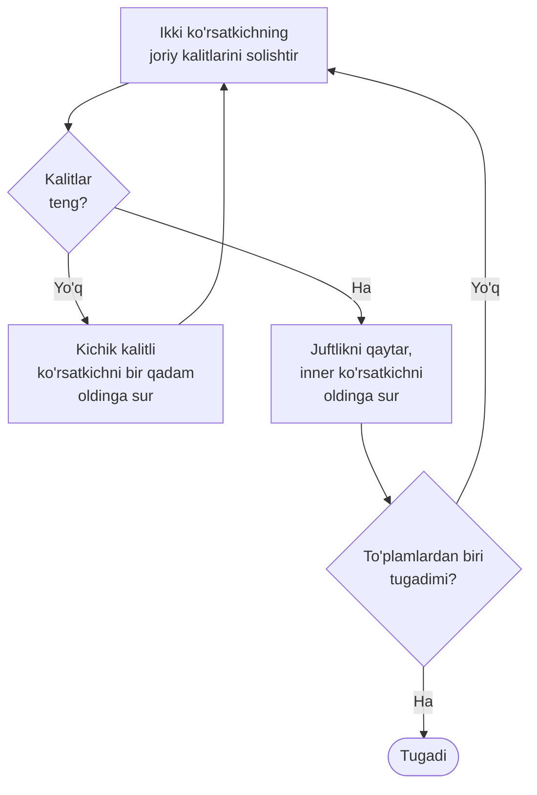
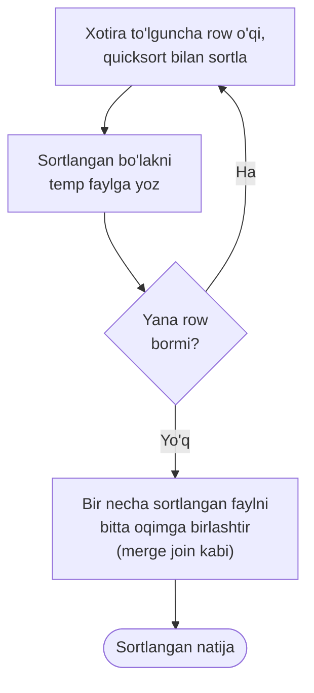
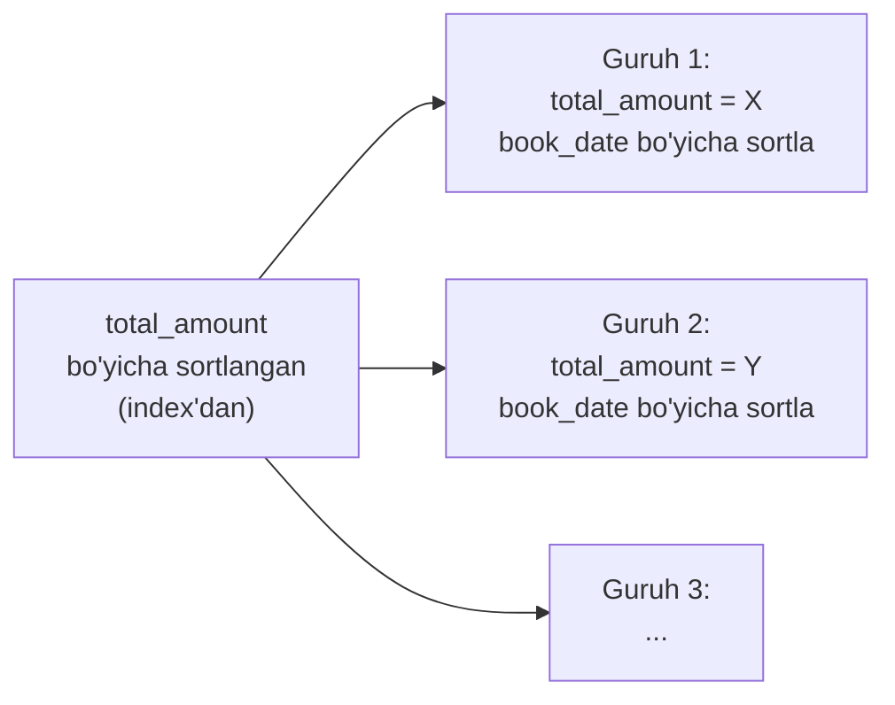
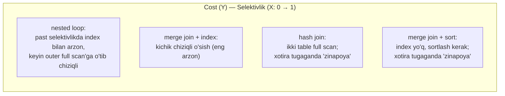

# 23. Sortlash va merge join

> 📖 Manba: Рогов, "PostgreSQL 17 изнутри", 23-bob ("Сортировка и слияние")

## Nima uchun kerak?

21-darsda nested loop, 22-darsda hash join bilan tanishdik. Endi uchinchi va oxirgi join algoritmi — **merge join** (birlashtirish bilan birlashtirish) — ni ko'ramiz. U hash join'ga o'xshab katta to'plamlarda samarali, lekin bitta muhim shart bilan: ikkala to'plam ham join key bo'yicha **sortlangan** bo'lishi kerak.

Analogiya: ikkita tartiblangan mehmonlar ro'yxatini solishtirmoqchisiz — biri familiya bo'yicha, ikkinchisi ham familiya bo'yicha alifbo tartibida. Ikkala ro'yxatni **bir vaqtda yuqoridan pastga** yurib chiqasiz: qaysi ro'yxatda hozirgi familiya "kichikroq" bo'lsa, o'sha ro'yxatda bir qator pastga tushasiz. Bir zumda mos juftliklarni topib bo'rasiz. Bu — merge join.

Lekin bu yerda muhim savol tug'iladi: agar to'plam sortlangan bo'lmasa-chi? Shu sabab bu dars **ikki qismdan** iborat: avval **sortlash** algoritmlarini (ular join'dan tashqarida ham juda ko'p ishlatiladi — har bir `ORDER BY` ortida shular turadi), keyin merge join'ning o'zini. Va nihoyat — butun kursning bir cho'qqisi: **uchta algoritmni taqqoslash** — qachon qaysi biri yutadi.

```mermaid
mindmap
  root(("Sortlash va<br/>merge join"))
    "Merge join"
      "ikki sortlangan oqim"
      "ikki ko'rsatkich"
      "faqat equi-join"
    "Sortlash usullari"
      "quicksort (xotirada)"
      "top-N heapsort (LIMIT)"
      "external merge (disk)"
      "incremental sort"
    "Guruhlash sortlash bilan"
      "GroupAggregate"
      "Unique"
    "TAQQOSLASH"
      "nested loop"
      "hash join"
      "merge join"
      "qachon qaysi biri"
```

---

## 1-qism. Merge join mexanizmi

Merge join join key bo'yicha **sortlangan** to'plamlar bilan ishlaydi va natijani ham **sortlangan** holda qaytaradi. Kirish to'plami index scan (20-darsda ko'rganmiz) natijasida allaqachon sortlangan bo'lishi mumkin, yoki uni oshkora sortlash mumkin.

Mana merge join misoli — rejada `Merge Join` node'i:

```sql
=> EXPLAIN (costs off) SELECT *
   FROM tickets t
   JOIN ticket_flights tf ON tf.ticket_no = t.ticket_no
   ORDER BY t.ticket_no;
                       QUERY PLAN
------------------------------------------------------------
 Merge Join
   Merge Cond: (t.ticket_no = tf.ticket_no)
   ->  Index Scan using tickets_pkey on tickets t
   ->  Index Scan using ticket_flights_pkey on ticket_flights tf
(4 rows)
```

Bu yerda planner aynan merge join'ni tanladi, chunki u natijani `ORDER BY`'da so'ralgan tartibda qaytaradi. Ikkala bola node ham **index scan** — ular row'larni allaqachon `ticket_no` tartibida beradi, shuning uchun qo'shimcha sortlash kerak emas.

### Algoritm: ikki ko'rsatkich

Birlashtirish ikkala to'plam bo'yicha **bir passda** bajariladi va **qo'shimcha xotira talab qilmaydi**. Ikkita ko'rsatkich ishlatiladi — inner va outer to'plamning joriy (dastlab — birinchi) row'lariga.



Agar ikki joriy row kaliti **mos kelmasa**, kichikroq kalitli ko'rsatkich (qaysi biri kichik bo'lsa) mos kelgunicha bir qadam oldinga suriladi. Mos kelgan row'lar yuqoriga qaytariladi, inner ko'rsatkich esa bir qadam oldinga siljiydi. Birlashtirish to'plamlardan biri tugaguncha davom etadi.

### Dublikatlar bilan ishlash

Algoritm inner to'plamdagi kalit dublikatlarini oson uddalaydi. Lekin dublikatlar outer'da ham bo'lishi mumkin, shuning uchun algoritm biroz murakkablashadi: outer ko'rsatkich surilgandan keyin ham kalit o'zgarmasa, inner ko'rsatkich **shu kalitli birinchi row'ga qaytariladi**. Shunday qilib, har bir outer row'ga inner'dagi shu kalitli **barcha** row'lar mos qo'yiladi.

> **Yagona operator — tenglik.** Merge join faqat equi-join'ni qo'llab-quvvatlaydi (boshqa shartlar ustida ish olib borilmoqda, lekin hozircha yo'q). Bu hash join bilan bir xil cheklov, nested loop esa istalgan shartni qo'llardi (21-darsda ko'rganmiz).

### Ketma-ket merge join'lar

Sortlangan natija keyingi merge join uchun kirish bo'la oladi, agar sort tartibi mos kelsa. Uch table'ni bitta `ticket_no` tartibida birlashtirish:

```sql
=> EXPLAIN (costs off) SELECT *
   FROM tickets t
   JOIN ticket_flights tf ON t.ticket_no = tf.ticket_no
   JOIN boarding_passes bp ON bp.ticket_no = tf.ticket_no
     AND bp.flight_id = tf.flight_id
   ORDER BY t.ticket_no;
                             QUERY PLAN
----------------------------------------------------------------
 Merge Join
   Merge Cond: ((t.ticket_no = tf.ticket_no) AND (bp.flight_id = ...
   ->  Merge Join
         Merge Cond: (bp.ticket_no = t.ticket_no)
         ->  Index Scan using boarding_passes_pkey on boarding_passe...
         ->  Index Scan using tickets_pkey on tickets t
   ->  Index Scan using ticket_flights_pkey on ticket_flights tf
(7 rows)
```

Avval `boarding_passes` va `tickets` `ticket_no` bo'yicha birlashtiriladi; natija ham `ticket_no` bo'yicha sortlangan. Keyin u `ticket_flights` bilan xuddi shu tartibda birlashtiriladi — sortlash bir marta ham qayta bajarilmaydi.

---

## 2-qism. Sortlash usullari

Agar to'plamlardan biri (yoki ikkalasi) join key bo'yicha sortlanmagan bo'lsa, merge join'dan oldin uni **qayta tartiblash** kerak. Bu oshkora sortlash rejada **Sort** node'i bilan ko'rsatiladi:

```sql
=> EXPLAIN (costs off)
   SELECT *
   FROM flights f
   JOIN airports_data dep ON f.departure_airport = dep.airport_code
   ORDER BY dep.airport_code;
                       QUERY PLAN
------------------------------------------------------
 Merge Join
   Merge Cond: (f.departure_airport = dep.airport_code)
   ->  Sort
         Sort Key: f.departure_airport
         ->  Seq Scan on flights f
   ->  Sort
         Sort Key: dep.airport_code
         ->  Seq Scan on airports_data dep
(8 rows)
```

Xuddi shunday sortlash join'dan tashqarida ham ishlatiladi — oddiy `ORDER BY`'da va window funksiyalarda:

```sql
=> EXPLAIN (costs off)
   SELECT flight_id,
     row_number() OVER (PARTITION BY flight_no ORDER BY flight_id)
   FROM flights f;
              QUERY PLAN
------------------------------------
 WindowAgg
   ->  Sort
         Sort Key: flight_no, flight_id
         ->  Seq Scan on flights f
(4 rows)
```

Planner arsenalida bir necha sortlash usuli bor. `EXPLAIN ANALYZE` `Sort Method` orqali qaysi biri ishlaganini ko'rsatadi:

```sql
=> EXPLAIN (analyze, costs off, timing off, summary off)
   SELECT *
   FROM flights f
   JOIN airports_data dep ON f.departure_airport = dep.airport_code
   ORDER BY dep.airport_code;
                             QUERY PLAN
-----------------------------------------------------------
 Merge Join (actual rows=214867 loops=1)
   Merge Cond: (f.departure_airport = dep.airport_code)
   ->  Sort (actual rows=214867 loops=1)
         Sort Key: f.departure_airport
         Sort Method: external merge  Disk: 17120kB
         ->  Seq Scan on flights f (actual rows=214867 loops=1)
   ->  Sort (actual rows=104 loops=1)
         Sort Key: dep.airport_code
         Sort Method: quicksort  Memory: 42kB
         ->  Seq Scan on airports_data dep (actual rows=104 loops=1)
(10 rows)
```

Bir rejada ikki xil usul ishladi: katta `flights` uchun `external merge` (disk), kichik `airports_data` uchun `quicksort` (xotira). Ularni ketma-ket ko'rib chiqamiz.

### Quicksort — xotirada tez sortlash

Agar sortlanadigan to'plam `work_mem` (default **4MB**) bilan cheklangan xotiraga sig'sa, an'anaviy **quicksort** ishlatiladi. Bu algoritm barcha darsliklarda tasvirlangan, shuning uchun uni takrorlamaymiz.

```sql
=> EXPLAIN SELECT *
   FROM airports_data
   ORDER BY airport_code;
                             QUERY PLAN
-----------------------------------------------------------------
 Sort  (cost=7.52..7.78 rows=104 width=145)
   Sort Key: airport_code
   ->  Seq Scan on airports_data (cost=0.00..4.04 rows=104 width=...
(3 rows)
```

**Cost baholash.** `n` qiymatni sortlash `O(n log₂ n)` murakkablikda. Natijani faqat butun to'plamni o'qib, sortlab olish mumkin bo'lgani uchun, sortlashning **startup cost**'i (birinchi row uchun narx) bola node to'liq narxi va barcha taqqoslashlar narxidan iborat:

```sql
=> WITH costs(startup) AS (
   SELECT 4.04 + round((
     current_setting('cpu_operator_cost')::real * 2 *
     104 * log(2, 104)
   )::numeric, 2)
   )
   SELECT startup,
     startup + round((
       current_setting('cpu_operator_cost')::real * 104
     )::numeric, 2) AS total
   FROM costs;
 startup | total
---------+-------
    7.52 |  7.78
(1 row)
```

> **Muhim nozik nuqta:** sortlashda startup cost butun total cost'ga deyarli teng. Bu mantiqan to'g'ri — birinchi row'ni qaytarish uchun ham butun to'plamni sortlab bo'lish kerak. Shu sabab `Sort` node'i natijani darhol bera olmaydi (hash join build fazasi kabi).

### Top-N heapsort — LIMIT bilan qisman sortlash

Agar butun to'plamni emas, faqat bir qismini sortlash kerak bo'lsa (`LIMIT` bilan aniqlanadi), **top-N heapsort** (qisman piramidal sortlash) ishlatiladi. Aniqrog'i, u sortlashdan keyin row soni kamida ikki barobar kamaysa yoki kirish to'plami xotiraga sig'masa (lekin chiqish sig'sa) qo'llaniladi.

```sql
=> EXPLAIN (analyze, timing off, summary off)
   SELECT * FROM seats
   ORDER BY seat_no LIMIT 100;
                             QUERY PLAN
-----------------------------------------------------------------
 Limit  (cost=72.57..72.82 rows=100 width=15) (actual rows=100 loops=1)
   ->  Sort  (cost=72.57..75.91 rows=1339 width=15) (actual rows=100 loops=1)
         Sort Key: seat_no
         Sort Method: top-N heapsort  Memory: 32kB
         ->  Seq Scan on seats (cost=0.00..21.39 rows=1339 width=15)
               (actual rows=1339 loops=1)
(8 rows)
```

Notional machine: `n` dan `k` ta maksimal (minimal) qiymatni topish uchun **heap** (uyum) deb ataluvchi ma'lumot tuzilmasiga birinchi `k` row qo'shiladi. Keyin qolgan row'lar birma-bir qo'shiladi, lekin har biridan keyin heap'dan bitta eng kichik (eng katta) qiymat chiqarib tashlanadi. Natijada heap'da izlangan `k` qiymat qoladi.

> **Terminologik chalkashlikka ehtiyot bo'ling:** bu algoritmda ishlatiluvchi **heap** (uyum) — bu **ma'lumot tuzilmasi**, va u bazadagi jadvallar bilan (ular ham ko'pincha "heap" deyiladi — 18-darsda) hech qanday aloqasi yo'q.

Murakkablik `O(n log₂ k)`, lekin har bir operatsiya quicksort'dan qimmatroq, shuning uchun cost formulasi `n log₂ 2k` ishlatadi.

### External merge sort — disk orqali tashqi sortlash

To'plam o'qilayotganda u xotira uchun juda katta ekani ma'lum bo'lsa, Sort node'i **external merge** (tashqi birlashtiruvchi sortlash) ga o'tadi.



Notional machine bosqichma-bosqich:

1. **Bo'laklarga sortlash.** Xotiraga sig'gan row'lar quicksort bilan sortlanadi va temp faylga yoziladi. Bo'shagan xotiraga keyingi row'lar o'qiladi, jarayon takrorlanadi — natijada ma'lumot bir necha faylga yoziladi, har biri **alohida sortlangan**.

2. **Fayllarni birlashtirish.** Bir necha fayl bitta faylga xuddi merge join kabi algoritm bilan birlashtiriladi. Asosiy farq — bir vaqtda **ikkitadan ortiq** fayl birlashtirilishi mumkin.

Birlashtirish uchun ko'p xotira kerak emas — har fayl uchun bitta row joyi yetadi. Fayllardan birinchi row'lar o'qiladi, ular orasidan minimal (yoki maksimal) tanlanib natijaga qaytariladi, o'rniga shu fayldan yangi row o'qiladi.

> **Amaliyotdagi nozikliklar:** row'lar birma-bir emas, **32 page'lik porsiyalar** bilan o'qiladi (I/O sonini kamaytirish uchun). Bir iteratsiyada birlashtiriladigan fayllar soni xotiraga bog'liq, lekin hech qachon **6 tadan kam** va **500 tadan ko'p** emas (juda ko'p fayl bo'lganda samaradorlik yo'qoladi). Agar barcha fayllarni bir iteratsiyada birlashtirib bo'lmasa, ular qismlab birlashtiriladi va yangi temp fayllarga yoziladi — har bir iteratsiya yozish-o'qishni oshiradi, shuning uchun **xotira qancha ko'p bo'lsa, external sort shuncha samarali**.

`EXPLAIN ANALYZE` `buffers` bilan disk statistikasini ko'rsatadi. Disk hajmi `Disk:` pozitsiyasida chiqadi:

```sql
=> EXPLAIN (analyze, buffers, costs off, timing off, summary off)
   SELECT * FROM flights
   ORDER BY scheduled_departure;
                       QUERY PLAN
------------------------------------------------------
 Sort (actual rows=214867 loops=1)
   Sort Key: scheduled_departure
   Sort Method: external merge  Disk: 17120kB
   Buffers: shared hit=2627, temp read=2140 written=2145
   ->  Seq Scan on flights (actual rows=214867 loops=1)
         Buffers: shared hit=2624
(6 rows)
```

Cost baholashda oddiy taqqoslash narxiga (soni quicksort'dagi kabi qoladi) **disk I/O narxi** qo'shiladi: barcha ma'lumot avval temp fayllarga yoziladi, keyin birlashtirishda o'qiladi (ba'zan bir necha marta). Disk murojaati **3/4 ketma-ket, 1/4 tasodifiy** deb hisoblanadi.

### To'rt sortlash usulini taqqoslash

| Usul | Qachon | Xotira | Murakkablik |
|---|---|---|---|
| **quicksort** | To'plam `work_mem` ga sig'sa | Xotirada | `O(n log₂ n)` |
| **top-N heapsort** | `LIMIT` bor, row 2× kamaysa | Xotirada (kichik) | `O(n log₂ k)` |
| **external merge** | To'plam xotiraga sig'masa | Disk (temp fayl) | `O(n log₂ n)` + I/O |
| **incremental sort** | To'plam qisman sortlangan | Kichik guruhlar | Guruhlar bo'yicha |

---

## 3-qism. Incremental sort (v13)

Agar to'plamni `K1 … Km … Kn` kalitlar bo'yicha sortlash kerak bo'lsa va u **allaqachon birinchi `m` kalit bo'yicha sortlangan** bo'lsa, butun to'plamni qayta sortlash shart emas. To'plamni `K1 … Km` boshlang'ich kalitlari bir xil bo'lgan **guruhlarga** bo'lib (bunday guruhlar ketma-ket keladi), keyin har bir guruhni qolgan `Km+1 … Kn` kalitlar bo'yicha alohida sortlash mumkin. Bu **incremental sort**.



Incremental sort xotira talabini kamaytiradi (butun to'plamni emas, kichik guruhlarni sortlaydi) va **birinchi guruh** qayta ishlangach natija bera boshlaydi — butun to'plam sortlanishini kutmaydi.

```sql
=> EXPLAIN (analyze, costs off, timing off, summary off)
   SELECT *
   FROM bookings
   ORDER BY total_amount, book_date;
                             QUERY PLAN
----------------------------------------------------------------
 Incremental Sort (actual rows=2111110 loops=1)
   Sort Key: total_amount, book_date
   Presorted Key: total_amount
   Full-sort Groups: 2823  Sort Method: quicksort  Average Memory: 27kB  Peak Memory: 27kB
   Pre-sorted Groups: 2624  Sort Method: quicksort  Average Memory: 1953kB  Peak Memory: 2014kB
   ->  Index Scan using bookings_total_amount_idx on bookings (ac...
(8 rows)
```

To'plam `total_amount` bo'yicha allaqachon sortlangan (`Presorted Key`), chunki shu ustun index'idan olingan. `Full-sort Groups` — birlashtirilib to'liq sortlangan kichik guruhlar, `Pre-sorted Groups` — `book_date` bo'yicha qo'shimcha sortlangan katta guruhlar.

> **Nozik implementatsiya:** faqat nisbatan **katta** guruhlar alohida qayta ishlanadi; kichiklari birlashtirilib to'liq sortlanadi. Bu sortlashni chaqirishdagi qo'shimcha xarajatlarni kamaytiradi.

Incremental sort window funksiyalarda ham (v14) ishlatiladi.

---

## 4-qism. Parallel sortlash

Sortlash parallel bajarilishi mumkin. Lekin muammo bor: worker jarayonlar o'z qismini sortlangan holda bersa ham, oddiy `Gather` node'i (16-darsda ko'rganmiz) buni bilmaydi va ma'lumotni faqat **kelish tartibida** birlashtiradi — sortlash buziladi. Sortlashni saqlash uchun boshqa node — **Gather Merge** ishlatiladi.

```sql
=> EXPLAIN (analyze, costs off, timing off, summary off)
   SELECT *
   FROM flights
   ORDER BY scheduled_departure
   LIMIT 10;
                             QUERY PLAN
----------------------------------------------------------------
 Limit (actual rows=10 loops=1)
   ->  Gather Merge (actual rows=10 loops=1)
         Workers Planned: 1
         Workers Launched: 1
         ->  Sort (actual rows=9 loops=2)
               Sort Key: scheduled_departure
               Sort Method: top-N heapsort  Memory: 27kB
               Worker 0: Sort Method: top-N heapsort  Memory: 27kB
               ->  Parallel Seq Scan on flights (actual rows=107434 lo...
(9 rows)
```

`Gather Merge` bir necha jarayondan keluvchi row'larni tartiblash uchun **binar heap** ishlatadi — mohiyatan external sort kabi bir necha sortlangan oqimni birlashtiradi, lekin kichik, aniq sondagi manba va row'larni birma-bir olish uchun mo'ljallangan.

> **Cost nozikligi:** `Gather Merge` startup cost'iga jarayonlarni ishga tushirish narxi (`parallel_setup_cost`, default **1000**) qo'shiladi. Row uzatish narxi `parallel_tuple_cost` (default **0.1**), 5% ga oshirilgan (navbatdagi qiymatni kutish yo'qotishlarini hisobga olib).

---

## 5-qism. Guruhlash sortlash orqali — GroupAggregate

22-darsda ko'rdikki, guruhlash (agregatsiya va dublikatlarni yo'q qilish) hashing bilan bajariladi (HashAggregate). Lekin uni **sortlash** orqali ham bajarish mumkin. Sortlangan ro'yxatda takrorlanuvchi qiymatlar guruhlari bir passda oson ajratiladi.

Sortlangan ro'yxatdan noyob qiymatlarni tanlash rejada oddiy **Unique** node'i bilan ko'rsatiladi:

```sql
=> EXPLAIN (costs off) SELECT DISTINCT book_ref
   FROM bookings
   ORDER BY book_ref;
                       QUERY PLAN
------------------------------------------------------
 Result
   ->  Unique
         ->  Index Only Scan using bookings_pkey on bookings
(3 rows)
```

Bu yerda index scan row'larni allaqachon `book_ref` tartibida beradi, `Unique` esa ketma-ket kelgan dublikatlarni oson olib tashlaydi — sortlashga ham hojat qolmadi.

Agregatsiya uchun boshqa node — **GroupAggregate** ishlatiladi:

```sql
=> EXPLAIN (costs off) SELECT book_ref, count(*)
   FROM bookings
   GROUP BY book_ref
   ORDER BY book_ref;
                       QUERY PLAN
------------------------------------------------------
 GroupAggregate
   Group Key: book_ref
   ->  Index Only Scan using bookings_pkey on bookings
(3 rows)
```

Parallel rejalarda bu node `Partial GroupAggregate` va yakunlovchi `Finalize GroupAggregate` deb ataladi.

### HashAggregate va GroupAggregate — qaysi biri?

| | HashAggregate (22-dars) | GroupAggregate (bu dars) |
|---|---|---|
| Asosi | Hash table | Sortlangan oqim |
| Kirish sortlangan bo'lishi | Shart emas | **Shart** (yoki sortlanadi) |
| Natija sortlangan | Yo'q | Ha (bepul `ORDER BY`) |
| Xotira | Hash table sig'ishi kerak | Kam (agar kirish sortlangan bo'lsa) |
| Qachon foydali | Guruh soni kam, tartib kerak emas | Kirish index'dan sortlangan kelsa yoki natija sortlangan kerak bo'lsa |

Ikkala strategiya bir node'da ham birlashishi mumkin (`GROUPING SETS`, `CUBE`, `ROLLUP` da) — bu `MixedAggregate` node'i, lekin uning murakkab tafsilotlariga kirmaymiz.

---

## 6-qism. Uch usulni taqqoslash — kursning cho'qqisi

Endi eng muhim savol: ikki to'plamni birlashtirishning **uch usulidan qaysi birini** planner qachon tanlaydi? Har birining o'z kuchli va kuchsiz tomonlari bor.

### Nested loop — qisqa OLTP so'rovlar qiroli

- **Tayyorgarlik talab qilmaydi**, natijani darhol qaytara boshlaydi.
- Inner set uchun samarali index bo'lsa, uni **to'liq ko'rmaydigan** yagona usul.
- Index bilan birgalikda — **qisqa OLTP** so'rovlar (kam row tanlaydigan) uchun ideal.
- **Kamchilik:** hajm o'sishi bilan sekinlashadi. Cartesian product uchun kvadratik murakkablik. Lekin amalda ko'pincha har outer row uchun index bilan barqaror sondagi inner row olinadi (masalan, bitta buyurtmadagi biletlar soni buyurtmalar sonidan mustaqil) — u holda murakkablik **chiziqli** (lekin katta koeffitsient bilan).
- **Noyob afzallik:** **istalgan shartni** (non-equi) qo'llab-quvvatlaydi — qolgan ikki usul faqat equi-join bilan ishlaydi.

### Hash join — katta OLAP so'rovlar uchun

- Katta to'plamlar uchun juda samarali. Yetarli xotira bo'lsa — ikki to'plam bo'yicha **bir o'tish**, chiziqli murakkablik.
- Sequential scan bilan birga — katta hajmdan natija hisoblaydigan **OLAP** so'rovlarida ko'p uchraydi.
- **Kamchilik:** natija hash table to'liq qurilgunicha qaytmaydi — **javob vaqti** muhim bo'lganda yomon.
- Faqat equi-join. Ma'lumot turi **hashlanadigan** bo'lishi kerak (deyarli doim shunday).
- Nested loop (Memoize bilan, v14) ba'zan hash join'ga raqobat qila oladi, chunki hash join inner'ni **doim to'liq** ko'radi, nested loop — yo'q.

### Merge join — sortlangan bo'lsa universal

- Ham qisqa OLTP, ham uzun OLAP so'rovlar uchun mos. Chiziqli murakkablik, xotiraga talabchan emas, natijani tayyorgarliksiz beradi — **agar to'plamlar to'g'ri tartibda sortlangan bo'lsa**.
- Buning eng samarali yo'li — **index scan**dan sortlangan holda olish.
- **Kamchilik:** mos index yo'q bo'lsa, to'plamlarni sortlash kerak, sortlash esa `O(n log₂ n)` (chiziqlidan yuqori) va xotira talab qiladi. U holda merge join hash join'ga **deyarli doim yutqazadi** — natija sortlangan kerak bo'lgan holatdan tashqari.
- **Yoqimli xususiyat:** outer va inner to'plamlar **teng huquqli** (nested loop va hash join samaradorligi qaysi to'plam qayerga qo'yilishiga kuchli bog'liq edi).
- Faqat equi-join. Ma'lumot turida **B-tree operatorlar sinfi** (25-dars) bo'lishi kerak.

### Taqqoslash jadvali

| Xususiyat | Nested loop | Hash join | Merge join |
|---|---|---|---|
| **Tayyorgarlik** | Yo'q | Hash table qurish | Sortlash (yoki index) |
| **Natija darhol?** | Ha | Yo'q (build kutiladi) | Ha (sortlangan bo'lsa) |
| **Murakkablik** | Chiziqli/kvadratik | Chiziqli | Chiziqli (+ sort) |
| **Xotira** | Kam (Memoize'da hash) | Ko'p (hash table) | Kam (index bilan) |
| **Non-equi join** | **Ha** | Yo'q | Yo'q |
| **Full join** | **Yo'q** | Ha | Ha |
| **outer/inner teng?** | Yo'q | Yo'q | **Ha** |
| **Natija sortlangan?** | Yo'q | Yo'q | **Ha** |
| **Eng mos joy** | Qisqa OLTP | Katta OLAP | Sortlangan yoki natija sortlangan kerak |

### Selektivlikka qarab cost grafigi

Kitobdagi eng muhim diagramma — cost'ning birlashtirilayotgan row'lar **ulushiga** (selektivlikka) bog'liqligi:



Grafikni o'qish:

- **Nested loop** yuqori selektivlikda (kam row) ikkala table'ga index orqali kiradi — eng arzon. Selektivlik oshgach, planner outer table'ni to'liq skanlashga o'tadi, grafik chiziqli bo'ladi.
- **Merge join + index** — kichik chiziqli o'sish, ko'p hollarda eng barqaror arzon variant.
- **Hash join** ikkala table'ni to'liq skanlaydi. Grafikdagi **"zinapoya"** — hash table xotiraga sig'may, batch'lar disk'ga tusha boshlagan moment (22-darsdagi two-pass).
- **Merge join + sort** (index yo'q) — eng qimmat, chunki sortlash kerak. Undagi "zinapoya" ham xotira tugab, external sort'ga o'tish momenti.

> **Oltin qoida:** yetarli `work_mem` bo'lsa, katta hajmda odatda **hash join** yutadi. Lekin ish **temp fayllarga** yetganda **merge join** (index bilan) yutishi mumkin. Qisqa, kam row'li so'rovlarda esa **nested loop + index** hammasidan tez. Natija **sortlangan** kerak bo'lsa, merge join sortlashni bepul beradi.

Bu faqat namunaviy grafik — har bir konkret holatda cost nisbatlari, albatta, farq qiladi. Amalda tanlovni har doim planner cost bo'yicha qiladi, siz esa `EXPLAIN` bilan tekshirasiz.

---

## Muhim parametrlar

| Parametr | Default | Ma'nosi |
|---|---|---|
| `work_mem` | **4MB** | Sort/hash operatsiyasi bazaviy xotirasi |
| `enable_mergejoin` | **on** | Merge join'ni yoqish/o'chirish |
| `enable_sort` | **on** | Oshkora Sort node'ini yoqish/o'chirish |
| `enable_incremental_sort` | **on** | Incremental sort'ni yoqish |
| `enable_hashjoin` | **on** | Hash join'ni o'chirib, merge'ni sinash uchun |
| `parallel_setup_cost` | **1000** | Parallel jarayonlarni ishga tushirish narxi |
| `parallel_tuple_cost` | **0.1** | Worker'dan bitta row uzatish narxi |
| `cpu_operator_cost` | 0.0025 | Bir taqqoslash narxi (sortlash formulasida) |
| `seq_page_cost` | 1.0 | Ketma-ket page I/O (external sort'da) |

---

## Xulosa

- **Merge join** ikki **sortlangan** oqimni ikkita ko'rsatkich bilan bir passda birlashtiradi; natija ham sortlangan, qo'shimcha xotira kerak emas. Faqat equi-join.
- Kirish index scan'dan sortlangan kelishi mumkin, aks holda oshkora **Sort** node'i qo'shiladi.
- **Quicksort** — to'plam `work_mem` ga sig'sa (xotirada). **top-N heapsort** — `LIMIT` bilan qisman. **external merge** — sig'masa, temp fayllar orqali.
- External sort avval bo'laklarni sortlab temp fayllarga yozadi, keyin ularni birlashtiradi; xotira qancha ko'p bo'lsa shuncha samarali (kamroq iteratsiya).
- **Incremental sort** (v13) — to'plam qisman sortlangan bo'lsa, faqat guruhlar ichini sortlaydi; birinchi guruhdan keyin natija bera boshlaydi.
- Parallel sortlashda tartibni saqlash uchun **Gather Merge** ishlatiladi (oddiy `Gather` tartibni buzadi).
- Guruhlash sortlash orqali ham bo'ladi: **GroupAggregate** (agregatsiya) va **Unique** (DISTINCT). HashAggregate'dan farqi — kirish sortlangan bo'lishi kerak, lekin natija ham sortlangan chiqadi.
- **Uch usul taqqoslash:** nested loop — qisqa OLTP va non-equi; hash join — katta OLAP, yetarli xotira; merge join — sortlangan yoki natija sortlangan kerak bo'lganda.
- Cost selektivlikka bog'liq: yetarli xotirada hash join yutadi, temp fayllarga yetsa merge join, kam row'da nested loop.

## Nazorat savollari

1. Merge join qanday ishlaydi? Ikkita ko'rsatkich va sortlangan oqimlar rolini tushuntiring. Nima uchun u qo'shimcha xotira talab qilmaydi?
2. Merge join qaysi shart bilan ishlaydi (equi/non-equi)? Bu qaysi ikki algoritmga o'xshaydi va nested loop'dan qanday farq qiladi?
3. To'rt sortlash usulini (quicksort, top-N heapsort, external merge, incremental sort) sanang: har biri qachon ishlatiladi?
4. External merge sort qanday ishlaydi? Nega ko'proq `work_mem` uni samaraliroq qiladi?
5. `Sort Method: external merge Disk: 17120kB` va `Sort Method: quicksort Memory: 42kB` orasidagi farq nima haqida gapiradi?
6. Incremental sort oddiy sortlashdan nimasi bilan tejamli? `Presorted Key` nimani anglatadi?
7. Nima uchun parallel sortlashda `Gather` emas, `Gather Merge` kerak?
8. HashAggregate (22-dars) va GroupAggregate orasidagi farqni ayting. Qaysi biri natijani sortlangan qaytaradi?
9. Uchta join algoritmini taqqoslang: (a) qisqa OLTP so'rov, (b) yetarli xotirali katta OLAP, (c) natija `ORDER BY` bilan kerak bo'lgan holat uchun qaysi biri eng mos va nega?
10. Cost grafigidagi "zinapoya" hash join va merge join+sort uchun nimani bildiradi?
