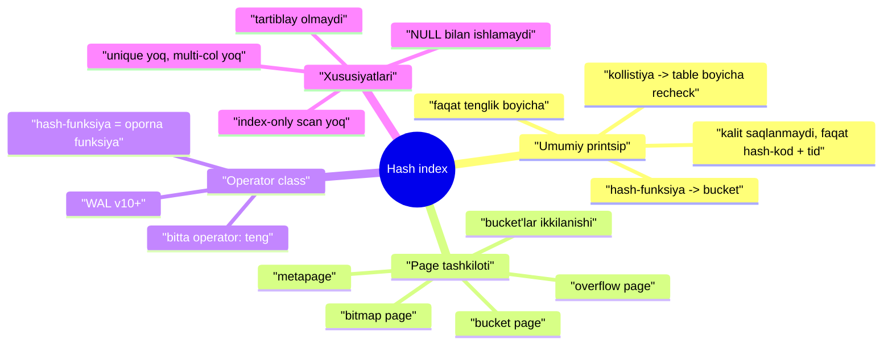
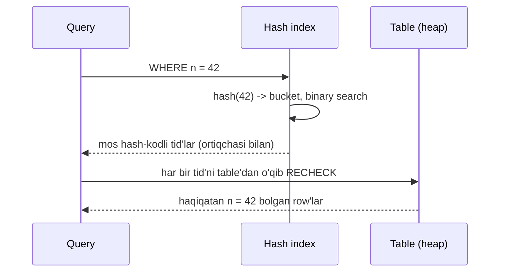
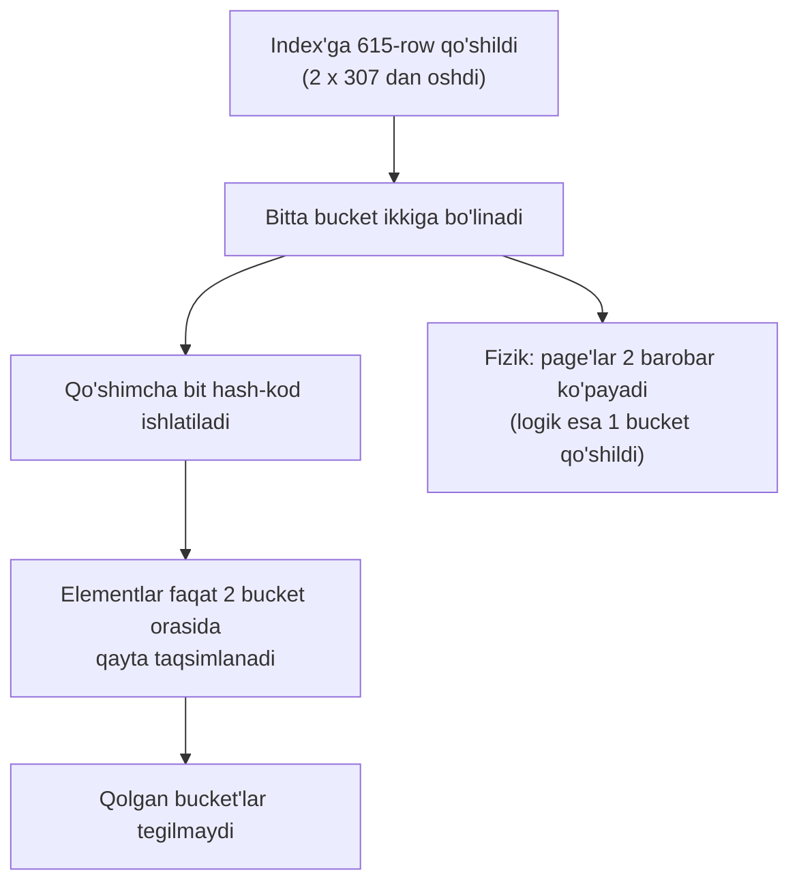

# 24. Hash index

> 📖 Manba: Рогов, "PostgreSQL 17 изнутри", 24-bob ("Хеш-индекс")

## Nima uchun kerak?

Shu darsdan boshlab kitobning **V qismi** — turli **index** turlari boshlanadi. Oldingi darslarda index'larga umumiy tarzda qaragan edik: index access method nima (19-dars), Index Scan va Bitmap Scan qanday ishlaydi (20-dars). Endi esa har bir index turini alohida, ichidan ko'ramiz — qanday tuzilgan, qanday qidiradi, qanday holatda foydali.

Birinchi va eng oddiy tur — **hash index**. Uni tushunish oson, chunki asosini biz allaqachon ko'rganmiz: **hashing** (22-dars). Xotira ichidagi hash-table hash join va group by uchun ishlatilar edi. Hash index — xuddi o'sha g'oya, faqat **disk'da doimiy saqlanadigan** hash-table.

Hash index bitta narsani juda tez qiladi: **tenglik bo'yicha qidiruv** (`column = value`). Boshqa hech narsani — na `<`, na `>`, na `ORDER BY`, na diapazon. Shuning uchun u tor ixtisoslashgan vosita: kalit qiymati katta (masalan uzun matn) bo'lib, faqat aniq tenglik bo'yicha qidiradigan holatlarda foydali. Aksariyat vaziyatda esa universalroq **B-tree** ishlatiladi (25-dars).



---

## 1-qism. Umumiy printsip

### Asosiy g'oya

Hash index kalit qiymati bo'yicha row versiyasi identifikatorini (**tid** — tuple identifier, ya'ni row versiyasi qaysi page'da, qaysi pozitsiyada joylashganini ko'rsatuvchi manzil) tez topib beradi. Birinchi yaqinlashishda bu shunchaki **disk'da saqlanadigan hash-table**.

> Hash index qo'llab-quvvatlaydigan **yagona** operatsiya — **tenglik bo'yicha qidiruv** (`indekslangan-ustun = ifoda`).

### Insert qanday ishlaydi

Index'ga yozuv qo'shilganda quyidagilar bo'ladi:


Diqqat qiladigan nozik nuqta: **kalitning o'zi index'da saqlanmaydi**. Bucket'ga faqat ikki narsa yoziladi — row versiyasining **tid**'i va kalitning **hash-kod**i. Sabab — realizatsiyaga qat'iy o'lchamli, kichik qiymatlar bilan ishlash qulayroq. Uzun matnli kalit bo'lsa ham, index'da faqat 4 baytli hash-kod yotadi.

### Search qanday ishlaydi

Qidiruvda ham xuddi shu hash-funksiya hisoblanadi va bucket raqami aniqlanadi. Bucket ichidan **hamma emas**, faqat hash-kodi mos keladigan tid'lar qaytariladi. Bucket ichidagi elementlar hash-kod bo'yicha **tartiblangani** uchun kerakli tid'lar **binary search** (ikkilik qidiruv) bilan tez topiladi.

### Hash-kollistiya va recheck

Mana eng muhim nozik nuqta. Index'da kalitning o'zi yo'q — faqat hash-kodi. Turli kalitlar bir xil hash-kodga ega bo'lishi mumkin (bu **hash-kollistiya** deyiladi). Shu sabab index metodi **ortiqcha** tid'larni ham qaytarishi mumkin.

Shuning uchun indekslash mexanizmi metoddan olingan **hamma natijani table bo'yicha qayta tekshiradi** (recheck — 19-darsda ko'rgan mexanizm). Aynan shu sababdan hash index'da **faqat index bo'yicha skanlash** (Index Only Scan) mumkin emas: kalit index'da saqlanmagani uchun javobni table'siz qaytarib bo'lmaydi.



---

## 2-qism. Page tashkiloti

Oddiy (xotiradagi) hash-table'dan farqli o'laroq, index **disk'da** saqlanadi. Demak butun kerakli ma'lumot page'larga taqsimlanishi kerak, hamda har bir operatsiya (qidiruv, insert, delete) iloji boricha **kamroq page**'ga murojaat qilsin.

Hash index to'rt xil page ishlatadi:

| Page turi | Vazifasi |
|-----------|----------|
| **metapage** (metastranica) | 0-page, index "mundarijasi" — barcha boshqaruv ma'lumoti |
| **bucket page** | asosiy page'lar, har bucket'ga bittadan |
| **overflow page** | bucket asosiy page'ga sig'magan elementlar uchun qo'shimcha page |
| **bitmap page** | qaysi overflow page'lar bo'shab, qayta ishlatishga tayyor ekanini belgilovchi bitlar massivi |

### Eksperiment: bo'sh index

Index page'lari ichiga **pageinspect** extension'i orqali qaraymiz. Bo'sh table'dan boshlaymiz:

```sql
=> CREATE EXTENSION pageinspect;
=> CREATE TABLE t(n integer);
=> ANALYZE t;
=> CREATE INDEX ON t USING hash(n);
```

> **Nozik nuqta:** table ataylab `ANALYZE` qilindi — shunda index **minimal o'lchamda** yaratiladi. Aks holda bucket'lar soni 10 page'li table hisobiga tanlanardi.

Hozir index'da to'rtta page bor: metapage, ikkita asosiy bucket page va bitta bitmap page (u darhol "zaxira uchun" yaratiladi):

```sql
=> SELECT page, hash_page_type(get_raw_page('t_n_idx', page))
   FROM generate_series(0,3) page;
 page | hash_page_type
------+----------------
    0 | metapage
    1 | bucket
    2 | bucket
    3 | bitmap
(4 rows)
```

Metapage'da index haqidagi barcha boshqaruv ma'lumoti yotadi. Hozircha bizni bir necha qiymat qiziqtiradi:

```sql
=> SELECT ntuples, ffactor, maxbucket
   FROM hash_metapage_info(get_raw_page('t_n_idx', 0));
 ntuples | ffactor | maxbucket
---------+---------+-----------
       0 |     307 |         1
(1 row)
```

- `ntuples` — index'dagi elementlar soni (hozir **0**, index bo'sh);
- `ffactor` — bitta bucket'ga to'g'ri keladigan **taxminiy** row soni (bu yerda 307). U blok sig'imi va `fillfactor` storage parametridan hisoblanadi;
- `maxbucket` — eng katta bucket raqami (1 bo'lsa, bucket'lar 0 va 1 — jami ikkita).

> **`ffactor` haqida.** Ma'lumot mukammal tekis taqsimlangan va kollistiya bo'lmaganda `fillfactor`'ni oshirsa ham bo'lardi. Lekin real hayotda bu bitta bucket elementlari bir page'ga **sig'may qolishi** ehtimolini oshiradi.

> **Hash index uchun eng yomon holat** — ma'lumot taqsimotidagi kuchli qiyshiqlik: bitta kalit ko'p marta takrorlansa. Hash-funksiya har safar bir xil qiymat berib, hamma ma'lumot **bitta bucket**'ga tushadi, va bucket'lar sonini oshirish hech nima bermaydi.

### Overflow page paydo bo'lishi

Endi bitta bucket page'ni to'ldirib ko'ramiz — bir xil qiymatli 500 ta row qo'shamiz. Index'da **overflow page** paydo bo'ladi:

```sql
=> INSERT INTO t(n)
   SELECT 0 FROM generate_series(1,500); -- bitta qiymat
=> SELECT page, hash_page_type(get_raw_page('t_n_idx', page))
   FROM generate_series(0,4) page;
 page | hash_page_type
------+----------------
    0 | metapage
    1 | bucket
    2 | bucket
    3 | bitmap
    4 | overflow
(5 rows)
```

Page bo'yicha statistika: bucket 0 bo'sh, hamma qiymat bucket 1'ga tushdi — bir qismi asosiy page'ga, sig'magani esa overflow page'ga:

```sql
=> SELECT page, live_items, free_size, hasho_bucket
   FROM (VALUES (1), (2), (4)) p(page),
        hash_page_stats(get_raw_page('t_n_idx', page));
 page | live_items | free_size | hasho_bucket
------+------------+-----------+--------------
    1 |          0 |      8148 |            0
    2 |        407 |         8 |            1
    4 |         93 |      6288 |            1
(3 rows)
```

Ko'rinib turibdi: bitta bucket elementlarining bir necha page'ga tarqalishi **unumdorlikka yomon ta'sir** qiladi. Hash index eng yaxshi natijani **tekis taqsimlangan** ma'lumotda beradi.

### Bucket'lar ikkilanishi (split)

Endi bucket qanday **ikkiga bo'linishini** ko'ramiz. Bu index'dagi row'lar soni mavjud bucket'lar uchun hisoblangan `ffactor`'dan oshganda sodir bo'ladi. Bizda ikki bucket va `ffactor = 307` — demak bu **615-row** qo'shilganda yuz beradi (2 × 307 = 614):

```sql
=> INSERT INTO t(n)
   SELECT n FROM generate_series(1,115) n; -- endi har xil qiymatlar
=> SELECT ntuples, ffactor, maxbucket, ovflpoint
   FROM hash_metapage_info(get_raw_page('t_n_idx', 0));
 ntuples | ffactor | maxbucket | ovflpoint
---------+---------+-----------+-----------
     615 |     307 |         2 |         2
(1 row)
```

`maxbucket` 2 ga oshdi: endi 0, 1, 2 raqamli **uchta** bucket bor. Lekin faqat bitta bucket qo'shilgan bo'lsa-da, page'lar soni **ikki barobar** oshadi:

```sql
=> SELECT page, hash_page_type(get_raw_page('t_n_idx', page))
   FROM generate_series(0,6) page;
 page | hash_page_type
------+----------------
    0 | metapage
    1 | bucket
    2 | bucket
    3 | bitmap
    4 | overflow
    5 | bucket
    6 | unused
(7 rows)
```

Yangi page'lardan biri bucket 2 uchun ishlatildi, ikkinchisi hozircha **bo'sh** — bucket 3 paydo bo'lganda ishlatiladi.



Muhim xulosa: operatsion tizim nuqtai nazaridan hash index o'lchami **sakrab-sakrab** o'sadi (page'lar ikkilanadi), garchi mantiqan hash-table **asta-sekin** kattalashsa ham. Bu sakrashni yumshatish uchun **10-ikkilanishdan boshlab** page'lar birdan emas, **1/4** qismdan bo'lib ajratiladi.

### Bucket manzillash: highmask va lowmask

Metapage'dagi yana ikki maydon — bit-maskalar — bucket manzillash tafsilotini ochadi:

```sql
=> SELECT maxbucket, highmask::bit(4), lowmask::bit(4)
   FROM hash_metapage_info(get_raw_page('t_n_idx', 0));
 maxbucket | highmask | lowmask
-----------+----------+---------
         2 |     0011 |    0001
(1 row)
```

Bucket raqami hash-kodning `highmask`'ga mos bitlaridan aniqlanadi. Ammo olingan bucket raqami **mavjud bo'lmasa** (`maxbucket`'dan oshsa), `lowmask`'ga mos bitlar olinadi. Bu holda ikki kichik bit olinadi — bu 0..3 qiymat beradi; agar 3 chiqsa, faqat bitta kichik bit olamiz, ya'ni 3-bucket o'rniga 1-bucket ishlatiladi.

Metapage yana `spares` massivini (har fragmentga qo'shilgan page soni) va bitmap page'larga havolalarni (`mapp`) saqlaydi — bular bucket raqamidan uning asosiy page raqamini hisoblashga yordam beradi.

### Index kichraya olmaydi

Index ichidagi joy o'lik row versiyalariga havolalar o'chirilganda bo'shaydi — page ichidagi tozalashda (5-dars) yoki oddiy VACUUM'da (6-dars). Lekin:

> Hash index **o'lchamda kichraya olmaydi**: bir marta ajratilgan page'lar operatsion tizimga qaytmaydi. Asosiy page'lar har doim o'z bucket'i uchun band bo'lib qoladi (bo'sh bo'lsa ham); bo'shagan overflow page'lar esa bitmap'da belgilanib, qayta ishlatiladi. Fizik o'lchamni kamaytirishning yagona yo'li — `REINDEX` (8-dars) yoki `VACUUM FULL`.

### Query rejasida index turi ko'rinmaydi

So'rov rejasida index turi alohida belgilanmaydi. Hash index bo'yicha qidiruv **Bitmap Heap Scan** ko'rinishida chiqadi — Recheck sharti bilan (kollistiya sababli qayta tekshiruv):

```sql
=> CREATE INDEX ON flights USING hash(flight_no);
=> EXPLAIN (costs off)
   SELECT * FROM flights WHERE flight_no = 'PG0001';
                       QUERY PLAN
--------------------------------------------------------
 Bitmap Heap Scan on flights
   Recheck Cond: (flight_no = 'PG0001'::bpchar)
   ->  Bitmap Index Scan on flights_flight_no_idx
         Index Cond: (flight_no = 'PG0001'::bpchar)
(4 rows)
```

---

## 3-qism. Operator class

### Nega hash-funksiya alohida saqlanadi?

PostgreSQL 10 versiyasigacha hash index'lar **WAL'ga yozilmasdi** (10-dars) — ya'ni nosozlikdan himoyalanmagan va replikatsiya qilinmasdi, shu sabab ishlatish tavsiya etilmasdi. Lekin ular shunda ham qadrli edi.

Gap shundaki, hashing algoritmi juda keng qo'llaniladi — jumladan hash join va grouping'da (22-dars). Tizim **har bir data turi uchun qaysi hash-funksiya** mo'ljallanganini bilishi kerak. Bu moslik **statik emas**: uni bir marta belgilab qo'yib bo'lmaydi, chunki PostgreSQL yangi data turlarini **ish jarayonida** qo'shishga ruxsat beradi.

> Shuning uchun "data turi ↔ hash-funksiya" mosligi **operator class** orqali ta'minlanadi. Hash-funksiyaning o'zi — operator class'ning **oporna (support) funksiyasi**.

Har bir turga qaysi hash-funksiya biriktirilganini ko'rish mumkin (oporna funksiya raqami `amprocnum = 1`):

```sql
=> SELECT opfname AS opfamily_name,
          amproc::regproc AS opfamily_procedure
   FROM pg_am am
   JOIN pg_opfamily opf ON opfmethod = am.oid
   JOIN pg_amproc amproc ON amprocfamily = opf.oid
   WHERE amname = 'hash' AND amprocnum = 1
   ORDER BY opfamily_name, opfamily_procedure;
   opfamily_name    | opfamily_procedure
--------------------+--------------------
 aclitem_ops        | hash_aclitem
 array_ops          | hash_array
 bool_ops           | hashchar
 bpchar_ops         | hashbpchar
 ...
 uuid_ops           | uuid_hash
 xid_ops            | hashint4
(38 rows)
```

Bu funksiyalar 32-bitli butun son qaytaradi. Ular hujjatlashtirilmagan bo'lsa-da, tegishli turdagi qiymatning hash-kodini hisoblash uchun ishlatsa bo'ladi. Masalan `text_ops` oilasi uchun `hashtext`:

```sql
=> SELECT hashtext('raz'), hashtext('ikki');
 hashtext  | hashtext
-----------+-----------
 127722028 | 345620034
(1 row)
```

### Bitta operator — "teng"

Hash index'ning operator class'iga **bitta operator** kiradi — «teng» (`=`). Odatda aynan u qiymatlarni tenglikka tekshiruvchi tizim tekshiruvlarida ishlatiladi:

```sql
=> SELECT opfname AS opfamily_name,
          left(amopopr::regoperator::text, 20) AS opfamily_operator
   FROM pg_am am
   JOIN pg_opfamily opf ON opfmethod = am.oid
   JOIN pg_amop amop ON amopfamily = opf.oid
   WHERE amname = 'hash'
   ORDER BY opfamily_name, opfamily_operator;
   opfamily_name    | opfamily_operator
--------------------+----------------------
 aclitem_ops        | =(aclitem,aclitem)
 array_ops          | =(anyarray,anyarray)
 bool_ops           | =(boolean,boolean)
 ...
 xid_ops            | =(xid,xid)
(48 rows)
```

---

## 4-qism. Xususiyatlari

Hash index access method o'zi haqida tizimga qanday xususiyatlar (properties) aytishini ko'ramiz.

### Access method xususiyatlari

```sql
=> SELECT a.amname, p.name, pg_indexam_has_property(a.oid, p.name)
   FROM pg_am a, unnest(array[
     'can_order', 'can_unique', 'can_multi_col',
     'can_exclude', 'can_include'
   ]) p(name)
   WHERE a.amname = 'hash';
 amname |     name      | pg_indexam_has_property
--------+---------------+-------------------------
 hash   | can_order     | f
 hash   | can_unique    | f
 hash   | can_multi_col | f
 hash   | can_exclude   | t
 hash   | can_include   | f
(5 rows)
```

- `can_order = f` — hash index row'larni **tartiblay olmaydi**: hash-funksiya ma'lumotni tasodifiy tartibda aralashtiradi.
- `can_unique = f` — **unique** cheklovi qo'llab-quvvatlanmaydi.
- `can_multi_col = f` — **ko'p ustunli** hash index bo'lmaydi.
- `can_include = f` — qo'shimcha `INCLUDE` ustunlarini qo'shib bo'lmaydi.
- `can_exclude = t` — **exclude** cheklovini qo'llab-quvvatlaydi. Yagona funksiya «teng» bo'lgani uchun exclude aslida **uniqueness** ma'nosini oladi:

```sql
=> ALTER TABLE aircrafts_data
   ADD CONSTRAINT unique_range EXCLUDE USING hash(range WITH =);
=> INSERT INTO aircrafts_data
   VALUES ('744','{"ru": "..."}',11100);
ERROR:  conflicting key value violates exclusion constraint "unique_range"
DETAIL:  Key (range)=(11100) conflicts with existing key (range)=(11100).
```

### Index xususiyatlari

```sql
=> SELECT p.name, pg_index_has_property('flights_flight_no_idx', p.name)
   FROM unnest(array[
     'clusterable', 'index_scan', 'bitmap_scan', 'backward_scan'
   ]) p(name);
     name      | pg_index_has_property
---------------+-----------------------
 clusterable   | f
 index_scan    | t
 bitmap_scan   | t
 backward_scan | t
(4 rows)
```

Hash index oddiy Index Scan bilan ham, Bitmap Scan bilan ham ishlaydi (20-dars). Lekin `clusterable = f` — table'ni hash index bo'yicha **klasterlash** mumkin emas. Bu mantiqan to'g'ri: table'dagi ma'lumotni hash-funksiya qiymati bo'yicha fizik tartiblashning ma'nosi yo'q.

### Ustun xususiyatlari

```sql
=> SELECT p.name,
          pg_index_column_has_property('flights_flight_no_idx', 1, p.name)
   FROM unnest(array[
     'asc', 'desc', 'nulls_first', 'nulls_last', 'orderable',
     'distance_orderable', 'returnable', 'search_array', 'search_nulls'
   ]) p(name);
        name        | pg_index_column_has_property
--------------------+------------------------------
 asc                | f
 desc               | f
 nulls_first        | f
 nulls_last         | f
 orderable          | f
 distance_orderable | f
 returnable         | f
 search_array       | f
 search_nulls       | f
(9 rows)
```

Hamma xususiyat `f`. Sabablari:

- hash-funksiya **tartibni saqlamaydi** — shu sabab tartiblash bilan bog'liq hamma xususiyat yo'q;
- `returnable = f` — hash index **Index Only Scan**'da qatnasha olmaydi, chunki kalit index'da saqlanmaydi va table bo'yicha recheck talab qilinadi;
- hash index **NULL bilan ishlamaydi**: «teng» operatsiyasi NULL uchun ma'noga ega emas;
- massivdan qiymatlarni qidirish (`search_array`) amalga oshirilmagan.

### Hash index vs B-tree — qachon qaysi biri?

| Xususiyat | Hash index | B-tree |
|-----------|:----------:|:------:|
| Tenglik (`=`) qidiruvi | ha | ha |
| Diapazon / `<` `>` | **yo'q** | ha |
| `ORDER BY` (tartiblash) | **yo'q** | ha |
| Unique cheklov | **yo'q** | ha |
| Ko'p ustunli (composite) | **yo'q** | ha |
| Index Only Scan | **yo'q** | ha |
| Katta kalitda o'lcham | **ixcham** (faqat hash-kod) | kalitni to'liq saqlaydi |

> **Amaliy xulosa.** Hash index'ning yagona real afzalligi — kalit **katta** bo'lganda index **ixchamroq** bo'lishi (faqat 4 baytli hash-kod saqlanadi). Lekin u faqat tenglik bilan ishlaydi va ancha cheklangan. Shu sabab amalda deyarli har doim **B-tree** tanlanadi — u tenglikni ham xuddi shunday tez qiladi, ustiga ko'p qo'shimcha imkoniyat beradi.

---

## Xulosa

- **Hash index** — disk'da saqlanadigan hash-table. Yagona operatsiyasi — **tenglik bo'yicha qidiruv** (`=`).
- Insert'da kalitning hash-kodi hisoblanadi, kichik bitlar **bucket** raqamini beradi. Bucket'ga faqat **tid + hash-kod** yoziladi — **kalitning o'zi saqlanmaydi**.
- Kalit saqlanmagani uchun kollistiya bo'lishi mumkin: metod ortiqcha tid qaytaradi, shuning uchun natija **table bo'yicha recheck** qilinadi. Aynan shu sabab **Index Only Scan yo'q**.
- To'rt xil page: **metapage** (boshqaruv), **bucket page** (asosiy), **overflow page** (sig'magan elementlar), **bitmap page** (bo'sh overflow page'lar hisobi).
- Row'lar `ffactor × bucket_soni`'dan oshganda bitta bucket **ikkiga bo'linadi**. Logik o'sish asta-sekin, fizik esa **sakrab** (page'lar ikkilanadi).
- Bucket manzillash `highmask`/`lowmask` bit-maskalari bilan aniqlanadi.
- Hash index **kichraya olmaydi** — page'lar OT'ga qaytmaydi; kichraytirish uchun `REINDEX` yoki `VACUUM FULL` kerak.
- "Data turi ↔ hash-funksiya" mosligi **operator class** orqali beriladi (yangi turlar ish jarayonida qo'shilishi mumkin). Class'da bitta operator — «teng».
- v10'dan hash index **WAL bilan himoyalangan**; shundan avval ishlatish tavsiya etilmasdi.
- Hash index tartiblay olmaydi, unique/multi-col/include qo'llab-quvvatlamaydi, NULL bilan ishlamaydi. Amalda deyarli har doim **B-tree** afzal.

## Nazorat savollari

1. Nega hash index'da kalitning o'zi saqlanmaydi, balki faqat hash-kod saqlanadi? Bu qaror qanday cheklovga (masalan Index Only Scan yo'qligiga) olib keladi?
2. Hash-kollistiya nima va nega uning tufayli PostgreSQL natijani **table bo'yicha recheck** qiladi?
3. Hash index'ning to'rtta page turini sanang va har birining vazifasini ayting. Overflow page qachon paydo bo'ladi?
4. Bucket qachon ikkiga bo'linadi? Nega bunda page'lar soni bitta emas, **ikki barobar** oshadi?
5. Bitta kalit ma'lumotda ko'p marta takrorlansa, hash index nega yomon ishlaydi? Bucket'lar sonini oshirish yordam beradimi?
6. Nega hash index o'lchamda kichraya olmaydi? Uni kichraytirishning qanday yo'llari bor?
7. Nima uchun hash-funksiya operator class'ning oporna funksiyasi sifatida saqlanadi, tizimga qattiq (statik) biriktirilgan emas?
8. Hash index va B-tree'ni tenglik qidiruvi bo'yicha solishtiring. Qaysi bitta holatda hash index B-tree'dan afzalroq bo'lishi mumkin va nega amalda baribir ko'pincha B-tree tanlanadi?
