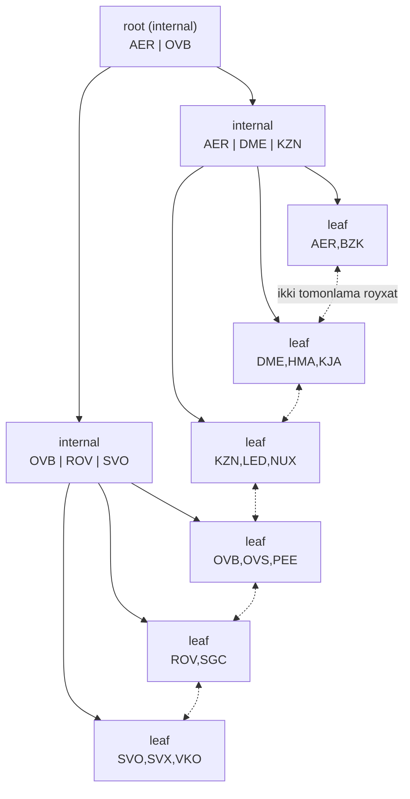
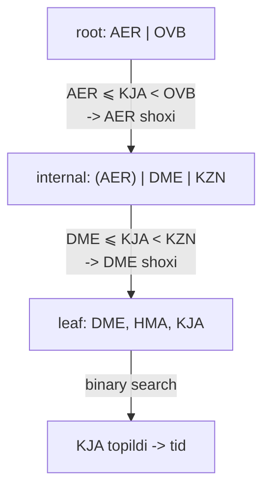
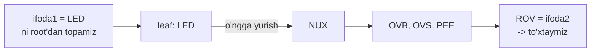
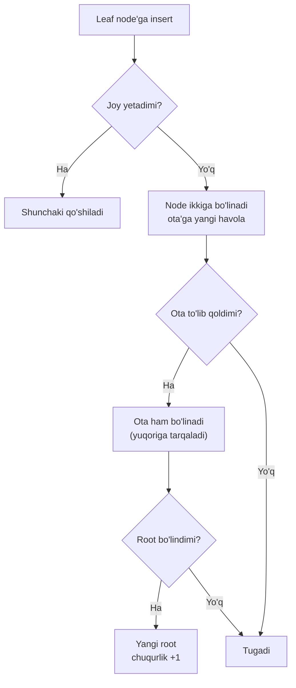
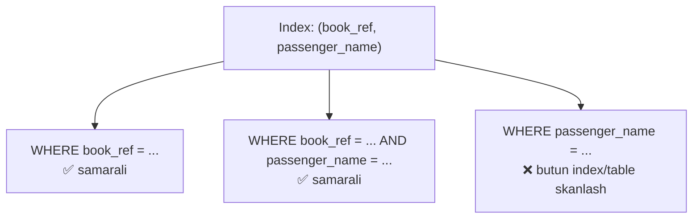

# 25. B-tree

> 📖 Manba: Рогов, "PostgreSQL 17 изнутри", 25-bob ("B-дерево")

## Nima uchun kerak?

O'tgan darsda **hash index**'ni ko'rdik — u tez, lekin faqat bitta ishni qiladi: tenglik (`=`) bo'yicha qidirish. Na diapazon, na tartiblash, na composite index. Real hayotdagi so'rovlarning aksariyati esa aynan shularni talab qiladi: `WHERE price > 100`, `ORDER BY created_at`, `WHERE date BETWEEN ... AND ...`.

Mana shu barcha vazifalarni **B-tree** (access method `btree`) bajaradi. Bu — PostgreSQL'da **eng ko'p ishlatiladigan** index turi. `PRIMARY KEY`, `UNIQUE`, oddiy `CREATE INDEX` — hammasi default holda B-tree quradi. Uni yaxshi bilish — kundalik amaliyot uchun eng foydali bilim.

B-tree tenglikni ham hash index kabi tez qiladi, ustiga:
- **tengsizlik** va **diapazon** qidiruvi (`<`, `>`, `BETWEEN`);
- **tartiblangan** natija (`ORDER BY` index bilan bajariladi);
- **composite** (ko'p ustunli) index — lekin bu yerda ustunlar tartibi kritik muhim;
- **Index Only Scan** — javobni table'siz qaytarish.

Bu dars ayniqsa **amaliy** bo'ladi: qanday composite index tuzish va **qaysi so'rov qaysi index'dan foydalana oladi** — buni misollar bilan chuqur ko'ramiz.

```mermaid
mindmap
  root(("B-tree"))
    "Printsip"
      "balanced: barcha leaf bir chuqurlikda"
      "bushy: har node ko'p element"
      "leaf'lar ikki tomonlama royxatda"
      "tartiblangan"
    "Qidiruv"
      "tenglik: root'dan leaf'ga"
      "tengsizlik: leaf boylab yurish"
      "diapazon: expr1'dan expr2'gacha"
    "Insert / split"
      "page tolsa ikkiga bolinadi"
      "yuqoriga tarqaladi"
      "root split -> chuqurlik +1"
    "Page tashkiloti"
      "metapage: root, level"
      "high key (verhniy klyuch)"
      "deduplication v13"
      "suffix truncation v12"
    "Composite index"
      "ustunlar tartibi muhim"
      "prefiks boyicha qidiruv"
      "ASC/DESC va ORDER BY"
```

---

## 1-qism. Umumiy printsip

**B-tree** — daraxt ildizidan (root) barglarigacha (leaf) tushib, kerakli elementni tez topishga imkon beruvchi ma'lumot strukturasi. Qidiruv yo'li aniq bo'lishi uchun daraxt elementlari **tartiblangan** bo'lishi kerak. Shuning uchun B-tree **tartib turlaridagi** (solishtirilib, saralanadigan) data uchun mo'ljallangan.

Daraxtning har bir node'i (uzeli) bir necha **element**dan iborat: har element **indekslash kaliti** + **havola**dan tuzilgan. **Internal** (ichki) node elementlari keyingi darajadagi node'ga havola qiladi, **leaf** (barg) node elementlari esa table row versiyalariga.



B-tree'ning muhim xususiyatlari:

- **Balanced (muvozanatli):** barcha leaf'lar **bir xil chuqurlikda**. Shuning uchun istalgan qiymatni qidirish **bir xil vaqt** oladi.
- **Bushy (shoxlangan):** har node ko'p element saqlaydi — ko'pincha **yuzlab** (rasmda ko'rgazma uchun atigi 3 tadan). Shu sabab juda katta table'da ham daraxt **chuqurligi kichik** qoladi.
- **Tartiblangan:** ma'lumot node'lar orasida ham, har node ichida ham o'sish (yoki kamayish) bo'yicha tartiblangan. Bir darajadagi node'lar **ikki tomonlama ro'yxat** bilan bog'langan — shuning uchun tartiblangan to'plamni har safar root'dan yo'l takrorlamasdan, ro'yxat bo'ylab yurib olish mumkin.

> **"B" harfi nimani anglatadi?** Aniq ma'lum emas. `balanced` (muvozanatli) ham, `bushy` (shoxlangan) ham mos keladi. Lekin ko'p uchraydigan `binary` (ikkilik) talqini **noto'g'ri** — B-tree ikkilik daraxt emas, har node'da yuzlab element bo'ladi.

---

## 2-qism. Qidiruv va insert

### Tenglik bo'yicha qidiruv

`indekslangan-ustun = ifoda` shartli qidiruvni ko'ramiz. Aytaylik, bizni KJA (Krasnoyarsk) aeroporti qiziqtiradi.

Qidiruv root node'dan boshlanadi. Metod qaysi bola (child) node'ga tushishni aniqlashi kerak: shunday Kᵢ kalit tanlanadiki, `Kᵢ ⩽ ifoda < Kᵢ₊₁` shart bajarilsin.



- **Root**'da AER va OVB kalitlari bor. `AER ⩽ KJA < OVB` bajariladi, demak AER kaliti havola qilgan bola node'ga tushamiz.
- Xuddi shu jarayon **rekursiv** takrorlanadi: bola node'da `DME ⩽ KJA < KZN` bajariladi, shuning uchun DME havola qilgan **leaf** node'ga tushamiz.
- Leaf node ichida kerakli element oddiy **binary search** bilan tez topiladi.

> **Nozik nuqta — ortiqcha chap kalit.** Internal node'da eng chap kalit **ortiqcha**: root'ning bolasini tanlash uchun `KJA < OVB` sharti yetarli. Shu sabab bunday kalitlar B-tree'da **saqlanmaydi** (keyingi bo'limlarda bo'sh element sifatida ko'rasiz).

Amalda qidiruv ko'ringanidan murakkabroq: qiymatlar kamayish bo'yicha ham tartiblangan bo'lishi mumkin; unique index'da ham bir necha mos qiymat chiqishi mumkin (row versiyasi identifikatori kalitning bir qismi — v12'dan), va bir xil qiymatlar shu qadar ko'p bo'lsaki, ular bir node'ga sig'may, qidiruv qo'shni leaf page'da davom etishi kerak. Bundan tashqari qidiruv paytida boshqa jarayonlar ma'lumotni o'zgartirishi, page'lar bo'linishi mumkin — algoritmlar shu bir vaqtdagi harakatlar bir-biriga xalaqit bermasligi uchun qurilgan.

### Tengsizlik bo'yicha qidiruv

`indekslangan-ustun ⩽ ifoda` (yoki `⩾`) sharti bo'yicha qidiruvda avval tenglik bo'yicha qiymatni topamiz, keyin leaf node'lar bo'ylab kerakli **tomonga oxirigacha** yuramiz. `<` va `>` operatorlari uchun ham xuddi shunday, faqat dastlab topilgan qiymatning o'zini chiqarib tashlash kerak.

### Diapazon bo'yicha qidiruv

`ifoda1 ⩽ indekslangan-ustun ⩽ ifoda2` diapazon qidiruvida avval `ifoda1`'ni topamiz, keyin leaf node'lar bo'ylab **o'ngga** yuramiz — `ifoda2`'ga yetguncha. Aynan shu yerda leaf'larni bog'lagan ikki tomonlama ro'yxat ish beradi: root'ga qaytmasdan, diapazonni bir tekis o'qib olamiz.



### Insert va page split

Leaf node'da yangi element o'rni kalitlar tartibi bilan aniq belgilanadi. Masalan RTW (Saratov) qo'shilsa, u ROV va SGC orasiga tushadi.

Lekin leaf node'da yangi element uchun **joy yetmasligi** mumkin. Bunday holda node **ikkiga bo'linadi** (split): eski node elementlarining bir qismi yangisiga ko'chiriladi, ota (parent) node'ga esa yangi bolaga havola qo'shiladi. Albatta, ota node ham to'lib qolishi mumkin — u ham bo'linadi, va hokazo. Agar bo'linish **root'gacha** yetsa, hosil bo'lgan node'lar ustiga yana bitta node qo'shiladi — u **yangi root** bo'ladi va daraxt chuqurligi **bittaga oshadi**.



> **PostgreSQL cheklovi.** Bo'lingan node'lar **hech qachon qayta birlashmaydi**, hatto tozalashdan keyin ularda kam element qolsa ham. Bu — B-tree strukturasining emas, PostgreSQL realizatsiyasining cheklovi. Shuning uchun insert paytida node to'lib qolsa, metod avval node'ni **ortiqcha ma'lumotdan tozalashga** (page ichi tozalash, 5-dars) harakat qiladi — joy bo'shatib, ortiqcha bo'linishning oldini oladi.

Bo'linish va insert protsedurasi daraxt **muvozanatini kafolatlaydi**. Node'da element soni odatda katta bo'lgani uchun qo'shimcha daraxt darajasi **kamdan-kam** o'sadi.

---

## 3-qism. Page tashkiloti

Har bir B-tree node **bitta page**'ni egallaydi. Page o'lchami node sig'imini belgilaydi.

Bo'linishlar tufayli turli momentlarda daraxt root'i **turli page**'lar bo'lishi mumkin. Qidiruv esa aynan root'dan boshlanishi kerak. Joriy root page raqamini index'ning **0-page**'idan (**metapage** deb ataladi) topadi. Metapage yana boshqa xizmat ma'lumotini ham saqlaydi.

### High key — yuqori kalit

Real page'lardagi ma'lumot yuqorida chizganimizdan biroz farq qiladi. **O'z darajasidagi eng o'ngdagidan boshqa** barcha page'lar qo'shimcha **high key** (yuqori kalit) saqlaydi — u page'dagi istalgan qiymatdan **kichik emas** deb kafolatlangan. Bu qidiruvda page chegarasini bilish uchun kerak.

Real index page'lariga **pageinspect** orqali qaraymiz — olti xonali bron raqamlari bo'yicha. Metapage'da bizni root page raqami va daraxtning maksimal darajasi qiziqtiradi (darajalar 0'dan, leaf'dan boshlab sanaladi):

```sql
=> SELECT root, level FROM bt_metap('bookings_pkey');
 root | level
------+-------
  290 |     2
(1 row)
```

Index yozuvlaridagi kalitlar bayt ketma-ketligi sifatida chiqadi, bu qulay emas. Shu sabab kitob dekodlash uchun yordamchi funksiya (`data_to_text`) yozadi. U bilan root page'ni ko'ramiz:

```sql
=> SELECT itemoffset, ctid, data_to_text(data)
   FROM bt_page_items('bookings_pkey',290);
 itemoffset |   ctid   | data_to_text
------------+----------+--------------
          1 | (3,0)    |
          2 | (289,1)  | 0C9AB1
          3 | (575,1)  | 192F03
        ...
         19 | (5135,1) | E2CB14
         20 | (5420,1) | EF6FEA
         21 | (5705,1) | FC147D
(21 rows)
```

Birinchi yozuv (aytganimizdek) kalit saqlamaydi — bu ortiqcha chap kalit. `ctid` ustuni bola page'larga havola qiladi.

Aytaylik, E2D725 raqamli bronni qidiryapmiz. 19-yozuvni tanlaymiz, chunki `E2CB14 ⩽ E2D725 < EF6FEA`, va 5135-page'ga tushamiz:

```sql
=> SELECT itemoffset, ctid, data_to_text(data)
   FROM bt_page_items('bookings_pkey',5135);
 itemoffset |   ctid   | data_to_text
------------+----------+--------------
          1 | (5417,1) | EF6FEA         <- high key
          2 | (5132,0) |
          3 | (5133,1) | E2D71D
          4 | (5134,1) | E2E2F4
        ...
(285 rows)
```

> Bu page'ning **birinchi yozuvi — high key** (kutilmaganda). Mantiqan u page oxirida bo'lishi kerak edi, lekin realizatsiya uchun uni **boshida** saqlash qulay — shunda page o'zgarganda uni har safar ko'chirish shart emas.

3-yozuvni tanlaymiz (`E2D71D ⩽ E2D725 < E2E2F4`), 5133-page'ga tushamiz — bu **leaf** page. Uning birinchi yozuvi ham high key, qolganlari esa table row versiyalariga havola qiladi:

```sql
=> SELECT * FROM bookings WHERE ctid = '(11919,77)';
 book_ref |       book_date        | total_amount
----------+------------------------+--------------
 E2D725   | 2017-01-25 04:10:00+03 |     28000.00
(1 row)
```

Bron kodi bo'yicha so'rov aynan shunday ishlaydi:

```sql
=> EXPLAIN (costs off) SELECT * FROM bookings WHERE book_ref = 'E2D725';
                 QUERY PLAN
-------------------------------------------
 Index Scan using bookings_pkey on bookings
   Index Cond: (book_ref = 'E2D725'::bpchar)
(2 rows)
```

### Deduplication — dublikatlarni ixcham saqlash (v13)

Non-unique index'da bir xil kalit ko'p marta uchrab, turli table row'larga havola qilishi mumkin. Takrorlanuvchi kalitlar ko'p joy egallaganidan, dublikatlar **bitta index yozuviga "yig'iladi"** — u kalit va table identifikatorlari ro'yxatidan iborat bo'ladi. Bu protsedura **deduplication** (dublikatlarni chiqarib tashlash) deb ataladi va ba'zan index o'lchamini sezilarli kamaytiradi.

> **Muhim:** unique index ham dublikat kalit saqlashi mumkin — ko'p versiyalilik (MVCC) sababli, chunki index barcha row versiyalariga havola saqlaydi. HOT-update (5-dars) bunga qisman yordam beradi, lekin har doim emas. Shunda deduplication table'ni tozalashgacha vaqt yutishga va ortiqcha page bo'linishlarini kamaytirishga yordam beradi.

Resurs behuda ketmasligi uchun "yig'ish" faqat leaf page'da **yangi row uchun joy yetmaganda** bajariladi. Deduplication'ni `deduplicate_items` storage parametri bilan o'chirib qo'yish mumkin.

Deduplication **hamma index uchun** ishlamaydi. Asosiy cheklov: kalitlar tengligi ichki tasvirning **oddiy ikkilik solishtiruvi** bilan tekshirilishi kerak. Bu hamma turga to'g'ri kelmaydi:

- `float`/`double precision` — nolning **ikki xil** tasviri bor;
- `numeric` — bir sonni turli masshtabda tasvirlash mumkin, `jsonb` shunday sonlardan foydalanadi;
- **nodeterministik** collation'li matn turlari — bir xil belgini turli bayt ketma-ketligi bilan tasvirlash mumkin (standart collation'lar deterministik);
- composite tur, diapazon, massiv, hamda `INCLUDE`-index'lar.

Index deduplication'ni qo'llab-quvvatlaydimi — metapage'ning `allequalimage` maydonidan ko'rish mumkin:

```sql
=> CREATE INDEX ON tickets(book_ref);
=> SELECT allequalimage FROM bt_metap('tickets_book_ref_idx');
 allequalimage
---------------
 t
(1 row)
```

Leaf page'da ba'zi yozuvlar bitta `htid` saqlaydi, ba'zilari esa identifikatorlar **ro'yxati** (`tids`) — aynan yig'ilgan dublikatlar:

```sql
=> SELECT itemoffset, htid, left(tids::text,27) tids, data_to_text(data) AS data
   FROM bt_page_items('tickets_book_ref_idx',1) WHERE itemoffset > 1;
 itemoffset |    htid     |            tids             |  data
------------+-------------+-----------------------------+--------
          2 | (32965,40)  |                             | 000004
          4 | (3648,56)   | {"(3648,56)","(3648,57)"}   | 000010
        ...
(272 rows)
```

### Suffix truncation — internal page'larda kalit qisqartirish (v12)

Deduplication leaf page'larga ko'proq yozuv joylashtiradi. Ammo ortiqcha bo'linishlarni oldini olishda **internal page'larni ixchamlash** ham muhim: index'ning asosiy hajmi leaf'larda bo'lsa-da, qidiruv samarasi bevosita daraxt **chuqurligiga** bog'liq.

Internal page yozuvlari indekslash kalitlarini saqlaydi, lekin ular faqat **qaysi poddaraxtga tushishni** aniqlash uchun ishlatiladi. Composite index'da buning uchun ko'pincha kalitning **birinchi atributi** (yoki bir necha birinchisi) yetarli. Qolgan atributlar tashlab yuborilishi mumkin — page'da joy egallamasin. Bu protsedura **suffix truncation** deb ataladi va leaf page bo'linib, internal page'ga yangi havola qo'shilganda bajariladi.

Bron raqami + yo'lovchi ismi bo'yicha index'ning root page'ida ba'zi yozuvlarda ikkinchi atribut yo'q:

```sql
=> SELECT itemoffset, ctid, data_to_text(data)
   FROM bt_page_items('tickets_bref_name_idx',229)
   WHERE itemoffset BETWEEN 8 AND 13;
 itemoffset |   ctid   |       data_to_text
------------+----------+---------------------------
          8 | (1607,1) | 1A98A0
          9 | (1833,2) | 1E57D1, SVETLANA MAKSIMOVA
         10 | (2054,1) | 220797
         12 | (2509,2) | 299FE4, YURIY AFANASEV
(6 rows)
```

Leaf page'da esa albatta barcha kalit atributlari (va `INCLUDE`-ustunlar) saqlanadi — aks holda Index Only Scan ishlamasdi.

---

## 4-qism. Operator class va composite index'lar

### Solishtirish semantikasi

Tizim qiymatlarni nafaqat hash qila olishi, balki **tartiblay** olishi kerak (tartiblash, group by, merge join uchun). Hashing'dagi kabi, "data turi ↔ solishtirish operatorlari" mosligi **operator class** orqali beriladi. Bu operator nomlariga (`<`, `>`, `=`) bog'lanmaslik va hatto bir turni bir necha xil tartiblash imkonini beradi.

`btree` metodining har bir operator class'ida **beshta** solishtirish operatori bo'lishi kerak — har biri bitta **strategiya**ga mos:

```sql
=> SELECT amopopr::regoperator AS opfamily_operator, amopstrategy
   FROM pg_am am
   JOIN pg_opfamily opf ON opfmethod = am.oid
   JOIN pg_amop amop ON amopfamily = opf.oid
   WHERE amname = 'btree' AND opfname = 'bool_ops'
   ORDER BY amopstrategy;
  opfamily_operator  | amopstrategy
---------------------+--------------
 <(boolean,boolean)  |            1
 <=(boolean,boolean) |            2
 =(boolean,boolean)  |            3
 >=(boolean,boolean) |            4
 >(boolean,boolean)  |            5
(5 rows)
```

Strategiyalar: 1 — kichik, 2 — kichik yoki teng, 3 — teng, 4 — katta yoki teng, 5 — katta. Class'ga yana **oporna funksiya** kiradi: u birinchi argument ikkinchisidan katta bo'lsa **+1**, kichik bo'lsa **−1**, teng bo'lsa **0** qaytaradi. Aynan shu funksiya B-tree tartiblashining "yuragi".

> **Collation (saralash qoidasi) muhim.** Matn turlari uchun solishtirish natijasi **collation**'ga bog'liq — bir xil belgilar turli tilda turlicha tartiblanadi. Deduplication faqat **deterministik** collation'da ishlaydi (bir belgi — bitta bayt ketma-ketligi). Nodeterministik collation'da bir xil belgini turli baytlar bilan yozish mumkin, shuning uchun ikkilik solishtiruv ishlamaydi.

### Ustunlar tartibi — composite index'ning eng muhim qoidasi

Endi darsning eng amaliy qismiga o'tamiz. Composite (ko'p ustunli) index'da **ustunlar qanday tartibda sanalgani nihoyatda muhim**, chunki page ichidagi ma'lumot avval **birinchi** ustun, keyin **ikkinchi** va hokazo bo'yicha tartiblanadi.

> **Oltin qoida:** composite index'da samarali qidiruv **eng birinchi ustundan boshlab uzluksiz ustunlar ketma-ketligi** bo'yicha mumkin: faqat 1-ustun; 1+2-ustun; 1+2+3-ustun va hokazo. Boshqa har qanday shart faqat **filtrlash** uchun ishlatiladi.

Buni tasavvur qilish uchun analogiya: telefon kitobi **familiya, keyin ism** bo'yicha tartiblangan. Familiya bilan (yoki familiya+ism bilan) odamni tez topasiz. Lekin **faqat ism** bilan qidirsangiz — butun kitobni varaqlashga to'g'ri keladi, chunki bir xil ismlilar hamma yerga tarqalgan.

`tickets` table'ida `(book_ref, passenger_name)` index tuzamiz. Uning leaf page'ida yozuvlar avval `book_ref`, so'ng `passenger_name` bo'yicha tartiblangan:

```sql
=> SELECT itemoffset, data_to_text(data)
   FROM bt_page_items('tickets_bref_name_idx',1) WHERE itemoffset > 1;
 itemoffset |       data_to_text
------------+---------------------------
          2 | 000004, PETR MAKAROV
          3 | 00000F, ANNA ANTONOVA
          4 | 000010, ALEKSANDR SOKOLOV
          5 | 000010, LYUDMILA BOGDANOVA
          6 | 000012, TAMARA ZAYCEVA
        ...
(192 rows)
```

**Qaysi so'rov bu index'dan foydalana oladi?** Ikki holat samarali:

```sql
-- 1) faqat birinchi ustun -> index ISHLAYDI
=> EXPLAIN (costs off) SELECT * FROM tickets WHERE book_ref = '000010';
                    QUERY PLAN
--------------------------------------------------
 Index Scan using tickets_book_ref_idx on tickets
   Index Cond: (book_ref = '000010'::bpchar)
(2 rows)

-- 2) birinchi + ikkinchi ustun -> index ISHLAYDI
=> EXPLAIN (costs off) SELECT * FROM tickets
   WHERE book_ref = '000010' AND passenger_name = 'LYUDMILA BOGDANOVA';
                    QUERY PLAN
--------------------------------------------------
 Index Scan using tickets_bref_name_idx on tickets
   Index Cond: ((book_ref = '000010') AND (passenger_name...
(2 rows)
```

Lekin **faqat ikkinchi ustun** bo'yicha qidirilsa — hamma row'larni ko'rib chiqishga to'g'ri keladi (Seq Scan):

```sql
=> EXPLAIN (costs off) SELECT * FROM tickets
   WHERE passenger_name = 'LYUDMILA BOGDANOVA';
                    QUERY PLAN
------------------------------------------------------
 Gather
   Workers Planned: 2
   ->  Parallel Seq Scan on tickets
         Filter: (passenger_name = 'LYUDMILA BOGDANOVA')
(4 rows)
```

Planner index scan tanlasa ham, **barcha** index yozuvlarini ko'rib chiqishga majbur bo'lardi — shart faqat filtr sifatida ishlatiladi (afsuski, reja buni ochiq ko'rsatmaydi).



> **Skip Scan hozircha yo'q.** Agar birinchi ustunda kam noyob qiymat (v1..vn) bo'lsa, teoriyada har poddaraxtda `col1 = vi AND col2 = qiymat` bo'yicha bir necha qidiruv o'tkazsa bo'lardi. Bunday usul **Skip Scan** deyiladi, lekin PostgreSQL'da **hali amalga oshirilmagan**.

### Ustunlar tartibini almashtirish

Agar ustunlarni teskari joylashtirsak — `(passenger_name, book_ref)` — endi **ism** bo'yicha (yoki ism+book_ref bo'yicha) qidiruv samarali bo'ladi:

```sql
=> CREATE INDEX tickets_name_bref_idx ON tickets(passenger_name, book_ref);
=> EXPLAIN (costs off) SELECT * FROM tickets
   WHERE passenger_name = 'LYUDMILA BOGDANOVA';
                    QUERY PLAN
--------------------------------------------------------
 Bitmap Heap Scan on tickets
   Recheck Cond: (passenger_name = 'LYUDMILA BOGDANOVA')
   ->  Bitmap Index Scan on tickets_name_bref_idx
         Index Cond: (passenger_name = 'LYUDMILA BOGDANOVA')
(4 rows)
```

> **Amaliy dizayn qoidasi.** Composite index tuzganda **eng ko'p filtrlaydigan / eng ko'p tenglik bilan qidiriladigan** ustunni birinchi qo'ying. Bitta so'rov bir necha shart ishlatsa, tenglik shartlaridagi ustunlar oldinga, diapazon shartidagi ustun oxiriga.

### ORDER BY va saralash tartibi (ASC/DESC)

Index'ni nafaqat qidiruv, balki `ORDER BY` uchun ham ishlatish mumkin — chunki B-tree ma'lumotni tartiblangan saqlaydi. Bunda **saralash yo'nalishi** (`ASC`/`DESC`) ham hisobga olinadi. Bitta ustunli index'da bu muhim emas (index'ni ikki tomonga skanlash mumkin), lekin **composite index'da tartib muhim**.

`(passenger_name, book_ref)` index quyidagilarni **saralashsiz** beradi — ikkala ustun bir xil yo'nalishda bo'lsa:

```sql
-- ikkalasi ASC -> to'g'ridan Index Scan
=> EXPLAIN (costs off) SELECT * FROM tickets
   ORDER BY passenger_name, book_ref;
 Index Scan using tickets_name_bref_idx on tickets

-- ikkalasi DESC -> teskari skanlash
=> EXPLAIN (costs off) SELECT * FROM tickets
   ORDER BY passenger_name DESC, book_ref DESC;
 Index Scan Backward using tickets_name_bref_idx on tickets
```

Lekin bitta ustun ASC, ikkinchisi DESC bo'lsa, index to'g'ri kelmaydi — natija **qo'shimcha saralanadi** (`Incremental Sort`: birinchi ustun index'dan tartibli kelgani uchun faqat ikkinchisi bo'yicha):

```sql
=> EXPLAIN (costs off) SELECT * FROM tickets
   ORDER BY passenger_name ASC, book_ref DESC;
              QUERY PLAN
-----------------------------------------------
 Incremental Sort
   Sort Key: passenger_name, book_ref DESC
   Presorted Key: passenger_name
   ->  Index Scan using tickets_name_bref_idx on tickets
(4 rows)
```

### NULL joylashuvi (NULLS FIRST / LAST)

Index'ni `ORDER BY` uchun ishlatishga **NULL joylashuvi** ham ta'sir qiladi. Default'da NULL oddiy qiymatlardan "katta" hisoblanadi — ASC saralashda o'ngda (oxirida), DESC'da chapda (boshida). Buni `NULLS FIRST`/`NULLS LAST` bilan o'zgartirish mumkin.

Agar so'rovdagi tartib mavjud index'ga mos kelmasa, natija qo'shimcha **`Sort`** bilan saralanadi. Lekin aynan kerakli tartibga mos index yaratsangiz, u ishlatiladi:

```sql
=> CREATE INDEX tickets_name_bref_idx2
   ON tickets(passenger_name NULLS FIRST, book_ref DESC);
=> EXPLAIN (costs off) SELECT * FROM tickets
   ORDER BY passenger_name NULLS FIRST, book_ref DESC;
 Index Scan using tickets_name_bref_idx2 on tickets
```

---

## 5-qism. Xususiyatlari

### Access method xususiyatlari

```sql
=> SELECT a.amname, p.name, pg_indexam_has_property(a.oid, p.name)
   FROM pg_am a, unnest(array[
     'can_order', 'can_unique', 'can_multi_col',
     'can_exclude', 'can_include'
   ]) p(name)
   WHERE a.amname = 'btree';
 amname |     name      | pg_indexam_has_property
--------+---------------+-------------------------
 btree  | can_order     | t
 btree  | can_unique    | t
 btree  | can_multi_col | t
 btree  | can_exclude   | t
 btree  | can_include   | t
(5 rows)
```

**Hammasi `t`** — B-tree yagona access method bo'lib, hamma xususiyatni beradi:

| Xususiyat | Hash (24-dars) | B-tree |
|-----------|:--------------:|:------:|
| `can_order` (tartiblash) | f | **t** |
| `can_unique` (unique) | f | **t** |
| `can_multi_col` (composite) | f | **t** |
| `can_exclude` (exclude) | t | t |
| `can_include` (INCLUDE) | f | **t** |

- **tartiblash** va **uniqueness** — buni faqat B-tree beradi;
- **composite** index — lekin ustunlar tartibiga qat'iy e'tibor kerak (4-qism);
- `exclude` cheklovi bor, lekin faqat `=` operatori bilan — bu unique bilan bir xil, shu sabab to'liq **UNIQUE** cheklov afzalroq;
- qidiruvda qatnashmaydigan qo'shimcha ustunlarni (`INCLUDE`) qo'shish mumkin.

> **Parallel qurish (v11).** Table yetarlicha katta bo'lsa, index **parallel** rejimda quriladi. Worker'lar soni parallel Seq Scan formulasi bilan aniqlanadi, lekin `max_parallel_maintenance_workers` bilan cheklanadi. Barcha worker'larga jami `maintenance_work_mem` (default **64MB**) xotira ajratiladi. Worker'lar table'ni skanlab, ma'lumotni saralaydi; natija leaf page'larni hosil qiladi, ustidan esa root'gacha internal page'lar quriladi.

### Index xususiyatlari

```sql
=> SELECT p.name, pg_index_has_property('flights_pkey', p.name)
   FROM unnest(array[
     'clusterable', 'index_scan', 'bitmap_scan', 'backward_scan'
   ]) p(name);
     name      | pg_index_has_property
---------------+-----------------------
 clusterable   | t
 index_scan    | t
 bitmap_scan   | t
 backward_scan | t
(4 rows)
```

B-tree'ni **klasterlash** uchun ishlatish mumkin (`clusterable = t`). Leaf page'lar ikki tomonlama ro'yxat bilan bog'langani uchun index'ni **teskari** yo'nalishda ham aylanish mumkin — teskari saralash tartibini olib:

```sql
=> EXPLAIN (costs off) SELECT * FROM bookings ORDER BY book_ref DESC;
                    QUERY PLAN
--------------------------------------------------
 Index Scan Backward using bookings_pkey on bookings
(1 row)
```

### Ustun xususiyatlari

```sql
=> SELECT p.name, pg_index_column_has_property('flights_pkey', 1, p.name)
   FROM unnest(array[
     'asc', 'desc', 'nulls_first', 'nulls_last', 'orderable',
     'distance_orderable', 'returnable', 'search_array', 'search_nulls'
   ]) p(name);
        name        | pg_index_column_has_property
--------------------+------------------------------
 asc                | t
 desc               | f
 nulls_first        | f
 nulls_last         | t
 orderable          | t
 returnable         | t
 search_array       | t
 search_nulls       | t
 distance_orderable | f
(9 rows)
```

- `orderable = t` — B-tree ma'lumotni tartibli saqlaydi; birinchi to'rt xususiyat (`asc`/`desc`, `nulls_first`/`nulls_last`) aynan qanday tartiblanganini ko'rsatadi (bu misolda ASC, NULL'lar oxirida);
- `returnable = t` — B-tree **Index Only Scan**'ni qo'llab-quvvatlaydi (kalitni saqlagani uchun table'siz javob berish mumkin — hash'dan farq!);
- `search_array = t` — massivdan bir necha qiymatni qidirish mumkin;
- `search_nulls = t` — NULL qiymatlarni qidirish mumkin (hash'dan farq!);
- `distance_orderable = f` — masofa bo'yicha tartiblash operatorlari qo'llab-quvvatlanmaydi (bu GiST'ning xususiyati, 26-dars).

---

## Xulosa

- **B-tree** — muvozanatli, shoxlangan daraxt: barcha leaf'lar bir chuqurlikda, har node yuzlab element saqlaydi, shuning uchun katta table'da ham chuqurlik kichik.
- Qidiruv root'dan leaf'gacha tushadi: har darajada `Kᵢ ⩽ ifoda < Kᵢ₊₁` bo'yicha bola tanlanadi. Bu tenglik, tengsizlik va diapazonni qo'llab-quvvatlaydi.
- Leaf'lar **ikki tomonlama ro'yxat** bilan bog'langan — diapazon va tartiblangan natijani root'ga qaytmasdan olish mumkin.
- Insert'da joy yetmasa page **ikkiga bo'linadi**, bo'linish yuqoriga tarqalishi mumkin; root bo'linsa daraxt chuqurligi oshadi. PostgreSQL'da node'lar **qayta birlashmaydi**.
- Metapage root page raqami va daraxt darajasini saqlaydi. Har page (o'ng chetdagidan boshqa) **high key** saqlaydi.
- **Deduplication** (v13) takroriy kalitlarni bitta yozuvga yig'adi; **suffix truncation** (v12) internal page'larda ortiqcha kalit atributlarini tashlaydi — ikkalasi ham page bo'linishlarini kamaytiradi.
- Solishtirish semantikasi **operator class** orqali beriladi: 5 strategiya + oporna cmp funksiya. Matn uchun natija **collation**'ga bog'liq.
- **Composite index'da ustunlar tartibi kritik**: samarali qidiruv faqat **birinchi ustundan boshlab uzluksiz prefiks** bo'yicha ishlaydi.
- `ORDER BY` uchun index ishlatilishi ustunlar tartibiga, `ASC`/`DESC` yo'nalishiga va `NULLS FIRST/LAST`'ga bog'liq.
- B-tree — yagona access method bo'lib **hamma xususiyatni** beradi: tartiblash, unique, composite, exclude, include, Index Only Scan.

## Nazorat savollari

1. Nima uchun B-tree "balanced" va "bushy" deyiladi? Bu ikki xususiyat qidiruv tezligiga qanday ta'sir qiladi?
2. Tenglik, tengsizlik va diapazon bo'yicha qidiruv bir-biridan qanday farq qiladi? Leaf'larni bog'lagan ikki tomonlama ro'yxat qaysilarida kerak?
3. Page split qanday ishlaydi va qachon daraxt chuqurligi oshadi? PostgreSQL'da bo'lingan node'lar qayta birlashadimi?
4. **high key** nima va nega u page **oxirida** emas, **boshida** saqlanadi?
5. Deduplication qaysi index turlarida ishlamaydi va nega (float, numeric, nodeterministik collation misolida)?
6. `(a, b)` composite index'ida qaysi so'rovlar samarali index scan beradi, qaysilari bermaydi? `WHERE b = ...` nega ishlamaydi?
7. Ikkita so'rov bor: `WHERE user_id = 5 AND created_at > '2024-01-01'` va `ORDER BY user_id, created_at`. Bu ikkalasiga qanday tartibdagi composite index tuzasiz va nega?
8. `(passenger_name ASC, book_ref DESC)` index qaysi `ORDER BY`'ga to'liq mos keladi, qaysisida `Incremental Sort` yoki `Sort` paydo bo'ladi?
9. Hash index va B-tree ustun xususiyatlarini solishtiring: nega B-tree `returnable` va `search_nulls` beradi, hash esa bermaydi?
