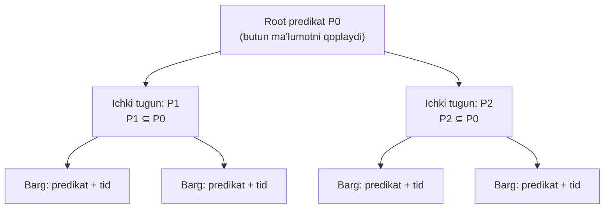
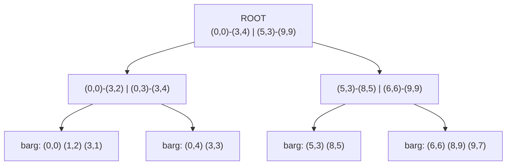
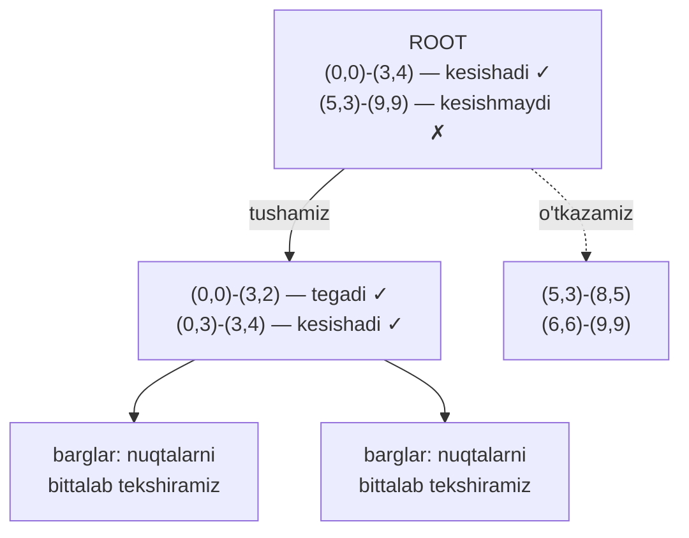
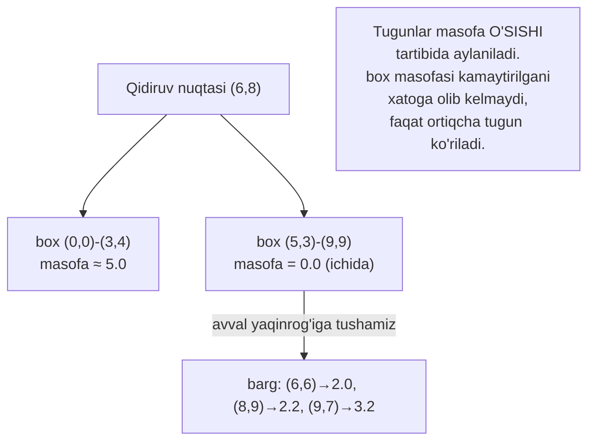
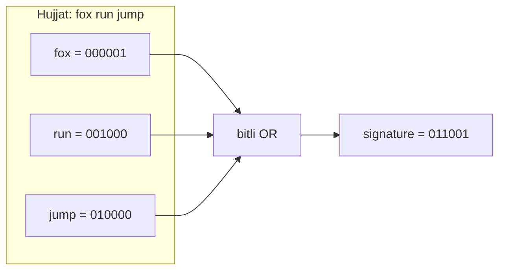

# 26. GiST index

> 📖 Manba: Рогов, "PostgreSQL 17 изнутри", 26-bob ("Индекс GiST")

## Nima uchun kerak?

25-darsda **B-tree** bilan tanishdik: u tartiblanadigan (order) tiplar uchun ideal — sonlar, sanalar, matn satrlari, ya'ni `<`, `=`, `>` bilan **solishtirsa bo'ladigan** qiymatlar. B-tree'ning butun kuchi shu tartibga tayanadi: har bir ichki tugun bola tugunlarni **bir xil oralig'iga** bo'lib, qidiruvni bitta yo'lga yo'naltiradi.

Lekin ma'lumotlarning katta qismini bunday **tartibga solib bo'lmaydi**. Bir nechta misolni ko'raylik:

- **Geografik nuqtalar** (aeroportlar koordinatalari). Ikkita nuqtaning qaysi biri "kattaroq"? Savol ma'nosiz. Bizni "kim kimdan katta" emas, **"berilgan hududda qaysi nuqtalar bor"** yoki **"eng yaqin qo'shni qaysi"** qiziqtiradi.
- **Matnli hujjatlar** (full-text search). Hujjatni tartib bo'yicha joylashtirib bo'lmaydi; bizga "shu so'zlarni o'z ichiga oladigan hujjatlar" kerak.
- **Oraliqlar** (range), IP-adreslar, ko'pliklar (set) — bularning hech biri chiziqli tartibga tushmaydi.

Mana shu yerda **GiST** (Generalized Search Tree — umumlashtirilgan qidiruv daraxti) yordamga keladi. GiST — bu **balanslangan daraxt g'oyasining umumlashmasi**: u B-tree'dagi qat'iy "tartib" o'rniga **istalgan taqsimlash printsipini** operator class orqali qabul qiladi.

> **Oltin qoida:** B-tree qiymatlarni **tartibga** solib qidiradi; GiST esa qiymatlarni **predikatlar** (mantiqiy shartlar) daraxtiga joylashtirib qidiradi. Shu bois GiST'ga R-tree'ni (fazoviy ma'lumot), RD-tree'ni (ko'pliklar) yoki signature daraxtini (istalgan tip) "yuklash" mumkin.

```mermaid
mindmap
  root(("GiST index"))
    "Umumiy printsip"
      "Generalized Search Tree"
      "predikatlar daraxti"
      "consistency function"
      "karkas: operator class"
    "R-tree (nuqtalar)"
      "bounding box"
      "hudud ichida qidiruv"
      "k-NN eng yaqin qo'shni"
      "insert + split"
    "Exclusion constraint"
      "EXCLUDE USING gist"
      "btree_gist"
    "RD-tree (FTS)"
      "tsvector / tsquery"
      "signature = Bloom filter"
      "false positive"
    "Boshqa tiplar"
      "range, ltree"
      "pg_trgm, hstore"
      "inet, cube"
```

---

## 1-qism. GiST umumiy printsipi

### GiST — karkas, tayyor index emas

PostgreSQL'ning kengaytiriluvchanligi (extensibility) tufayli noldan yangi index metodini yozish mumkin. Lekin bu juda mashaqqatli: nafaqat indekslash mantiqini, balki page tuzilishini, lock strategiyasini, WAL (10-dars) qo'llab-quvvatlashini ham o'ylab chiqish kerak.

GiST bu ishning **quyi darajadagi** (past level) qismini o'z zimmasiga oladi. Yangi data type uchun GiST'dan foydalanish uchun sizga bor-yo'g'i **operator class** — o'nga yaqin **oporniy funksiya** (support function, tayanch funksiya) to'plamini berish kifoya. Shu ma'noda GiST — bu **yangi index metodlarini qurish uchun karkas**.

### Predikatlar daraxti

GiST daraxtidagi har bir yozuv (record) — bu **predikat** (mantiqiy shart) va unga bog'liq ma'lumot:

- **Barg yozuvi** (leaf record): predikat + **tid** (tuple identifikatori — table'dagi row versiyasiga havola). Indekslanayotgan kalit shu predikatni **qanoatlantirishi** shart.
- **Ichki yozuv** (internal record): predikat + bola tugunga havola. Muhim xususiyat: **ichki tugun predikati o'zining barcha bolalari predikatlarini o'z ichiga oladi**.

Aynan shu "predikat bolalarini qamrab oladi" xususiyati B-tree'dagi oddiy tartiblikning **o'rnini bosadi**.



### Consistency function — qidiruvning yuragi

Qidiruv operator class bergan **consistency function** (moslik funksiyasi) yordamida boradi. Bu funksiya bitta index yozuvi uchun chaqiriladi va shu yozuv predikati qidiruv sharti (`indekslangan-ustun operator ifoda` ko'rinishida) bilan **"mos keladimi"** ni aniqlaydi:

- **ichki yozuv** uchun: tegishli poddereva (subtree)'ga **tushish kerakmi** yoki yo'q;
- **barg yozuvi** uchun: indekslangan kalit shartni **qanoatlantiradimi**.

Qidiruv, odatdagidek, ildizdan boshlanadi. Consistency function orqali qaysi bola tugunlarga kirish mantiqli ekani aniqlanadi. Muhim farq: B-tree'da qidiruv har doim **bitta** bola tugunni tanlaydi; GiST'da esa consistency function **bir nechta** poddereva'ni mos deb topishi mumkin — ayniqsa ularning hududlari kesishsa.

Qidiruv har doim **chuqurlikka** (depth-first) boradi: algoritm avval qandaydir bargga yetib borishga urinadi — bu birinchi natijalarni tezroq qaytarishga imkon beradi (foydalanuvchiga faqat dastlabki bir necha satr kerak bo'lsa muhim).

### Insert va split

Yangi qiymat qo'shishda consistency function yaramaydi — chunki **bitta aniq** barg tugunni tanlash kerak. Tugun **penalty function** (jarima funksiyasi) yordamida, qo'yishning **narxini minimallashtiradigan** tarzda tanlanadi.

Tanlangan tugunda joy bo'lmasa — **split** (racheplenie, bo'linish) yuz beradi. Buning uchun yana ikkita funksiya kerak:

- biri qaysi yozuvlar eski tugunda qolishi, qaysilari yangisiga ko'chishini hal qiladi (**picksplit**);
- ikkinchisi ikki predikatni **birlashtiradi** (**union**), ota tugun predikatini yangilash uchun.

> ⚠️ **Muhim nozik nuqta:** yangi qiymat qo'shilishi mavjud predikatlarni **kengaytiradi**, lekin **toraytirish** faqat split paytida yoki index'ni to'liq qayta qurishda bo'ladi. Shu bois tez-tez yangilanadigan (`UPDATE`) GiST-index **degradatsiyaga** uchrashi mumkin — vaqti-vaqti bilan `REINDEX` foydali (8-dars).

---

## 2-qism. R-tree nuqtalar uchun

Endi umumiy printsipni **konkret** operator class'da ko'ramiz. Birinchi misol — tekislikdagi nuqtalarni (yoki boshqa geometrik obyektlarni) indekslash.

### Bounding box (ogranicivayushiy pryamougolnik)

R-tree g'oyasi: tekislik **to'rtburchaklarga** bo'linadi, ular birgalikda barcha indekslanadigan nuqtalarni qoplaydi. Har bir index yozuvi bitta **bounding box** (chegaralovchi to'rtburchak) saqlaydi, predikat esa: *"nuqta shu to'rtburchak ichida yotadi"*.

- **Root** bir nechta eng katta to'rtburchaklarni saqlaydi (ular **kesishishi** ham mumkin).
- **Bola tugunlarda** kichikroq to'rtburchaklar — ota to'rtburchak ichiga joylashgan.
- **Barg tugunlar** indekslanadigan nuqtalarning o'zini saqlashi kerak, lekin GiST barcha yozuvlarda tip bir xil bo'lishini talab qiladi — shuning uchun nuqtalar ham to'rtburchak sifatida, faqat nuqtaga **"siqilgan"** (schlopnutiy) holda saqlanadi.

Kitobdagi soddalashtirilgan misolni olamiz — 9x9 tekislikdagi bir nechta nuqta. Uning R-tree strukturasi shunday ko'rinadi:



Diqqat qiling: bu daraxt **balanslangan** — barcha barglar bir xil chuqurlikda (bu GiST'ni keyingi darsdagi SP-GiST'dan ajratadigan muhim xususiyat).

### Tajriba bazasi

Kitobdagi eksperimentni takrorlaymiz. `airports` demo-jadvalini besh ming satrgacha kengaytirib, koordinatalar bo'yicha GiST-index quramiz. Daraxt **chuqurroq** chiqishi uchun `fillfactor`'ni ataylab past qo'yamiz (default'da bitta daraja yetadi):

```sql
=> CREATE TABLE airports_big AS
   SELECT * FROM airports_data;
=> CREATE INDEX airports_gist_idx ON airports_big
   USING gist(coordinates) WITH (fillfactor=10);
```

Bu yerda `coordinates` — `point` tipidagi ustun, ishlatiladigan operator class esa **`point_ops`** (nuqtalar uchun yagona class).

### Page tashkiloti

GiST-index ichini `pageinspect` extension (5-darsda ko'rgan `heap_page` kabi) orqali o'rganish mumkin.

> B-tree'dan farqli o'laroq, GiST-index'da **meta-page yo'q**, va daraxt ildizi har doim **nol page**'da joylashadi. Root page bo'linsa — eski ildiz alohida page'ga ko'chiriladi, yangisi esa uning o'rnini egallaydi.

Root page mazmuni:

```sql
=> SELECT ctid, left(keys,62) AS keys
   FROM gist_page_items(
     get_raw_page('airports_gist_idx', 0), 'airports_gist_idx'
   ) \gx
-[ RECORD 1 ]--------------------------------------------------
ctid | (196,65535)
keys | (coordinates)=("(50.845...,78.246...),(-7.362...
-[ RECORD 2 ]--------------------------------------------------
ctid | (392,65535)
keys | (coordinates)=("(179.951...,73.517...),(46.956...
-[ RECORD 3 ]--------------------------------------------------
ctid | (195,65535)
keys | (coordinates)=("(-88.751...,71.993...),(-179.876...
-[ RECORD 4 ]--------------------------------------------------
ctid | (458,65535)
keys | (coordinates)=("(-3.440...,82.517...),(-98.22...
```

Bu to'rt satr — yuqori darajaning to'rtta bounding box'i. Har biri `ctid` orqali keyingi darajadagi page'ga ishora qiladi.

### Operator class va uning funksiyalari

`point_ops` operator class'i qanday tayanch funksiyalarni amalga oshirishini ko'ramiz:

```sql
=> SELECT amprocnum, amproc::regproc
   FROM pg_am am
   JOIN pg_opclass opc ON opcmethod = am.oid
   JOIN pg_amproc amop ON amprocfamily = opcfamily
   WHERE amname = 'gist' AND opcname = 'point_ops'
   ORDER BY amprocnum;
 amprocnum |        amproc
-----------+------------------------
         1 | gist_point_consistent
         2 | gist_box_union
         3 | gist_point_compress
         5 | gist_box_penalty
         6 | gist_box_picksplit
         7 | gist_box_same
         8 | gist_point_distance
         9 | gist_point_fetch
        11 | gist_point_sortsupport
```

Bu yerda birinchi qismda tanishgan funksiyalarimizni ko'ramiz:

| № | Funksiya | Vazifasi |
|---|----------|----------|
| 1 | consistency | qidiruvda daraxtni aylanib chiqish |
| 2 | union | to'rtburchaklarni **birlashtirish** (predikat yangilash) |
| 5 | penalty | insert'da qaysi tugunga tushishni tanlash |
| 6 | picksplit | split'da yozuvlarni taqsimlash |
| 7 | same | ikki kalit **tengligi**ni tekshirish |

8, 9, 11-funksiyalar — ixtiyoriy (distance for k-NN, fetch for index-only scan, sortsupport).

### point_ops qo'llab-quvvatlaydigan operatorlar

```sql
=> SELECT amopopr::regoperator, amopstrategy AS st, oprcode::regproc
   FROM pg_am am
   JOIN pg_opclass opc ON opcmethod = am.oid
   JOIN pg_amop amop ON amopfamily = opcfamily
   WHERE amname = 'gist' AND opcname = 'point_ops'
   ORDER BY amopstrategy;
     amopopr       | st |   oprcode
-------------------+----+---------------
 <<(point,point)   |  1 | point_left      -- chapda
 >>(point,point)   |  5 | point_right     -- o'ngda
 ~=(point,point)   |  6 | point_eq        -- tengligi
 <<|(point,point)  | 10 | point_below     -- pastda
 |>>(point,point)  | 11 | point_above     -- yuqorida
 <->(point,point)  | 15 | point_distance  -- masofa
 <@(point,box)     | 28 | on_pb           -- box ichida
 <@(point,circle)  | 68 | pt_contained    -- circle ichida
```

Barcha operatorlar u yoki bu tarzda obyektlarning **o'zaro joylashuvi** ("chapda", "o'ngda", "yuqorida", "ichida") va **ular orasidagi masofa** bilan bog'liq. B-tree'da bor-yo'g'i beshta strategiya bor edi (25-dars); GiST'da esa strategiyalar ancha ko'p. Har bir konkret operator class ularning **hammasini** amalga oshirmasligi mumkin (masalan `point_ops`'da "o'z ichiga oladi" strategiyasi yo'q, chunki nuqtaning maydoni yo'q).

---

## 3-qism. Hudud ichida qidiruv

Index tezlashtiradigan tipik so'rov — **berilgan hududga kiruvchi barcha nuqtalarni** olish. Masalan, Moskva markazidan bir gradus radiusidagi aeroportlarni topamiz:

```sql
=> SELECT airport_code, airport_name->>'en'
   FROM airports_big
   WHERE coordinates <@ '<(37.622513,55.753220),1.0>'::circle;
 airport_code |              ?column?
--------------+------------------------------------
 SVO          | Sheremetyevo International Airport
 VKO          | Vnukovo International Airport
 DME          | Domodedovo International Airport
 BKA          | Bykovo Airport
 ZIA          | Zhukovsky International Airport
 CKL          | Chkalovskiy Air Base
 OSF          | Ostafyevo International Airport
(7 rows)
```

`<@` — "o'z ichiga oladi" operatori: nuqta berilgan doira (circle) ichida yotadimi. Reja:

```sql
=> EXPLAIN (costs off) SELECT airport_code
   FROM airports_big
   WHERE coordinates <@ '<(37.622513,55.753220),1.0>'::circle;
                          QUERY PLAN
---------------------------------------------------------------
 Bitmap Heap Scan on airports_big
   Recheck Cond: (coordinates <@ '<(37.622513,55.75322),1>'::circle)
   ->  Bitmap Index Scan on airports_gist_idx
         Index Cond: (coordinates <@ ...)
```

### Consistency qanday ishlaydi — sodda misolda

Yuqoridagi 9x9 daraxtimizda `(1,2)-(4,7)` to'rtburchak ichidagi nuqtalarni qidiraylik:



1. Root'dan boshlaymiz. Berilgan to'rtburchak `(0,0)-(3,4)` bilan **kesishadi**, lekin `(5,3)-(9,9)` bilan kesishmaydi → ikkinchi poddereva'ga tushmaymiz.
2. Keyingi darajada `(0,3)-(3,4)` bilan kesishadi va `(0,0)-(3,2)` ga tegadi — **ikkala** poddereva'ni tekshirishga majburmiz.
3. Bargga yetganda, u yerdagi barcha nuqtalarni tekshirib, consistency function `true` qaytargan nuqtalarni qaytaramiz.

> **B-tree bilan farq shu yerda ko'rinadi:** B-tree har doim **bitta** bola tugunni tanlaydi. GiST esa (kesishuvchi to'rtburchaklar tufayli) bir necha poddereva'ni aylanib chiqishi kerak bo'lishi mumkin.

---

## 4-qism. k-NN — eng yaqin qo'shnilar qidiruvi

Yuqoridagi `<@` kabi operatorlar **poiskoviy** (search) — ular predikat, ya'ni mantiqiy (`true`/`false`) qiymat qaytaradi. Boshqa tur ham bor — **uporyadocivayushiy** (ordering, tartiblovchi) operatorlar: ular argumentlar orasidagi **masofani** qaytaradi.

Bunday operatorlar `ORDER BY` ichida index tomonidan qo'llab-quvvatlanishi mumkin (index'ning `DISTANCE ORDERABLE` xususiyati). Bu **k-NN** (k-nearest neighbor, k ta eng yaqin qo'shni) qidiruvini samarali qiladi.

Masalan, Kostroma'ga eng yaqin 10 ta aeroportni topamiz:

```sql
=> SELECT airport_code, airport_name->>'en'
   FROM airports_big
   ORDER BY coordinates <-> '(40.926780,57.767943)'::point
   LIMIT 10;
 airport_code |                   ?column?
--------------+-----------------------------------------------
 KMW          | Kostroma Sokerkino Airport
 IAR          | Tunoshna Airport
 IWA          | Ivanovo South Airport
 VGD          | Vologda Airport
 ...
(10 rows)

=> EXPLAIN (costs off) SELECT airport_code
   FROM airports_big
   ORDER BY coordinates <-> '(40.926780,57.767943)'::point
   LIMIT 10;
                       QUERY PLAN
-----------------------------------------------------------
 Limit
   ->  Index Scan using airports_gist_idx on airports_big
         Order By: (coordinates <-> '(40.92678,57.767943)'::point)
```

Diqqat: bu **Index Scan** (bitmap emas), chunki index natijalarni **tartib bilan, bittalab** qaytaradi va istalgan momentda to'xtatish mumkin. Shu bois bir nechta eng yaqin qiymatni topish juda tez.

> Index bo'lmasa, k-NN'ni qurish mashaqqatli bo'lardi: hududni asta-sekin kengaytirib, kerakli soni topilguncha bir necha marta scan qilish kerak bo'lardi — boshlang'ich radiusni tanlash muammosi bilan birga.

### Masofa funksiyasi qanday ishlaydi

k-NN uchun operator class qo'shimcha **distance function** (masofa funksiyasi)ni aniqlashi kerak:

- **barg element** uchun (indekslangan qiymatning o'zi) — bu odatdagi masofa (nuqtalar uchun Evklid masofasi).
- **ichki element** uchun (bounding box bilan ifodalangan) — funksiya bola barglargacha bo'lgan masofalarning **minimumini** qaytarishi kerak. Barcha bolalarni aylanib chiqish qimmat, shuning uchun funksiya masofani **optimistik kamaytirishi** mumkin (samaradorlikni qurbon qilib), lekin **hech qachon oshirib** yubormasligi kerak — aks holda qidiruv noto'g'ri natija beradi.

Shu bois box uchun nuqtagacha masofa — nuqta va to'rtburchak orasidagi **minimal** masofa (yoki nuqta ichda bo'lsa — nol). Bu qiymat bola nuqtalarni aylanmasdan hisoblanadi va kafolatli ular orasidagi har qanday masofadan **katta emas**.



Tugunlar masofa **o'sishi** tartibida aylaniladi. Box masofasi kamaytirilgani (3.0 o'rniga real 3.6) faqat samaradorlikni pasaytiradi (ortiqcha bitta tugun ko'riladi), lekin algoritm **to'g'riligini buzmaydi**.

---

## 5-qism. Exclusion constraint (EXCLUDE USING gist)

GiST'ning kutilmagan, lekin juda foydali qo'llanishi — **exclusion constraint** (istisno cheklovi).

Exclusion constraint kafolatlaydi: jadvalning **istalgan ikki row**'ining berilgan maydonlari qandaydir **operator ma'nosida** bir-biriga "mos kelmaydi". Shartlar:

- index metodi bu cheklovni qo'llashi kerak (`CAN EXCLUDE` xususiyati);
- operator shu index metodining operator class'iga kirishi;
- operator **kommutativ** bo'lishi kerak: `a operator b = b operator a`.

`hash` va `btree` faqat **tenglik** (`=`) operatorini beradi — bunday exclusion constraint oddiy `UNIQUE`'ga teng bo'lib qoladi, foydasi kam. Lekin `gist`'da yana ikkita mos strategiya bor:

- **kesishish** — `&&` operatori;
- **tegib turish** — `-|-` operatori (oraliqlar uchun).

Misol: aeroportlarni bir-biriga **juda yaqin** joylashtirishni taqiqlaymiz. Buni shunday ifodalash mumkin: aeroport koordinatalarida markazlashgan `0.2` radiusli doiralar **kesishmasligi** kerak:

```sql
=> ALTER TABLE airports_data ADD EXCLUDE
   USING gist (circle(coordinates,0.2) WITH &&);
```

Endi yaqin aeroport qo'shishga urinsak, xato:

```sql
=> INSERT INTO airports_data(airport_code, ..., coordinates, ...)
   VALUES ('ZIA', ..., point(38.1517, 55.5533), ...);
ERROR:  conflicting key value violates exclusion constraint
        "airports_data_circle_excl"
DETAIL: Key (circle(...))=(<(38.1517,55.5533),0.2>) conflicts with
        existing key (...).
```

> Exclusion constraint yaratilganda uni tekshirish uchun **avtomatik ravishda index** quriladi — bu holda ifoda (expression) bo'yicha GiST-index.

### btree_gist — B-tree operatorlarini GiST'ga qo'shish

Shartni murakkablashtiraylik: yaqin joylashuvga ruxsat beramiz, **faqat** aeroportlar bir shaharga tegishli bo'lsa. Ya'ni: doiralar kesishadigan (`&&`) va shahar nomlari **mos kelmaydigan** (`!=`) juftliklar taqiqlansin.

Lekin `text` tipi uchun GiST'da default operator class **yo'q**:

```sql
=> ALTER TABLE airports_data ADD EXCLUDE USING gist (
     circle(coordinates,0.2) WITH &&,
     (city->>'en') WITH !=
   );
ERROR:  data type text has no default operator class for access method "gist"
```

Yechim — **`btree_gist`** extension. U B-tree'ga xos operatsiyalar (`<`, `>`, `=`, `!=`) uchun GiST-qo'llab-quvvatlashni qo'shadi:

```sql
=> CREATE EXTENSION btree_gist;
=> ALTER TABLE airports_data ADD EXCLUDE USING gist (
     circle(coordinates,0.2) WITH &&,
     (city->>'en') WITH !=
   );
ALTER TABLE
```

> ⚠️ **Muhim:** GiST `<`, `>`, `=` bilan ishlay olsa-da, B-tree bularni **ancha samaraliroq** bajaradi (ayniqsa oraliq bo'yicha). `btree_gist` hiylasini faqat GiST-index mohiyatan zarur bo'lganda (masalan, yuqoridagi kabi geometrik shart bilan **birga**) ishlating.

---

## 6-qism. RD-tree full-text search uchun

### Full-text search asoslari (qisqacha)

**Full-text search** (FTS, to'liq matnli qidiruv) vazifasi — hujjatlar to'plamidan qidiruv so'roviga **mos keladiganlarini** tanlash.

Buning uchun hujjat maxsus **`tsvector`** tipiga keltiriladi — u **leksema**larni (qidiruvga qulay ko'rinishga keltirilgan so'zlar) va ularning hujjatdagi **pozitsiyalarini** saqlaydi. Masalan, so'zlar kichik harfga tushiriladi va o'zgaruvchi qo'shimchalaridan tozalanadi (stemming):

```sql
=> SET default_text_search_config = english;
=> SELECT to_tsvector('A fox jumped and the fox ran away');
              to_tsvector
---------------------------------------
 'away':8 'fox':2,6 'jump':3 'ran':7
```

E'tibor bering:
- `a`, `and`, `the` — **stop-so'zlar** (juda tez uchraydi, qidiruvga foydasiz) — olib tashlandi;
- `jumped` → `jump` (o'zak);
- `fox` ikki marta — `2,6` pozitsiyalarida.

Qidiruv so'rovi boshqa tip — **`tsquery`** bilan ifodalanadi. U leksemalar va mantiqiy bog'lovchilardan iborat: `&` (va), `|` (yoki), `!` (emas):

```sql
=> SELECT to_tsquery('fox & (jumped | ran)');
         to_tsquery
-----------------------------
 'fox' & ( 'jump' | 'ran' )
```

Moslik yagona **`@@`** operatori bilan tekshiriladi:

```sql
=> SELECT to_tsvector('A fox jumped and the fox ran') @@ to_tsquery('fox & jump');
 ?column?
----------
 t
```

> Bu FTS'ning to'liq tavsifi emas (u 28-darsda, GIN index bilan chuqurroq ochiladi), lekin index'ni tushunish uchun yetarli.

### tsvector'ni indekslash

FTS tez ishlashi uchun uni index bilan qo'llab-quvvatlash kerak. Indekslanadigan narsa — hujjatning o'zi emas, **`tsvector`** qiymati. `tsvector` ustunini har `INSERT`/`UPDATE`'da qo'lda to'ldirmaslik uchun uni **generated column** (generatsiyalanadigan ustun) sifatida e'lon qilamiz:

```sql
=> CREATE TABLE ts(
     doc     text,
     doc_tsv tsvector GENERATED ALWAYS AS (
       to_tsvector('pg_catalog.english', doc)
     ) STORED
   );
=> CREATE INDEX ts_gist_idx ON ts USING gist(doc_tsv);
```

> **Nima uchun `english` aniq ko'rsatilgan?** Bir parametrli `to_tsvector(doc)` varianti `default_text_search_config`'ga bog'liq — u **`STABLE`** kategoriyada. Generated ustun esa **`IMMUTABLE`** (o'zgarmas) funksiya talab qiladi, shuning uchun konfiguratsiyani aniq yozamiz.

### R-tree emas — RD-tree (matryoshka)

Oddiy R-tree hujjatlar uchun yaramaydi: hujjatga "bounding box" tushunchasi qo'llanmaydi. Uning o'rniga **RD-tree** (Russian Doll — matryoshka) ishlatiladi. Bounding box o'rniga u **ogranicivayushee mnozhestvo** (chegaralovchi ko'plik)ni ishlatadi — ya'ni bola ko'pliklarning barcha elementlarini o'z ichiga oladigan ko'plik. FTS uchun bu ko'plik — hujjat leksemalari.

Ko'plikni index yozuvida to'g'ridan-to'g'ri sanab yozish mumkin, lekin muammosi ravshan: hujjatda leksema **juda ko'p** bo'lishi mumkin, yuqori darajalarda ko'pliklar birlashib ulkan bo'lib ketadi, page'da esa joy cheklangan.

### Signature — Bloom filter g'oyasi

Shu bois FTS'da ixchamroq yechim — **signature daraxti** ishlatiladi. G'oya **Bloom filter** bilan tanish bo'lganlarga yaqin:

- Har bir leksema o'z **signature**si bilan ifodalanadi — ma'lum uzunlikdagi bit-satr, unda faqat **bitta bit** birga teng (o'rnatilgan), qolganlari nol. Qaysi bit — hash-funksiya natijasidan aniqlanadi.
- **Hujjat signature**si — uning barcha leksemalari signature'larining **bitli "yoki"si** (OR).

Kichik misol (6-bitli signature):

| Leksema | Signature |
|---------|-----------|
| fox     | `000001`  |
| dog     | `000010`  |
| cat     | `000100`  |
| run     | `001000`  |
| jump    | `010000`  |

`"fox run jump"` hujjati signature'si = `000001 | 001000 | 010000` = **`011001`**.



Qidiruv so'rovi signature'si ham xuddi shunday hisoblanadi. Consistency function barcha bit'lari so'rov signature'sini **qamrab oladigan** bola tugunlarni tanlaydi.

### False positive (yolg'on ijobiy)

Bu yondashuvning ikkita jiddiy kamchiligi bor:

1. **Index-only scan mumkin emas** — signature'dan asl qiymatni tiklab bo'lmaydi, har bir qaytarilgan tid table bo'yicha **qayta tekshiriladi** (recheck).
2. **Aniqlik yo'qoladi** — bit soni cheklangani uchun turli leksemalar bir xil bit'ga tushib qolishi mumkin (**kolliziya**). Natijada index **yolg'on natijalar** (false positive) qaytaradi, ular keyin recheck'da chiqarib tashlanadi.

> **Muhim:** false positive **samaradorlikni** pasaytiradi, lekin **to'g'rilikni** buzmaydi — chunki bu sxemada **yolg'on manfiy** (false negative) bo'lishi mumkin emas, kerakli qiymat kafolatli o'tkazib yuborilmaydi.

Real hayotda signature kattaroq olinadi: default **124 bayt (992 bit)**, bu kolliziya ehtimolini keskin kamaytiradi. Kerak bo'lsa, operator class parametri orqali `~2000` baytgacha o'zgartirish mumkin:

```sql
CREATE INDEX ... USING gist(ustun tsvector_ops(siglen = o'lcham));
```

### Real ma'lumotda: siglen bilan aniqlikni sozlash

`pgsql-hackers` xat arxivida (356 125 xat) indeksni sinaymiz. `subject`, `author`, `body` ni bitta `tsvector`'ga birlashtiramiz va default siglen bilan qidiramiz:

```sql
=> EXPLAIN (analyze, costs off, timing off, summary off)
   SELECT * FROM mail_messages WHERE tsv @@ to_tsquery('magic & value');
                       QUERY PLAN
-------------------------------------------------------
 Index Scan using mail_gist_idx on mail_messages (actual rows=898 loops=1)
   Index Cond: (tsv @@ to_tsquery('magic & value'::text))
   Rows Removed by Index Recheck: 7858
```

Shartga mos **898** satr bilan birga, index yana **7858** satr qaytardi — ular table bo'yicha recheck'da chiqarib tashlandi (aynan shu **false positive**). Signature o'lchamini oshirsak (siglen=248), aniqlik ortadi:

```sql
=> CREATE INDEX ON mail_messages USING gist(tsv tsvector_ops(siglen=248));
=> EXPLAIN (analyze, costs off, timing off, summary off)
   SELECT * FROM mail_messages WHERE tsv @@ to_tsquery('magic & value');
                       QUERY PLAN
-------------------------------------------------------
 Index Scan using mail_messages_tsv_idx on mail_messages (actual rows=898 loops=1)
   Index Cond: (tsv @@ to_tsquery('magic & value'::text))
   Rows Removed by Index Recheck: 2059
```

Recheck 7858 → **2059** ga tushdi. Narxi — index kattaroq bo'ldi (128 MB → 140 MB). Bu klassik **hajm ↔ aniqlik** almashtirishi.

---

## 7-qism. GiST qo'llab-quvvatlaydigan boshqa data type'lar

GiST — karkas bo'lgani uchun bitta index metodi orqali juda ko'p tiplar bilan ishlaydi. Har safar **operator class**ni ko'rsatish muhim, chunki u index xususiyatlariga sezilarli ta'sir qiladi:

| Data type / extension | Operator class | Ichki struktura |
|-----------------------|----------------|-----------------|
| point, box, circle, polygon | `point_ops`, `box_ops`, ... | R-tree (bounding box) |
| range (int4range, tstzrange) | `range_ops` | 1 o'lchamli R-tree (chegaralovchi kesma) |
| multirange (v14) | `multirange_ops` | R-tree |
| `cube` extension | ko'p o'lchamli kub | R-tree (parallelepiped) |
| tartibli tiplar (`btree_gist`) | ko'p class | B-tree operatsiyalari GiST'da |
| `inet` (tarmoq adreslari) | `inet_ops` | built-in |
| `intarray` (int massivlari) | `gist__int_ops` / `gist__bigint_ops` | RD-tree / signature RD-tree |
| `ltree` (belgili daraxtlar) | `gist_ltree_ops` | signature RD-tree |
| `hstore` (key-value) | `gist_hstore_ops` | signature RD-tree |
| `pg_trgm` (trigrammalar) | `gist_trgm_ops` | matn o'xshashligi, `LIKE` |

**tsvector** uchun ko'rganimizdek, `returnable` (index-only) va `distance_orderable` xususiyatlari operator class'ga bog'liq. Masalan, `point_ops` uchun **ikkalasi ham** bor (Evklid masofasi orqali k-NN), lekin `range_ops` uchun masofa operatori aniqlanmagan — shuning uchun `distance_orderable = f`:

```sql
=> CREATE TABLE reservations(during tsrange);
=> CREATE INDEX ON reservations USING gist(during);
=> SELECT p.name, pg_index_column_has_property('reservations_during_idx', 1, p.name)
   FROM unnest(array['returnable', 'distance_orderable']) p(name);
        name        | pg_index_column_has_property
--------------------+------------------------------
 returnable         | t
 distance_orderable | f
```

### GiST metodining umumiy xususiyatlari

```sql
=> SELECT p.name, pg_indexam_has_property(a.oid, p.name)
   FROM pg_am a, unnest(array[
     'can_order','can_unique','can_multi_col','can_exclude','can_include'
   ]) p(name)
   WHERE a.amname = 'gist';
     name      | pg_indexam_has_property
---------------+-------------------------
 can_order     | f
 can_unique    | f
 can_multi_col | t
 can_exclude   | t   -- exclusion constraint
 can_include   | t   -- INCLUDE ustunlar (v12)
```

- **Tartiblash va uniquelik yo'q** — bu GiST tabiatiga zid.
- **Ko'p ustunli** index, **exclusion constraint**, **INCLUDE** ustunlar — mumkin.
- Index **teskari** yo'nalishda scan qila olmaydi (`backward_scan = f`), lekin **klasterlash** (`CLUSTER`) uchun ishlatsa bo'ladi.

> ⚠️ **NULL bilan ehtiyot:** GiST NULL qiymatlarni qabul qiladi, lekin samarasiz. NULL bounding box'ni kengaytirmaydi deb hisoblanadi, shuning uchun insert'da tasodifiy poddereva'ga tushadi va uni **butun daraxt bo'yicha** qidirishga to'g'ri keladi.

---

## Xulosa

- **B-tree** faqat tartiblanadigan tiplar uchun; **GiST** esa tartibga tushmaydigan ma'lumot (nuqtalar, oraliqlar, hujjatlar) uchun **umumlashtirilgan qidiruv daraxti**.
- GiST — tayyor index emas, **karkas**: yangi tip uchun **operator class** (o'nga yaqin tayanch funksiya) berish kifoya. GiST quyi daraja (page, lock, WAL)ni o'z zimmasiga oladi.
- GiST **predikatlar daraxti**: ichki tugun predikati barcha bola predikatlarini qamrab oladi. Qidiruv **consistency function** orqali boradi va bir vaqtda **bir necha** poddereva'ga tushishi mumkin (B-tree'dan farqi).
- Insert **penalty** funksiyasi bilan tugun tanlaydi; joy yetmasa **split** (picksplit + union). Tez `UPDATE`'da index degradatsiyaga uchraydi.
- **Nuqtalar uchun R-tree**: **bounding box** ierarxiyasi. `<@` bilan hudud ichida qidiruv (Bitmap scan), `<->` bilan **k-NN** (Index scan, tartib bilan qaytaradi).
- GiST'da **meta-page yo'q**, ildiz har doim 0-page'da.
- **Exclusion constraint** (`EXCLUDE USING gist`) — `&&`, `-|-` orqali "kesishmaslik" kabi cheklovlar. B-tree operatorlari kerak bo'lsa — **`btree_gist`**.
- **FTS**: hujjat `tsvector`, so'rov `tsquery`, moslik `@@`. Indekslash **RD-tree** orqali; ixchamlik uchun **signature** (Bloom filter) — false positive'ga yo'l qo'yadi (aniqlikni **siglen** bilan sozlash mumkin), lekin false negative yo'q.
- GiST juda ko'p tip bilan ishlaydi (range, cube, inet, ltree, hstore, pg_trgm) — har biriga o'z operator class'i.

## Nazorat savollari

1. Nega B-tree nuqtalar yoki `tsvector` uchun yaramaydi? GiST bu muammoni qanday hal qiladi — u qiymatlarni nima asosida daraxtga joylashtiradi?
2. "GiST — tayyor index emas, karkas" degani nima? Yangi data type uchun GiST'dan foydalanish uchun nima berish kifoya?
3. Ichki tugun predikatining "barcha bola predikatlarini qamrab oladi" xususiyati nima uchun muhim? U B-tree'dagi nimaning o'rnini bosadi?
4. Consistency function ichki va barg yozuv uchun nima qaytaradi? Nega GiST'da qidiruv bir vaqtda bir necha poddereva'ni aylanib chiqishi mumkin, B-tree'da esa yo'q?
5. `<@` (hudud ichida) so'rovi rejasida nega **Bitmap** scan, `<->` (k-NN) rejasida esa **Index** scan chiqadi? Farqi nimada?
6. k-NN'da ichki element (box) uchun masofa funksiyasi masofani kamaytirishi mumkin, lekin oshirishi mumkin emas — nega aynan shunday cheklov to'g'rilik uchun zarur?
7. Signature (Bloom filter) qanday hisoblanadi va nega u **false positive** beradi, lekin **false negative** bermaydi? `siglen` oshirilsa nima yaxshilanadi va nima yomonlashadi?
8. `EXCLUDE USING gist` qanday cheklov qo'yadi? `hash`/`btree` o'rniga nega aynan `gist` kerak, va `btree_gist` extension qaysi holatda zarur bo'ladi?
