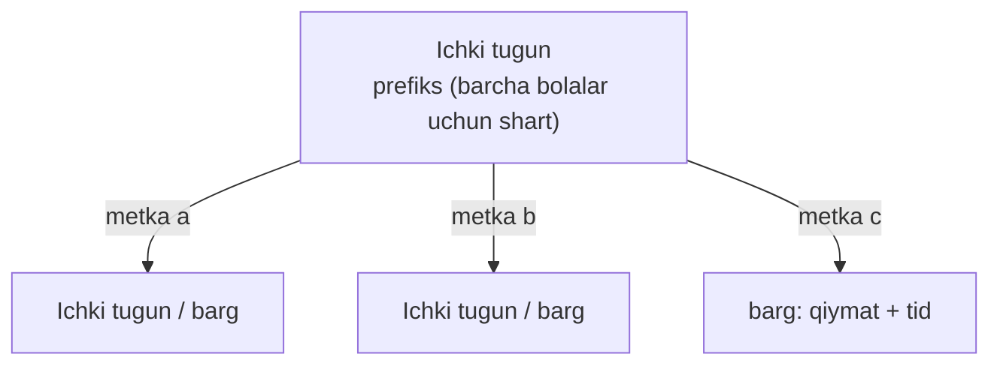
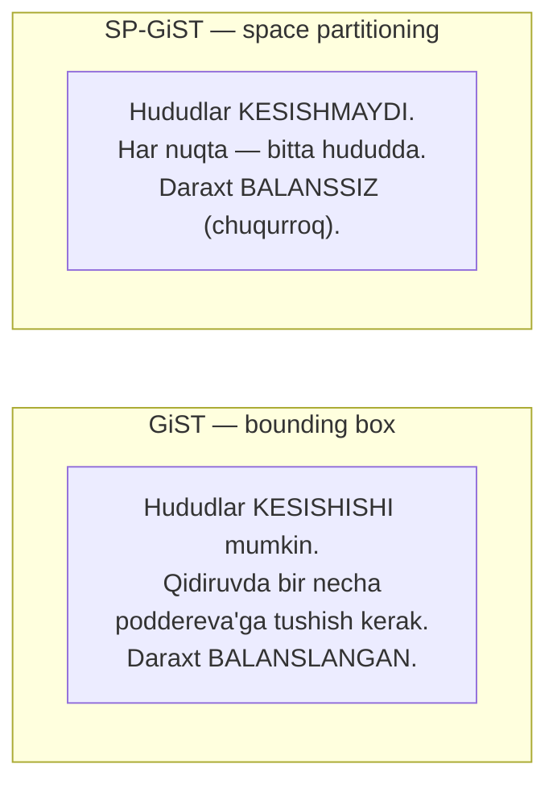
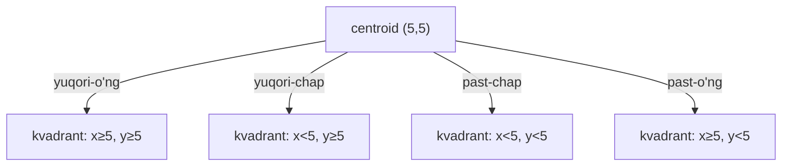
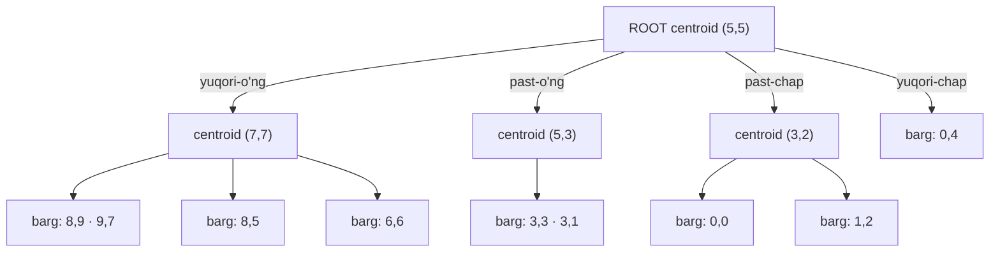
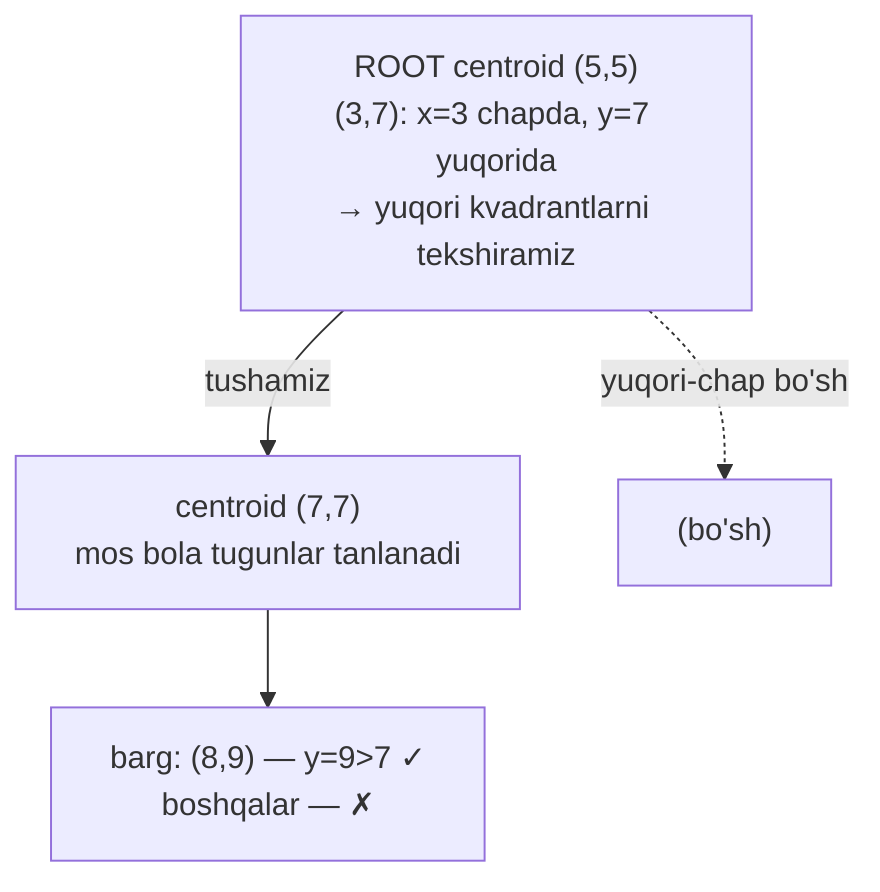
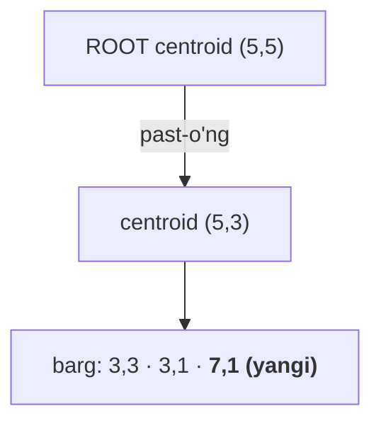
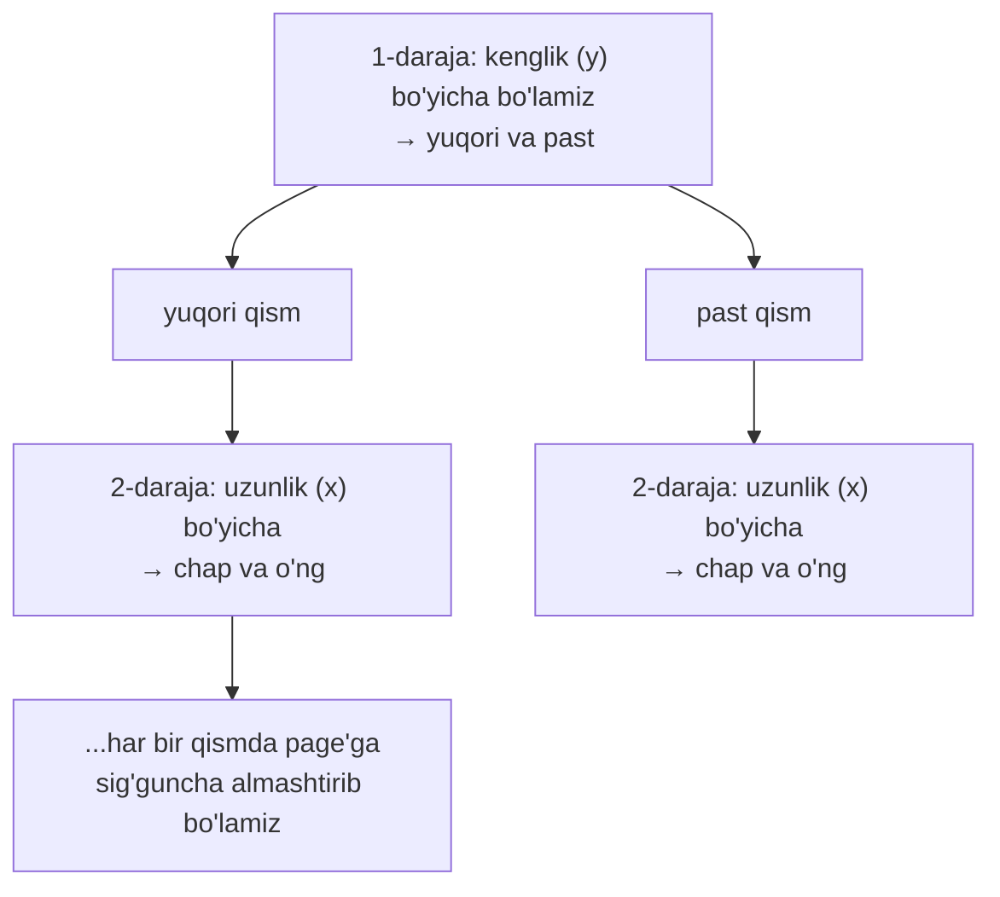
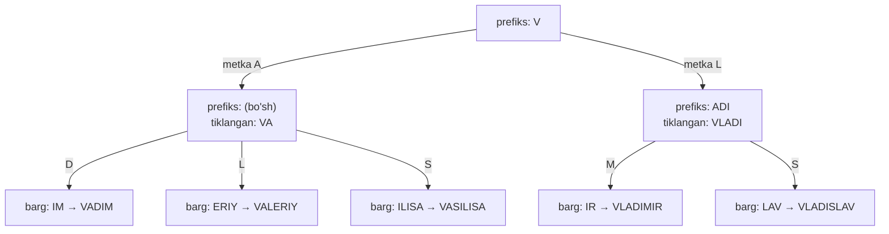
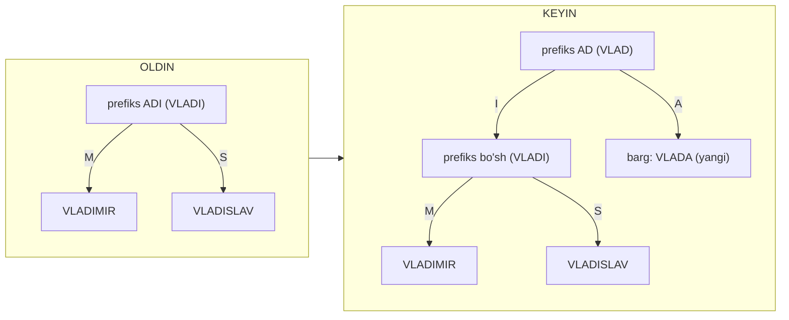

# 27. SP-GiST index

> 📖 Manba: Рогов, "PostgreSQL 17 изнутри", 27-bob ("Индекс SP-GiST")

## Nima uchun kerak?

26-darsda **GiST** bilan tanishdik: u nuqtalarni **bounding box**'lar ierarxiyasiga joylashtirar edi. Lekin u yerda bitta nozik muammoni sezib qolgandik — yuqori darajadagi to'rtburchaklar **bir-biri bilan kesishishi** mumkin edi. Kesishuv esa qidiruvni sekinlashtiradi: `(1,2)-(4,7)` hududini qidirganda biz **bir necha poddereva**'ga tushishga majbur bo'lgandik, chunki ular ustma-ust tushib qolgan.

Kesishuv qancha ko'p bo'lsa, qidiruvda shuncha ko'p "keraksiz" yo'llarni tekshirishga to'g'ri keladi. Savol tug'iladi: **agar hududlarni umuman kesishmaydigan qilib bo'lsak-chi?** Har bir nuqta faqat **bitta** hududga tegishli bo'lsa, qidiruv ancha aniq yo'nalar edi.

Aynan shu g'oyani **SP-GiST** amalga oshiradi. Nomdagi **"SP"** — **Space Partitioning** (fazoni bo'lish), **"GiST"** esa uning GiST bilan o'xshashligiga ishora: ikkalasi ham **umumlashtirilgan qidiruv daraxti** va yangi tiplarni indekslash uchun **karkas**.

> **Oltin qoida:** GiST fazoni **kesishishi mumkin bo'lgan** hududlarga bo'ladi va **balanslangan** daraxt quradi. SP-GiST fazoni **kesishmaydigan** hududlarga bo'ladi (har nuqta — bitta hududda) va natijada **balanssiz** daraxt quradi.

Bu "kesishmaslik" quadtree, k-d tree, prefix tree (trie) kabi klassik strukturalarni qurishga imkon beradi.

```mermaid
mindmap
  root(("SP-GiST index"))
    "Umumiy printsip"
      "Space Partitioning"
      "kesishmaydigan hududlar"
      "balanssiz daraxt"
      "prefiks + metka"
    "Quadtree (nuqtalar)"
      "centroid = prefiks"
      "4 kvadrant"
      "qidiruv / insert / split"
    "k-d tree"
      "2 qism (gorizontal/vertikal)"
      "prefiks = bitta koordinata"
    "Radix tree (matn)"
      "umumiy prefiks"
      "metka = keyingi bayt"
      "LIKE ^@"
    "GiST vs SP-GiST"
```

---

## 1-qism. SP-GiST umumiy printsipi

### Space Partitioning g'oyasi

SP-GiST fazoni **kesishmaydigan** hududlarga bo'ladi, ularning har biri o'z navbatida yana **rekursiv** kichik hududlarga bo'linishi mumkin. Bu yerda "fazo" — istalgan qidiruv qiymatlari sohasi (albatta ikki o'lchamli tekislik shart emas).

Bunday bo'linish **balanssiz** (nesbalansirovannoe) daraxt hosil qiladi — B-tree va GiST'dan farqli o'laroq. U quyidagi mashhur strukturalarni amalga oshirishga yaraydi:

- **quadtree** (kvadrantlar daraxti) — nuqtalar uchun;
- **k-d tree** (k o'lchamli daraxt);
- **radix tree / trie** (prefiks daraxti) — matnlar uchun.

### Chuqur daraxt va page muammosi

Bunday daraxtlar **zaif shohlanadi** (tugunning kam bolasi bor: quadtree'da eng ko'pi 4 ta, k-d tree'da 2 ta), demak **chuqur** bo'ladi.

Bu operativ xotirada muammo emas. Lekin **disk** uchun jiddiy vazifa tug'iladi: tugunlarni page'larga **samarali joylashtirish** kerak, aks holda kam I/O bilan chek qo'yib bo'lmaydi.

> **Muhim tafovut:** B-tree va GiST'da har bir daraxt tuguni **butun page'ni** egallaydi — bu yerda hech qanday joylashtirish muammosi yo'q. SP-GiST'da esa bitta page'ga **bir necha tugun** joylashtiriladi. Ichki tugunlar bir (**ichki**) page'larda, barg tugunlar boshqa (**barg**) page'larda saqlanadi.

### Prefiks va metka

SP-GiST daraxtining ichki tuguni **prefiksga** mos qiymat saqlaydi — u barcha bola tugunlar uchun bajariladigan shart. Prefiks GiST'dagi **predikat** rolini o'ynaydi. Bola tugunlarga havolalarda **metka** (label) bo'lishi mumkin.

Barg tugun elementlari **indekslanadigan qiymatni** (yoki uning qismini) va **tid**ni saqlaydi.



### Qidiruv, insert, split

- **Qidiruv** ildizdan chuqurlikka (depth-first) boradi. Qaysi tugunlarga kirishni **consistency function** tanlaydi (GiST'dagiga o'xshash):
  - **inner consistency** — ichki tugunning prefiks va metkalari asosida qaysi bola tugunlar qidiruv shartiga mos kelishini qaytaradi (ichiga tushmasdan!);
  - **leaf consistency** — barg tugundagi qiymat shartni qanoatlantiradimi.
- **Insert**da ikki funksiya ishlaydi:
  - **choose** (vibora, tanlash funksiyasi) — yangi qiymatni mavjud bola tugunga yuborish, unga yangi bola tugun yaratish yoki (qiymat prefiksga mos kelmasa) joriy tugunni **bo'lish** (split) — shulardan birini tanlaydi;
  - **picksplit** — tanlangan barg page'da joy yetmasa, qaysi tugunlarni yangi page'ga ko'chirishni hal qiladi.

> **Balanssizlikning oqibati:** turli shoxlar chuqurligi har xil bo'lishi mumkin (nuqtalar zichligiga qarab). Shu bois bir qiymatni topish vaqti boshqasidan **farq qilishi** mumkin. GiST/B-tree'da barcha barg bir xil chuqurlikda bo'lgani uchun bu bo'lmasdi.

---

## 2-qism. GiST vs SP-GiST — asosiy farq

Ikki metodni yonma-yon qo'yamiz — bu farqni ko'z oldiga keltirishga yordam beradi:



| Xususiyat | GiST | SP-GiST |
|-----------|------|---------|
| Hududlar | kesishishi mumkin | **kesishmaydi** |
| Daraxt | balanslangan | **balanssiz** |
| Barg chuqurligi | bir xil | har xil bo'lishi mumkin |
| Tugun ↔ page | 1 tugun = 1 page | 1 page = **bir necha tugun** |
| Ichki tugun sharti | predikat (bounding box) | **prefiks** |
| Bola havolalarida | — | **metka** bo'lishi mumkin |

---

## 3-qism. Quadtree nuqtalar uchun

Birinchi konkret misol — tekislikdagi nuqtalar uchun **quadtree** (derevo kvadrantov, kvadrantlar daraxti).

### Centroid va to'rtta kvadrant

Hudud tanlangan **nuqtaga nisbatan** to'rtta qismga (kvadrantga) rekursiv bo'linadi. Bu nuqta **centroid** deb ataladi va tugunning **prefiksi** bo'lib xizmat qiladi — ya'ni bola qiymatlarning joylashuvini belgilaydigan shart.



Root nuqta tekislikni to'rtga bo'ladi, keyin har bir kvadrant o'z centroid'i bilan yana to'rtga bo'linadi — yakuniy bo'linish olinguncha. **Nuqtalar zichligi** qayerda ko'p bo'lsa, o'sha yerda daraxt chuqurroq — bu balanssizlikning ko'rinishi.

Kitobdagi soddalashtirilgan misolimizni (26-darsdagi o'sha nuqtalar) quadtree ko'rinishida tuzamiz. Root centroid — `(5,5)`:



### Operator class

Nuqtalar uchun default class — **`quad_point_ops`**. Uning barcha tayanch funksiyalari **majburiy**:

```sql
=> SELECT amprocnum, amproc::regproc
   FROM pg_am am
   JOIN pg_opclass opc ON opcmethod = am.oid
   JOIN pg_amproc amop ON amprocfamily = opcfamily
   WHERE amname = 'spgist' AND opcname = 'quad_point_ops'
   ORDER BY amprocnum;
 amprocnum |          amproc
-----------+---------------------------
         1 | spg_quad_config
         2 | spg_quad_choose
         3 | spg_quad_picksplit
         4 | spg_quad_inner_consistent
         5 | spg_quad_leaf_consistent
```

| № | Funksiya | Vazifasi |
|---|----------|----------|
| 1 | config | class xususiyatlarini metodga bildiradi |
| 2 | choose | insert'da tugun tanlash |
| 3 | picksplit | split'da tugunlarni taqsimlash |
| 4 | inner consistency | ichki tugunda qaysi bolaga tushish |
| 5 | leaf consistency | barg qiymati shartga mosmi |

`quad_point_ops` GiST'dagi nuqta operatorlariga o'xshash strategiyalarni beradi (`<<` chapda, `>>` o'ngda, `<<|` pastda, `|>>` yuqorida, `~=` teng, `<@` box ichida, `<->` masofa).

### Yuqorida qidiruv — amalda

Masalan, Dikson'dan **shimolroqda** (yuqorida) joylashgan aeroportlarni topamiz — `>^` operatori bilan:

```sql
=> CREATE INDEX airports_quad_idx ON airports_big
   USING spgist(coordinates) WITH (fillfactor = 10);

=> SELECT airport_code, airport_name->>'en'
   FROM airports_big
   WHERE coordinates >^ '(80.3817,73.5167)'::point;
 airport_code |        ?column?
--------------+------------------------
 THU          | Thule Air Base
 YEU          | Eureka Airport
 YLT          | Alert Airport
 ...
(8 rows)

=> EXPLAIN (costs off) SELECT airport_code
   FROM airports_big
   WHERE coordinates >^ '(80.3817,73.5167)'::point;
                       QUERY PLAN
-----------------------------------------------------------
 Bitmap Heap Scan on airports_big
   Recheck Cond: (coordinates >^ '(80.3817,73.5167)'::point)
   ->  Bitmap Index Scan on airports_quad_idx
         Index Cond: (coordinates >^ '(80.3817,73.5167)'::point)
```

### Qidiruv qanday boradi — sodda misolda

`(3,7)` nuqtasidan **yuqorida** joylashgan nuqtalarni qidiraylik (ya'ni `y > 7`):



1. Root'dan boshlaymiz. **Inner consistency** `(3,7)` ni centroid `(5,5)` bilan solishtiradi va qaysi kvadrantlarda kerakli nuqtalar bo'lishi **mumkin**ligini aniqlaydi — ichiga tushmasdan, faqat centroid asosida.
2. `(7,7)` centroidli tugunda yana mos bola tugunlar tanlanadi. Ba'zilari **bo'sh** bo'lishi mumkin — ularni o'tkazamiz.
3. Barg tugunga yetganda, **leaf consistency** har bir nuqtani `(3,7)` shartiga solishtiradi. Faqat `(8,9)` "yuqorida" shartini qanoatlantiradi.

> **B-tree bilan farq:** SP-GiST ham bir necha shoxni tekshirishi mumkin, lekin GiST'dan farqli — hududlar **kesishmagani** uchun har bir nuqta faqat **bitta** joyda bo'ladi, ortiqcha ish kamroq.

### Insert

Insert'da **choose** funksiyasi yangi nuqtani **tegishli mavjud kvadrantga** yo'naltiradi. Masalan `(7,1)` qiymati centroid `(5,5)`ga nisbatan **past-o'ng** kvadrantga tegishli va shu tugunga qo'shiladi:



### Split — yangi centroid

Agar nuqta kvadrantiga tushganda barg tugunlar ro'yxati bitta page'ga sig'maydigan darajada **kattalashsa**, **split** yuz beradi. **Picksplit** funksiyasi barcha nuqtalar koordinatalarining o'rtachasini hisoblab **yangi centroid** aniqlaydi va bola tugunlarni yangi kvadrantlar bo'yicha **teng taqsimlaydi**.

Masalan `(2,1)` qo'shilishi tugunni to'ldirib yuborsa, `(1,1)` centroidli **yangi ichki tugun** paydo bo'ladi va `(0,0)`, `(1,2)`, `(2,1)` nuqtalari yangi kvadrantlar orasida taqsimlanadi.

### Page tashkiloti

SP-GiST'da tugun bilan page o'rtasida GiST'dagidek bir-birga aniq moslik **yo'q**. Ichki tugunlar odatda kam bolaga ega bo'lgani uchun bitta page'ga bir necha tugun joylashtiriladi:

- Ichki tugunlar — **ichki** page'larda, barg tugunlar — **barg** page'larda.
- Bitta ichki tugunga tegishli barcha barg tugunlar **bitta page**'da, ro'yxatga (list) bog'langan holda saqlanadi. Ro'yxat hech qachon bir necha page o'rtasida **uzilmaydi** — joy yetmasa boshqa page'ga ko'chiriladi yoki split bo'ladi.

> **Uch maxsus page:** SP-GiST'da **meta-page bor** (0-page). Lekin u B-tree'dagidek ildizga ishora qilmaydi — ildiz har doim **1-page**'da. NULL qiymatlar esa asosiy daraxtda saqlanmaydi; ular uchun **alohida daraxt** quriladi, ildizi **2-page**'da. Ya'ni birinchi uch page doim qat'iy: meta / asosiy ildiz / NULL ildizi.

> `pageinspect`'da SP-GiST uchun funksiyalar yo'q; buning uchun tashqi `gevel` extension'idan foydalanish mumkin.

---

## 4-qism. k-d tree nuqtalar uchun

Nuqtalar uchun **boshqa** bo'lish usulini ham taklif qilsa bo'ladi: tekislikni to'rtga emas, **ikkiga** bo'lish. Buni **`kd_point_ops`** class amalga oshiradi:

```sql
=> CREATE INDEX airports_kd_idx ON airports_big
   USING spgist(coordinates kd_point_ops);
```

G'oya: bo'lishni gorizontal va vertikal **navbatma-navbat** almashtirish:



> **Nozik nuqta — turli tiplar:** SP-GiST'da indekslanadigan qiymat, prefiks va metka **turli data type**'da bo'lishi mumkin. `kd_point_ops`'da qiymatlar — **nuqtalar**, prefikslar — **haqiqiy sonlar** (bitta koordinata — bo'lish chizig'i), metkalar esa **yo'q** (`quad_point_ops`'dagi kabi).

Har bir ichki tugunning bor-yo'g'i **ikki** bolasi bo'ladi. Usul istalgan o'lchamli fazoga umumlashadi — shuning uchun "k o'lchamli daraxt" (k-d tree) deyiladi.

---

## 5-qism. Radix tree (prefix tree) matnlar uchun

Endi SP-GiST'ning eng nafis qo'llanishi — matn satrlari uchun **radix tree** (prefiksnoe derevo, prefiks daraxti). Buni **`text_ops`** class amalga oshiradi.

Bu yerda prefiks **haqiqatan ham** prefiks: bola tugunlardagi barcha satrlar uchun **umumiy boshlang'ich qism**. Bola tugunlarga havolalar prefiksdan keyingi **birinchi bayt** bilan belgilanadi (metka). Bola tugunlarda esa prefiks va metkadan **keyingi** qismlar saqlanadi.



> **Ixchamlik:** kalitning to'liq qiymati barg tugunda **saqlanmaydi** — u ildizdan bargigacha bo'lgan barcha prefiks va metkalarni **birlashtirib** (konkatenatsiya) tiklanadi. Shu bois radix tree ba'zan B-tree'dan **ancha ixchamroq** chiqadi.

### Operator class va LIKE

`text_ops` matn uchun odatiy solishtirish operatorlarini beradi. E'tibor bering: `~<~`, `~>=~` kabi **"tilda"** operatorlar simvollar bilan emas, **baytlar** bilan ishlaydi va sortlash qoidalarini (collation) hisobga olmaydi (B-tree'dagi `text_pattern_ops`ga o'xshash, 25-dars).

```sql
=> SELECT oprname, oprcode::regproc, amopstrategy
   FROM pg_am am
   JOIN pg_opclass opc ON opcmethod = am.oid
   JOIN pg_amop amop ON amopfamily = opcfamily
   JOIN pg_operator opr ON opr.oid = amopopr
   WHERE amname = 'spgist' AND opcname = 'text_ops'
   ORDER BY amopstrategy;
 oprname |     oprcode      | amopstrategy
---------+------------------+--------------
 ~<~     | text_pattern_lt  |  1
 ~<=~    | text_pattern_le  |  2
 =       | texteq           |  3
 ~>=~    | text_pattern_ge  |  4
 ~>~     | text_pattern_gt  |  5
 <       | text_lt          | 11
 ...
 ^@      | starts_with      | 28
```

Eng qiziq operator — **`^@`** (prefiks bo'yicha qidiruv), u **`LIKE 'IVAN%'`** so'rovini tezlashtiradi:

```sql
=> CREATE INDEX tickets_spgist_idx ON tickets USING spgist(passenger_name);
=> EXPLAIN (costs off) SELECT * FROM tickets
   WHERE passenger_name LIKE 'IVAN%';
                       QUERY PLAN
--------------------------------------------------
 Bitmap Heap Scan on tickets
   Filter: (passenger_name ~~ 'IVAN%'::text)
   ->  Bitmap Index Scan on tickets_spgist_idx
         Index Cond: (passenger_name ^@ 'IVAN'::text)
```

Planner `LIKE 'IVAN%'` ni index qo'llab-quvvatlaydigan `^@ 'IVAN'` ga aylantirdi.

### Qidiruv — qiymatni tiklab borish

`name ~>=~ 'VALERIY' AND name ~<~ 'VLADISLAV'` so'rovini ko'ramiz (VALERIY dan VLADISLAV gacha, yuqori chegara **kirmaydi**):

1. **Inner consistency** ildizda chaqiriladi. U prefiks `V` va metkalar `A`, `L` ni birlashtirib nomzod qiymatlarni tiklaydi: `VA` va `VL`. Ikkalasi ham `[VALERIY, VLADISLAV)` oralig'iga tegishli bo'lishi mumkin → **ikkala shox** ham tekshiriladi.
2. `VA` shoxida uch bola tiklanadi: `VAD`, `VAL`, `VAS`. `VAD` (→ VADIM) `VALERIY` dan **kichik** → bu shox **kesib tashlanadi**. `VAL`, `VAS` mos → tushamiz.
3. `VL` shoxi (prefiks `ADI`, tiklangan `VLADI`) mos.
4. Bargga yetganda **leaf consistency** to'liq tiklangan qiymatni asl shartga soladi. Natija: **VALERIY, VASILISA, VLADIMIR** (VLADISLAV yuqori chegara sifatida chiqarib tashlanadi, VADIM esa pastda qoladi).

> ⚠️ **Muhim cheklov:** so'rovda `>=`, `<` (B-tree operatorlari) ishlatilsa-da, SP-GiST'da **oraliq bo'yicha qidiruv B-tree'dan ancha sekinroq**. B-tree'da oraliqning bitta chetiga tushib, barg page'lar zanjirini ketma-ket o'qish kifoya. Radix tree'da esa har bir shoxni alohida tekshirishga to'g'ri keladi.

### Insert — split (tugunni bo'lish)

Nuqtalar uchun choose funksiyasi yangi qiymatni **doim** mavjud kichik hududga yo'naltira olardi. Prefiks daraxtida bunday emas: yangi qiymat mavjud prefiksga **mos kelmasligi** mumkin — u holda ichki tugunni **bo'lish** kerak.

`VLADA` nomini qo'shamiz:

- Ildizdan `V` + metka `L` bo'yicha bir tugun pastga tushamiz, lekin qolgan `ADA` qismi `ADI` prefiksiga **mos kelmaydi** (umumiy qism faqat `AD`).
- Tugunni ikkiga bo'lamiz: umumiy prefiks `AD` yuqorida qoladi, qolgan `I` esa pastga metka bilan ko'chadi.



Bo'lgandan so'ng choose yana chaqiriladi: endi prefiks (`AD`) mos, lekin `A` metkali bola tugun yo'q — funksiya uni **yaratadi** va `VLADA` shu yerga tushadi.

### Xususiyatlar

Prefiks daraxtida qiymat oshkora saqlanmasa ham, **index-only scan** ishlaydi — qiymat ildizdan bargigacha tushib borishda tiklanadi (`returnable = t`). Lekin masofa operatori aniqlanmagani uchun **k-NN yo'q** (`distance_orderable = f`):

```sql
=> SELECT p.name, pg_index_column_has_property('tickets_spgist_idx', 1, p.name)
   FROM unnest(array['returnable', 'distance_orderable']) p(name);
        name        | pg_index_column_has_property
--------------------+------------------------------
 returnable         | t
 distance_orderable | f
```

> Bu satrlar uchun masofa umuman yo'q degani emas. Masalan, `pg_trgm` trigramma asosida masofa (`<->`), `fuzzystrmatch` esa Levenshtein masofasini beradi — lekin ular SP-GiST uchun operator class taqdim etmaydi.

---

## 6-qism. SP-GiST qo'llab-quvvatlaydigan boshqa tiplar

| Data type | Operator class | Struktura |
|-----------|----------------|-----------|
| point | `quad_point_ops` (default), `kd_point_ops` | quadtree / k-d tree |
| box (to'rtburchak) | `box_ops` | quadtree (4D nuqta → **16** qismga bo'linadi) |
| polygon (v11) | `poly_ops` | noaniq: bounding box + recheck |
| range | `range_ops` | quadtree (oraliq → 2D nuqta: quyi chegara = x, yuqori = y) |
| `inet` (tarmoq adresi) | `inet_ops` | **prefiks daraxti** |

> **Qachon GiST, qachon SP-GiST?** Bu indekslanadigan ma'lumot turiga sezilarli bog'liq. Masalan, PostGIS hujjatlari **kuchli kesishuvchi** obyektlar ("makaron", lapsha) uchun aynan **SP-GiST**ni tavsiya qiladi — chunki uning kesishmaydigan bo'linishi bunday holatda foydali.

---

## 7-qism. GiST va SP-GiST — yakuniy taqqoslash

```sql
=> SELECT a.amname, p.name, pg_indexam_has_property(a.oid, p.name)
   FROM pg_am a, unnest(array[
     'can_unique','can_multi_col','can_exclude','can_include'
   ]) p(name)
   WHERE a.amname = 'spgist';
 amname |     name      | pg_indexam_has_property
--------+---------------+-------------------------
 spgist | can_unique    | f
 spgist | can_multi_col | f    -- ko'p ustunli YO'Q (GiST'da bor)
 spgist | can_exclude   | t
 spgist | can_include   | t
```

| Xususiyat | GiST | SP-GiST |
|-----------|:----:|:-------:|
| Daraxt turi | balanslangan | balanssiz |
| Hududlar | kesishishi mumkin | kesishmaydi |
| Ko'p ustunli index | **ha** | **yo'q** |
| Exclusion constraint | ha | ha |
| INCLUDE ustunlar | ha (v12) | ha (v14) |
| Klasterlash (`CLUSTER`) | **ha** | **yo'q** |
| k-NN (masofa) | class'ga bog'liq | class'ga bog'liq (v12) |
| NULL saqlash | asosiy daraxtda | **alohida daraxtda** (2-page) |
| Meta-page | **yo'q** (ildiz 0-page) | **bor** (ildiz 1-page) |
| Tipik qo'llanish | fazoviy, FTS, range, kesishuvchi | nuqtalar, prefiks/matn, "lapsha" |

Ikkalasi ham **karkas**: yangi tip uchun operator class yozib, past darajadagi tashvishlarni (lock, WAL, page) metodga qoldirasiz. Farqi — **fazoni qanday bo'lishida**: GiST kesishuvga yo'l qo'yib balans saqlaydi, SP-GiST kesishmaslik evaziga balanssizlikni qabul qiladi.

---

## Xulosa

- **SP-GiST** = **Space Partitioning** + GiST karkasi: fazoni **kesishmaydigan** hududlarga rekursiv bo'ladi. Bu **balanssiz** daraxt beradi (GiST/B-tree — balanslangan).
- Bunday daraxtlar **zaif shohlanadi** va **chuqur** bo'ladi, shuning uchun bitta page'ga **bir necha tugun** joylashtiriladi (GiST/B-tree'da 1 tugun = 1 page).
- Ichki tugun **prefiks** saqlaydi (GiST'dagi predikat rolida), bola havolalarida **metka** bo'lishi mumkin. Qidiruv **inner/leaf consistency**, insert **choose/picksplit** orqali boradi.
- **Quadtree**: **centroid** tekislikni 4 kvadrantga bo'ladi. `quad_point_ops` (5 majburiy funksiya). Insert nuqtani o'z kvadrantiga yo'naltiradi; to'lsa — split yangi centroid hisoblaydi.
- **k-d tree** (`kd_point_ops`): tekislikni navbatma-navbat gorizontal/vertikal **ikkiga** bo'ladi; qiymat/prefiks/metka **turli tip**'da (prefiks = bitta koordinata).
- **Radix tree** (`text_ops`): matn uchun **umumiy prefiks** daraxti, metka = keyingi bayt. Qiymat oshkora saqlanmaydi (tiklanadi → **index-only scan** ishlaydi, lekin ixcham). `^@` bilan `LIKE 'x%'` tezlashadi. Insert'da prefiks mos kelmasa — tugun **bo'linadi**.
- SP-GiST **page tashkiloti**: 0 = meta, 1 = asosiy ildiz, 2 = NULL daraxti ildizi. Bir ichki tugunning barglar ro'yxati bir page'da, **uzilmaydi**.
- GiST vs SP-GiST: **ko'p ustunli** index va **CLUSTER** faqat GiST'da. Tanlash ma'lumot turiga bog'liq (kuchli kesishuvchi obyektlar uchun SP-GiST tavsiya etiladi).

## Nazorat savollari

1. "SP" nimani anglatadi? SP-GiST fazoni GiST'dan qanday boshqacha bo'ladi va bu nima uchun **balanssiz** daraxt beradi?
2. Nega SP-GiST'da bitta page'ga bir necha tugun joylashtiriladi, GiST/B-tree'da esa har bir tugun butun page'ni egallaydi?
3. Quadtree'da **centroid** nima rolini o'ynaydi? Insert paytida yangi nuqta qanday joylashadi va **split** qachon hamda qanday yuz beradi?
4. k-d tree quadtree'dan nimasi bilan farq qiladi? Nega uning ichki tugunlarida faqat ikkita bola bo'ladi va bu yerda prefiks qanday data type'da?
5. Radix tree'da kalitning to'liq qiymati barg tugunda saqlanmasa, index-only scan qanday ishlaydi? Bu nima uchun index'ni ixcham qiladi?
6. `LIKE 'IVAN%'` so'rovi radix tree bilan qanday tezlashtiriladi (`^@` operatori)? Nega oraliq bo'yicha (`>=`, `<`) qidiruv SP-GiST'da B-tree'dan sekinroq?
7. Radix tree'ga yangi qiymat prefiksga mos kelmasa nima bo'ladi? `VLADA` qo'shilishida `ADI` tuguni qanday bo'linadi?
8. GiST bilan SP-GiST'ni tanlashda qaysi xususiyatlar hal qiluvchi (ko'p ustunli, CLUSTER, NULL saqlash, kesishuvchi obyektlar)? Har biriga bittadan farqni ayting.
