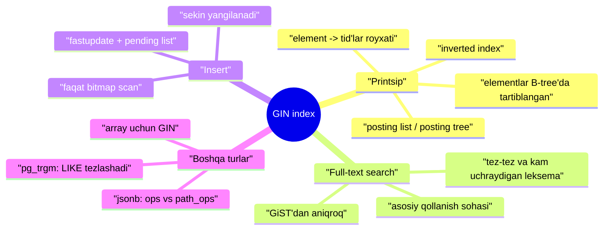
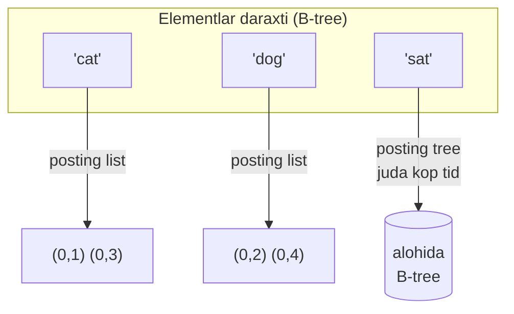
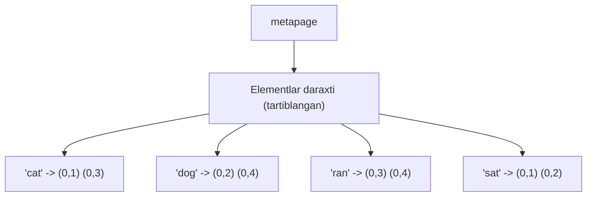
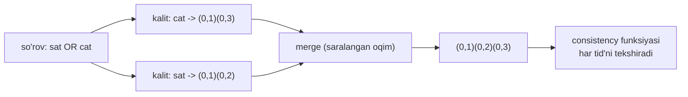
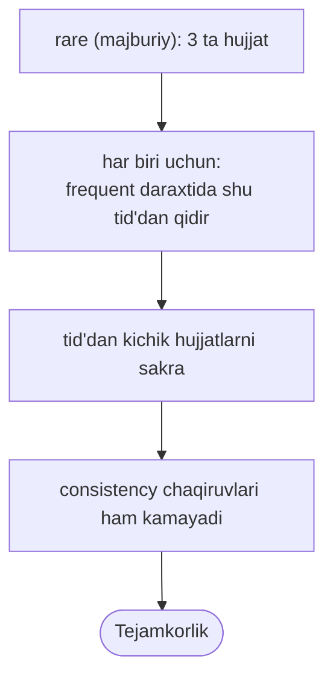
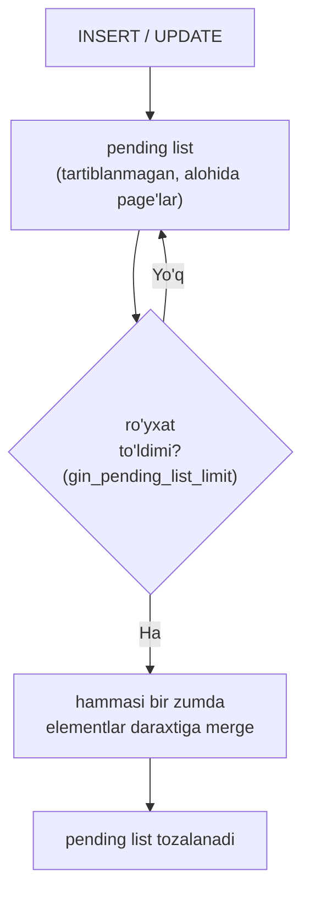
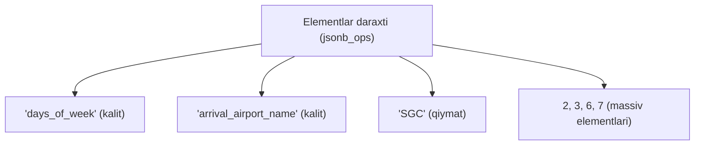
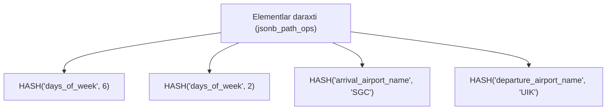

# 28. GIN index

> 📖 Manba: Рогов, "PostgreSQL 17 изнутри", 28-bob ("Индекс GIN")

## Nima uchun kerak?

O'tgan darslarda index'larni ko'rdik: **B-tree** (25-dars) tartib turlari uchun, **GiST** (26-dars) geometrik va to'plamli ma'lumot uchun. Lekin ularning barchasi bitta narsani nazarda tutadi: index qilinadigan qiymat **atomar** — uni butunligicha bir kalit sifatida saqlaymiz.

Endi boshqa vaziyat. Aytaylik, table'da **matn hujjatlar** bor va biz "ichida `postgres` so'zi bor hujjatlarni top" degan so'rovni tez bajarmoqchimiz. Hujjat atomar emas — u **so'zlardan** (leksemalardan) iborat. Yoki `jsonb` ustuni — u kalitlar va qiymatlardan tashkil topgan. Yoki massiv — elementlardan.

Bunday **tarkibiy (composite)** qiymatlarni oddiy index bilan tezlashtirib bo'lmaydi:

- B-tree butun hujjatni kalit qiladi — `WHERE doc @@ 'postgres'` uchun foydasiz.
- GiST full-text search'ni qo'llaydi, lekin **signatura** (imzo) orqali — noaniq, ko'p yolg'on ishga tushish beradi (26-dars).

Mana shu muammoni **GIN** (access method `gin`) hal qiladi. GIN — **Generalized Inverted Index**, ya'ni umumlashtirilgan **teskari (inverted) index**. U qiymatning o'zini emas, balki uning **har bir elementini** index qiladi va har elementdan u uchraydigan **barcha qiymatlarga** o'tish imkonini beradi.

> **Oltin g'oya:** GIN — bu kitob oxiridagi **predmetli ko'rsatkich** (subject index). Ko'rsatkichda har bir muhim atama va u uchraydigan **sahifalar ro'yxati** bor. Atamani topib, uning sahifalariga o'tasiz — butun kitobni varaqlamaysiz.



---

## 1-qism. Umumiy printsip — inverted index

GIN **elementlardan tashkil topgan** data turlari bilan ishlaydi: full-text search kontekstida hujjat lekseamalardan iborat, `jsonb` — kalit va qiymatlardan, massiv — elementlardan.

Diqqat qiling: GiST'da butun qiymat index qilinardi. GIN'da esa **faqat elementlar** index qilinadi. Har bir elementdan index bo'yicha u uchraydigan **barcha qiymatlarga** o'tish mumkin.

**Analogiya — kitob ko'rsatkichi.** Ko'rsatkich alifbo bo'yicha tuzilgan (aks holda undan foydalanib bo'lmaydi). Xuddi shunday, GIN ham tarkibiy qiymat elementlarini **tartiblash** mumkinligiga tayanadi va asosiy struktura sifatida **B-tree** (25-dars) ishlatadi.

> **Analogiya chegarasi:** GIN'ning "element daraxti" **oddiy** B-tree emas. U dastlab shunga mo'ljallangan: turli qiymatlar **nisbatan kichik, ko'p marta takrorlanadigan** elementlar to'plamidan iborat bo'ladi. Shu sababli u yengilroq amalga oshirilgan.

Bu farazdan ikki muhim xulosa chiqadi:

**1) Element index'da bitta nusxada saqlanadi.** Har bir element bilan **versiya identifikatorlari ro'yxati** (tid'lar ro'yxati) bog'langan:

- Agar ro'yxat katta bo'lmasa — u element bilan **birga** saqlanadi. Bu **posting list** (yassi ro'yxat).
- Ro'yxat kattalashsa — u **alohida B-tree**'ga chiqariladi. Bu **posting tree** (identifikatorlar daraxti).
- Nafaqat daraxtlar, balki identifikator ro'yxatlari ham **tartiblangan** — bu tezlashtiradi va joyni tejaydi.

**2) Elementni daraxtdan o'chirishga hojat yo'q.** Agar elementning identifikatorlari to'plami bo'shab qolsa ham, katta ehtimol bilan o'sha element boshqa qiymat tarkibida **yana paydo bo'ladi**. Shuning uchun uni o'chirish behuda.



Demak, GIN-index **elementlar daraxti**dan iborat bo'lib, uning barg (leaf) yozuvlariga **yassi ro'yxatlar** yoki **identifikatorlar daraxtlari** bog'langan.

GiST va SP-GiST (26–27-darslar) kabi, GIN ham turli data turlarini index qila oladi — buning uchun **operator class**'ning soddalashtirilgan interfeysini beradi. Bu class operatorlari odatda: index qilingan tarkibiy qiymat berilgan **elementlar to'plamiga mos keladimi** — shuni tekshiradi (masalan, full-text search'da `@@` operatori hujjat so'rovga mos kelishini tekshiradi).

---

## 2-qism. Full-text search uchun GIN

GIN'ning asosiy qo'llanish sohasi — **full-text search**'ni tezlashtirish. Bu yerda tarkibiy qiymatlar — **hujjatlar** (`tsvector`), elementlar esa — **lekseamalar**.

Konseptual misolni ko'raylik. To'rtta qisqa hujjatimiz bor (`ctid` — table dagi versiya identifikatori):

| ctid | hujjat | lekseamalar |
|------|--------|-------------|
| (0,1) | "the cat sat" | cat, sat |
| (0,2) | "the dog sat" | dog, sat |
| (0,3) | "the cat ran" | cat, ran |
| (0,4) | "the dog ran" | dog, ran |

GIN-index quramiz:

```sql
=> CREATE INDEX ts_gin_idx ON ts USING gin(doc_tsv);
```

Index ichida lekseamalar tartiblangan holda saqlanadi, har biriga tid ro'yxati bog'lanadi:



### B-tree'dan farqlari

GIN-index tashqi ko'rinishdan B-tree'ga o'xshaydi, lekin farqlari bor:

- **Ortiqcha chap kalit saqlanmaydi.** B-tree'ning ichki node'larida eng chap kalit ortiqchaligi sababli bo'sh qoldiriladi (25-dars); GIN'da esa u **umuman saqlanmaydi**. Shu sababli bola node'larga havolalar ham siljiydi.
- **Yuqori kalit o'z joyida.** GIN'da yuqori kalit haqiqiy eng o'ng pozitsiyada turadi.
- **Bir yo'nalishli ro'yxat.** B-tree'da bir darajadagi node'lar **ikki tomonlama** ro'yxat bilan bog'langan; GIN'da esa **bir tomonlama**, chunki daraxt bo'ylab aylanish har doim **faqat bir tomonga** bo'ladi.

### Page tashkiloti

Page tuzilishi bo'yicha GIN B-tree'ga juda o'xshaydi. Uning ichiga **pageinspect** orqali qaraymiz. Katta real misol uchun `pgsql-hackers` pochta arxivi table'iga index quramiz (26-darsda ishlatgandek):

```sql
=> CREATE INDEX mail_gin_idx ON mail_messages USING gin(tsv);
```

**0-page (metapage)** umumiy statistikani saqlaydi — elementlar soni va turli tipdagi page'lar soni:

```sql
=> SELECT * FROM gin_metapage_info(get_raw_page('mail_gin_idx',0)) \gx
-[ RECORD 1 ]----+-----------
pending_head     | 4294967295
pending_tail     | 4294967295
tail_free_size   | 0
n_pending_pages  | 0
n_pending_tuples | 0
n_total_pages    | 23139
n_entry_pages    | 13713
n_data_pages     | 9425
n_entries        | 999189
version          | 2
```

GIN index page'larning **maxsus sohasida** (special area) page turini belgilovchi bitlarni saqlaydi. Page turlari bo'yicha sanaymiz:

```sql
=> SELECT flags, count(*)
   FROM generate_series(0,23138) AS p, -- n_total_pages
        gin_page_opaque_info(get_raw_page('mail_gin_idx',p))
   GROUP BY flags
   ORDER BY 2;
         flags          | count
------------------------+-------
 {meta}                 |     1
 {}                     |   156
 {data}                 |  1524
 {data,leaf,compressed} |  7901
 {leaf}                 | 13557
(5 rows)
```

Buni o'qib chiqamiz:

| flags | Ma'nosi |
|-------|---------|
| `{meta}` | metapage (bitta) |
| `{}` | elementlar daraxtining ichki page'lari |
| `{leaf}` | elementlar daraxtining barg page'lari |
| `{data}` | identifikatorlar daraxti (posting tree) ichki page'lari |
| `{data,leaf,compressed}` | posting tree barg page'lari (siqilgan) |

`data` belgisi — identifikatorlar daraxtiga, uning yo'qligi — elementlar daraxtiga tegishli. `leaf` — barg page'lar.

Barg page'lardagi identifikatorlarni ham ko'rish mumkin. Har bir yozuv **bitta identifikator emas, kichik ro'yxat** saqlaydi:

```sql
=> SELECT left(tids::text,60)||'...' tids
   FROM gin_leafpage_items(get_raw_page('mail_gin_idx',26));
 tids
-------------------------------------------------------------
 {"(4790,2)","(4790,3)","(4790,4)","(4791,2)","(4793,1)","(47...
 {"(5024,3)","(5024,5)","(5026,2)","(5027,6)","(5028,2)","(50...
 ...
(28 rows)
```

> **Siqish (compression).** Ro'yxatdagi identifikatorlar tartiblangani uchun ma'lumot siqiladi (shundan `compressed` belgisi). Olti baytli `tid` o'rniga **oldingi qiymatdan farq** saqlanadi va u o'zgaruvchan sonda bayt bilan kodlanadi — farq qancha kichik bo'lsa, shuncha kam joy egallaydi.

### Operator class

`tsvector_ops` operator class'ining oporna funksiyalari:

```sql
=> SELECT amprocnum, amproc::regproc
   FROM pg_am am
   JOIN pg_opclass opc ON opcmethod = am.oid
   JOIN pg_amproc amop ON amprocfamily = opcfamily
   WHERE amname = 'gin' AND opcname = 'tsvector_ops'
   ORDER BY amprocnum;
 amprocnum |             amproc
-----------+---------------------------------
         1 | gin_cmp_tslexeme
         2 | pg_catalog.gin_extract_tsvector
         3 | pg_catalog.gin_extract_tsquery
         4 | pg_catalog.gin_tsquery_consistent
         5 | gin_cmp_prefix
         6 | gin_tsquery_triconsistent
(6 rows)
```

Har birining vazifasi:

| № | Funksiya | Vazifasi |
|---|----------|----------|
| 1 | cmp | ikki elementni (leksema) solishtiradi |
| 2 | extract_tsvector | **hujjatdan** lekseamalarni ajratadi |
| 3 | extract_tsquery | **so'rovdan** lekseamalarni ajratadi |
| 4 | consistent | topilgan hujjat so'rovga mos kelishini aniqlaydi (**aniq** ma'lumot bilan) |
| 5 | cmp_prefix | qisman qidiruv — prefiks bo'yicha moslikni tekshiradi |
| 6 | triconsistent | consistent, lekin **noaniqlik** sharoitida (uch holatli) |

Nozik nuqtalar:

- **1-funksiya** ikki elementni solishtiradi. Agar leksema oddiy SQL turi bo'lib, unga B-tree operator class'i bo'lganida, GIN o'sha class solishtirish operatorlarini avtomatik ishlatgan bo'lardi.
- **2 va 3-funksiya** farqli, chunki hujjat va so'rov turli turlarda (`tsvector` va `tsquery`). So'rov funksiyasi qidiruv **qanday bajarilishini** ham belgilaydi.
- **4 va 6 — consistency funksiyalari.** 4-si aniq ma'lumot oladi (qaysi leksema hujjatda bor, qaysi yo'q). 6-si esa **noaniqlik** sharoitida ishlaydi (ba'zi lekseamalar uchun hali noma'lum). Class ikkalasini ham amalga oshirishi shart emas — bittasi yetadi, lekin unda qidiruv samaradorlikda yutqazishi mumkin.

### Qidiruv jarayoni

`sat OR cat` so'rovini ko'raylik (ikki leksema "yoki" bilan bog'langan).

**1-qadam.** Oporna funksiya so'rovdan **qidiruv kalitlarini** ajratadi: `sat` va `cat`.

**2-qadam.** So'rov "ushbu lekseamalar bo'lsin" deb talab qilgani uchun **kamida bitta** kalitni o'z ichiga olgan hujjatlar identifikatorlari ro'yxati tuziladi. Buning uchun elementlar daraxtida har kalit identifikatorlari topilib, ular **bitta umumiy ro'yxatga** birlashtiriladi. Barcha identifikatorlar tartiblangani uchun bu **saralangan oqimlarni birlashtirish (merge)** orqali bajariladi (23-dars).



> **Muhim:** shu bosqichda kalitlar `AND`, `OR` yoki boshqa shart bilan bog'langani **hali muhim emas** — daraxt bo'yicha qidiruv "dvigateli" faqat kalitlar ro'yxati bilan ishlaydi va so'rov ma'nosini bilmaydi.

**3-qadam.** Topilgan har bir identifikator **consistency oporna funksiyasi** bilan tekshiriladi. Aynan shu funksiya so'rovni qanday talqin qilishni biladi va faqat mos identifikatorlarni qoldiradi (yoki hech bo'lmasa mos **kelishi mumkin** bo'lganlarni — ular table bo'yicha qayta tekshiriladi).

Bu holatda consistency `OR` bo'lgani uchun barcha topilgan tid'larni qoldiradi:

| tid | cat | sat | consistency |
|-----|:---:|:---:|:-----------:|
| (0,1) | + | + | ✅ |
| (0,2) | – | + | ✅ |
| (0,3) | + | – | ✅ |

### Prefiks bo'yicha qidiruv

So'rovda oddiy leksema o'rniga **prefiks** ko'rsatilishi mumkin. Bu foydali: foydalanuvchi so'zning birinchi harflarini yozib, natija kutadi. Masalan `ca:*` so'rovi `ca` bilan boshlanadigan barcha lekseamalarni (`cat`, `car`, `care`...) topadi. Bunda lekseamalar 5-oporna funksiya (`cmp_prefix`) bilan solishtiriladi.

---

## 3-qism. Tez-tez va kam uchraydigan lekseamalar

Bu — GIN'ning eng chiroyli optimizatsiyalaridan biri.

**Muammo:** agar so'rovdagi leksema **tez-tez** uchrasa, uning identifikatorlari ro'yxati **juda uzun** bo'ladi — bu qimmat. Yaxshiyamki, agar so'rovda **kam uchraydigan** leksema ham bo'lsa, buni ko'pincha oldini olish mumkin.

`frequent AND rare` so'rovini ko'raylik — masalan bir hujjat to'plamida `rare` leksema 3 marta, `frequent` leksema 6 marta uchraydi. Ikkala lekseamani teng huquqli deb, ikkalasi bo'yicha to'liq ro'yxat yig'ish o'rniga:

- **kam** uchraydigan leksema **majburiy** (obyazatelnaya) deb belgilanadi;
- **tez-tez** uchraydigani **qo'shimcha** (dopolnitelnaya) deb.

Sababi (so'rov semantikasi bilan): tez-tez uchraydigan leksemali hujjat so'rovga **faqat** kam uchraydigan leksema ham bo'lsagina mos keladi.

Algoritm:

1. Avval index bo'yicha kam uchraydigan lekseamani o'z ichiga olgan **birinchi** hujjat topiladi (masalan identifikatori `(2,2)`).
2. Keyin shu hujjatda tez-tez uchraydigan leksema bor-yo'qligini tekshirish kerak, lekin `(2,2)`'dan **kichik** barcha hujjatlarni darhol **o'tkazib yuborish** mumkin.
3. Tez-tez uchraydigan lekseamaga ko'p identifikator to'g'ri kelgani uchun ular ehtimol **alohida daraxtda** (posting tree) — bu bir qancha page'ni sakrab o'tishga imkon beradi.
4. Protsedura kam uchraydigan lekseamaning keyingi qiymati uchun takrorlanadi.

Natijada tekshiriladigan ro'yxat uzunligi **kam uchraydigan leksema uchrashlari soniga teng** bo'ladi (bu misolda 3 ta), 6 emas.



> **Umumlashtirish:** algoritm lekseamalarni **kam uchraydigandan tez-tez uchraydiganga** qarab tartiblaydi va bittalab majburiylar ro'yxatiga qo'shadi — qolganlari **o'zicha** hujjat mosligini ta'minlay olmaguncha. Bu ikkitadan ortiq lekseamada ham ishlaydi.

### Amalda tekshirish

Pochta arxivida ikkita so'z olamiz — biri tez-tez, biri kam uchraydigan:

```sql
=> SELECT word, ndoc
   FROM ts_stat('SELECT tsv FROM mail_messages')
   WHERE word IN ('wrote', 'tattoo');
  word  |  ndoc
--------+--------
 wrote  | 231173
 tattoo |      2
(2 rows)
```

`wrote` 231173 ta hujjatda, `tattoo` atigi 2 tada. Ikkalasi ham bor bitta hujjat topamiz:

```sql
=> \timing on
=> SELECT count(*) FROM mail_messages
   WHERE tsv @@ to_tsquery('wrote & tattoo');
 count
-------
     1
(1 row)
Time: 0,456 ms
```

So'rov deyarli faqat `tattoo` bo'yicha qidiruv kabi tez bajarildi:

```sql
=> SELECT count(*) FROM mail_messages
   WHERE tsv @@ to_tsquery('tattoo');
 count
-------
     2
(1 row)
Time: 0,340 ms
```

Lekin faqat `wrote` bo'yicha qidiruv **ancha uzoq** davom etadi:

```sql
=> SELECT count(*) FROM mail_messages
   WHERE tsv @@ to_tsquery('wrote');
  count
--------
 231173
(1 row)
Time: 302,089 ms
```

> **Xulosa:** `wrote & tattoo` 0.456ms, `wrote` yakka o'zi 302ms. Kam uchraydigan `tattoo` majburiy bo'lgani uchun tez-tez uchraydigan `wrote`'ning ulkan ro'yxati deyarli ochilmadi. **Lekseamalar chastotasini bilish** samarali merge'ning kaliti.

---

## 4-qism. Insert va fastupdate

### Nega GIN sekin yangilanadi?

GIN-index'ga element qo'shilganda mavjud elementlar **dublikat qilinmaydi** — mavjud elementning identifikatorlar to'plami (ro'yxat yoki daraxt) **kengaytiriladi**. Ro'yxat index yozuvining qismi bo'lgani va page'da ko'p joy egallay olmagani uchun, u to'lib qolsa **daraxtga** aylantiriladi.

Muammo shundaki: **bitta hujjatda odatda ko'p leksema bor**. Shuning uchun bitta-yu-bitta hujjatni yaratish/o'zgartirishda index daraxtiga **ko'plab o'zgarish** kiritishga to'g'ri keladi. Aynan shu sabab GIN-index **nisbatan sekin yangilanadi**.

Boshqa tomondan, agar bir vaqtda bir necha hujjat o'zgarishini index'da hisobga olsak, umumiy ish hajmi **kamayadi** — chunki hujjatlarning bir qism lekseamasi ehtimol **umumiy** bo'ladi.

### fastupdate va pending list

Aynan shu sababli GIN **kechiktirilgan yangilanish rejimi**ni taklif qiladi — `fastupdate` storage parametri (default **yoqilgan**).

Bu rejimda o'zgarishlar **alohida tartiblanmagan ro'yxat**da to'planadi. U elementlar daraxtidan **tashqarida**, alohida page'larda (list pages) saqlanadi. Ro'yxat yetarlicha katta bo'lganda, barcha to'plangan o'zgarishlar **bir zumda** index'ga kiritiladi va ro'yxat tozalanadi.



Ro'yxatning maksimal o'lchami `gin_pending_list_limit` (default **4MB**) yoki index'ning shu nomli storage parametri bilan belgilanadi.

> **fastupdate'ning narxi.** U **qidiruvni sekinlashtiradi**: daraxtdan tashqari butun tartiblanmagan ro'yxatni ham ko'rish kerak. Bundan tashqari insert vaqti **kamroq bashoratli** bo'ladi — navbatdagi o'zgarishda ro'yxat to'lib, qimmat merge kerak bo'lishi mumkin. Bu qisman yumshatiladi: merge index tozalanganda (VACUUM, 6-dars) ham, ya'ni **asinxron** bajariladi.

### Index qurishda

Yangi index qurilganda ham elementlar bittalab emas, **kechiktirilgan** qo'shiladi (bittalab juda sekin bo'lardi). Disk'dagi ro'yxat o'rniga o'zgarishlar **operativ xotira**da (`maintenance_work_mem`, default **64MB**) to'planadi va to'lganda index'ga tashlanadi. Xotira qancha ko'p bo'lsa, index shuncha tez quriladi.

> **GIN vs GiST.** Keltirilgan misollar GIN'ning qidiruv **aniqligida** GiST signatura daraxtidan ustunligini ko'rsatadi. Shuning uchun ko'pchilik hollarda full-text search uchun aynan **GIN** ishlatiladi. Ammo GIN'ning **sekin yangilanishi** muammosi, agar ma'lumot faol o'zgarsa, GiST foydasiga tanlovga ta'sir qilishi mumkin.

---

## 5-qism. Faqat bitmap scan va gin_fuzzy_search_limit

GIN access method natijani **har doim bitmap** (bitli karta) ko'rinishida qaytaradi; table identifikatorlarini bittalab olib bo'lmaydi. Boshqacha aytganda, GIN **BITMAP SCAN** xususiyatini qo'llaydi, lekin **INDEX SCAN**'ni emas (20-dars).

**Sababi — aynan pending list.** Index bo'yicha murojaatda avval ro'yxat ko'rilib bitmap tuziladi, keyin bitmap daraxt ma'lumoti bilan yangilanadi. Agar qidiruv jarayonida ro'yxat daraxt bilan birlashtirilib qolsa (index yangilanishi yoki tozalash sabab), **bir xil qiymat ikki marta** kelib qolishi mumkin — bu ruxsat etilmaydi. Lekin bitmap holatida bu muammo emas: bir xil bit shunchaki ikki marta o'rnatiladi.

Natijada `LIMIT` GIN bilan **unchalik samarali emas**: bitmap baribir **to'liq** quriladi va uni qurish umumiy narxning katta qismi bo'lishi mumkin:

```sql
=> EXPLAIN SELECT * FROM mail_messages
   WHERE tsv @@ to_tsquery('hacker')
   LIMIT 1000;
                          QUERY PLAN
-------------------------------------------------------------
 Limit (cost=354.36..1856.38 rows=1000 width=1255)
   -> Bitmap Heap Scan on mail_messages
        (cost=354.36..74313.49 rows=49240 width=1255)
        Recheck Cond: (tsv @@ to_tsquery('hacker'::text))
        -> Bitmap Index Scan on mail_gin_idx
             (cost=0.00..342.05 rows=49240 width=0)
             Index Cond: (tsv @@ to_tsquery('hacker'::text))
(7 rows)
```

Shuning uchun GIN'da **index'dan olinadigan natijalar sonini cheklash**ning maxsus imkoni bor — `gin_fuzzy_search_limit` parametri (default **0** = ishlamaydi). Uni o'rnatsangiz, index metodi taxminan ko'rsatilgan miqdordagi qatorni olish uchun **ba'zi qiymatlarni tasodifan o'tkazib yuboradi** (shundan "fuzzy"):

```sql
=> SET gin_fuzzy_search_limit = 1000;
=> SELECT count(*) FROM mail_messages WHERE tsv @@ to_tsquery('hacker');
 count
-------
   757
(1 row)

=> SELECT count(*) FROM mail_messages WHERE tsv @@ to_tsquery('hacker');
 count
-------
   753
(1 row)
=> RESET gin_fuzzy_search_limit;
```

> So'rovlarda `LIMIT` **yo'qligiga** e'tibor bering — natija baribir har safar boshqacha. Bu index va table bo'yicha murojaatda turli ma'lumot olishning yagona "qonuniylashtirilgan" usuli. Planner bu xususiyatni **bilmaydi** va narxni hisoblashda hisobga olmaydi.

---

## 6-qism. GIN cheklovlari va RUM index

GIN qanchalik kuchli bo'lmasin, full-text search'ning barcha muammosini hal qilmaydi:

- `tsvector` turida lekseamalar **pozitsiyalari** bor, lekin ular index'ga **tushmaydi**. Bu **fraza bo'yicha qidiruv**ni (lekseamalar yaqinligi hisobga olinadigan) samarali qilishga to'sqinlik qiladi.
- Qidiruv tizimlari natijani odatda **relevantlik** (mos kelish darajasi) tartibida qaytaradi. GIN esa **tartiblovchi operatorlarni** qo'llamaydi — yagona yo'l har bir natija qatori uchun ranjirlash funksiyasini hisoblash, bu esa sekin.

Bu kamchiliklar **RUM** index metodida bartaraf etilgan (nomi GIN qisqartmasi ma'nosiga shubha uyg'otadi). RUM — **uchinchi tomon** metodi (PGDG repozitoriysida paket sifatida ham, manba kodida ham mavjud). U GIN asosida qurilgan, ikki tamoyilan farqi bor:

1. **Kechiktirilgan rejimdan voz kechilgan** — buning hisobiga nafaqat bitmap scan, balki oddiy **index scan** ham, **tartiblovchi operatorlar** ham qo'llaniladi.
2. Index kalitlariga **yordamchi ma'lumot** qo'shish mumkin (qisman `INCLUDE` ustunlariga o'xshaydi, lekin ma'lumot aniq bir kalitga bog'lanadi). Full-text search'da RUM leksema uchrashlarini ularning hujjatdagi **pozitsiyalari** bilan bog'laydi — bu fraza qidiruvi va ranjirlash bo'yicha natija berishni tezlashtiradi.

> **RUM narxi:** sekin yangilanish va kattaroq index hajmi. Bundan tashqari, kengaytma bo'lgani uchun RUM **unifikatsiyalangan jurnal yozuvlari** mexanizmidan foydalanadi — u yadroga o'rnatilgan jurnaldan sekinroq ishlaydi va ko'proq WAL (10-dars) generatsiya qiladi.

---

## 7-qism. Trigram index (pg_trgm) — LIKE'ni tezlashtirish

Bu — **eng amaliy** mavzu. Ko'pincha `WHERE name LIKE '%son%'` yoki `ILIKE` kabi so'rovlar yozamiz. Oddiy B-tree bunday so'rovni **tezlashtira olmaydi** — chunki `%` boshida bo'lgani uchun prefiks yo'q, index foydasiz, faqat Seq Scan qoladi. Mana shu yerda `pg_trgm` kengaytmasi yordamga keladi.

**Trigram** — so'zdagi uchta ketma-ket harfdan iborat bo'lak. `pg_trgm` so'zlar o'xshashligini mos keladigan trigramlar sonini solishtirib aniqlaydi. Buni full-text search bilan birga ishlatib, hatto **xato yozilgan** so'zlar variantlarini ham topish mumkin.

`gin_trgm_ops` operator class matn qatorlarini index qiladi, lekin elementlar sifatida so'z yoki leksema emas, **barcha uch harfli bo'laklar** (podstroka) ajratiladi (faqat harf va raqamlar; boshqa belgilar tashlanadi). Trigramlar so'zning boshiga bo'sh joy qo'shib olinadi:

```sql
=> CREATE EXTENSION pg_trgm;
=> SELECT unnest(show_trgm('cat'));
 unnest
--------
 "  c"
 " ca"
 "cat"
 "at "
(4 rows)
```

`cat` so'zi to'rtta trigramga bo'linadi. Endi tez-tez kerak bo'ladigan so'rovni ko'raylik. Aytaylik, `words` table'ida ko'p so'z bor va biz ichida `cat` bo'lganlarni izlaymiz:

```sql
=> CREATE INDEX words_trgm_idx ON words USING gin(word gin_trgm_ops);
=> EXPLAIN (costs off) SELECT * FROM words WHERE word LIKE '%cat%';
                     QUERY PLAN
----------------------------------------------------
 Bitmap Heap Scan on words
   Recheck Cond: (word ~~ '%cat%'::text)
   -> Bitmap Index Scan on words_trgm_idx
        Index Cond: (word ~~ '%cat%'::text)
(4 rows)
```

`LIKE '%cat%'` endi index orqali ishlaydi! GIN `cat` trigramini o'z ichiga olgan qatorlarni topadi, keyin table bo'yicha qayta tekshiradi.

Class quyidagi operatorlarni qo'llaydi:

| Operator | Ma'nosi |
|----------|---------|
| `%` | o'xshashlik (similarity) |
| `~~`, `~~*` | `LIKE`, `ILIKE` |
| `~`, `~*` | regulyar ifoda (regex), registrga sezgir/sezgirmas |
| `%>`, `%>>` | so'z o'xshashligi (word similarity) |
| `=` | tenglik |

Ishlash mexanizmi:

- **Noaniq solishtirish** (`%`, `%>`, `%>>`): masofa = so'rov-qatordagi mos keladigan trigramlar sonining umumiy songa nisbati. GIN tartiblovchi operatorlarni qo'llamagani uchun barcha operatorlar **bulli** bo'lishi kerak. Shuning uchun consistency funksiyasi masofani hisoblab, u belgilangan **chegaradan oshmasa** ijobiy hukm beradi.
- **`=` va `LIKE`**: consistency qiymatda so'rov-qatorning **barcha trigramlari** bo'lishini talab qiladi.
- **Regex**: ancha murakkab tekshiriladi.

> **Muhim:** trigram bo'yicha qidiruv **har doim noaniq** va **har doim table bo'yicha qayta tekshiriladi**. Index nomzodlarni tezda topib beradi, aniqlikni table hal qiladi.

---

## 8-qism. Massiv uchun GIN

Mos keladigan yana bir tur — **massiv**. Massiv elementlari bo'yicha GIN-index massivlar kesishishini va biror massivning boshqasiga kirishini tezroq topishga imkon beradi:

```sql
=> SELECT amopopr::regoperator, oprcode::regproc, amopstrategy
   FROM pg_am am
   JOIN pg_opclass opc ON opcmethod = am.oid
   JOIN pg_amop amop ON amopfamily = opcfamily
   JOIN pg_operator opr ON opr.oid = amopopr
   WHERE amname = 'gin' AND opcname = 'array_ops'
   ORDER BY amopstrategy;
        amopopr        |    oprcode     | amopstrategy
-----------------------+----------------+--------------
 &&(anyarray,anyarray) | arrayoverlap   |            1
 @>(anyarray,anyarray) | arraycontains  |            2
 <@(anyarray,anyarray) | arraycontained |            3
 =(anyarray,anyarray)  | array_eq       |            4
(4 rows)
```

| Operator | Ma'nosi |
|----------|---------|
| `&&` | kesishadi (umumiy element bor) |
| `@>` | o'z ichiga oladi |
| `<@` | ichiga kiradi |
| `=` | teng |

Misol uchun reyslar table'ini olamiz. `days_of_week` ustuni reys bajariladigan hafta kunlari raqamlari massivini saqlaydi:

```sql
=> CREATE TABLE routes_tbl AS SELECT * FROM routes;
=> CREATE INDEX ON routes_tbl USING gin(days_of_week);
```

Seshanba, payshanba va yakshanba (`[2,4,7]`) kunlari uchuvchi reyslarni tanlaymiz. Kichik table uchun planner index'ni ishlatmasligi mumkin, shuning uchun seqscan'ni o'chiramiz:

```sql
=> SET enable_seqscan = off;
=> EXPLAIN (analyze, costs off, timing off, summary off)
   SELECT * FROM routes_tbl WHERE days_of_week = ARRAY[2,4,7];
                          QUERY PLAN
--------------------------------------------------------------
 Bitmap Heap Scan on routes_tbl (actual rows=11 loops=1)
   Recheck Cond: (days_of_week = '{2,4,7}'::integer[])
   Rows Removed by Index Recheck: 482
   Heap Blocks: exact=17
   -> Bitmap Index Scan on routes_tbl_days_of_week_idx (...)
        Index Cond: (days_of_week = '{2,4,7}'::integer[])
(6 rows)
```

> **Nima uchun Recheck?** Qurilgan index atigi 7 ta element saqlaydi (1..7 raqamlari). `= ARRAY[2,4,7]` tenglik sharti index'da 2, 4, 7 bo'lgan hujjatlarni topadi, lekin tenglik **ortiqcha element yo'qligini** ham talab qiladi. Consistency funksiyasi strategiya raqami orqali bundan xabardor, lekin ortiqcha element yo'qligiga ishonch hosil qila olmaydi — shuning uchun table bo'yicha **qayta tekshirishni** so'raydi (`Rows Removed by Index Recheck: 482`).

### btree_gin — skalyar ustunlar qo'shish

GIN-index'ga oddiy skalyar ustun qo'shmoqchi bo'lsak, xato chiqadi — text uchun default GIN operator class yo'q:

```sql
=> CREATE INDEX ON routes_tbl USING gin(days_of_week, departure_city);
ERROR:  data type text has no default operator class for access method "gin"
```

Bunday hollarda **btree_gin** kengaytmasi yordam beradi. U oddiy B-tree ishini taqlid qiluvchi GIN operator class'lar qo'shadi — skalyar qiymatni bitta elementli tarkibiy qiymat sifatida ko'rsatadi:

```sql
=> CREATE EXTENSION btree_gin;
=> CREATE INDEX ON routes_tbl USING gin(days_of_week, departure_city);
```

> **Ammo:** B-tree solishtirish operatsiyalarini ancha samaraliroq bajaradi. Shuning uchun `btree_gin` faqat GIN-index **haqiqatan zarur** bo'lgan holatlarda mantiqli. Masalan `<` yoki `<=` bo'yicha qidiruv B-tree'da barg page'larni teskari yo'nalishda skanlash bilan bajariladi, GIN'da esa bunday imkon yo'q.

---

## 9-qism. JSONB uchun GIN — jsonb_ops vs jsonb_path_ops

`jsonb` ham noatomar tur — u ham GIN qo'llovi bilan ta'minlangan. JSON bilan ishlash uchun bir qator operator bor va ularning bir qismini GIN tezlashtira oladi.

**Ikkita** operator class mavjud — ular JSON hujjatdan **turli element to'plamini** ajratadi:

```sql
=> SELECT opcname
   FROM pg_am am
   JOIN pg_opclass opc ON opcmethod = am.oid
   WHERE amname = 'gin' AND opcintype = 'jsonb'::regtype;
    opcname
----------------
 jsonb_ops
 jsonb_path_ops
(2 rows)
```

### jsonb_ops (default)

Birinchi class **jsonb_ops** default ishlatiladi. Index'ga elementlar sifatida hujjatning **barcha kalitlari, barcha qiymatlari va massiv elementlari** tushadi. Bu quyidagi so'rovlarni tezlashtiradi:

| Operator | Ma'nosi |
|----------|---------|
| `@>` | JSON qiymatni o'z ichiga oladi |
| `?`, `?|`, `?&` | kalit(lar) mavjudligi |
| `@?`, `@@` | jsonpath yo'li bo'yicha moslik |

Misol uchun bir necha reysni JSON ko'rinishida tasavvur qilamiz:

```sql
=> CREATE TABLE routes_jsonb AS
   SELECT to_jsonb(t) route FROM (...) t;
=> SELECT ctid, jsonb_pretty(route) FROM routes_jsonb;
 ctid  |            jsonb_pretty
-------+------------------------------------
 (0,1) | {                                 +
       |   "days_of_week": [ 6 ],          +
       |   "arrival_airport_name": "SGC",  +
       |   "departure_airport_name": "UIK" +
       | }
 ...
(4 rows)
=> CREATE INDEX ON routes_jsonb USING gin(route);
```

`jsonb_ops` bilan index qurilganda daraxtga **alohida** elementlar tushadi:



`route @> '{"days_of_week": [6]}'` so'rovini bajaramiz (shanba kunlari uchadigan reyslar):

- Oporna funksiya so'rovdan kalitlarni ajratadi: `"days_of_week"` va `6`.
- Ular elementlar daraxtida qidiriladi, kamida bittasini o'z ichiga olgan hujjatlar consistency bilan tekshiriladi.
- "Contains" strategiyasi so'rovning barcha kalitlarini talab qiladi, lekin natija baribir table bo'yicha **qayta tekshirilishi** kerak — chunki index nuqtai nazaridan ko'rsatilgan yo'l, masalan, `{"days_of_week": [2], "foo": [6]}` hujjatga ham "mos keladi" (kalit va qiymat alohida, bog'liqligi yo'qolgan).

### jsonb_path_ops

Ikkinchi class **jsonb_path_ops** kamroq operator saqlaydi (`@>`, `@?`, `@@`).

Bu holatda index'ga JSON'ning **alohida bo'laklari emas**, balki hujjat ildizidan barcha qiymat va massiv elementlarigacha bo'lgan **to'liq yo'llar** tushadi. Bu qidiruvni ancha aniqroq va samaraliroq qiladi. Yo'l uzun bo'lishi mumkinligi sababli aslida yo'llarning o'zi emas, ulardan olingan **xesh** qiymatlari index qilinadi:

```sql
=> CREATE INDEX ON routes_jsonb USING gin(route jsonb_path_ops);
```



Xuddi shu `route @> '{"days_of_week": [6]}'` so'rovida oporna funksiya alohida bo'laklarni emas, **butun yo'lni** — `"days_of_week, 6"` — ajratadi. Daraxtdan darhol ikkita mos hujjat topiladi. Bu holda ham natija consistency bilan tekshirilib, table bo'yicha qayta tekshiriladi (hech bo'lmasa xesh-kolliziyalar ehtimoli sababli). Lekin daraxt bo'yicha qidiruv **ancha samaraliroq**.

### Qaysi birini tanlash?

| | jsonb_ops (default) | jsonb_path_ops |
|---|---------------------|----------------|
| Index'ga nima tushadi | alohida kalit, qiymat, element | to'liq **yo'l**larning xeshi |
| Operatorlar | `@>`, `?`, `?|`, `?&`, `@?`, `@@` | faqat `@>`, `@?`, `@@` |
| Aniqlik / samaradorlik | pastroq (ko'p recheck) | **yuqoriroq** |
| Kalit mavjudligi (`?`) | ✅ | ❌ |
| Index hajmi | kattaroq | ixchamroq |

> **Amaliy qoida:** so'rovlaringiz uchun `jsonb_path_ops` operatorlari **yetarli bo'lsa** (odatda `@>` ko'p ishlatiladi) — har doim uni tanlang. Faqat kalit mavjudligini (`?`, `?|`, `?&`) tekshirish kerak bo'lsagina default `jsonb_ops`'ni ishlating.

---

## 10-qism. Boshqa turlar

GIN qo'llovini qo'shadigan yana bir necha kengaytma:

- **Butun sonli massivlar.** `intarray` kengaytmasi butun sonli massivlar uchun `gin__int_ops` class qo'shadi. U standart `array_ops`'ga deyarli o'xshash, lekin so'rov bilan solishtirish operatorini (`@@`) ham qo'llaydi.
- **"Kalit–qiymat" ombori.** `hstore` kengaytmasi "kalit–qiymat" juftliklari omborini amalga oshiradi va `gin_hstore_ops` class taklif qiladi. Kalitlar ham, qiymatlar ham index qilinadi.
- **JSON so'rov tili.** Uchinchi tomon `jsquery` kengaytmasi o'z so'rov tilini va JSON uchun GIN qo'llovini beradi. Lekin SQL:2016 standarti va PostgreSQL v12'dagi SQL/JSON yo'llar tili qabul qilinishi bilan **standart imkoniyatlar afzalroq** ko'rinadi.

---

## 11-qism. GIN xususiyatlari

### Access method xususiyatlari

```sql
=> SELECT a.amname, p.name, pg_indexam_has_property(a.oid, p.name)
   FROM pg_am a, unnest(array[
     'can_order', 'can_unique', 'can_multi_col',
     'can_exclude', 'can_include'
   ]) p(name)
   WHERE a.amname = 'gin';
 amname |     name      | pg_indexam_has_property
--------+---------------+-------------------------
 gin    | can_order     | f
 gin    | can_unique    | f
 gin    | can_multi_col | t
 gin    | can_exclude   | f
 gin    | can_include   | f
(5 rows)
```

- GIN na **tartiblash**, na **uniqueness** beradi.
- **Composite** (ko'p ustunli) index qo'llaniladi — va qiziq tomoni: GIN uchun **ustunlar tartibi ahamiyatsiz**. Oddiy B-tree'dan farqli o'laroq (25-dars), ko'p ustunli GIN index tarkibiy kalitlarni emas, **alohida elementlarni** (ustun raqami bilan to'ldirilgan holda) saqlaydi.
- **Exclude** cheklovi `INDEX SCAN`siz qo'llanilmaydi.
- **INCLUDE** ustunlari amalga oshirilmagan — chunki GIN-index'ni **qamrab oluvchi (covering)** sifatida ishlatib bo'lmaydi: index qilinadigan qiymat table'da saqlanadi, index esa faqat uning **elementlarini** saqlaydi.

### Index va ustun xususiyatlari

```sql
=> SELECT p.name, pg_index_has_property('mail_gin_idx', p.name)
   FROM unnest(array[
     'clusterable', 'index_scan', 'bitmap_scan', 'backward_scan'
   ]) p(name);
     name      | pg_index_has_property
---------------+-----------------------
 clusterable   | f
 index_scan    | f
 bitmap_scan   | t
 backward_scan | f
(4 rows)
```

- Faqat **bitmap scan** qo'llaniladi (yuqorida ko'rdik).
- Table'ni GIN bo'yicha tartiblashda (`clusterable = f`) ma'no yo'q: bitmap ta'rifiga ko'ra table'dagi fizik joylashuvga mos keladi, tartib qanday bo'lishidan qat'i nazar.
- **Teskari yo'nalishda skanlash** qo'llanilmaydi — bu index scan uchun kerak, bitmap scan uchun emas.

Ustun darajasidagi barcha xususiyatlar (`orderable`, `returnable`, `search_nulls`...) — **`f`**: na tartiblash, na covering sifatida ishlatish (hujjat index'da saqlanmaydi), na noaniq qiymatlar bilan ishlash (noatomar tur elementlari uchun mantiqsiz).

---

## Xulosa

- **GIN** — umumlashtirilgan **inverted index**: qiymatning o'zini emas, **elementlarini** (leksema, massiv elementi, JSON kalit/qiymat) index qiladi. Analogiya — kitob oxiridagi predmetli ko'rsatkich.
- Struktura: **elementlar daraxti** (B-tree), har element barg yozug'iga **posting list** (yassi ro'yxat) yoki **posting tree** (identifikatorlar daraxti) bog'langan. Element bitta nusxada saqlanadi va o'chirilmaydi.
- Asosiy soha — **full-text search**. Qidiruv: so'rovdan kalit ajratish → merge → **consistency funksiyasi** bilan tekshirish.
- **Tez-tez va kam uchraydigan lekseamalar** optimizatsiyasi: kam uchraydigani majburiy, tez-tez uchraydigani qo'shimcha — bu ulkan posting list'larni ochmaslikka imkon beradi.
- GIN **sekin yangilanadi** (bitta hujjatda ko'p leksema). Buni yumshatish uchun **fastupdate** + **pending list** (default yoqilgan, `gin_pending_list_limit = 4MB`), lekin u qidiruvni sekinlashtiradi.
- GIN **faqat bitmap scan** beradi (pending list sababli); `LIMIT` samarali emas, `gin_fuzzy_search_limit` orqali natijani kesish mumkin.
- **RUM** — GIN'ning tashqi kengaytmasi: kechiktirilgan rejimsiz, index scan + tartiblovchi operatorlar + pozitsiyalar (fraza qidiruvi, ranjirlash).
- **pg_trgm** (trigram) — `LIKE '%...%'`, `ILIKE`, regex'ni tezlashtiradi: eng amaliy foyda. Qidiruv har doim noaniq, table bo'yicha qayta tekshiriladi.
- **Massiv** uchun `array_ops` (`&&`, `@>`, `<@`, `=`); skalyar ustun qo'shish uchun `btree_gin`.
- **JSONB** uchun ikki class: **jsonb_ops** (alohida kalit/qiymat, ko'p operator, ko'p recheck) va **jsonb_path_ops** (yo'l xeshi, aniqroq/tezroq — yetsa har doim uni tanlang).

## 🧠 Eslab qol

- GIN qiymatni emas, uning **elementlarini** index qiladi (inverted index).
- Element → tid ro'yxati; ro'yxat kattalashsa alohida **posting tree**ga chiqadi.
- GIN **sekin yangilanadi** — bitta hujjat = ko'p leksema o'zgarishi.
- GIN **faqat bitmap scan** beradi, `INDEX SCAN` emas.
- `jsonb_path_ops` yetsa — default `jsonb_ops`dan afzal (aniqroq, ixchamroq).

## ✅ O'z-o'zini tekshir (retrieval practice)

1. GIN index'da bir xil leksema table'ning 100 ta hujjatida uchrasa, index'da nechta yozuv bo'ladi va ma'lumot qayerda saqlanadi?
<details><summary>Javob</summary>
Bitta yozuv: leksema **bitta nusxada** saqlanadi, unga 100 ta tid'dan iborat ro'yxat bog'lanadi. Ro'yxat kichik bo'lsa element bilan birga (posting list), katta bo'lsa alohida B-tree'ga (posting tree) chiqadi. Tid'lar tartiblangan → siqiladi (oldingi qiymatdan farq).
</details>

2. Nega `wrote & tattoo` so'rovi `wrote` yakka o'zidan ~600 marta tez bajarildi?
<details><summary>Javob</summary>
Kam uchraydigan `tattoo` (2 hujjat) **majburiy**, tez-tez uchraydigan `wrote` (231173 hujjat) **qo'shimcha** qilinadi. Faqat 2 ta hujjat uchun `wrote` daraxtida tekshirish yetarli — `wrote`'ning ulkan posting list'i deyarli ochilmaydi. `wrote` yakka o'zi esa butun ro'yxatni o'qishga majbur.
</details>

3. Nega GIN faqat bitmap scan beradi, oddiy index scan emas?
<details><summary>Javob</summary>
Sababi — **pending list** (fastupdate). Agar qidiruv paytida ro'yxat daraxt bilan birlashsa, bir xil tid ikki marta qaytishi mumkin — bu index scan uchun ruxsat etilmaydi. Bitmap'da esa bir bit ikki marta o'rnatilsa muammo yo'q.
</details>

4. `jsonb_ops` `route @> '{"days_of_week": [6]}'`da nega table bo'yicha qayta tekshiradi, `jsonb_path_ops` esa aniqroq?
<details><summary>Javob</summary>
`jsonb_ops` `"days_of_week"` va `6`'ni **alohida** kalit/qiymat sifatida index qiladi — bog'liqligi yo'qoladi. Shuning uchun `{"days_of_week":[2],"foo":[6]}` ham "mos" ko'rinadi, recheck kerak. `jsonb_path_ops` esa **butun yo'l**ni (`days_of_week, 6`) xesh qilib saqlaydi — bog'liqlik saqlanadi, darhol to'g'ri hujjatlar topiladi (faqat xesh-kolliziya uchun recheck).
</details>

5. `WHERE email LIKE '%@gmail.com'` so'rovini tezlashtirish uchun qanday index kerak va nega oddiy B-tree yaramaydi?
<details><summary>Javob</summary>
`pg_trgm` + GIN (`gin(email gin_trgm_ops)`). B-tree faqat **prefiks**ni tezlashtiradi (`LIKE 'abc%'`), lekin `%` boshida bo'lsa prefiks yo'q → Seq Scan. Trigram index qatorni uch harfli bo'laklarga bo'lib index qiladi, shuning uchun ichki podstrokani ham topadi (keyin table bo'yicha qayta tekshiradi).
</details>

## 🛠 Amaliyot

1. **Oson (Modify).** `mail_messages`da bitta kam va bitta tez-tez uchraydigan so'zni `ts_stat` bilan toping, keyin `X & Y` va yakka `Y` (tez-tez) so'rovlari vaqtini `\timing on` bilan solishtiring.

2. **O'rta (faded example).** `products(name text)` table'iga trigram index quring va `ILIKE` qidiruvini tezlashtiring:
```sql
CREATE EXTENSION IF NOT EXISTS pg_trgm;
-- TODO: gin_trgm_ops bilan index yarating
CREATE INDEX products_name_trgm ON products USING gin(/* TODO */);
-- TODO: index ishlaganini EXPLAIN bilan tasdiqlang
EXPLAIN (costs off) SELECT * FROM products WHERE name ILIKE '%phone%';
```
<details><summary>Hint</summary>
`gin(name gin_trgm_ops)`. EXPLAIN'da `Bitmap Index Scan on products_name_trgm` ko'rinishi kerak. Agar Seq Scan chiqsa — table juda kichik, `SET enable_seqscan = off` bilan majburlang.
</details>

3. **Qiyin (Make).** `orders(data jsonb)` table yarating. Bitta so'rov faqat `data @> '{"status":"paid"}'` ishlatadi, ikkinchisi `data ? 'coupon'` (kalit mavjudligini) tekshiradi. Ikkala so'rovni ham tezlashtiradigan **eng ixcham** index(lar)ni tanlang va nega shunday qilganingizni izohlang.
<details><summary>Hint</summary>
`?` operatori faqat `jsonb_ops`da bor, `jsonb_path_ops`da yo'q. Agar ikkala so'rov ham kerak bo'lsa — `jsonb_ops` (default) tanlashga to'g'ri keladi. Yoki ikki alohida index: `jsonb_path_ops` (`@>` uchun, ixcham) + oddiy `expression` index (`(data ? 'coupon')` uchun). Trade-off: bitta `jsonb_ops` sodda, lekin kattaroq.
</details>

## 🔁 Takrorlash

- **Bog'liq oldingi darslar:** 25-dars (B-tree — GIN element daraxti asosi), 26-dars (GiST — full-text search, signatura, taqqoslash), 20-dars (Index scan — bitmap scan), 23-dars (Sort/merge — saralangan oqimlarni birlashtirish), 17-dars (Statistika — leksema chastotasi), 6-dars (VACUUM — pending list merge).
- **Takrorlash jadvali:** ertaga → 3 kundan keyin → 1 haftadan keyin "O'z-o'zini tekshir" savollariga qayting. Ayniqsa jsonb_ops vs jsonb_path_ops va pg_trgm mavzularini.
- **Feynman testi:** GIN nima ekanini kod so'zlarini ishlatmasdan, bir do'stingga 3 jumlada tushuntirib bering. (Maslahat: "kitob ko'rsatkichi", "element → sahifalar", "ko'p sahifa bo'lsa alohida ro'yxat" — shulardan boshlang.)

## Nazorat savollari

1. GIN va GiST full-text search'da qanday farq qiladi? Nega GIN aniqroq, lekin GiST ba'zan afzal bo'ladi?
2. Posting list va posting tree o'rtasidagi farq nima? Element qachon birinchisidan ikkinchisiga o'tadi va nega tid'lar tartiblangan?
3. Tez-tez va kam uchraydigan lekseamalar optimizatsiyasini tushuntiring. `a & b` (a kam, b tez-tez) so'rovi qanday bajariladi?
4. `fastupdate` (pending list) nima uchun kerak, u nimani tezlashtiradi va nimani sekinlashtiradi? Nega u tufayli GIN faqat bitmap scan beradi?
5. `gin_fuzzy_search_limit` nima qiladi va nega u `LIMIT`'dan farqli o'laroq "qonuniy" hisoblanadi?
6. RUM index GIN'dan qanday ikki tamoyilan farq qiladi? Buning narxi nima?
7. `pg_trgm` `LIKE '%son%'` so'rovini qanday tezlashtiradi? Nega oddiy B-tree buni qila olmaydi va nega natija har doim qayta tekshiriladi?
8. `jsonb_ops` va `jsonb_path_ops`ni solishtiring: qaysi elementlar index qilinadi, qaysi operatorlar qo'llaniladi va qachon qaysi birini tanlaysiz?
9. Nega GIN uchun composite index'da ustunlar tartibi ahamiyatsiz, B-tree uchun esa kritik?
