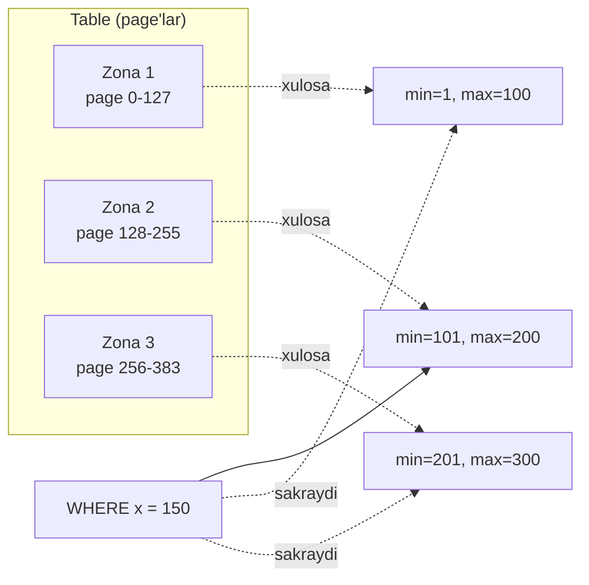
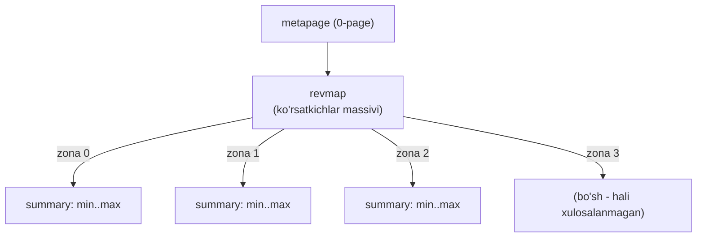
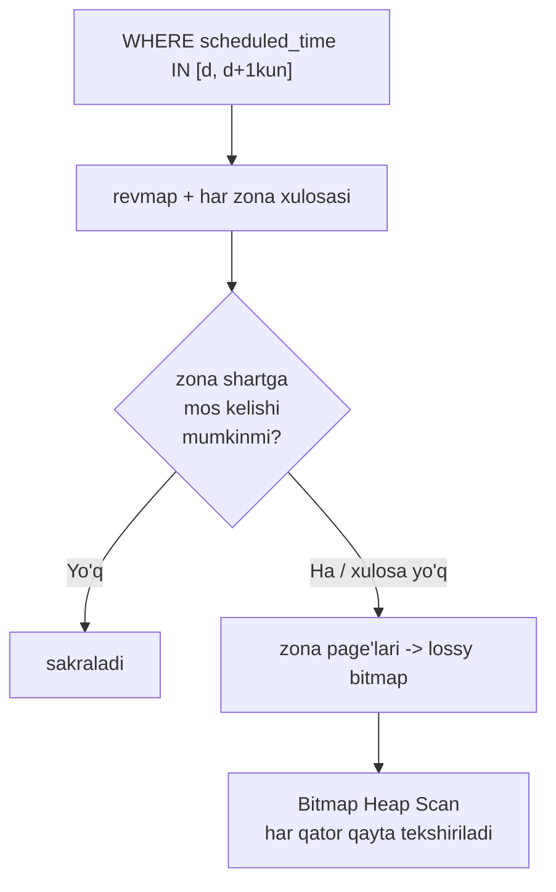
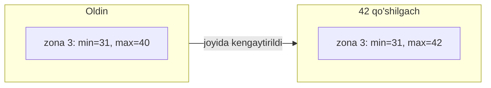
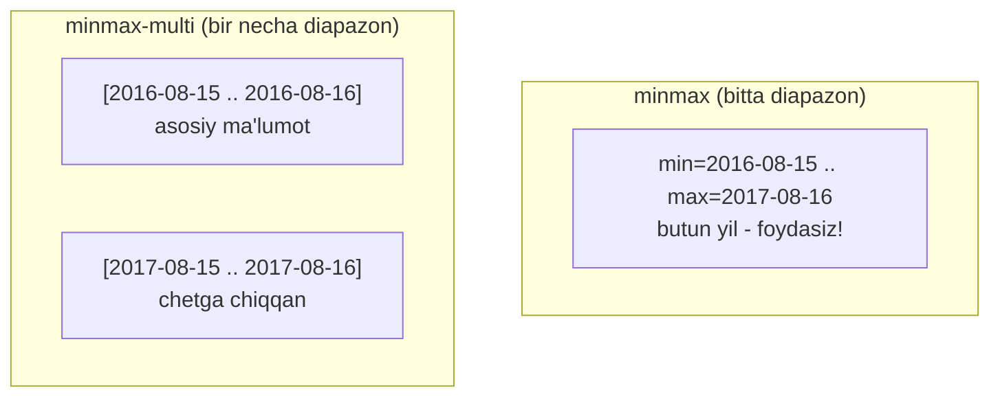
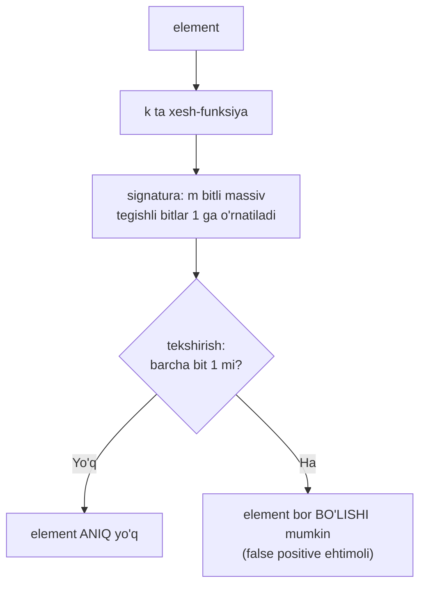
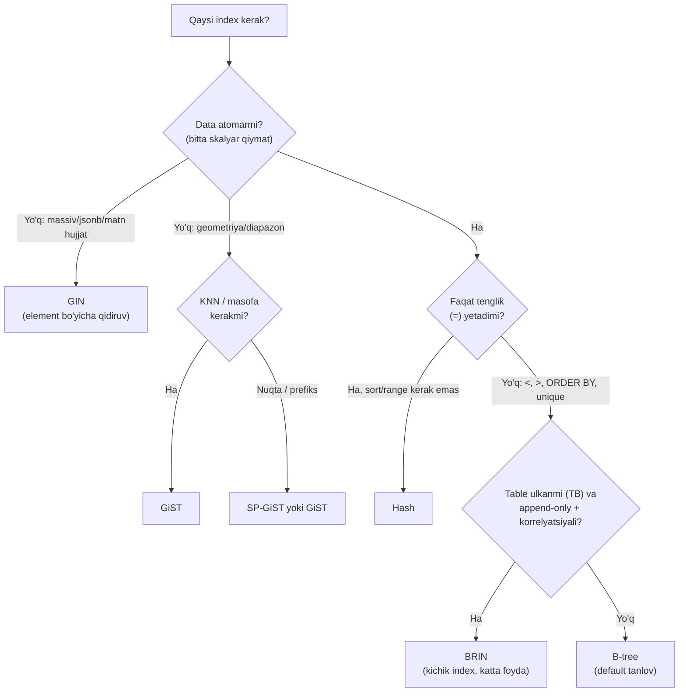

# 29. BRIN index

> 📖 Manba: Рогов, "PostgreSQL 17 изнутри", 29-bob ("Индекс BRIN")

## Nima uchun kerak?

Shu paytgacha ko'rgan barcha index'lar — B-tree (25), hash (24), GiST (26), SP-GiST (27), GIN (28) — bitta maqsadga xizmat qildi: **kerakli qatorlarni tez topish**. Buning uchun ular har bir qatorning identifikatorini (tid) saqlaydi. Bu ajoyib ishlaydi, lekin bir narxi bor: index **katta bo'ladi**.

Endi boshqa dunyoni tasavvur qiling — **analitik ombor** (data warehouse). Bir necha **terabayt** hajmdagi table: har kuni yangi ma'lumot **oxiriga qo'shiladi**, eski ma'lumot o'zgarmaydi va o'chirilmaydi. Bunday table uchun B-tree index'ni ham terabaytlarda o'lchash kerak bo'ladi — bu ba'zan **ruxsat etilmas hashamat**.

Muhim savol: bunday table'da har bir qator tid'ini eslab qolish shartmi? Ko'pincha yo'q. Aksincha yetadi — **qaysi katta bo'laklarni umuman o'qimaslik kerakligini** bilish.

Mana shu g'oyani **BRIN** (access method `brin`) amalga oshiradi. BRIN — **Block Range Index**, ya'ni **blok diapazoni index'i**.

> **Oltin g'oya:** BRIN qatorlarni **topmaydi** — u aniq **keraksiz** page'larni **o'tkazib yuborishga** yordam beradi. Uni index emas, balki **sequential scan tezlatkichi** deb qarash to'g'riroq.

```mermaid
mindmap
  root(("BRIN index"))
    "Printsip"
      "table -> zonalar (range)"
      "har zona uchun xulosa (min/max)"
      "tid saqlamaydi -> juda kichik"
      "lossy: page aniqligida"
    "Qachon mos"
      "juda katta table (TB)"
      "append-only ombor"
      "korrelyatsiya yuqori"
    "Operator class"
      "minmax: min va max"
      "minmax-multi: bir necha diapazon"
      "inclusion: qamrab oluvchi"
      "bloom: xesh + Bloom filtri"
    "Sozlash"
      "pages_per_range (128)"
      "samaradorlik vs hajm"
```

---

## 1-qism. Umumiy printsip

BRIN butun table'ni bir necha page'dan iborat **zonalarga** (range) bo'ladi — shundan nomi kelib chiqadi. Index qatorlar identifikatorlarini **saqlamaydi**, balki har bir zonadagi ma'lumot haqida faqat **xulosaviy (summary) ma'lumot** bilan cheklanadi.

Tartib turlari uchun oddiy holatda bu — zonadagi **minimal va maksimal** qiymat. Lekin turli operator class'lar zonadagi qiymatlar haqida turli ma'lumot yig'ishi mumkin.

Zonadagi page'lar soni index yaratishda `pages_per_range` storage parametri bilan belgilanadi (default **128**).

**Analogiya — kutubxona javonlaridagi yorliqlar.** Katta arxivda har bir javonda "1990–1995 yillar hujjatlari" degan yorliq bor. "2010-yil hujjatini top" so'rovida siz 1990–1995 javonini **umuman ochmaysiz** — yorliqdan bilib turibsiz, u yerda yo'q. BRIN'ning zona xulosalari — aynan shu yorliqlar.



So'rov bajarilganda ma'lumoti shartga **kafolatli tushmaydigan** zonalarni butunlay o'tkazib yuborish mumkin. Qolgan zonalar page'lari index tomonidan **noaniq (lossy) bitmap** ko'rinishida qaytariladi (20-dars); bu page'lardagi **barcha qatorlar** shart bajarilishiga qayta tekshiriladi.

> **BRIN yaxshi ishlaydigan shart:** ustun qiymatlari **lokalizatsiyalangan** bo'lishi kerak — yaqin joylashgan qiymatlar o'xshash xossaga ega bo'lsin. Tartib turlari uchun bu shuni bildiradi: qiymatlar table'da fizik jihatdan **o'sish yoki kamayish tartibida** joylashgan bo'lsin, ya'ni **fizik joylashuv va mantiqiy tartib o'rtasida yuqori korrelyatsiya** bo'lsin (17-dars, statistika).

BRIN'ni oddiy ma'nodagi index emas, **sequential scan tezlatkichi** deb qarash xato bo'lmaydi. Uni **partitioning** (30-dars) analogi sifatida ham ko'rish mumkin — har bir zonani alohida "virtual" seksiya deb hisoblasak.

---

## 2-qism. Misol va hajm taqqoslashi

Demo bazada BRIN uchun yetarlicha katta table yo'q, lekin analitik hisobot uchun **denormalizatsiyalangan** table tasavvur qilamiz: aeroportdan uchgan va aeroportga qo'ngan reyslar haqida ma'lumot, **o'rindiq aniqligida**. Har aeroport ma'lumoti sutkasiga bir marta, tegishli vaqt mintaqasida yarim tun bo'lganda qo'shiladi. Qo'shilgach ma'lumot **o'zgarmaydi va o'chirilmaydi**.

Table taxminan shunday:

```sql
CREATE TABLE flights_bi(
  airport_code       char(3),      -- aeroport kodi
  airport_coord      point,        -- aeroport koordinatalari
  airport_utc_offset interval,     -- vaqt mintaqasi
  flight_no          char(6),      -- reys raqami
  flight_type        text,         -- turi: uchish yoki qo'nish
  scheduled_time     timestamptz,  -- reja bo'yicha vaqt
  actual_time        timestamptz,  -- haqiqiy vaqt
  ...
);
```

Ma'lumot yuklash tashqi (kunlar bo'yicha) va ichki (vaqt mintaqalari bo'yicha) tsikllar bilan taqlid qilinadi. Natijada ma'lumot table'da **vaqt va geografiya bo'yicha tabiiy tartibda** joylashadi. Tayyor nusxa taxminan **4 GB**, ~**30 mln** qator:

```sql
=> SELECT count(*) FROM flights_bi;
  count
----------
 30517076
(1 row)

=> SELECT pg_size_pretty(pg_total_relation_size('flights_bi'));
 pg_size_pretty
----------------
 4130 MB
(1 row)
```

Endi eng muhim daqiqa — **BRIN va B-tree hajmini taqqoslash**. `scheduled_time` bo'yicha BRIN quramiz:

```sql
=> CREATE INDEX ON flights_bi USING brin(scheduled_time);
=> SELECT pg_size_pretty(pg_total_relation_size('flights_bi_scheduled_time_idx'));
 pg_size_pretty
----------------
 184 kB
(1 row)
```

Atigi **184 kB**! Endi xuddi shu ustunga B-tree quramiz (dublikatlar ixcham saqlansa ham):

```sql
=> CREATE INDEX flights_bi_btree_idx ON flights_bi(scheduled_time);
=> SELECT pg_size_pretty(pg_total_relation_size('flights_bi_btree_idx'));
 pg_size_pretty
----------------
 210 MB
(1 row)
=> DROP INDEX flights_bi_btree_idx;
```

| Index | Hajm | Nisbat |
|-------|------|--------|
| **BRIN** | 184 kB | 1× |
| **B-tree** | 210 MB | ~1170× |

> B-tree **ming baroba** katta. Albatta, uning samaradorligi ham yuqoriroq, lekin haqiqatan katta table'lar uchun bu qo'shimcha hajm **ruxsat etilmas** bo'lishi mumkin. BRIN aynan shu yerda g'olib.

---

## 3-qism. Page tashkiloti — revmap va summary

BRIN-index'ning ichki tuzilishini ko'raylik:

- **0-page (metapage)** — index tuzilishi haqidagi ma'lumot.
- Metadan biroz keyin **xulosaviy ma'lumot page'lari** (summary): har index yozuvi **bitta zona** bo'yicha xulosani saqlaydi.
- Metapage va summary orasida **zonalar kartasi** (range map) joylashadi — ko'pincha **teskari karta** (reverse range map, qisqacha **revmap**) deyiladi. Bu — mos index yozuvlariga **ko'rsatkichlar massivi**; massivdagi pozitsiya raqami **zona raqamiga** teng.



Table kengayganda karta o'lchami ortadi. Agar karta ajratilgan page'larga sig'may qolsa, u keyingi page'ni egallaydi, oldingi yozuvlar boshqa page'ga ko'chiriladi. Bir page'ga ko'p ko'rsatkich sig'gani uchun bunday qayta joylashtirishlar **kamdan-kam** sodir bo'ladi.

BRIN page'larini ham **pageinspect** bilan o'rganamiz. Metadan zona o'lchami va revmap uchun ajratilgan page'lar sonini ko'ramiz:

```sql
=> SELECT pagesperrange, lastrevmappage
   FROM brin_metapage_info(get_raw_page('flights_bi_scheduled_time_idx', 0));
 pagesperrange | lastrevmappage
---------------+----------------
           128 |              4
(1 row)
```

Bu yerda revmap 4 ta page egallaydi (1-dan 4-gacha). revmap yozuvlari xulosa yozuvlariga havola qiladi:

```sql
=> SELECT * FROM brin_revmap_data(get_raw_page('flights_bi_scheduled_time_idx', 1));
  pages
----------
 (6,197)
 (6,198)
 (6,199)
 ...
(1360 rows)
```

> Agar zona hali **xulosalanmagan** bo'lsa (unga xulosa yo'q bo'lsa), zonalar kartasidagi ko'rsatkich **bo'sh** bo'ladi.

Endi bir necha birinchi zonaning xulosaviy ma'lumotini o'zi:

```sql
=> SELECT itemoffset, blknum, value
   FROM brin_page_items(
     get_raw_page('flights_bi_scheduled_time_idx', 6),
     'flights_bi_scheduled_time_idx')
   ORDER BY blknum LIMIT 3 \gx
-[ RECORD 1 ]------------------------------------------------
itemoffset | 197
blknum     | 0
value      | {2016-08-15 02:45:00+03 .. 2016-08-15 16:20:00+03}
-[ RECORD 2 ]------------------------------------------------
itemoffset | 198
blknum     | 128
value      | {2016-08-15 05:50:00+03 .. 2016-08-15 18:55:00+03}
-[ RECORD 3 ]------------------------------------------------
itemoffset | 199
blknum     | 256
value      | {2016-08-15 07:15:00+03 .. 2016-08-15 18:50:00+03}
```

Ko'ryapsizmi: har bir `blknum` (zona boshi) uchun `value` — **{min .. max}** diapazon. 0-zona 128 page'ni qamraydi va uning barcha `scheduled_time` qiymatlari `02:45` bilan `16:20` orasida.

---

## 4-qism. Qidiruv — bitmap scan bilan

BRIN qo'llaydigan shart bo'yicha qidiruvda **zonalar kartasi va har zona xulosasi** ko'riladi. Agar zonadagi ma'lumot qidiruv kalitiga **mos kelishi mumkin** bo'lsa, zonaning **barcha page'lari** bitmap'ga qo'shiladi. Index alohida qatorlar identifikatorini saqlamagani uchun bitmap dastlab **page aniqligida** quriladi.

Ma'lumot kalitga mos kelishini **consistency oporna funksiyasi** aniqlaydi — u xulosaning ma'nosini tushunadi. Xulosasi yo'q zonalar (xulosalanmagan) **har doim** bitmap'ga qo'shiladi.

Hosil bo'lgan bitmap table'ni skanlash uchun ishlatiladi (20-dars). Muhimi: table page'lari **ketma-ket bo'laklar** bilan o'qiladi va **oldindan o'qish (prefetch)** ishlatiladi.



Bir kunlik so'rovni bajaramiz. Parallellikni soddalashtirish uchun o'chiramiz:

```sql
=> SET max_parallel_workers_per_gather = 0;
=> \set d '2016-08-15 02:45:00+03'
=> EXPLAIN (analyze, buffers, costs off, timing off, summary off)
   SELECT * FROM flights_bi
   WHERE scheduled_time >= :'d'::timestamptz
     AND scheduled_time <  :'d'::timestamptz + interval '1 day';
                          QUERY PLAN
--------------------------------------------------------------
 Bitmap Heap Scan on flights_bi (actual rows=81964 loops=1)
   Recheck Cond: ((scheduled_time >= '2016-08-15 02:45:00+03'...
   Rows Removed by Index Recheck: 11606
   Heap Blocks: lossy=1536
   Buffers: shared hit=1561
   -> Bitmap Index Scan on flights_bi_scheduled_time_idx
        (actual rows=15360 loops=1)
        Index Cond: ((scheduled_time >= '2016-08-15 02:45:00+03'...
        Buffers: shared hit=25
(11 rows)
```

Buni o'qib chiqamiz:

- `Heap Blocks: lossy=1536` — bitmap **page aniqligida** (lossy), 1536 page o'qildi.
- `Rows Removed by Index Recheck: 11606` — o'qilgan page'lardagi 11606 qator shartga tushmadi (chegara zonalaridagi "ortiqcha" qatorlar).
- `Buffers: shared hit=25` (index) — index'ning o'zi atigi 25 page o'qidi (juda kichik!).

### Samaradorlik koeffitsienti

BRIN'ning biror so'rov uchun **samaradorlik koeffitsienti**ni (foydali ish koeffitsienti) shunday aniqlash mumkin: index skanlashda **o'tkazib yuborilgan** page'lar sonining table'dagi **umumiy** page'lar soniga nisbati.

- **0** samaradorlik → index murojaati oddiy sequential scan'ga aylanadi.
- Samaradorlik qancha yuqori bo'lsa, shuncha kam page o'qiladi.
- Lekin bir qism page'da izlangan ma'lumot bor — ularni sakrab bo'lmaydi. Shuning uchun samaradorlik **har doim birdan kichik**.

Bu misolda samaradorlik ≈ (528417 − 1561) / 528417 ≈ **0.997** (bu yerda 528417 — table'dagi page'lar soni). Ya'ni page'larning ~99.7 foizini o'qimasdan o'tkazib yubordik.

> Bitta qiymat bo'yicha xulosa qilib bo'lmaydi. Ideal korrelyatsiyada ham samaradorlik zona chegaralari qanday joylashganiga qarab farq qiladi. To'liq manzarani samaradorlikni **tasodifiy kattalik** deb qarab, uning taqsimotini o'rganib olish mumkin (kitobda bir yildagi har kun uchun "box plot" — mo'ylovli quti diagrammasi bilan ko'rsatilgan).

---

## 5-qism. Xulosaviy ma'lumot yangilanishi

### Qiymat qo'shish

Table page'iga yangi qator versiyasi qo'shilganda, index'da **tegishli zonaning** xulosasi yangilanadi. Zona raqami page raqamidan oddiy arifmetika bilan hisoblanadi (`page_raqami / zona_o'lchami`), keyin revmap orqali xulosa o'qiladi.

Xulosani kengaytirish kerakligini **qiymat qo'shish oporna funksiyasi** hal qiladi. Agar kerak bo'lsa, kengaytirish **joyida** (yangi index yozuvisiz) bajariladi — page'da yetarli joy bo'lsa.

Masalan, 13-page'da qiymati **42** bo'lgan qator paydo bo'ldi. Zona o'lchami 4 page bo'lsa, `13 / 4 = 3` → 3-zona. Uning min=31, max=40 edi. Yangi qiymat chegaradan tashqarida — maksimal qiymat **42**'ga yangilanadi.



Agar joyida yangilash imkonsiz bo'lsa, yangi yozuv yaratiladi va zonalar kartasi o'zgaradi.

### Zonani xulosalash (summarization)

Yuqoridagilar xulosasi allaqachon bor zona uchun edi. Index qurishda mavjud barcha zonalar xulosalanadi, lekin keyingi o'sishda **yangi page'lar** paydo bo'lishi mumkin.

- Agar index'ni `autosummarize` parametri bilan yaratsangiz, yangi zona **darhol** xulosalanadi. Lekin omborlarga qatorlar odatda katta **paketlar** bilan qo'shilgani uchun bu rejim insert'ni sezilarli sekinlashtirishi mumkin.
- **Default holda yangi zonalar darhol xulosalanmaydi.** Bu ishning to'g'riligini buzmaydi — xulosasiz zonalar to'liq ko'riladi.

Obshemlash **asinxron** bajariladi: table tozalanganda (VACUUM, 6-dars), yoki qo'lda `brin_summarize_new_values` / `brin_summarize_range` funksiyasi bilan.

> **Muhim nozik nuqta — xulosa hech qachon torraymaydi.** GiST'da (26-dars) qayta hisoblash hech bo'lmasa page bo'linganda sodir bo'ladi. BRIN'da esa xulosa **faqat kengayadi**, hech qachon torraymaydi. Odatda buning keragi ham yo'q — omborlar asosan **qo'shish uchun** ishlatiladi. Qo'lda `brin_desummarize_range` bilan xulosani o'chirib, zonani qaytadan xulosalash mumkin, lekin qaysi zonaga bu kerakligini aytadigan maslahat yo'q.

> **Xulosa:** BRIN birinchi navbatda **juda katta**, o'zgarmaydigan yoki juda kam o'zgaradigan table'larga mo'ljallangan — yangi qatorlar asosan **fayl oxiriga** qo'shiladigan holatlarga. Asosiy qo'llanish sohasi — **data warehouse** va analitik hisobot.

---

## 6-qism. minmax operator class

Solishtirsa bo'ladigan turlar uchun xulosa eng oddiy holatda **minimal va maksimal** qiymatdan iborat. Mos operator class'lar nomida `minmax` so'zi bor: `int4_minmax_ops`, `timestamptz_minmax_ops`, `numeric_minmax_ops` va h.k. (jami 26 ta).

`minmax` class'idagi solishtirish operatorlari B-tree'dagi bilan **bir xil** (25-dars):

| Operator | Strategiya |
|----------|:----------:|
| `<` | 1 |
| `<=` | 2 |
| `=` | 3 |
| `>=` | 4 |
| `>` | 5 |

### Ustun tanlash — korrelyatsiya

**Qaysi ustunlarga** minmax BRIN qurish mantiqli? Aytganimizdek: **fizik joylashuv qiymatlarning mantiqiy tartibi bilan korrelyatsiya** qilganda. Buni `pg_stats` statistikasidan tekshiramiz:

```sql
=> SELECT attname, correlation, n_distinct
   FROM pg_stats WHERE tablename = 'flights_bi'
   ORDER BY correlation DESC NULLS LAST;
      attname       | correlation  | n_distinct
--------------------+--------------+------------
 actual_time        |    0.9999948 |      33774
 scheduled_time     |    0.9999948 |      25659
 fare_conditions    |    0.7997654 |          3
 flight_type        |    0.5026036 |          2
 airport_utc_offset |    0.4540325 |         11
 aircraft_code      |    0.1670084 |          8
 airport_code       |    0.0494057 |        104
 passenger_name     |    0.0085374 |       8375
 flight_no          |   -0.0002796 |        707
 airport_coord      |              |          0
(...)
```

- **`scheduled_time` / `actual_time`** — korrelyatsiya ~**1.0** (deyarli ideal). Ma'lumot xronologik tartibda qo'shilgani va o'chirish/o'zgartirish yo'qligi sababli qatorlar faylga **ketma-ket** yotadi. Bu ustunlar minmax BRIN uchun **ideal**.
- **`fare_conditions`, `flight_type`, `airport_utc_offset`** — korrelyatsiya nisbatan yuqori, lekin **noyob qiymatlar juda kam** (`n_distinct` 2–11). BRIN uchun unchalik foydali emas.
- Qolganlarning korrelyatsiyasi **juda past** — minmax BRIN uchun qiziq emas.

> **Qoida:** minmax BRIN faqat **yuqori korrelyatsiyali** (~1 ga yaqin) ustunlarga mantiqli. Korrelyatsiya past bo'lsa, har zonaning min–max diapazoni butun table'ni qamrab oladi va index foydasiz bo'ladi.

### Zona o'lchami va samaradorlik

Zona o'lchami (`pages_per_range`) **samaradorlik va hajm** o'rtasidagi murosani belgilaydi:

- Zona qancha **katta** bo'lsa — index **kichikroq**, lekin ko'proq "chegaraviy" ortiqcha qatorlar o'qiladi.
- Zona qancha **kichik** bo'lsa — index **kattaroq**, lekin aniqroq.

Kitobda uchta o'lcham taqqoslangan (bir kunlik so'rov uchun samaradorlik taqsimoti):

| Zona o'lchami | Index hajmi | Samaradorlik |
|:-------------:|:-----------:|:------------:|
| 32 page/zona | 529 kB | eng yuqori |
| **128 page/zona (default)** | **184 kB** | yuqori |
| 512 page/zona | 72 kB | biroz pastroq |

> Kutilganidek, aniqlik va samaradorlik hatto ancha katta zona uchun ham yuqori qoladi. Samaradorlik bepul o'smaydi: u bilan birga index hajmi ham ortadi. BRIN bu ikkisi orasidagi murosani **moslashuvchan** topishga imkon beradi.

### Composite BRIN va bitmap kombinatsiyasi

Composite BRIN-index qurish mumkin — har ustun xulosasi alohida index yozuvida yig'iladi, lekin **zonalarga bog'lanish umumiy** qoladi. Bu barcha ustunlarga bir xil zona o'lchami mos kelsa mantiqli.

Alternativ — alohida ustunlarga BRIN qurib, **bitmap'larni kombinatsiyalash** (20-dars). Ikki BRIN'ni `BitmapAnd` bilan birlashtirish mumkin:

```sql
=> CREATE INDEX ON flights_bi USING brin(airport_utc_offset);
=> EXPLAIN (analyze, costs off, timing off, summary off)
   SELECT * FROM flights_bi
   WHERE scheduled_time >= :'d'::timestamptz
     AND scheduled_time <  :'d'::timestamptz + interval '1 day'
     AND airport_utc_offset = '08:00:00';
                          QUERY PLAN
--------------------------------------------------------------
 Bitmap Heap Scan on flights_bi (actual rows=1658 loops=1)
   ...
   Heap Blocks: lossy=256
   -> BitmapAnd (actual rows=0 loops=1)
        -> Bitmap Index Scan on flights_bi_scheduled_time_idx
        -> Bitmap Index Scan on flights_bi_airport_utc_offset_idx
(9 rows)
```

> **v17 yangiligi:** B-tree'lar qatori, katta table'lar uchun BRIN-index'lar ham **parallel** qurilishi mumkin. Bir necha jarayon table'ni skanlab, o'z qismi bo'yicha xulosa hisoblaydi; keyin ma'lumot zonalar bo'yicha saralanadi (`maintenance_work_mem`, 64MB) va yetakchi jarayon uni agregatlab index hosil qiladi.

---

## 7-qism. minmax-multi — korrelyatsiya buzilganda

**Muammo.** Yig'ilgan korrelyatsiyani ma'lumotni o'zgartirib **oson buzish** mumkin. Gap aniq bir qiymatni o'zgartirishda emas, **ko'p versiyalilik** (MVCC, 3-dars) tuzilishida: eski versiya bir page'da o'chiriladi, yangisi esa bo'sh joy topilgan **istalgan** page'ga qo'yilishi mumkin. Natijada yangilanishlarda qator versiyalari **aralashib** ketadi.

Buni modellashtirishga harakat qilamiz. Avval tasodifiy 0.1% qatorni o'chirib, VACUUM bilan joy bo'shatamiz, keyin bitta vaqt mintaqasi uchun yangi kun qo'shamiz:

```sql
=> WITH t AS (
     SELECT ctid FROM flights_bi TABLESAMPLE BERNOULLI (0.1) REPEATABLE (0)
   )
   DELETE FROM flights_bi WHERE ctid IN (SELECT ctid FROM t);
DELETE 30122
=> VACUUM flights_bi;
=> INSERT INTO flights_bi SELECT ... FROM flights_bi
   WHERE date_trunc('day', scheduled_time) = '2017-08-15'
     AND airport_utc_offset = '03:00:00';
INSERT 0 40531
```

O'chirilgan qatorlar deyarli har zonada bo'sh joy qoldirgan. Yangi qatorlar ichki page'larga tushib, diapazonlarni avtomatik **kengaytiradi**. 0-zona xulosasi ilgari to'liqsiz sutkani qamrasa, endi **butun yilni** qamraydi:

```sql
=> SELECT value FROM brin_page_items(
     get_raw_page('flights_bi_scheduled_time_idx', 6),
     'flights_bi_scheduled_time_idx') WHERE blknum = 0;
                       value
---------------------------------------------------
 {2016-08-15 02:45:00+03 .. 2017-08-16 16:15:00+03}
(1 row)
```

So'rovdagi sana qancha kichik bo'lsa, shuncha ko'p zonani ko'rishga to'g'ri keladi — samaradorlik **keskin tushadi**.

**Yechim** — xulosani murakkablashtirish: bitta uzluksiz diapazon o'rniga **bir necha diapazon** saqlash. Shunda bitta diapazon asosiy ma'lumotni qamraydi, boshqalari — alohida "chetga chiqqan" qiymatlarni (outlier).



Aynan shu imkonni nomida `minmax_multi` bo'lgan operator class'lar beradi (`timestamptz_minmax_multi_ops` va h.k., jami 19 ta). Ularda qo'shimcha oporna funksiya bor — ikki qiymat orasidagi **masofa**ni hisoblash (diapazon uzunligini minimallashtirish uchun).

Class `values_per_range` parametrini qabul qiladi — bir zona uchun maksimal xulosaviy qiymatlar soni (default 32). Diapazonni ifodalash uchun **ikkita** qiymat, alohida nuqta uchun **bitta** kerak. Qiymatlar yetmaganda ba'zi intervallar "yopiladi" (birlashtiriladi).

16 ta xulosaviy qiymat bilan yangi index quramiz:

```sql
=> DROP INDEX flights_bi_scheduled_time_idx;
=> CREATE INDEX ON flights_bi USING brin(
     scheduled_time timestamptz_minmax_multi_ops(values_per_range = 16)
   );
```

> Natijada samaradorlik **eski (yuqori) qiymatlariga qaytadi** — albatta, index hajmi ortishi hisobiga (minmax 184 kB → minmax-multi 656 kB). Agar table'da o'chirish/yangilash bo'lishi mumkin bo'lsa, minmax o'rniga **minmax-multi** afzal.

---

## 8-qism. inclusion — qamrab oluvchi qiymatlar

Diapazonli (minmax) va **qamrab oluvchi** (inclusion) class'lar orasidagi farq — taxminan B-tree va GiST orasidagi farq kabi (26-dars). Qamrab oluvchi class'lar solishtirib bo'lmaydigan, lekin **o'zaro joylashuvi** mantiqli bo'lgan turlar uchun. Xulosa — zonaga kiruvchi barcha qiymatlarni **chegaralab turuvchi soha** (bounding box).

Class'lar kam: `box_inclusion_ops`, `inet_inclusion_ops`, `range_inclusion_ops`.

> **Ogohlantirish — planner bosh tortadi.** Solishtiruvchi turlar uchun biz korrelyatsiya statistikasiga tayana olamiz, lekin boshqa turlar uchun bunday statistika **yig'ilmaydi**. Statistika bo'lmasa, index skanlash narxi bahosida korrelyatsiya **nolga teng** deb olinadi. Shuning uchun planner odatda aniq va noaniq inclusion-index'larni farqlamaydi va ularni ishlatishdan **bosh tortadi** (`enable_seqscan = off` qilmaguningizcha).

Misolda aeroport koordinatalariga index quramiz (uzunlik vaqt mintaqasi bilan korrelyatsiya qilishi kerak). BRIN xulosa qiymatlari index qilinadigan ma'lumot bilan **bir xil turda** bo'lgani uchun nuqtalar uchun to'g'ridan-to'g'ri index qura olmaymiz — ularni "aynigan to'rtburchak"ka aylantirib, ifoda bo'yicha index quramiz:

```sql
=> CREATE INDEX ON flights_bi USING brin(box(airport_coord))
   WITH (pages_per_range = 8);
=> SET enable_seqscan = off;
=> EXPLAIN (analyze, costs off, timing off, summary off)
   SELECT * FROM flights_bi
   WHERE box(airport_coord) <@ box '135,45,140,50';
                          QUERY PLAN
--------------------------------------------------------------
 Bitmap Heap Scan on flights_bi (actual rows=511404 loops=1)
   Recheck Cond: (box(airport_coord) <@ '(140,50),(135,45)'::box)
   Rows Removed by Index Recheck: 721565
   Heap Blocks: lossy=21216
   -> Bitmap Index Scan on flights_bi_box_idx (actual rows=212160...
(6 rows)
=> RESET enable_seqscan;
```

Class'dagi operatorlar GiST-class'larining operatorlariga mos keladi (masalan berilgan sohadagi nuqtalarni topish `<@`).

---

## 9-qism. bloom — Bloom filtri

**Muammo.** Ba'zan qiymatlar alohida zonalarda **lokalizatsiyalangan**, lekin ular **mantiqiy tartib bilan korrelyatsiya qilmaydi**. Bunday holda minmax foydasiz (masalan `flight_no` — reys raqami: har zonada bir necha xil raqam bor, lekin ular tartibda emas). Mana shu yerda **Bloom filtri**ga asoslangan class yordam beradi.

Bloom filtrli class'lar BRIN'ni **`=` operatori va xesh-funksiya** aniqlangan **har qanday tur** bilan ishlatishga imkon beradi. Nomida `bloom` bor: `bpchar_bloom_ops`, `timestamptz_bloom_ops` va h.k. (jami 24 ta).

**Bloom filtri nima?** — element to'plamga tegishli-yo'qligini tez tekshiruvchi ma'lumot strukturasi. Juda ixcham, lekin **yolg'on-ijobiy** (false positive) natija berishi mumkin — to'plamga ortiqcha element "yozib qo'yishi" mumkin. Muhimi: **yolg'on-salbiy** (false negative) bo'lishi **mumkin emas** — filtr aslida bor elementni "yo'q" deb ayta olmaydi.



Filtr — `m` bitli massiv (signatura), dastlab nollar bilan to'la. `k` ta xesh-funksiya har elementni `k` ta bitga akslantiradi. Element qo'shish = shu bitlarni **1**'ga o'rnatish. Agar elementga mos barcha bit 1 bo'lsa — element **bo'lishi mumkin**; hech bo'lmasa bittasi 0 bo'lsa — element **aniq yo'q**.

BRIN'da filtr aniq bir zonadagi ustun qiymatlari to'plami bilan ishlaydi; zona xulosasi qurilgan Bloom filtri bilan ifodalanadi.

Filtr aniqligi signatura uzunligiga bog'liq. Ikki parametr class'ga chiqarilgan:

- **`n_distinct_per_range`** — to'plam elementlari soni (zonadagi noyob qiymatlar). Manfiy son zonadagi qatorlarga nisbatan ulush bildiradi (statistikadagi kabi, 17-dars). Default `-0.1`.
- **`false_positive_rate`** — yolg'on-ijobiy ehtimoli. Default `0.01`. Nolga yaqin ehtimol index'ning izlanayotgan qiymati yo'q zonalarga qaramasligini bildiradi. Lekin u qidiruv aniqligini kafolatlamaydi — ko'rilayotgan zonada, kerakli qiymatlardan tashqari, "ortiqcha" qatorlar bo'ladi (bu filtr xossasi emas, zona kengligi va fizik joylashuvga bog'liq).

Bloom filtri xeshlashga asoslangani uchun yagona qo'llaydigan operator — **tenglik** (`=`).

Misolda `flight_no` ustunini olamiz (korrelyatsiya nolga yaqin, minmax uchun umidsiz). 8 page'li zona uchun zonadagi noyob qiymatlar sonini hisoblaymiz (~26), index quramiz:

```sql
=> CREATE INDEX ON flights_bi USING brin(
     flight_no bpchar_bloom_ops(n_distinct_per_range = 22)
   ) WITH (pages_per_range = 8);
=> EXPLAIN (analyze, costs off, timing off, summary off)
   SELECT * FROM flights_bi WHERE flight_no = 'PG0001';
                          QUERY PLAN
--------------------------------------------------------------
 Bitmap Heap Scan on flights_bi (actual rows=5197 loops=1)
   Recheck Cond: (flight_no = 'PG0001'::bpchar)
   Rows Removed by Index Recheck: 127510
   Heap Blocks: lossy=2240
   -> Bitmap Index Scan on flights_bi_flight_no_idx (...)
(6 rows)
```

> Korrelyatsiyasi nol bo'lgan ustun uchun ham BRIN endi ishladi! Bloom filtri `PG0001` raqami yo'q zonalarni o'tkazib yubordi. Umumiy samaradorlik ancha yuqori, garchi ba'zi reys raqamlari uchun (chetdagi qiymatlar) index yaxshi ishlamasa ham.

---

## 10-qism. B-tree vs BRIN

Ikkovi ham tartib turlarida `>`, `<`, `=` bo'yicha qidiruvni tezlashtiradi, lekin ular **butunlay boshqa falsafa**:

| | B-tree | BRIN |
|---|--------|------|
| Nima saqlaydi | har qatorning tid'i | zona bo'yicha xulosa (min/max) |
| Hajm | table'ga mutanosib katta | juda kichik (misolda ~1170× kichik) |
| Aniqlik | aniq (tuple aniqligida) | noaniq (page aniqligida, lossy) |
| Scan turi | Index Scan + Bitmap | faqat Bitmap Scan |
| Fizik tartibga bog'liq | yo'q | **ha** (korrelyatsiya kerak) |
| Unique / sort | ✅ | ❌ |
| Yangilanadigan table | ✅ | faqat append-only afzal |
| Qachon | universal, kundalik | juda katta append-only ombor |

> **Xulosa:** BRIN B-tree'ni almashtirmaydi — u boshqa vazifani hal qiladi. Agar table kichik/o'rta bo'lsa yoki aniq qidiruv, unique, tartiblash kerak bo'lsa — B-tree. Agar table ulkan, append-only va yuqori korrelyatsiyali bo'lsa — BRIN kichkina index bilan katta foyda beradi.

BRIN'da **klasterlash yo'qligi** (`clusterable = f`) hayron qoldirishi mumkin: index fizik tartibga sezgir bo'lsa, tartibni qayta qurib samaradorlikni oshirish mantiqli ko'rinardi. Lekin ulkan table'ni klasterlash — juda qimmat (butun table qayta yoziladi). Qolaversa, `flights_bi` misoli ko'rsatganidek, omborlarda ba'zi tartib **tabiiy** ravishda paydo bo'ladi.

---

## 11-qism. YAKUNIY BO'LIM — 6 index turini taqqoslash

Bu — kitobning V qismi (index'lar) yakuni. PostgreSQL'ning oltita o'rnatilgan index turini bir joyga yig'amiz.

```mermaid
mindmap
  root(("6 index turi"))
    "B-tree (25)"
      "tartib turlari"
      "=, <, >, BETWEEN, ORDER BY"
      "unique, composite, covering"
      "default, universal"
    "Hash (24)"
      "faqat ="
      "tartib yo'q, diapazon yo'q"
    "GiST (26)"
      "geometriya, diapazon, KNN"
      "muvozanatli daraxt"
      "full-text (signatura, lossy)"
    "SP-GiST (27)"
      "fazoni bo'lish"
      "nomuvozanat daraxtlar"
      "nuqtalar, prefikslar"
    "GIN (28)"
      "tarkibiy: massiv, jsonb, matn"
      "inverted index"
      "faqat bitmap scan"
    "BRIN (29)"
      "juda katta append-only"
      "zona xulosasi, kichik, lossy"
```

### Umumiy taqqoslash jadvali

| Index | Qanday data | Qanday query | Hajm | Scan | Alohida xususiyat |
|-------|-------------|--------------|------|------|-------------------|
| **B-tree** | tartib turlari | `=`, `<`, `>`, `BETWEEN`, `ORDER BY` | o'rta | Index + Bitmap | unique, sort, covering; **default** |
| **Hash** | xeshlanuvchi | faqat `=` | o'rta-kichik | Index + Bitmap | faqat tenglik, tez |
| **GiST** | geometrik, diapazon, to'plam | `<@`, `&&`, `<->` (KNN), full-text | o'rta | Index + Bitmap | masofa bo'yicha tartib (KNN), lossy signatura |
| **SP-GiST** | nuqta, prefiks, nomuvozanat | `<@`, `&&`, prefiks | o'rta | Index + Bitmap | fazoni bo'lish (quadtree, radix) |
| **GIN** | massiv, jsonb, tsvector | `@>`, `&&`, `@@`, `?` | katta | faqat Bitmap | inverted; element bo'yicha qidiruv |
| **BRIN** | katta + korrelyatsiyali | `=`, `<`, `>`, `BETWEEN` | **juda kichik** | faqat Bitmap | zona xulosasi; append-only ombor |

### Qaror diagrammasi — qaysi index?



### Amaliy qo'llanma

- **Shubhalansangiz — B-tree.** Aksariyat holatlarda to'g'ri tanlov. `PRIMARY KEY`, `UNIQUE`, oddiy `WHERE`/`ORDER BY` — hammasi shu.
- **Faqat `=` va tezlik muhim, sort kerak emas** — hash (lekin B-tree ham `=`'ni tez qiladi, shuning uchun kamdan-kam).
- **`LIKE '%...%'`, `ILIKE`, full-text, massiv, jsonb** — GIN (`pg_trgm`, `array_ops`, `jsonb_path_ops`).
- **Geometriya, `range` turlari, "eng yaqin N ta"** — GiST (KNN bilan), yoki nuqta/prefiks uchun SP-GiST.
- **Ulkan analitik table, faqat qo'shiladi, ustun table'da tartibli** — BRIN (kichik va arzon).

---

## Xulosa

- **BRIN** qatorlarni topmaydi — keraksiz page'larni **o'tkazib yuboradi**. Uni "sequential scan tezlatkichi" deb qarash to'g'ri.
- Table **zonalarga** (range, default 128 page) bo'linadi; har zona uchun faqat **xulosa** (minmax holatida min/max) saqlanadi. Index **juda kichik** (misolda B-tree'dan ~1170× kichik).
- BRIN **lossy**: bitmap page aniqligida quriladi, natija table bo'yicha **qayta tekshiriladi** (`Heap Blocks: lossy`, `Rows Removed by Index Recheck`).
- Yaxshi ishlashi uchun ustun **korrelyatsiyasi yuqori** bo'lishi kerak (fizik joylashuv = mantiqiy tartib). Bu **append-only** omborlarda tabiiy paydo bo'ladi.
- Page tashkiloti: metapage → **revmap** (zona → xulosa ko'rsatkichlari) → **summary** page'lar. Xulosa faqat kengayadi, hech qachon torraymaydi.
- Yangi zonalar default **darhol xulosalanmaydi** — asinxron (VACUUM) yoki qo'lda. Xulosasiz zona to'liq o'qiladi (to'g'rilik buzilmaydi).
- **minmax** — tartib turlari uchun; **minmax-multi** — korrelyatsiya o'chirish/yangilash bilan buzilganda; **inclusion** — geometrik turlar uchun (planner ko'pincha bosh tortadi); **bloom** — korrelyatsiyasiz, lekin `=` va xesh bo'lgan turlar uchun.
- `pages_per_range` **samaradorlik va hajm** o'rtasidagi murosani boshqaradi.
- **6 index turi:** B-tree (universal, default), Hash (faqat `=`), GiST (geometriya, KNN, full-text), SP-GiST (fazoni bo'lish), GIN (tarkibiy: massiv/jsonb/matn), BRIN (ulkan append-only).

## 🧠 Eslab qol

- BRIN qatorni topmaydi — keraksiz page'larni **sakraydi**.
- Faqat **korrelyatsiyali** (fizik tartib = mantiqiy tartib) ustunga mantiqli.
- Juda kichik, lekin **lossy** — har doim table bo'yicha recheck.
- Korrelyatsiya o'chirish/yangilash bilan buzilsa → **minmax-multi**.
- Korrelyatsiyasiz, lekin lokalizatsiyalangan + `=` → **bloom**.

## ✅ O'z-o'zini tekshir (retrieval practice)

1. Nega `scheduled_time`ga BRIN 184 kB, B-tree esa 210 MB? Farq nimadan?
<details><summary>Javob</summary>
B-tree **har bir qatorning tid'ini** saqlaydi (30 mln qator → katta). BRIN esa har **128 page'lik zona** uchun bitta {min..max} xulosa saqlaydi (~4100 zona) — tid umuman saqlanmaydi. Shuning uchun ~1170× kichik.
</details>

2. `WHERE flight_no = 'PG0001'` uchun minmax BRIN nega yaramaydi, bloom BRIN esa ishlaydi?
<details><summary>Javob</summary>
`flight_no` korrelyatsiyasi ~0 — har zonaning min–max diapazoni deyarli butun table'ni qamraydi, hech qanday zona sakralmaydi (minmax foydasiz). Bloom filtri esa har zonada **qaysi aniq qiymatlar borligini** (xesh orqali) saqlaydi — `PG0001` yo'q zonalarni sakraydi. `=` operatoriga bloom mos.
</details>

3. `Heap Blocks: lossy=1536` va `Rows Removed by Index Recheck: 11606` nimani anglatadi?
<details><summary>Javob</summary>
BRIN bitmap **page aniqligida** (lossy) — 1536 page o'qildi. Bu page'lardagi barcha qatorlar shartga qayta tekshirildi va 11606 tasi shartga tushmadi (zona chegaralaridagi "ortiqcha" qatorlar). Bu BRIN'ning noaniqligining tabiiy narxi.
</details>

4. Table'dan tasodifiy qatorlar o'chirilib, yangilari qo'shilsa, minmax BRIN'ga nima bo'ladi?
<details><summary>Javob</summary>
MVCC sababli yangi versiyalar bo'shagan joyga (istalgan page'ga) tushadi → korrelyatsiya buziladi. Zona min–max diapazoni kengayib ketadi (misolda 0-zona bir sutkadan butun yilga cho'zildi), samaradorlik keskin tushadi. Yechim — **minmax-multi** (bir necha diapazon: asosiy + outlier'lar).
</details>

5. Nega yangi zonalar default darhol xulosalanmaydi va bu to'g'rilikni buzmaydimi?
<details><summary>Javob</summary>
Omborga qatorlar katta paketlar bilan qo'shiladi — har qo'shishda darhol xulosalash insert'ni sekinlashtiradi. To'g'rilik buzilmaydi, chunki **xulosasiz zona to'liq o'qiladi** (har doim bitmap'ga qo'shiladi). Obshemlash asinxron (VACUUM) yoki qo'lda `brin_summarize_new_values` bilan bo'ladi.
</details>

## 🛠 Amaliyot

1. **Oson (Modify).** `flights_bi`da BRIN'ni turli `pages_per_range` (masalan 32, 128, 512) bilan qayta yarating va har birining `pg_total_relation_size` hajmini hamda bir kunlik so'rov `Heap Blocks: lossy` qiymatini solishtiring.

2. **O'rta (faded example).** Ulkan `events(created_at timestamptz, ...)` append-only table uchun samarali BRIN quring:
```sql
-- TODO: created_at yuqori korrelyatsiyaga egaligini tekshiring
SELECT correlation FROM pg_stats
WHERE tablename = 'events' AND attname = /* TODO */;
-- TODO: agar korrelyatsiya ~1 bo'lsa, minmax-multi BRIN quring
CREATE INDEX ON events USING brin(/* TODO */);
```
<details><summary>Hint</summary>
`attname = 'created_at'`. Index: `brin(created_at timestamptz_minmax_multi_ops)` — agar table'da o'chirish/yangilash bo'lishi mumkin bo'lsa minmax-multi xavfsizroq. `WITH (pages_per_range = ...)` bilan zona o'lchamini sozlang.
</details>

3. **Qiyin (Make).** Bir table'da ikki ustun bor: `ts timestamptz` (korrelyatsiya ~1) va `user_id int` (korrelyatsiya ~0, lekin bir zonada kam noyob qiymat). Ikkalasi bo'yicha ham `=`/`range` qidiruvni tezlashtiradigan BRIN strategiyasini tanlang. Har ustunga qaysi operator class va nega?
<details><summary>Hint</summary>
`ts` → `minmax` (yoki `minmax_multi` agar yangilanadigan bo'lsa). `user_id` → korrelyatsiya nol, lekin lokalizatsiyalangan bo'lsa `bloom_ops` (`=` uchun). Ikki alohida BRIN quring — planner ularni `BitmapAnd` bilan kombinatsiyalaydi.
</details>

## 🔁 Takrorlash

- **Bog'liq oldingi darslar:** 25-dars (B-tree — taqqoslash), 24-dars (Hash), 26-dars (GiST — inclusion analogi, KNN), 27-dars (SP-GiST), 28-dars (GIN — bitmap scan), 20-dars (Index scan — lossy bitmap, prefetch), 17-dars (Statistika — korrelyatsiya), 6-dars (VACUUM — xulosalash), 3-dars (MVCC — versiyalar aralashuvi), 30-dars (Partitioning — zona analogi).
- **Takrorlash jadvali:** ertaga → 3 kundan keyin → 1 haftadan keyin "O'z-o'zini tekshir" savollariga qayting. Ayniqsa "qaysi index qachon" qaror diagrammasini yoddan chizishga harakat qiling.
- **Feynman testi:** BRIN nima ekanini kod so'zlarini ishlatmasdan, bir do'stingga 3 jumlada tushuntirib bering. (Maslahat: "kutubxona javon yorliqlari", "zona xulosasi", "keraksizni sakrash" — shulardan boshlang.)

## Nazorat savollari

1. BRIN boshqa index'lardan tamoyilan qanday farq qiladi? Nega uni "sequential scan tezlatkichi" deb atashadi?
2. Nega BRIN index B-tree'dan ming baroba kichik bo'lishi mumkin? Buning evaziga nimani yo'qotadi (lossy, recheck)?
3. BRIN qaysi ustunlarga mantiqli? Korrelyatsiya nima va nega u append-only omborlarda tabiiy yuqori bo'ladi?
4. Page tashkilotini tushuntiring: metapage, revmap, summary. `pages_per_range` samaradorlik va hajmga qanday ta'sir qiladi?
5. Yangi zonalar qachon xulosalanadi? Nega default darhol emas va bu to'g'rilikni buzmaydi?
6. minmax korrelyatsiya buzilganda nega ishlamay qoladi va minmax-multi buni qanday hal qiladi?
7. bloom operator class qanday ishlaydi? Nega u faqat `=`'ni qo'llaydi va false negative bermaydi?
8. B-tree va BRIN'ni to'liq solishtiring: qachon qaysi birini tanlaysiz?
9. Oltita index turini (B-tree, Hash, GiST, SP-GiST, GIN, BRIN) sanang: har biriga bitta tipik data turi va query patterni keltiring.
