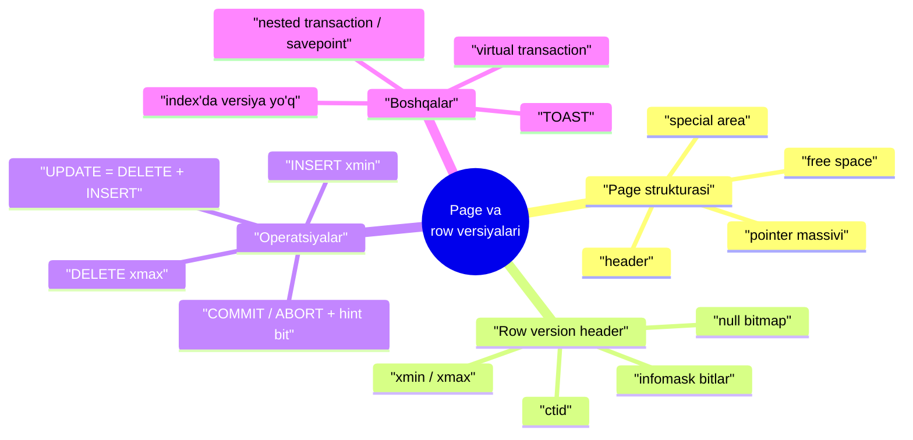
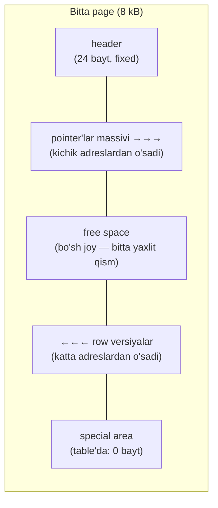
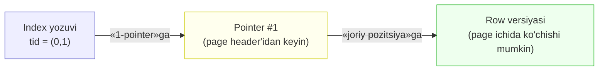
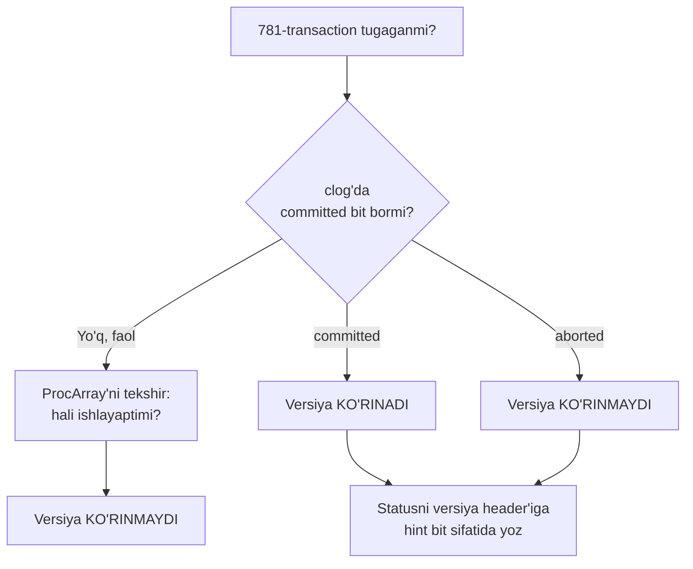
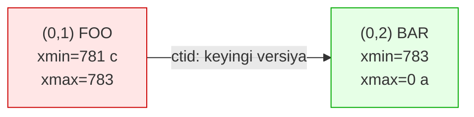
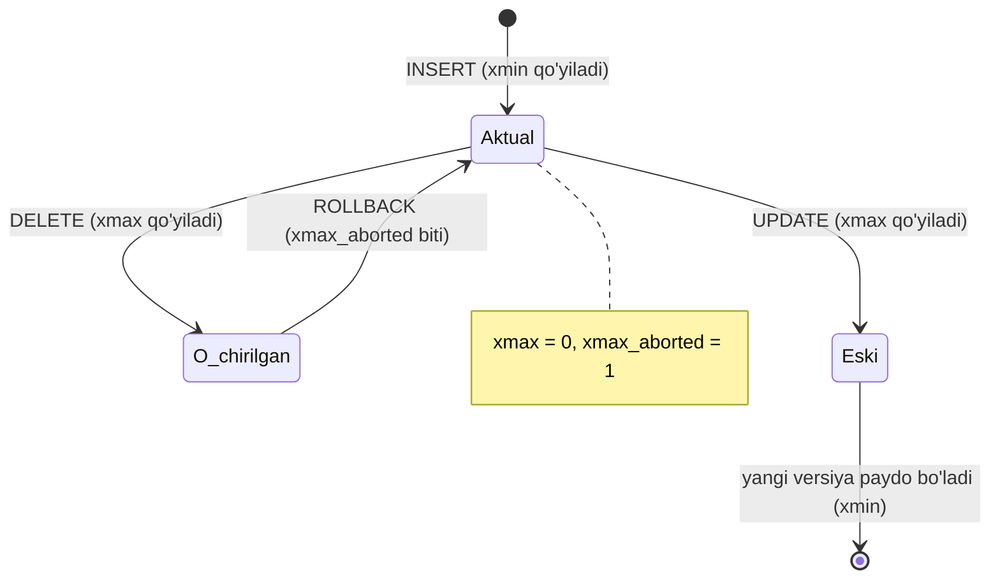
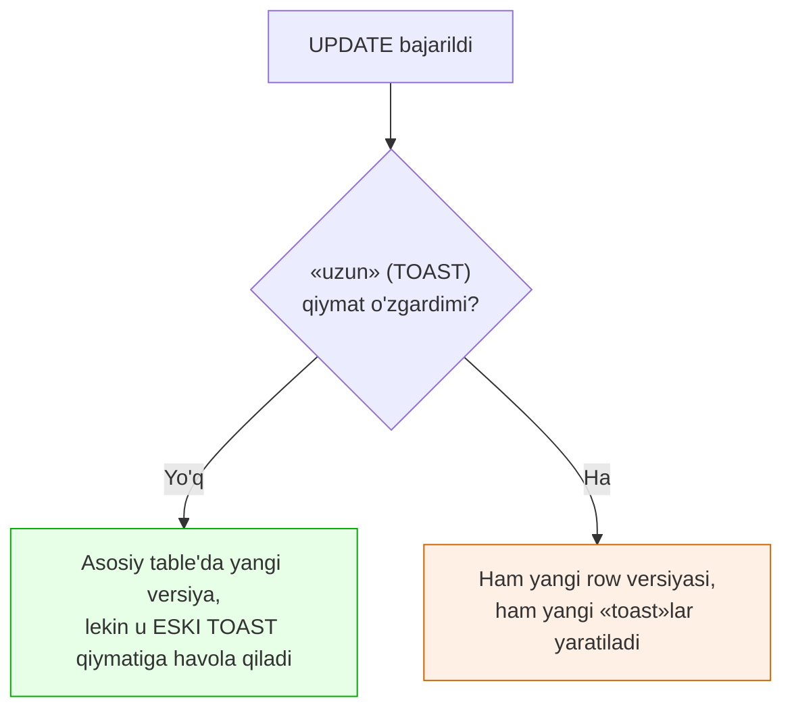
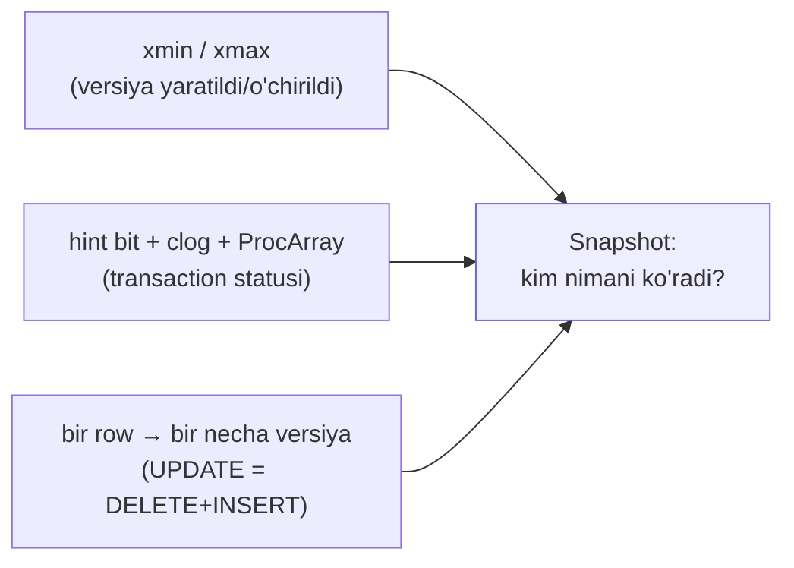

# 3. Page va row versiyalari

> 📖 Manba: Рогов, "PostgreSQL 17 изнутри", 3-bob ("Страницы и версии строк")

## Nima uchun kerak?

2-darsda ko'rdikki, PostgreSQL isolation'ni locklar orqali emas, **Snapshot Isolation (ko'p versiyali)** orqali beradi: bir vaqtda bitta row'ning bir necha **versiyasi** yashaydi, o'quvchi va yozuvchi bir-birini bloklamaydi. O'sha darsda «versiya mexanizmini 3-darsda ochamiz» degan edik — mana shu dars.

Bu darsda **muhandis ko'zi** bilan disk'ga tushamiz: row versiyasi baytma-bayt qanday saqlanadi, `INSERT`/`UPDATE`/`DELETE`/`ROLLBACK` bajarilganda page ichida **aslida nima o'zgaradi**. Buni bilish nega muhim?

- **4-dars (Snapshotlar)** to'g'ridan-to'g'ri shu darsga tayanadi. Snapshot qaysi versiyani ko'rish/ko'rmaslikni `xmin` va `xmax` orqali hal qiladi — ularni avval bu yerda ko'ramiz.
- VACUUM, freezing, bloat — barcha keyingi darslar row versiyasi tuzilishini bilishni talab qiladi.
- `pageinspect` extension bilan siz bazangizni «rentgen» qilib, muammoni ko'zingiz bilan ko'rasiz: nega table shishdi, nega `SELECT` sekin, o'lik versiyalar qayerda.

> **Bu dars — ko'prik.** 2-darsda «nima» ni ko'rdik (anomaliyalar, isolation levellar), bu darsda «qanday» ga tushamiz (`xmin`/`xmax`, hint bit, clog), 4-darsda esa «kim nimani ko'radi» ni yig'ib beramiz (snapshot). Uchtasi bir zanjir.



---

## 3.1. Page strukturasi

PostgreSQL diskdagi barcha ma'lumotni bir xil o'lchamli bloklarga — **page**'larga (default **8 kB**) bo'lib saqlaydi. Table ham, index ham page'lardan tashkil topgan. Har bir page ichida qat'iy ichki tartib bor va odatda quyidagi bo'limlardan iborat:

- **header** (sarlavha) — page haqidagi xizmat ma'lumoti;
- **row versiyalarga pointer'lar massivi** — page mundarijasi;
- **free space** (bo'sh joy);
- **row versiyalar** — asosiy ma'lumot;
- **special area** (maxsus soha) — ba'zi index turlari uchun.



Diqqat qiling: **pointer'lar massivi boshdan** (kichik adreslardan) o'sadi, **row versiyalar oxiridan** (katta adreslardan) o'sadi, o'rtada **free space** qoladi. Ular bir-biriga qarab «yaqinlashadi».

### Header'ni o'z ko'zimiz bilan ko'ramiz

`pageinspect` extension page'ni ochib ko'rish imkonini beradi. Table'ning eng birinchi (nolinchi) page'iga qaraymiz (2-darsdagi `accounts` table'idan foydalanamiz):

```sql
=> CREATE EXTENSION pageinspect;
=> SELECT lower, upper, special, pagesize
   FROM page_header(get_raw_page('accounts',0));
 lower | upper | special | pagesize
-------+-------+---------+----------
   152 |  6904 |    8192 |     8192
(1 row)
```

Bu to'rt raqam page ichidagi chegaralarni ko'rsatadi:

| Ustun | Qiymat | Ma'nosi |
|---|---|---|
| `lower` | 152 | pointer'lar massivi shu adresda tugaydi (undan pastda header) |
| `upper` | 6904 | row versiyalar shu adresdan boshlanadi |
| `special` | 8192 | special area boshi (bu yerda = pagesize, ya'ni special area **bo'sh**) |
| `pagesize` | 8192 | page o'lchami — 8 kB |

`lower` va `upper` orasidagi joy — bu **free space** (6904 − 152 = 6752 bayt bo'sh). Yangi row qo'shilsa, pointer `lower` tomondan, row versiyasining o'zi esa `upper` tomondan yaqinlashadi.

### Special area

Special area page'ning **qarama-qarshi uchida**, katta adreslarda joylashadi. Uni ba'zi **index** turlari yordamchi ma'lumot uchun ishlatadi. Table page'larida esa u har doim **nol o'lchamli** (yuqoridagi misolda `special = pagesize`).

> Index page'lari ancha xilma-xil tuzilgan — mazmuni index turiga bog'liq. Hatto bitta B-tree ichida ham maxsus strukturali nolinchi metadata page va oddiy (table'ga o'xshash) page'lar bor. Bularni 24–29-darslarda ko'ramiz.

### Nega bilvosita adres (indirect addressing)?

Index'lar table'dagi row versiyalariga qandaydir tarzda havola qilishi kerak. Buning uchun **6 bayt**lik row version identifikatori — **tid** (tuple id) ishlatiladi. Tid ikki qismdan iborat: **page raqami** va **shu page ichidagi pointer raqami** (masalan `(0,1)` — nolinchi page, 1-pointer).

Nega to'g'ridan-to'g'ri «page boshidan offset» ishlatilmaydi? Chunki row versiyasini page ichida **ko'chirish** kerak bo'lganda (masalan siqib zichlashda) uning offseti o'zgaradi — va index'dagi barcha havolalar buziladi. Buni oldini olish uchun **bilvosita adres** ishlatiladi:



Row versiyasi ko'chganda uning **tid'i o'zgarmaydi** — faqat **shu page'dagi** pointer yangilanadi. Index'ga tegish shart emas. Har bir pointer aynan **4 bayt** egallaydi va uch narsani saqlaydi: row versiyasining page boshiga nisbatan offseti, uzunligi, va statusini belgilaydigan bir nechta bit.

> **Free space fragmentlanmaydi.** Pointer'lar va row versiyalar orasidagi bo'sh joy har doim **bitta yaxlit** qism. Page ichida hech qachon «teshik-teshik» bo'lib fragmentlanish bo'lmaydi — kerak bo'lganda page qayta zichlanadi (`PageRepairFragmentation`).

---

## 3.2. Row versiyasi strukturasi

Row versiyasi **header** (sarlavha) dan iborat, undan keyin **asl ma'lumot** keladi. Header ko'plab maydonlarni saqlaydi, biz uchun eng muhimlari:

| Maydon | Ma'nosi |
|---|---|
| **xmin** | versiyani **yaratgan** transaction raqami |
| **xmax** | versiyani **o'chirgan** transaction raqami (yoki 0) |
| **infomask** | versiya xususiyatlarini belgilaydigan informatsion bit'lar |
| **ctid** | shu row'ning **keyingi, yangiroq** versiyasiga havola |
| **null bitmap** | qaysi ustunlar `NULL` ekanini belgilaydigan bit massivi |

`xmin` va `xmax` — bitta row'ning turli versiyalarini bir-biridan farqlaydigan ikki «vaqt belgisi». Lekin bu yerda vaqtning o'zi emas, balki **doimiy o'sib boradigan transaction raqamlari hisoblagichi** ishlatiladi. Bu ikki raqam 4-darsda snapshot visibility'sining asosi bo'ladi.

Header ancha katta: har bir versiya uchun **kamida 23 bayt** (odatda null bitmap va alignment tufayli ko'proq — 24 bayt). «Tor» (kam ustunli) table uchun xizmat ma'lumoti foydali ma'lumotdan ham katta bo'lishi mumkin.

### Alignment: ustun tartibi row o'lchamiga ta'sir qiladi

Disk'dagi format operativ xotiradagi tasvir bilan **to'liq mos** keladi — page buffer cache'ga hech qanday o'zgarishsiz, «boricha» o'qiladi. Shuning uchun ko'plab arxitekturalar talab qiladigan **alignment** (mashina so'zi chegarasiga tekislash) row o'lchamiga ta'sir qiladi. Misol:

```sql
=> CREATE TABLE padding(
     b1 boolean,
     i1 integer,
     b2 boolean,
     i2 integer
   );
=> INSERT INTO padding VALUES (true,1, false,2);
=> SELECT lp_len FROM heap_page_items(get_raw_page('padding', 0));
 lp_len
--------
     40
(1 row)
```

`lp_len` — row versiyasining bayt uzunligi. U **40 bayt**: 24 bayt header + `integer`×2 (4+4) + `boolean`×2 (1+1) = 34, qolgan **6 bayt** `integer`ni 4 baytli chegaraga tekislash uchun **isrof** bo'ldi. Ustunlarni qayta tartiblasak:

```sql
=> DROP TABLE padding;
=> CREATE TABLE padding(
     i1 integer,
     i2 integer,
     b1 boolean,
     b2 boolean
   );
=> INSERT INTO padding VALUES (1,2, true,false);
=> SELECT lp_len FROM heap_page_items(get_raw_page('padding', 0));
 lp_len
--------
     34
(1 row)
```

Endi **34 bayt** — isrof yo'q! Aynan bir xil ma'lumot, faqat ustunlar tartibi boshqacha.

> **Amaliy qoida:** table loyihalashda **katta va fixed o'lchamli** ustunlarni (`bigint`, `integer`, `double precision`) boshiga, kichiklarini (`boolean`, `smallint`) oxiriga qo'ying. Katta table'da bu bir necha foiz joyni tejaydi. Bu — bloat'ga qarshi kurashda birinchi qadam (8-darsda batafsil).

> **Nima uchun «heap»?** PostgreSQL'da table'lar `heap` (uyum) deb ataladi. Bu row versiyalarga joy ajratish operativ xotirani dinamik taqsimlashga o'xshaganidan — «hammasi uyumga tashlangan», tartiblangan index'lardan farqli. Shuning uchun `heap_page_items` funksiyasi table page'i bilan ishlaydi.

---

## 3.3. Row versiyalari ustida amallar

Endi eng qiziq qismga o'tamiz: `INSERT`, `COMMIT`, `DELETE`, `ROLLBACK`, `UPDATE` bajarilganda page ichida **aslida nima o'zgaradi**. Tajriba uchun ikki ustunli table va biri bo'yicha index yaratamiz:

```sql
=> CREATE TABLE t(
     id integer GENERATED ALWAYS AS IDENTITY,
     s text
   );
=> CREATE INDEX ON t(s);
```

### INSERT

Transaction ochib, bitta row qo'shamiz:

```sql
=> BEGIN;
=> INSERT INTO t(s) VALUES ('FOO');
=> SELECT pg_current_xact_id();   -- v.13 gacha: txid_current()
 pg_current_xact_id
--------------------
                781
(1 row)
```

Bizning transaction raqamimiz — **781** (xact id, txid yoki qisqa **xid**). Page ichiga `heap_page_items` bilan qaraymiz, lekin u ma'lumotni «boricha», o'qish qiyin formatda beradi. Shuning uchun kitobdagidek yordamchi funksiya yaratamiz — u tid'ni chiroyli ko'rsatadi va transaction statusini raqam yoniga qo'shadi:

```sql
=> CREATE FUNCTION heap_page(relname text, pageno integer)
   RETURNS TABLE(ctid tid, state text, xmin text, xmax text)
   AS $$
   SELECT (pageno,lp)::text::tid AS ctid,
     CASE lp_flags
       WHEN 0 THEN 'unused'
       WHEN 1 THEN 'normal'
       WHEN 2 THEN 'redirect to '||lp_off
       WHEN 3 THEN 'dead'
     END AS state,
     t_xmin || CASE
       WHEN (t_infomask & 256) > 0 THEN ' c'
       WHEN (t_infomask & 512) > 0 THEN ' a'
       ELSE ''
     END AS xmin,
     t_xmax || CASE
       WHEN (t_infomask & 1024) > 0 THEN ' c'
       WHEN (t_infomask & 2048) > 0 THEN ' a'
       ELSE ''
     END AS xmax
   FROM heap_page_items(get_raw_page(relname,pageno))
   ORDER BY lp;
   $$ LANGUAGE sql;
```

> **Bu funksiya keyingi darslarda ham kerak.** 4- va 5-darslar aynan shu `heap_page` funksiyasidan foydalanadi — agar hali yaratmagan bo'lsangiz, hozir ishga tushiring.

Endi page holatini ko'ramiz:

```sql
=> SELECT * FROM heap_page('t',0);
 ctid  | state  | xmin | xmax
-------+--------+------+------
 (0,1) | normal | 781  | 0 a
(1 row)
```

Buni o'qib chiqamiz:

- `(0,1)` — nolinchi page, 1-pointer, `state = normal` (pointer haqiqiy versiyaga havola qilyapti);
- `xmin = 781` — versiyani bizning transaction yaratdi, lekin **statusi belgisiz** (transaction hali faol);
- `xmax = 0 a` — versiya o'chirilmagan (0 = soxta raqam), `a` esa `xmax_aborted` biti o'rnatilganini bildiradi.

> **Nega `xmax = 0` ga «aborted» biti qo'yilgan?** Mavjud bo'lmagan transaction'ga «bekor qilingan» biti g'alati tuyuladi. Lekin isolation nuqtai nazaridan **bekor qilingan transaction = mavjud bo'lmagan transaction** — u iz qoldirmaydi. Shuning uchun transaction'lar `xmax`'ga qaramaydi: versiya o'chirilmagan, aktual.

### infomask bit'lari

`xmin` va `xmax` yoniga chiqadigan `c` / `a` harflari `infomask` maydonidagi to'rt muhim bit'dan keladi:

| Bit (qiymat) | Nomi | Ma'nosi |
|---|---|---|
| 256 | `xmin_committed` (`c`) | `xmin` transaction **commit** qilingan |
| 512 | `xmin_aborted` (`a`) | `xmin` transaction **abort** qilingan |
| 1024 | `xmax_committed` (`c`) | `xmax` transaction **commit** qilingan |
| 2048 | `xmax_aborted` (`a`) | `xmax` transaction **abort** qilingan |

Bu bit'lar — **hint bit** (bit-podskazka, maslahat biti). Ular transaction statusini row versiyasining **o'zida** eslab qoladi, keyingi darsda ko'ramiz.

### COMMIT — clog va hint bit'lar

Transaction muvaffaqiyatli tugaganda uning statusini eslab qolish kerak. Buning uchun **clog** (commit log) ishlatiladi — bu system catalog table emas, balki `PGDATA/pg_xact` katalogidagi maxsus fayllar. clog'da har bir transaction uchun **ikki bit** ajratilgan: `committed` va `aborted`.

Boshqa transaction bizning page'imizga murojaat qilganda, u savolga javob berishi kerak: **781-transaction tugaganmi?**



Bu tekshiruv ikki strukturaga tayanadi:

- **ProcArray** — shared memory'dagi barcha faol process'lar ro'yxati (transaction faolmi yoki tugaganmi shu yerdan bilinadi);
- **clog** — tugagan transaction commit bilanmi yoki abort bilanmi tugaganini aytadi.

Har safar clog'ga murojaat qimmat. Shuning uchun bir marta aniqlangan status row versiyasi header'idagi **hint bit**'larga (`xmin_committed`/`xmin_aborted`) yoziladi. Keyingi transaction endi na clog'ga, na ProcArray'ga murojaat qilmaydi — tayyor javobni versiyaning o'zidan oladi.

Endi transaction'ni commit qilamiz:

```sql
=> COMMIT;
=> SELECT * FROM heap_page('t',0);
 ctid  | state  | xmin | xmax
-------+--------+------+------
 (0,1) | normal | 781  | 0 a
(1 row)
```

Diqqat: page'da **hech narsa o'zgarmadi**! `xmin` yonida hali `c` yo'q. Sababi — commit statusi clog'ga yozildi, lekin hint bit hali qo'yilmagan. **Nega commit paytida qo'yilmaydi?** Chunki commit momentida qaysi page'larda qaysi row'lar o'zgarganini eslab yurish qimmat (page'lar ko'p, ba'zilari diskka siqib chiqarilgan bo'lishi mumkin) — bu commit'ni sekinlashtirardi.

Hint bit **page'ga birinchi «oddiy» murojaat**da qo'yiladi (`pageinspect` orqali emas):

```sql
=> SELECT * FROM t;
 id |  s
----+-----
  1 | FOO
=> SELECT * FROM heap_page('t',0);
 ctid  | state  | xmin  | xmax
-------+--------+-------+------
 (0,1) | normal | 781 c | 0 a
(1 row)
```

Mana endi `xmin = 781 c` — commit statusi versiyaning o'ziga yozildi.

> **Ajablanarli natija:** hatto oddiy `SELECT` ham page'ni **dirty** (o'zgargan) qilishi mumkin, chunki u hint bit qo'yadi. Ya'ni «faqat o'qish» amaliyoti ham diskka yozuvga sabab bo'lishi mumkin.

### DELETE

Row o'chirilganda **yangi versiya yaratilmaydi** — aktual versiyaning `xmax`'iga o'chiruvchi transaction raqami yoziladi:

```sql
=> BEGIN;
=> DELETE FROM t;
=> SELECT pg_current_xact_id();
 pg_current_xact_id
--------------------
                782
(1 row)
=> SELECT * FROM heap_page('t',0);
 ctid  | state  | xmin  | xmax
-------+--------+-------+------
 (0,1) | normal | 781 c | 782
(1 row)
```

`xmax = 782` (hint bit'siz — transaction hali faol). Bu `xmax` bir vaqtning o'zida **row lock** vazifasini ham bajaradi: agar boshqa transaction shu row'ni o'zgartirmoqchi bo'lsa, 782-transaction tugashini kutadi (13-darsda batafsil).

### ABORT (ROLLBACK)

Abort commit'ga o'xshab **tez** ishlaydi — clog'da `committed` o'rniga `aborted` biti qo'yiladi, xolos. Buyruq `ROLLBACK` deyilsa ham, **hech narsa haqiqatan qaytarilmaydi**: transaction page'da nimani o'zgartirgan bo'lsa, hammasi joyida qoladi:

```sql
=> ROLLBACK;
=> SELECT * FROM heap_page('t',0);
 ctid  | state  | xmin  | xmax
-------+--------+-------+------
 (0,1) | normal | 781 c | 782
(1 row)
```

`xmax = 782` hali page'da turibdi! Faqat page'ga keyingi murojaatda `xmax_aborted` hint biti qo'yiladi va endi bu raqamga hech kim qaramaydi:

```sql
=> SELECT * FROM t;
 id |  s
----+-----
  1 | FOO
=> SELECT * FROM heap_page('t',0);
 ctid  | state  | xmin  | xmax
-------+--------+-------+-------
 (0,1) | normal | 781 c | 782 a
(1 row)
```

`xmax = 782 a` — o'chirish bekor qilingan, row yana aktual.

> **Muhim xulosa:** PostgreSQL'da `ROLLBACK` `COMMIT` kabi **tez** — ikkalasi ham clog'da bitta bit qo'yadi. Bu ko'p DBMS'dan farqli: bu yerda «rollback» diskdagi o'zgarishlarni qaytarmaydi, keyingi transaction'lar hint bit orqali bekor qilingan versiyalarni shunchaki «ko'rmay» o'tadi.

### UPDATE = DELETE + INSERT

`UPDATE` ichida **eski versiya delete** qilinadi (`xmax` qo'yiladi) va **yangi versiya insert** qilinadi:

```sql
=> BEGIN;
=> UPDATE t SET s = 'BAR';
=> SELECT pg_current_xact_id();
 pg_current_xact_id
--------------------
                783
(1 row)
=> SELECT * FROM t;
 id |  s
----+-----
  1 | BAR
(1 row)
```

`SELECT` bitta (yangi) versiyani qaytardi. Lekin page'da **ikkala** versiya yashaydi:

```sql
=> SELECT * FROM heap_page('t',0);
 ctid  | state  | xmin  | xmax
-------+--------+-------+------
 (0,1) | normal | 781 c | 783
 (0,2) | normal | 783   | 0 a
(2 rows)
```



- eski versiya `(0,1)`: `xmax = 783` — 783-transaction «o'chirdi»;
- yangi versiya `(0,2)`: `xmin = 783` — o'sha transaction yaratdi, `xmax = 0 a` — aktual.

E'tibor bering: eski versiyaning `xmax`'iga 783 yozilib, avvalgi (bekor qilingan 782) qiymat **ustiga yozildi**, `xmax_aborted` biti tozalandi. Endi commit qilamiz:

```sql
=> COMMIT;
```

Umumiy manzara:



---

## 3.4. Index'larda versiya YO'Q

Bu — juda muhim va ko'pincha chalkashtiriladigan nuqta:

> **Har qanday turdagi index'da hech qachon row versiyalar bo'lmaydi.** Har bir index yozuvi aynan **bitta nusxada** mavjud — index header'ida `xmin`/`xmax` maydonlari yo'q.

Index'dan havola **barcha** table versiyalariga boradi. Qaysi versiya ko'rinishini transaction **table'ga qarab** aniqlaydi (agar page visibility map'da belgilanmagan bo'lsa — buni 6-darsda ko'rdik/ko'ramiz). Index page'ini ko'ramiz:

```sql
=> CREATE FUNCTION index_page(relname text, pageno integer)
   RETURNS TABLE(itemoffset smallint, htid tid)
   AS $$
   SELECT itemoffset,
          htid   -- v.13 gacha: ctid
   FROM bt_page_items(relname,pageno);
   $$ LANGUAGE sql;
=> SELECT * FROM index_page('t_s_idx',1);
 itemoffset | htid
------------+-------
          1 | (0,2)
          2 | (0,1)
(2 rows)
```

Index'da row'ning **ikkala** versiyasiga havola bor — aktual `(0,2)` va eski `(0,1)`. `BAR < FOO` bo'lgani uchun `(0,2)` (BAR) index'da birinchi turibdi.

> **Nega bu muhim?** Har bir `UPDATE` index'da yangi yozuv qoldiradi — hatto index ustuni o'zgarmagan bo'lsa ham. Bu index bloat'ining va VACUUM'ning index bosqichi zarurligining sababi. Buni yumshatuvchi **HOT update** mexanizmini 5-darsda ko'ramiz.

---

## 3.5. TOAST

**TOAST** (The Oversized-Attribute Storage Technique) — page'ga (8 kB) sig'maydigan «uzun» qiymatlarni saqlash mexanizmi. TOAST-table mohiyatan oddiy table bo'lib, o'zining versiyaliligiga ega, lekin **soddalashgan**: uning row'lari hech qachon `UPDATE` qilinmaydi — faqat qo'shiladi va o'chiriladi.

Asosiy table'da ma'lumot o'zgarganda **har doim** yangi row versiyasi yaratiladi. Lekin:



Ya'ni katta matn ustunini o'zgartirmasangiz, `UPDATE` uni qayta yozmaydi — yangi versiya eski TOAST qiymatiga havola qiladi. Bu katta BLOB'lar bilan ishlashda juda tejamkor.

---

## 3.6. Virtual transaction'lar

PostgreSQL transaction raqamlarini **tejaydigan** optimizatsiya ishlatadi. 7-darsda ko'ramizki, transaction raqami 32-bitli — cheklangan resurs, uni behuda sarflash yaramaydi.

G'oya oddiy: agar transaction **faqat o'qisa**, u row versiyalarining ko'rinishiga hech qanday ta'sir qilmaydi (`xmin`/`xmax`'ni o'zgartirmaydi). Shuning uchun avvaliga unga **virtual raqam** (virtual xid) beriladi — process ID + ketma-ket son. Bu raqam faqat operativ xotirada yashaydi, **hech qachon diskka tushmaydi**:

```sql
=> BEGIN;
=> SELECT pg_current_xact_id_if_assigned();   -- v.13 gacha: txid_current_if_assigned()
 pg_current_xact_id_if_assigned
--------------------------------

(1 row)
```

Bo'sh — haqiqiy raqam hali yo'q! Faqat transaction **ma'lumot o'zgartira boshlaganda** unga haqiqiy, unikal raqam beriladi:

```sql
=> UPDATE accounts SET amount = amount - 1.00;
=> SELECT pg_current_xact_id_if_assigned();
 pg_current_xact_id_if_assigned
--------------------------------
                            785
(1 row)
=> COMMIT;
```

> **Nega muhim?** Ko'p read-only transaction ishlaydigan tizimda bu optimizatsiya haqiqiy transaction hisoblagichining o'sishini keskin sekinlashtiradi — bu 7-darsdagi **wraparound** muammosini kechiktiradi.

---

## 3.7. Nested transaction'lar (savepoint)

### Savepoint nima?

SQL'da **savepoint** (saqlash nuqtasi) bor — u transaction'ning **bir qismini** bekor qilish imkonini beradi, uni to'liq to'xtatmasdan. Lekin bu yuqoridagi sxemaga sig'maydi: transaction statusi barcha o'zgarishlar uchun **bitta**, fizik jihatdan esa hech narsa qaytarilmaydi.

Yechim: savepoint'li transaction bir necha **nested transaction** (subtransaction) ga bo'linadi, ularning statusini alohida boshqarish mumkin. Har bir nested transaction o'z raqamiga ega (asosiydan katta) va statusi clog'ga yoziladi.

### Eksperiment

Table'ni tozalab, transaction ochamiz va row qo'shamiz:

```sql
=> TRUNCATE TABLE t;
=> BEGIN;
=> INSERT INTO t(s) VALUES ('FOO');
=> SELECT pg_current_xact_id();
 pg_current_xact_id
--------------------
                787
(1 row)
```

Savepoint qo'yib, yana bitta row qo'shamiz:

```sql
=> SAVEPOINT sp;
=> INSERT INTO t(s) VALUES ('XYZ');
=> SELECT *
   FROM heap_page('t',0) p
   LEFT JOIN t ON p.ctid = t.ctid;
 ctid  | state  | xmin | xmax | id |  s
-------+--------+------+------+----+-----
 (0,1) | normal | 787  | 0 a  |  2 | FOO
 (0,2) | normal | 788  | 0 a  |  3 | XYZ
(2 rows)
```

Diqqat: `FOO` versiyasining `xmin = 787` (asosiy transaction), `XYZ` versiyasining `xmin = 788` (**nested** transaction, raqami kattaroq). Endi savepoint'ga qaytamiz (`XYZ` bekor bo'ladi) va uchinchi row qo'shamiz:

```sql
=> ROLLBACK TO sp;
=> INSERT INTO t(s) VALUES ('BAR');
=> SELECT *
   FROM heap_page('t',0) p
   LEFT JOIN t ON p.ctid = t.ctid;
 ctid  | state  | xmin | xmax | id |  s
-------+--------+------+------+----+-----
 (0,1) | normal | 787  | 0 a  |  2 | FOO
 (0,2) | normal | 788  | 0 a  |    |
 (0,3) | normal | 789  | 0 a  |  4 | BAR
(3 rows)
```

`XYZ` versiyasi (`0,2`) hali page'da turibdi, lekin table'dan qaraganda `id`/`s` bo'sh — u bekor qilingan nested transaction'ga tegishli. Commit qilamiz va yakuniy manzarani ko'ramiz:

```sql
=> COMMIT;
=> SELECT * FROM heap_page('t',0);
 ctid  | state  | xmin  | xmax
-------+--------+-------+------
 (0,1) | normal | 787 c | 0 a
 (0,2) | normal | 788 a | 0 a
 (0,3) | normal | 789 c | 0 a
(3 rows)
```

Har bir nested transaction o'z statusiga ega: `787 c` (commit), `788 a` (abort), `789 c` (commit).

> **Nested ≠ autonomous.** Nested transaction asosiy transaction'ga bog'liq: agar asosiy bekor bo'lsa, barcha nested'lar ham bekor. Autonomous transaction'lar bir-biriga bog'liq emas — va oddiy PostgreSQL'da ular **yo'q** (bu ataylab: ular ko'pincha suiiste'mol qilinadi).

### Xatolik va atomicity

Nested transaction mexanizmi **bilvosita** ham ishlaydi — masalan xatolik yuz berganda. Agar operator bajarilishida error chiqsa:

```sql
=> BEGIN;
=> UPDATE t SET s = repeat('X', 1/(id-4));
ERROR:  division by zero
=> SELECT * FROM t;
ERROR:  current transaction is aborted, commands ignored until end of transaction block
```

Xatolikdan keyin transaction **to'liq uzilgan** hisoblanadi — boshqa hech qanday amal ruxsat etilmaydi, `COMMIT` ham `ROLLBACK` ga aylanadi. **Nega?** Chunki bajarilgan amallar fizik qaytarilmaydi. Agar davom ettirilsa, error'dan **oldin** bajarilgan qisman o'zgarishlarga kirish mumkin bo'lardi — bu nafaqat transaction'ning, hatto **operator'ning atomicity'sini** buzardi.

> **psql hiylasi:** `\set ON_ERROR_ROLLBACK on` rejimida psql har buyruq oldiga yashirin savepoint qo'yadi va xatoda unga qaytadi — transaction «omon qoladi». Bu default emas, chunki har buyruqqa savepoint qo'yish sezilarli overhead beradi.

---

## Endi 4-darsga tayyormiz

Bu darsda quyidagi «g'ishtlar»ni qo'ydik, 4-dars ular ustiga snapshot mexanizmini quradi:



4-darsda: transaction o'z snapshot'i orqali `xmin`/`xmax`'ga qarab, har bir row'ning **aynan bitta** versiyasini tanlaydi. Shu tanlov isolation'ni ta'minlaydi.

---

## Xulosa

- PostgreSQL ma'lumotni **page**'larda (default 8 kB) saqlaydi. Har page: header, pointer'lar massivi, free space, row versiyalar, special area (table'da bo'sh).
- Index table'ga **tid** (page raqami + pointer raqami) orqali havola qiladi. **Bilvosita adres** row versiyasini page ichida ko'chirganda index havolalarini buzmaydi.
- Row versiyasi header'i **kamida 23 bayt**. Ustunlarni to'g'ri tartiblash (katta+fixed oldinga) **alignment** isrofini kamaytiradi.
- Har versiyada **`xmin`** (yaratgan transaction) va **`xmax`** (o'chirgan transaction) bor. Bu raqamlar 4-darsda snapshot visibility'sining asosi.
- `INSERT` → `xmin` qo'yadi; `DELETE` → `xmax` qo'yadi; `UPDATE` = eski versiyaga `xmax` + yangi versiya (`xmin`). O'chirilgan versiya darhol yo'qolmaydi.
- Transaction statusi **clog**'da (`committed`/`aborted`) saqlanadi, ProcArray faollikni ko'rsatadi. Aniqlangan status versiyaning **hint bit**'lariga yoziladi — hatto `SELECT` ham page'ni dirty qilishi mumkin.
- `COMMIT` va `ROLLBACK` bir xil **tez** — ikkalasi clog'da bitta bit qo'yadi; abort diskdagi o'zgarishlarni qaytarmaydi.
- **Index'da versiya yo'q** — bitta yozuv barcha table versiyalariga havola qiladi. Har `UPDATE` index'da yangi yozuv qoldiradi (index bloat sababi).
- **TOAST** «uzun» qiymatlarni alohida saqlaydi; TOAST qiymati o'zgarmasa, yangi versiya eski TOAST'ga havola qiladi.
- **Virtual transaction** faqat o'quvchi transaction'ga raqam sarflamaydi (wraparound'ni kechiktiradi). **Nested transaction** (savepoint) transaction'ni alohida boshqariladigan qismlarga bo'ladi.

## Nazorat savollari

1. Page ichida pointer'lar massivi va row versiyalar qaysi tomondan o'sadi, o'rtada nima qoladi? `page_header`dagi `lower` va `upper` nimani bildiradi?
2. Nega index to'g'ridan-to'g'ri «page boshidan offset» emas, balki pointer raqamiga (bilvosita adres) havola qiladi? Bu qanday muammodan saqlaydi?
3. Bir xil ma'lumotli ikki table turli o'lchamda bo'lishi mumkinmi? `padding` misolida alignment nega 6 baytni isrof qildi va uni qanday tuzatdik?
4. `INSERT`, `DELETE`, `UPDATE` bajarilganda `xmin`/`xmax` qanday o'zgaradi? Nega `UPDATE`dan keyin page'da ikkita versiya bo'ladi?
5. `xmax = 0 a` (aborted biti bilan) nimani bildiradi? Nega mavjud bo'lmagan transaction'ga «aborted» biti qo'yiladi?
6. Hint bit nima uchun kerak va nima uchun u commit paytida emas, page'ga birinchi murojaatda qo'yiladi? Nega oddiy `SELECT` ham page'ni dirty qilishi mumkin?
7. Nega PostgreSQL'da `ROLLBACK` `COMMIT` kabi tez? «Rollback» aslida nimani qaytaradi (va nimani qaytarmaydi)?
8. Index'da row versiyalar bormi? Bir `UPDATE` index'ga qanday ta'sir qiladi va bu qanday muammoga (bloat) olib keladi?
9. Virtual transaction nima uchun kerak va u qachon haqiqiy raqamga aylanadi? Bu 32-bitli hisoblagich bilan qanday bog'liq?
10. Savepoint mexanizmi ichkarida qanday ishlaydi? Nega operatorda xatolik yuz bersa, butun transaction uziladi?
