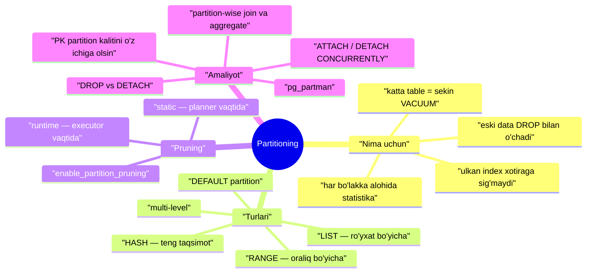
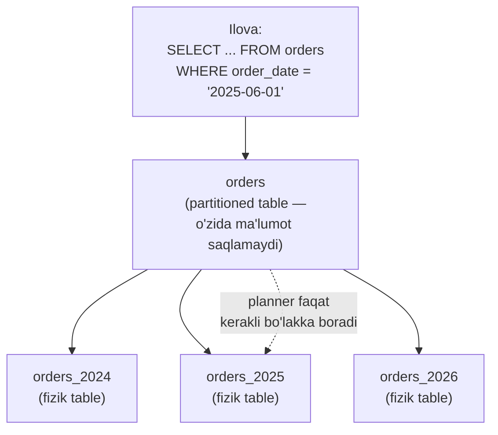
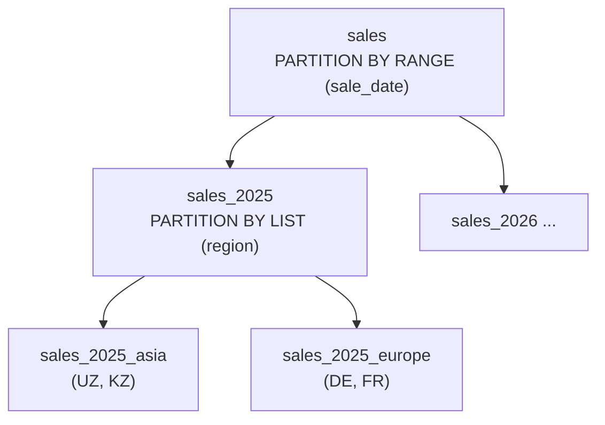
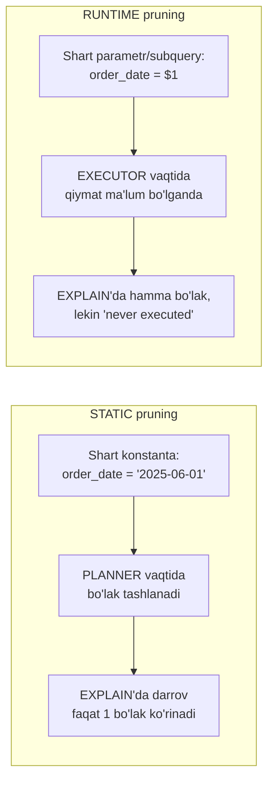
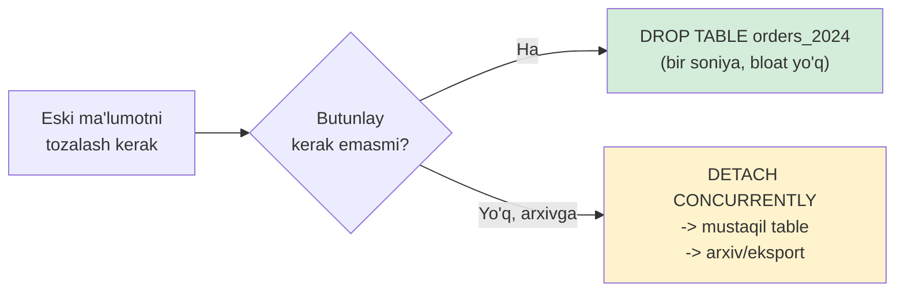
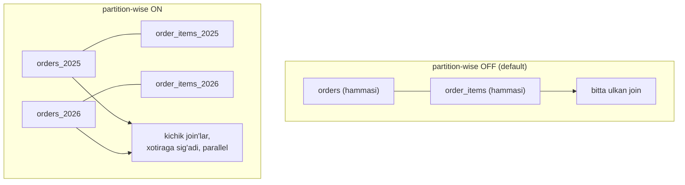

# 30. Partitioning

> 📖 Qo'shimcha dars — Rogov kitobiga kirmagan, lekin amaliyotda zarur mavzu

## Nima uchun kerak?

Tasavvur qiling: `orders` table'ingizda **500 million** row bor va u har kuni yana bir necha million row bilan o'sib bormoqda. Shu bitta ulkan fayl bilan ishlashda bir necha muammo bir vaqtning o'zida paydo bo'ladi:

- **VACUUM azob beradi.** 6-darsda ko'rganmiz: vacuum butun table'ni va **barcha index'larni** skanlaydi. 500 mln row'li table'ni bir marta tozalash soatlab davom etishi mumkin. Autovacuum ulgurmay qoladi, o'lik versiyalar to'planadi.
- **Index'lar ulkan.** 8-darsda bloat'ni ko'rgan edik: bitta B-tree index yuz gigabaytga yetadi, u xotiraga sig'maydi, har qidiruv disk'ga tushadi.
- **Eski ma'lumotni o'chirish qimmat.** "Bir yildan eski buyurtmalarni o'chir" degan `DELETE` — bu million-million row'ni o'lik versiyaga aylantiradi, keyin ularni yana vacuum tozalashi kerak. Katta bloat, uzoq lock.
- **Statistika qo'polashadi.** Butun table uchun bitta statistika (17-dars) — planner "yaqin oydagi buyurtmalar" bilan "3 yil oldingi" ni ajrata olmaydi.

Yechim oddiy g'oyaga tayanadi: **bitta ulkan table'ni ko'plab kichik table'larga bo'lib tashlash**, lekin foydalanuvchiga baribir **bitta table** ko'rinib tursin. Bu — **partitioning** (bo'laklarga bo'lish).

Har bo'lak (**partition**) — bu alohida fayl, alohida index, alohida statistika. Vacuum har bo'lakni alohida tozalaydi; eski ma'lumotni o'chirish esa bir soniyalik `DROP TABLE` ga aylanadi — hech qanday `DELETE`, hech qanday bloat.



---

## 30.1. Partitioning nima: intuitsiya

Kutubxonani tasavvur qiling. Barcha kitoblar bitta ulkan javonda aralash tursa, kerakli kitobni topish uchun butun javonni ko'zdan kechirasiz. Aqlli kutubxonachi javonni **bo'limlarga** ajratadi: "Tarix", "Fizika", "She'riyat". Fizika kitobi kerak bo'lsa — faqat "Fizika" bo'limiga borasiz, qolganiga qaramaysiz ham.

Partitioning aynan shu. Foydalanuvchi uchun bitta **partitioned table** (masalan `orders`) bor, lekin ma'lumot fizik jihatdan bir necha **partition** (masalan `orders_2024`, `orders_2025`) orasida taqsimlangan. Qaysi row qaysi partition'ga tushishini **partition kaliti** (partition key) belgilaydi — masalan `order_date`.



> **Muhim tushuncha.** Partitioned table (ota-table) — bu shunchaki "qopqoq", o'zida bironta row saqlamaydi. Barcha ma'lumot **partition'larda** yotadi. Ota-table faqat sxema (ustunlar, partition kaliti) va marshrutlash qoidasini biladi.

### Declarative va inheritance

Tarixan PostgreSQL'da partitioning **table inheritance** (`INHERITS`) va trigger'lar orqali qo'lda qurilar edi — ko'p kod, ko'p xato. PostgreSQL 10'dan boshlab **declarative partitioning** paydo bo'ldi: hammasini bitta `PARTITION BY` bilan e'lon qilasiz, PostgreSQL o'zi marshrutlaydi. Biz faqat shu zamonaviy usulni ko'ramiz — eski inheritance'ni faqat legacy tizimda uchratasiz.

---

## 30.2. RANGE partitioning — oraliq bo'yicha

Eng ko'p ishlatiladigan tur. Row'lar partition kalitining **oraliqlari** bo'yicha taqsimlanadi. Klassik holat — vaqt bo'yicha (time-series): har oy yoki har yil alohida partition.

Avval **ota-table**'ni `PARTITION BY RANGE` bilan yaratamiz:

```sql
=> CREATE TABLE orders (
     id          bigint       GENERATED ALWAYS AS IDENTITY,
     order_date  date         NOT NULL,
     customer_id bigint       NOT NULL,
     amount      numeric(10,2)
   ) PARTITION BY RANGE (order_date);
```

Diqqat: bu table'ga hozir `INSERT` qilib bo'lmaydi — hali bironta partition yo'q, row qayerga borishini bilmaydi. Endi partition'larni yaratamiz:

```sql
=> CREATE TABLE orders_2024 PARTITION OF orders
     FOR VALUES FROM ('2024-01-01') TO ('2025-01-01');
=> CREATE TABLE orders_2025 PARTITION OF orders
     FOR VALUES FROM ('2025-01-01') TO ('2026-01-01');
```

> **Chegara qoidasi:** `FROM` — **qamrab oladi** (inclusive), `TO` — **qamramaydi** (exclusive). Ya'ni `2025-01-01` aynan `orders_2025`'ga tushadi, `orders_2024`'ga emas. Bu chegaralar ustma-ust tushmasligini kafolatlaydi.

Endi INSERT qilamiz — PostgreSQL o'zi to'g'ri partition'ni topadi:

```sql
=> INSERT INTO orders (order_date, customer_id, amount) VALUES
     ('2024-07-15', 1, 100.00),
     ('2025-06-01', 2, 250.00);
```

Row'lar qayerda yotganini tekshiramiz — `tableoid` orqali har row qaysi fizik table'dan kelganini ko'rsak bo'ladi:

```sql
=> SELECT tableoid::regclass AS partition, id, order_date
   FROM orders ORDER BY id;
  partition  | id | order_date
-------------+----+------------
 orders_2024 |  1 | 2024-07-15
 orders_2025 |  2 | 2025-06-01
(2 rows)
```

Birinchi row `orders_2024`'ga, ikkinchisi `orders_2025`'ga marshrutlangan.

> 🤔 **O'ylab ko'r:** `('2026-03-01', ...)` row qo'shsak nima bo'ladi? 2026 uchun partition yo'q. Javob — quyida `DEFAULT partition` bo'limida.

---

## 30.3. LIST partitioning — ro'yxat bo'yicha

Bu yerda taqsimot **aniq qiymatlar ro'yxati** bo'yicha bo'ladi. Masalan mintaqa (region) bo'yicha: har mintaqa alohida partition.

```sql
=> CREATE TABLE customers (
     id     bigint GENERATED ALWAYS AS IDENTITY,
     name   text,
     region text NOT NULL
   ) PARTITION BY LIST (region);

=> CREATE TABLE customers_asia PARTITION OF customers
     FOR VALUES IN ('UZ', 'KZ', 'KG', 'TJ');
=> CREATE TABLE customers_europe PARTITION OF customers
     FOR VALUES IN ('DE', 'FR', 'PL');
```

Har partition o'ziga tegishli qiymatlar ro'yxatini **sanab** turadi. RANGE'da oraliq bergan bo'lsak, bu yerda aniq qiymatlarni sanaymiz.

```sql
=> INSERT INTO customers (name, region) VALUES
     ('Aziz', 'UZ'), ('Hans', 'DE');
=> SELECT tableoid::regclass AS partition, name, region FROM customers;
    partition     | name | region
------------------+------+--------
 customers_asia   | Aziz | UZ
 customers_europe | Hans | DE
(2 rows)
```

> **Qachon LIST?** Qiymatlar to'plami **cheklangan va ma'lum** bo'lganda: mamlakat kodi, status (`active`/`archived`), tenant ID. Agar qiymatlar sonsiz oqib kelsa (masalan sana) — RANGE to'g'riroq.

---

## 30.4. HASH partitioning — teng taqsimot

Ba'zan ma'lumotni mazmuniga qarab emas, shunchaki **teng bo'laklarga** bo'lish kerak. Masalan `events`'ni `customer_id` bo'yicha teng taqsimlab, yozuv yukini bir necha faylga tarqatmoqchisiz — lekin sana yoki mintaqa tabiiy chegara bermaydi.

Bunda PostgreSQL kalitning **hash**'ini hisoblab, `modulus`'ga bo'lgandagi **qoldiq** (`remainder`) bo'yicha marshrutlaydi:

```sql
=> CREATE TABLE events (
     id          bigint,
     customer_id bigint NOT NULL,
     payload     jsonb
   ) PARTITION BY HASH (customer_id);

=> CREATE TABLE events_p0 PARTITION OF events
     FOR VALUES WITH (MODULUS 4, REMAINDER 0);
=> CREATE TABLE events_p1 PARTITION OF events
     FOR VALUES WITH (MODULUS 4, REMAINDER 1);
=> CREATE TABLE events_p2 PARTITION OF events
     FOR VALUES WITH (MODULUS 4, REMAINDER 2);
=> CREATE TABLE events_p3 PARTITION OF events
     FOR VALUES WITH (MODULUS 4, REMAINDER 3);
```

`MODULUS 4` degani — 4 ta bo'lak. `hash(customer_id) % 4 = 0` bo'lgan row'lar `events_p0`'ga, `= 1` bo'lganlari `events_p1`'ga va hokazo. Natijada row'lar 4 partition'ga deyarli **teng** tarqaladi.

| Tur | Marshrutlash qoidasi | Tabiiy holat |
|---|---|---|
| **RANGE** | kalit oraliqqa tushadi | sana, raqamli diapazon (time-series) |
| **LIST** | kalit ro'yxatda bor | mintaqa, status, tenant |
| **HASH** | `hash(kalit) % modulus` | teng yuk taqsimoti, tabiiy chegarasiz |

> **HASH kamchiligi:** partition pruning faqat **aniq tenglik** (`customer_id = 42`) uchun ishlaydi, `>`/`<`/`BETWEEN` uchun emas — hash tartibni saqlamaydi. Shuning uchun HASH'ni faqat teng taqsimot maqsadida, oraliq so'rovlar bo'lmaganda ishlating.

---

## 30.5. DEFAULT partition — "boshqa hammasi"

Yuqoridagi RANGE misolida 2026 sanali row qayerga borar edi? Hech qayerga — xato chiqadi:

```sql
=> INSERT INTO orders (order_date, customer_id, amount)
   VALUES ('2026-03-01', 3, 50.00);
ERROR:  no partition of relation "orders" found for row
DETAIL:  Partition key of the failing row contains (order_date) = (2026-03-01).
```

Buning oldini olish uchun **DEFAULT partition** yaratamiz — u hech qaysi boshqa partition qamramagan barcha row'larni "ushlab qoladi":

```sql
=> CREATE TABLE orders_default PARTITION OF orders DEFAULT;
=> INSERT INTO orders (order_date, customer_id, amount)
   VALUES ('2026-03-01', 3, 50.00);   -- endi ishlaydi
```

> ⚠️ **DEFAULT bilan ehtiyot bo'ling.** DEFAULT partition — "xavfsizlik to'ri", asosiy joy emas. Agar unga ko'p ma'lumot to'planib qolsa, u yana o'sha ulkan table muammosiga aylanadi. Bundan tashqari, DEFAULT bor bo'lsa, **yangi partition ATTACH qilish** sekinlashadi: PostgreSQL DEFAULT ichida yangi partition oralig'iga tushadigan row yo'qligini tekshirishi kerak (butun DEFAULT'ni skanlaydi). Amalda: DEFAULT'ni faqat "kutilmagan qiymatni yo'qotmaslik" uchun ishlating, kelgusi partition'larni esa **oldindan** yarating.

---

## 30.6. Multi-level (ko'p bosqichli) partitioning

Partition o'zi ham **yana partition qilinishi** mumkin. Masalan: avval yil bo'yicha RANGE, keyin har yil ichida mintaqa bo'yicha LIST.

```sql
=> CREATE TABLE sales (
     sale_date date   NOT NULL,
     region    text   NOT NULL,
     amount    numeric
   ) PARTITION BY RANGE (sale_date);

-- 1-bosqich: 2025 yil uchun bo'lak, lekin u yana bo'linadi
=> CREATE TABLE sales_2025 PARTITION OF sales
     FOR VALUES FROM ('2025-01-01') TO ('2026-01-01')
     PARTITION BY LIST (region);

-- 2-bosqich: 2025 ichida mintaqa bo'yicha
=> CREATE TABLE sales_2025_asia PARTITION OF sales_2025
     FOR VALUES IN ('UZ', 'KZ');
=> CREATE TABLE sales_2025_europe PARTITION OF sales_2025
     FOR VALUES IN ('DE', 'FR');
```



> **Maslahat:** ko'p bosqichli partitioning kuchli, lekin uni **haddan tashqari ishlatmang**. Har qo'shimcha bosqich partition'lar sonini ko'paytiradi (2 daraja, 12 oy, 10 mintaqa = 120 partition). Ko'p partition — planner'ga yuk (keyingi bo'limda). Ko'pincha bitta daraja yetarli.

---

## 30.7. Partition pruning — keraksiz bo'laklarni tashlab ketish

Partitioning'ning bosh foydasi shu: agar so'rovda partition kaliti bo'yicha shart bo'lsa, PostgreSQL **faqat kerakli partition'larga** boradi, qolganini butunlay o'tkazib yuboradi. Bu — **partition pruning**.

`EXPLAIN` bilan ko'ramiz. Bitta yil bo'yicha so'rov:

```sql
=> EXPLAIN (COSTS OFF)
   SELECT * FROM orders WHERE order_date = '2025-06-01';
                QUERY PLAN
------------------------------------------
 Seq Scan on orders_2025 orders
   Filter: (order_date = '2025-06-01'::date)
(2 rows)
```

Diqqat: rejada **faqat `orders_2025`** bor. `orders_2024`, `orders_default` umuman ko'rinmaydi — planner ularda kerakli sana bo'lishi **mumkin emasligini** partition chegaralaridan bilib, ularni **rejadan chiqarib tashladi**. Bu million-million row'ni skanlamaslik degani.

Sharti bo'lmagan so'rov esa **barcha** partition'ga boradi:

```sql
=> EXPLAIN (COSTS OFF)
   SELECT * FROM orders WHERE amount > 1000;
              QUERY PLAN
--------------------------------------
 Append
   ->  Seq Scan on orders_2024 orders_1
   ->  Seq Scan on orders_2025 orders_2
   ->  Seq Scan on orders_default orders_3
(4 rows)
```

`amount` — partition kaliti emas, shuning uchun pruning ishlamaydi: `Append` node barcha bo'lakni birlashtiradi.

### Static va runtime pruning

Pruning ikki xil momentda sodir bo'lishi mumkin:



**Static pruning** — shart **konstanta** bo'lsa (yuqoridagi misol), planner reja tuzayotib bo'lakni chiqarib tashlaydi.

**Runtime pruning** — shartdagi qiymat reja tuzilayotganda hali **noma'lum** bo'lsa: prepared statement parametri (`$1`), yoki nested loop'ning ichki tomonida kelayotgan qiymat (21-dars). Bunda planner hamma bo'lakni rejada qoldiradi, lekin executor **ishlash paytida** qiymat ma'lum bo'lgach keraksizini o'tkazib yuboradi:

```sql
=> PREPARE q(date) AS SELECT * FROM orders WHERE order_date = $1;
=> EXPLAIN (ANALYZE, COSTS OFF, TIMING OFF, SUMMARY OFF)
   EXECUTE q('2025-06-01');
                    QUERY PLAN
---------------------------------------------------
 Append (actual rows=1 loops=1)
   Subplans Removed: 2
   ->  Seq Scan on orders_2025 orders_1 (actual rows=1 loops=1)
         Filter: (order_date = $1)
(4 rows)
```

`Subplans Removed: 2` — executor ish paytida 2 ta bo'lakni "o'chirdi". Bu runtime pruning belgisi.

> **Muhim parametr:** `enable_partition_pruning` (default **on**). Uni o'chirmang — o'chirilsa partitioning'ning asosiy foydasi yo'qoladi. (Eski `constraint_exclusion` parametri faqat legacy inheritance uchun; declarative partition'da `enable_partition_pruning` ishlaydi.)

---

## 30.8. Index va constraint — global unique muammosi

Partition — alohida fizik table. Index'ni ota-table'ga yaratsangiz, PostgreSQL uni **avtomatik har bir partition'da** yaratadi (bu "partitioned index"):

```sql
=> CREATE INDEX ON orders (customer_id);
-- har partition'da alohida index yaratiladi:
--   orders_2024_customer_id_idx, orders_2025_customer_id_idx, ...
```

Bu qulay. Lekin **UNIQUE** va **PRIMARY KEY** bilan jiddiy cheklov bor.

### Nega PK partition kalitini o'z ichiga olishi SHART?

Har partition — alohida index. PostgreSQL **butun partitioned table bo'yicha** yagonalikni faqat har partition ichidagi lokal index'lar orqali ta'minlaydi — **global (bo'laklararo) unique index yo'q**.

Buni tushunish uchun: agar `orders` uchun `PRIMARY KEY (id)` qilmoqchi bo'lsak, `id=5` bir vaqtda `orders_2024`'da ham, `orders_2025`'da ham bo'lishi mumkin — har bo'lak alohida index'da bir-biridan bexabar tekshiradi. Yagonalikni ta'minlash uchun PostgreSQL har row **qaysi bo'lakka tegishli ekanini** aniq bilishi kerak — buni esa faqat partition kaliti aytadi.

Shuning uchun qoida:

> **Oltin qoida:** partitioned table'da har qanday UNIQUE yoki PRIMARY KEY constraint **partition kalitini o'z ichiga olishi shart**.

Xato urinish:

```sql
=> ALTER TABLE orders ADD PRIMARY KEY (id);
ERROR:  unique constraint on partitioned table must include all
        partitioning columns
DETAIL:  PRIMARY KEY constraint on table "orders" lacks column
         "order_date" which is part of the partition key.
```

To'g'ri variant — partition kalitini (`order_date`) PK'ga qo'shamiz:

```sql
=> ALTER TABLE orders ADD PRIMARY KEY (id, order_date);   -- ishlaydi
```

> **Amaliy natija:** ko'p ilova `id` ni yagona surrogate kalit deb kutadi, lekin partition sharoitida PK majburan kompozit (`id, order_date`) bo'ladi. Buni loyihalash bosqichida hisobga oling: yoki partition kalitini har doim so'rovga qo'shing, yoki global yagonalikni ilova/sequence darajasida ta'minlang. Bu — partitioning'ning eng ko'p "tishlaydigan" joyi.

### Foreign key

Partitioned table **boshqa table'ga FK bilan murojaat qila oladi**, va PostgreSQL 12'dan **boshqa table partitioned table'ga FK qo'yishi** ham mumkin.

---

## 30.9. ATTACH va DETACH PARTITION

Partition'larni **ishlab turgan** table'ga qo'shish va ajratish mumkin — bu partitioning'ni juda moslashuvchan qiladi.

### ATTACH — mavjud table'ni partition sifatida ulash

Avval oddiy table sifatida yaratib, ma'lumot yuklab, keyin ulash mumkin:

```sql
=> CREATE TABLE orders_2027 (LIKE orders INCLUDING DEFAULTS);
-- ... bu yerga ma'lumot yuklaymiz ...
=> ALTER TABLE orders ATTACH PARTITION orders_2027
     FOR VALUES FROM ('2027-01-01') TO ('2028-01-01');
```

> **Nozik nuqta:** ATTACH paytida PostgreSQL ulanayotgan table'da **chegaraga zid row yo'qligini** tekshirishi kerak — buning uchun butun table'ni skanlaydi va `ACCESS EXCLUSIVE` lock oladi. Skanni tezlashtirish (va lock'ni qisqartirish) uchun mos `CHECK` constraint'ni **oldindan** qo'ying:
> ```sql
> ALTER TABLE orders_2027 ADD CONSTRAINT c
>   CHECK (order_date >= '2027-01-01' AND order_date < '2028-01-01');
> ```
> Endi ATTACH constraint'ga ishonib, skanni **o'tkazib yuboradi**.

### DETACH — partition'ni ajratish

`DETACH` partition'ni oddiy mustaqil table'ga aylantiradi (ma'lumot o'chmaydi):

```sql
=> ALTER TABLE orders DETACH PARTITION orders_2024;
-- endi orders_2024 — oddiy table, orders'ga aloqasiz
```

Muammo: oddiy `DETACH` ham `ACCESS EXCLUSIVE` lock oladi — butun `orders` table qisqa vaqtga to'liq bloklanadi. Yuqori yuklamali tizimda bu qabul qilib bo'lmas holat.

### DETACH ... CONCURRENTLY (PG14+)

PostgreSQL 14'dan `CONCURRENTLY` bilan **bloklamasdan** ajratish mumkin:

```sql
=> ALTER TABLE orders DETACH PARTITION orders_2024 CONCURRENTLY;
```

U ikki bosqichda, engilroq lock bilan ishlaydi va ishlab turgan so'rovlarni to'xtatmaydi.

| | `DETACH` | `DETACH ... CONCURRENTLY` |
|---|---|---|
| Lock | `ACCESS EXCLUSIVE` (to'liq bloklaydi) | engil, so'rovlarni bloklamaydi |
| Tranzaksiya | transaction ichida mumkin | transaction bloki ichida **ishlamaydi** |
| Qachon | test / kam yuklama | production, 24/7 tizim |

> Cheklov: `DETACH CONCURRENTLY` transaction bloki ichida ishlamaydi va DEFAULT partition bor bo'lganda ba'zi qo'shimcha shartlar qo'yadi.

---

## 30.10. Eski partition'larni o'chirish: DROP va DETACH

Partitioning'ning eng shirin foydasi — **eski ma'lumotni bir soniyada o'chirish**. "1 yildan eski buyurtmalarni o'chir" endi `DELETE` emas:

**Variant 1 — butunlay o'chirish:**
```sql
=> DROP TABLE orders_2024;
```
Bitta metama'lumot amali. Hech qanday `DELETE`, hech qanday o'lik versiya, hech qanday bloat, hech qanday vacuum. Bir soniya.

**Variant 2 — arxivga ajratish:**
```sql
=> ALTER TABLE orders DETACH PARTITION orders_2024 CONCURRENTLY;
-- orders_2024 endi mustaqil table — uni arxiv disk'ga ko'chirish,
-- cold storage'ga eksport qilish yoki keyinroq DROP qilish mumkin.
```



> **Taqqoslash:** oddiy (partitionsiz) table'da `DELETE FROM orders WHERE order_date < '2025-01-01'` — million row o'lik versiyaga aylanadi, vacuum ularni tozalashi kerak, index'lar bloat bo'ladi (8-dars), table fayli kichraymaydi. Partition sharoitida esa `DROP` — **nol** bloat. Aynan shu sabab time-series ma'lumot uchun partitioning deyarli majburiy.

---

## 30.11. pg_partman — partition'larni avtomatlashtirish

Yuqorida partition'larni **qo'lda** yaratdik. Lekin har oy/har kun yangi partition kerak bo'lsa-chi? "Kelasi oy partition'ini yaratishni unutdim" holati INSERT'ni xatoga uchratadi yoki hammasi DEFAULT'ga oqib ketadi.

**pg_partman** — bu keng tarqalgan extension: u yangi partition'larni **oldindan avtomatik yaratadi** va eskilarini retention siyosati bo'yicha o'chiradi/arxivlaydi.

```sql
=> CREATE EXTENSION pg_partman;
=> SELECT partman.create_parent(
     p_parent_table := 'public.orders',
     p_control      := 'order_date',   -- partition kaliti
     p_interval     := '1 month'       -- har oy bitta partition
   );
```

So'ng `pg_partman`'ning `run_maintenance()` funksiyasini rejali ishga tushirasiz (masalan `pg_cron` yoki tashqi scheduler bilan): u kelgusi bir necha oyning partition'ini oldindan yaratib qo'yadi va `retention` siyosatiga ko'ra eskilarini DETACH/DROP qiladi.

> **Amaliyot:** production'da time-series partitioning'ni **qo'lda boshqarmang**. Yoki `pg_partman`, yoki o'zingizning cron-skriptingiz bo'lsin — bosh maqsad: **INSERT hech qachon "partition topilmadi" xatosiga urilmasin**. Har doim kamida 2-3 oy oldinga partition tayyor tursin.

---

## 30.12. Partition-wise join va aggregate

Ikkita partitioned table'ni **bir xil kalit va bir xil chegaralar** bo'yicha join qilsangiz, PostgreSQL aqlliroq ishlashi mumkin: butun table'larni emas, **mos partition'larni juft-juft** join qiladi.



Bu ikki parametr bilan yoqiladi (ikkalasi ham default **off**, chunki rejalashda qo'shimcha xarajat bor):

```sql
=> SET enable_partitionwise_join = on;
=> SET enable_partitionwise_aggregate = on;
```

- **partition-wise join** — har juft mos partition alohida join qilinadi. Katta hash join'ni kichiklarga bo'ladi (22-dars) — har biri xotiraga sig'adi, parallel bajarilishi mumkin.
- **partition-wise aggregate** — `GROUP BY` partition kalitini o'z ichiga olsa, agregatsiya har partition uchun alohida hisoblanib, keyin birlashtiriladi.

> **Nega default off?** Ko'p partition bo'lsa, planner har juftni alohida ko'rib chiqishi kerak — bu **rejalash vaqtini** uzaytiradi. Shuning uchun buni faqat aynan shu naqsh (katta partitioned table'larni join qilish) bo'lganda yoqing, global emas.

---

## 30.13. Amaliy maslahatlar: nechta partition, qaysi kalit?

### Qaysi kalitni tanlash?

> **Bosh qoida:** partition kaliti — bu **eng ko'p so'rovlarda `WHERE` shartida keladigan ustun**. Chunki pruning aynan shu ustun bo'yicha ishlaydi.

- So'rovlaringiz asosan sana oralig'i bilan bo'lsa (`WHERE created_at BETWEEN ...`) → **RANGE (created_at)**.
- Har so'rov aniq tenant/mintaqaga tegishli bo'lsa → **LIST (tenant_id)**.
- Yozuv yukini teng tarqatish kerak, oraliq so'rov yo'q → **HASH**.

Agar kalit `WHERE` shartida ishlatilmasa — pruning bo'lmaydi, va partitioning faqat **zarar** keltiradi (rejalash sekinlashadi, foyda yo'q).

### Nechta partition?

| Vaziyat | Tavsiya |
|---|---|
| Juda kam (2-3) | partitioning'ning ma'nosi yo'q — table hali kichkina |
| Optimal | har partition **~10-100 GB** yoki bir oy/hafta ma'lumoti bo'ladigan miqdor |
| Juda ko'p (minglab) | rejalash sekinlashadi, `pg_class` shishadi, lock'lar ko'payadi |

- Partition juda **ko'p** bo'lsa (minglab), har so'rovda planner hammasini ko'rib chiqishi kerak (garchi pruning keyin ko'pini tashlasa ham) — bu overhead. Amaliy chegara: bir necha **yuz**dan oshmaslikka harakat qiling; minglab partition kerak bo'lsa, multi-level yoki yiriroq oraliq (kun emas, oy) tanlang.
- Partition juda **katta** bo'lsa — biz qochmoqchi bo'lgan katta-table muammosi qaytadan boshlanadi.

### Muhim parametrlar

| Parametr | Default | Ma'nosi |
|---|---|---|
| `enable_partition_pruning` | **on** | keraksiz partition'larni tashlash (o'chirmang!) |
| `enable_partitionwise_join` | off | mos partition'larni juft-juft join |
| `enable_partitionwise_aggregate` | off | agregatsiyani har partition uchun alohida |
| `constraint_exclusion` | partition | faqat **legacy** inheritance uchun |

> **PostgreSQL 17 eslatmasi:** `SPLIT PARTITION` va `MERGE PARTITIONS` komandalari 17 uchun ishlab chiqilgan edi, lekin reliz oldidan **qaytarib olindi** (reverted). Ya'ni PG17'da ular **yo'q**; partition'ni "bo'lish/birlashtirish" hozircha qo'lda (yangi partition + ma'lumot ko'chirish + ATTACH/DETACH) qilinadi. Ehtimol keyingi versiyalarda qaytadi.

---

## Xulosa

- **Partitioning** — bitta ulkan table'ni ko'p kichik **partition**'larga bo'lib, foydalanuvchiga baribir bitta table ko'rsatish. Ota-table ma'lumot saqlamaydi — u faqat sxema va marshrutlash qoidasi.
- Sabab: katta table'da VACUUM sekin (6-dars), index'lar ulkan va bloat bo'ladi (8-dars), eski data'ni o'chirish qimmat. Partitioning bularning barchasini yechadi.
- Uch tur: **RANGE** (oraliq — sana), **LIST** (ro'yxat — mintaqa/status), **HASH** (teng taqsimot). **DEFAULT partition** — mos kelmagan row'lar uchun "xavfsizlik to'ri".
- **Partition pruning** — asosiy foyda: kalit bo'yicha shart bo'lsa, planner faqat kerakli bo'lakka boradi. **Static** (konstanta, planner vaqtida) va **runtime** (`$1`/subquery, executor vaqtida, `Subplans Removed`).
- Index ota-table'da yaratilsa har partition uchun avtomatik yaratiladi. **Global unique index yo'q** — shuning uchun PK/UNIQUE **partition kalitini o'z ichiga olishi shart**.
- **ATTACH** — mavjud table'ni ulash (`CHECK` constraint bilan skanni tezlashtiring). **DETACH CONCURRENTLY** (PG14+) — bloklamasdan ajratish.
- Eski ma'lumotni tozalash: **DROP** (butunlay, bloat yo'q) yoki **DETACH** (arxivga). Bu partitioning'ning eng shirin foydasi.
- **pg_partman** — partition'larni avtomatik yaratish/o'chirish; production'da qo'lda boshqarmaslik.
- **partition-wise join/aggregate** (default off) — mos partition'larni juft-juft ishlaydi, katta join'ni kichiklarga bo'ladi.
- Kalit — eng ko'p `WHERE` shartida keladigan ustun. Partition soni juda kam ham, minglab ham bo'lmasin (har biri ~10-100 GB optimal).

## Nazorat savollari

1. Nima uchun katta table'da VACUUM va index'lar muammo bo'ladi, va partitioning bularni qanday yengillashtiradi? (6- va 8-darslarga bog'lang.)
2. RANGE, LIST va HASH partitioning qanday farqlanadi? Har biriga qaysi tabiiy holat mos keladi? Nega HASH oraliq so'rovlarda pruning bermaydi?
3. `FROM ('2025-01-01') TO ('2026-01-01')` chegarasida `2026-01-01` sanali row qaysi partition'ga tushadi va nega?
4. DEFAULT partition nima uchun kerak, lekin unga ortiqcha tayanish qanday muammolar keltiradi?
5. Static va runtime partition pruning'ning farqi nimada? `EXPLAIN`'da har birini qanday belgidan taniysiz (`Subplans Removed` nimani bildiradi)?
6. Nega partitioned table'da PRIMARY KEY partition kalitini o'z ichiga olishi shart? "Global unique index yo'q" degani nimani anglatadi va u qanday amaliy muammo tug'diradi?
7. `DETACH` va `DETACH CONCURRENTLY` farqi nimada? Nega production'da ikkinchisi afzal? ATTACH oldidan `CHECK` constraint qo'yish nima uchun foydali?
8. Time-series ma'lumotda eski row'larni `DELETE FROM ... WHERE date < ...` bilan o'chirish va `DROP TABLE partition` — bloat nuqtai nazaridan qanday farq qiladi?
9. Partition-wise join/aggregate qanday ishlaydi va nega ular default'da o'chirilgan? Ularni qachon yoqasiz?
10. Partition kalitini qanday tanlaysiz? Partition soni "juda kam" va "juda ko'p" bo'lgani nima uchun ikkalasi ham yomon?
