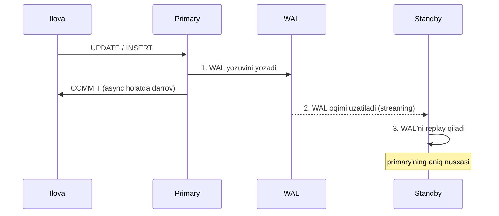
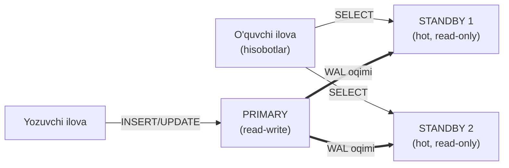
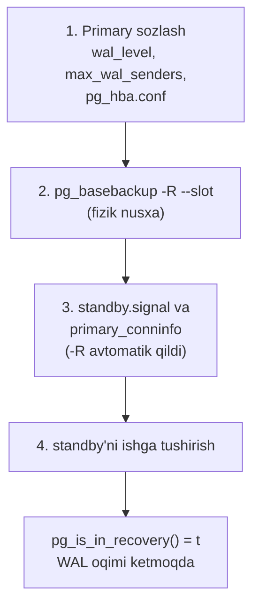
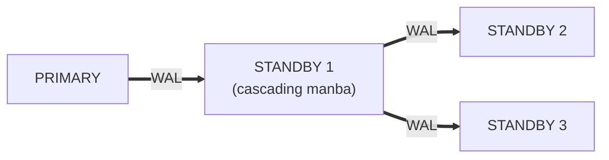
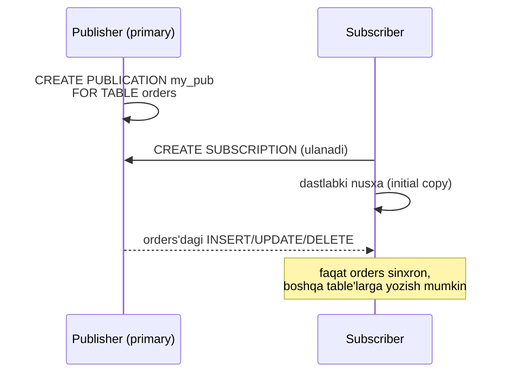
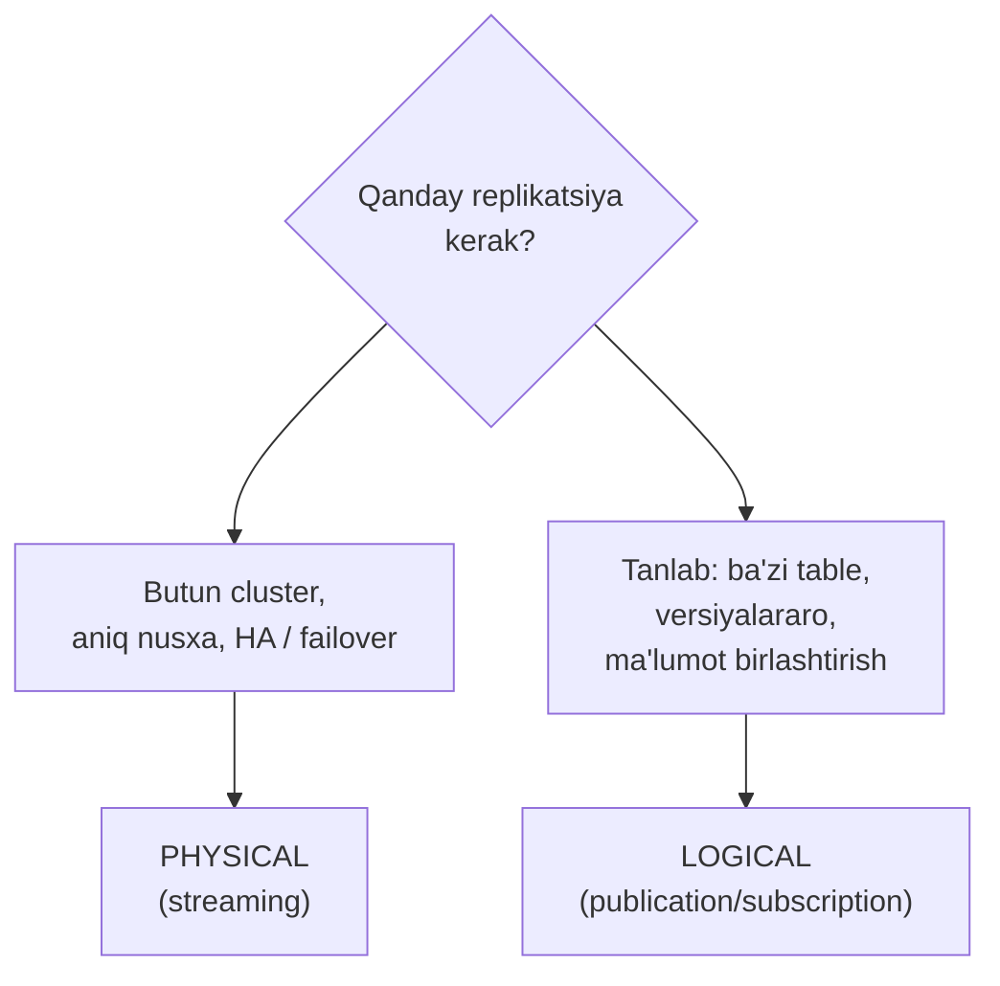
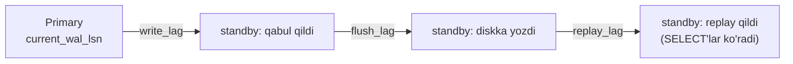

# 31. Replication

> 📖 Qo'shimcha dars — Rogov kitobiga kirmagan, lekin amaliyotda zarur mavzu

## Nima uchun kerak?

Bitta PostgreSQL server — bu bitta xavf nuqtasi (single point of failure). Uni tasavvur qiling:

- **Server o'ldi.** Disk yondi, elektr o'chdi, yoki OS qulab tushdi. Bitta serveringiz bo'lsa — baza **butunlay ishlamay qoladi**, va oxirgi backup'dan beri kirgan ma'lumot yo'qolishi mumkin. Bu — **ishonchlilik (HA — high availability)** muammosi.
- **O'qish yuki bo'g'moqda.** Ilovangizda 90% so'rov — `SELECT` (hisobotlar, analitika, o'qish). Bitta server ularning barchasini yozuvlar bilan birga ko'tarolmaydi. Bu — **read scaling** (o'qishni masshtablash) muammosi.
- **Backup jonli bazani sekinlashtiradi.** Har tunda katta `pg_dump` ishlaganda ishlab turgan baza sekinlashadi. Bu — **backup** muammosi (32-darsda batafsil).

Uch muammoning uchalasi ham bitta g'oyaga tayanadi: **ma'lumotning nusxasini boshqa serverga uzatib turish**. Bu — **replication**. Bitta server (asosiy, **primary**) barcha o'zgarishlarni qabul qiladi, boshqa serverlar (**standby** — zaxira) esa uning aynan nusxasini real vaqtda saqlab turadi.

> **Muhim: uch muammoni chalkashtirmang.** Replication'ning o'zi backup emas: agar primary'da xato bilan `DROP TABLE` qilsangiz, u **darrov** standby'ga ham ko'chadi va u yerda ham table yo'qoladi. Replication — HA va read scaling uchun; backup — logik xato va halokatdan tiklanish uchun. Ular bir-birini **to'ldiradi**, almashtirmaydi.

```mermaid
mindmap
  root(("Replication"))
    "Nima uchun"
      "HA — server o'lsa ham ishlaydi"
      "read scaling — SELECT standby'da"
      "backup — jonli bazani sekinlatmay"
      "backup emas: DROP darrov ko'chadi"
    "Physical (streaming)"
      "WAL asosida (10-11 dars)"
      "primary va standby"
      "pg_basebackup"
      "replication slot"
      "sync va async"
      "hot standby va feedback"
      "cascading"
    "Logical"
      "wal_level = logical"
      "publication va subscription"
      "tanlab, versiyalararo"
    "Boshqaruv"
      "failover — pg_promote"
      "Patroni"
      "pg_stat_replication — lag"
```

---

## 31.1. Physical replication: WAL — hamma narsaning asosi

10-darsda **WAL** (Write-Ahead Log) bilan tanishgan edik: PostgreSQL har o'zgarishni avval jurnalga (WAL) yozadi, keyin ma'lumot fayllariga qo'llaydi. Crash'dan keyin baza WAL'ni "qayta o'ynatib" (replay) o'zini tiklaydi.

Physical replication aynan shu mexanizmni **ikki serverga** kengaytiradi. G'oya juda oddiy:

> Primary WAL'ga yozgan har bir baytni standby'ga uzatadi. Standby o'zini "abadiy crash recovery" rejimida tutadi: kelayotgan WAL'ni to'xtovsiz replay qilib turadi. Natijada standby primary'ning **bayt-bayt aniq nusxasi** bo'lib qoladi.



Bu **"physical"** deb ataladi, chunki WAL fizik darajada ishlaydi: "falon fayl, falon block'ning falon baytini shunga o'zgartir". U SQL'ni emas, **disk block'larining o'zgarishini** uzatadi. Shuning uchun standby primary'ning to'liq, bayt darajasidagi nusxasi bo'ladi — bir xil OID'lar, bir xil block'lar, bir xil hamma narsa.

> **Muhim natija:** physical replication'da standby'da **bir xil PostgreSQL versiyasi** va bir xil arxitektura (masalan ikkalasi ham 64-bit Linux) bo'lishi shart. Chunki block formati versiyaga bog'liq. Boshqa cheklovlar quyida, logical replication bilan taqqoslashda.

---

## 31.2. Primary va standby: arxitektura

Rollarni aniq ajratamiz:

| Rol | Vazifasi | O'qish | Yozish |
|---|---|---|---|
| **Primary** | barcha o'zgarishlarni qabul qiladi, WAL uzatadi | ha | ha |
| **Standby** (hot) | WAL'ni replay qiladi, `SELECT` xizmat qiladi | **ha** | **yo'q** |

Standby'da **yozib bo'lmaydi** — u faqat o'qish uchun (read-only). Yozishga urinsangiz xato chiqadi:

```sql
=> INSERT INTO t VALUES (1);
ERROR:  cannot execute INSERT in a read-only transaction
```

Standby'ni ikki rejimda ishlatish mumkin:

- **Warm standby** — WAL'ni replay qiladi, lekin so'rovlarni qabul qilmaydi (faqat tiklanishga tayyor turadi).
- **Hot standby** — WAL'ni replay qilishdan tashqari, **bir vaqtda `SELECT` so'rovlarni ham** qabul qiladi. Read scaling aynan shundan foydalanadi. Bu `hot_standby = on` (default) bilan yoqiladi.



---

## 31.3. Standby'ni yaratish: bosqichma-bosqich

Endi amaliyot. Bo'sh standby'ni noldan ko'tarishning to'rt qadami bor.

### 1-qadam: primary'ni sozlash

Primary WAL'ni uzatishga tayyor bo'lishi kerak. `postgresql.conf`'da:

```ini
wal_level = replica          # WAL'da replikatsiya uchun yetarli ma'lumot (default)
max_wal_senders = 10         # nechta standby'ga bir vaqtda uzatish (default 10)
```

11-darsda `wal_level`ni ko'rgan edik: `replica` — bu physical replication uchun yetarli daraja (`minimal`dan yuqori). U default qiymat, ya'ni ko'p hollarda hech narsa o'zgartirish shart emas.

Va `pg_hba.conf`'da standby ulanishiga ruxsat beramiz:

```
# TYPE  DATABASE        USER        ADDRESS          METHOD
host    replication     replicator  10.0.0.0/24      scram-sha-256
```

`replication` — bu maxsus "psevdo-baza": u replikatsiya ulanishlarini bildiradi (oddiy baza emas).

### 2-qadam: standby'da bazaning fizik nusxasini olish

Standby serverda `pg_basebackup` bilan primary'ning **butun ma'lumot katalogini** nusxalab olamiz:

```bash
$ pg_basebackup \
    -h primary_host -U replicator \
    -D /var/lib/postgresql/17/main \
    -R \
    --slot=standby1 -C \
    --checkpoint=fast -P
```

Bayroqlarni o'qib chiqamiz:

- `-D` — nusxa qayerga yoziladi (standby'ning data katalogi);
- `-R` — muhim: `standby.signal` faylini va `primary_conninfo`ni **avtomatik yaratadi** (quyidagi 3-qadamni qo'lda qilmaslik uchun);
- `--slot=standby1 -C` — replication slot'ni yaratadi va unga bog'lanadi (slot haqida keyingi bo'limda);
- `-P` — jarayon progressini ko'rsatadi.

### 3-qadam: standby'ni WAL manbaiga yo'naltirish

`-R` bayrog'i tufayli quyidagilar avtomatik yaratildi (agar qo'lda qilsangiz — mana shu):

- **`standby.signal`** — bo'sh fayl. Uning **mavjudligi** PostgreSQL'ga "sen standby'san, replay rejimida ishla" deb aytadi. (PostgreSQL 12'gacha bu `recovery.conf` orqali qilinar edi — endi `standby.signal` va `postgresql.conf` parametrlari.)
- **`primary_conninfo`** — `postgresql.auto.conf`da: primary'ga qanday ulanish (host, port, user):

```ini
primary_conninfo = 'host=primary_host port=5432 user=replicator passfile=...'
primary_slot_name = 'standby1'
```

### 4-qadam: standby'ni ishga tushirish

```bash
$ pg_ctl start -D /var/lib/postgresql/17/main
```

Standby ishga tushib, primary'ga ulanadi va WAL oqimini qabul qila boshlaydi. Tekshiramiz — standby recovery rejimida ekanini ko'ramiz:

```sql
=> SELECT pg_is_in_recovery();   -- standby'da
 pg_is_in_recovery
-------------------
 t
(1 row)
```

`t` (true) — bu standby, "abadiy recovery" rejimida. Primary'da esa `f` (false) chiqadi.



---

## 31.4. Replication slot — nega kerak va xavfi

Endi nozik muammo. Standby biror sabab bilan **uzilib qolsa** (tarmoq uzildi, standby o'chdi) — u qaytib kelganda o'zi to'xtagan joydan WAL'ni davom ettirishi kerak. Lekin primary o'sha eski WAL fayllarini allaqachon o'chirib yuborgan bo'lishi mumkin (checkpoint'dan keyin eski WAL kerak emas — 10-dars). Natijada standby "uzilib" qoladi va uni **noldan qayta qurish** kerak bo'ladi.

Muammoni **replication slot** hal qiladi. Slot — bu primary'da standby uchun "xatcho'p":

> Slot primary'ga aytadi: "bu standby hali falon WAL pozitsiyasini olmagan — undan **oldingi** WAL'larni o'chirma!" Shunda standby uzilib, keyin qaytsa ham, kerakli WAL primary'da saqlanib turgan bo'ladi.

Slot yaratish (agar `pg_basebackup -C` qilmagan bo'lsak):

```sql
=> SELECT pg_create_physical_replication_slot('standby1');
```

Faol slotlarni ko'rish:

```sql
=> SELECT slot_name, active, restart_lsn,
          pg_size_pretty(pg_wal_lsn_diff(pg_current_wal_lsn(), restart_lsn)) AS retained
   FROM pg_replication_slots;
 slot_name | active | restart_lsn | retained
-----------+--------+-------------+----------
 standby1  | t      | 0/5A00028   | 16 MB
(1 row)
```

`retained` — slot tufayli primary saqlab turgan WAL hajmi.

> ⚠️ **Slot'ning xavfi — pg_wal to'lib ketishi.** Slot ikki tomonlama qilich. Agar standby **butunlay o'lib**, lekin slot **faol qolsa**, primary "standby hali ham kerak" deb WAL'ni **cheksiz** saqlaydi. Natijada `pg_wal` katalogi disk'ni to'ldiradi va primary **butunlay to'xtaydi** — bu productionda eng ko'p uchraydigan halokatlardan biri.

Bunga qarshi himoya — `max_slot_wal_keep_size` (PostgreSQL 13'dan):

```ini
max_slot_wal_keep_size = 10GB   # slot ko'pi bilan shuncha WAL ushlab tursin
```

Agar slot bu chegaradan oshsa, PostgreSQL slot'ni "yaroqsiz" (invalidated) deb belgilaydi va WAL'ni o'chiradi — primary'ni saqlab qoladi (lekin o'sha standby endi qayta qurishni talab qiladi). Bu — "bitta standby'ni qurbon qilib, primary'ni saqlash" savdolashuvi.

---

## 31.5. Synchronous va asynchronous replication

11-darsda synchronous/asynchronous **commit**ni ko'rgan edik (WAL diskka yozilishini kutish). Replication'da xuddi shu savol standby darajasida qaytadi:

> `COMMIT` javob berishdan oldin, o'zgarish **standby'ga yetib borishini kutadimi**, yoki yo'q?

### Asynchronous (default)

Primary WAL'ni lokal diskiga yozadi va **darrov** `COMMIT` javobini beradi. WAL standby'ga **keyinroq** (bir necha millisekunddan keyin) yetadi.

- **Tez** — ilova standby'ni kutmaydi.
- **Xavf:** agar primary aynan shu vaqtda o'lsa va oxirgi transaction'lar hali standby'ga yetmagan bo'lsa — ular **yo'qoladi** (failover'dan keyin).

### Synchronous

Primary `COMMIT` javobini standby transaction'ni **qabul qildi** (yoki replay qildi) deb tasdiqlaguncha **kutadi**.

- **Ishonchli** — commit'langan har transaction kamida ikki serverda bor, primary o'lsa ham yo'qolmaydi.
- **Sekin** — har commit tarmoq borib-kelishini kutadi.

Yoqish — `synchronous_standby_names` orqali:

```ini
synchronous_standby_names = 'standby1'
```

### Kvorum (quorum) sinxron replikatsiya

Bir necha standby bo'lsa, "nechtasi tasdiqlashini kutish" ni sozlash mumkin:

```ini
# ANY 2 — 3 standby'dan istalgan 2 tasi tasdiqlasa yetarli (kvorum)
synchronous_standby_names = 'ANY 2 (standby1, standby2, standby3)'

# FIRST 1 — ro'yxatdagi birinchi mavjud standby tasdiqlasin (prioritet)
synchronous_standby_names = 'FIRST 1 (standby1, standby2)'
```

| | Asynchronous | Synchronous |
|---|---|---|
| COMMIT tezligi | tez (kutmaydi) | sekin (standby'ni kutadi) |
| Ma'lumot yo'qolishi | primary o'lsa oxirgilari yo'qolishi mumkin | yo'qolmaydi (kamida 2 nusxa) |
| Qachon | read scaling, lag muhim emas | pul, buyurtma — yo'qotib bo'lmaydigan data |

> **Nozik xavf:** faqat **bitta** synchronous standby bo'lsa va u o'lsa — primary'da har commit **abadiy kutib** qoladi (tasdiqlaydigan hech kim yo'q)! Shuning uchun synchronous rejimda har doim kamida **ikkita** potentsial standby (`ANY 1 (s1, s2)` yoki `FIRST 1 (s1, s2)`) qo'ying, aks holda ishonchlilikni oshiramiz deb bazani to'xtatib qo'yasiz.

---

## 31.6. Hot standby konfliktlari va feedback

Hot standby'da bir vaqtda ikki narsa bo'ladi: uzun `SELECT` so'rovlar ishlaydi VA WAL replay davom etadi. Bu ikkisi **to'qnashishi** mumkin.

Tasavvur qiling: standby'da uzun analitik `SELECT` bir necha row'ning eski versiyasini o'qiyapti. Shu payt primary'da vacuum (6-dars) o'sha eski versiyalarni o'lik deb tozaladi va bu WAL orqali standby'ga keldi. Standby dilemmada: WAL'ni replay qilsa — `SELECT` o'qiyotgan versiyalar yo'qoladi.

Default xatti-harakat: standby biroz kutadi (`max_standby_streaming_delay`, default 30s), keyin **so'rovni bekor qiladi**:

```
ERROR:  canceling statement due to conflict with recovery
DETAIL:  User query might have needed to see row versions that must be removed.
```

Bu — **replication konflikti**. Uni hal qilishning asosiy yo'li — **`hot_standby_feedback`**:

```ini
hot_standby_feedback = on   # standby'da (default off)
```

> **Qanday ishlaydi:** `hot_standby_feedback = on` bo'lsa, standby primary'ga "menda falon eski transaction hali ochiq, o'sha versiyalarni **hali tozalama**" deb xabar beradi. Primary'da vacuum shu versiyalarni saqlab turadi — natijada standby'da konflikt bo'lmaydi.

Lekin bepul emas: primary'da vacuum sekinlashadi va o'lik versiyalar ko'proq to'planadi (bloat, 8-dars) — chunki uzoq standby so'rovlari primary'ning database horizon'ini ushlab turadi (6-darsdagi horizon tushunchasini eslang, endi u serverlararo).

| Yechim | Foyda | Zarar |
|---|---|---|
| `max_standby_streaming_delay` oshirish | so'rov bekor bo'lmaydi | standby lag'i o'sadi |
| `hot_standby_feedback = on` | konflikt yo'q | primary'da bloat, vacuum sekinlashadi |

---

## 31.7. Cascading replication

Standby o'zi ham **boshqa standby'larga** WAL uzatishi mumkin — bu **cascading** (kaskadli) replication. Primary'dan WAL oladi va uni quyi standby'larga tarqatadi.



> **Nega kerak?** Agar 10 ta standby bo'lsa va hammasi to'g'ridan-to'g'ri primary'dan olsa — primary tarmog'iga va `max_wal_senders`ga yuk tushadi. Cascading bu yukni **taqsimlaydi**: primary faqat bitta oraliq standby'ga uzatadi, u esa qolganlariga tarqatadi. Ayniqsa geografik jihatdan uzoq (masalan boshqa data-markazdagi) standby'lar uchun foydali — bir marta uzoqqa uzatib, o'sha yerda mahalliy tarqatasiz.

Cascading standby ham hot bo'lishi mumkin (`SELECT` xizmat qiladi).

---

## 31.8. Logical replication: SQL darajasida

Physical replication butun cluster'ni bayt-bayt nusxalaydi. Lekin ba'zan bunday emas, **tanlab** replikatsiya kerak: faqat bitta table, yoki faqat ba'zi row'lar, yoki **turli versiyalar** orasida (PG16 → PG17). Mana shu yerda **logical replication** yordamga keladi.

11-darsda `wal_level = logical`ni ko'rgan edik: bu darajada WAL'ga qo'shimcha ma'lumot yoziladi, shundan "logik dekoding" o'zgarishlarni **satr darajasida** ("`orders` table'da shu row INSERT qilindi") ajratib olishi mumkin — fizik block emas, mantiqiy amal.

Logical replication ikki tushunchaga tayanadi:

- **Publication** — primary'da: "qaysi table'larni e'lon qilaman" (nashr).
- **Subscription** — subscriber'da: "qaysi publication'ga obuna bo'laman".

**Publisher (manba) tomonda:**
```sql
=> ALTER SYSTEM SET wal_level = logical;   -- + server restart
=> CREATE PUBLICATION my_pub FOR TABLE orders, customers;
```

**Subscriber (qabul qiluvchi) tomonda:**
```sql
=> CREATE SUBSCRIPTION my_sub
     CONNECTION 'host=publisher_host dbname=shop user=replicator'
     PUBLICATION my_pub;
```

Shu ondan subscriber `orders` va `customers` table'laridagi o'zgarishlarni oladi. Diqqat: subscriber — **to'liq ishlaydigan** baza, unda yozish ham mumkin, u faqat obuna bo'lgan table'larga o'zgarishni qabul qiladi.



> **PostgreSQL 17 yangiligi — pg_createsubscriber.** Katta bazada logical replication'ni noldan boshlash sekin edi (dastlabki nusxa uzoq davom etadi). PG17'dagi `pg_createsubscriber` utilitasi mavjud **physical standby'ni logical subscriber'ga aylantiradi** — dastlabki nusxani qaytadan ko'chirmaydi. Bu ayniqsa katta bazani versiyadan versiyaga (masalan PG16 → PG17) minimal to'xtash bilan ko'chirishda juda foydali.

---

## 31.9. Physical va logical: taqqoslash



| Xususiyat | Physical (streaming) | Logical (pub/sub) |
|---|---|---|
| Uzatiladigan narsa | WAL block'lar (baytlar) | satr o'zgarishlari (INSERT/UPDATE/DELETE) |
| Qamrov | **butun** cluster | tanlangan **table'lar** |
| PostgreSQL versiyasi | ikkalasi **bir xil** | **turli** versiyalar mumkin |
| Standby'da yozish | yo'q (read-only) | ha (subscriber to'liq baza) |
| DDL (CREATE TABLE ...) | avtomatik ko'chadi | **ko'chmaydi** (qo'lda) |
| Sequence'lar | ko'chadi | **ko'chmaydi** (alohida) |
| Asosiy maqsad | HA, read scaling, DR | migratsiya, integratsiya, tanlab uzatish |

> **Logical'ning eng katta "tuzog'i":** DDL (sxema o'zgarishlari) va sequence'lar **avtomatik ko'chmaydi**. Publisher'da `ALTER TABLE ... ADD COLUMN` qilsangiz, subscriber'da uni **qo'lda** takrorlash kerak, aks holda replikatsiya buziladi. Physical'da esa hamma narsa avtomatik.

---

## 31.10. Failover — primary o'lganda nima bo'ladi?

Primary o'lsa, standby'lardan biri yangi primary bo'lishi kerak — bu **failover**. Standby'ni primary'ga "ko'tarish" (promote):

```sql
=> SELECT pg_promote();   -- standby'da
```

Yoki buyruq qatoridan:
```bash
$ pg_ctl promote -D /var/lib/postgresql/17/main
```

`pg_promote()` standby'ni recovery rejimidan chiqaradi: u endi `pg_is_in_recovery() = f` bo'ladi, yozishni qabul qiladi va o'z WAL'ini uzata boshlaydi.

Lekin failover'da ko'p nozik savol bor:

- **Qachon** promote qilish kerak? Primary rostdan o'ldimi yoki shunchaki tarmoq lag qildimi? (Noto'g'ri qaror — **split-brain**: ikkita primary paydo bo'lib, ma'lumot ikkiga bo'linadi.)
- **Qaysi** standby'ni tanlash? Eng kam lag'lisini.
- Ilovani yangi primary'ga **qanday yo'naltirish** (DNS, proxy)?
- Boshqa standby'larni yangi primary'ga qanday **qayta ulash**?

Bularni **qo'lda** qilish xatarli va sekin. Shuning uchun productionda avtomatik failover vositalari ishlatiladi:

> **Patroni g'oyasi.** Patroni — bu keng tarqalgan avtomatik failover menejeri. U har PostgreSQL yonida "agent" sifatida ishlaydi va cluster holatini tashqi **consensus store'da** (etcd, Consul, ZooKeeper) saqlaydi. Agentlar bir-birini kuzatib turadi: primary "yuragi to'xtasa" (heartbeat yo'qolsa), ular **birgalikda** (kvorum bilan) eng mos standby'ni tanlab, avtomatik promote qiladi va ilovani unga yo'naltiradi. Consensus store split-brain'ni oldini oladi: bir vaqtda faqat bitta node "men primary" degan yorliqni (leader lock) ushlab tura oladi.

> **PostgreSQL 17 va logical replication failover.** Ilgari physical failover'dan keyin logical replication slotlar **yo'qolar edi** (ular faqat primary'da bo'lar edi). PG17'da `failover = true` bilan yaratilgan logical slotlar standby'larga **sinxronlanadi** (`sync_replication_slots`) — failover'dan keyin logical obuna yangi primary'dan davom etadi. Bu logical replication'ni HA bilan birga ishlatishni ancha ishonchli qildi.

---

## 31.11. Monitoring: lag'ni o'lchash

Replication ishlab turibdimi va standby qancha **orqada** (lag)? Asosiy manba — primary'dagi `pg_stat_replication`:

```sql
=> SELECT application_name, state, sync_state,
          pg_wal_lsn_diff(pg_current_wal_lsn(), replay_lsn) AS lag_bytes,
          write_lag, flush_lag, replay_lag
   FROM pg_stat_replication;
 application_name |   state   | sync_state | lag_bytes | replay_lag
------------------+-----------+------------+-----------+------------
 standby1         | streaming | async      |    8192   | 00:00:00.03
(1 row)
```

Ustunlarni o'qiymiz:

- `state = streaming` — WAL faol uzatilmoqda (yaxshi);
- `sync_state` — `async` yoki `sync` (yuqoridagi synchronous sozlama);
- `lag_bytes` — standby primary'dan necha bayt orqada;
- `write_lag` / `flush_lag` / `replay_lag` — standby WAL'ni **qabul qilish / diskka yozish / replay qilish** bo'yicha necha **vaqt** orqada.

Standby tomonidan ham ko'rish mumkin — oxirgi qabul qilingan va replay qilingan LSN:

```sql
=> SELECT pg_last_wal_receive_lsn(), pg_last_wal_replay_lsn(),
          now() - pg_last_xact_replay_timestamp() AS replay_delay;
```



> **Amaliy monitoring:** `replay_lag`ni kuzating — aynan shu standby'dagi `SELECT`'lar qancha "eski" ma'lumot ko'rayotganini bildiradi. Sinxron replikatsiyada `flush_lag` muhim (commit shuni kutadi). Va **har doim** `pg_replication_slots.active` va slot'dagi WAL hajmini kuzating — 31.4'dagi "pg_wal to'lib ketdi" halokatidan saqlanish uchun.

---

## Xulosa

- **Replication** — ma'lumot nusxasini boshqa serverga uzatib turish. Uch maqsad: **HA** (server o'lsa ishlaydi), **read scaling** (SELECT'lar standby'da), **backup**ni yengillashtirish. Lekin replication backup **emas** — `DROP TABLE` darrov standby'ga ham ko'chadi.
- **Physical (streaming) replication** — WAL'ni (10-11 dars) bayt darajasida standby'ga uzatadi. Standby "abadiy recovery" rejimida primary'ning **aniq nusxasi**. Bir xil versiya va arxitektura talab qiladi.
- Standby **read-only**; `hot_standby = on` bo'lsa `SELECT` xizmat qiladi (read scaling). Yaratish: `pg_basebackup -R` + `standby.signal` + `primary_conninfo`.
- **Replication slot** primary'ga kerakli WAL'ni o'chirmaslikni aytadi (standby uzilib qaytsa ham). Xavfi: standby o'lib slot faol qolsa, `pg_wal` disk'ni to'ldiradi → `max_slot_wal_keep_size` bilan cheklang.
- **Synchronous** — commit standby tasdig'ini kutadi (yo'qolmaydi, sekin); **asynchronous** — kutmaydi (tez, oxirgilari yo'qolishi mumkin). Kvorum: `ANY k (...)` / `FIRST k (...)`. Bitta sync standby xavfli.
- **Hot standby konflikti** — vacuum va uzun SELECT to'qnashuvi; yechim `hot_standby_feedback = on`, lekin primary'da bloat oshishi evaziga.
- **Cascading** — standby boshqa standby'larga WAL tarqatadi, primary yukini taqsimlaydi.
- **Logical replication** — `wal_level = logical` + **publication/subscription**; tanlab, versiyalararo, subscriber yoziladigan baza. Lekin DDL va sequence **avtomatik ko'chmaydi**.
- **Failover** — `pg_promote()` standby'ni primary qiladi; qo'lda xatarli (split-brain) → **Patroni** + consensus store bilan avtomatlashtiriladi. PG17: logical slotlar failover'da sinxronlanadi.
- **Monitoring** — `pg_stat_replication` (`state`, `sync_state`, `replay_lag`) va slot hajmi; lag va slot to'lishini doim kuzating.

## Nazorat savollari

1. Replication'ning uch maqsadini (HA, read scaling, backup) ayting. Nega "replication bor, demak backup kerak emas" — xato fikr?
2. Physical replication WAL bilan qanday ishlaydi (10-11 darsga bog'lang)? Nega standby primary bilan bir xil PostgreSQL versiyasini talab qiladi?
3. Warm standby va hot standby farqi nimada? `pg_is_in_recovery()` primary va standby'da nima qaytaradi?
4. `pg_basebackup -R` qanday fayl/parametrlarni avtomatik yaratadi va ular nimaga xizmat qiladi (`standby.signal`, `primary_conninfo`)?
5. Replication slot qanday muammoni hal qiladi va u qanday **yangi** xavf tug'diradi? Undan qanday himoyalanasiz?
6. Synchronous va asynchronous replication'ni taqqoslang. Nega faqat **bitta** synchronous standby bilan ishlash xavfli?
7. Hot standby konflikti qanday paydo bo'ladi (vacuum va SELECT)? `hot_standby_feedback = on` uni qanday hal qiladi va evaziga nima bo'ladi?
8. Physical va logical replication'ni 4 mezon bo'yicha farqlang. Logical'da DDL/sequence bilan qanday "tuzoq" bor?
9. Failover nima va split-brain qanday xavf? Patroni consensus store'ni nima uchun ishlatadi?
10. `pg_stat_replication`'da `replay_lag` va `flush_lag` nimani bildiradi? Qaysi biri synchronous commit uchun muhim?
