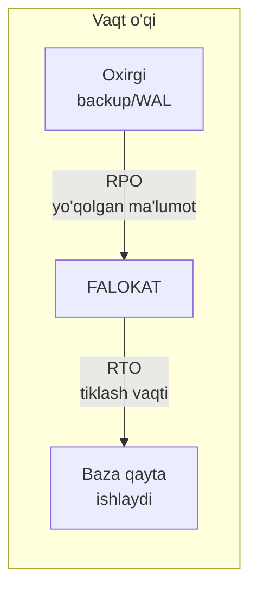
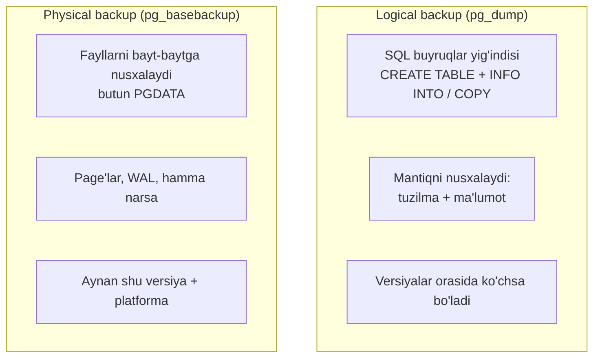
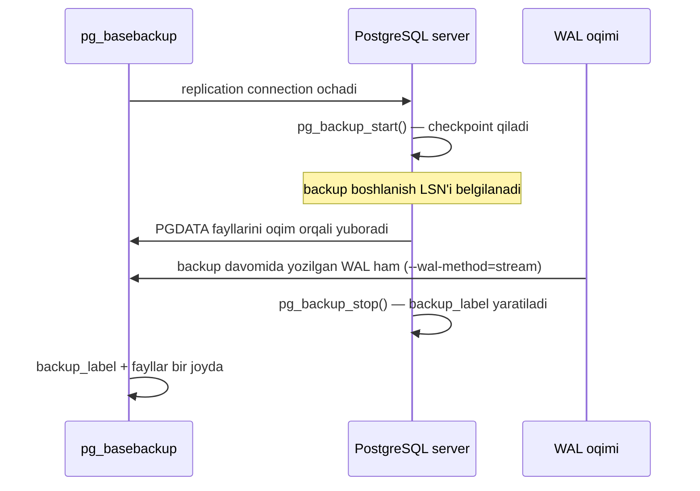
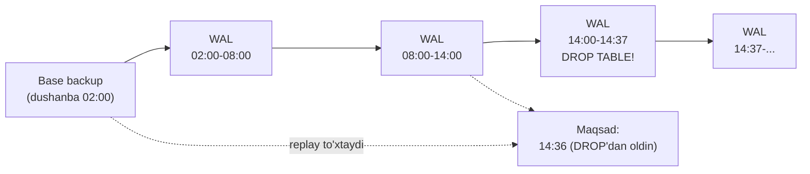
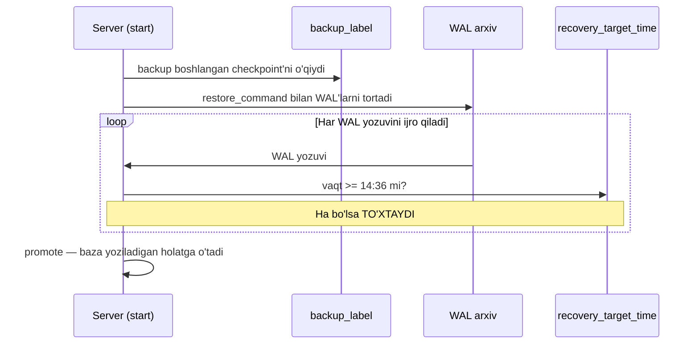
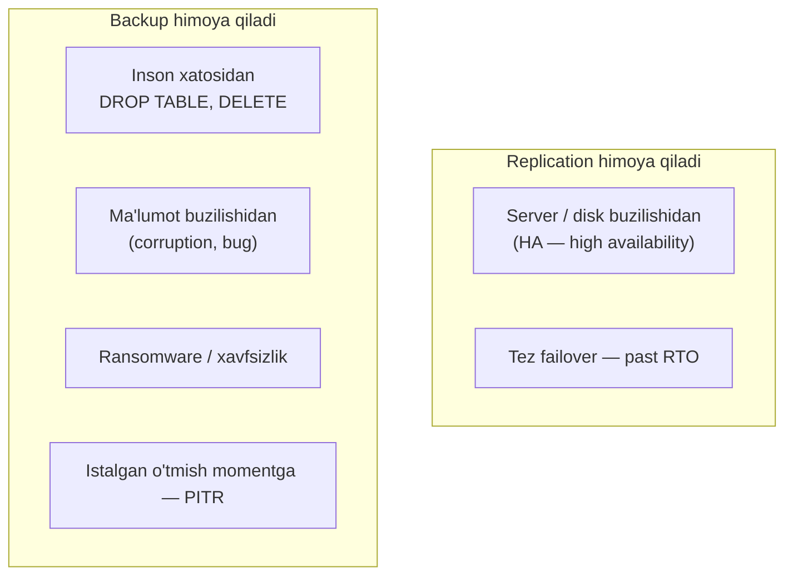

# 32. Backup va recovery

> 📖 Qo'shimcha dars — Rogov kitobiga kirmagan, lekin amaliyotda zarur mavzu

## Nima uchun kerak?

Butun kurs davomida biz PostgreSQL **ichini** o'rgandik: MVCC, tuple versiyalari (3-dars), VACUUM (6-dars), WAL (10-11-darslar), locklar (12-15-darslar), index'lar (24-29-darslar). Bularning hammasi bitta narsa uchun edi — **ma'lumot yo'qolmasin va to'g'ri qolsin**.

Lekin PostgreSQL qanchalik ishonchli bo'lmasin, bitta savol javobsiz qoladi:

> Disk buzilsa, data-markazda yong'in chiqsa, yoki kimdir xato bilan `DROP TABLE orders` yozib yuborsa — ma'lumotni qayerdan tiklaysan?

Bu savolga WAL ham, replication ham to'liq javob bermaydi. WAL faqat **crash'dan** (tok o'chishi, OS qulashi) tiklaydi — u disk buzilishidan yoki inson xatosidan saqlamaydi. Replication esa xatoni **darhol nusxalab**, ikkinchi serverga ham tarqatadi (bu haqda pastda batafsil).

Yagona haqiqiy himoya — **backup** (rezerv nusxa): ma'lumotning boshqa joyda, boshqa vaqtdagi mustaqil nusxasi. Bu darsda ikkita katta savolga javob beramiz:

- **Backup qanday olinadi?** — logical (`pg_dump`) va physical (`pg_basebackup`) usullari.
- **Backup'dan qanday tiklanadi?** — oddiy restore va **istalgan momentga tiklash** (PITR), WAL arxivi orqali.

```mermaid
mindmap
  root(("Backup va<br/>recovery"))
    "Strategiya"
      "RPO — qancha ma'lumot yo'qotishga tayyor"
      "RTO — qancha vaqtda tiklash kerak"
      "3-2-1 qoidasi"
    "Logical backup"
      "pg_dump / pg_dumpall"
      "formatlar: plain, custom, directory, tar"
      "parallel dump / restore"
      "selective restore"
    "Physical backup"
      "pg_basebackup"
      "incremental (v17)"
      "backup_label"
    "PITR"
      "archive_command / archive_library"
      "restore_command"
      "recovery_target_time"
    "Vositalar"
      "pgBackRest"
      "WAL-G"
```

---

## 1. Backup strategiyasi: RPO va RTO

Backup haqida o'ylashdan oldin ikkita savolga javob berish kerak. Ular strategiyaning **poydevori**.

### RPO — qancha ma'lumot yo'qotishga tayyorsiz?

**RPO** (Recovery Point Objective — tiklanish nuqtasi) — falokat yuz berganda **qancha vaqtlik ma'lumotni yo'qotishga rozisiz** degan savol.

- RPO = 24 soat degani: kunda bir marta backup olasiz. Falokat kunning oxirida bo'lsa — deyarli bir kunlik ish yo'qoladi.
- RPO = 5 daqiqa degani: WAL'ni tez-tez arxivlaysiz, faqat oxirgi bir necha daqiqa yo'qoladi.
- RPO = 0 degani: umuman ma'lumot yo'qotmaslik kerak — bu synchronous replication talab qiladi (31-darsda ko'rdik).

### RTO — qancha vaqtda tiklash kerak?

**RTO** (Recovery Time Objective — tiklanish vaqti) — falokatdan keyin baza **qancha vaqtda qayta ishlashi shart** degan savol.

- RTO = 8 soat: kechasi backup'dan tinchgina tiklasa bo'ladi.
- RTO = 1 daqiqa: qo'lda tiklashga vaqt yo'q — tayyor turgan replica'ga avtomatik o'tish (failover) kerak.



> **Oltin qoida:** RPO va RTO — bu **texnik** emas, **biznes** qarori. Avval biznesdan "necha soatlik ma'lumot yo'qolsa halokat?" va "baza necha soat o'chsa halokat?" deb so'raysiz, keyin shu raqamlarga **mos** backup arxitekturasini qurasiz. Aksincha emas.

### 3-2-1 qoidasi

Backup dunyosidagi klassik qoida — inson xatosidan ham, disk buzilishidan ham, data-markaz falokatidan ham himoya qiladi:

| Raqam | Ma'nosi |
|---|---|
| **3** | Kamida **3 ta** nusxa (asosiy baza + 2 backup) |
| **2** | Kamida **2 xil** vositada (masalan local disk + object storage) |
| **1** | Kamida **1 tasi** boshqa geografik joyda (offsite) |

> ⚠️ **Eng ko'p uchraydigan xato:** backup olib, uni **hech qachon tiklab ko'rmaslik**. Tiklanmagan backup — backup emas, **umid**. Backup strategiyasining ajralmas qismi — muntazam **test restore** (pastda "Backup validatsiyasi" bo'limida).

---

## 2. Ikki xil backup: logical va physical

PostgreSQL'da backupni ikki tamoman boshqacha usulda olish mumkin. Bu ikkalasini chalkashtirmaslik kritik muhim.



| Xususiyat | Logical (`pg_dump`) | Physical (`pg_basebackup`) |
|---|---|---|
| Nima nusxalanadi | SQL buyruqlar (mantiq) | PGDATA fayllari (baytlar) |
| Nusxa hajmi | Kichikroq (index'lar yo'q, qayta quriladi) | Kattaroq (hamma page, index bilan) |
| Tiklash tezligi | Sekin (index qayta quriladi) | Tez (fayllarni ko'chirish) |
| Versiyalararo ko'chirish | Ha (v15 → v17) | Yo'q (aynan shu versiya) |
| Bitta table'ni olish | Ha (`-t` flag) | Yo'q (hammasi yoki hech nima) |
| PITR (istalgan momentga) | Yo'q | Ha (WAL bilan) |
| Ishlash paytida | Baza ishlab turadi | Baza ishlab turadi |

> **Amaliy xulosa:** kichik bazalar, migratsiya, bitta jadvalni ko'chirish uchun — **logical**. Katta production bazalar, PITR, tez tiklash uchun — **physical**. Ko'p tashkilotlar **ikkalasini** birga ishlatadi.

---

## 3. Logical backup: pg_dump

`pg_dump` — bitta **database**'ning mantiqiy nusxasini oladi. U bazani **bloklamaydi**: MVCC va snapshot mexanizmi tufayli (2, 4-darslarda ko'rdik) `pg_dump` bitta muvofiq snapshot oladi va shu momentdagi holatni nusxalaydi, boshqa transaction'lar bemalol ishlashda davom etadi.

### Formatlar — eng muhim tanlov

`pg_dump`'ning `-F` (format) flagi — bu eng muhim parametr:

| Format | Flag | Nima beradi |
|---|---|---|
| **plain** | `-Fp` (default) | Oddiy `.sql` matn fayl — `psql`'da ishlatiladi |
| **custom** | `-Fc` | Siqilgan binar arxiv — `pg_restore` bilan, eng moslashuvchan |
| **directory** | `-Fd` | Papka (har table alohida fayl) — **parallel** dump uchun |
| **tar** | `-Ft` | `.tar` arxiv |

Eng ko'p ishlatiladigani — **custom** yoki **directory**, chunki ular `pg_restore`'ning selective (tanlab) va parallel imkoniyatlarini ochadi:

```bash
# --- plain format: oddiy SQL matn ---
$ pg_dump -Fp mydb > mydb.sql
# tiklash: psql -d newdb -f mydb.sql

# --- custom format: siqilgan, moslashuvchan ---
$ pg_dump -Fc mydb -f mydb.dump
# tiklash: pg_restore -d newdb mydb.dump
```

> **Nega plain format ko'pincha yomon tanlov?** `.sql` fayldan tiklaganda `psql` uni **ketma-ket** o'qiydi, hech qanday parallel ishlash yo'q, tanlab tiklab bo'lmaydi. `custom`/`directory` esa arxiv **kontent jadvaliga** ega — istalgan obyektni tanlab olish va parallel tiklash mumkin.

### Parallel dump — katta bazani tezroq

`directory` format bir vaqtda bir necha **worker** bilan dump olish imkonini beradi. Har worker alohida jadvalni alohida connection orqali nusxalaydi:

```bash
# --- 4 ta parallel worker bilan directory format ---
$ pg_dump -Fd -j 4 mydb -f mydb_backup/
```

`-j 4` — 4 ta parallel jarayon. Bu ko'p yadroli serverda katta bazani bir necha barobar tezlashtiradi. Muhim nozik nuqta: parallel dump uchun barcha worker'lar **bitta muvofiq snapshot**'ni bo'lishishi kerak — buni PostgreSQL `pg_export_snapshot` mexanizmi ta'minlaydi, shuning uchun natija baribir bir moment holatiga muvofiq bo'ladi.

### Selective restore — faqat kerakli qismni

Custom/directory arxivdan **tanlab** tiklash mumkin. Bu real hayotda tez-tez kerak bo'ladi — masalan kimdir bitta jadvalni buzib qo'ygan:

```bash
# --- faqat bitta jadvalni tiklash ---
$ pg_restore -d mydb -t orders mydb.dump

# --- faqat schema (tuzilma), ma'lumotsiz ---
$ pg_restore -d mydb --schema-only mydb.dump

# --- parallel restore: 4 worker bilan ---
$ pg_restore -d mydb -j 4 mydb.dump
```

> **Nozik nuqta:** parallel restore (`-j`) faqat `custom` va `directory` formatlarda ishlaydi (`plain`'da emas — u shunchaki SQL matn). Restore paytida index'lar va constraint'lar **oxirida** qayta quriladi — shuning uchun logical restore physical'dan sekinroq.

### pg_dumpall — butun cluster

`pg_dump` bitta bazani oladi, lekin **global obyektlar** — role'lar (foydalanuvchilar), tablespace'lar, cluster darajasidagi sozlamalar — hech bir alohida bazaga tegishli emas. Ularni `pg_dumpall` oladi:

```bash
# --- butun cluster: barcha bazalar + global obyektlar ---
$ pg_dumpall -f cluster.sql

# --- faqat global obyektlar (role'lar, tablespace'lar) ---
$ pg_dumpall --globals-only -f globals.sql
```

> **Amaliy naqsh:** ko'pchilik `pg_dumpall --globals-only` (role'lar uchun) + har bir baza uchun `pg_dump -Fc` (parallel/selective uchun) kombinatsiyasini ishlatadi. Sof `pg_dumpall` faqat `plain` format beradi — parallel yoki selective restore imkoniyati yo'q.

---

## 4. Physical backup: pg_basebackup

`pg_basebackup` — butun **cluster**'ning fizik nusxasini oladi: PGDATA katalogidagi barcha fayllarni bayt-baytga ko'chiradi. U replication protokoli orqali ishlaydi — go'yo yangi replica ulanayotgandek (31-darsda replication'ni ko'rdik).



Oddiy chaqiruv:

```bash
# --- butun cluster'ni fizik backup qilish ---
$ pg_basebackup -D /backup/base -Ft -z -P --wal-method=stream
```

Muhim flaglar:

| Flag | Ma'nosi |
|---|---|
| `-D` | Backup qayerga yoziladi |
| `-Ft` | tar format (`-Fp` — plain, fayllar ko'rinishida) |
| `-z` | gzip bilan siqish |
| `-P` | progress ko'rsatish |
| `--wal-method=stream` | backup davomidagi WAL'ni ham oqim bilan olish |

> **Nega `--wal-method=stream` muhim?** Physical backup boshi va oxiri orasida baza o'zgarishda davom etadi. `stream` rejimida backup davomida yozilgan WAL ham nusxaga qo'shiladi — shuning uchun tiklashda backup **muvofiq holatga** yetadi. Busiz backup «yarim tayyor» bo'lib qoladi.

### backup_label — nima uchun kritik?

Physical backup ichida `backup_label` fayli bo'ladi. Bu — backup **qaysi checkpoint'dan** boshlanganini ko'rsatuvchi kichik fayl.

Tiklashda PostgreSQL `backup_label`'ni o'qib, "tiklashni `pg_control`'dagi oxirgi checkpoint'dan emas, **backup boshlangan checkpoint'dan** boshla" deb tushunadi. Aks holda baza buzilardi — chunki backup fayllari o'sha checkpoint'gacha bo'lgan holatda.

> ⚠️ **Muhim:** `backup_label` faylini **hech qachon o'zgartirmang yoki o'chirmang**. `pg_basebackup` uni avtomatik joylaydi, lekin qo'lda backup olganda (`pg_backup_start`/`pg_backup_stop` funksiyalari bilan — v15'dan shunday nomlangan, ilgari `pg_start_backup`/`pg_stop_backup` edi) uni o'zingiz to'g'ri joyga yozishingiz kerak.

### v17 yangiligi: incremental backup

PostgreSQL 17 katta yangilik keltirdi — **incremental backup** (o'suvchi rezerv nusxa). G'oya: har safar butun bazani emas, **oxirgi backup'dan keyin o'zgargan** page'larni nusxalash. Bu joy va vaqtni sezilarli tejaydi.

Buning uchun PostgreSQL 17'da yangi fon jarayoni bor — **WAL summarizer**. U WAL'ni o'qib, qaysi page'lar o'zgarganini `pg_wal/summaries` katalogiga «xulosa» qilib yozadi.

```bash
# --- 1-qadam: WAL summarizer'ni yoqamiz (postgresql.conf) ---
# summarize_wal = on

# --- 2-qadam: to'liq (full) backup ---
$ pg_basebackup -D /backup/full -c fast

# --- 3-qadam: incremental backup (oldingi backup manifestiga asoslanib) ---
$ pg_basebackup -D /backup/incr1 \
    --incremental=/backup/full/backup_manifest
```

Incremental backup ichida o'zgarmagan fayllar o'rniga `INCREMENTAL.` prefiksli kichik fayllar bo'ladi. Tiklashda ularni **birlashtirish** kerak — buning uchun v17'da yangi vosita **`pg_combinebackup`**:

```bash
# --- full + incremental'ni birlashtirib to'liq PGDATA yasash ---
$ pg_combinebackup /backup/full /backup/incr1 -o /restore/data
```

| Cheklov | Izoh |
|---|---|
| `summarize_wal = on` shart | WAL summarizer yoqilgan bo'lishi kerak |
| `wal_level = minimal` bo'lmasin | minimal'da ishlamaydi |
| Faqat primary'da | Standby'dan incremental olib bo'lmaydi |

---

## 5. Continuous archiving va PITR

Endi eng kuchli mexanizmga keldik — **PITR** (Point-In-Time Recovery, istalgan momentga tiklash). Bu physical backup + WAL arxivini birlashtiradi.

### G'oya: base backup + WAL zanjiri

Eslaymiz (10-dars): WAL — barcha o'zgarishlarning ketma-ket jurnali. Agar bizda:

1. Bir vaqtdagi **base backup** (physical nusxa) bo'lsa, VA
2. O'sha momentdan **boshlab barcha WAL** saqlangan bo'lsa,

unda base backup'dan boshlab WAL'ni **qayta ijro** (replay) qilib, **istalgan momentgacha** tiklay olamiz. Xuddi o'yindagi save point'dan (checkpoint) boshlab, keyingi harakatlarni qadam-baqadam takrorlagandek.



> **Kuchi shundaki:** kimdir 14:37'da `DROP TABLE orders` yozib yuborsa, siz base backup'dan boshlab WAL'ni faqat **14:36'gacha** ijro qilib to'xtaysiz — jadval hali joyida bo'lgan momentga qaytasiz. Oddiy backup buni qila olmaydi.

### Bosqichma-bosqich: WAL arxivini sozlash

**1-qadam — arxivlashni yoqish** (`postgresql.conf`). PostgreSQL har to'lgan WAL segmentini `archive_command` orqali xavfsiz joyga ko'chiradi:

```conf
wal_level = replica            # minimal bo'lmasin (11-darsda ko'rdik)
archive_mode = on
archive_command = 'test ! -f /archive/%f && cp %p /archive/%f'
```

`%p` — WAL segmentining to'liq yo'li, `%f` — faqat fayl nomi. `test ! -f` — «agar allaqachon arxivda bo'lmasa» (ustiga yozib yubormaslik uchun).

> **`archive_command` vs `archive_library` (v15'dan):** matnli buyruq har WAL uchun alohida process (`cp`) ishga tushiradi — sekin. v15'dan **`archive_library`** bor: arxivlash mantiqini C kutubxona sifatida yuklab, process ishga tushirmasdan tezroq bajaradi. Production'da ko'pincha pgBackRest/WAL-G bu ishni o'z ustiga oladi.

> ⚠️ **Kritik:** `archive_command` **0** (muvaffaqiyat) qaytarishi shart. Agar u xato qaytarsa, PostgreSQL WAL segmentini **o'chirmaydi** va qayta urinaveradi — natijada `pg_wal` katalogi to'lib, disk tugab, baza **to'xtaydi**. Bu eng ko'p uchraydigan production halokati.

**2-qadam — base backup olish** (yuqorida ko'rdik):

```bash
$ pg_basebackup -D /backup/base -Ft -z --wal-method=stream
```

**3-qadam — falokat!** 14:37'da kimdir `DROP TABLE orders` qildi.

**4-qadam — tiklash.** Base backup'ni bo'sh PGDATA'ga yoyamiz va tiklashni sozlaymiz (`postgresql.conf`):

```conf
restore_command = 'cp /archive/%f %p'
recovery_target_time = '2026-07-07 14:36:00'
recovery_target_action = 'promote'
```

Va PGDATA'da `recovery.signal` fayl yaratamiz (bo'sh fayl — v12'dan eski `recovery.conf` o'rniga):

```bash
$ touch /restore/data/recovery.signal
$ pg_ctl -D /restore/data start
```



| Parametr | Ma'nosi |
|---|---|
| `restore_command` | WAL'ni arxivdan qayerdan olish |
| `recovery_target_time` | Qaysi vaqtgacha ijro qilish |
| `recovery_target_action` | Yetgach nima qilish (`promote`/`pause`/`shutdown`) |

Boshqa maqsad turlari ham bor: `recovery_target_xid` (transaction ID'gacha), `recovery_target_lsn` (LSN'gacha), `recovery_target_name` (`pg_create_restore_point` bilan qo'yilgan nomli nuqtagacha).

> **Amaliy maslahat:** birinchi urinishda `recovery_target_action = 'pause'` qo'ying. Baza to'xtagan momentda `SELECT` bilan tekshiring — kerakli holat chiqdimi? Agar ha bo'lsa `pg_wal_replay_resume()` bilan davom eting va promote qiling. Aks holda maqsad vaqtni o'zgartirib qaytadan urinasiz.

---

## 6. Backup validatsiyasi — «tiklanmagan backup, backup emas»

Backup olishning yarmi — uni **tiklab ko'rish**. Muntazam validatsiyasiz backup — vaqt o'tishi bilan jimgina buzilishi mumkin (bit rot, xato skript, to'lmagan disk).

Nimalarni tekshirish kerak:

```bash
# --- 1. Physical backup butunligini tekshirish (v13+) ---
$ pg_verifybackup /backup/base

# --- 2. custom dump ichini ko'rish (tiklamasdan) ---
$ pg_restore --list mydb.dump

# --- 3. To'liq test restore: alohida serverga tiklab, so'rov bilan tekshirish ---
$ pg_restore -d test_restore mydb.dump
$ psql -d test_restore -c "SELECT count(*) FROM orders;"
```

`pg_verifybackup` — v13'dan kelgan vosita. U `backup_manifest` faylidagi har fayl uchun saqlangan checksum'ni haqiqiy fayl bilan solishtiradi va buzilishni topadi.

> **Oltin qoida:** har chorakda kamida bir marta **to'liq DR-drill** o'tkazing — production backup'dan **butunlay yangi serverga** tiklab, ilova ishlab ketishini tekshiring. RTO'ni ham shu paytda real o'lchaysiz. «Backup bor» va «backup'dan tiklana oladi» — bu ikki boshqa haqiqat.

---

## 7. pgBackRest va WAL-G — production vositalar

`pg_dump`/`pg_basebackup` — asosiy qurollar, lekin katta production'da ular yetmaydi: parallel siqish, incremental, retention (eski backup'larni tozalash), object storage (S3) bilan ishlash kerak. Buni ikkita mashhur vosita hal qiladi:

| Vosita | Kuchli tomonlari |
|---|---|
| **pgBackRest** | Parallel backup/restore, incremental & differential, S3/GCS/Azure, retention siyosati, tekshirish, siqish |
| **WAL-G** | Go'da yozilgan, juda tez, object storage'ga yo'naltirilgan, delta backup, encryption |

Ikkalasi ham asosan bir ishni qiladi: **base backup + WAL arxivini** professional darajada boshqaradi, PITR'ni bir buyruqga keltiradi:

```bash
# --- pgBackRest bilan backup ---
$ pgbackrest --stanza=main backup

# --- pgBackRest bilan PITR ---
$ pgbackrest --stanza=main --type=time \
    --target="2026-07-07 14:36:00" restore
```

> **Amaliy maslahat:** production PostgreSQL'da WAL arxivlash uchun **qo'lda `cp` yozmang**. `archive_command = 'cp ...'` o'quv maqsadda yaxshi, lekin real hayotda pgBackRest yoki WAL-G ishlating — ular atomic yozish, tekshirish, parallel va retention'ni o'zi hal qiladi. Qo'lda `cp` xatosi — to'lgan `pg_wal` va to'xtagan baza demakdir.

---

## 8. Replication backup o'rnini bosmaydi

31-darsda **replication** bilan tanishdik: primary WAL'ni standby serverga oqim orqali yuboradi, standby uni ijro qilib, deyarli aynan nusxa saqlaydi. Savol tug'iladi: replica bor bo'lsa, backup kerakmi?

**Ha, kerak.** Chunki replication va backup **butunlay boshqa muammolarni** hal qiladi:



> ⚠️ **Kritik haqiqat:** kimdir `DELETE FROM orders` yozib commit qilsa, replication buni **darhol standby'ga ham tarqatadi** — ikkinchi serverda ham ma'lumot yo'q. Replica xato ma'lumotni **sodiqona nusxalaydi**. Faqat backup (ayniqsa PITR) sizni xatodan **oldingi holatga** qaytara oladi.

| | Replication | Backup |
|---|---|---|
| Himoya turi | Server/disk falokati (HA) | Inson xatosi, corruption, PITR |
| Inson xatosini «orqaga qaytaradimi» | Yo'q — nusxalaydi | Ha (PITR) |
| Eski momentga qaytish | Yo'q | Ha |
| RTO (tiklash vaqti) | Juda past (soniyalar) | Yuqoriroq (daqiqa-soatlar) |

Ikkalasi bir-birini **to'ldiradi**, biri ikkinchisini almashtirmaydi. To'g'ri arxitektura: replication (HA uchun) + muntazam backup + WAL arxivi (PITR uchun).

---

## 9. Amaliy checklist

Production PostgreSQL uchun minimal backup checklist:

- [ ] **RPO va RTO** biznes bilan kelishilgan va yozib qo'yilgan.
- [ ] **Physical backup** (`pg_basebackup` yoki pgBackRest/WAL-G) muntazam olinadi.
- [ ] **WAL arxivlash** yoqilgan (`archive_mode = on`), arxiv boshqa diskda/joyda.
- [ ] `archive_command` xatosi **monitoring** qilinadi (aks holda `pg_wal` to'lib baza to'xtaydi).
- [ ] **3-2-1 qoidasi**: 3 nusxa, 2 vosita, 1 offsite.
- [ ] Backup **shifrlangan** (encryption at rest) va kirish cheklangan.
- [ ] **Retention** siyosati: eski backup'lar avtomatik tozalanadi, lekin PITR oynasi saqlanadi.
- [ ] Har chorakda **test restore** (DR-drill), RTO real o'lchanadi.
- [ ] `pg_verifybackup` bilan butunlik muntazam tekshiriladi.
- [ ] **Role'lar/global'lar** ham backup'ga kiritilgan (`pg_dumpall --globals-only`).

---

## Xulosa

- **RPO** (qancha ma'lumot yo'qotishga tayyorsan) va **RTO** (qancha vaqtda tiklash) — backup strategiyasining poydevori; bular biznes qarori.
- Ikki xil backup: **logical** (`pg_dump` — SQL, moslashuvchan, versiyalararo) va **physical** (`pg_basebackup` — fayllar, tez, PITR uchun).
- `pg_dump`'da **format tanlash** eng muhim: `custom`/`directory` parallel va selective restore beradi, `plain` esa yo'q.
- `pg_dumpall --globals-only` — role va tablespace kabi **global obyektlar** uchun; ular alohida bazaga tegishli emas.
- **PITR** = base backup + WAL arxivi: `archive_command`/`archive_library` bilan yig'ib, `restore_command` + `recovery_target_time` bilan **istalgan momentga** tiklaysan.
- PostgreSQL 17'da **incremental backup** paydo bo'ldi (`summarize_wal` + WAL summarizer + `pg_combinebackup`) — joy va vaqtni tejaydi.
- `backup_label` faylini **hech qachon o'zgartirma** — u tiklashni to'g'ri checkpoint'dan boshlashni ta'minlaydi.
- **Tiklanmagan backup — backup emas**: `pg_verifybackup` va muntazam test restore majburiy.
- **Replication backup o'rnini bosmaydi**: replica inson xatosini ham nusxalaydi; faqat PITR xatodan oldingi holatga qaytaradi (31-dars).
- Production'da qo'lda `cp` emas, **pgBackRest/WAL-G** ishlating.

## Nazorat savollari

1. RPO va RTO orasidagi farq nima? Kunda bir marta backup oladigan tizimning RPO'si taxminan qancha? Nega bular texnik emas, biznes qarori?
2. Logical va physical backup qaysi hollarda afzal? PostgreSQL v15'dan v17'ga migratsiya uchun qaysi birini ishlatasiz va nega?
3. `pg_dump -Fp` (plain) va `-Fc` (custom) o'rtasidagi asosiy farq nimada? Nega parallel va selective restore uchun `plain` yaramaydi?
4. `pg_dump` va `pg_dumpall` qachon kerak? Role'lar (foydalanuvchilar) qaysi biri bilan backup qilinadi?
5. PITR qanday ishlaydi? `DROP TABLE`'ni 14:37'da qilishgan bo'lsa, jadvalni qanday qaytarib olasiz — bosqichlarni ayting.
6. `archive_command` xato qaytarsa nima bo'ladi va nega bu xavfli? Buni qanday oldini olasiz?
7. PostgreSQL 17'dagi incremental backup qanday ishlaydi? `summarize_wal`, WAL summarizer va `pg_combinebackup` har biri nima qiladi?
8. Nega replica bor bo'lsa ham backup kerak? Kimdir `DELETE FROM orders` qilsa, replication va PITR har biri qanday javob beradi?
