# 33. Scaling — sharding, OLTP va OLAP

> 📖 Qo'shimcha dars — Rogov kitobiga kirmagan, lekin amaliyotda zarur mavzu

## Nima uchun kerak?

Shu paytgacha biz bitta PostgreSQL serverning ichini o'rgandik: u qanday page saqlaydi (3-dars), qanday index quradi (24-29-darslar), qanday query rejalashtiradi (16-23-darslar). Bularning hammasi **bitta mashinada** ishlaydigan optimizatsiyalar edi.

Lekin real hayotda savol boshqacha keladi:

> Ilovam o'sdi. Endi bitta server yetmayapti — CPU 90%, disk to'lyapti, so'rovlar sekinlashyapti. Nima qilaman?

Bu darsda aynan shu savolga javob beramiz. Lekin avval bir muhim narsani tushunish kerak: **hamma yuklama bir xil emas**. Bank tranzaksiyasi (100 so'm o'tkazish) va yillik hisobot (1 milliard qatorni yig'ish) — bular ikki boshqa dunyo. Ularni ikki xil masshtablash kerak.

Shuning uchun darsni ikkita fundamental tushunchadan boshlaymiz — **OLTP** va **OLAP** — keyin masshtablashning barcha usullarini (replica, pooling, caching, sharding) shu ikki dunyo prizmasidan ko'rib chiqamiz.

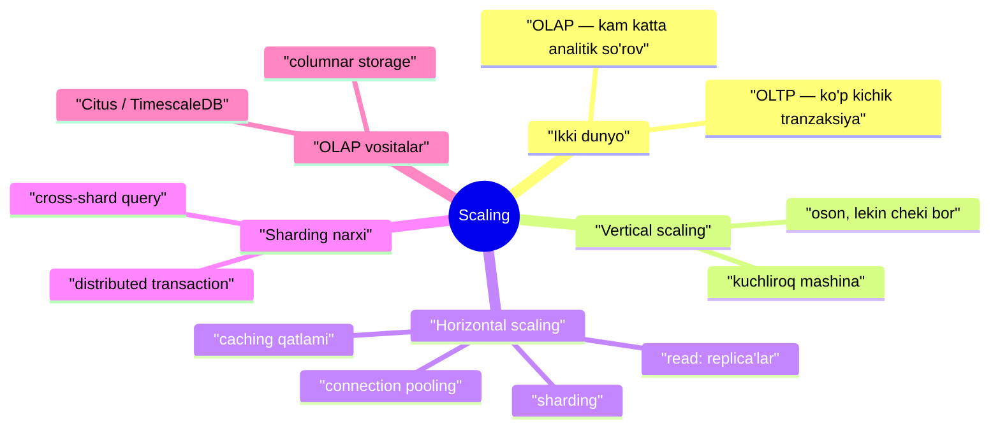

---

## 1. OLTP vs OLAP — ikki boshqa dunyo

Ma'lumotlar bazasiga tushadigan yuklama odatda ikki katta sinfga bo'linadi. Bu bo'linish masshtablashning **har bir** qaroriga ta'sir qiladi.

**OLTP** (Online Transaction Processing — onlayn tranzaksiya ishlov berish) — ko'p sonli **kichik** operatsiyalar: bitta buyurtma qo'shish, bitta foydalanuvchi ma'lumotini o'qish, bitta hisobni yangilash. Bu — tipik veb-ilova, mobil ilova, do'kon backend'i.

**OLAP** (Online Analytical Processing — onlayn analitik ishlov berish) — kam sonli, lekin **juda katta** so'rovlar: "oxirgi 3 yilda mintaqa bo'yicha o'rtacha savdo", "milliard qatordan trend". Bu — hisobot, dashboard, data warehouse, BI tizimlar.

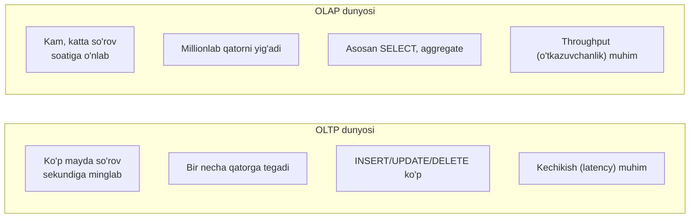

| Xususiyat | OLTP | OLAP |
|---|---|---|
| So'rov soni | Juda ko'p (minglab/sek) | Kam (o'nlab/soat) |
| Har so'rov hajmi | Kichik (bir necha qator) | Ulkan (millionlab qator) |
| Amal turi | Ko'p yozuv (INSERT/UPDATE) | Asosan o'qish (SELECT, aggregate) |
| Nima muhim | Latency (tez javob) | Throughput (ko'p ma'lumotni yig'ish) |
| Ideal saqlash | Row-oriented (qator bo'yicha) | Column-oriented (ustun bo'yicha) |
| Tipik misol | Do'kon, bank, ijtimoiy tarmoq | Hisobot, dashboard, BI |

> **Nega bu farq shunchalik muhim?** OLTP so'rovi bitta qatorning **hamma ustunlarini** oladi (index orqali tez topib) — buning uchun PostgreSQL'ning **row-oriented** (qatorlarni birga saqlash, 3-darsda ko'rdik) tuzilishi ideal. OLAP so'rovi esa millionlab qatorning **bitta-ikkita ustunini** yig'adi — bunda row-oriented saqlash isrofgarchilik: har page'dan faqat bir ustun kerak, qolgani bekorga o'qiladi.

---

## 2. PostgreSQL qaysi biriga mos?

PostgreSQL **avvalo OLTP** uchun qurilgan DBMS: MVCC (2-dars), row-oriented storage, B-tree index'lar (25-dars), tranzaksion kafolatlar — bularning hammasi ko'p sonli kichik tranzaksiyalar uchun optimallashtirilgan.

Lekin PostgreSQL OLAP'da ham **yomon emas**: parallel query (16-dars), murakkab planner, hashing va sort (22-23-darslar), BRIN index (29-dars) katta jadvallar bo'yicha analitik so'rovlarni ancha yaxshi bajaradi. O'rta hajmdagi analitika uchun sof PostgreSQL ko'pincha **yetarli**.

> **Amaliy haqiqat:** aksariyat loyihalar uchun bitta yaxshi sozlangan PostgreSQL — ham OLTP, ham o'rtacha OLAP uchun yetarli. Sharding va maxsus OLAP vositalar haqida o'ylashdan **oldin** — index, query va vertical scaling'ni to'g'rilang. "Bizga sharding kerak" degan qaror ko'pincha erta va noto'g'ri qabul qilinadi.

---

## 3. Vertical vs horizontal scaling

Masshtablashning ikki yo'nalishi bor — bu barcha keyingi mavzularning asosi.

**Vertical scaling** (tikka masshtablash) — mashinani **kuchliroq** qilish: ko'proq CPU, ko'proq RAM, tezroq disk (NVMe SSD). "Bitta serverni katta qilish".

**Horizontal scaling** (yotiq masshtablash) — **ko'proq** mashina qo'shish: yukni bir necha server orasida taqsimlash. "Ko'p kichik server".

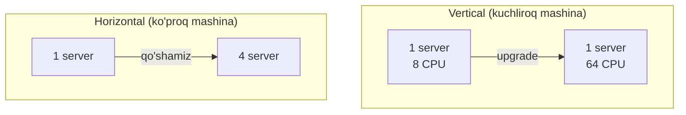

| | Vertical | Horizontal |
|---|---|---|
| Qanday | Kuchliroq bitta mashina | Ko'proq mashina |
| Murakkablik | Oddiy (kod o'zgarmaydi) | Murakkab (kod/arxitektura o'zgaradi) |
| Cheklov | Fizik chek (eng katta mashina) | Deyarli cheksiz |
| Narx | Eksponensial oshadi | Chiziqli o'sadi |
| Downtime | Ko'pincha kerak (reboot) | Yo'q (server qo'shiladi) |

> **Oltin qoida:** har doim **avval vertical**. Server kuchini oshirish — eng arzon va eng oddiy yechim, kodni o'zgartirmaydi. Zamonaviy mashinalar (masalan 128 CPU, 1 TB RAM) ko'p ilovalarni **yakka o'zi** ko'taradi. Horizontal scaling'ni faqat vertical cheki ko'ringanda boshlang — chunki u arxitektura murakkabligini keskin oshiradi.

---

## 4. Read scaling — replica'lardan o'qish

Horizontal scaling'ning **eng oson** turi. Ko'p ilovalarda o'qish (SELECT) yozishdan (INSERT/UPDATE) ancha ko'p — masalan 90% o'qish, 10% yozish. Bu holda:

31-darsda **replication** bilan tanishdik: primary WAL'ni standby serverlarga oqim orqali yuboradi, standby'lar deyarli aynan nusxa saqlaydi. Endi bu replica'larni **ishga solamiz**: yozuv (INSERT/UPDATE/DELETE) faqat primary'ga, o'qish (SELECT) esa **replica'larga** boradi.

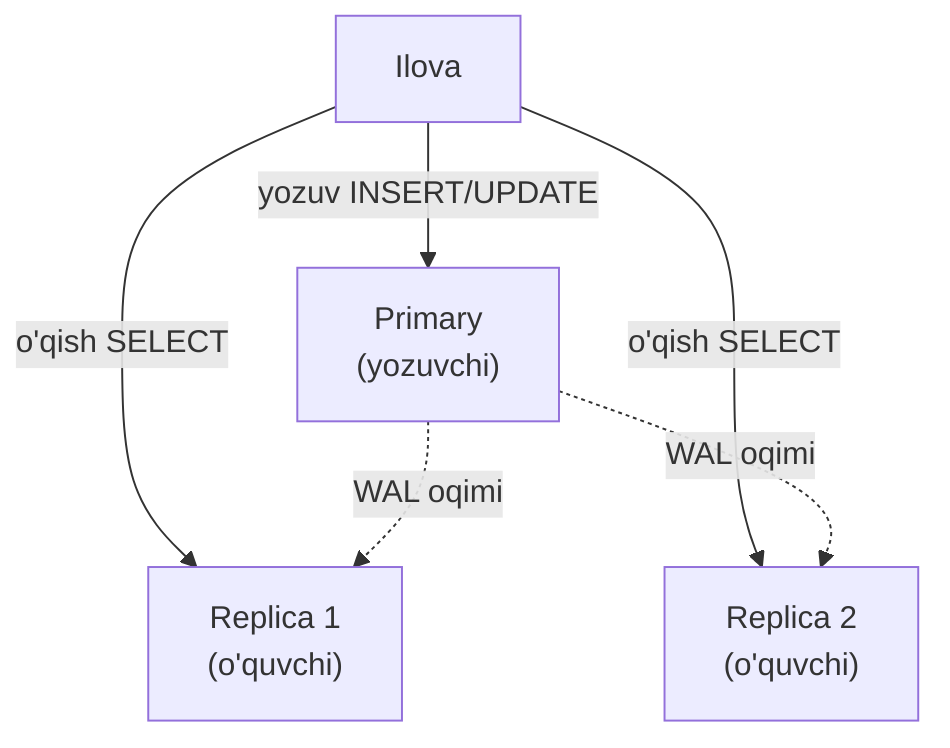

Shunday qilib o'qish yuklamasini bir necha replica'ga tarqatamiz — o'qish quvvatini deyarli chiziqli oshiramiz.

> ⚠️ **Eng muhim tuzoq — replication lag.** Replica primary'dan **biroz orqada** bo'lishi mumkin (WAL yetib borishi vaqt oladi). Foydalanuvchi ma'lumot yozib, darhol replica'dan o'qisa — **eski qiymatni** ko'rishi mumkin (bu "read-your-own-writes" muammosi). Yechim: kritik "yozgandan keyingi o'qish"larni primary'ga yo'naltirish yoki synchronous replication ishlatish (31-dars).

> **Muhim cheklov:** replica'lar **faqat o'qish** yukini masshtablaydi. Yozuv baribir bitta primary'ga tushadi — yozuv masshtablanmaydi. Yozuv ham cheklab qo'ysa, keyingi qadam — **sharding** (pastda).

---

## 5. Connection pooling — nega PostgreSQL'da connection qimmat?

Bu — production'da eng ko'p uchraydigan muammolardan biri. Uni tushunish uchun 1-darsga qaytamiz.

### PostgreSQL process modeli

1-darsda ko'rdik: PostgreSQL har bir client connection uchun **alohida OS jarayoni** (backend process) ochadi. Bu thread emas, to'liq **process** — o'z xotirasi, o'z stack'i bilan.

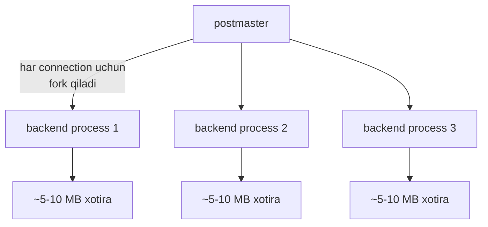

Bu nima degani? Har bir connection:

- **Xotira yeydi** — har backend bir necha MB oladi (work_mem, katalog cache va h.k.).
- **Ochilishi qimmat** — yangi jarayon `fork` qilish arzon emas.
- **Ko'p bo'lsa sekinlashtiradi** — 1000 ta backend OS scheduler'ni, lock manager'ni (15-dars memory locklar), snapshot hisoblashni og'irlashtiradi.

> **Analogiya:** PostgreSQL connection — bu do'kondagi **alohida kassir**. 10 mijozga 10 kassir yaxshi. Lekin 1000 kassir yollash — ularga joy, oylik, boshqaruv kerak, ular bir-biriga xalaqit beradi. Aslida kerak bo'lgani — kam sonli kassir va **navbat** (pool).

### PgBouncer — connection pool

Yechim: ilova va PostgreSQL orasiga **pooler** qo'yish. Ilova pooler'ga ulanadi (arzon), pooler esa oz sonli **haqiqiy** PostgreSQL connection'larni saqlaydi va ularni qayta ishlatadi. Eng mashhur pooler — **PgBouncer**.

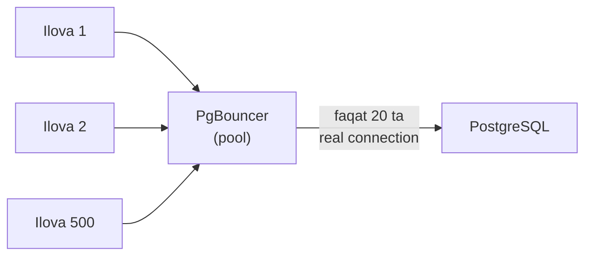

500 ta ilova connection'i — atigi 20 ta real PostgreSQL connection orqali xizmat qilinadi.

### PgBouncer rejimlari — eng muhim tanlov

PgBouncer'da real connection client'ga **qancha vaqtga** biriktirilishini `pool_mode` belgilaydi:

| Rejim | Connection qachon bo'shaydi | Pool samarasi | Cheklov |
|---|---|---|---|
| **session** | Client uzilganda | Past | Har client bitta real connection ushlaydi |
| **transaction** | Har tranzaksiya oxirida | **Yuqori** | Session-level holat ishlamaydi |
| **statement** | Har SQL operatordan keyin | Eng yuqori | Faqat autocommit, multi-statement yo'q |

- **session mode** — real connection client sessiyasi tugagunicha band. Pool samarasi kam, lekin hech narsa buzilmaydi. Bu session-level holat (masalan session-level `SET`, advisory lock) kerak bo'lganda.
- **transaction mode** — real connection faqat **tranzaksiya davomida** band, tranzaksiya tugashi bilan bo'shaydi. Eng ko'p ishlatiladigan rejim: pool samarasi yuqori.
- **statement mode** — har SQL operatordan keyin bo'shaydi. Eng agressiv, lekin multi-statement tranzaksiya yo'q.

> ⚠️ **transaction mode tuzog'i — prepared statements.** Prepared statement (oldindan tayyorlangan so'rov) connection'ga bog'liq — u session darajasida yashaydi. Transaction mode'da connection almashib tursa, prepared statement "yo'qoladi". Ilgari bu jiddiy muammo edi; PgBouncer 1.21'dan (`max_prepared_statements` sozlamasi) va PostgreSQL 17 (`PQclosePrepared`) bilan protocol-level prepared statement'lar transaction mode'da ham ishlaydigan bo'ldi.

> **Amaliy maslahat:** aksariyat veb-ilovalar uchun **transaction mode** to'g'ri tanlov — u eng yuqori samara beradi. Ilovangiz session-level holatga tayanmasligiga ishonch hosil qiling.

---

## 6. Caching qatlami

Yana bir keng tarqalgan usul: eng ko'p so'raladigan ma'lumotni PostgreSQL'ga **umuman bormasdan** qaytarish. Buning uchun ilova va baza orasiga **cache** (masalan Redis, Memcached) qo'yiladi.

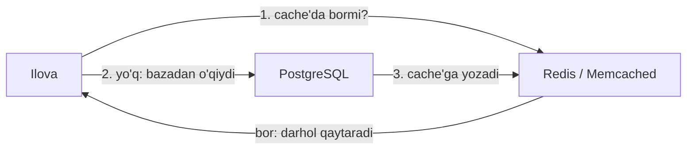

Naqsh **cache-aside** deyiladi: avval cache'ni tekshir, bo'lmasa bazadan o'qi va cache'ga yoz. Keyingi so'rovlar bazaga tegmaydi.

> **Foydasi:** eng "issiq" ma'lumot (masalan mashhur mahsulot sahifasi) minglab marta so'ralsa, u bazaga bir marta boradi, qolgani cache'dan keladi. Bu PostgreSQL yukini keskin kamaytiradi.

> ⚠️ **Cache invalidation** — kompyuter fanidagi "ikki qiyin narsa"dan biri. Ma'lumot bazada o'zgarsa, cache'dagi eski nusxa **yangilanishi** yoki o'chirilishi kerak, aks holda foydalanuvchi eskirgan qiymatni ko'radi. Bu logikani to'g'ri qurish — caching'ning eng qiyin qismi.

---

## 7. Sharding — yozuvni masshtablash

Replica'lar o'qishni masshtabladi, lekin yozuv baribir bitta primary'da. Agar yozuv ham juda ko'p bo'lsa (yoki ma'lumot bitta serverga sig'masa) — **sharding** kerak.

**Sharding** — ma'lumotni bir necha mustaqil serverga (shard'larga) **bo'lib** taqsimlash. Har shard — to'liq mustaqil PostgreSQL, ma'lumotning **bir qismini** saqlaydi.

### Vertical vs horizontal sharding

Sharding'ning ikki xil g'oyasi bor — ularni chalkashtirmaslik kerak:

**Vertical sharding** — turli **jadvallarni** turli serverga ajratish. Masalan `users` bir serverda, `orders` boshqasida, `products` uchinchisida. "Jadval bo'yicha bo'lish".

**Horizontal sharding** — bitta **jadvalning qatorlarini** bir necha serverga bo'lish. Masalan `users` jadvalining `id 1-1M` birinchi shard'da, `1M-2M` ikkinchi shard'da. "Qator bo'yicha bo'lish".

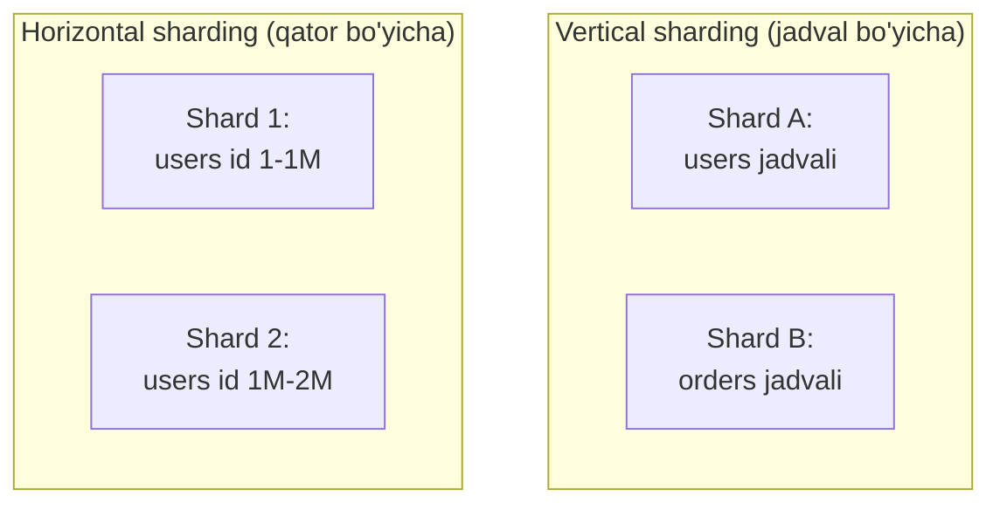

Odatda "sharding" deganda **horizontal sharding** nazarda tutiladi — u haqiqiy masshtablash beradi (bitta ulkan jadvalni ko'p serverga tarqatadi).

### Shard key — eng muhim qaror

Qaysi qator qaysi shard'ga borishini **shard key** (bo'lish kaliti) belgilaydi. Masalan `user_id` bo'yicha bo'lish: bitta foydalanuvchining barcha ma'lumoti bitta shard'da.

> **Oltin qoida:** shard key'ni shunday tanlash kerakki, ko'pchilik so'rov **bitta shard**ga tushsin. Agar so'rovlar doim bir necha shard'ni kesib o'tsa (cross-shard), sharding foyda o'rniga zarar keltiradi (pastda ko'ramiz).

---

## 8. Sharding'ni qanday amalga oshirish?

### 8.1. Application-level sharding

Eng oddiy (va eng qo'lda) usul: **ilova o'zi** qaysi shard'ga borishni hal qiladi. Ilova kodida shard key bo'yicha "hisoblash" bor:

```python
# --- shard key bo'yicha qaysi shard'ga borishni hisoblash ---
def get_shard(user_id):
    shard_number = user_id % 4        # 4 ta shard
    return SHARDS[shard_number]        # tegishli DB connection

# --- foydalanuvchi ma'lumotini o'qish ---
conn = get_shard(user_id)
conn.execute("SELECT * FROM users WHERE id = %s", [user_id])
```

Bu **to'liq nazorat** beradi, lekin barcha murakkablikni (routing, cross-shard, resharding) ilova o'z zimmasiga oladi.

### 8.2. Citus — PostgreSQL'ni distributed qiladi

**Citus** — PostgreSQL'ning extension'i (kengaytmasi), u shardingni **avtomatlashtiradi**. Bitta koordinator node so'rovni qabul qiladi va uni tegishli worker node'larga (shard'larga) tarqatadi. Ilova uchun bu bitta oddiy PostgreSQL kabi ko'rinadi.

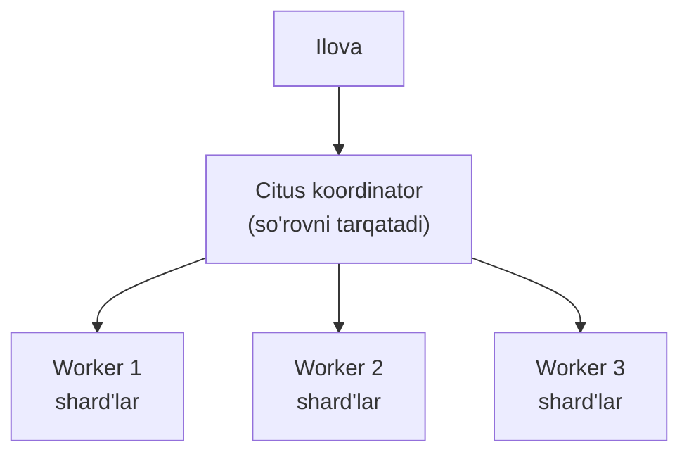

```sql
-- --- jadvalni Citus'da shard qilish ---
SELECT create_distributed_table('users', 'id');
-- endi 'users' avtomatik worker'larga bo'linadi, so'rovlar tarqatiladi
```

Citus ko'pincha ham OLTP (multi-tenant ilovalar), ham OLAP (parallel analitika) uchun ishlatiladi — u so'rovni bir vaqtda barcha shard'larda parallel bajarib, natijani birlashtiradi.

### 8.3. FDW (postgres_fdw) orqali sharding

**FDW** (Foreign Data Wrapper — tashqi ma'lumot o'rovchisi) — PostgreSQL'ning standart imkoniyati: bitta serverdan **boshqa server**dagi jadvalni go'yo o'ziniki kabi ko'rish. `postgres_fdw` extension'i orqali:

```sql
-- --- 1-qadam: tashqi serverni ro'yxatga olish ---
CREATE SERVER shard2 FOREIGN DATA WRAPPER postgres_fdw
  OPTIONS (host 'shard2.host', dbname 'app');

-- --- 2-qadam: tashqi jadvalni ulash ---
CREATE FOREIGN TABLE users_shard2 (id int, name text)
  SERVER shard2 OPTIONS (table_name 'users');

-- --- endi mahalliy va tashqi shard'ni birga ishlatish (masalan partition orqali) ---
SELECT * FROM users_shard2 WHERE id = 1500000;
```

FDW + **partitioning** (30-dars) birgalikda "qo'lda" distributed jadval yasashga imkon beradi: bosh jadval partition'lari turli serverdagi foreign table'lar bo'ladi. Bu Citus'siz, sof PostgreSQL bilan sharding qilish yo'li — lekin ko'proq qo'l mehnati talab qiladi.

---

## 9. Sharding'ning narxi — bepul emas

Sharding ma'lumotni tarqatadi, lekin buning **jiddiy narxi** bor. Aynan shu narx uchun "sharding'ni imkon qadar kechiktir" deyiladi.

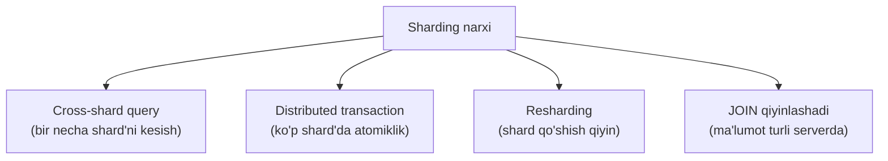

### Cross-shard query muammosi

Agar so'rov **bir shard**ga tushsa — tez va oson. Lekin so'rov barcha shard'larni kesib o'tsa (masalan "barcha foydalanuvchilar orasida eng faoli") — koordinator har shard'ga so'rov yuborib, natijalarni birlashtirishi kerak. Bu sekin va murakkab.

> **Misol:** `user_id` bo'yicha shardlangan bazada "Foydalanuvchi X ning buyurtmalari" — bitta shard (tez). Lekin "Bugungi barcha buyurtmalar summasi" — hamma shard (sekin, cross-shard). Shard key'ni noto'g'ri tanlasang, ko'p so'roving cross-shard bo'lib, sharding foyda bermaydi.

### Distributed transaction muammosi

Bitta shard ichida tranzaksiya oddiy ishlaydi (ACID, 2-dars). Lekin bir necha shard'ni **atomik** o'zgartirish kerak bo'lsa (masalan shard 1'dagi hisobdan shard 2'dagi hisobga pul) — **distributed transaction** kerak. U **two-phase commit (2PC)** protokolini talab qiladi: sekin, murakkab, va bir shard qulasa butun tranzaksiya "osilib" qolishi mumkin.

> ⚠️ **Amaliy xulosa:** sharding — kuchli, lekin qimmat qurol. U ma'lumotni **mustaqil bo'laklarga** ajratish mumkin bo'lganda (masalan har mijoz mustaqil — multi-tenant) eng yaxshi ishlaydi. Agar ma'lumot chuqur bog'langan bo'lsa (hamma narsa hamma narsaga JOIN qilinsa) — sharding qiynog'i foydasidan oshadi.

---

## 10. OLAP uchun: columnar storage

Endi analitik (OLAP) dunyoga qaytamiz. Katta analitik so'rov (millionlab qatorning bir-ikki ustunini yig'ish) uchun PostgreSQL'ning **row-oriented** saqlashi optimal emas.

### Row-oriented vs column-oriented

3-darsda ko'rdik: PostgreSQL qatorning **barcha ustunlarini** bitta joyda (tuple ichida) saqlaydi — **row-oriented**. OLAP uchun esa **column-oriented** (columnar) saqlash yaxshiroq: har ustun **alohida**, ketma-ket saqlanadi.

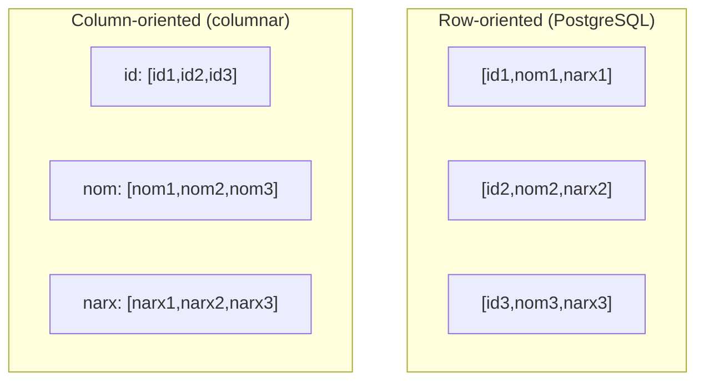

| | Row-oriented | Column-oriented |
|---|---|---|
| Bir qatorning hamma ustuni | Tez (bitta joyda) | Sekin (tarqoq) |
| Bitta ustunni millionlab qatorda | Sekin (butun qatorni o'qiydi) | **Tez** (faqat kerakli ustun) |
| Siqish (compression) | O'rtacha | **A'lo** (bir xil tip yonma-yon) |
| Ideal | OLTP | OLAP |

> **Nega columnar OLAP'da tez?** "Oxirgi yil o'rtacha narx" so'rovi faqat `narx` ustunini kerak qiladi. Columnar'da faqat shu ustun o'qiladi — qolgan ustunlar disk'dan umuman ko'tarilmaydi. Bundan tashqari, bir xil tipdagi qiymatlar yonma-yon turgani uchun ular **juda yaxshi siqiladi** (masalan takrorlanuvchi sana yoki kategoriya) — disk I/O yana kamayadi.

### TimescaleDB va Citus columnar

Sof PostgreSQL columnar storage'ni tabiiy qo'llab-quvvatlamaydi, lekin extension'lar buni qo'shadi:

| Extension | Nima uchun |
|---|---|
| **Citus columnar** | Jadval yoki partition'ni columnar formatda saqlash — analitik jadvallar uchun |
| **TimescaleDB** | Vaqt qatorlari (time-series) uchun; eski ma'lumotni avtomatik columnar'ga siqadi (hypertable + compression) |

TimescaleDB ayniqsa **time-series** (vaqt bo'yicha) ma'lumot uchun mashhur — sensor o'lchovlari, metrikalar, loglar. U yangi ma'lumotni tez yozish (OLTP kabi) uchun row-oriented saqlaydi, eski ma'lumotni esa avtomatik **columnar'ga siqadi** (OLAP kabi o'qish uchun).

---

## 11. Qachon PostgreSQL yetarli, qachon boshqa vosita kerak?

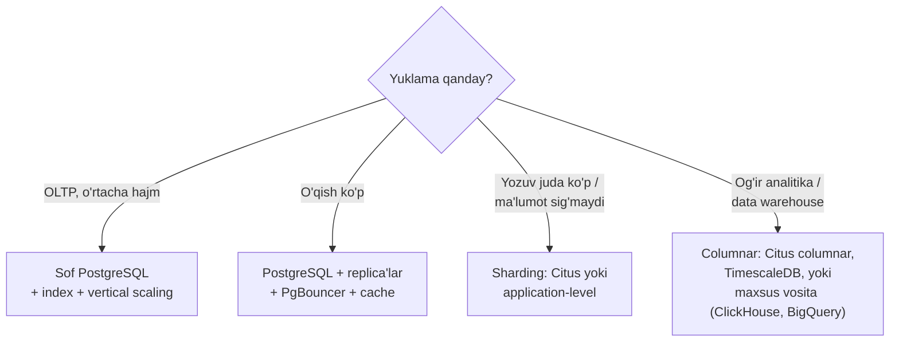

Amaliy bosqichlar (murakkablik tartibida):

1. **Index va query optimizatsiya** (16-29-darslar) — ko'p muammo shu bosqichda hal bo'ladi.
2. **Vertical scaling** — kuchliroq mashina, eng arzon.
3. **PgBouncer** — connection'larni jilovlash.
4. **Read replica'lar + cache** — o'qishni masshtablash.
5. **Sharding** (Citus / application-level) — yozuvni masshtablash, ma'lumot sig'masa.
6. **Maxsus OLAP vosita** — og'ir analitika uchun (ClickHouse, BigQuery, Snowflake).

> **Asosiy xulosa:** PostgreSQL juda uzoqqa olib boradi. Ko'p "bizga NoSQL / maxsus baza kerak" degan qarorlar aslida sozlanmagan PostgreSQL'ni to'g'ri sozlash bilan hal bo'ladi. Bu bosqichlarni **tartib bilan** o'ting — har biri oldingisidan murakkabroq va qimmatroq.

---

## Xulosa

- Yuklama ikki dunyoga bo'linadi: **OLTP** (ko'p kichik tranzaksiya, latency muhim) va **OLAP** (kam katta analitik so'rov, throughput muhim).
- PostgreSQL **avvalo OLTP** uchun qurilgan (MVCC, row-oriented), lekin o'rtacha OLAP uchun ham yetarli.
- **Vertical scaling** (kuchliroq mashina) — har doim birinchi qadam: oddiy, arzon, kodni o'zgartirmaydi. **Horizontal** — faqat vertical cheki ko'ringanda.
- **Read replica'lar** o'qishni masshtablaydi (yozuv baribir primary'da); asosiy tuzoq — **replication lag**.
- PostgreSQL'da **connection qimmat** (har connection = alohida process, 1-dars); **PgBouncer** ozgina real connection'ni ko'p client orasida bo'lishadi.
- PgBouncer rejimlari: **session** (xavfsiz, past samara), **transaction** (eng ko'p ishlatiladigan), **statement** (agressiv); transaction mode'da prepared statement tuzog'iga ehtiyot bo'l.
- **Caching** (Redis) eng issiq ma'lumotni bazaga bormasdan qaytaradi; qiyin qismi — **cache invalidation**.
- **Sharding** yozuvni masshtablaydi: **vertical** (jadval bo'yicha) va **horizontal** (qator bo'yicha, shard key bilan). Usullar: application-level, **Citus**, `postgres_fdw` + partitioning.
- Sharding narxi: **cross-shard query** va **distributed transaction** (2PC) — shuning uchun uni imkon qadar kechiktir.
- **OLAP** uchun **columnar storage** yaxshiroq (faqat kerakli ustun o'qiladi, a'lo siqiladi): Citus columnar, TimescaleDB.
- Bosqichlar tartibi: index → vertical → PgBouncer → replica+cache → sharding → maxsus OLAP vosita.

## Nazorat savollari

1. OLTP va OLAP o'rtasidagi asosiy farqlar nima (kamida 3 ta)? Nega ular uchun turli xil saqlash (row vs column) yaxshiroq?
2. Vertical va horizontal scaling farqi nima? Nega har doim vertical'dan boshlash tavsiya etiladi?
3. Read replica'lar nimani masshtablaydi va nimani **masshtablay olmaydi**? Replication lag qanday muammo tug'diradi?
4. Nega PostgreSQL'da har bir connection qimmat? Bu 1-darsda o'rgangan process modeli bilan qanday bog'liq?
5. PgBouncer'ning session, transaction va statement rejimlari farqi nima? Qaysi biri eng ko'p ishlatiladi va nega transaction mode'da prepared statement muammo bo'lishi mumkin?
6. Vertical va horizontal sharding farqi nima? "Sharding" deganda odatda qaysi biri nazarda tutiladi?
7. Cross-shard query va distributed transaction nega sharding'ning "narxi" hisoblanadi? Shard key tanlashda nimaga e'tibor berish kerak?
8. Columnar storage nega OLAP so'rovlarida row-oriented'dan tez? Bitta ustunni millionlab qatordan yig'ish misolida tushuntiring.
