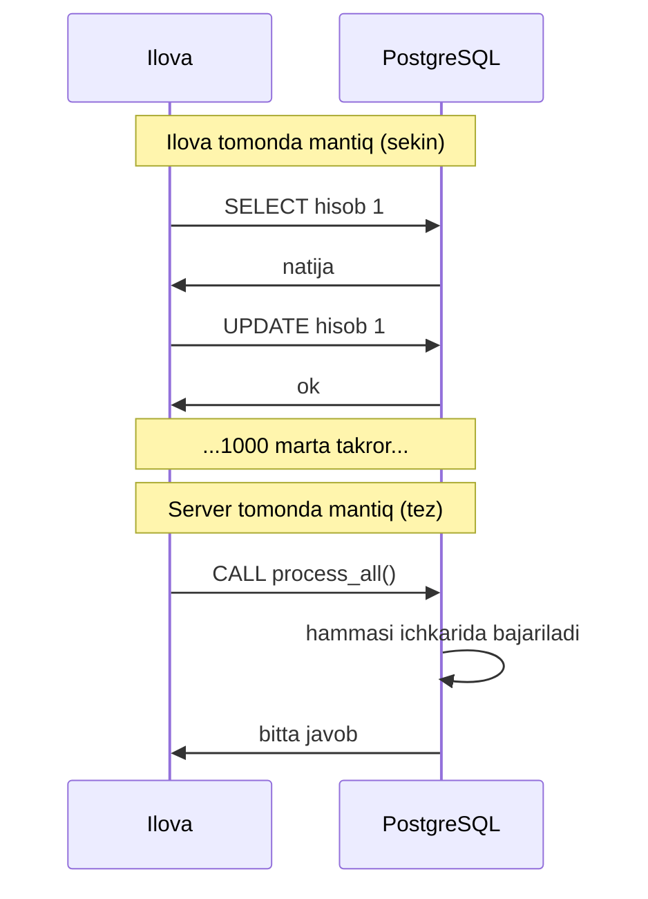
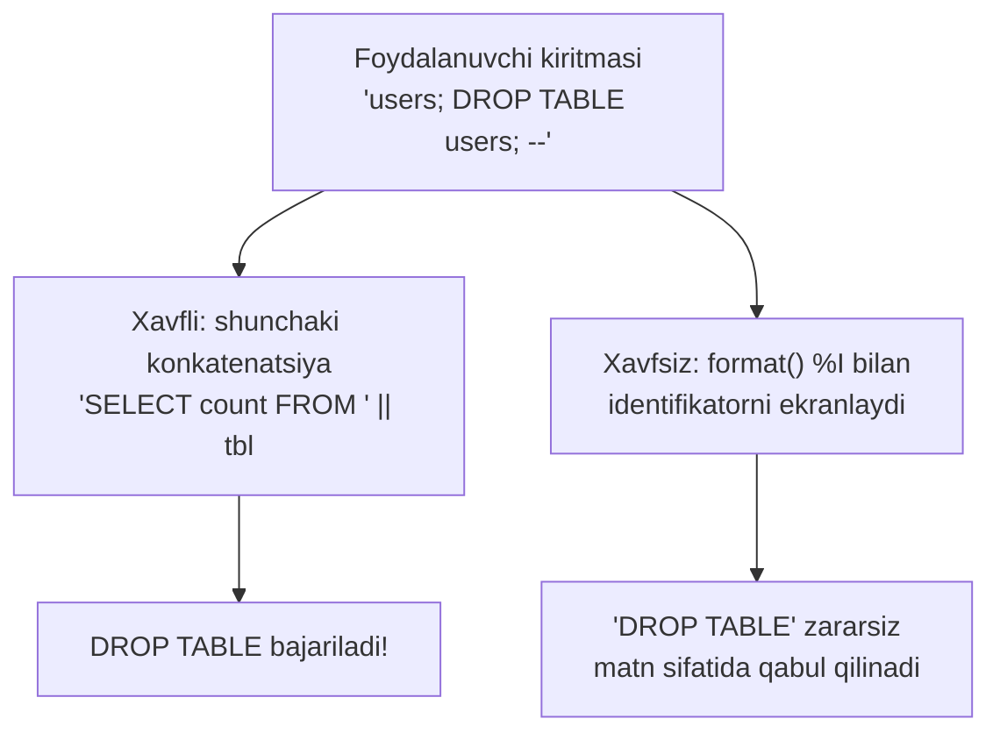
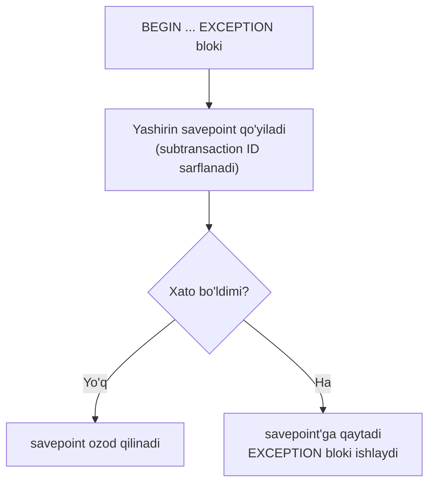
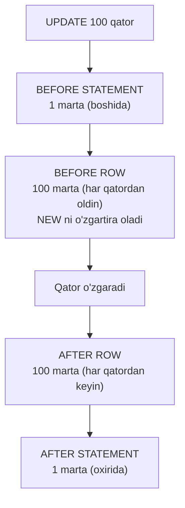
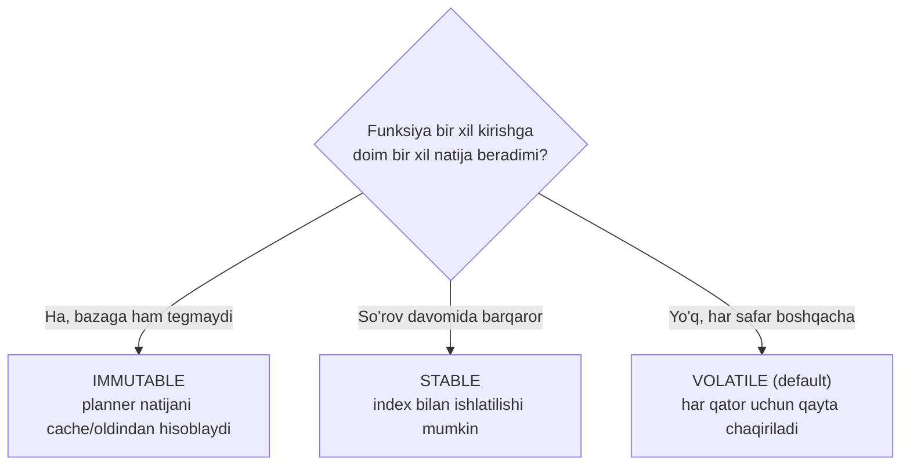
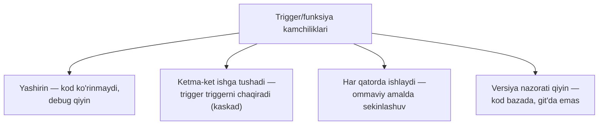

# 34. PL/pgSQL va server dasturlash

> 📖 Qo'shimcha dars — Rogov kitobiga kirmagan, lekin amaliyotda zarur mavzu

## Nima uchun kerak?

Shu paytgacha biz PostgreSQL'ni **ma'lumot saqlovchi** sifatida ko'rdik: ilova SQL yuboradi, baza javob qaytaradi. Kod esa ilovada — Python, Go, Java'da yashaydi. Lekin PostgreSQL o'zi ham **to'liq dasturlash muhiti**: mantiqni bevosita **server ichida** bajarish mumkin.

Nega buni qilish kerak? Ikkita kuchli sabab bor.

**1-sabab — network round-trip (tarmoq borib-kelishi).** Tasavvur qiling: 1000 ta hisobni yangilash kerak, har biri oldingisiga bog'liq. Agar ilova har qadamda `SELECT` qilib, natijani olib, hisoblab, `UPDATE` yuborsa — bu **2000 marta** tarmoq bo'ylab borib-kelish. Har biri millisekundlar. Agar shu mantiq server ichida bajarilsa — **bitta** chaqiruv yetadi.



**2-sabab — atomiklik.** Server ichidagi funksiya bitta tranzaksiya kontekstida ishlaydi (2-dars). Murakkab ko'p qadamli mantiq **butunligicha** bajariladi yoki umuman bajarilmaydi — oraliqda ilova qulasa ham, ma'lumot buzilmaydi.

Bu darsda PostgreSQL'ning asosiy server-side tili — **PL/pgSQL** bilan tanishamiz, so'ng eng kuchli (va eng xavfli) vosita — **trigger**larni o'rganamiz.

```mermaid
mindmap
  root(("PL/pgSQL va<br/>server dasturlash"))
    "Nega server tomonda"
      "network round-trip"
      "atomiklik"
    "Function vs Procedure"
      "function — qiymat qaytaradi"
      "procedure — CALL, transaction boshqaradi"
    "PL/pgSQL asoslari"
      "blok, o'zgaruvchi"
      "IF / CASE / LOOP"
      "RETURN QUERY / SETOF"
      "cursor"
    "Dinamik SQL"
      "EXECUTE / format()"
      "SQL injection xavfi"
    "Triggerlar"
      "BEFORE / AFTER"
      "row / statement"
      "NEW / OLD"
      "event trigger"
    "Volatility"
      "VOLATILE / STABLE / IMMUTABLE"
```

---

## 1. Function vs Procedure

PostgreSQL'da server ichida kod ikki ko'rinishda yashaydi: **function** (funksiya) va **procedure** (protsedura). Ularni chalkashtirmaslik muhim.

**Function** — biror **qiymat qaytaradi** va SQL so'rov ichida ishlatiladi: `SELECT my_func(x)`. U tranzaksiyani boshqara olmaydi — chaqirilgan tranzaksiya ichida ishlaydi.

**Procedure** — `CALL` bilan chaqiriladi, qiymat qaytarishi shart emas, va eng muhimi — **tranzaksiyani boshqara oladi** (`COMMIT`/`ROLLBACK` ishlata oladi). Bu v11'dan qo'shildi.

| | Function | Procedure |
|---|---|---|
| Chaqirish | `SELECT f(...)` | `CALL p(...)` |
| Qiymat qaytaradi | Ha (majburiy) | Ixtiyoriy (`INOUT` orqali) |
| SQL ichida ishlatiladi | Ha | Yo'q |
| `COMMIT`/`ROLLBACK` | Yo'q | **Ha** |
| Tipik ishlatish | Hisoblash, qiymat | Ko'p qadamli jarayon (masalan ETL, batch) |

```sql
-- --- FUNCTION: qiymat qaytaradi ---
CREATE FUNCTION add_tax(price numeric) RETURNS numeric AS $$
  SELECT price * 1.12;
$$ LANGUAGE sql;

SELECT add_tax(100);   -- 112.00

-- --- PROCEDURE: CALL bilan, transaction boshqaradi ---
CREATE PROCEDURE process_batch() LANGUAGE plpgsql AS $$
BEGIN
  UPDATE orders SET status = 'done' WHERE status = 'pending';
  COMMIT;                          -- procedure COMMIT qila oladi!
END;
$$;

CALL process_batch();
```

> **Nega procedure `COMMIT` qila oladi, function yo'q?** Function SQL so'rovning **bir qismi** sifatida bajariladi — so'rov o'rtasida tranzaksiyani commit qilib bo'lmaydi. Procedure esa `CALL` bilan **mustaqil** chaqiriladi, shuning uchun uzun jarayonni bo'lak-bo'lak commit qilishi mumkin (masalan har 10000 qatordan keyin) — bu katta batch ishlar uchun kritik.

---

## 2. PL/pgSQL asoslari

**PL/pgSQL** (Procedural Language / PostgreSQL) — PostgreSQL'ning asosiy protsedura tili. U SQL'ga o'zgaruvchi, shart, sikl va xato boshqaruvini qo'shadi. Sof SQL "nima kerakligini" aytadi, PL/pgSQL esa "qanday qilishni" ham ayta oladi.

### Blok tuzilishi

Har bir PL/pgSQL kodi **blok**dan iborat: `DECLARE` (o'zgaruvchilar) → `BEGIN` (kod) → `END`.

```sql
CREATE FUNCTION greet(name text) RETURNS text AS $$
DECLARE
  greeting text;               -- o'zgaruvchi e'lon
BEGIN
  greeting := 'Salom, ' || name || '!';
  RETURN greeting;
END;
$$ LANGUAGE plpgsql;

SELECT greet('Ali');           -- Salom, Ali!
```

> **`$$` nima?** Bu **dollar-quoting** — funksiya tanasini qo'shtirnoqsiz yozish uchun. Tana ichida `'` (bittalik tirnoq) ko'p bo'lgani uchun, butun tanani `$$ ... $$` orasiga olamiz — ichki tirnoqlarni ekranlash shart bo'lmaydi.

### IF / CASE — shart

```sql
CREATE FUNCTION grade(score int) RETURNS text AS $$
BEGIN
  IF score >= 90 THEN
    RETURN 'a''lo';
  ELSIF score >= 60 THEN
    RETURN 'o''rta';
  ELSE
    RETURN 'past';
  END IF;
END;
$$ LANGUAGE plpgsql;
```

`CASE` ham bor — ko'p tarmoqli tanlov uchun qulayroq:

```sql
CASE
  WHEN score >= 90 THEN result := 'a''lo';
  WHEN score >= 60 THEN result := 'o''rta';
  ELSE result := 'past';
END CASE;
```

### LOOP — sikl

Bir necha sikl turi bor. Eng ko'p ishlatiladigani — `FOR`:

```sql
CREATE FUNCTION sum_to(n int) RETURNS int AS $$
DECLARE
  total int := 0;
BEGIN
  FOR i IN 1..n LOOP           -- 1 dan n gacha
    total := total + i;
  END LOOP;
  RETURN total;
END;
$$ LANGUAGE plpgsql;

SELECT sum_to(100);            -- 5050
```

So'rov natijasi bo'yicha ham aylanish mumkin:

```sql
FOR rec IN SELECT id, name FROM users LOOP
  RAISE NOTICE 'Foydalanuvchi: % (%)', rec.name, rec.id;
END LOOP;
```

> ⚠️ **Ko'p uchraydigan xato:** siklda qator-baqator ishlash (masalan har qatorni alohida `UPDATE` qilish). Bu deyarli har doim **bitta SQL operator**dan sekinroq. PL/pgSQL sikli — oxirgi chora; avval sof SQL bilan hal qilishga urinib ko'ring ("to'plam bilan o'ylash", set-based thinking).

### RETURN QUERY va SETOF — jadval qaytarish

Funksiya bitta qiymat emas, **butun jadval** (qatorlar to'plami) qaytarishi mumkin. Buning uchun `RETURNS SETOF` va `RETURN QUERY`:

```sql
CREATE FUNCTION active_users(min_age int)
  RETURNS SETOF users AS $$      -- users jadvalidagi qatorlar to'plami
BEGIN
  RETURN QUERY
    SELECT * FROM users WHERE age >= min_age AND active;
END;
$$ LANGUAGE plpgsql;

SELECT * FROM active_users(18);  -- jadval kabi ishlatiladi
```

`RETURNS TABLE(...)` varianti ustun nomlarini aniq belgilashga imkon beradi:

```sql
CREATE FUNCTION user_stats()
  RETURNS TABLE(city text, cnt bigint) AS $$
BEGIN
  RETURN QUERY SELECT city, count(*) FROM users GROUP BY city;
END;
$$ LANGUAGE plpgsql;
```

### Cursor — qatorlarni bittalab o'qish

Odatda so'rov natijasi **birdan** qaytadi. Lekin natija juda katta bo'lsa (millionlab qator) va uni bittalab qayta ishlash kerak bo'lsa — **cursor** (kursor) ishlatiladi: u natijani xotiraga to'liq yuklamay, qator-baqator uzatadi.

```sql
DECLARE
  cur CURSOR FOR SELECT id FROM big_table;
  rec record;
BEGIN
  OPEN cur;
  LOOP
    FETCH cur INTO rec;          -- keyingi qatorni ol
    EXIT WHEN NOT FOUND;         -- qator qolmadi
    -- rec bilan ishlash
  END LOOP;
  CLOSE cur;
END;
```

> **Qachon cursor kerak?** Deyarli hech qachon PL/pgSQL ichida — `FOR ... IN SELECT` sikli o'zi ichkarida cursor ishlatadi va qulayroq. Cursor asosan **ilova tomonida** foydali: masalan ilova katta natijani (millionlab qator) sekin-asta o'qishi kerak bo'lganda (`DECLARE ... CURSOR` + `FETCH`), butun natijani RAM'ga yuklamasdan.

---

## 3. Dinamik SQL — EXECUTE va SQL injection

Ba'zan so'rovning **o'zi** ish paytida quriladi: masalan jadval nomi o'zgaruvchidan keladi. Buning uchun `EXECUTE`:

```sql
CREATE FUNCTION row_count(tbl text) RETURNS bigint AS $$
DECLARE
  result bigint;
BEGIN
  EXECUTE 'SELECT count(*) FROM ' || tbl INTO result;
  RETURN result;
END;
$$ LANGUAGE plpgsql;
```

Bu ishlaydi, lekin **juda xavfli**. Agar `tbl` foydalanuvchidan kelsa, kimdir shunday yozishi mumkin:

```sql
SELECT row_count('users; DROP TABLE users; --');
```

Bu **SQL injection** (SQL in'ektsiyasi) — hujumchi so'rovga o'z buyrug'ini "qistiradi". Yuqoridagi kod `users` jadvalini o'chirib yuborishi mumkin.



### To'g'ri yo'l — format() funksiyasi

`format()` funksiyasi qiymatlarni **to'g'ri ekranlaydi**. Ikki muhim spetsifikator:

| Spetsifikator | Nima uchun | Misol |
|---|---|---|
| `%I` | **Identifikator** (jadval/ustun nomi) | jadval, ustun nomlari |
| `%L` | **Literal** (qiymat/matn) | WHERE shartidagi qiymatlar |

```sql
CREATE FUNCTION row_count(tbl text) RETURNS bigint AS $$
DECLARE
  result bigint;
BEGIN
  -- %I identifikatorni to'g'ri ekranlaydi ("users; DROP..." zararsizlanadi)
  EXECUTE format('SELECT count(*) FROM %I', tbl) INTO result;
  RETURN result;
END;
$$ LANGUAGE plpgsql;
```

Qiymatlar uchun esa `USING` parametrlari eng xavfsiz:

```sql
EXECUTE format('SELECT * FROM %I WHERE id = $1', tbl)
  USING user_id;               -- $1 parametr sifatida, injection mumkin emas
```

> **Oltin qoida:** dinamik SQL'da jadval/ustun nomlari uchun **`format('%I')`**, qiymatlar uchun **`USING $1`** ishlating. Hech qachon foydalanuvchi kiritmasini **to'g'ridan-to'g'ri** so'rovga qo'shmang (`||` bilan) — bu SQL injection eshigini ochadi.

---

## 4. Xatolarni ushlash — EXCEPTION va subtransaction narxi

PL/pgSQL xatolarni ushlash imkonini beradi: `BEGIN ... EXCEPTION WHEN ... END`. Xato yuz berganda blok "yiqilmaydi", balki xatoni ushlab, muqobil yo'l tutadi.

```sql
CREATE FUNCTION safe_divide(a int, b int) RETURNS numeric AS $$
BEGIN
  RETURN a / b;
EXCEPTION
  WHEN division_by_zero THEN     -- nolga bo'lish xatosini ushlaymiz
    RETURN NULL;                 -- xato o'rniga NULL qaytaramiz
END;
$$ LANGUAGE plpgsql;

SELECT safe_divide(10, 0);       -- NULL (xato emas)
```

Aniq xato turlarini ushlash mumkin: `unique_violation`, `foreign_key_violation`, `not_null_violation` va h.k. Yoki `WHEN OTHERS` — har qanday xato.

### EXCEPTION narxi — subtransaction

Bu qulaylikning **yashirin narxi** bor, va uni tushunish uchun 3-darsga qaytamiz.

3-darsda **savepoint** va **nested transaction (subtransaction)** bilan tanishdik: savepoint transaction'ning bir qismini bekor qilish imkonini beradi, va har savepoint alohida subtransaction hosil qiladi (o'z transaction ID'si bilan).

`EXCEPTION` bloki **aynan shu mexanizmni** ishlatadi: `EXCEPTION` bo'lgan har bir `BEGIN` blokiga kirishda PostgreSQL **yashirin savepoint** qo'yadi — xato bo'lsa, o'sha nuqtaga qaytish uchun.



> ⚠️ **Amaliy tuzoq — siklda EXCEPTION.** Agar `EXCEPTION` bloki millionlab marta chaqirilsa (masalan katta sikl ichida har qatorda), millionlab subtransaction hosil bo'ladi. Bu ikki muammo tug'diradi: (1) sekinlashuv (har subtransaction — overhead), (2) **subtransaction ID sarflanishi** — juda ko'p subtransaction transaction ID wraparound'ni yaqinlashtiradi (7-dars) va `SubtransSLRU` cache'ni to'ldirib, butun bazani sekinlashtirishi mumkin.

> **Amaliy maslahat:** issiq siklda (hot loop) `EXCEPTION` blokidan qoching. Iloji bo'lsa, xatoni **oldindan tekshiruv** bilan oldini oling (masalan `INSERT ... ON CONFLICT DO NOTHING`, `IF EXISTS`) — bu subtransaction ochmaydi.

---

## 5. Triggerlar

Endi eng kuchli server-side vositaga keldik — **trigger** (tetik). Trigger — bu jadvalda biror **hodisa** (INSERT/UPDATE/DELETE) yuz berganda **avtomatik** ishga tushadigan funksiya. Ilova hech narsa qilmaydi — baza o'zi reaksiya beradi.

> **Analogiya:** trigger — bu uydagi **harakat datchigi**. Kimdir eshikdan kirsa (INSERT), chiroq avtomatik yonadi (trigger funksiyasi). Datchik doim "kuzatib" turadi, sizdan buyruq kutmaydi. Lekin farqi: datchik ko'rinadi, trigger esa **yashirin** — kod uni ko'rmaydi, shuning uchun ehtiyot bo'lish kerak (pastda).

### BEFORE vs AFTER, row vs statement

Trigger ikki o'lchamda sozlanadi:

**Vaqt:** `BEFORE` (hodisadan **oldin**) yoki `AFTER` (hodisadan **keyin**).

**Qamrov:** `FOR EACH ROW` (har **qatorga** bir marta) yoki `FOR EACH STATEMENT` (butun **operatorga** bir marta).



| | BEFORE ROW | AFTER ROW |
|---|---|---|
| Qachon | Qator yozilishidan oldin | Qator yozilgandan keyin |
| `NEW`ni o'zgartira oladi | **Ha** | Yo'q (kech) |
| Hodisani bekor qila oladi | Ha (`RETURN NULL`) | Yo'q |
| Tipik ishlatish | Qiymatni to'g'rilash, validatsiya | Audit, boshqa jadvalni yangilash |

### NEW va OLD

Trigger funksiyasi ichida ikki maxsus o'zgaruvchi bor:

- **`NEW`** — qatorning **yangi** holati (INSERT va UPDATE'da).
- **`OLD`** — qatorning **eski** holati (UPDATE va DELETE'da).

### Misol 1 — updated_at avtomatik yangilash

Klassik BEFORE ROW trigger: har o'zgarishda `updated_at` ustunini avtomatik joriy vaqtga qo'yish.

```sql
-- --- 1-qadam: trigger funksiyasi ---
CREATE FUNCTION set_updated_at() RETURNS trigger AS $$
BEGIN
  NEW.updated_at := now();       -- yangi qatorni o'zgartiramiz
  RETURN NEW;                    -- o'zgartirilgan qatorni qaytaramiz
END;
$$ LANGUAGE plpgsql;

-- --- 2-qadam: triggerni jadvalga ulaymiz ---
CREATE TRIGGER trg_updated_at
  BEFORE UPDATE ON products
  FOR EACH ROW
  EXECUTE FUNCTION set_updated_at();
```

Endi `UPDATE products SET price = 200 WHERE id = 1` bajarilganda, `updated_at` avtomatik yangilanadi — ilova buni eslashi shart emas.

> 🤔 **O'ylab ko'ring:** nega bu trigger `BEFORE`, `AFTER` emas? Chunki `NEW`ni o'zgartirish faqat `BEFORE`da ishlaydi — qator hali diskka yozilmagan. `AFTER`da qator allaqachon yozilgan, `NEW`ni o'zgartirish kech.

### Misol 2 — audit (o'zgarishlar tarixi)

AFTER ROW trigger: har o'zgarishni alohida `audit_log` jadvaliga yozib borish.

```sql
CREATE FUNCTION audit_changes() RETURNS trigger AS $$
BEGIN
  INSERT INTO audit_log(table_name, action, old_row, new_row, changed_at)
  VALUES (TG_TABLE_NAME, TG_OP, row_to_json(OLD), row_to_json(NEW), now());
  RETURN NULL;                   -- AFTER trigger'da qaytish qiymati e'tiborga olinmaydi
END;
$$ LANGUAGE plpgsql;

CREATE TRIGGER trg_audit
  AFTER INSERT OR UPDATE OR DELETE ON accounts
  FOR EACH ROW EXECUTE FUNCTION audit_changes();
```

`TG_OP` (qaysi amal: INSERT/UPDATE/DELETE) va `TG_TABLE_NAME` (jadval nomi) — trigger ichida mavjud maxsus o'zgaruvchilar.

---

## 6. Event trigger — DDL hodisalariga

Oddiy trigger **ma'lumot** o'zgarishiga (INSERT/UPDATE/DELETE) reaksiya beradi. **Event trigger** esa **DDL** hodisalariga (CREATE/ALTER/DROP TABLE va h.k.) — ya'ni sxema o'zgarishlariga reaksiya beradi. Bu cluster darajasidagi mexanizm.

```sql
-- --- har DDL buyruqni log qiladigan event trigger ---
CREATE FUNCTION log_ddl() RETURNS event_trigger AS $$
BEGIN
  RAISE NOTICE 'DDL bajarildi: %', tg_tag;   -- masalan 'CREATE TABLE'
END;
$$ LANGUAGE plpgsql;

CREATE EVENT TRIGGER trg_ddl
  ON ddl_command_end
  EXECUTE FUNCTION log_ddl();
```

> **Qachon foydali?** Event trigger asosan **audit** (kim sxemani o'zgartirdi) va **himoya** (masalan production'da `DROP TABLE`ni taqiqlash) uchun ishlatiladi. Kundalik ilova mantiqida kamdan-kam kerak.

---

## 7. Funksiyalar va planner — volatility

Bu — funksiyalarning eng nozik va eng ko'p e'tibordan chetda qoladigan tomoni. Har bir funksiya **volatility** (o'zgaruvchanlik) toifasiga ega, va bu toifa planner (16-dars) funksiyani qanday optimallashtirishini belgilaydi.

Uch toifa bor:

| Toifa | Ma'nosi | Misol |
|---|---|---|
| **IMMUTABLE** | Bir xil kirish → **doim** bir xil natija, bazaga tegmaydi | `lower(text)`, `2 + 2` |
| **STABLE** | Bitta so'rov ichida bir xil, lekin so'rovlar orasida o'zgarishi mumkin | `now()`, `current_setting()` |
| **VOLATILE** | Har chaqiruvda o'zgarishi mumkin (default) | `random()`, `nextval()` |



Nega bu muhim? Planner funksiya toifasiga qarab uni **necha marta** chaqirishni hal qiladi:

- **IMMUTABLE** funksiyani planner **bir marta** hisoblab, natijani qayta ishlatishi mumkin (masalan `WHERE x = upper('abc')` — `upper` bir marta hisoblanadi).
- **VOLATILE** funksiya esa **har qator uchun** qayta chaqiriladi — sekin, va index ishlatilishiga to'sqinlik qilishi mumkin.

> ⚠️ **Ko'p uchraydigan xato:** funksiya toifasini belgilamaslik. Default — **VOLATILE**, ya'ni eng sekin variant. Agar funksiyangiz aslida IMMUTABLE bo'lsa (masalan matematik hisob), uni **aniq belgilang** (`CREATE FUNCTION ... IMMUTABLE`) — planner uni tezlashtiradi. Noto'g'ri belgilash ham xavfli: VOLATILE funksiyani IMMUTABLE deb yolg'on aytsangiz, planner uni bir marta hisoblab, noto'g'ri natija beradi.

> **Bog'lanish (2-dars):** eslasangiz, 2-darsda `VOLATILE` funksiya `Read Committed`'da read skew anomaliyasiga sabab bo'lishini ko'rgan edik — chunki u har chaqiruvda yangi snapshot ko'radi. Bu — o'sha volatility toifasining aynan shu oqibati.

### Function inlining

Sof SQL funksiyalar (`LANGUAGE sql`, bitta `SELECT`dan iborat) va IMMUTABLE/STABLE toifadagilarni planner ba'zan **inline** qiladi — funksiya tanasini bevosita so'rovga "singdiradi". Bu funksiya chaqiruvi overhead'ini yo'qotadi va so'rovni butunligicha optimallashtirishga imkon beradi. PL/pgSQL funksiyalar esa inline qilinmaydi — ular "qora quti" bo'lib qoladi.

> **Amaliy maslahat:** oddiy hisoblash funksiyalarini `LANGUAGE sql` bilan yozing (PL/pgSQL emas) va to'g'ri volatility qo'ying — shunda planner ularni inline qilib, tezlashtiradi.

---

## 8. Qachon trigger/funksiya ISHLATMASLIK kerak?

Server-side kod kuchli, lekin **oson suiiste'mol qilinadi**. Trigger va funksiyalarning eng katta muammosi — ular **yashirin**: kod ilovada ko'rinmaydi, xatti-harakat "sehrli" bo'lib qoladi.



⚠️ **Qachon ISHLATMASLIK kerak:**

- **Murakkab biznes mantiq** — buni ilovada saqlash yaxshiroq (ko'rinadi, test qilinadi, versiya nazoratida). Triggerga faqat **ma'lumot butunligi** darajasidagi ishlarni qo'ying.
- **Trigger kaskadlari** — trigger boshqa jadvalni o'zgartirsa, u yerdagi trigger yana boshqasini... — bu tez chalkashib, debug qilib bo'lmas holatga keladi.
- **Og'ir hisoblash triggerda** — har qatorda ishlagani uchun ommaviy `UPDATE`ni keskin sekinlashtiradi.
- **Tashqi tizim bilan aloqa** (masalan trigger ichida HTTP so'rov) — bu tranzaksiyani bloklaydi va ishonchsiz.

✅ **Qachon MOS keladi:**

- `updated_at`, `created_at` kabi **texnik ustunlarni** avtomatik to'ldirish.
- **Audit** (o'zgarishlar tarixi) — barcha o'zgarishni bitta joyda ushlash.
- **Ma'lumot butunligi** — murakkab constraint (oddiy `CHECK` yetmaganda).
- **Denormalizatsiya** — hisoblangan qiymatni (masalan `total`) sinxron saqlash.

> **Oltin qoida:** trigger va server-side kod — **ma'lumot butunligi va texnik avtomatlashtirish** uchun; **biznes mantiq** uchun emas. "Bu mantiqni kelasi yil boshqa dasturchi topa oladimi?" deb so'rang. Agar javob "yo'q, u triggerda yashirin" bo'lsa — uni ilovaga ko'chiring.

---

## Xulosa

- Server-side kod ikki sababga foydali: **network round-trip**ni kamaytirish va **atomiklik** (murakkab mantiq bitta tranzaksiyada).
- **Function** qiymat qaytaradi, SQL ichida ishlatiladi; **procedure** `CALL` bilan chaqiriladi va **tranzaksiyani boshqara oladi** (`COMMIT`/`ROLLBACK`).
- **PL/pgSQL** — asosiy protsedura tili: blok (`DECLARE/BEGIN/END`), `IF/CASE/LOOP`, `RETURN QUERY`/`SETOF` (jadval qaytarish), cursor (qatorlarni bittalab).
- **Dinamik SQL** (`EXECUTE`) kuchli, lekin `||` bilan konkatenatsiya — **SQL injection** xavfi. To'g'ri yo'l: `format('%I')` identifikator uchun, `USING $1` qiymat uchun.
- **EXCEPTION** bloki xatoni ushlaydi, lekin har blok yashirin **savepoint** (subtransaction) ochadi (3-dars) — issiq siklda ko'p subtransaction wraparound va sekinlashuvga olib keladi.
- **Trigger** — hodisaga avtomatik reaksiya: `BEFORE`/`AFTER`, `FOR EACH ROW`/`STATEMENT`, `NEW`/`OLD`. `BEFORE ROW` `NEW`ni o'zgartira oladi.
- **Event trigger** — DDL (sxema) hodisalariga reaksiya; audit va himoya uchun.
- **Volatility** (IMMUTABLE/STABLE/VOLATILE) planner funksiyani qanday optimallashtirishini belgilaydi; default VOLATILE — eng sekin. To'g'ri toifa muhim.
- Trigger/funksiya **ma'lumot butunligi** uchun; **murakkab biznes mantiq** uchun emas — u yashirin bo'lib, debug va versiya nazoratini qiyinlashtiradi.

## Nazorat savollari

1. Server tomonida kod yozishning ikkita asosiy sababi nima? Network round-trip muammosini 1000 qatorli misol bilan tushuntiring.
2. Function va procedure o'rtasidagi farq nima? Nega procedure `COMMIT` qila oladi, function esa yo'q?
3. `RETURN QUERY`/`SETOF` va oddiy `RETURN` farqi nima? Cursor qachon foydali va nega PL/pgSQL ichida kamdan-kam kerak?
4. `EXECUTE 'SELECT ... ' || tbl` nega xavfli? SQL injection'ni `format()` qanday oldini oladi (`%I` va `%L` farqi)?
5. `EXCEPTION` bloki ichkarida qaysi mexanizmni ishlatadi (3-darsga bog'lang)? Nega issiq siklda ko'p `EXCEPTION` xavfli?
6. `BEFORE ROW` va `AFTER ROW` trigger farqi nima? `updated_at`ni yangilash trigger'i nega `BEFORE` bo'lishi kerak?
7. IMMUTABLE, STABLE, VOLATILE toifalari nima farq qiladi? Noto'g'ri VOLATILE funksiyani IMMUTABLE deb belgilash nega xavfli?
8. Qachon trigger ishlatish **mos**, qachon **mos emas**? "Yashirin kod" muammosi nima va nega biznes mantiqni triggerdan uzoq tutish kerak?
