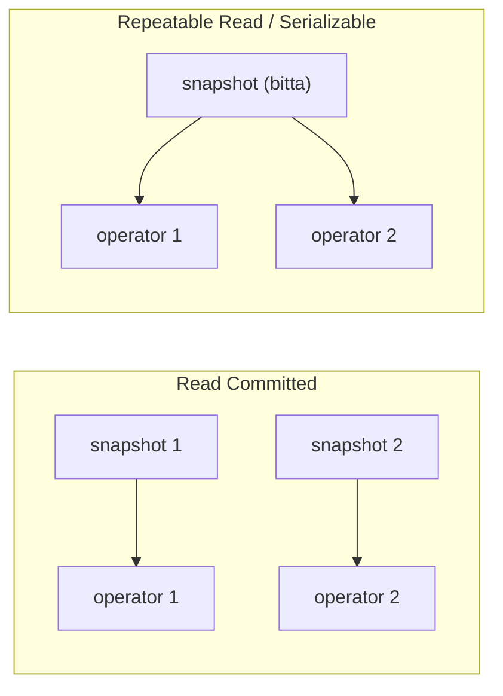
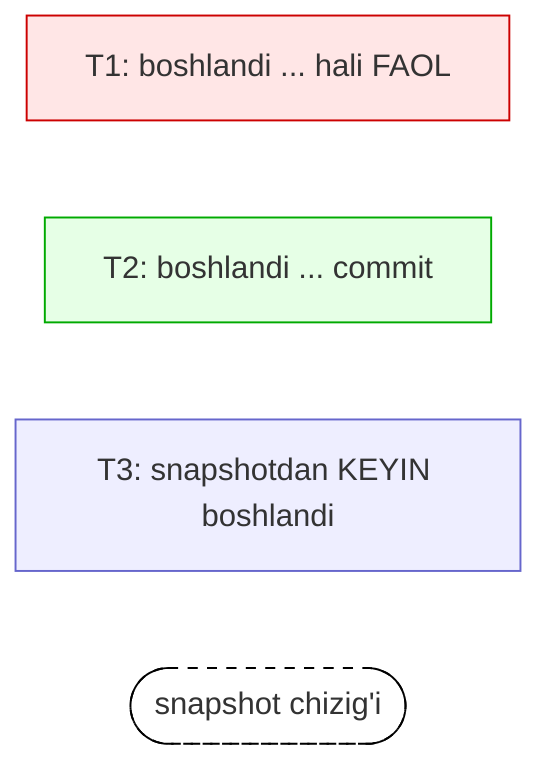
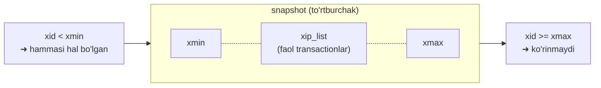
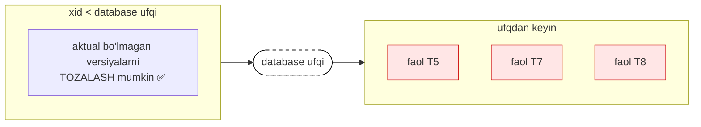
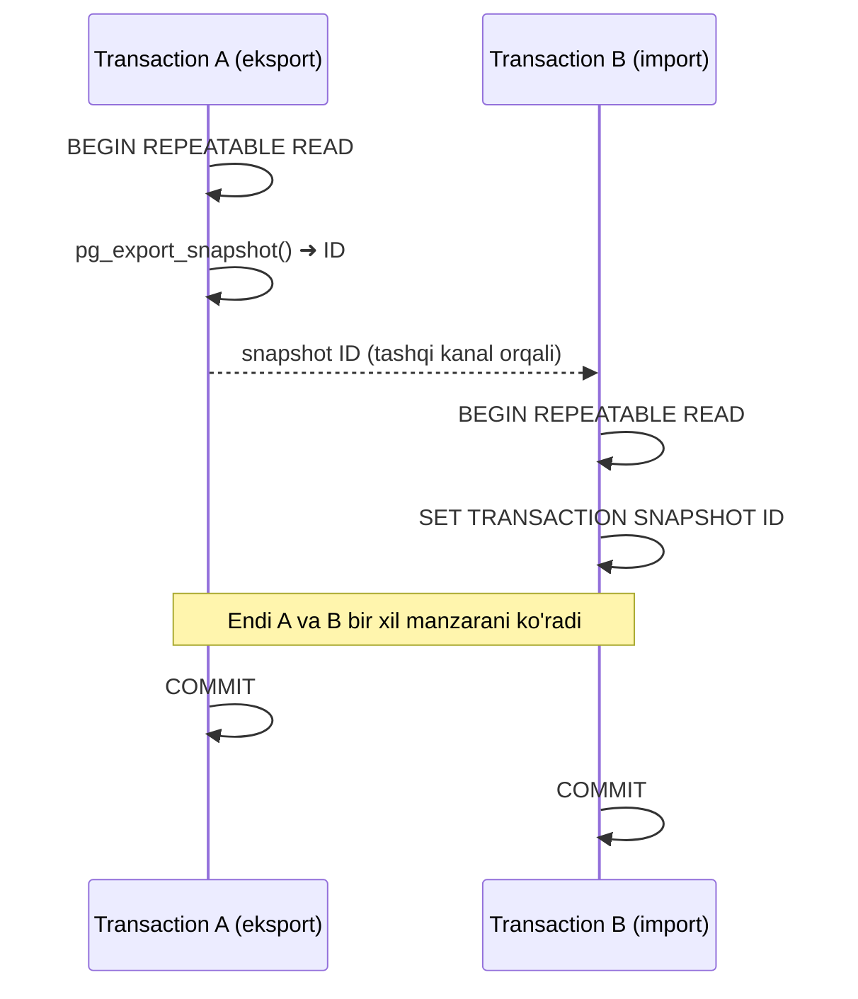

# 4. Snapshotlar (ma'lumotlar surati)

> 📖 Manba: Рогов, "PostgreSQL 17 изнутри", 4-bob

## Nima uchun kerak?

Oldingi darsda ko'rdikki, table page'ida bitta row'ning **bir nechta versiyasi** bir vaqtda yashashi mumkin (MVCC): eski versiyada `xmax` to'ldirilgan, yangisida `xmin` yangi transaction raqami bilan. Lekin savol tug'iladi:

> Transaction bir page'da bir row'ning uchta versiyasini ko'rsa, ulardan **qaysi birini** o'ziga "haqiqiy" deb hisoblashi kerak?

Har bir transaction ko'pi bilan **bitta** versiyani ko'rishi kerak — aks holda `SELECT count(*)` bir row'ni bir necha marta sanab yuboradi. Aynan shu tanlovni **snapshot** (ma'lumotlar surati) hal qiladi.

Snapshot — bu transaction ko'radigan barcha row versiyalarining birlashmasi. U ACID ma'nosida **kelishilgan** (consistent) ma'lumotlar manzarasini beradi: ma'lum bir vaqt lahzasidagi holat, faqat o'sha lahzagacha commit qilingan eng aktual ma'lumotlar bilan.

Isolation'ni ta'minlash uchun **har bir transaction o'z snapshot'i bilan ishlaydi**. Turli transactionlar turli, ammo har biri o'zicha kelishilgan (turli vaqt lahzalaridagi) manzaralarni ko'radi.

Snapshot qachon yaratilishi isolation level'ga bog'liq:

- **Read Committed** — snapshot transactionning **har bir operatori** boshida yaratiladi va shu operator ishlagan davomida faol qoladi.
- **Repeatable Read** va **Serializable** — snapshot **birinchi operator** boshida **bir marta** yaratiladi va transaction oxirigacha faol qoladi.



Chapdagi rejimda har operator "yangi" manzarani ko'radi (shuning uchun ikki `SELECT` orasida ma'lumot o'zgarishi mumkin). O'ngdagi rejimda esa butun transaction bir xil "muzlatilgan" manzarani ko'radi.

> **Eslatma:** bu darsdagi eksperimentlar oldingi darsda yaratilgan `heap_page(relname, pageno)` funksiyasidan foydalanadi (u `pageinspect` extension'ining `heap_page_items` funksiyasini o'rab, `ctid`, `state`, `xmin`, `xmax` ni chiroyli ko'rsatadi). Agar hali yaratmagan bo'lsangiz — 3-darsdagi funksiyani ishga tushiring.

---

## 4.1. Snapshotda versiyalar ko'rinishi (visibility)

Snapshot — bu row versiyalarining **fizik nusxasi emas**. Aslida snapshot bir nechta raqamdan iborat, versiyalarning ko'rinishi esa **qoidalar** orqali aniqlanadi.

Versiya ko'rinadimi yoki yo'qmi — bu uning header'idagi `xmin` va `xmax` (ya'ni versiyani yaratgan va o'chirgan transaction raqamlari) hamda ularga tegishli informatsion bit'larga bog'liq. `xmin`–`xmax` oraliqlari bir-biri bilan kesishmaydi, shuning uchun har bir row istalgan snapshotda **ko'pi bilan bitta** versiyasi bilan ifodalanadi.

Aniq qoidalar ancha murakkab, ammo **soddalashtirilgan** ko'rinishda ularni shunday aytish mumkin:

> Row versiyasi snapshotda **ko'rinadi**, agar `xmin` transaction'ining o'zgarishlari ko'rinsa (versiya allaqachon paydo bo'lgan), va `xmax` transaction'ining o'zgarishlari **ko'rinmasa** (versiya hali o'chirilmagan).

O'z navbatida, transaction o'zgarishlari snapshotda ko'rinadi, agar:

- u transaction snapshot yaratilgunga qadar **commit** qilingan bo'lsa;
- yoki (istisno) bu transaction snapshotni yaratgan **o'zining** transaction'i bo'lsa — o'z hali commit qilinmagan o'zgarishlarini har doim ko'radi.

**Abort** qilingan transactionlarning o'zgarishlari hech bir snapshotda ko'rinmaydi.

Oddiy misol. Transactionlarni kesma sifatida tasvirlaymiz (boshlanishidan commit lahzasigacha), snapshot esa vertikal chiziq:



Bu yerda:

- **T2** o'zgarishlari **ko'rinadi**, chunki u snapshot yaratilishidan oldin yakunlangan;
- **T1** o'zgarishlari **ko'rinmaydi**, chunki u snapshot yaratilgan lahzada hali faol edi;
- **T3** o'zgarishlari **ko'rinmaydi**, chunki u snapshotdan keyin boshlangan (yakunlanganmi-yo'qmi — ahamiyatsiz).

---

## 4.2. Snapshot nimadan iborat?

Afsuski, PostgreSQL manzarani yuqoridagidek "sof" ko'rmaydi. Muammo shundaki, tizim transactionlar **qachon commit qilinganini bilmaydi**. Faqat qachon **boshlanganini** biladi — bu lahza transaction raqami (`xid`) bilan belgilanadi, commit fakti esa hech qayerda yozib qo'yilmaydi.

> **Eslatma:** `track_commit_timestamp` parametri yoqilganda commit vaqti kuzatiladi, lekin u visibility tekshiruvida umuman ishtirok etmaydi (u tashqi replikatsiya yechimlariga foydali bo'lishi mumkin).

Tizim faqat transactionlarning **joriy statusini** bila oladi — bu ma'lumot `ProcArray` strukturasida (server'ning shared memory'sida) turadi, unda barcha faol seanslar va ularning transactionlari ro'yxati bor. Postfaktum esa qaysidir transaction snapshot yaratilgan lahzada faol bo'lganmi-yo'qmi — aniqlab bo'lmaydi.

Shuning uchun snapshotni olish uchun uning **yaratilish lahzasini eslab qolish yetarli emas**: bundan tashqari, o'sha lahzada transactionlar qaysi statusda bo'lganini ham eslab qolish kerak. Aynan shu sababli PostgreSQL'da **o'tmishning ma'lum bir lahzasidagi** manzarani ko'rsatuvchi snapshot yaratib bo'lmaydi — demak, retrospektiv (temporal, flashback) so'rovlarni ham amalga oshirib bo'lmaydi.

Snapshot yaratilgan lahzada eslab qolinadigan qiymatlar:

| Qism | Ma'nosi |
|------|---------|
| **`xmin`** (pastki chegara) | Eng eski faol transaction raqami. `xid < xmin` bo'lgan barcha transactionlar yo commit qilingan (ko'rinadi), yo abort qilingan (e'tiborsiz qoldiriladi). |
| **`xmax`** (yuqori chegara) | Oxirgi commit qilingan transaction raqamidan **bir birlik katta** son. Snapshot qilingan lahzani belgilaydi. `xid >= xmax` bo'lgan transactionlar hali yakunlanmagan yoki mavjud emas — ular ko'rinmaydi. |
| **`xip_list`** (xid-in-progress list) | `xmax` dan kichik bo'lgan barcha **faol** transactionlar ro'yxati (virtuallardan tashqari — ular visibility'ga ta'sir qilmaydi). |

Grafik jihatdan snapshotni `xmin` dan `xmax` gacha bo'lgan transactionlarni qamrab oluvchi to'rtburchak sifatida tasavvur qilish mumkin:



Ko'rinishning yakuniy qoidasi ikki holatga bo'linadi:

- `xid < xmin` — **so'zsiz** ko'rinadi (agar commit qilingan bo'lsa); masalan, `accounts` jadvalini yaratgan transaction;
- `xmin <= xid < xmax` — ko'rinadi, **`xip_list` ga tushganlaridan tashqari**.

### Eksperiment: snapshotni ko'rish

Jadvalni tozalab, uchta transaction ssenariysini takrorlaymiz.

Birinchi transaction birinchi row'ni qo'shadi va **faol** qoladi:

```sql
=> TRUNCATE TABLE accounts;

=> BEGIN;
=> INSERT INTO accounts VALUES (1, 'alice', 1000.00);
=> SELECT pg_current_xact_id();

 pg_current_xact_id
--------------------
                795
(1 row)
```

Ikkinchi transaction (boshqa seansda) ikkinchi row'ni qo'shadi va **darhol yakunlanadi**:

```sql
=> BEGIN;
=> INSERT INTO accounts VALUES (2, 'bob', 100.00);
=> SELECT pg_current_xact_id();

 pg_current_xact_id
--------------------
                796
(1 row)
=> COMMIT;
```

Endi (uchinchi seansda) yangi snapshot yaratamiz. Buning uchun istalgan so'rov bajarish yetarli, ammo biz snapshotni maxsus funksiya bilan bevosita ko'ramiz:

```sql
=> BEGIN ISOLATION LEVEL REPEATABLE READ;
=> -- txid_current_snapshot() v.13 gacha
   SELECT pg_current_snapshot();

 pg_current_snapshot
---------------------
 795:797:795
(1 row)
```

Funksiya ikki nuqta orqali snapshotning uch qismini chiqaradi: `xmin`, `xmax` va `xip_list` (bu holda bitta raqamdan iborat). Ya'ni:

- `xmin = 795` — eng eski faol transaction (T1, hali ochiq);
- `xmax = 797` — oxirgi commit qilingan (796) + 1;
- `xip_list = {795}` — faol transactionlar ro'yxati.

Snapshot yaratilgach, birinchi transactionni yakunlaymiz:

```sql
=> COMMIT;
```

Uchinchi transaction snapshot yaratilgandan **keyin** ishlaydi va ikkinchi row'ni o'zgartiradi (yangi versiya paydo bo'ladi):

```sql
=> BEGIN;
=> UPDATE accounts SET amount = amount + 100 WHERE id = 2;
=> SELECT pg_current_xact_id();

 pg_current_xact_id
--------------------
                797
(1 row)
=> COMMIT;
```

Endi **snapshot bilan ishlayotgan** (Repeatable Read) seansimizga qaytamiz. Unda faqat **bitta** versiya ko'rinadi:

```sql
=> SELECT ctid, * FROM accounts;

 ctid  | id | client | amount
-------+----+--------+--------
 (0,2) |  2 | bob    | 100.00
(1 row)
```

Holbuki table page'ida **uchta** versiya bor:

```sql
=> SELECT * FROM heap_page('accounts',0);

 ctid  | state  | xmin  | xmax
-------+--------+-------+-------
 (0,1) | normal | 795 c | 0 a
 (0,2) | normal | 796 c | 797 c
 (0,3) | normal | 797 c | 0 a
(3 rows)
```

PostgreSQL qoidalar bo'yicha qaysi versiyani ko'rsatishini shunday hal qiladi (`snapshot = 795:797:795`):

- **(0,1)** — `ko'rinmaydi`: uni yaratgan transaction (795) `xip_list` ga kiradi (garchi snapshot diapazoniga tushsa ham). Ya'ni alice hali "yozib bo'linmagan".
- **(0,3)** — `ko'rinmaydi`: uni yaratgan transaction raqami (797) snapshotning yuqori chegarasidan chiqib ketadi (`797 >= xmax`).
- **(0,2)** — `ko'rinadi`: yaratgan transaction (796) diapazonda va faol ro'yxatda emas (qo'shish ko'rinadi), o'chirgan transaction (797) esa yuqori chegaradan chiqib ketadi (o'chirish ko'rinmaydi). Natijada — bob'ning eski, 100.00 lik versiyasi.

```sql
=> COMMIT;
```

Bu eksperiment MVCC va isolation'ning mohiyatini ochib beradi: bir necha versiya yonma-yon yashaydi, snapshot esa faqat "o'zining" versiyasini tanlab beradi.

---

## 4.3. O'z o'zgarishlarining ko'rinishi (cmin/cmax)

Manzarani biroz murakkablashtiradigan holat — transactionning **o'zi kiritgan** o'zgarishlarining ko'rinishi. Ba'zan ulardan faqat **bir qismi** ko'rinishi kerak. Masalan, ma'lum lahzada ochilgan **cursor** hech qanday isolation level'da keyingi o'zgarishlarni ko'rmasligi kerak.

Buning uchun versiya header'ida maxsus maydon bor (u `cmin` va `cmax` psevdo-ustunlar orqali ko'rinadi) — u transaction ichidagi amalning **tartib raqamini** ko'rsatadi. `cmin` — qo'shish (insert) amalining raqami, `cmax` — o'chirish (delete) amalining raqami. Joy tejash uchun bu aslida bitta maydon (ikki xil emas): odatda bir row bir transaction ichida ham qo'shilib, ham o'chirilmaydi (agar shunday bo'lsa, "kombo-nomer" ishlatiladi).

Misol: transaction boshlab, row qo'shamiz:

```sql
=> BEGIN;
=> INSERT INTO accounts VALUES (3, 'charlie', 100.00);
=> SELECT pg_current_xact_id();

 pg_current_xact_id
--------------------
                798
(1 row)
```

Endi jadvaldagi row'lar sonini qaytaruvchi so'rov uchun **cursor** ochamiz:

```sql
=> DECLARE c CURSOR FOR SELECT count(*) FROM accounts;
```

Cursor ochilgandan **keyin** yana bitta row qo'shamiz:

```sql
=> INSERT INTO accounts VALUES (4, 'charlie', 200.00);
```

`cmin` ustunini qo'shib, jadval tarkibini ko'ramiz (bu qiymat faqat bizning transaction qo'shgan row'lar uchun ma'noli):

```sql
=> SELECT xmin, CASE WHEN xmin = 798 THEN cmin END cmin, *
   FROM accounts;

 xmin | cmin | id | client  | amount
------+------+----+---------+---------
  795 |      |  1 | alice   | 1000.00
  797 |      |  2 | bob     |  200.00
  798 |    0 |  3 | charlie |  100.00
  798 |    1 |  4 | charlie |  200.00
(4 rows)
```

Cursor so'rovi to'rtta emas, **uchta** row topadi — cursor ochilgandan keyin qo'shilgan row snapshotga tushmaydi, chunki unda faqat `cmin < 1` bo'lgan versiyalar hisobga olinadi:

```sql
=> FETCH c;

 count
-------
     3
(1 row)
```

Ya'ni cursor "muzlatilgan" o'z snapshot'ini `cmin` bilan birga eslab qoladi. Bu son ham snapshotda saqlanadi, lekin uni SQL vositalari bilan chiqarib bo'lmaydi.

---

## 4.4. Transaction ufqi (horizon) — eng muhim tushuncha

Snapshotning pastki chegarasi (`xmin` — snapshot yaratilgan lahzada faol bo'lgan eng eski transaction raqami) juda muhim ma'noga ega — u shu snapshot bilan ishlayotgan transactionning **ufqini (horizon)** belgilaydi.

> Faol snapshot'i bo'lmagan transactionning ufqi (masalan, Read Committed transactionning operatorlar orasidagi holati) uning **o'z raqami** bilan belgilanadi (agar berilgan bo'lsa).

**Ufqdan tashqarida** joylashgan (ya'ni `xid < xmin` bo'lgan) barcha transactionlar allaqachon **kafolatlangan tarzda commit qilingan**. Bu shuni anglatadiki, transaction o'z ufqidan tashqarida har doim faqat **aktual** row versiyalarini ko'radi.

> Nom, albatta, fizikadagi **hodisalar ufqi** (event horizon) tushunchasidan olingan.

PostgreSQL barcha jarayonlarning joriy ufqini biladi. O'z ufqini `pg_stat_activity` jadvalida ko'rish mumkin:

```sql
=> BEGIN;
=> SELECT backend_xmin FROM pg_stat_activity
   WHERE pid = pg_backend_pid();

 backend_xmin
--------------
          798
(1 row)
```

### Database ufqi (database horizon)

Bir bazadagi barcha transactionlarning ufqlarini olib, ular orasidan eng "uzoq" (eng eski `xmin`) ga ega bo'lganini topsak — bu **database ufqi** bo'ladi. Bu shunday chegaraki, undan **beriroqda** joylashgan aktual bo'lmagan row versiyalari bu bazada endi **hech qachon** hech bir snapshotda ko'rinmaydi.

> Aynan shu **aktual bo'lmagan versiyalarni tozalash (очистка) bilan xavfsiz o'chirib tashlash mumkin** — mana shuning uchun ham ufq tushunchasi amaliyot nuqtai nazaridan juda muhim.



Butun bazaga **bitta** ufq bo'ladi. Agar biror transaction uni "ushlab tursa", u shu ufq ichidagi ma'lumotlarni tozalashga yo'l qo'ymaydi — hatto o'zi murojaat qilmagan ma'lumotlarni ham.

Shundan quyidagi **muhim xulosalar** kelib chiqadi:

- **Repeatable Read yoki Serializable** transaction (haqiqiy yoki virtual — farqi yo'q) uzoq ishlasa, u database ufqini ushlab, tozalashga to'sqinlik qiladi;
- **Read Committed** haqiqiy transaction ham xuddi shunday ufqni ushlab turadi — operator bajarayotgan bo'lsin yoki shunchaki `idle in transaction` holatida turgan bo'lsin;
- **virtual** Read Committed transaction ufqni faqat operatorni bajarish jarayonida ushlab turadi.

### Eksperiment: uzoq transaction ufqni ushlab turadi

Birinchi seansdagi transaction hali ishlayapti va ufqni ushlab turibdi. Buni transaction hisoblagichini oshirib tekshiramiz:

```sql
=> SELECT pg_current_xact_id();

 pg_current_xact_id
--------------------
                799
(1 row)
```

Boshqa seansda ufqni ko'ramiz — u hali `798` da qotib turibdi:

```sql
=> SELECT backend_xmin FROM pg_stat_activity
   WHERE pid = pg_backend_pid();

 backend_xmin
--------------
          798
(1 row)
```

Va faqat transaction **yakunlangandan keyin** ufq oldinga siljiydi, tozalashga aktual bo'lmagan versiyalarni o'chirishga imkon beradi:

```sql
=> COMMIT;
=> SELECT backend_xmin FROM pg_stat_activity
   WHERE pid = pg_backend_pid();

 backend_xmin
--------------
          800
(1 row)
```

> **Amaliy qoida:** aktiv update'larni (row versiyalarini ko'paytiruvchi) **uzoq** transactionlar bilan **birlashtirmaslik** kerak — bu jadval va indekslarning shishishiga (bloat) olib keladi. Bu keyingi darslarda ko'riladigan VACUUM samaradorligining eng muhim omili.

---

## 4.5. System catalog uchun snapshot

System catalog oddiy jadvallar bilan ifodalansa ham, unga murojaatda transaction yoki operatorning snapshot'idan **foydalanib bo'lmaydi**. Snapshot yetarlicha "**yangi**" bo'lishi kerak — barcha oxirgi o'zgarishlarni o'z ichiga olsin, aks holda transaction jadval ustunlarining eskirgan ta'rifini ko'rishi yoki yangi yaratilgan yaxlitlik cheklovini (constraint) o'tkazib yuborishi mumkin.

Oddiy misol:

```sql
=> BEGIN TRANSACTION ISOLATION LEVEL REPEATABLE READ;
=> SELECT 1; -- transaction uchun snapshot yaratildi
```

```sql
=> -- boshqa seansda:
=> ALTER TABLE accounts ALTER amount SET NOT NULL;
```

```sql
=> INSERT INTO accounts(client, amount) VALUES ('alice', NULL);
ERROR:  null value in column "amount" of relation "accounts"
        violates not-null constraint
DETAIL:  Failing row contains (1, alice, null).
=> ROLLBACK;
```

`INSERT` snapshot yaratilgandan **keyin** paydo bo'lgan cheklovni "ko'rdi". Bu isolation'ni buzayotgandek tuyulishi mumkin, ammo aslida to'g'ri: agar bu transaction `accounts` jadvaliga murojaat qilib ulgurgan bo'lsa, `ALTER TABLE` shu transaction tugaguncha bloklangan bo'lardi. Amalda tizim har bir catalog'ga murojaatda go'yo yangi snapshot yaratilayotgandek ishlaydi.

---

## 4.6. Snapshotni eksport qilish (pg_export_snapshot)

Ba'zan bir nechta **parallel** transaction ma'lumotlarning bir xil manzarasini ko'rishi **kafolatlangan** bo'lishi kerak. Klassik misol — `pg_dump` utilitasining parallel rejimi: barcha ishchi jarayonlar bazani bir xil holatda ko'rishi kerak, aks holda zaxira nusxa kelishilmagan (inconsistent) bo'lib chiqadi.

Transactionlar "bir vaqtda" ishga tushirilgani manzaralar bir xil bo'lishini kafolatlamaydi. Bunday kafolatni **snapshotni eksport/import qilish** mexanizmi beradi.

`pg_export_snapshot` funksiyasi snapshot identifikatorini qaytaradi, uni (DBMS uchun tashqi vositalar orqali) boshqa transactionga uzatish mumkin:

```sql
=> BEGIN ISOLATION LEVEL REPEATABLE READ;
=> SELECT count(*) FROM accounts;

 count
-------
     4
(1 row)

=> SELECT pg_export_snapshot();

 pg_export_snapshot
---------------------
 00000011-00000008-1
(1 row)
```

Birinchi operatorni bajarishdan **oldin**, boshqa transaction bu snapshotni `SET TRANSACTION SNAPSHOT` buyrug'i bilan import qilishi mumkin. Buning uchun avval isolation level'ni **Repeatable Read** yoki **Serializable** ga o'rnatish kerak (Read Committed'da operatorlar o'z snapshot'ini ishlatadi):

```sql
=> DELETE FROM accounts;
=> BEGIN ISOLATION LEVEL REPEATABLE READ;
=> SET TRANSACTION SNAPSHOT '00000011-00000008-1';
```

Endi ikkinchi transaction birinchining snapshot'i bilan ishlaydi va (nolga emas) **to'rtta** row ko'radi — garchi ular boshqa seansda `DELETE` qilingan bo'lsa ham:

```sql
=> SELECT count(*) FROM accounts;

 count
-------
     4
(1 row)
```



Albatta, snapshot eksport qilingandan keyin birinchi transaction qilgan o'zgarishlar ikkinchisiga ko'rinmaydi (va aksincha) — oddiy visibility qoidalari amal qiladi. Eksport qilingan snapshotning **yashash muddati** — uni eksport qilgan transactionning yashash muddatiga teng.

```sql
=> COMMIT;
=> COMMIT;
```

---

## Xulosa

Bu darsda transaction o'zi uchun "haqiqat"ni qanday aniqlashini — **snapshot** mexanizmini o'rgandik:

- **Snapshot** — transaction ko'radigan row versiyalarining kelishilgan (consistent) to'plami. U fizik nusxa emas, balki bir nechta raqam: `xmin`, `xmax` va `xip_list`.
- **Ko'rinish qoidasi** (soddalashtirilgan): versiya ko'rinadi, agar uni yaratgan `xmin` ko'rinsa va o'chirgan `xmax` ko'rinmasa. Transaction o'z commit qilinmagan o'zgarishlarini ko'radi; abort qilinganlar hech qachon ko'rinmaydi.
- **`xmin`** — eng eski faol transaction; undan kichik raqamlar allaqachon hal bo'lgan. **`xmax`** — snapshot lahzasi; undan katta-teng raqamlar ko'rinmaydi. **`xip_list`** — diapazon ichidagi faol transactionlar (ular ham ko'rinmaydi).
- **Isolation level** snapshot qachon yaratilishini belgilaydi: Read Committed'da har operatorga yangi, Repeatable Read/Serializable'da butun transactionga bitta.
- **`cmin`/`cmax`** — transaction ichidagi amal tartibi; cursor "muzlatilgan" snapshot bilan o'zining o'zgarishlaridan faqat bir qismini ko'radi.
- **Transaction ufqi (horizon)** = snapshotning `xmin`i. Ufqdan tashqarida hamma narsa commit qilingan. **Database ufqi** — barcha transactionlar orasidagi eng eski `xmin`; undan beridagi aktual bo'lmagan versiyalarni tozalash mumkin.
- **Uzoq transactionlar** ufqni ushlab, tozalashni (VACUUM) to'xtatib, bloat'ga sabab bo'ladi — bu keyingi darslar uchun asosiy g'oya.
- **`pg_export_snapshot` / `SET TRANSACTION SNAPSHOT`** — parallel transactionlarga bir xil manzarani kafolatlash uchun (masalan, `pg_dump` parallel rejimi).

---

## Nazorat savollari

1. Nima uchun snapshotning yaratilish lahzasini eslab qolishning o'zi yetarli emas? Yana qanday ma'lumot kerak va nima uchun?
2. Snapshot `1000:1010:{1003,1007}` berilgan. Quyidagi versiyalar ko'rinadimi: (a) `xmin=1005, xmax=0`; (b) `xmin=1003, xmax=0`; (c) `xmin=1012, xmax=0`; (d) `xmin=990, xmax=1008 (commit)`? Har birini asoslang.
3. Read Committed va Repeatable Read isolation levellarida snapshot qachon va necha marta yaratiladi? Bu ikki `SELECT`ning natijalariga qanday ta'sir qiladi?
4. `cmin`/`cmax` maydoni nima uchun kerak? Cursor misolida u qanday rol o'ynaydi?
5. Transaction ufqi (horizon) nima? Ufqdan tashqaridagi row versiyalari haqida nimani kafolatlangan tarzda ayta olamiz?
6. Nima uchun uzoq davom etuvchi transaction (hatto `idle in transaction` holatida turgan bo'lsa ham) butun bazaning tozalanishiga to'sqinlik qiladi? Bu qanday oqibatga olib keladi?
7. `pg_dump` ning parallel rejimida nima uchun snapshotni eksport qilish kerak? Import qilinuvchi transaction qaysi isolation level'da bo'lishi shart va nega?
8. Nima uchun PostgreSQL'da o'tmishning ma'lum bir lahzasidagi holatni ko'rsatuvchi (flashback/temporal) so'rovlarni amalga oshirib bo'lmaydi?
