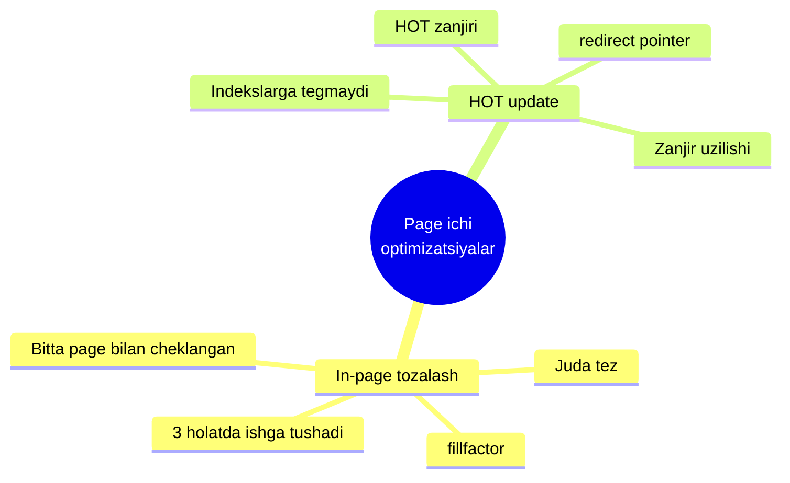
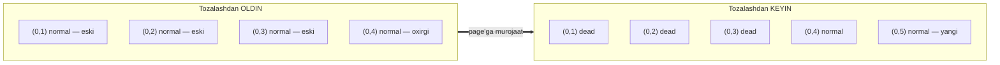
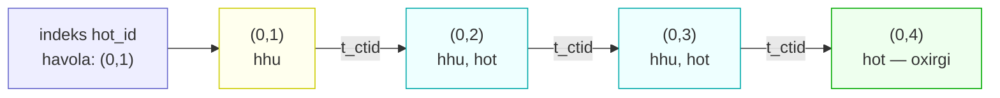
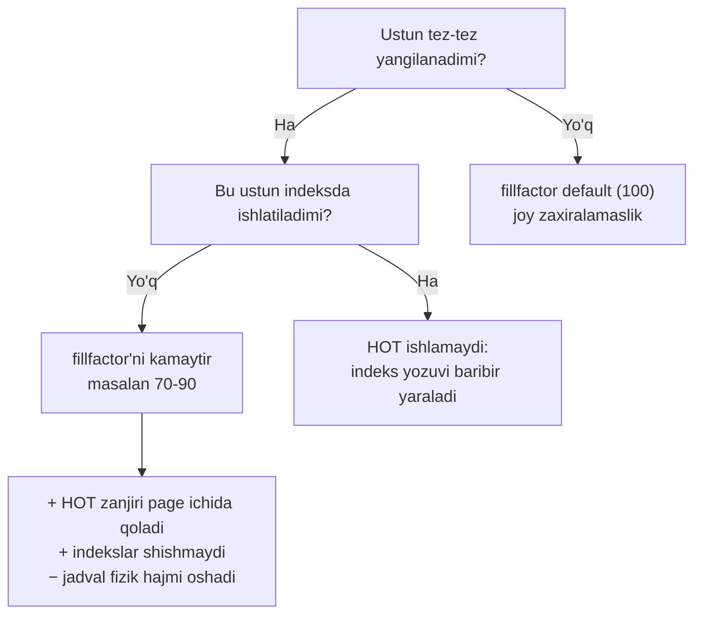

# 5. Page ichi tozalash va HOT updatelar

> 📖 Manba: Рогов, "PostgreSQL 17 изнутри", 5-bob

## Nima uchun kerak?

Oldingi darslarda ko'rdikki, MVCC tufayli har bir `UPDATE` yoki `DELETE` **eski row versiyasini o'chirmaydi**, balki uni "aktual emas" deb belgilaydi va yangi versiya yaratadi. Ufq (horizon) tushunchasi esa shuni ko'rsatdiki, database ufqidan **beriroqda** joylashgan aktual bo'lmagan versiyalarni xavfsiz o'chirib tashlash mumkin.

Bu yerda ikkita amaliy muammo tug'iladi:

1. **Aktual bo'lmagan versiyalar page'da joy egallaydi.** To'liq VACUUM (keyingi darslarda) — og'ir, butun jadvalni aylanib chiquvchi jarayon. Bir page'ni har safar shu og'ir jarayon bilan tozalash isrofgarchilik. Kerak — **tez, arzon, bitta page bilan cheklangan** tozalash.
2. **Har bir yangi versiya barcha indekslarga havola talab qiladi.** Bir jadvalda 5 ta indeks bo'lsa, har bir `UPDATE` 5 ta indeksda ham yangi yozuv yaratadi — hatto o'zgargan ustun ularning hech biriga kirmasa ham. Bu esa indekslarni shishiradi (bloat).

Bu darsda shu ikki muammoning yechimini ko'ramiz:

- **In-page tozalash (внутристраничная очистка)** — bitta page ichida tez tozalash;
- **HOT (Heap-Only Tuple) update** — indekslarga tegmasdan qilinadigan yangilash.



> **Eslatma:** darsdagi eksperimentlar `pageinspect` extension va oldingi darslardagi `heap_page` / `index_page` funksiyalarini kengaytirilgan ko'rinishda ishlatadi. Kod bo'laklarini ketma-ket bajarsangiz, xuddi kitobdagidek natijani o'zingiz ko'rasiz.

---

## 5.1. In-page tozalash (внутристраничная очистка)

Table page'iga murojaat qilinganda — ham `UPDATE` da, ham oddiy o'qishda (`SELECT`!) — tez **in-page tozalash** amalga oshishi mumkin. Bu uch holatning **biri** yuz berganda ishga tushadi:

1. Ilgari bajarilgan `UPDATE` shu page'da yangi versiyani joylashtirishga **yetarli joy topmagan** bo'lsa. Bunday holat page header'ida eslab qolinadi.
2. Table page **90% dan** ko'proq to'lgan bo'lsa.
3. Table page **`fillfactor`** parametri qiymatidan ko'proq to'lgan bo'lsa.

> **`fillfactor` nima?** PostgreSQL yangi row'ni `INSERT` bilan page'ga faqat u `fillfactor` foizdan **kam** to'lgan bo'lsagina joylashtiradi. Qolgan joy `UPDATE` natijasida paydo bo'ladigan yangi versiyalar uchun **zaxira** qilib qo'yiladi. Default qiymatda (`fillfactor = 100`) joy zaxiralanmaydi.

In-page tozalash page'dan **hech bir snapshotda ko'rinmaydigan** (ya'ni database ufqidan tashqaridagi) row versiyalarini olib tashlaydi. U hech qachon bitta table page'dan **chiqmaydi**, buning evaziga esa juda tez ishlaydi. Muhim nozikliklar:

- Tozalangan versiyalarga **pointer'lar bo'shatilmaydi**, chunki ularga indeks page'idan havolalar borishi mumkin (indeks — bu boshqa page). Bunday pointer'lar statusi `normal` dan `dead` ga o'zgaradi.
- Shu sababdan visibility map va free space map ham yangilanmaydi (bo'shagan joy `INSERT`lar uchun emas, `UPDATE`lar uchun ishlatiladi).

> **Muhim kuzatuv:** page o'qish paytida tozalanishi mumkinligi shuni anglatadiki, hatto `SELECT` operatori ham page'ni o'zgartirishi (dirty qilishi) mumkin. Bu — hint bit'larni kechiktirilgan o'rnatishdan tashqari, o'qish paytidagi ikkinchi bunday holat.

### Eksperiment: in-page tozalash

Ikkita ustunli va ularning **har biri bo'yicha indeks**li jadval yaratamiz. `fillfactor` ni 75% ga o'rnatamiz:

```sql
=> CREATE TABLE hot(id integer, s char(2000)) WITH (fillfactor = 75);
=> CREATE INDEX hot_id ON hot(id);
=> CREATE INDEX hot_s ON hot(s);
```

`s` ustunida faqat lotin harflarini saqlasak, har bir row versiyasi qat'iy **2004 bayt** (24 baytlik header'siz) egallaydi. `fillfactor = 75%` bo'lgani uchun page'da to'rtta versiyaga joy yetadi, ammo faqat **uchtasini** joylashtirib bo'ladi (to'rtinchisi 75% chegarasidan oshiradi).

Bitta row qo'shib, uni bir necha marta o'zgartiramiz:

```sql
=> INSERT INTO hot VALUES (1, 'A');
=> UPDATE hot SET s = 'B';
=> UPDATE hot SET s = 'C';
=> UPDATE hot SET s = 'D';
```

Page'da hozir **to'rtta** versiya bor:

```sql
=> SELECT * FROM heap_page('hot',0);

 ctid  | state  | xmin  | xmax
-------+--------+-------+-------
 (0,1) | normal | 806 c | 807 c
 (0,2) | normal | 807 c | 808 c
 (0,3) | normal | 808 c | 809
 (0,4) | normal | 809   | 0 a
(4 rows)
```

`fillfactor` chegarasini oshirib yubordik. Buni `pagesize` va `upper` orasidagi farq ko'rsatadi — u 8192 baytning 75% ini (6144 bayt) oshib ketgan:

```sql
=> SELECT upper, pagesize FROM page_header(get_raw_page('hot',0));

 upper | pagesize
-------+----------
    64 |     8192
(1 row)
```

Endi page'ga **navbatdagi murojaat** in-page tozalashni ishga tushiradi. Barcha aktual bo'lmagan versiyalar tozalanadi, so'ng bo'shagan joyga yangi versiya (0,5) qo'shiladi:

```sql
=> UPDATE hot SET s = 'E';
=> SELECT * FROM heap_page('hot',0);

 ctid  | state  | xmin  | xmax
-------+--------+-------+-------
 (0,1) | dead   |       |
 (0,2) | dead   |       |
 (0,3) | dead   |       |
 (0,4) | normal | 809 c | 810
 (0,5) | normal | 810   | 0 a
(5 rows)
```

Tozalashdan keyin qolgan versiyalar fizik jihatdan page'ning **katta adreslari** tomon siljitiladi, shunda barcha bo'sh joy bitta uzluksiz bo'lak sifatida ifodalanadi. Pointer'lar ham mos ravishda o'zgaradi — natijada bo'sh joy fragmentatsiyasi muammosi umuman tug'ilmaydi.



E'tibor bering: (0,1), (0,2), (0,3) pointer'lari **bo'shatilmadi**, faqat `dead` statusiga o'tdi — chunki ularga indekslardan havola borishi mumkin.

### Indeksdagi "o'lik" pointer'lar

`hot_s` indeksining birinchi page'iga qaraymiz (nolinchi page metama'lumot bilan band). Indeks hali **beshta** havolani saqlaydi:

```sql
=> SELECT * FROM index_page('hot_s',1);

 itemoffset | htid
------------+-------
          1 | (0,1)
          2 | (0,2)
          3 | (0,3)
          4 | (0,4)
          5 | (0,5)
(5 rows)
```

Indeks orqali murojaat qilganda, server (0,1), (0,2) yoki (0,3) ni row identifikatori sifatida olishi mumkin. U mos versiyani table page'idan o'qishga urinadi, ammo pointer statusi `dead` ekanini aniqlaydi — versiya endi mavjud emas, e'tiborsiz qoldirilishi kerak. Shu bilan birga u indeks page'idagi pointer statusini ham o'zgartiradi, keyingi safar jadvalga qayta murojaat qilmaslik uchun.

`index_page` funksiyasini `dead` belgisini ko'rsatadigan qilib kengaytiramiz:

```sql
=> DROP FUNCTION index_page(text, integer);
=> CREATE FUNCTION index_page(relname text, pageno integer)
   RETURNS TABLE(itemoffset smallint, htid tid, dead boolean)
   AS $$
   SELECT itemoffset,
          htid,
          dead -- v.13 dan boshlab
   FROM bt_page_items(relname, pageno);
   $$ LANGUAGE sql;
```

Hozircha `hot_id` indeksidagi barcha pointer'lar faol (`dead = f`):

```sql
=> SELECT * FROM index_page('hot_id',1);

 itemoffset | htid  | dead
------------+-------+------
          1 | (0,1) | f
          2 | (0,2) | f
          3 | (0,3) | f
          4 | (0,4) | f
          5 | (0,5) | f
(5 rows)
```

Endi indeks orqali jadvalga **birinchi murojaat** qilishimiz bilan pointer statuslari o'zgaradi:

```sql
=> EXPLAIN (analyze, costs off, timing off, summary off)
   SELECT * FROM hot WHERE id = 1;

                    QUERY PLAN
--------------------------------------------------
 Index Scan using hot_id on hot (actual rows=1 loops=1)
   Index Cond: (id = 1)
(2 rows)

=> SELECT * FROM index_page('hot_id',1);

 itemoffset | htid  | dead
------------+-------+------
          1 | (0,1) | t
          2 | (0,2) | t
          3 | (0,3) | t
          4 | (0,4) | t
          5 | (0,5) | f
(5 rows)
```

Qiziq holat: to'rtinchi pointer (0,4) ko'rsatgan table row hali **tozalanmagan** va `normal` statusiga ega, ammo u allaqachon database ufqidan chiqib ketgan. Shuning uchun indeksda to'rtinchi pointer ham `dead` deb belgilangan.

---

## 5.2. HOT (Heap-Only Tuple) updatelar

Indeksda har bir row'ning **barcha** versiyalariga havola saqlash samarasiz. Buning ikki sababi bor:

1. Row har qanday o'zgarganda, jadval uchun yaratilgan **barcha indekslarni** yangilashga to'g'ri keladi: yangi versiya paydo bo'ldi — demak, unga har bir indeksdan havola kerak, hatto o'sha indeksga kiruvchi maydonlar o'zgarmagan bo'lsa ham.
2. Indekslarda row'larning **tarixiy** versiyalariga havolalar to'planib boradi, keyin ularni versiyalarning o'zi bilan birga tozalashga to'g'ri keladi.

Tabiiyki, jadvalda qancha ko'p indeks bo'lsa, muammo shunchalik kattaroq.

Ammo agar o'zgarish natijasida **hech bir indeksda** ustunlar qiymati o'zgarmagan bo'lsa, indekslarda o'sha qiymatlarni takrorlaydigan qo'shimcha yozuv yaratishning ma'nosi yo'q.

Aynan shu ortiqcha indeks yozuvlariga qarshi **HOT-update (Heap-Only Tuple update)** optimizatsiyasi kurashadi. Bunday yangilash **uch holatda** mumkin:

- jadvalda birorta ham indeks yaratilmagan (bu holda har qanday yangilash HOT-update bo'ladi);
- jadvalda indekslar bor, lekin yangilanayotgan ustunlar ularning **birortasida** ham ishlatilmaydi;
- yangilanayotgan ustunlar indeksda ishlatiladi, lekin ularning qiymatlari **o'zgarmadi**.

> "Indeksda ishlatilish" deganda ustun bo'yicha yoki ustunni o'z ichiga olgan ifoda bo'yicha indeks (to'liq yoki qisman) mavjudligi, shuningdek `include`-indeksda nokalit (non-key) ustun sifatida ishtiroki — ya'ni `CREATE INDEX` buyrug'ida ustunga har qanday mumkin bo'lgan havola tushuniladi. **Istisno:** BRIN indekslar — ularda table row'larga havola yo'q, shuning uchun ular HOT-update'larga umuman xalaqit bermaydi.

### HOT zanjiri qanday ishlaydi

HOT-update'da indeks page'ida faqat **bitta** yozuv bo'ladi — u row'ning eng **birinchi** versiyasi identifikatorini saqlaydi. Xuddi shu row'ning barcha qolgan versiyalari table page ichida versiyalar header'idagi **`ctid` pointer'lari orqali zanjirga bog'lanadi**.

Ikki maxsus bit versiyalarni belgilaydi:

- **Heap-Only Tuple (`hot`)** biti — bu versiyaga indekslardan havola **yo'q** ("faqat table versiyasi");
- **Heap Hot Updated (`hhu`)** biti — bu versiya zanjirga kiradi va undan **keyin davom etish** kerak.

Indeksni skanerlaganda, agar server table page'ga tushib, `Heap Hot Updated` bayrog'i o'rnatilgan versiyani ko'rsa, u **to'xtamaslik** kerakligini tushunadi va butun yangilash zanjiri bo'ylab yuradi. Albatta, mijozga natija berishdan oldin bunday o'qilgan barcha versiyalar uchun visibility tekshiriladi.

### Eksperiment: HOT zanjiri

HOT-update'ni ko'rish uchun bitta indeksni o'chiramiz va jadvalni tozalaymiz:

```sql
=> DROP INDEX hot_s;
=> TRUNCATE TABLE hot;
```

Qulaylik uchun `heap_page` funksiyasini uch maydon bilan kengaytiramiz — `ctid` (t_ctid, keyingi versiyaga havola) va HOT'ga tegishli ikki bit (`hhu`, `hot`):

```sql
=> DROP FUNCTION heap_page(text, integer);
=> CREATE FUNCTION heap_page(relname text, pageno integer)
   RETURNS TABLE(
     ctid tid, state text, xmin text, xmax text,
     hhu text, hot text, t_ctid tid
   ) AS $$
   SELECT (pageno,lp)::text::tid AS ctid,
     CASE lp_flags
       WHEN 0 THEN 'unused'
       WHEN 1 THEN 'normal'
       WHEN 2 THEN 'redirect to '||lp_off
       WHEN 3 THEN 'dead'
     END AS state,
     t_xmin || CASE
       WHEN (t_infomask & 256) > 0 THEN ' c'
       WHEN (t_infomask & 512) > 0 THEN ' a'
       ELSE ''
     END AS xmin,
     t_xmax || CASE
       WHEN (t_infomask & 1024) > 0 THEN ' c'
       WHEN (t_infomask & 2048) > 0 THEN ' a'
       ELSE ''
     END AS xmax,
     CASE WHEN (t_infomask2 & 16384) > 0 THEN 't' END AS hhu,
     CASE WHEN (t_infomask2 & 32768) > 0 THEN 't' END AS hot,
     t_ctid
   FROM heap_page_items(get_raw_page(relname,pageno))
   ORDER BY lp;
   $$ LANGUAGE sql;
```

Row qo'shib, uni bir marta o'zgartiramiz:

```sql
=> INSERT INTO hot VALUES (1, 'A');
=> UPDATE hot SET s = 'B';
```

Page'da HOT o'zgarishlar **zanjiri** paydo bo'ldi:

- `hhu` bayrog'i — `ctid` zanjiri bo'ylab davom etish kerakligini bildiradi;
- `hot` bayrog'i — bu versiyaga indekslardan havola yo'qligini ko'rsatadi.

```sql
=> SELECT * FROM heap_page('hot',0);

 ctid  | state  | xmin  | xmax  | hhu | hot | t_ctid
-------+--------+-------+-------+-----+-----+--------
 (0,1) | normal | 817 c | 818   | t   |     | (0,2)
 (0,2) | normal | 818   | 0 a   |     | t   | (0,2)
(2 rows)
```

Keyingi o'zgarishlarda zanjir o'sadi — lekin faqat **page chegarasida**:

```sql
=> UPDATE hot SET s = 'C';
=> UPDATE hot SET s = 'D';
=> SELECT * FROM heap_page('hot',0);

 ctid  | state  | xmin  | xmax  | hhu | hot | t_ctid
-------+--------+-------+-------+-----+-----+--------
 (0,1) | normal | 817 c | 818 c | t   |     | (0,2)
 (0,2) | normal | 818 c | 819 c | t   | t   | (0,3)
 (0,3) | normal | 819 c | 820   | t   | t   | (0,4)
 (0,4) | normal | 820   | 0 a   |     | t   | (0,4)
(4 rows)
```

Zanjir strukturasi quyidagicha: indeks faqat "bosh"ga (0,1) havola qiladi, keyin `t_ctid` bo'ylab boriladi:



Indeksda esa zanjirning "boshi"ga bitta yagona havola bor:

```sql
=> SELECT * FROM index_page('hot_id',1);

 itemoffset | htid  | dead
------------+-------+------
          1 | (0,1) | f
(1 row)
```

HOT-update'lar zanjiri page chegarasidan chiqmagani uchun, butun zanjirni aylanib chiqish **hech qachon** boshqa page'larga murojaatni talab qilmaydi va unumdorlikni pasaytirmaydi.

Yangilash turi jadvaldan foydalanish statistikasida kuzatiladi. Bu holda yettita `UPDATE` dan uchtasi HOT-update bo'lgan:

```sql
=> SELECT n_tup_upd, n_tup_hot_upd
   FROM pg_stat_all_tables
   WHERE relid = 'hot'::regclass;

 n_tup_upd | n_tup_hot_upd
-----------+---------------
         7 |             3
(1 row)
```

---

## 5.3. HOT-update'da in-page tozalash (redirect)

In-page tozalashning alohida, ammo muhim holati — bu HOT-update'lar paytidagi tozalash.

Boshlangan misolda `fillfactor` chegarasi allaqachon oshib ketgan, shuning uchun navbatdagi yangilash in-page tozalashni keltirib chiqarishi kerak. Ammo endi page'da yangilanishlar **zanjiri** bor. Zanjirning "**boshi**" har doim o'z joyida qolishi kerak, chunki unga indeks havola qiladi. Qolgan pointer'lar esa bo'shatilishi mumkin — ularga chetdan havola aniq yo'q.

"Bosh"ga tegmaslik uchun **ikki bosqichli adreslash** (double addressing) qo'llaniladi: indeks havola qiladigan pointer — bu holda (0,1) — `redirect` statusini oladi va shu paytda zanjir boshlanadigan versiyaga yo'naltiradi:

```sql
=> UPDATE hot SET s = 'E';
=> SELECT * FROM heap_page('hot',0);

 ctid  |    state     | xmin  | xmax | hhu | hot | t_ctid
-------+--------------+-------+------+-----+-----+--------
 (0,1) | redirect to 4|       |      |     |     |
 (0,2) | normal       | 821   | 0 a  |     | t   | (0,2)
 (0,3) | unused       |       |      |     |     |
 (0,4) | normal       | 820 c | 821  | t   | t   | (0,2)
(4 rows)
```

Bu yerda (0,1), (0,2) va (0,3) versiyalari tozalandi. "Bosh" pointer (0,1) **o'z joyida qoldi** — endi u faqat yo'naltiruvchi (`redirect`) vazifasini bajaradi. (0,2) va (0,3) pointer'lari esa **bo'shatildi** (`unused` statusini oldi), chunki bu versiyalarga indekslardan havola aniq yo'q edi. Yangi versiya bo'shagan (0,2) o'rniga yozildi.


Indeks hamon (0,1) ga qaraydi, (0,1) esa `redirect` orqali zanjirning joriy boshiga (0,4) yuboradi. Bu — HOT'ning nafisligi: **indeksni umuman qo'zg'atmasdan** zanjirni tozalab, "boshi"ni siljitib turish mumkin.

Yana bir necha marta yangilaymiz — zanjir yana o'sadi:

```sql
=> UPDATE hot SET s = 'F';
=> UPDATE hot SET s = 'G';
=> SELECT * FROM heap_page('hot',0);

 ctid  |    state     | xmin  | xmax  | hhu | hot | t_ctid
-------+--------------+-------+-------+-----+-----+--------
 (0,1) | redirect to 4|       |       |     |     |
 (0,2) | normal       | 821 c | 822 c | t   | t   | (0,3)
 (0,3) | normal       | 822 c | 823   | t   | t   | (0,5)
 (0,4) | normal       | 820 c | 821 c | t   | t   | (0,2)
 (0,5) | normal       | 823   | 0 a   |     | t   | (0,5)
(5 rows)
```

Navbatdagi yangilash yana in-page tozalashni ishga tushiradi, "bosh" pointer esa yana mos ravishda siljitiladi:

```sql
=> UPDATE hot SET s = 'H';
=> SELECT * FROM heap_page('hot',0);

 ctid  |    state     | xmin  | xmax | hhu | hot | t_ctid
-------+--------------+-------+------+-----+-----+--------
 (0,1) | redirect to 5|       |      |     |     |
 (0,2) | normal       | 824   | 0 a  |     | t   | (0,2)
 (0,3) | unused       |       |      |     |     |
 (0,4) | unused       |       |      |     |     |
 (0,5) | normal       | 823 c | 824  | t   | t   | (0,2)
(5 rows)
```

Yana versiyalarning bir qismi tozalandi, `redirect` pointer endi (0,5) ga yo'naltiradi. Indeks bu jarayonlardan **butunlay bexabar** — u hamon faqat (0,1) ga havola qiladi.

---

## 5.4. HOT-zanjirining uzilishi (разрыв цепочки)

Agar page'da yangi versiyani joylashtirishga bo'sh joy **yetmasa**, zanjir **uziladi**. Boshqa page'ga joylashtirilgan versiyaga indeksdan **alohida havola** yaratishga to'g'ri keladi.

Bunday holatni sun'iy yaratish uchun parallel transaction boshlaymiz va unda snapshot qurib, u versiyalarni tozalashga **yo'l qo'ymaydi** (ufqni ushlab turadi):

```sql
=> -- boshqa seansda:
=> BEGIN ISOLATION LEVEL REPEATABLE READ;
=> SELECT 1;
```

Endi birinchi seansda yangilashlarni bajaramiz:

```sql
=> UPDATE hot SET s = 'I';
=> UPDATE hot SET s = 'J';
=> UPDATE hot SET s = 'K';
=> SELECT * FROM heap_page('hot',0);

 ctid  |    state     | xmin  | xmax  | hhu | hot | t_ctid
-------+--------------+-------+-------+-----+-----+--------
 (0,1) | redirect to 2|       |       |     |     |
 (0,2) | normal       | 824 c | 825 c | t   | t   | (0,3)
 (0,3) | normal       | 825 c | 826 c | t   | t   | (0,4)
 (0,4) | normal       | 826 c | 827   | t   | t   | (0,5)
 (0,5) | normal       | 827   | 0 a   |     | t   | (0,5)
(5 rows)
```

Navbatdagi yangilashda page'da joy allaqachon yetmaydi, in-page tozalash esa **hech narsani bo'shata olmaydi** (parallel snapshot ufqni ushlab turibdi):

```sql
=> UPDATE hot SET s = 'L';
=> -- boshqa seansda snapshot endi kerak emas:
=> COMMIT;
```

Natijani ko'ramiz:

```sql
=> SELECT * FROM heap_page('hot',0);

 ctid  |    state     | xmin  | xmax  | hhu | hot | t_ctid
-------+--------------+-------+-------+-----+-----+--------
 (0,1) | redirect to 2|       |       |     |     |
 (0,2) | normal       | 824 c | 825 c | t   | t   | (0,3)
 (0,3) | normal       | 825 c | 826 c | t   | t   | (0,4)
 (0,4) | normal       | 826 c | 827 c | t   | t   | (0,5)
 (0,5) | normal       | 827 c | 828   |     | t   | (1,1)
(5 rows)
```

(0,5) versiyasida endi (1,1) ga havola bor — u **1-page'ga** yo'naltiradi:

```sql
=> SELECT * FROM heap_page('hot',1);

 ctid  | state  | xmin | xmax | hhu | hot | t_ctid
-------+--------+------+------+-----+-----+--------
 (1,1) | normal | 828  | 0 a  |     |     | (1,1)
(1 row)
```

E'tibor bering: bu havola **ishlatilmaydi**, chunki (0,5) versiyasida `Heap Hot Updated` biti o'rnatilmagan (zanjir uzilgan). (1,1) versiyasiga esa endi **indeksdan** kirish mumkin — unda hozir **ikkita** havola bor, har biri o'z HOT-zanjirining boshiga yo'naltiradi:

```sql
=> SELECT * FROM index_page('hot_id',1);

 itemoffset | htid  | dead
------------+-------+------
          1 | (0,1) | f
          2 | (1,1) | f
(2 rows)
```

HOT-zanjirlarining uzilishi statistikada **alohida** kuzatiladi (v.16 dan):

```sql
=> SELECT n_tup_upd, n_tup_hot_upd, n_tup_newpage_upd
   FROM pg_stat_all_tables
   WHERE relid = 'hot'::regclass;

 n_tup_upd | n_tup_hot_upd | n_tup_newpage_upd
-----------+---------------+-------------------
        15 |            10 |                 1
(1 row)
```

Bu yerda o'n beshta `UPDATE` amalidan o'n bittasi HOT-update bo'lgan: o'ntasiga page'da joy yetgan (`n_tup_hot_upd`), bittasiga esa yetmagan (`n_tup_newpage_upd`), bu esa zanjir uzilishiga olib kelgan.

---

## 5.5. fillfactor bilan sozlash

Indekslarga **kirmaydigan** ustunlar tez-tez yangilanadigan bo'lsa, `fillfactor` parametrini kamaytirish mantiqan to'g'ri bo'ladi — bu page'da yangilashlar uchun ma'lum joyni zaxira qilib qo'yadi. Bu esa in-page tozalash + HOT mexanizmiga zanjirni page ichida uzoqroq ushlab turishga imkon beradi.

Ammo teskari tomonini ham hisobga olish kerak: `fillfactor` qancha past bo'lsa, page'da band bo'lmagan joy shuncha ko'p qoladi va jadvalning **fizik hajmi oshadi**.



### In-page tozalash indekslar uchun ham bor (5.5)

In-page tozalash bitta **table** page bilan ishlaydi va indekslarga tegmaydi, dedik. Ammo indekslarning **o'zi uchun** ham in-page tozalash bor — u ham bitta (endi indeks) page bilan ishlaydi.

Bunday tozalash B-tree'ga row qo'shishda indeks page'ida joy yetmay, uni **bo'lish (split)** kerak bo'lganda ishga tushadi. Muammo shundaki, row'lar o'chirilganda ikki indeks page qaytadan bittaga "yopishmaydi" — bu indeks shishishiga (bloat) olib keladi va bir marta o'sgan hajm ma'lumotning katta qismi o'chirilsa ham kamaymasligi mumkin. Agar in-page tozalash row'larning bir qismini olib tashlashga ulgursa, split lahzasini kechiktirish mumkin.

Indeksdan in-page tozalash bilan olib tashlanishi mumkin bo'lgan ikki xil row bor:

- avvalambor, ilgari `dead` deb belgilangan row'lar (bunday belgi indeks orqali murojaatda, hech bir snapshotda ko'rinmaydigan yoki mavjud bo'lmagan versiyaga havola qilinsa qo'yiladi);
- agar aniq `dead` row topilmasa (v.14 dan), bitta va o'sha table row'ning turli versiyalariga havola qiluvchi "istiqbolli" row'lar tekshiriladi — bu tekshiruv table page'ga murojaatni talab qiladi, ammo ortiqcha indeks page split'iga yo'l qo'ymaslik uchun uning narxini to'lash foydaliroq.

---

## Xulosa

Bu darsda MVCC "chiqindilari" bilan **arzon va tez** kurashishning ikki mexanizmini o'rgandik:

- **In-page tozalash** — bitta table page bilan cheklangan tez tozalash. Uch holatda ishga tushadi: oldingi `UPDATE` joy topmaganda, page 90% dan yoki `fillfactor` dan ortiq to'lganda. Hatto `SELECT` ham uni ishga tushirib, page'ni o'zgartirishi mumkin.
- Tozalash database **ufqidan tashqaridagi** versiyalarni olib tashlaydi, qolganini page ichida siljitadi (fragmentatsiya yo'q). Pointer'lar bo'shatilmaydi (indeks havolalari uchun), balki `dead` statusiga o'tadi.
- **`fillfactor`** — page'ning necha foizigacha `INSERT` bilan to'ldirilishi. Qolgan joy `UPDATE` versiyalari uchun zaxira. Default = 100 (zaxira yo'q).
- **HOT (Heap-Only Tuple) update** — yangilanayotgan ustun hech bir indeksda ishlatilmasa (yoki qiymati o'zgarmasa yoki indeks umuman yo'q bo'lsa), indekslarga tegmasdan yangilash. BRIN indekslar HOT'ga xalaqit bermaydi.
- **HOT zanjiri** — indeks faqat "bosh"ga havola qiladi; qolgan versiyalar `t_ctid` orqali page ichida bog'lanadi. `hhu` biti — zanjirda davom et; `hot` biti — indeksdan havola yo'q.
- **`redirect` pointer** — in-page tozalashda "bosh" o'z joyida qoladi (indeks unga qaraydi), ammo zanjirning joriy boshiga yo'naltiradi. Shu bilan indeks butunlay qo'zg'atilmaydi.
- **Zanjir uzilishi** — page'da joy yetmasa, yangi versiya boshqa page'ga tushadi va indeksda unga alohida havola paydo bo'ladi (`n_tup_newpage_upd`).
- **Sozlash:** indekslarga kirmaydigan ustunlar tez-tez yangilanadigan bo'lsa, `fillfactor` ni kamaytirib HOT'ga joy zaxiralang — evaziga jadval fizik hajmi oshadi.

---

## Nazorat savollari

1. In-page tozalash qaysi uch holatda ishga tushadi? U qaysi row versiyalarini olib tashlaydi va nima uchun bitta page'dan chiqmaydi?
2. Nima uchun in-page tozalash paytida bo'shatilgan versiyalarga tegishli pointer'lar darhol `unused` qilib bo'shatilmaydi, balki `dead` statusiga o'tadi?
3. `fillfactor` parametri nima vazifani bajaradi? Uni pasaytirishning foydasi va zarari nimada?
4. HOT-update qaysi uchta holatda mumkin? Nima uchun BRIN indeks HOT-update'ga xalaqit bermaydi?
5. HOT zanjirida `Heap Hot Updated` (`hhu`) va `Heap-Only Tuple` (`hot`) bitlari nimani anglatadi? Indeks skaneri `hhu` bitli versiyaga tushganda nima qiladi?
6. `redirect` statusidagi pointer nima uchun kerak? U in-page tozalash paytida indeksni qo'zg'atmaslikni qanday ta'minlaydi?
7. HOT zanjiri qaysi holatda uziladi? Uzilgandan keyin indeksda nechta havola paydo bo'ladi va statistikada bu qaysi ustunda ko'rinadi (`n_tup_hot_upd` yoki `n_tup_newpage_upd`)?
8. `s char(2000)` va `fillfactor = 75` bilan yaratilgan jadvalda nima uchun page'ga to'rt emas, faqat uchta versiya sig'adi? Qanday hisoblab topish mumkin?
