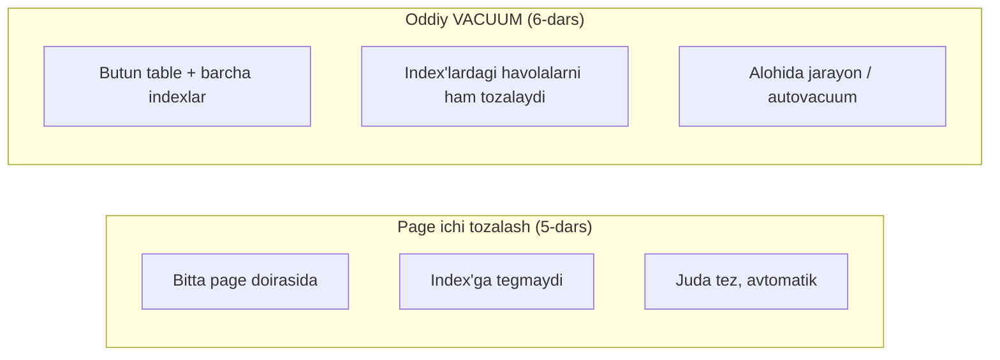
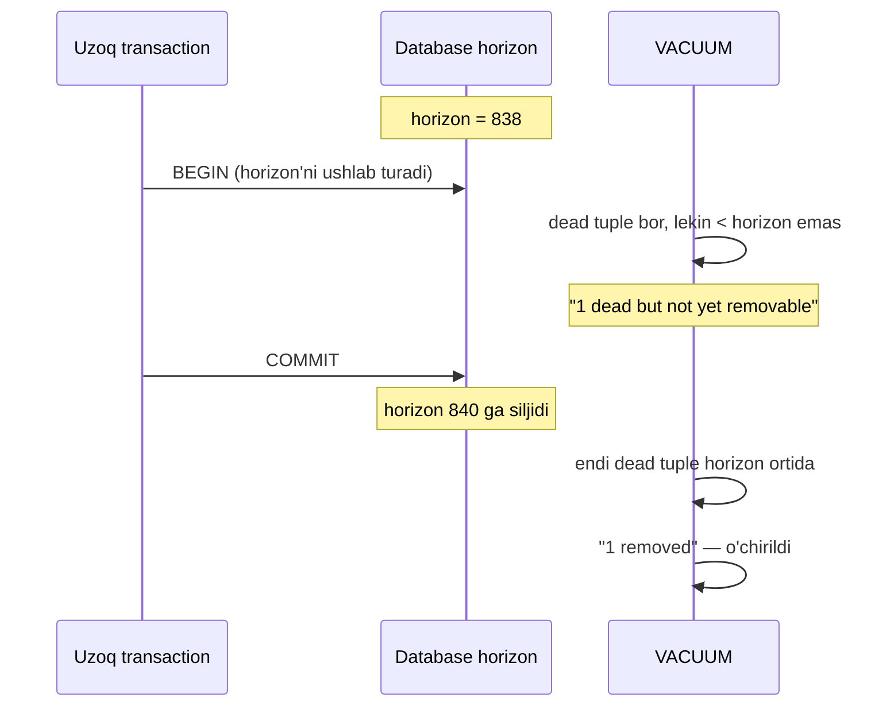
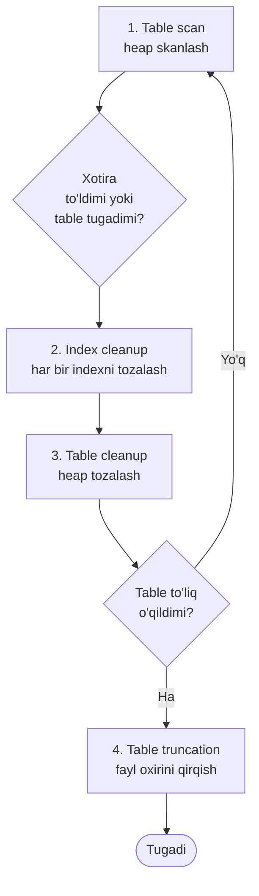
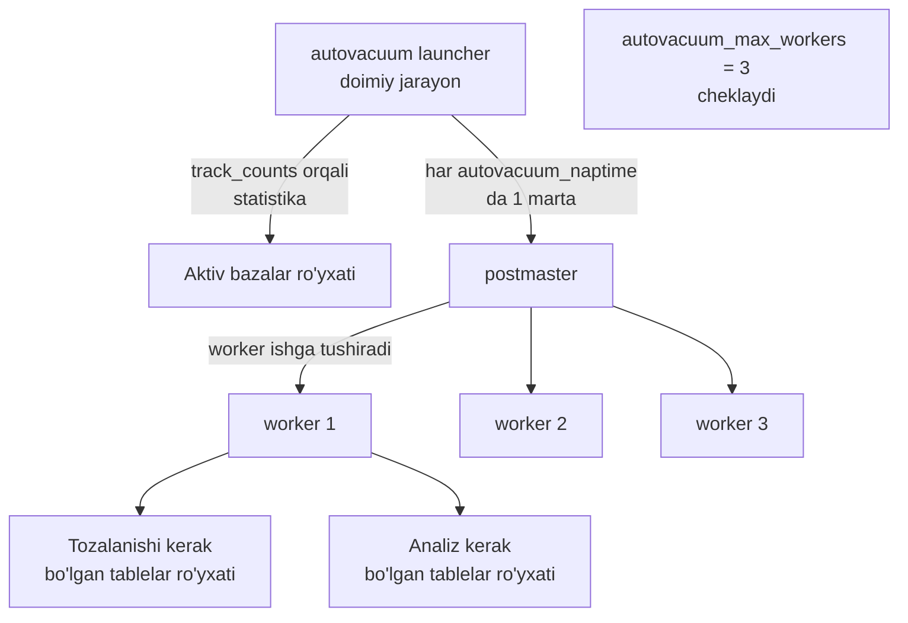

# 6. VACUUM va autovacuum

> 📖 Manba: Рогов, "PostgreSQL 17 изнутри", 6-bob ("Очистка и автоочистка")

## Nima uchun kerak?

Oldingi darslarda MVCC bilan tanishdik: PostgreSQL bir row'ni o'zgartirganda uni **joyida yangilamaydi**, balki row'ning yangi **versiyasini** (tuple'ni) yaratadi. Eski versiya darhal yo'q qilinmaydi — u boshqa transaction'larning snapshot'lari uchun hali ham kerak bo'lishi mumkin.

Natijada har bir `UPDATE` va `DELETE` orqasida **o'lik (dead) tuple'lar** qoladi — endi hech qaysi snapshot'da ko'rinmaydigan, lekin fizik jihatdan disk'da yotgan versiyalar. Agar ularni hech kim tozalamasa:

- Table va index fayllari cheksiz o'sib boradi (bu holat **bloat** deb ataladi — 8-darsning mavzusi).
- Sequential scan sekinlashadi — foydasiz o'lik versiyalarni ham o'qishga to'g'ri keladi.
- Buffer cache foydasiz ma'lumot bilan to'lib qoladi.
- Eng xavflisi — transaction ID **wraparound** yaqinlashadi (7-dars).

Mana shu muammoni **VACUUM** hal qiladi. Vacuum — bu «farrosh» bo'lib, o'lik tuple'larni yig'ib-tozalab, bo'shagan joyni yangi versiyalar uchun qayta ishlatishga tayyorlaydi.

> **Muhim nozik nuqta:** Vacuum joyni **table ichida** bo'shatadi (yangi row'lar shu joyga yoziladi), lekin faylni operatsion tizimga **qaytarmaydi** (fayl kichraymaydi). Faylni kichraytirish uchun `VACUUM FULL` yoki qayta qurish kerak — buni 8-darsda ko'ramiz.

### Ikki xil tozalash

5-darsda **page ichidagi tozalash** (in-page vacuum, HOT bilan bog'liq) bilan tanishgan edik. Uni hozirgi «to'liq» vacuum bilan chalkashtirmaslik kerak:



| | Page ichi tozalash | Oddiy VACUUM |
|---|---|---|
| Qamrovi | Bitta page | Butun table + hamma indexlar |
| Index | Tegmaydi | Havolalarni tozalaydi |
| Ishga tushishi | Page'ga murojaatda avtomatik | `VACUUM` yoki autovacuum |
| Natija | Pointer `dead` bo'ladi | Pointer `unused` (bo'sh) bo'ladi |

---

## VACUUM amalda: birinchi eksperiment

Kitobdagi eksperimentni takrorlaymiz. Table va index yaratamiz, autovacuum'ni **maxsus o'chirib qo'yamiz** (faqat tozalash momentini qo'lda boshqarish uchun):

```sql
=> CREATE TABLE vac(
     id integer,
     s char(100)
   ) WITH (autovacuum_enabled = off);
=> CREATE INDEX vac_s ON vac(s);
```

Bitta row qo'shib, ikki marta yangilaymiz:

```sql
=> INSERT INTO vac(id,s) VALUES (1,'A');
=> UPDATE vac SET s = 'B';
=> UPDATE vac SET s = 'C';
```

Endi table'da row'ning **uchta versiyasi** bor:

```sql
=> SELECT * FROM heap_page('vac',0);
 ctid  | state  | xmin  | xmax  | hhu | hot | t_ctid
-------+--------+-------+-------+-----+-----+--------
 (0,1) | normal | 831 c | 832 c |     |     | (0,2)
 (0,2) | normal | 832 c | 833   |     |     | (0,3)
 (0,3) | normal | 833   | 0 a   |     |     | (0,3)
(3 rows)
```

Va index'da har biriga **uchta havola** ko'rsatilgan:

```sql
=> SELECT * FROM index_page('vac_s',1);
 itemoffset | htid  | dead
------------+-------+------
          1 | (0,1) | f
          2 | (0,2) | f
          3 | (0,3) | f
(3 rows)
```

Endi tozalaymiz:

```sql
=> VACUUM vac;
```

Natija — table'da faqat **bitta**, aktual versiya qoldi:

```sql
=> SELECT * FROM heap_page('vac',0);
 ctid  | state  | xmin  | xmax | hhu | hot | t_ctid
-------+--------+-------+------+-----+-----+--------
 (0,1) | unused |       |      |     |     |
 (0,2) | unused |       |      |     |     |
 (0,3) | normal | 833 c | 0 a  |     |     | (0,3)
(3 rows)
```

Diqqat qiling: dastlabki ikki pointer `dead` emas, balki **`unused`** holatiga o'tdi (page ichi tozalashda `dead` bo'lardi). Sababi — endi ularga index'dan **hech qanday havola qolmadi**, shuning uchun ular butunlay bo'sh deb hisoblanadi va yangi versiyalar uchun ishlatilishi mumkin:

```sql
=> SELECT * FROM index_page('vac_s',1);
 itemoffset | htid  | dead
------------+-------+------
          1 | (0,3) | f
(1 row)
```

### Visibility map yangilanishi

Page endi **visibility map**'da belgilandi. `pg_visibility` extension orqali ko'ramiz:

```sql
=> CREATE EXTENSION pg_visibility;
=> SELECT all_visible FROM pg_visibility_map('vac',0);
 all_visible
-------------
 t
(1 row)
```

`all_visible = t` degani — bu page'dagi **barcha versiyalar hamma snapshot'larda ko'rinadi**. Bu belgi table page'ining header'iga ham qo'yiladi (`flags & 4`):

```sql
=> SELECT flags & 4 > 0 AS all_visible
   FROM page_header(get_raw_page('vac',0));
 all_visible
-------------
 t
(1 row)
```

> **Nega bu muhim?** Agar page visibility map'da `all_visible` bo'lsa, keyingi vacuum uni **butunlay o'tkazib yuborishi** mumkin (u yerda tozalanadigan narsa yo'q). Bundan tashqari, **Index Only Scan** ham shu belgiga tayanadi — table'ga murojaat qilmasdan javob berish mumkin bo'ladi.

---

## Yana bir bor database horizon haqida

Vacuum qaysi versiyalarni **o'lik** deb hisoblashini **database horizon** (ma'lumotlar bazasi ufqi) belgilaydi. Bu tushuncha shu qadar muhimki, unga qayta qaytaylik.

Eksperimentni qaytadan boshlaymiz, lekin bu safar horizon'ni **ushlab turadigan** transaction ochamiz. Boshqa bir seansda transaction ochib, uni yakunlamay qoldiramiz:

```sql
   => BEGIN;
   => INSERT INTO accounts(id, client, amount)
      VALUES (1, 'alice', 1000.00);
```

Endi asosiy seansda row'ni yana yangilaymiz va tozalaymiz:

```sql
=> UPDATE vac SET s = 'C';
=> VACUUM VERBOSE vac;
```

`VERBOSE` orqali vacuum nima qilganini aytib beradi. Muhim qatorlar:

```
INFO:  finished vacuuming "internals.public.vac": index scans: 0
pages: 0 removed, 1 remain, 1 scanned (100.00% of total)
tuples: 0 removed, 2 remain, 1 are dead but not yet removable
removable cutoff: 838, which was 2 XIDs old when operation ended
...
```

Buni o'qib chiqamiz:

- `tuples: 0 removed` — o'chirib bo'ladigan versiya **topilmadi**;
- `2 remain` — ikkita versiya qoldirildi;
- `1 are dead but not yet removable` — ulardan biri **o'lik, lekin hali o'chirib bo'lmaydi**;
- `removable cutoff: 838` — hozirgi tozalash ufqi ochiq transaction ufqiga to'g'ri kelyapti.

O'lik versiyani o'chirib bo'lmaydi, chunki ochiq transaction hali ham «eski» horizon'ni ushlab turibdi:

```sql
=> SELECT backend_xmin FROM pg_stat_activity
   WHERE pid = pg_backend_pid();
 backend_xmin
--------------
          838
(1 row)
```

Endi ochiq transaction'ni yakunlaymiz — horizon oldinga siljiydi:

```sql
   => COMMIT;
=> VACUUM VERBOSE vac;
```

```
tuples: 1 removed, 1 remain, 0 are dead but not yet removable
removable cutoff: 840, which was 0 XIDs old when operation ended
new relfrozenxid: 839, which is 2 XIDs ahead of previous value
index scan needed: 1 pages from table (100.00% of total) had 1 dead item identifiers removed
index "vac_s": pages: 2 in total, 0 newly deleted, 0 currently deleted, 0 reusable
```

Endi vacuum o'zgargan horizon ortida qolgan o'lik versiyani topib **o'chirdi** (`1 removed`).



> **Asosiy xulosa:** uzoq davom etadigan transaction (hatto boshqa table bilan ishlayotgan bo'lsa ham) horizon'ni ushlab turadi va **butun bazada** vacuum o'lik versiyalarni tozalay olmaydi. Bu bloat'ning eng keng tarqalgan sababi (8-darsda batafsil).

---

## VACUUM bosqichlari

Vacuum sirtdan oddiy ko'rinsa-da, aslida murakkab: u table'ni ham, index'larni ham **bir vaqtda**, boshqa jarayonlarni **bloklamay** qayta ishlashi kerak. Shuning uchun har bir table tozalash **bir necha bosqichda** bajariladi.



### 1-bosqich — Table scan (heap skanlash)

Hammasi **table skanlash**dan boshlanadi (visibility map hisobga olinadi — `all_visible` belgilangan page'lar o'tkazib yuboriladi). O'lik versiyalarning tid (tuple identifikatori) lari xotiradagi maxsus omborga yoziladi.

> **v17 yangiligi:** ilgari (PostgreSQL 17 gacha) tid'lar oddiy massiv'da saqlanardi. Endi ular **prefiks daraxti** (radix tree) ko'rinishida saqlanadi — bu bir necha barobar ixchamroq. Ombor hajmi `maintenance_work_mem` parametri bilan cheklangan (default **64MB**), lekin xotira kerak bo'lganda ajratiladi.

### 2-bosqich — Index cleanup (index tozalash)

Skanlash table oxiriga yetgach **yoki** tid'lar uchun ajratilgan xotira tugagach, **har bir index to'liq skanlanadi** va eslab qolingan o'lik versiyalarga havola qiluvchi yozuvlar tozalanadi.

- Hajmi `min_parallel_index_scan_size` (512kB) dan katta index uchun **alohida parallel worker** ishga tushishi mumkin — `VACUUM (parallel N)` orqali cheklash mumkin.
- Bitta index'ni bir nechta jarayon **birga qayta ishlay olmaydi**, shuning uchun jarayonlar soni index'lar sonidan oshmaydi.
- Agar table'ga faqat **yangi row qo'shilgan** (o'chirilmagan/o'zgartirilmagan) bo'lsa, o'lik versiyalar yo'q — bu bosqich o'tkazib yuboriladi va oxirida bir marta **index «uborka»** sifatida bajariladi (free space map va statistikani yangilash uchun).

### 3-bosqich — Table cleanup (heap tozalash)

Endi table **qayta skanlanadi**: index'lardan havolalar ketgani uchun endi eslab qolingan o'lik versiyalarni page'lardan **xavfsiz o'chirish** va pointer'larni bo'shatish mumkin.

- Bo'shagan joy **free space map**'ga yoziladi.
- Faqat aktual, hamma snapshot'da ko'rinadigan versiyalar qolgan page'lar **visibility map**'da belgilanadi.
- Agar 1-bosqichda table to'liq o'qilmagan bo'lsa (xotira tugagani uchun), tid ombori tozalanadi va hammasi **qolgan joydan** takrorlanadi. Shuning uchun VERBOSE'da `index scans: 3` kabi qiymatlar chiqishi mumkin — bu o'lik versiyalar `maintenance_work_mem`'ga sig'magani belgisi.

### 4-bosqich — Table truncation (faylni qirqish)

Tozalashdan keyin ba'zan **fayl oxirida** butunlay bo'sh page'lar hosil bo'lishi mumkin. Shu holda vacuum fayl «dumini» qirqib, joyni operatsion tizimga qaytaradi.

- Bu qisqa muddatli **exclusive lock** talab qiladi (max 5 soniya urinadi, boshqa jarayonlarni uzoq ushlab qolmaslik uchun).
- Faqat bo'sh page'lar **ko'p** bo'lganda amalga oshadi: kamida faylning **1/16 qismi**, yoki katta table'lar uchun **1000 page**.
- Kerak bo'lsa, `vacuum_truncate` va `toast.vacuum_truncate` parametrlari orqali butunlay o'chirib qo'yish mumkin.

> Bu yagona holat — table faylining **kichrayishi** oddiy vacuum orqali. Ammo bu faqat fayl oxiridagi bo'sh page'lar uchun ishlaydi; o'rtadagi bo'shliqlar faylni kichraytirmaydi.

---

## ANALYZE — statistika yig'ish

Vacuum'ga bevosita aloqador bo'lmagan yana bir vazifa bor — **analyze**, ya'ni query planner uchun **statistik ma'lumot yig'ish**. Statistikaga quyidagilar kiradi:

- `pg_class.reltuples` — table'dagi row'lar taxminiy soni;
- `pg_class.relpages` — page'lar soni;
- ustunlar bo'yicha ma'lumot taqsimoti va boshqalar.

Analyze'ni alohida bajarish mumkin:

```sql
=> ANALYZE vac;
```

Yoki vacuum bilan birga (ular ketma-ket, mustaqil bajariladi — hech qanday tejamkorlik bo'lmaydi):

```sql
=> VACUUM ANALYZE vac;
```

> **Nima uchun muhim?** Query planner qaysi rejani tanlashini aynan shu statistikaga qarab hal qiladi. Statistika eskirgan bo'lsa, planner noto'g'ri reja tanlab, so'rov keskin sekinlashishi mumkin.

---

## Autovacuum — avtomatik tozalash va analiz

Horizon uzoq ushlab turilmasa, oddiy vacuum o'z ishini bajaradi. Savol — uni **qanchalik tez-tez** chaqirish kerak?

- Juda **kam** tozalasak — table haddan ziyod o'sib ketadi, o'lik versiyalar to'planib, keyingi vacuum'ga index bo'yicha bir necha o'tish kerak bo'ladi.
- Juda **tez-tez** tozalasak — server foydali ish o'rniga doim texnik xizmatga band bo'ladi.
- Yuklama vaqt bilan o'zgarganda qat'iy jadval (masalan, «har kuni soat 3 da») ham to'g'ri kelmaydi.

Bu muammoni **autovacuum** hal qiladi: u tozalash va analiz'ni table'lar **o'zgarish tezligiga qarab** ishga tushiradi.

### Autovacuum tuzilishi



- `autovacuum` parametri yoqilganda tizimda doim **autovacuum launcher** jarayoni bor — u jadval tuzadi. Statistika `track_counts` yoqilganda yig'iladi. Bu ikki parametrni **o'chirmaslik kerak**, aks holda autovacuum ishlamaydi.
- Har `autovacuum_naptime` (default **1 daqiqa**) da launcher har bir «aktiv» baza uchun **worker** ishga tushiradi. Bir vaqtdagi worker'lar soni `autovacuum_max_workers` (default **3**) bilan cheklangan.
- Worker bazaga ulanib, ikki ro'yxat tuzadi: **tozalash kerak** bo'lgan va **analiz kerak** bo'lgan table'lar.

### Qo'lda vacuum'dan farqlar

- Qo'lda vacuum tid'lar uchun `maintenance_work_mem` ishlatadi. Autovacuum'da bir vaqtda bir necha worker ishlagani uchun har biriga alohida xotira kerak — shuning uchun `autovacuum_work_mem` parametri bor (default `-1` = `maintenance_work_mem` qiymatini oladi).
- Autovacuum bitta table index'larini **parallel qayta ishlamaydi** (bu juda ko'p jarayonga olib kelardi).

### Qaysi table'lar tozalanadi?

**1) O'lik versiyalar to'planganda.** O'lik versiyalar soni `pg_stat_all_tables.n_dead_tup`'da kuzatiladi. Formula:

```
pg_stat_all_tables.n_dead_tup >
    autovacuum_vacuum_threshold +
    autovacuum_vacuum_scale_factor × pg_class.reltuples
```

- `autovacuum_vacuum_threshold` = **50** (absolyut son);
- `autovacuum_vacuum_scale_factor` = **0.2** (table'ning ulushi).

> **Amaliy maslahat:** default 20% (scale_factor 0.2) katta table'lar uchun **juda ko'p**. Masalan, 100 mln row'li table uchun bu 20 mln o'lik versiya to'planishini kutish degani! Katta table'larda bu qiymatni sezilarli **kamaytirish** kerak (masalan 0.01 yoki table darajasida storage parametri orqali).

**2) Yangi row qo'shilganda** (v13'dan). Faqat qo'shiladigan, hech qachon o'chirilmaydigan/o'zgartirilmaydigan table'da o'lik versiya bo'lmaydi, lekin uni ham tozalash kerak — versiyalarni oldindan **freeze** qilish va visibility map'ni yangilash uchun (7-dars). Formula:

```
pg_stat_all_tables.n_ins_since_vacuum >
    autovacuum_vacuum_insert_threshold +
    autovacuum_vacuum_insert_scale_factor × pg_class.reltuples
```

- `autovacuum_vacuum_insert_threshold` = **1000**;
- `autovacuum_vacuum_insert_scale_factor` = **0.2**.

### Qaysi table'lar analiz qilinadi?

O'zgargan row'lar soni pol qiymatdan oshsa:

```
pg_stat_all_tables.n_mod_since_analyze >
    autovacuum_analyze_threshold +
    autovacuum_analyze_scale_factor × pg_class.reltuples
```

- `autovacuum_analyze_threshold` = **50**;
- `autovacuum_analyze_scale_factor` = **0.1**.

> Toast-table'lar analiz qilinmaydi (ularga har doim index orqali murojaat qilinadi), shuning uchun ular uchun analyze parametrlari yo'q.

### Barcha parametrlarni table darajasida qayta belgilash

Global qiymatlar barcha table'lar uchun mos kelmasligi mumkin. Har bir table uchun alohida storage parametrlari mavjud (toast uchun `toast.` prefiksi bilan):

```sql
-- masalan, tez o'zgaradigan katta table uchun agressivroq autovacuum
ALTER TABLE big_table SET (
    autovacuum_vacuum_scale_factor = 0.01,
    autovacuum_vacuum_threshold = 1000
);
```

---

## Autovacuum amalda: kuzatuv view'lari

Kitobdagi yondashuvni takrorlaymiz — qaysi table'lar tozalash/analiz kutayotganini ko'rsatadigan view yaratamiz. Avval joriy parametr qiymatini (table darajasida qayta belgilanishini hisobga olib) qaytaradigan yordamchi funksiya:

```sql
=> CREATE FUNCTION p(param text, c pg_class) RETURNS float
AS $$
  SELECT coalesce(
    (SELECT option_value
     FROM   pg_options_to_table(c.reloptions)
     WHERE  option_name = CASE
              WHEN c.relkind = 't' THEN 'toast.' ELSE ''
            END || param
    ),
    current_setting(param)
  )::float;
$$ LANGUAGE sql;
```

Tozalash uchun view:

```sql
=> CREATE VIEW need_vacuum AS
WITH c AS (
  SELECT c.oid,
    greatest(c.reltuples, 0) reltuples,
    p('autovacuum_vacuum_threshold', c) threshold,
    p('autovacuum_vacuum_scale_factor', c) scale_factor,
    p('autovacuum_vacuum_insert_threshold', c) ins_threshold,
    p('autovacuum_vacuum_insert_scale_factor', c) ins_scale_factor
  FROM pg_class c
  WHERE c.relkind IN ('r','m','t')
)
SELECT st.schemaname || '.' || st.relname AS tablename,
  st.n_dead_tup AS dead_tup,
  c.threshold + c.scale_factor * c.reltuples AS max_dead_tup,
  st.n_ins_since_vacuum AS ins_tup,
  c.ins_threshold + c.ins_scale_factor * c.reltuples AS max_ins_tup,
  st.last_autovacuum
FROM pg_stat_all_tables st
  JOIN c ON c.oid = st.relid;
```

Endi eksperiment uchun autovacuum'ni har soniyada ishga tushamiz:

```sql
=> ALTER SYSTEM SET autovacuum_naptime = '1s';
=> SELECT pg_reload_conf();
```

Table'ni bo'shatib, 1000 row qo'shamiz (table darajasida autovacuum o'chirilgan):

```sql
=> TRUNCATE TABLE vac;
=> INSERT INTO vac(id,s)
   SELECT id, 'A' FROM generate_series(1,1000) id;
```

View nima ko'rsatadi:

```sql
=> SELECT * FROM need_vacuum WHERE tablename = 'public.vac' \gx
-[ RECORD 1 ]+-----------
tablename    | public.vac
dead_tup     | 0
max_dead_tup | 50
ins_tup      | 1000
max_ins_tup  | 1000
last_autovacuum |
```

`max_dead_tup = 50`, lekin formula bo'yicha `50 + 0.2 × 1000 = 250` bo'lishi kerak edi. Sabab — hali **statistika yo'q**, `INSERT` o'zi statistikani yangilamaydi:

```sql
=> SELECT reltuples FROM pg_class WHERE relname = 'vac';
 reltuples
-----------
        -1
(1 row)
```

> **v14 nozikligi:** `reltuples = -1` — bu maxsus konstanta. U statistikasi **yo'q** table'ni, statistika yig'ilgan bo'sh table'dan farqlaydi. Hisoblashda manfiy qiymat nolga keltiriladi: `50 + 0.2 × 0 = 50`.

Endi autovacuum'ni yoqamiz — table analiz qilinib, pol qiymatlar to'g'rilanadi:

```sql
=> ALTER TABLE vac SET (autovacuum_enabled = on);
-- biroz kutamiz...
=> SELECT reltuples FROM pg_class WHERE relname = 'vac';
 reltuples
-----------
      1000
=> SELECT * FROM need_vacuum WHERE tablename = 'public.vac' \gx
-[ RECORD 1 ]+-----------
tablename    | public.vac
dead_tup     | 0
max_dead_tup | 250
ins_tup      | 1000
max_ins_tup  | 1200
last_autovacuum |
```

Endi `max_dead_tup = 250` va `max_ins_tup = 1200` — table'ning haqiqiy o'lchamiga qarab to'g'rilandi.

---

## Yuklamani boshqarish

Vacuum boshqa jarayonlarni bloklamaydi (page-po-page ishlaydi), lekin baribir tizimga **yuklama** beradi. Uni jilovlash uchun vacuum ish va uyquni **navbatlashtiradi**: taxminan `vacuum_cost_limit` shartli birlik ish qilib, `vacuum_cost_delay` vaqtga uxlaydi.

Har bir page'ga «narx» belgilanadi:

| Parametr | Default | Ma'nosi |
|---|---|---|
| `vacuum_cost_page_hit` | 1 | page buffer cache'da topilsa |
| `vacuum_cost_page_miss` | 2 | page cache'da topilmasa (disk'dan) |
| `vacuum_cost_page_dirty` | 20 | page o'zgartirilsa (dirty bo'lsa) |
| `vacuum_cost_limit` | 200 | bir siklda maksimal narx |
| `vacuum_cost_delay` | **0** | uyqu vaqti (0 = umuman uxlamaydi) |

> `vacuum_cost_delay` default'da **0** — ya'ni **qo'lda** ishga tushirilgan vacuum umuman uxlamaydi (administrator qo'lda chaqirgan bo'lsa, tezroq tugatishni xohlaydi degan mantiq).

Autovacuum uchun **alohida** parametrlar bor:

- `autovacuum_vacuum_cost_limit` = `-1` (ya'ni `vacuum_cost_limit`'ni oladi);
- `autovacuum_vacuum_cost_delay` = **2ms**.

> **Muhim:** bir sikldagi ish birligini barcha worker'lar **birga** sarflaydi — umumiy yuklama worker'lar sonidan qat'i nazar taxminan bir xil. Shuning uchun autovacuum'ni tezlashtirmoqchi bo'lsangiz, `autovacuum_max_workers`'ni oshirish bilan birga `autovacuum_vacuum_cost_limit`'ni ham proporsional oshiring.

---

## Monitoring

### Qo'lda vacuum'ni kuzatish

`VACUUM VERBOSE` bajarilib bo'lgan ishni ko'rsatadi, `pg_stat_progress_vacuum` view esa **hozir ishlayotgan** jarayon holatini ko'rsatadi.

Katta table bilan sinash uchun 5 mln row qo'shib, hammasini yangilaymiz va `maintenance_work_mem`'ni ataylab 1MB'ga tushiramiz:

```sql
=> INSERT INTO vac(id,s)
   SELECT id, 'A' FROM generate_series(1,5_000_000) id;
=> UPDATE vac SET s = 'B';
=> ALTER SYSTEM SET maintenance_work_mem = '1MB';
=> SELECT pg_reload_conf();
=> VACUUM VERBOSE vac;
```

Vacuum ishlayotganda boshqa seansdan progress'ni tekshiramiz:

```sql
=> SELECT * FROM pg_stat_progress_vacuum \gx
-[ RECORD 1 ]------+--------------
phase              | vacuuming indexes
heap_blks_total    | 172414
heap_blks_scanned  | 32733
heap_blks_vacuumed | 0
index_vacuum_count | 1
max_dead_tuple_bytes | 1048576
dead_tuple_bytes   | 1049600
num_dead_item_ids  | 1898514
indexes_total      | 1
indexes_processed  | 0
```

Muhim ustunlar:

- `phase` — joriy bosqich (`scanning heap`, `vacuuming indexes`, ...);
- `heap_blks_total` / `heap_blks_scanned` / `heap_blks_vacuumed` — jami / skanlangan / tozalangan page'lar;
- `index_vacuum_count` — index bo'yicha nechinchi o'tish. **1'dan katta bo'lsa** — `maintenance_work_mem` bir o'tishda tozalashga yetmagan (bu holatda VERBOSE oxirida `index scans: 3` ko'rinadi);
- `dead_tuple_bytes` / `num_dead_item_ids` — shu o'tishda yig'ilgan o'lik versiyalar hajmi va soni.

> Agar `index_vacuum_count` doim 1'dan katta chiqsa — yoki vacuum'ni **tez-tez** chaqiring (har safar kamroq versiya yig'ilsin), yoki `maintenance_work_mem`'ni **oshiring**.

### Autovacuum'ni kuzatish

`need_vacuum` va `need_analyze` view'lari orqali kutayotgan table'larni ko'rish mumkin. Lekin standart usul — autovacuum'ning har bir ishini **server log'iga** yozdirish:

```sql
=> ALTER SYSTEM SET log_autovacuum_min_duration = 0;
=> SELECT pg_reload_conf();
```

Endi log'da har bir autovacuum va autoanalyze ishi (VACUUM VERBOSE'ga o'xshash) ko'rinadi:

```
LOG:  automatic vacuum of table "internals.public.vac": index scans: 3
    pages: 0 removed, 172414 remain, 172414 scanned (100.00% of total)
    tuples: 5000000 removed, 5000000 remain, 0 are dead but not yet removable
    ...
LOG:  automatic analyze of table "internals.public.vac"
```

---

## Xulosa

- **O'lik (dead) tuple'lar** — MVCC'ning tabiiy natijasi: har bir `UPDATE`/`DELETE` orqasida endi ko'rinmaydigan versiyalar qoladi. Ularni tozalash uchun **VACUUM** kerak.
- Oddiy VACUUM butun table'ni **va barcha index'larni** qayta ishlaydi; page ichi tozalashdan farqli o'laroq, pointer'larni `unused` holatiga o'tkazadi (index havolalari ketgani uchun).
- Vacuum **visibility map** va **free space map**'ni yangilaydi — bu keyingi vacuum'larni tezlashtiradi va Index Only Scan'ni mumkin qiladi.
- Qaysi versiya **o'lik** ekanini **database horizon** belgilaydi. Uzoq transaction horizon'ni ushlab tursa, vacuum butun bazada o'lik versiyalarni tozalay olmaydi.
- Vacuum **4 bosqichda** ishlaydi: table scan → index cleanup → table cleanup → (ba'zan) table truncation. Faqat oxirgi bosqich faylni kichraytiradi.
- **ANALYZE** query planner uchun statistika yig'adi; vacuum bilan birga (`VACUUM ANALYZE`) yoki alohida bajariladi.
- **Autovacuum** tozalash/analiz'ni table o'zgarish tezligiga qarab avtomatik ishga tushiradi: `launcher` + `worker`'lar. Ishga tushish `threshold + scale_factor × reltuples` formulasi bilan aniqlanadi.
- Katta table'lar uchun default `scale_factor = 0.2` **juda katta** — uni kamaytirish kerak.
- Yuklama `cost_delay`/`cost_limit` orqali jilovlanadi; monitoring uchun `pg_stat_progress_vacuum` va `log_autovacuum_min_duration = 0`.

## Nazorat savollari

1. O'lik (dead) tuple nima va u qanday paydo bo'ladi? Page ichi tozalash bilan oddiy VACUUM o'rtasidagi asosiy farq nimada?
2. VACUUM'dan keyin pointer nega `dead` emas, `unused` holatiga o'tadi? `unused` va `dead` orasidagi farq nima?
3. `all_visible` belgisi qaysi ikki joyda saqlanadi va u qanday amaliy foyda beradi (kamida ikkita)?
4. Uzoq davom etayotgan transaction butun bazada vacuum ishiga qanday ta'sir qiladi? VERBOSE'dagi «dead but not yet removable» qatori nimani anglatadi?
5. VACUUM'ning to'rtta bosqichini tartib bilan sanang. Qaysi bosqich table faylini kichraytiradi va qanday shartlar bilan?
6. `VACUUM VERBOSE` natijasida `index scans: 3` ko'rinsa, bu nimani bildiradi va uni qanday tuzatish mumkin?
7. Autovacuum bir table'ni tozalash uchun ishga tushish formulasini yozing. 100 mln row'li table'da default `scale_factor = 0.2` nega muammoli?
8. `autovacuum_max_workers`'ni oshirsangiz, autovacuum tezligini oshirish uchun yana qaysi parametrni o'zgartirish kerak va nega?
