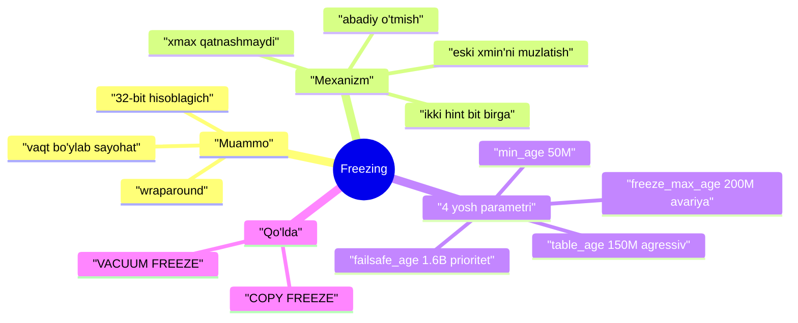
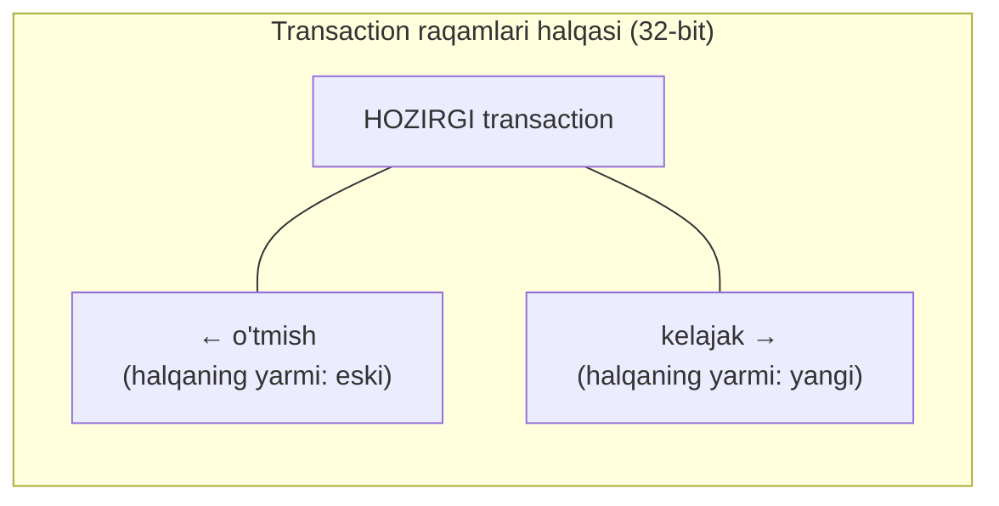
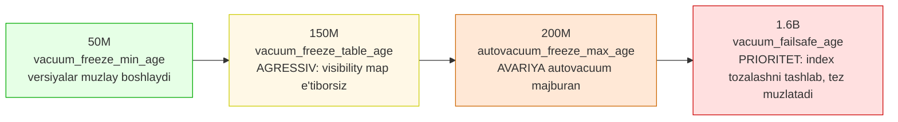
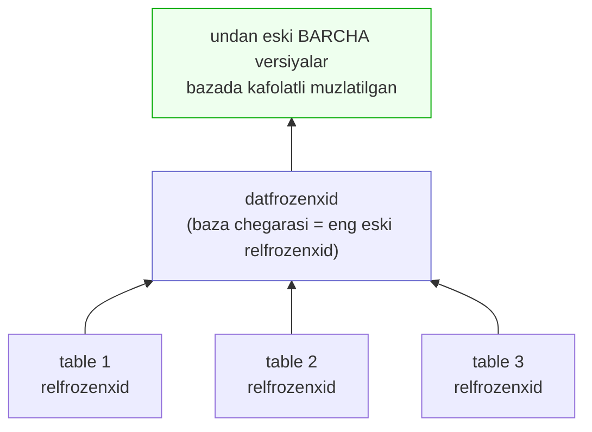

# 7. Freezing (muzlatish)

> 📖 Manba: Рогов, "PostgreSQL 17 изнутри", 7-bob ("Заморозка")

## Nima uchun kerak?

3-darsda ko'rdikki, har bir row versiyasi header'ida ikkita transaction raqami saqlanadi — **`xmin`** (versiyani yaratgan) va **`xmax`** (o'chirgan). 4-darsda esa snapshot aynan shu raqamlarga qarab versiya ko'rinadimi yo'qmi hal qiladi: «`xmin` mendan oldin bo'lganmi?» degan savolga javob beradi.

Lekin bu yerda yashirin bomba bor: transaction raqami — bu **32-bitli hisoblagich**. U ~4 milliard qiymatdan keyin **to'lib toshadi** (wraparound) va nolga qaytadi. Shunda «eski» va «yangi» tushunchasi buziladi — juda eski transaction birdan «kelajakdan» ko'rinib qolishi mumkin.

Agar bunga yo'l qo'yilsa: **ko'p yil oldin yozilgan ma'lumot birdan g'oyib bo'ladi** (yangi transaction'lar uchun ko'rinmas bo'lib qoladi). Bu — ma'lumotlar bazasi uchun falokat.

Bu muammoni **freezing** (muzlatish) hal qiladi: juda eski, barcha snapshot'larda ko'rinadigan versiyalarni maxsus belgilab, ularning `xmin` raqamini «abadiy o'tmish» deb e'lon qiladi. Shunda o'sha raqamni **qayta ishlatish** xavfsiz bo'ladi.

> **Kim freezing qiladi?** 6-darsda ko'rdik: freezing — bu **VACUUM**'ning ikkinchi vazifasi (birinchisi — o'lik versiyalarni tozalash). Ya'ni bu dars 6-darsning davomi: o'sha VACUUM, lekin endi boshqa maqsad bilan.



---

## 7.1. Transaction hisoblagichi to'lib toshishi (wraparound)

Transaction raqami uchun **32 bit** ajratilgan. To'rt milliard katta son ko'rinadi, lekin faol tizimda tez sarflanadi. Masalan, sekundiga **1000 transaction** yuklamada (virtual'larni sanamaganda) bu atigi **bir yarim oy** uzluksiz ishda tugaydi.

Hisoblagich to'lgach nolga qaytishi va yangi doira boshlanishi kerak. Lekin muammo shundaki, «kichik raqamli transaction kattaroq raqamlidan oldin boshlangan» degan mantiq **faqat doim o'suvchi** raqamlarda ishlaydi. Nolga qaytsak, bu mantiq buziladi.

### Nega 64 bit emas?

Savol tabiiy: 64 bitga o'tsak muammo umuman yo'qoladi-ku? Sababi — **har bir row versiyasi header'ida ikkita raqam** (`xmin` va `xmax`) saqlanadi. Header allaqachon katta (alignment bilan minimum 24 bayt), 64 bitga o'tish har versiyaga yana **8 bayt** qo'shar edi. Bu millionlab row'lar uchun juda qimmat.

> PostgreSQL 64-bitli raqamlarni ishlatadi ham (oddiy raqamga 32-bit «epoxa» qo'shib), lekin **faqat xizmat maqsadida** — ular hech qachon data page'lariga tushmaydi.

### Yechim: raqam emas, YOSH bilan solishtirish

To'lib toshishni to'g'ri boshqarish uchun transaction raqamlarini emas, ularning **yoshini** (age) solishtirish kerak. Yosh — bu «shu transaction paydo bo'lganidan beri nechta transaction o'tgani». Shunda «katta/kichik» o'rniga «oldinroq (eski)» va «keyinroq (yangi)» ishlatiladi.

Raqamlarni **halqa** (ring) deb tasavvur qiling. Istalgan transaction uchun halqaning yarmi (soat mili teskarisi) — o'tmish (eski), yarmi (soat mili yo'nalishi) — kelajak (yangi):



Muammo: **juda eski** transaction (T1) yangi transaction'lar uchun uzoq o'tmishda. Lekin vaqt o'tishi bilan hisoblagich aylanib, T1 birdan halqaning **kelajak** yarmiga tushib qoladi. Shunda T1 yaratgan versiyalar yangi transaction'lar uchun **ko'rinmas** bo'lib qoladi — «vaqt bo'ylab sayohat» falokati. Aynan shuni freezing oldini oladi.

---

## 7.2. Freezing va visibility qoidalari

VACUUM o'lik versiyalarni tozalashdan tashqari yana bir ish qiladi: u **database horizon**dan (6-darsda ko'rgan ufq — barcha snapshot'larda ko'rinadigan chegara) narida joylashgan versiyalarni topib, ularni **muzlatadi** (freeze).

> **Muzlatilgan versiya** barcha snapshot'larda **`xmin` raqamiga qaramasdan** ko'rinadi. Shuning uchun uning `xmin` raqamini xavfsiz qayta ishlatish mumkin.

Muzlatilgan versiyada `xmin` go'yo **«minus cheksizlik»** ga aylanadi — «bu versiyani yaratgan transaction shunchalik ko'p oldin tugaganki, uning aniq raqami endi ahamiyatsiz». Aslida `xmin` **o'zgarmaydi** (bu debug uchun qulay): muzlatish belgisi sifatida ikkita hint bit — `committed` va `aborted` — **bir vaqtda** o'rnatiladi.

> **Tarixiy izoh:** 9.4 versiyagacha `xmin` haqiqatan `FrozenTransactionId = 2` maxsus raqamiga almashtirilardi. Endi hint bit'lar ishlatiladi — asl raqam saqlanadi. Lekin eski tizimlarda 2-raqamli transaction'lar hali page'larda uchrashi mumkin.

**Muhim:** `xmax` freezing'da **umuman qatnashmaydi**. U faqat aktual bo'lmagan versiyalarda bo'ladi, va bunday versiyalar horizon'dan narida qolganda — ular VACUUM tomonidan **o'chiriladi**, muzlatilmaydi.

### Eksperiment: muzlatishni o'z ko'zimiz bilan ko'ramiz

Tajriba uchun maxsus table yaratamiz. `fillfactor = 10` qilamiz — har page'ga atigi ikki row sig'ib, kuzatish qulay bo'ladi. Autovacuum'ni o'chiramiz (tozalash momentini o'zimiz boshqaramiz):

```sql
=> CREATE TABLE tfreeze(
     id integer,
     s char(300)
   ) WITH (fillfactor = 10, autovacuum_enabled = off);
```

3-darsdagi `heap_page` funksiyasini kengaytiramiz — u endi page diapazonini ko'rsatadi, muzlatish belgisini (`f`) shifrlaydi va `xmin` **yoshini** (`age` funksiyasi) chiqaradi:

```sql
=> CREATE FUNCTION heap_page(
     relname text, pageno_from integer, pageno_to integer
   )
   RETURNS TABLE(
     ctid tid, state text,
     xmin text, xmin_age integer, xmax text
   ) AS $$
   SELECT (pageno,lp)::text::tid AS ctid,
     CASE lp_flags
       WHEN 0 THEN 'unused'  WHEN 1 THEN 'normal'
       WHEN 2 THEN 'redirect to '||lp_off  WHEN 3 THEN 'dead'
     END AS state,
     t_xmin || CASE
       WHEN (t_infomask & 256+512) = 256+512 THEN ' f'  -- ikki bit birga = frozen
       WHEN (t_infomask & 256) > 0 THEN ' c'
       WHEN (t_infomask & 512) > 0 THEN ' a'
       ELSE ''
     END AS xmin,
     age(t_xmin) AS xmin_age,
     t_xmax || CASE
       WHEN (t_infomask & 1024) > 0 THEN ' c'
       WHEN (t_infomask & 2048) > 0 THEN ' a'
       ELSE ''
     END AS xmax
   FROM generate_series(pageno_from, pageno_to) p(pageno),
        heap_page_items(get_raw_page(relname, pageno))
   ORDER BY pageno, lp;
   $$ LANGUAGE sql;
```

Diqqat qiling: `256+512` (ya'ni `xmin_committed` VA `xmin_aborted` bir vaqtda) — bu aynan **muzlatish** belgisi (`f`). 100 row qo'shib, darhol VACUUM qilamiz (visibility map yaralishi uchun):

```sql
=> CREATE EXTENSION IF NOT EXISTS pg_visibility;
=> INSERT INTO tfreeze(id, s)
   SELECT id, 'FOO'||id FROM generate_series(1,100) id;
=> VACUUM tfreeze;
```

Birinchi ikki page'ni kuzatamiz. VACUUM'dan keyin ikkala page ham **visibility map**'da belgilangan (`all_visible`), lekin **freeze map**'da emas (`all_frozen`) — ular hali muzlatilmagan versiyalarni saqlaydi:

```sql
=> SELECT * FROM generate_series(0,1) g(blkno),
     pg_visibility_map('tfreeze',g.blkno)
   ORDER BY g.blkno;
 blkno | all_visible | all_frozen
-------+-------------+------------
     0 | t           | f
     1 | t           | f
(2 rows)
```

`xmin_age = 1` — versiyalarni yaratgan transaction tizimdagi eng oxirgisi:

```sql
=> SELECT * FROM heap_page('tfreeze',0,1);
 ctid  | state  | xmin  | xmin_age | xmax
-------+--------+-------+----------+------
 (0,1) | normal | 869 c |        1 | 0 a
 (0,2) | normal | 869 c |        1 | 0 a
 (1,1) | normal | 869 c |        1 | 0 a
 (1,2) | normal | 869 c |        1 | 0 a
(4 rows)
```

> **Visibility map + freeze map.** VACUUM ikkala kartani yuritadi: `all_visible` (page'dagi barcha versiya hamma snapshot'da ko'rinadi) va `all_frozen` (page'dagi barcha versiya muzlatilgan). Freeze map VACUUM'ga muzlatilgan page'larni **o'tkazib yuborish** imkonini beradi — bu katta table'da ishni keskin kamaytiradi.

---

## 7.3. Freezingni boshqarish: 4 ta yosh parametri

Muzlatish jarayonini **to'rtta** asosiy parametr boshqaradi. Hammasi transaction **yoshini** ifodalaydi va qaysi momentdan boshlab nima bo'lishini belgilaydi:



| Parametr | Default | Vazifasi |
|---|---|---|
| `vacuum_freeze_min_age` | 50 mln | shu yoshdan **katta** versiyalar muzlatiladi |
| `vacuum_freeze_table_age` | 150 mln | shu yoshdan boshlab **agressiv** muzlatish (visibility map e'tiborsiz) |
| `autovacuum_freeze_max_age` | 200 mln | shu yoshda autovacuum **majburan** (hatto o'chirilgan bo'lsa ham) ishga tushadi |
| `vacuum_failsafe_age` | 1.6 mlrd | shu yoshda **prioritet** rejim: index tozalash tashlab, faqat muzlatishga urg'u |

### 1) Minimal yosh — `vacuum_freeze_min_age`

Versiyani muzlatish uchun `xmin` transaction'ining minimal yoshi. **Nega darhol emas, kutish kerak?** Agar row «issiq» (tez-tez o'zgaradigan) bo'lsa, uni darhol muzlatish behuda: yangi versiya baribir tez paydo bo'ladi, muzlatilgan versiya esa o'lib qoladi. Kutish ortiqcha ishni kamaytiradi.

Muzlatishni ko'rish uchun qiymatni **1** ga tushiramiz:

```sql
=> ALTER SYSTEM SET vacuum_freeze_min_age = 1;
=> SELECT pg_reload_conf();
=> UPDATE tfreeze SET s = 'BAR' WHERE id = 1;   -- yosh 1 ga oshdi
```

`UPDATE` nolinchi page'ning `all_visible` bitini tozaladi. VACUUM faqat visibility map'da **belgilanmagan** page'larni ko'rib chiqadi:

```sql
=> VACUUM tfreeze;
=> SELECT * FROM heap_page('tfreeze',0,1);
 ctid  |     state     | xmin  | xmin_age | xmax
-------+---------------+-------+----------+------
 (0,1) | redirect to 3 |       |          |
 (0,2) | normal        | 869 f |        2 | 0 a
 (0,3) | normal        | 870 f |        1 | 0 a
 (1,1) | normal        | 869 c |        2 | 0 a
 (1,2) | normal        | 869 c |        2 | 0 a
(5 rows)
```

Nolinchi page'da versiyalar `f` (frozen) bo'ldi, birinchi page esa **o'tkazib yuborildi** (u visibility map'da belgilangan edi). Diqqat: `(0,3)` versiyasi yoshi 1 bo'lsa ham muzlatildi — **page baribir o'zgartirilyapti**, shuning uchun undagi horizon narisidagi barcha versiyalar birga muzlatiladi (bu deyarli bepul, kelajakda esa ish tejaydi).

### 2) Agressiv yosh — `vacuum_freeze_table_age`

Muammo: agar page'da faqat aktual versiyalar qolsa va u visibility map'da belgilangan bo'lsa, oddiy VACUUM uni **hech qachon** ko'rmaydi — demak muzlatmaydi ham. `vacuum_freeze_table_age` shu holni hal qiladi: table yoshi shu chegaradan oshsa, VACUUM **visibility map'ni e'tiborsiz qoldirib**, butun table'ni ko'rib chiqadi (agressiv rejim).

Har table uchun system catalog'da **`relfrozenxid`** saqlanadi — «bundan eski barcha transaction'lar aniq muzlatilgan» degan chegara raqami:

```sql
=> SELECT relfrozenxid, age(relfrozenxid)
   FROM pg_class WHERE relname = 'tfreeze';
 relfrozenxid | age
--------------+-----
          869 |   2
(1 row)
```

Aynan shu `relfrozenxid` yoshi `vacuum_freeze_table_age` bilan solishtiriladi. Uni 2 ga tushirib, agressiv muzlatishni chaqiramiz:

```sql
=> ALTER SYSTEM SET vacuum_freeze_table_age = 2;
=> SELECT pg_reload_conf();
=> VACUUM VERBOSE tfreeze;
INFO:  aggressively vacuuming "internals.public.tfreeze"
...
tuples: 0 removed, 100 remain, 0 are dead but not yet removable
new relfrozenxid: 871, which is 2 XIDs ahead of previous value
frozen: 48 pages from table (96.00% of total) had 96 tuples frozen
```

`aggressively vacuuming` — agressiv rejim ishga tushdi. Endi butun table ko'rildi, shuning uchun `relfrozenxid` oldinga suriladi (871) — page'larda undan eski muzlatilmagan transaction yo'qligi kafolatlangan:

```sql
=> SELECT relfrozenxid, age(relfrozenxid)
   FROM pg_class WHERE relname = 'tfreeze';
 relfrozenxid | age
--------------+-----
          871 |   0
(1 row)
```

Birinchi page endi to'liq muzlatilgan va freeze map'da belgilangan:

```sql
=> SELECT * FROM generate_series(0,1) g(blkno),
     pg_visibility_map('tfreeze',g.blkno) ORDER BY g.blkno;
 blkno | all_visible | all_frozen
-------+-------------+------------
     0 | t           | t
     1 | t           | t
(2 rows)
```

> **Freeze map — barqarorlik ham beradi.** Agressiv VACUUM butun table'ni skanerlashi shart emas: freeze map'da belgilangan page'lar o'tkazib yuboriladi. Agar VACUUM to'xtatilib qayta boshlansa, allaqachon muzlatilgan page'larga qaytish shart emas. Agressiv muzlatish `vacuum_freeze_table_age − vacuum_freeze_min_age` transaction'da bir marta bo'ladi (default'da 100 mln).

### 3) Avariya yoshi — `autovacuum_freeze_max_age`

Ba'zan yuqoridagi ikki sozlama yetmaydi. Autovacuum o'chirilgan bo'lishi, arxiv table'lar autovacuum navbatiga tushmasligi, yoki `template0` kabi nofaol bazalarga autovacuum umuman kelmasligi mumkin. Bunday hollar uchun **avariya rejimi** bor.

Avariya autovacuum bazaga **majburan** (hatto o'chirilgan bo'lsa ham) ishga tushadi — qachonki bazadagi biror muzlatilmagan transaction yoshi `autovacuum_freeze_max_age` (200 mln) dan oshib ketishi mumkin bo'lsa. Bu yerda butun bazaning eng eski chegarasi — **`datfrozenxid`** hisobga olinadi:

```sql
=> SELECT datname, datfrozenxid, age(datfrozenxid) FROM pg_database;
  datname  | datfrozenxid | age
-----------+--------------+-----
 postgres  |          730 | 141
 template1 |          730 | 141
 template0 |          730 | 141
 internals |          730 | 141
(4 rows)
```

`datfrozenxid` — bazadagi barcha table'lar `relfrozenxid`'larining eng eskisi:



`autovacuum_freeze_max_age` chegarasi — **2 mlrd** (halqaning yarmidan sal kam), default esa 10 barobar kichik (200 mln). **Nega katta qiymat xavfli?** Chunki hisoblagich to'lishiga oz qolganda autovacuum barcha kerakli versiyalarni muzlatishga ulgurmasligi mumkin. Bunda PostgreSQL **avariyaviy to'xtaydi** (yangi transaction'larni qabul qilmaydi) — administrator aralashuvi kerak bo'ladi.

> **clog o'lchamini ham shu belgilaydi.** Klasterda `datfrozenxid`'larning eng eskisidan katta muzlatilmagan transaction bo'lmaydi, muzlatilganlarga esa status saqlash shart emas. Keraksiz clog fayl-segmentlari autovacuum tomonidan o'chiriladi. `autovacuum_freeze_max_age`'ni o'zgartirish **server restart**ini talab qiladi.

### 4) Prioritet yosh — `vacuum_failsafe_age`

Agar autovacuum wraparound'ni oldini olishga urinayotgan bo'lsa-yu, aniq ulgurmayotgan bo'lsa — «predoxranitel» ishga tushadi. Autovacuum `cost_delay` kechikishini **e'tiborsiz** qoldiradi va **index tozalashni to'xtatadi**, faqat versiyalarni imkon qadar tez muzlatishga o'tadi.

Prioritet rejim bazadagi biror muzlatilmagan transaction yoshi `vacuum_failsafe_age` (**1.6 mlrd**) dan oshishi mumkin bo'lganda yoqiladi. Bu qiymat `autovacuum_freeze_max_age`'dan **katta** bo'lishi kutiladi — bu «oxirgi chora».

> **Barcha parametrlarni table darajasida** qayta belgilash mumkin (nomlari `auto` bilan boshlanadi): `autovacuum_freeze_min_age`, `autovacuum_freeze_table_age`, `autovacuum_freeze_max_age` va ularning `toast.` variantlari.

---

## 7.4. Qo'lda freezing

Ba'zan autovacuum'ni kutmasdan muzlatishni **o'zimiz** boshqarish qulay.

### VACUUM FREEZE

`VACUUM FREEZE` barcha versiyalarni yoshiga qaramasdan muzlatadi — go'yo `vacuum_freeze_min_age = 0`:

```sql
=> VACUUM FREEZE tfreeze;
```

Agar maqsad — imkon qadar tez muzlatish bo'lsa, index tozalashni o'chirish mantiqiy (prioritet rejimdagi kabi):

```sql
=> VACUUM (freeze, index_cleanup false) tfreeze;
```

> Buni **muntazam** ishlatmang: VACUUM'ning asosiy vazifasi — page'larda joy bo'shatish — bunda yomon bajariladi.

### COPY FREEZE

O'zgarmaydigan ma'lumotni **yuklash paytida** darhol muzlatish mumkin — bu `COPY ... WITH FREEZE`:

```sql
=> BEGIN;
=> TRUNCATE tfreeze;
=> COPY tfreeze FROM stdin WITH FREEZE;
1	FOO
2	BAR
3	BAZ
\.
=> COMMIT;
```

Cheklov: FREEZE bilan yuklash **faqat** shu transaction ichida yaratilgan yoki `TRUNCATE` qilingan table'ga mumkin. Ikkala amal ham table'ni **eksklyuziv** bloklaydi. Nega bu cheklov kerak?

> **Isolation nozikligi.** Muzlatilgan versiyalar isolation levelga qaramasdan **barcha snapshot'larda ko'rinadi**. Agar table bloklanmasa, boshqa transaction yangi muzlatilgan row'larni to'satdan «paydo bo'layotganini» ko'rar edi — bu isolation buzilishi. Table bloklangani uchun bunga yo'l qo'yilmaydi.

**Yutuq (v14):** FREEZE bilan yuklashda visibility map darhol yaratiladi va page header'iga `all_visible` belgisi qo'yiladi — VACUUM keyin bu table'ni umuman qayta ishlashi shart bo'lmaydi (ma'lumot o'zgarmasa). Afsuski, bu hali TOAST-table'lar uchun ishlamaydi.

---

## Xulosa

- Transaction raqami — **32-bitli hisoblagich**, ~4 mlrd dan keyin **to'lib toshadi** (wraparound). Yuqori yuklamada bir necha oyda tugashi mumkin.
- 64 bitga o'tilmaydi, chunki `xmin`/`xmax` har versiya header'ida — bu har row'ga 8 bayt qo'shar edi.
- Yechim: raqamlarni emas, **yoshni** solishtirish. Raqamlar **halqa**, «eski» = o'tmish yarmi, «yangi» = kelajak yarmi.
- **Freezing** — juda eski, horizon narisidagi versiyalarni muzlatadi. Muzlatilgan versiya `xmin`'ga qaramasdan hamma snapshot'da ko'rinadi, shuning uchun raqamini qayta ishlatish xavfsiz.
- Muzlatish belgisi — ikkita hint bit (`committed` + `aborted`) **bir vaqtda**. `xmin` o'zgarmaydi. `xmax` freezing'da qatnashmaydi.
- VACUUM **visibility map** va **freeze map**'ni yuritadi; freeze map muzlatilgan page'larni o'tkazib yuborishga imkon beradi.
- To'rt parametr yoshni bosqichma-bosqich boshqaradi: `vacuum_freeze_min_age` (50M, muzlay boshlaydi) → `vacuum_freeze_table_age` (150M, agressiv, map'ni e'tiborsiz) → `autovacuum_freeze_max_age` (200M, avariya) → `vacuum_failsafe_age` (1.6B, prioritet).
- **`relfrozenxid`** (table chegarasi) va **`datfrozenxid`** (baza chegarasi = eng eski relfrozenxid) muzlatish holatini kuzatadi; ular clog o'lchamini ham belgilaydi.
- Qo'lda: **`VACUUM FREEZE`** hammani muzlatadi; **`COPY FREEZE`** yuklash paytida muzlatadi (faqat bloklangan yangi/tozalangan table'ga).

## Nazorat savollari

1. Transaction hisoblagichi nechta bitli va nega u to'lib toshishi (wraparound) muammo tug'diradi? Yuqori yuklamada bu qancha vaqtda sodir bo'lishi mumkin?
2. Nega PostgreSQL transaction raqamini 64 bitga oshirmaydi? Muammo qanday hal qilinadi (raqam o'rniga nima solishtiriladi)?
3. Freezing nima qiladi va nega muzlatilgan versiyaning `xmin` raqamini qayta ishlatish xavfsiz bo'ladi?
4. Muzlatish page'da qanday belgilanadi? `xmin` o'zgaradimi? `xmax` freezing'da qatnashadimi?
5. `vacuum_freeze_min_age` nima uchun 0 emas, 50 mln? «Issiq» row misolida tushuntiring.
6. Oddiy VACUUM visibility map'da belgilangan page'ni o'tkazib yuboradi — bu nega muzlatish uchun muammo? `vacuum_freeze_table_age` va agressiv rejim uni qanday hal qiladi?
7. `relfrozenxid` va `datfrozenxid` nima va ular o'zaro qanday bog'liq? `datfrozenxid` clog o'lchamiga qanday ta'sir qiladi?
8. `autovacuum_freeze_max_age` (avariya) va `vacuum_failsafe_age` (prioritet) rejimlari qachon va nima uchun ishga tushadi? Ular oddiy freezing'dan nimasi bilan farq qiladi?
9. `VACUUM FREEZE` va `COPY FREEZE` orasidagi farq nima? `COPY FREEZE` nega faqat bloklangan yangi table'ga ruxsat etiladi (isolation nozikligi)?
