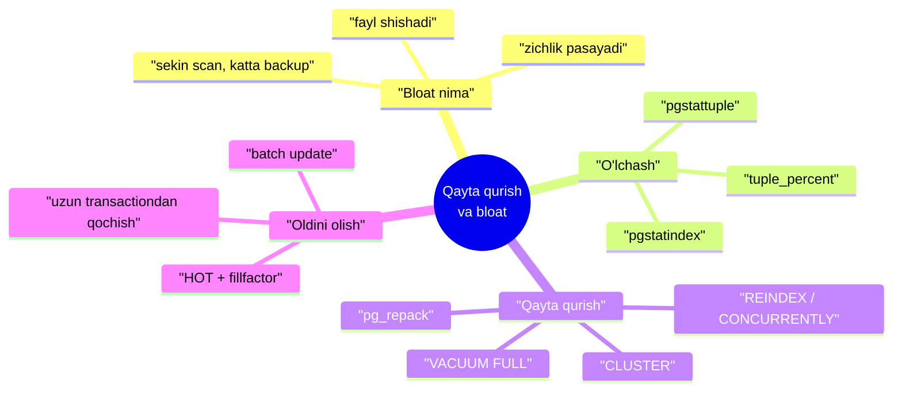
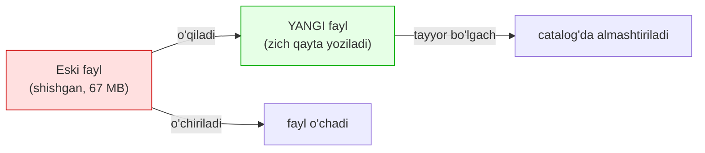
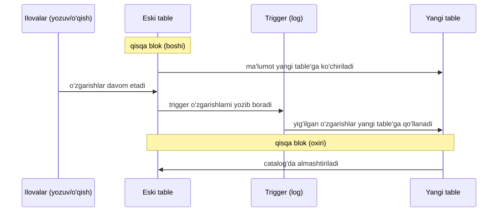

# 8. Table va indexlarni qayta qurish

> 📖 Manba: Рогов, "PostgreSQL 17 изнутри", 8-bob ("Перестроение таблиц и индексов")

## Nima uchun kerak?

6-darsda muhim, lekin xafa qiladigan haqiqatni ko'rdik: **oddiy VACUUM faylni kichraytirmaydi**. U o'lik versiyalarni tozalab, page **ichida** joy bo'shatadi (yangi row'lar shu joyga yoziladi), lekin page'lar soni odatda kamaymaydi. Fayl operatsion tizimga faqat bitta holatda qaytariladi — fayl **oxirida** butunlay bo'sh page'lar to'planganda, bu esa kam uchraydi.

Natijada fayllar «shishib» ketishi mumkin — bu holat **bloat** deb ataladi. Bloat quyidagi muammolarni keltiradi:

- table (yoki index) **to'liq skanerlash** sekinlashadi;
- kattaroq buffer cache kerak bo'ladi (page'lar cache'lanadi, lekin ulardagi foydali ma'lumot zichligi past);
- B-tree'da **ortiqcha daraja** paydo bo'lib, index'ga murojaatni sekinlashtirishi mumkin;
- fayllar disk'da va **backup'larda** ortiqcha joy egallaydi.

Bu darsda bloat'ni **o'lchashni**, uni **qayta qurish** bilan yo'q qilishni (`VACUUM FULL`, `CLUSTER`, `REINDEX`, `pg_repack`) va eng muhimi — uning **oldini olishni** o'rganamiz.



---

## 8.1. Bloat nima va uni qanday o'lchash

Avval bloat'ni **yasab** ko'ramiz. 6-darsdagi `vac` table'ga 500 000 row qo'shamiz:

```sql
=> TRUNCATE vac;
=> INSERT INTO vac(id,s)
   SELECT id, id::text FROM generate_series(1,500000) id;
```

Ma'lumot **zichligini** (foydali ma'lumot ulushi) o'lchash uchun `pgstattuple` extension ishlatiladi:

```sql
=> CREATE EXTENSION pgstattuple;
=> SELECT * FROM pgstattuple('vac') \gx
-[ RECORD 1 ]------+---------
table_len          | 70623232
tuple_count        | 500000
tuple_len          | 64500000
tuple_percent      | 91.33
dead_tuple_count   | 0
dead_tuple_percent | 0
free_space         | 381844
free_percent       | 0.54
```

`tuple_percent = 91.33` — fayl hajmining 91% foydali ma'lumot (row versiyalar). 100% bo'lolmaydi, chunki page ichida xizmat ma'lumoti bor, lekin bu yerda zichlik yuqori. Index uchun boshqa funksiya, `avg_leaf_density` ustuni shu ma'noda (barg page'laridagi foydali ma'lumot foizi):

```sql
=> SELECT * FROM pgstatindex('vac_s') \gx
-[ RECORD 1 ]------+----------
tree_level         | 3
index_size         | 114302976
leaf_pages         | 13576
avg_leaf_density   | 53.88
leaf_fragmentation | 10.59
```

Endi table va index o'lchamini eslab qolamiz, so'ng **90% row'ni o'chiramiz**:

```sql
=> SELECT pg_size_pretty(pg_table_size('vac')) AS table_size,
          pg_size_pretty(pg_indexes_size('vac')) AS index_size;
 table_size | index_size
------------+------------
 67 MB      | 109 MB
(1 row)
=> DELETE FROM vac WHERE id % 10 != 0;
DELETE 450000
=> VACUUM vac;
```

VACUUM'dan **keyin ham** fayl o'lchami **o'zgarmadi** — bo'sh «dumli» page'lar yo'q:

```sql
=> SELECT pg_size_pretty(pg_table_size('vac')) AS table_size,
          pg_size_pretty(pg_indexes_size('vac')) AS index_size;
 table_size | index_size
------------+------------
 67 MB      | 109 MB
(1 row)
```

Lekin zichlik **~10 barobar** pasaydi — mana shu bloat:

```sql
=> SELECT vac.tuple_percent, vac_s.avg_leaf_density
   FROM pgstattuple('vac') vac, pgstatindex('vac_s') vac_s;
 tuple_percent | avg_leaf_density
---------------+------------------
          9.13 |             6.71
(1 row)
```


> **Tezroq, ammo taxminiy usullar.** `pgstattuple` butun obyektni o'qiydi (katta table'da qimmat). `pgstattuple_approx` visibility map'da belgilangan page'larni o'tkazib, taxminiy raqam beradi. Eng tez (va eng noaniq) usul — system catalog'dagi `pg_table_size` va row sonini taqqoslab, zichlikni «ko'z bilan» chamalash.

---

## 8.2. VACUUM FULL — to'liq tozalash

Agar foydali ma'lumot ulushi maqbul chegaradan pastga tushsa, administrator **to'liq tozalash** — `VACUUM FULL` bajarishi mumkin. Bunda table **va uning barcha index'lari noldan qayta quriladi**, ma'lumot esa maksimal zich joylashtiriladi (`fillfactor` hisobga olingan holda — buni 5-darsda ko'rgan edik).



Ikki muhim nozik nuqta:

- Qayta qurish paytida disk'da **ham eski, ham yangi fayl** yashaydi — shuning uchun VACUUM FULL uchun ancha **bo'sh joy** kerak bo'lishi mumkin.
- Butun qurish davomida table **to'liq bloklanadi** — ham yozuv, ham **o'qish** uchun. Bu — VACUUM FULL'ning asosiy kamchiligi.

Qayta qurish jarayonini `pg_stat_progress_cluster` view'ida kuzatish mumkin (`pg_stat_progress_vacuum`'ga o'xshash):

```sql
=> VACUUM FULL vac;
=> SELECT phase, heap_blks_total, heap_blks_scanned
   FROM pg_stat_progress_cluster;
      phase       | heap_blks_total | heap_blks_scanned
------------------+-----------------+-------------------
 rebuilding index |            8621 |              8621
```

Natijada fayllar **yangi**siga almashadi va o'lcham keskin kamayadi:

```sql
=> SELECT pg_size_pretty(pg_table_size('vac')) AS table_size,
          pg_size_pretty(pg_indexes_size('vac')) AS index_size;
 table_size | index_size
------------+------------
 6904 kB    | 6504 kB
(1 row)
=> SELECT vac.tuple_percent, vac_s.avg_leaf_density
   FROM pgstattuple('vac') vac, pgstatindex('vac_s') vac_s;
 tuple_percent | avg_leaf_density
---------------+------------------
         91.23 |            91.08
(1 row)
```

Diqqat: index zichligi hatto **dastlabkidan ham yuqori** (91.08 vs 53.88). Sababi — mavjud ma'lumotdan B-tree'ni **noldan** qurish, uni row-ba-row eski index'ga qo'shishdan samaraliroq.

> **Qayta qurishda versiyalar muzlatiladi** (7-dars) — bu umumiy ish hajmiga nisbatan bepul. Lekin nozik nuqta: page'lar visibility/freeze map'da **belgilanmaydi** va header'ga `all_visible` qo'yilmaydi. Shuning uchun VACUUM FULL'dan keyin oddiy `VACUUM` qilish foydali — page'lar kartalarga tushadi.

---

## 8.3. Boshqa qayta qurish usullari

`VACUUM FULL`dan tashqari table va index'ni to'liq qayta quruvchi yana bir necha buyruq bor. Hammasi table'ni **eksklyuziv bloklaydi**, eski fayllarni o'chirib yangisini yaratadi:

| Buyruq | Nima qiladi | Blok |
|---|---|---|
| `VACUUM FULL` | table + barcha index'ni zich qayta quradi | to'liq (o'qish + yozuv) |
| `CLUSTER` | VACUUM FULL + row'larni index bo'yicha **tartiblab** joylashtiradi | to'liq |
| `REINDEX` | faqat index(lar)ni qayta quradi | to'liq (jadval o'qishga ochiq) |
| `REINDEX CONCURRENTLY` | index'ni **uzoq bloksiz** qayta quradi | qisqa (boshi/oxirida) |
| `TRUNCATE` | barcha row'ni o'chirib, **yangi bo'sh fayl** yaratadi | to'liq |

### CLUSTER

`CLUSTER` hamma jihatdan `VACUUM FULL` kabi, lekin qo'shimcha ravishda row versiyalarini **tanlangan index tartibida** joylashtiradi. Bu planner'ga ba'zi hollarda index'dan samaraliroq foydalanish imkonini beradi (masalan, diapazon so'rovlarida qo'shni row'lar qo'shni page'larda bo'ladi).

> **Klasterlash saqlanmaydi!** Keyingi `UPDATE`/`INSERT`lar fizik tartibni buzadi — CLUSTER bir martalik amal. Kod nuqtai nazaridan `VACUUM FULL` — bu `CLUSTER`ning tartiblashsiz xususiy holati.

### REINDEX va REINDEX CONCURRENTLY

`REINDEX` bitta yoki bir necha index'ni qayta quradi (`VACUUM FULL` va `CLUSTER` index'ni aynan shu mexanizm bilan qayta quradi). Oddiy `REINDEX` index'ni eksklyuziv bloklaydi — o'sha index orqali yozuv va o'qish to'xtaydi.

**`REINDEX CONCURRENTLY`** yuqori mavjudlikli tizimlar uchun: u yangi index'ni fon rejimida quradi va eskisini almashtiradi, uzoq blok qo'ymaydi (faqat boshi va oxirida qisqa). Sekinroq, lekin production'ni to'xtatmaydi:

```sql
=> REINDEX INDEX CONCURRENTLY vac_s;
```

### TRUNCATE vs DELETE

`TRUNCATE` mantiqan `WHERE`siz `DELETE`ga teng, lekin ishlashi tubdan boshqacha:

- `DELETE` har row versiyasini «o'chirilgan» deb belgilaydi (`xmax` qo'yadi) — keyin VACUUM kerak;
- `TRUNCATE` shunchaki **yangi bo'sh fayl** yaratadi — odatda ancha tez.

---

## 8.4. Uzoq bloklashsiz qayta qurish

`VACUUM FULL` muntazam ishlatish uchun emas — u butun table'ga murojaatni (so'rovlarni ham) **butun ishlash davomida** bloklaydi. Yuqori mavjudlikli tizimlar uchun bu qabul qilib bo'lmaydigan holat.

### pg_repack g'oyasi

**`pg_repack`** extension'i table va index'ni xizmatni deyarli to'xtatmasdan qayta quradi. Eksklyuziv blok baribir kerak, lekin faqat **boshida va oxirida**, qisqa vaqtga:



Mexanizm: qayta qurish davomida asl table o'zgarishlari **trigger** bilan saqlanadi, keyin yangi table'ga qo'llanadi; oxirida bir table catalog'da ikkinchisiga almashtiriladi.

### pgcompacttable g'oyasi

**`pgcompacttable`** boshqa yondashuv: table row'larini ma'lumotni o'zgartirmaydigan **soxta `UPDATE`** bilan qayta-qayta yangilaydi. Natijada aktual versiyalar asta-sekin fayl **boshiga** yaqinlashadi. Yangilash seriyalari orasida VACUUM ishlab, fayl **dumini qirqadi**. Bu ko'proq vaqt va resurs oladi, lekin **qo'shimcha joy talab qilmaydi** va pik yuklama yaratmaydi.

---

## 8.5. Bloat oldini olish (profilaktika)

Qayta qurish — bu «kasallikni davolash». Yaxshiroq yo'l — uni **oldini olish**. Bloat'ning ikki asosiy sababi bor.

### Sabab 1: uzun o'quvchi transaction'lar

6-darsda ko'rdik: uzoq davom etuvchi transaction **database horizon**ni ushlab turadi, VACUUM esa horizon narisidagi o'lik versiyalarni tozalay olmaydi. Uzun o'qish + faol o'zgarish = bloat.

Uzun (o'quvchi) transaction o'zi muammo emas. Odatiy yechim — yuklamani ajratish: **OLAP** so'rovlarini replica'da, tez **OLTP** so'rovlarini asosiy serverda bajarish (31-dars, replication).

Agar uzun transaction ilova/drayver **xatosi** bo'lsa, administrator qo'lida ikki parametr bor:

| Parametr | Default | Vazifasi |
|---|---|---|
| `idle_in_transaction_session_timeout` | 0 (o'chiq) | **bekor turgan** transaction'ning maksimal umri |
| `transaction_timeout` (v17) | 0 (o'chiq) | transaction'ning **umumiy** maksimal davomiyligi |

Belgilangan vaqt o'tsa (0 bo'lmasa), transaction **uziladi**.

### Sabab 2: bir vaqtda ko'p row o'zgartirish

Ikkinchi sabab — bitta transactionda ko'p row'ni birdan o'zgartirish. Butun table'ni `UPDATE` qilish versiyalar sonini **ikki barobarga** oshirishi mumkin, VACUUM esa ulgurmaydi. Ko'rib chiqamiz — `vac`ga ustun qo'shib, hammani yangilaymiz:

```sql
=> ALTER TABLE vac ADD processed boolean DEFAULT false;
=> SELECT pg_size_pretty(pg_table_size('vac'));
 pg_size_pretty
----------------
 6936 kB
=> UPDATE vac SET processed = true;
UPDATE 50000
=> SELECT pg_size_pretty(pg_table_size('vac'));
 pg_size_pretty
----------------
 14 MB
(1 row)
```

Bitta `UPDATE` table'ni **ikki barobar** shishirdi (6936 kB → 14 MB). Yechim — o'zgarishni **bo'laklarga (batch)** bo'lish va vaqt bo'yicha taqsimlash, VACUUM oraliqda ulgursin. Namunaviy shablon:

```sql
=> WITH batch AS (
     SELECT id FROM vac WHERE NOT processed LIMIT 1000
     FOR UPDATE SKIP LOCKED
   )
   UPDATE vac SET processed = true
   WHERE id IN (SELECT id FROM batch);
UPDATE 1000
```

`FOR UPDATE SKIP LOCKED` — bir yo'la ≤1000 row tanlab bloklaydi, boshqa transaction bloklagan row'larni **o'tkazib yuboradi** (13-dars). Bunday batch'lar orasida VACUUM ishlasa, table o'lchami deyarli o'smaydi — yangi versiyalar tozalangan versiyalar o'rniga yoziladi:

```sql
=> VACUUM vac;
-- keyingi batch...
=> SELECT pg_size_pretty(pg_table_size('vac'));
 pg_size_pretty
----------------
 7072 kB
(1 row)
```

### Sabab 3'ni yumshatish: HOT va fillfactor

5-darsda ko'rgan ikki mexanizm bloat'ni tabiiy kamaytiradi:

- **`fillfactor`** — page'da `UPDATE` uchun joy zaxiralaydi, shunda yangi versiya **shu page'da** joylashadi;
- **HOT (Heap-Only Tuple)** — o'zgargan ustun index'ga kirmasa, `UPDATE` index'ga tegmaydi va page ichi tozalash eski versiyani tez yig'ishtiradi.

> **Oltin qoida:** bloat'ni qayta qurish bilan «davolash» — oxirgi chora. Avvalo sababni yo'q qiling: uzun transaction'lardan qoching, ommaviy o'zgarishlarni batch'ga bo'ling, tez yangilanadigan table'ga `fillfactor` qo'ying va HOT ishlashiga sharoit yarating.

---

## Xulosa

- **Oddiy VACUUM faylni kichraytirmaydi** — page ichida joy bo'shatadi, xolos. Fayl shishib qolishi **bloat** deb ataladi.
- Bloat: sekin scan, katta buffer cache va backup, B-tree'da ortiqcha daraja. Sababi — o'chirilgan/eski versiyalar joy egallashda davom etadi.
- Zichlikni **`pgstattuple`** (`tuple_percent`) va **`pgstatindex`** (`avg_leaf_density`) o'lchaydi; tezroq, taxminiy — `pgstattuple_approx`.
- **`VACUUM FULL`** table va barcha index'ni noldan zich qayta quradi. Kamchiligi: **to'liq blok** (o'qish ham) va disk'da eski+yangi fayl uchun **qo'shimcha joy**.
- **`CLUSTER`** = VACUUM FULL + index bo'yicha tartiblash (saqlanmaydi). **`REINDEX`** faqat index'ni; **`REINDEX CONCURRENTLY`** uzoq bloksiz. **`TRUNCATE`** — yangi bo'sh fayl (DELETE'dan tez).
- **`pg_repack`** table'ni deyarli bloksiz qayta quradi (trigger + almashtirish, qisqa blok boshi/oxirida). **`pgcompacttable`** soxta `UPDATE`lar bilan row'larni fayl boshiga suradi.
- Bloat'ning 1-sababi — **uzun o'quvchi transaction'lar** (horizon ushlab qoladi). Yechim: OLAP replica'da; `idle_in_transaction_session_timeout`, `transaction_timeout`.
- Bloat'ning 2-sababi — **ommaviy `UPDATE`** (o'lchamni 2x qiladi). Yechim: `FOR UPDATE SKIP LOCKED` bilan **batch**'lash.
- Oldini olishning arzon vositalari: **`fillfactor`** va **HOT** (5-dars).

## Nazorat savollari

1. Nega oddiy VACUUM faylni deyarli hech qachon kichraytirmaydi? Qaysi **yagona** holatda fayl kamayadi?
2. Bloat nima va u qanday zararli oqibatlarga olib keladi (kamida uchtasini ayting)?
3. `pgstattuple`ning `tuple_percent`i va `pgstatindex`ning `avg_leaf_density`si nimani ko'rsatadi? 90% row'ni o'chirib VACUUM qilgach, fayl o'lchami va zichlik bilan nima bo'ldi?
4. `VACUUM FULL` nima qiladi va uning ikkita asosiy kamchiligi nima? Nega undan keyin qayta qurilgan index zichligi dastlabkidan ham yuqori bo'lishi mumkin?
5. `CLUSTER` `VACUUM FULL`dan nimasi bilan farq qiladi? Nega «klasterlash saqlanmaydi» deyiladi?
6. `REINDEX` va `REINDEX CONCURRENTLY` orasidagi farq nima? Yuqori mavjudlikli tizimda qaysi birini tanlaysiz va nega?
7. `pg_repack` uzoq bloklashsiz qanday ishlaydi? Trigger bu yerda qanday rol o'ynaydi?
8. Uzun o'quvchi transaction bloat'ga qanday sabab bo'ladi (6-darsdagi horizon bilan bog'lang)? Uni qaysi ikki parametr bilan cheklash mumkin?
9. Nega butun table'ni bitta `UPDATE` bilan yangilash uni ~2 barobar shishiradi? `FOR UPDATE SKIP LOCKED` bilan batch'lash buni qanday hal qiladi?
10. `fillfactor` va HOT (5-dars) bloat'ni qanday oldini oladi?
