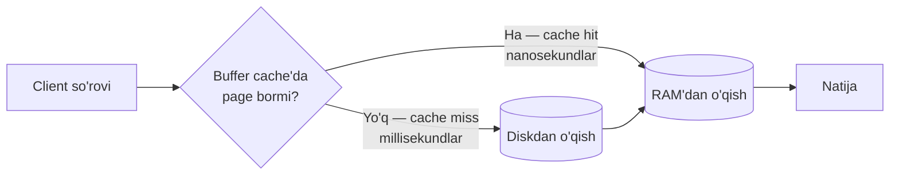
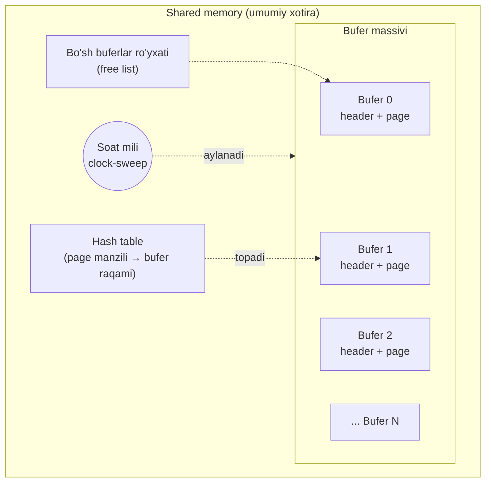
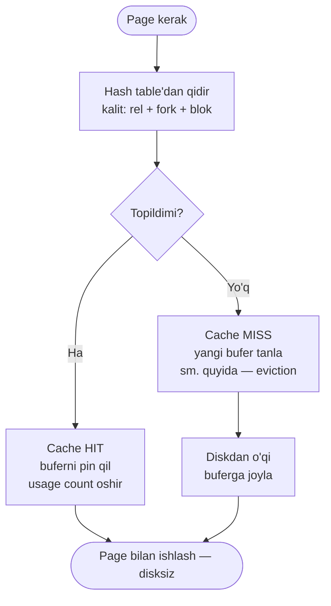
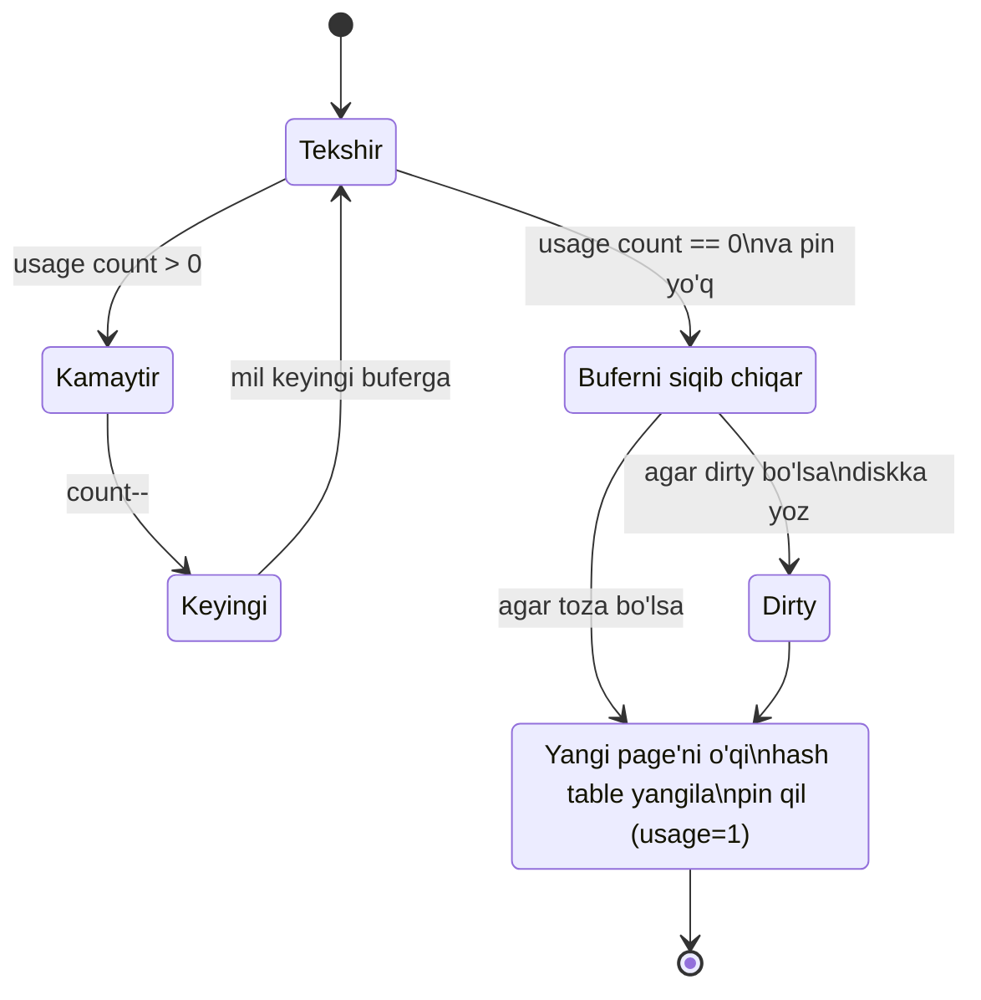
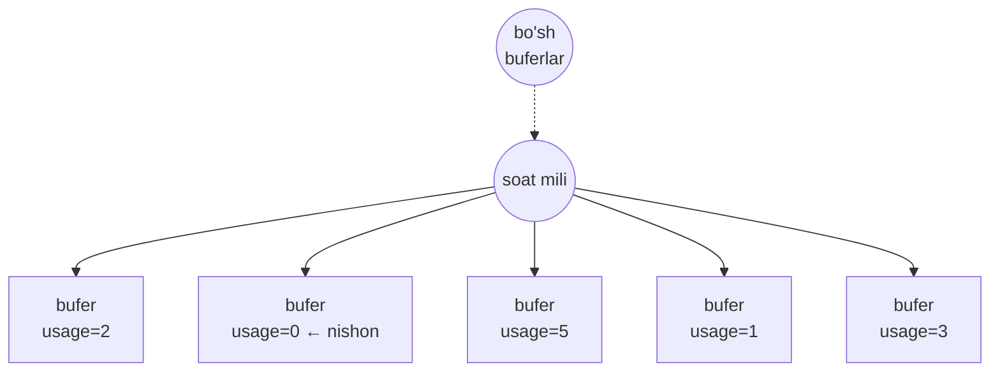
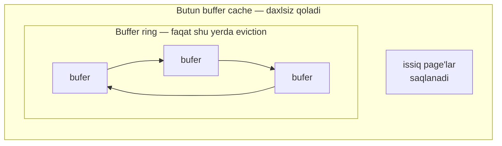
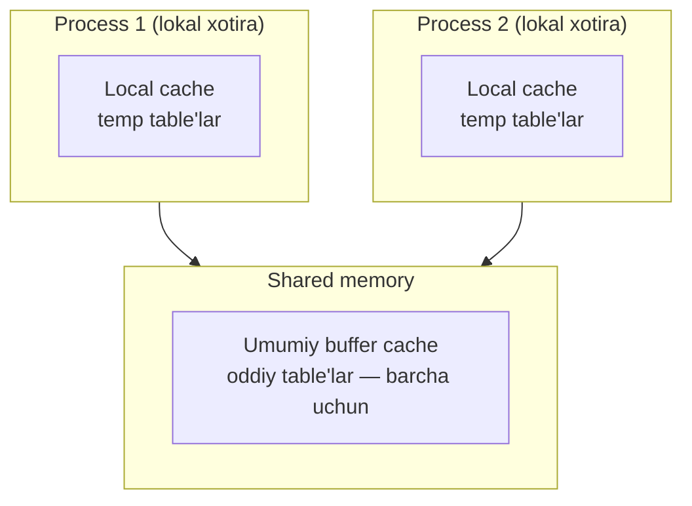

# 9. Buffer cache

> 📖 Manba: Рогов, "PostgreSQL 17 изнутри", 9-bob

## Nima uchun kerak?

Kompyuterda ikki xil xotira bor:

- **Operativ xotira (RAM)** — juda tez (nanosekundlar), lekin qimmat, kichik va o'chirilsa ma'lumot yo'qoladi.
- **Disk** — sekin (millisekundlar), lekin arzon, katta va energiyaga bog'liq emas (ma'lumot saqlanib qoladi).

Bazadagi barcha ma'lumot diskda yotadi. Agar har bir `SELECT` yoki `UPDATE` uchun to'g'ridan-to'g'ri diskka murojaat qilinsa, baza juda sekin ishlaydi — chunki disk RAM'dan **million marta** sekin.

Yechim — **caching**. Odatda bazaning faqat kichik qismi bilan faol ishlanadi ("issiq" ma'lumot). Ana shu issiq page'larni tez RAM'da saqlab qo'ysak, diskka murojaatlarni keskin kamaytiramiz. Xuddi shu ish uchun PostgreSQL'da **buffer cache** mavjud.



> **Muhim nuance.** Operatsion tizimning (OS) ham o'z cache'i bor. Ko'p DBMS'lar bu "ikki karra caching"dan qochish uchun diskka to'g'ridan-to'g'ri (direct I/O) murojaat qiladi. PostgreSQL esa hali ham **buferlangan fayl operatsiyalari** ishlatadi — ya'ni ma'lumot ham PostgreSQL buffer cache'i, ham OS cache'i orqali o'tadi. `debug_io_direct` parametri mavjud, lekin amaliy foyda hali uzoq.

Avvalgi darslardan bog'liqlik: MVCC darsida bir page ichida bir necha row version bo'lishini ko'rgan edik, VACUUM esa dead tuple'larni tozalar edi. Bu barcha o'qish-yozish aynan **buffer cache orqali** amalga oshadi — hech qaysi process page bilan to'g'ridan-to'g'ri diskda ishlamaydi.

---

## Buffer cache tuzilishi

Buffer cache serverning **umumiy xotirasida** (shared memory) joylashadi va barcha process'lar uchun ochiq. U umumiy xotiraning kattagina qismini egallaydi.

Cache "buferli" deb ataladi, chunki u **bufer massivi**dan iborat. Har bir bufer bitta data page va uning header'i uchun joy ajratadi.



Har bir bufer **header**'ida quyidagilar saqlanadi:

- **Page'ning fizik manzili** — qaysi fayl (relation), qaysi fork (main/fsm/vm) va fayldagi blok raqami.
- **Dirty (iflos) belgisi** — page o'zgartirilgan, lekin hali diskka yozilmagan. Bunday page'ni "dirty" deyiladi.
- **usage count** — bufer necha marta ishlatilgani (murojaatlar soni).
- **pin count** (reference count) — bufer necha marta "mahkamlangani" (band qilingani).

Page'ga murojaat qilish uchun process **buffer manager**'dan uni so'raydi va bufer raqamini oladi. Process page'ni cache'da o'qiydi va o'sha yerda o'zgartiradi. Ish davomida bufer **pin** qilinadi (mahkamlanadi), toki manager uni boshqa page'ga almashtirib yubormasin. Har bir pin'da usage count oshadi.

> Page cache'da turgan ekan, u bilan ishlash **hech qanday fayl operatsiyasiga olib kelmaydi** — ya'ni diskka tegilmaydi.

### Eksperiment: pg_buffercache bilan ichkariga qarash

```sql
=> CREATE EXTENSION pg_buffercache;

=> CREATE TABLE cacheme(
     id integer
   ) WITH (autovacuum_enabled = off);

=> INSERT INTO cacheme VALUES (1);
```

Endi buffer cache'da bitta table page bor — yangi kiritilgan row bilan. Buni ko'rish uchun qulay funksiya yozamiz:

```sql
=> CREATE FUNCTION buffercache(rel regclass)
   RETURNS TABLE(
     bufferid integer, relfork text, relblk bigint,
     isdirty boolean, usagecount smallint, pins integer
   ) AS $$
   SELECT bufferid,
     CASE relforknumber
       WHEN 0 THEN 'main'
       WHEN 1 THEN 'fsm'
       WHEN 2 THEN 'vm'
     END,
     relblocknumber, isdirty, usagecount, pinning_backends
   FROM pg_buffercache
   WHERE relfilenode = pg_relation_filenode(rel)
   AND relforknumber = 0
   ORDER BY relforknumber, relblocknumber;
   $$ LANGUAGE sql;

=> SELECT * FROM buffercache('cacheme');
 bufferid | relfork | relblk | isdirty | usagecount | pins
----------+---------+--------+---------+------------+------
      281 | main    |      0 | t       |          1 |    0
(1 row)
```

Page **dirty** (`isdirty = t`), chunki o'zgartirilgan, lekin hali diskka yozilmagan. `usagecount = 1`.

---

## Cache hit — page cache'da topilsa

Buffer manager page'ni o'qishi kerak bo'lganda, avval uni buffer cache'dan qidiradi. Tez qidirish uchun **hash table** ishlatiladi — u page manzili bo'yicha bufer raqamini saqlaydi.

**Hash key** (hashlash kaliti) — relation fayl identifikatori, fork turi va page raqami. Shu uchdan foydalanib, page'ni saqlab turgan buferni tez topish yoki page cache'da yo'qligiga ishonch hosil qilish mumkin.



Agar bufer raqami topilsa, manager buferni **pin** qiladi va raqamni process'ga qaytaradi. Pin qilish uchun header'dagi pin count oshiriladi. Bir buferni bir vaqtda bir nechta process pin qilishi mumkin. Bufer pin bo'lgan ekan (count > 0), u ishlatilmoqda deb hisoblanadi va uning ichi "radikal" o'zgarmaydi — masalan, page'da yangi row version paydo bo'lishi mumkin, lekin page butunlay boshqa page'ga almashtirilmaydi.

### Eksperiment: EXPLAIN bilan cache hit'ni ko'rish

```sql
=> EXPLAIN (analyze, buffers, costs off, timing off, summary off)
   SELECT * FROM cacheme;
                    QUERY PLAN
--------------------------------------------------
 Seq Scan on cacheme (actual rows=1 loops=1)
   Buffers: shared hit=1
 Planning:
   Buffers: shared hit=12 read=7
(4 rows)
```

`hit=1` — bitta page kerak bo'ldi va u cache'da topildi (diskka tegilmadi).

### Pin count amalda: ochiq cursor

Ochiq cursor keyingi row'ni tez o'qish uchun buferni **pin holatida ushlab turadi**:

```sql
=> BEGIN;
=> DECLARE c CURSOR FOR SELECT * FROM cacheme;
=> FETCH c;
 id
----
  2
(1 row)

=> SELECT * FROM buffercache('cacheme');
 bufferid | relfork | relblk | isdirty | usagecount | pins
----------+---------+--------+---------+------------+------
      281 | main    |      0 | t       |          4 |    1
(1 row)
```

`pins = 1` — cursor buferni mahkamlab turibdi. Cursor boshqa page'ga o'tsa yoki yopilsa, pin olib tashlanadi. Transaction tugagach ham pin nolga tushadi.

> Pin cleanup (tozalash)ga to'sqinlik qilishi mumkin: VACUUM pin bo'lgan buferdagi dead tuple'ni jismonan o'chira olmaydi (`1 dead ... not removed due to cleanup lock contention`).

---

## Cache miss — page cache'da yo'q bo'lsa

Agar hash table'da page uchun yozuv topilmasa, demak page cache'da yo'q. Bu holda page uchun yangi bufer tanlanadi (va darrov pin qilinadi), page o'sha buferga o'qiladi, hash table'dagi havolalar yangilanadi.

### Eksperiment: buferni bo'shatib, cache miss'ni ko'rish

```sql
=> SELECT pg_buffercache_evict(281);
 pg_buffercache_evict
----------------------
 t
(1 row)

=> EXPLAIN (analyze, buffers, costs off, timing off, summary off)
   SELECT * FROM cacheme;
                    QUERY PLAN
--------------------------------------------------
 Seq Scan on cacheme (actual rows=2 loops=1)
   Buffers: shared read=1 dirtied=1
 Planning:
   Buffers: shared hit=2
(4 rows)
```

Endi `hit` o'rniga **`read=1`** — bu cache miss. Bundan tashqari page **dirtied** bo'ldi, chunki so'rov page'dagi hint bit'larni o'zgartirdi.

Cache'dan foydalanish statistikasini `pg_statio_all_tables` view'idan olsa bo'ladi:

```sql
=> SELECT heap_blks_read, heap_blks_hit
   FROM pg_statio_all_tables
   WHERE relname = 'cacheme';
 heap_blks_read | heap_blks_hit
----------------+---------------
              0 |             5
(1 row)
```

---

## Bufer qidirish va eviction (siqib chiqarish)

Yangi page uchun bo'sh bufer topish oson emas. Ikki holat bor:

**1-holat: bo'sh buferlar bor.** Server ishga tushganda cache faqat bo'sh buferlardan iborat va ular umumiy ro'yxatga (free list) bog'langan. Bo'sh bufer bo'lguncha ro'yxatdan birinchisini olamiz. Bufer bu ro'yxatga faqat page butunlay yo'qolganda qaytadi (DROP, TRUNCATE yoki table oxirini kesish paytida).

**2-holat: bo'sh bufer qolmadi.** Odatda baza hajmi cache hajmidan katta bo'lgani uchun bo'sh buferlar tez tugaydi. Shunda manager band buferlardan birini tanlab, undagi page'ni **siqib chiqaradi (eviction)**. Buning uchun **clock-sweep** ("soat mili") algoritmi ishlatiladi.

### Clock-sweep algoritmi

Tasavvur qiling — buferlar aylana bo'ylab tizilgan, o'rtada esa soat mili bor. Mil aylanib, har bir bufer ustidan o'tganda uning usage count'ini **bittaga kamaytiradi**. Qaysi bir bufer birinchi bo'lib nol'ga tushsa (va pin qilinmagan bo'lsa) — o'sha siqib chiqariladi.



- **usage count** har safar bufer ishlatilganda (pin qilinganda) **oshadi**, mil o'tganda **kamayadi**. Shu tarzda kam ishlatilgan page'lar birinchi bo'lib siqiladi, faol page'lar cache'da qoladi (LRU'ga o'xshash mantiq).
- Agar barcha buferlar noldan katta bo'lsa, mil bir necha marta aylanishga majbur bo'ladi. "Uzoq aylanib yurmaslik" uchun usage count **maksimal 5 bilan cheklangan**.
- Agar tanlangan bufer **dirty** bo'lsa, undagi eski page'ni oldin diskka yozib qo'yiladi, keyingina yangi page o'qiladi.



Yangi page tanlangan buferga o'qiladi. Buferlangan I/O ishlatilgani uchun page diskdan faqat OS o'z cache'ida topa olmasagina jismonan o'qiladi.

---

## Mass eviction — buffer ring

Katta hajmli o'qish yoki yozishda xavf bor: bir martalik ("bir zumlik") ma'lumot cache'dagi foydali page'larni tez siqib chiqarib yuborishi mumkin. Masalan, ulkan table'ni to'liq seq scan qilsa, u cache'ni "yuvib yuboradi".

Buning oldini olish uchun mass operatsiyalar **buffer ring** (bufer halqasi) ichida ishlaydi — kichik hajmli bufer to'plami "aylana bo'ylab" qayta-qayta ishlatiladi, eviction faqat halqa ichida bo'ladi va qolgan cache'ga tegmaydi.



Uch xil strategiya bor:

| Strategiya | Qachon | Ring hajmi |
|---|---|---|
| **bulkread** (mass o'qish) | table'ni seq scan, agar hajmi cache'ning 1/4 dan katta bo'lsa | 256 KB = 32 page |
| **bulkwrite** (mass yozish) | `COPY FROM`, `CREATE TABLE AS SELECT`, `CREATE MATERIALIZED VIEW`, ba'zi `ALTER TABLE` | 16 MB = 2048 page |
| **vacuum** (tozalash) | VACUUM/ANALYZE table'ni to'liq skanerlaganda | `vacuum_buffer_usage_limit`, default 2 MB = 256 page |

### Eksperiment: buffer ring'ni ko'rish

Har bir row bitta page egallaydigan qilib table yasaymiz. Default cache — 16384 page. 1/4 = 4096 page. Demak table 4096 page'dan katta bo'lsa buffer ring ishlaydi:

```sql
=> CREATE TABLE big(
     id integer PRIMARY KEY GENERATED ALWAYS AS IDENTITY,
     s char(1000)
   ) WITH (fillfactor = 10);

=> INSERT INTO big(s) SELECT 'FOO' FROM generate_series(1,4096+1);

=> ANALYZE big;
```

Cache'ni tozalab, table'ni to'liq o'qiymiz:

```sql
=> EXPLAIN (analyze, costs off, timing off, summary off)
   SELECT * FROM big;
                     QUERY PLAN
-----------------------------------------------
 Seq Scan on big (actual rows=4097 loops=1)
(1 row)

=> SELECT count(*)
   FROM pg_buffercache
   WHERE relfilenode = pg_relation_filenode('big'::regclass);
 count
-------
    32
(1 row)
```

4097 page'lik table cache'da atigi **32 bufer** egalladi — bu buffer ring hajmi. Cache'ning qolgan qismi daxlsiz qoldi.

> **Ogohlantirish.** Buffer ring har doim ham himoya qilmaydi. Agar `UPDATE`/`DELETE` ko'p row'ni o'zgartirsa, page'lar dirty bo'lgani uchun ring "buziladi" va amalda ishlamay qoladi. Shuningdek index bo'yicha o'qishda ring ishlatilmaydi (o'sha table'ni `ORDER BY id` bilan Index Scan qilsa — butun table va index cache'ga tushadi).

Batafsil I/O statistikasi (17-versiyadan) `pg_stat_io` view'ida strategiyalar bo'yicha ajratilgan:

```sql
=> SELECT context, sum(reads) reads, sum(writes) writes,
     sum(hits) hits, sum(evictions) evictions, sum(reuses) reuses
   FROM pg_stat_io
   WHERE object = 'relation'
   GROUP BY context;
  context   |  reads  | writes |   hits   | evictions | reuses
------------+---------+--------+----------+-----------+--------
 vacuum     |  658529 | 544152 |   168505 |      2649 | 653199
 normal     |  103844 | 373088 | 71936923 |    277869 |
 bulkwrite  |       0 |      0 |        8 |         2 |      0
 bulkread   |  256194 | 108324 |    94895 |    152228 | 105566
(4 rows)
```

`context = normal` — halqasiz oddiy operatsiyalar; oddiy eviction'lar `evictions`da, halqadagi qayta ishlatishlar `reuses`da hisoblanadi.

---

## shared_buffers — cache hajmini tanlash

Buffer cache hajmi **`shared_buffers`** parametri bilan belgilanadi. Default qiymat (128MB) qasddan kichik qo'yilgan — PostgreSQL o'rnatgach uni darrov oshirish maqsadga muvofiq. Parametrni o'zgartirish serverni qayta ishga tushirishni talab qiladi, chunki umumiy xotira server startida ajratiladi.

Qanday qiymat tanlash kerak?

- Har qanday bazada "issiq" ma'lumot cheklangan. Ideal holda aynan shu to'plam cache'ga sig'ishi kerak (bir martalik ma'lumot uchun zaxira bilan).
- Cache kichik bo'lsa — faol page'lar bir-birini doim siqib chiqaradi, ortiqcha I/O tug'iladi.
- Cache o'ta katta bo'lsa ham yomon — uni saqlash xarajatlari oshadi, RAM boshqa ehtiyojlarga ham kerak.
- **Sehrli formula yo'q.** Standart tavsiya — birinchi taxmin sifatida **RAM'ning 1/4 qismi**, keyin vaziyatga qarab.

Eng yaxshisi — eksperiment o'tkazish: cache hajmini oshirib/kamaytirib, tizim ko'rsatkichlarini solishtirish. `pg_stat_io` va `pg_buffercache` bilan tahlil qilsa bo'ladi. Masalan, buferlarni ishlatilish darajasi bo'yicha taqsimlash:

```sql
=> SELECT usagecount, count(*)
   FROM pg_buffercache
   GROUP BY usagecount
   ORDER BY usagecount;
 usagecount | count
------------+-------
          1 |  4188
          2 |    86
          3 |    15
          4 |    12
          5 |   201
            | 11882
(6 rows)
```

Bo'sh (NULL) qiymatlar — bo'sh buferlar. Bu misolda cache deyarli ishlatilmayapti (11882 bo'sh bufer).

Qaysi table qancha cache'langan va qanchalik faol ishlatilishini ham ko'rish mumkin (usage count > 1 bo'lgan page'lar "issiq" hisoblanadi):

```sql
=> SELECT c.relname,
     count(*) blocks,
     round( 100.0 * 8192 * count(*) / pg_table_size(c.oid) ) AS "% of rel",
     round( 100.0 * 8192 * count(*) FILTER (WHERE b.usagecount > 1) /
            pg_table_size(c.oid) ) AS "% hot"
   FROM pg_buffercache b
     JOIN pg_class c ON pg_relation_filenode(c.oid) = b.relfilenode
   WHERE b.reldatabase IN (
     0, (SELECT oid FROM pg_database WHERE datname = current_database())
   )
   AND b.usagecount IS NOT NULL
   GROUP BY c.relname, c.oid
   ORDER BY 2 DESC
   LIMIT 5;
   relname   | blocks | % of rel | % hot
-------------+--------+----------+-------
 big         |   4097 |      100 |     1
 pg_attribute|     42 |       69 |    52
 ...
```

> Diqqat: `pg_buffercache`ga so'rovlarni **uzluksiz takrorlamang** — view ko'rilayotgan buferlarni qisqa vaqtga bloklaydi. Monitoring uchun `pg_buffercache_summary` va `pg_buffercache_usage_counts` funksiyalari yengilroq (17-versiya).

---

## Cache'ni isitish — pg_prewarm

Server qayta ishga tushgach cache "sovuq" bo'ladi — foydali page'lar hali yo'q, ular asta-sekin to'planadi ("isiydi"). Ba'zan kerakli table'larni oldindan cache'ga o'qib qo'yish foydali. Buning uchun `pg_prewarm` extension:

```sql
=> CREATE EXTENSION pg_prewarm;

=> SELECT pg_prewarm('big');
 pg_prewarm
------------
       4097
(1 row)

=> SELECT count(*)
   FROM pg_buffercache
   WHERE relfilenode = pg_relation_filenode('big'::regclass);
 count
-------
  4097
(1 row)
```

Butun table cache'ga tushdi.

### Avtomatik isitish — autoprewarm

`pg_prewarm` yana bir imkoniyat beradi: cache'ning holatini diskka saqlab, qayta ishga tushgach uni tiklash. Buning uchun extension kutubxonasini `shared_preload_libraries`ga qo'shib, serverni restart qilamiz:

```sql
=> ALTER SYSTEM SET shared_preload_libraries = 'pg_prewarm';
postgres$ pg_ctl restart -l /home/postgres/logfile
```

Restartdan so'ng **autoprewarm leader** fon jarayoni ishga tushadi. U har `autoprewarm.autoprewarm_interval` (default 300s) da cache'dagi page'lar ro'yxatini `PGDATA/autoprewarm.blocks` fayliga yozadi:

```
postgres$ head -n 10 /usr/local/pgsql/data/autoprewarm.blocks
<<4242>>
0,1664,1262,0,0
16391,1663,1259,0,0
16391,1663,1259,0,1
...
```

Har bir qator — baza id, tablespace, fayl, fork raqami va blok raqami. Server qayta ishga tushgach, autoprewarm leader shu ro'yxatni o'qib, page'larni bazalar bo'yicha ajratib, saralab (ketma-ket o'qish uchun) avtomatik ravishda cache'ga tiklaydi.

---

## Local cache — temp table'lar uchun

Umumiy qoidadan istisno — **temporary (vaqtinchalik) table'lar**. Ularning ma'lumoti faqat bitta process'ga ko'rinadi, shuning uchun umumiy buffer cache'da turishning hojati yo'q. Temp ma'lumot uchun o'sha process'ning **lokal xotirasidagi cache** ishlatiladi.

Local cache umuman umumiy cache'ga o'xshaydi:

- qidirish uchun o'z hash table'i;
- page'lar oddiy algoritm bilan siqiladi (lekin buffer ring'siz);
- kerak bo'lsa page'lar pin qilinadi.

Lekin implementatsiyasi ancha soddaroq:

- **lock kerak emas** — buferlarga faqat bitta process murojaat qiladi;
- **crash himoyasi kerak emas** — ma'lumot baribir sessiya oxiriga qadar yashaydi.

Local cache xotirasi asta-sekin, ehtiyojga qarab ajratiladi. Bitta sessiya cache'ining maksimal hajmi **`temp_buffers`** (default 8MB) bilan cheklangan.



EXPLAIN'da lokal cache'ga murojaat `shared` o'rniga **`local`** so'zi bilan belgilanadi:

```sql
=> CREATE TEMPORARY TABLE tmp AS SELECT 1;
=> EXPLAIN (analyze, buffers, costs off, timing off, summary off)
   SELECT * FROM tmp;
                    QUERY PLAN
------------------------------------------------
 Seq Scan on tmp (actual rows=1 loops=1)
   Buffers: local hit=1
 ...
```

---

## Xulosa

- **Buffer cache** — RAM va disk tezligi orasidagi tafovutni yumshatuvchi, relation page'larini saqlaydigan shared memory dagi bufer massivi.
- Har bir bufer header'ida page manzili, **dirty** belgisi, **usage count** va **pin count** turadi.
- Page'ni tez topish uchun **hash table** ishlatiladi (kalit = rel + fork + blok). Topilsa — **cache hit**, topilmasa — **cache miss** (diskdan o'qiladi).
- Bo'sh bufer qolmasa, **clock-sweep** algoritmi kam ishlatilgan page'ni siqib chiqaradi; usage count 0..5 oralig'ida. Dirty page oldin diskka yoziladi.
- Katta o'qish/yozishlar cache'ni "yuvib" yubormasligi uchun kichik **buffer ring** ishlatiladi (bulkread/bulkwrite/vacuum strategiyalari).
- Cache hajmi **`shared_buffers`** bilan boshqariladi; birinchi taxmin — RAM'ning 1/4 qismi.
- **pg_prewarm** cache'ni oldindan isitadi; **autoprewarm** cache holatini restart oralig'ida saqlaydi.
- **Temp table'lar** umumiy cache'dan foydalanmaydi — ular process'ning **local cache**'ida (`temp_buffers`) ishlaydi.

### Eslab qol

> Page cache'da turgan ekan, u bilan ishlash diskka tegmaydi. Cache hit — nanosekundlar, cache miss — millisekundlar. Butun optimizatsiya mohiyati: iloji boricha hit'ni oshirish.

> Dirty page — o'zgartirilgan, lekin hali diskka yozilmagan page. U qachon va qanday yoziladi — keyingi dars (WAL va checkpoint) mavzusi.

### Amaliyot

1. O'z bazangizda `pg_buffercache` o'rnatib, kichik table yasang, `INSERT` qiling va `buffercache()` funksiyasi orqali `isdirty`, `usagecount`, `pins` qiymatlarini kuzating.
2. `EXPLAIN (analyze, buffers)` bilan bir table'ni ikki marta o'qing: birinchisida `read=...`, ikkinchisida `hit=...` chiqishini tekshiring. Nega farq bor?
3. `pg_buffercache_evict()` bilan buferni bo'shatib, keyin qayta o'qiganingizda EXPLAIN nima ko'rsatishini tekshiring.
4. Katta table yasab (cache'ning 1/4 dan kattaroq), seq scan qiling va `pg_buffercache`da nechta bufer band bo'lganini sanang. Buffer ring qanday cheklaganini tushuntiring.
5. `SELECT usagecount, count(*) FROM pg_buffercache GROUP BY usagecount` so'rovini bir necha marta bajaring va raqamlar nega o'zgarayotganini o'ylang.

## Nazorat savollari

1. Buffer cache nima uchun kerak va u qaysi ikki xil xotira orasidagi tezlik farqini yumshatadi?
2. Bufer header'ida qanday ma'lumotlar saqlanadi? "Dirty page" va "pin count" nimani anglatadi?
3. Buffer manager kerakli page'ni qanday tez topadi? Hash key nimadan tashkil topadi?
4. Cache hit va cache miss orasidagi farq nima? EXPLAIN chiqishida ular qanday ko'rinadi?
5. Clock-sweep algoritmi qanday ishlaydi? usage count qachon oshadi, qachon kamayadi va nega maksimal 5 bilan cheklangan?
6. Buffer ring nima uchun kerak? Uch strategiyani (bulkread, bulkwrite, vacuum) ayting.
7. `shared_buffers` hajmini tanlashda qanday mulohazalar bor? Standart tavsiya qanday?
8. Temp table'lar uchun local cache umumiy cache'dan nimasi bilan farq qiladi va nega u soddaroq?
