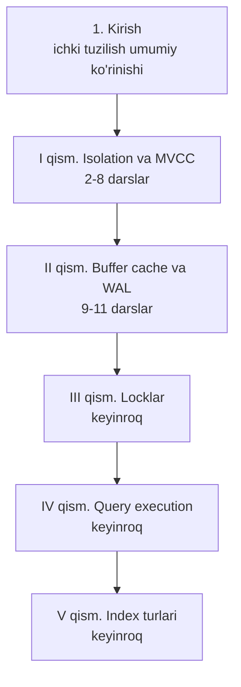

# 📕 Advanced PostgreSQL — darslik

> 📖 Asosiy manba: Егор Рогов — **"PostgreSQL 17 изнутри"** (ДМК Пресс, 2025, 668 sah.) — `postgresql_internals-17.pdf`
> Qo'shimcha manba: `2. Database/2. Postgres/` papkasidagi mavjud internals konspektlari

Bu kurs **`1. Basic PostgreSQL`** kursini tugatganlar uchun — PostgreSQL'ning **ichki mexanizmlarini** chuqur o'rganamiz: MVCC, VACUUM, buffer cache, WAL, locklar, query execution va index internals.

## 🗺 Kurs tuzilishi (kitob qismlari bo'yicha)

## 📚 Darslar ro'yxati

### Kirish

| # | Dars | Kitob bobi | Mavzular |
|---|------|-----------|----------|
| 1 | Kirish — PostgreSQL ichki tuzilishi | 1-bob | Database/system catalog/schema/tablespace, relation, fork va fayllar, page, TOAST, process va memory arxitekturasi, client-server protokol |

### I qism — Isolation va ko'p versiyalilik (MVCC)

| # | Dars | Kitob bobi | Mavzular |
|---|------|-----------|----------|
| 2 | Isolation | 2-bob | Anomaliyalar, standart va PostgreSQL'dagi isolation levellar, qaysi levelni tanlash |
| 3 | Page va row versiyalari | 3-bob | Page tuzilishi, tuple header, xmin/xmax, MVCC amalda |
| 4 | Snapshotlar | 4-bob | Snapshot nima, xid ufqlari, ko'rinish qoidalari |
| 5 | Page ichi tozalash va HOT updatelar | 5-bob | In-page vacuum, HOT chain |
| 6 | VACUUM va autovacuum | 6-bob | Vacuum jarayoni, visibility map, autovacuum sozlash |
| 7 | Freezing | 7-bob | Transaction ID wraparound, muzlatish mexanizmi |
| 8 | Table va indexlarni qayta qurish | 8-bob | VACUUM FULL, REINDEX, pg_repack g'oyasi, bloat |

### II qism — Buffer cache va WAL

| # | Dars | Kitob bobi | Mavzular |
|---|------|-----------|----------|
| 9 | Buffer cache | 9-bob | Cache tuzilishi, eviction, shared_buffers sozlash |
| 10 | WAL — Write-Ahead Log | 10-bob | WAL nima, LSN, checkpoint, recovery |
| 11 | WAL rejimlari | 11-bob | Synchronous/asynchronous commit, fsync, WAL levellari |

### Keyingi qismlar (rejada)

- **III qism — Locklar** (12–15-boblar): relation lock, row lock, deadlock, memory locklar
- **IV qism — Query execution** (16–23-boblar): bajarilish bosqichlari, statistika, scan/join methodlari, hashing, sorting
- **V qism — Index turlari** (24–29-boblar): Hash, B-tree, GiST, SP-GiST, GIN, BRIN
- Qo'shimcha: partitioning, replication, sharding, full-text search, PL/pgSQL, backup/recovery

## 🎯 Qanday o'qish kerak?

1. Avval **`1. Basic PostgreSQL`** kursini tugatgan bo'lishingiz shart.
2. Darslarni tartib bilan o'qing — MVCC tushunchalari bir-biriga qatlam-qatlam quriladi.
3. Darslardagi eksperimentlarni (pageinspect, pg_visibility kabi extensionlar bilan) o'z bazangizda takrorlab ko'ring.
4. Har dars oxiridagi Nazorat savollariga javob bering.
