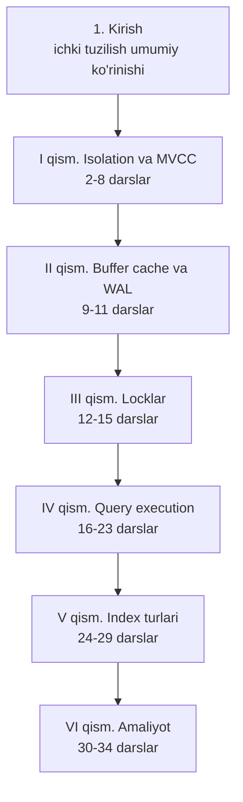

# 📕 Advanced PostgreSQL — darslik

> 📖 Asosiy manba: Егор Рогов — **"PostgreSQL 17 изнутри"** (ДМК Пресс, 2025, 668 sah.) — `postgresql_internals-17.pdf`
> Kitobning barcha 29 bobi darslarga aylantirilgan (1–29-darslar) + amaliyot uchun zarur 5 ta qo'shimcha dars (30–34).

Bu kurs **`1. Basic PostgreSQL`** kursini tugatganlar uchun — PostgreSQL'ning **ichki mexanizmlarini** chuqur o'rganamiz: MVCC, VACUUM, buffer cache, WAL, locklar, query execution, index internals, hamda partitioning, replication, backup va scaling.

## 🗺 Kurs tuzilishi

## 📚 Darslar ro'yxati

### Kirish

| # | Dars | Kitob bobi | Mavzular |
|---|------|-----------|----------|
| 1 | Kirish — PostgreSQL ichki tuzilishi | 1-bob | Database/system catalog/schema/tablespace, relation, fork va fayllar, page, TOAST, process va memory arxitekturasi, client-server protokol |

### I qism — Isolation va ko'p versiyalilik (MVCC)

| # | Dars | Kitob bobi | Mavzular |
|---|------|-----------|----------|
| 2 | Isolation — chuqur | 2-bob | Anomaliyalar, standart va PostgreSQL'dagi isolation levellar, qaysi levelni tanlash |
| 3 | Page va row versiyalari | 3-bob | Page tuzilishi, tuple header, xmin/xmax, MVCC amalda, virtual va nested transactionlar |
| 4 | Snapshotlar | 4-bob | Snapshot nima, xid ufqlari, ko'rinish qoidalari |
| 5 | Page ichi tozalash va HOT updatelar | 5-bob | In-page vacuum, HOT chain |
| 6 | VACUUM va autovacuum | 6-bob | Vacuum jarayoni, visibility map, autovacuum sozlash |
| 7 | Freezing | 7-bob | Transaction ID wraparound, muzlatish mexanizmi, 4 ta yosh parametri |
| 8 | Table va indexlarni qayta qurish | 8-bob | Bloat, VACUUM FULL, CLUSTER, REINDEX, pg_repack, profilaktika |

### II qism — Buffer cache va WAL

| # | Dars | Kitob bobi | Mavzular |
|---|------|-----------|----------|
| 9 | Buffer cache | 9-bob | Cache tuzilishi, eviction, shared_buffers sozlash |
| 10 | WAL — Write-Ahead Log | 10-bob | LSN, jurnal tuzilishi, checkpoint, recovery, background writer |
| 11 | WAL rejimlari | 11-bob | Synchronous/asynchronous commit, fsync, checksums, minimal/replica/logical levellar |

### III qism — Locklar

| # | Dars | Kitob bobi | Mavzular |
|---|------|-----------|----------|
| 12 | Relation locklar | 12-bob | Heavyweight locklar, 8 rejim va compatibility matrix, pg_locks, kutish navbati |
| 13 | Row locklar | 13-bob | Tuple headerdagi locklar, 4 rejim, multitransaction, NOWAIT/SKIP LOCKED, deadlock |
| 14 | Boshqa obyekt locklari | 14-bob | Object/extension/page locklar, advisory locklar, predicate locklar (SSI) |
| 15 | Memory locklar | 15-bob | Spinlock, LWLock, SLRU, wait eventlar orqali monitoring |

### IV qism — Query execution

| # | Dars | Kitob bobi | Mavzular |
|---|------|-----------|----------|
| 16 | Query bajarilish bosqichlari | 16-bob | Parse → transform → plan → execute, EXPLAIN o'qish, prepared statementlar, cursorlar |
| 17 | Statistika | 17-bob | pg_statistic, MCV, gistogramma, selectivity, multivariate statistika |
| 18 | Table access methodlar | 18-bob | Pluggable storage, seq scan cost formulasi, parallel planlar |
| 19 | Index access methodlar | 19-bob | Index AM interfeysi, operator class/family, index xususiyatlari |
| 20 | Index scan | 20-bob | Index scan cost va correlation, index only scan, bitmap scan, taqqoslash |
| 21 | Nested loop join | 21-bob | Logik JOIN vs fizik join, parametrized join, memoize, semi/anti join |
| 22 | Hashing | 22-bob | Hash join (one-pass/two-pass), parallel hash, HashAggregate |
| 23 | Sortlash va merge join | 23-bob | Merge join, sortlash usullari, incremental sort, uch join usulini taqqoslash |

### V qism — Index turlari

| # | Dars | Kitob bobi | Mavzular |
|---|------|-----------|----------|
| 24 | Hash index | 24-bob | Bucket/overflow pagelar, faqat tenglik qidiruvi, B-tree bilan taqqoslash |
| 25 | B-tree | 25-bob | Balanced tree, page split, deduplication, composite indexlar, ORDER BY |
| 26 | GiST index | 26-bob | R-tree, k-NN qidiruv, exclusion constraint, full-text search (RD-tree) |
| 27 | SP-GiST index | 27-bob | Space partitioning, quadtree, k-d tree, radix tree |
| 28 | GIN index | 28-bob | Inverted index, FTS, pg_trgm (LIKE tezlashtirish), array va JSONB indexlash |
| 29 | BRIN index | 29-bob | Zone xulosalari, append-only tablelar, minmax/bloom, **6 index turi yakuniy taqqoslash** |

### VI qism — Amaliyot (qo'shimcha darslar)

| # | Dars | Mavzular |
|---|------|----------|
| 30 | Partitioning | RANGE/LIST/HASH, partition pruning, ATTACH/DETACH, pg_partman |
| 31 | Replication | Streaming replication, slotlar, sync/async, logical replication, failover |
| 32 | Backup va recovery | pg_dump, pg_basebackup, PITR, incremental backup (v17), pgBackRest |
| 33 | Scaling — sharding, OLTP va OLAP | Connection pooling (PgBouncer), read scaling, Citus, FDW, columnar storage |
| 34 | PL/pgSQL va server dasturlash | Function/procedure, triggerlar, dinamik SQL, volatility, best practices |

## 🎯 Qanday o'qish kerak?

1. Avval **`1. Basic PostgreSQL`** kursini tugatgan bo'lishingiz shart.
2. Darslarni tartib bilan o'qing — MVCC tushunchalari bir-biriga qatlam-qatlam quriladi.
3. Darslardagi eksperimentlarni (pageinspect, pg_visibility kabi extensionlar bilan) o'z bazangizda takrorlab ko'ring. 16-darsdan boshlab [demo baza](https://postgrespro.ru/education/demodb) kerak bo'ladi.
4. Har dars oxiridagi Nazorat savollariga javob bering.
5. Kurs tugagach `/quiz postgres` bilan bilimingizni tekshiring.
