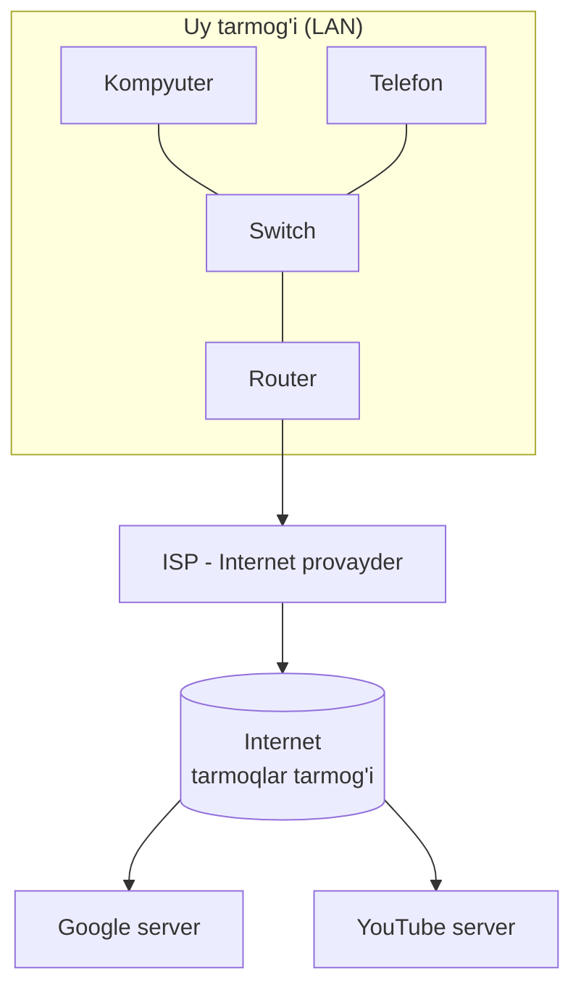
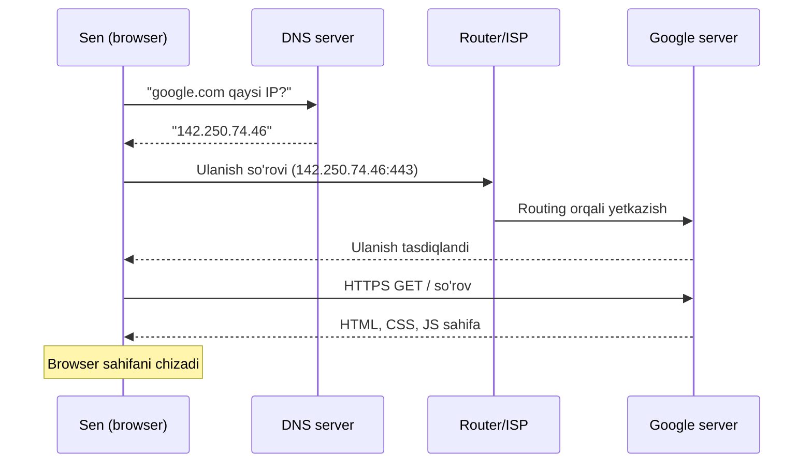
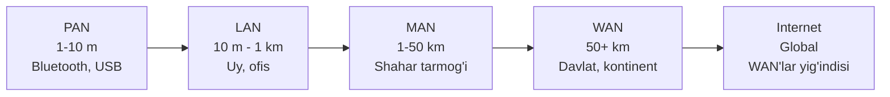
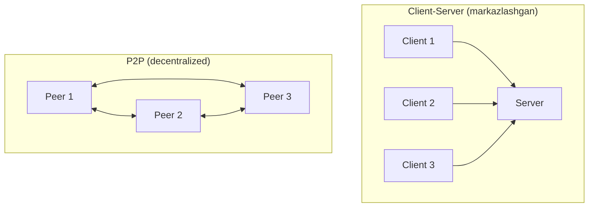
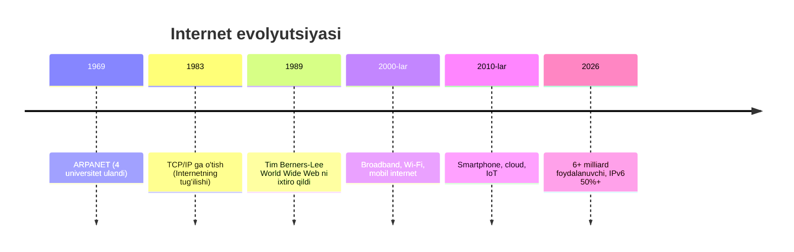

# 01. Tarmoq va Internet nima?

## Muammo: yolg'iz kompyuter — soqov kompyuter

Tasavvur qil: senda dunyodagi eng kuchli kompyuter bor, lekin u hech qanday
tarmoqqa ulanmagan. Sen unda YouTube ocholmaysan, do'stingga xabar yubora
olmaysan, Google'da qidiruv qilolmaysan. U shunchaki qimmat kalkulyator. Kompyuterning
haqiqiy kuchi **boshqa kompyuterlar bilan gaplasha olishida**.

Mana shu "gaplasha olish" imkoniyatini beradigan narsa — **network** (tarmoq).
Bu darsda biz "tarmoq nima", "Internet nima" va "ular qanday farq qiladi"
degan savollarga javob beramiz — bu butun kurs uchun poydevor.

---

## Analogiya: telefon kitobi va pochta tizimi

Tasavvur qil, bir shahar odamlari bir-biri bilan xat orqali gaplashadi:

- Har bir uyning **manzili** bor (ko'cha, uy raqami) — bu **IP address**ga o'xshaydi.
- Har bir odamning **ismi** bor — bu **MAC address**ga o'xshaydi (qurilmaning shaxsiy raqami).
- **Pochtachi** xatni to'g'ri uyga yetkazadi — bu **router**ning ishi.
- **Pochta bo'limi** xatlarni saralab, keyingi shaharga jo'natadi — bu **switch/router** vazifasi.

Analogiya chegarasi: xat qog'ozda ketadi, tarmoqda esa **bit**lar (0 va 1)
elektr, yorug'lik yoki radio to'lqin ko'rinishida uchadi. Lekin "manzil bo'yicha
yetkazish" g'oyasi aynan bir xil.

---

## Sodda ta'rif

> **Network (tarmoq)** — bu bir-biri bilan ma'lumot almashish uchun ulangan
> qurilmalar (computer, smartphone, server, sensor) majmuasi.
>
> **Internet** — bu "tarmoqlarning tarmog'i" (network of networks): dunyo bo'ylab
> millionlab kichik tarmoq bir-biriga ulanib hosil qilgan ulkan tizim.

Tarmoq ishlashi uchun qurilmalar **protocol** (kelishilgan qoidalar to'plami)
bo'yicha "bir tilda" gaplashishlari shart. Protocol haqida keyingi darsda batafsil.

---

## Diagramma: qurilmadan Internetgacha

Eng oddiy holatdan boshlaymiz — ikkita kompyuter — va bosqichma-bosqich
Internetgacha kengaytiramiz.



Bu yerda:

- **Switch** — bitta bino/uy ichidagi qurilmalarni **MAC address** orqali bog'laydi.
- **Router** — turli tarmoqlarni **IP address** orqali bog'laydi va tashqariga chiqaradi.
- **ISP** (Internet Service Provider) — seni Internetning qolgan qismiga ulaydi.

---

## Notional machine: qurilmalar qanday "topishadi"?

Kod ortida nima sodir bo'lishini tushunaylik. Ikki kompyuter ma'lumot
almashishi uchun bir-birini **topa olishi** kerak. Buning uchun ikki xil manzil bor:

| Manzil turi | Nima | Analogiya | Qayerda ishlaydi |
|-------------|------|-----------|------------------|
| **MAC address** | Tarmoq kartasining fizik raqami (48 bit, `aa:bb:cc:dd:ee:ff`) | Odamning ismi | Lokal tarmoq ichida (Layer 2) |
| **IP address** | Mantiqiy manzil (`192.168.1.5`) | Uy manzili | Tarmoqlar orasida (Layer 3) |

Switch "qaysi portda qaysi MAC bor" degan jadval tutadi. Router esa "qaysi
IP qaysi yo'nalishga ketishi kerak" degan **routing table** tutadi. Bu ikki
jadval — tarmoqning "miya"si.

---

## Worked example: "google.com ga kirganda nima bo'ladi?"

Bu savol — Internetni tushunishning eng yaxshi yo'li. Juda yuqori darajadan
qadam-baqadam ko'ramiz (har birini keyingi modullarda chuqurlashtiramiz).



**Bosqichlar (subgoal label'lar bilan):**

```text
// --- 1-qadam: Nom -> IP (DNS lookup) ---
"google.com" matni "142.250.74.46" IP raqamiga aylanadi.
Bu Internetning telefon kitobi.

// --- 2-qadam: Ulanish o'rnatish (TCP handshake) ---
Sening qurilmang va Google serveri o'rtasida ishonchli kanal ochiladi.

// --- 3-qadam: Xavfsiz kanal (TLS handshake) ---
HTTPS uchun shifrlangan tunnel yaratiladi, sertifikat tekshiriladi.

// --- 4-qadam: So'rov (HTTP GET) ---
Browser "menga bosh sahifani ber" deydi.

// --- 5-qadam: Javob (HTTP response) ---
Google HTML, CSS, JS qaytaradi.

// --- 6-qadam: Render ---
Browser sahifani ekranga chizadi.
```

Butun jarayon odatda **100-500 millisekund** ichida tugaydi.

---

## Internet vs Intranet vs Extranet

Ko'pincha bu uch atama chalkashtiriladi. Farqi — **kim kira oladi**:

| Atama | Kim foydalanadi | Misol |
|-------|-----------------|-------|
| **Internet** | Hamma (public) | google.com, youtube.com |
| **Intranet** | Faqat tashkilot ichidagi xodimlar | Kompaniya HR portali |
| **Extranet** | Tashkilot + ishonchli sheriklar | B2B hamkor portali |

Texnik jihatdan uchalasi ham bir xil TCP/IP protokolidan foydalanadi — farq
faqat **kirish (access)** darajasida.

---

## Tarmoq turlari — masshtab bo'yicha

Tarmoqlar geografik kattaligi (radiusi) bo'yicha tasniflanadi. Kichikdan
kattaga qarab:



- **PAN** (Personal Area Network) — telefon va simsiz quloqchin orasidagi ulanish.
- **LAN** (Local Area Network) — uy yoki ofis, Ethernet va Wi-Fi. Tezlik 1-10 Gbit/s.
- **MAN** (Metropolitan Area Network) — bitta shahar bo'ylab, optik tola.
- **WAN** (Wide Area Network) — davlat yoki kontinent, backbone tarmoqlar.
- **Internet** — WAN'larning global birikmasi.

---

## Ikki arxitektura: Client-Server va P2P

Tarmoqda ma'lumot almashishning ikki asosiy modeli bor:



| Xususiyat | Client-Server | P2P |
|-----------|---------------|-----|
| Boshqaruv | Markazlashgan | Tarqoq (decentralized) |
| Ishonchlilik | Server o'lsa, hammasi to'xtaydi | Bitta peer o'lsa, boshqalari ishlaydi |
| Misol | google.com, Telegram | BitTorrent, Bitcoin, IPFS |

---

## Qisqa tarix: qanday boshlandi?



Birinchi ARPANET xabari "LOGIN" bo'lishi kerak edi, lekin tizim "LO" dan keyin
crash bo'lgan. Shu "LO" — Internetning birinchi xabari.

**2026 statistikasi:** dunyoda **6.04 milliarddan ortiq** odam Internetdan
foydalanadi — bu global aholining **73.2%** i.

---

## Ko'p uchraydigan xatolar

⚠️ **Xato 1:** "Internet va World Wide Web (WWW) bir narsa."
Noto'g'ri. **Internet** — bu fizik infratuzilma (kabellar, routerlar, protokollar).
**WWW** — bu Internet ustida ishlaydigan bitta xizmat (web sahifalar, HTTP).
Email, video call, o'yinlar — ham Internet, lekin WWW emas.

⚠️ **Xato 2:** "IP address = MAC address."
Noto'g'ri. MAC — o'zgarmas fizik raqam (ism kabi), IP — o'zgaruvchan mantiqiy
manzil (uy manzili kabi). Bir noutbukni boshqa Wi-Fi'ga ulasang, IP o'zgaradi,
MAC esa o'sha bo'lib qoladi.

⚠️ **Xato 3:** "Router va switch bir xil."
Noto'g'ri. Switch — bitta tarmoq ichida (MAC, Layer 2), router — tarmoqlar
orasida (IP, Layer 3). Uy routeri odatda ikkalasini birga bajaradi.

---

## Xulosa

- **Network** — ulangan qurilmalar majmuasi; **Internet** — tarmoqlarning tarmog'i.
- Qurilmalar bir-birini ikki manzil orqali topadi: **MAC** (lokal) va **IP** (global).
- **Switch** — MAC bilan lokal, **router** — IP bilan tarmoqlararo ishlaydi.
- Tarmoqlar masshtab bo'yicha: **PAN < LAN < MAN < WAN < Internet**.
- Ikki arxitektura: **Client-Server** (markazlashgan) va **P2P** (tarqoq).
- **Internet ≠ WWW**: WWW — Internet ustidagi bitta xizmat.
- 2026-yilda 6+ milliard foydalanuvchi, IPv6 ulushi 50% dan oshdi.

---

## 🧠 Eslab qol

- Internet — bu tashkilot emas, **tarmoqlarning tarmog'i**.
- MAC = ism (o'zgarmas), IP = manzil (o'zgaruvchan).
- Switch lokal (MAC), router global (IP).
- WWW — Internetning bir qismi, uning o'zi emas.

---

## ✅ O'z-o'zini tekshir

<details>
<summary>1. Nega yolg'iz, hech qayerga ulanmagan kompyuter "soqov" hisoblanadi?</summary>

Chunki kompyuterning kuchi ko'p vazifalarda **boshqa kompyuterlar bilan
ma'lumot almashishida**. Tarmoqsiz u YouTube, qidiruv, xabar almashish kabi
xizmatlarni bajarolmaydi — faqat lokal hisob-kitob qiladi.
</details>

<details>
<summary>2. Bir noutbukni uydagi Wi-Fi'dan kafedagi Wi-Fi'ga ko'chirsang, MAC va IP'dan qaysi biri o'zgaradi?</summary>

**IP address o'zgaradi** (har bir tarmoq o'z IP oralig'ini beradi),
**MAC address esa o'sha bo'lib qoladi** (u tarmoq kartasiga "yopishtirilgan"
fizik raqam). Shuning uchun IP — mantiqiy, MAC — fizik manzil deyiladi.
</details>

<details>
<summary>3. "Internet" bilan "WWW" ning farqi nima?</summary>

Internet — bu fizik infratuzilma va protokollar to'plami (barcha kabellar,
routerlar, TCP/IP). WWW — bu Internet **ustida** ishlaydigan bitta xizmat
(HTTP orqali web sahifalar). Email yoki Telegram — Internet, lekin WWW emas.
</details>

<details>
<summary>4. Nega uy routeri ham switch, ham router vazifasini bajaradi?</summary>

Chunki u ikki ishni birga qiladi: (1) uy ichidagi qurilmalarni bir-biriga
ulaydi (switch vazifasi, MAC bilan), (2) uy tarmog'ini Internetga chiqaradi
(router vazifasi, IP bilan). Shuning uchun uni "home gateway" ham deyishadi.
</details>

---

## 🛠 Amaliyot

1. **Oson (kuzatish):** O'z qurilmangda IP va MAC address'ni top.
   - Windows: `ipconfig /all`
   - Linux/Mac: `ip addr` yoki `ifconfig`

   <details><summary>Hint</summary>MAC — "physical address" yoki "ether"
   yonida `xx:xx:xx:xx:xx:xx` ko'rinishida. IP — "IPv4 Address" yonida
   `192.168...` ko'rinishida.</details>

2. **O'rta (chizish):** O'z uying tarmog'ini qog'ozga chiz: qaysi qurilmalar
   switch'ga, router'ga ulangan, qayer ISP'ga chiqadi. PAN/LAN/WAN chegaralarini belgila.

   <details><summary>Hint</summary>Telefon-quloqchin = PAN, uy Wi-Fi = LAN,
   router'dan keyin ISP orqali = WAN/Internet.</details>

3. **Qiyin (tahlil):** `traceroute google.com` (Windows: `tracert`) buyrug'ini
   ishga tushir va natijadagi har bir "hop"ni oldingi diagramma bilan solishtir.
   Qaysi hop uy routeri, qaysi biri ISP, qaysi biri xalqaro ekanini aniqlashga urin.

   <details><summary>Hint</summary>Birinchi qator odatda `192.168.x.x` —
   uy routering. Keyingilar ISP ichki manzillari, so'ng public IP'lar.</details>

---

## 🔁 Takrorlash

- **Bog'liq keyingi darslar:** [02-protokol-nima](02-protokol-nima.md),
  [03-access-networks](03-access-networks.md).
- **Takrorlash jadvali:** ertaga → 3 kundan keyin → 1 haftadan keyin yuqoridagi
  "O'z-o'zini tekshir" savollariga qaytib javob ber.
- **Feynman testi:** "Internet nima?" degan savolga bir do'stingga **kod va
  jargon ishlatmasdan, 3 jumlada** tushuntirib ber. Agar tushuntirolsang —
  o'zlashtirding.

---

## 📚 Manbalar

- Kurose & Ross, *Computer Networking: A Top-Down Approach*, 1-bob
- [22 Internet Usage Statistics 2026 — DemandSage](https://www.demandsage.com/internet-user-statistics/)
- [18 Years Later, IPv6 Reaches Majority — ISOC Pulse](https://pulse.internetsociety.org/en/blog/2026/04/18-years-later-ipv6-reaches-majority/)
- [Internet Statistics and Facts 2026 — ElectroIQ](https://electroiq.com/stats/internet-statistics/)
- [Brief History of the Internet — Internet Society](https://www.internetsociety.org/internet/history-internet/brief-history-internet/)
