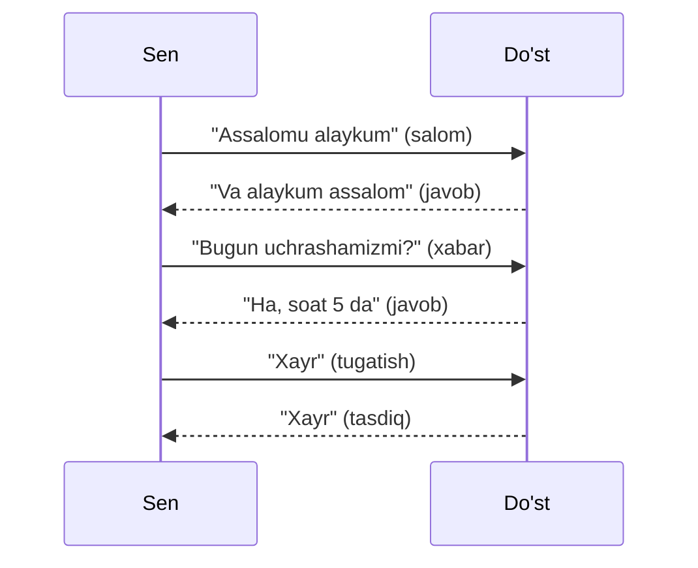
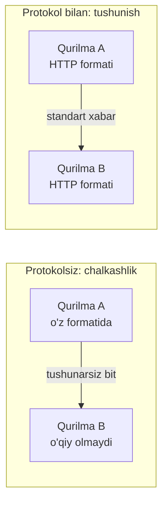
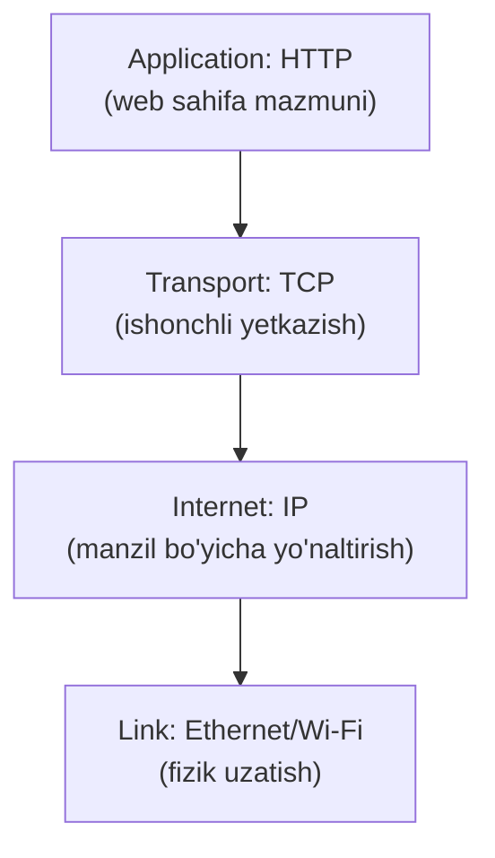

# 02. Protocol nima?

## Muammo: ikki qurilma qanday "kelishadi"?

Oldingi darsda ([01-tarmoq-va-internet-nima](01-tarmoq-va-internet-nima.md))
biz qurilmalar bir-birini MAC va IP orqali **topa oladi** deb aytdik. Lekin
topish yetarli emas. Aytaylik, sening telefoning Google serveriga bit'lar
oqimini yubordi. Server bu 0 va 1 larni **qanday tushunadi**? Qaysi bit'lar
manzil, qaysilari xabar, qaysilari xatolik tekshiruvi?

Agar ikki taraf oldindan **umumiy qoidalarga** kelishmagan bo'lsa, ma'lumot
shunchaki tushunarsiz shovqin bo'lib qoladi. Mana shu umumiy qoidalar to'plami —
**protocol**.

---

## Analogiya: telefon suhbati

Do'stingga qo'ng'iroq qilganingni eslab ko'r. Suhbat quyidagi "qoidalar"
bo'yicha boradi:



Bu yerda yozilmagan, lekin hamma biladigan qoidalar bor:

- Avval **salomlashamiz** (ulanish o'rnatish).
- Bir kishi gapiradi, ikkinchisi **tinglaydi** (navbat).
- Tushunmasang **"nima dedingiz?"** deb qayta so'raysan (xatoni tuzatish).
- Oxirida **xayrlashamiz** (ulanishni yopish).

**Aynan shu** — protocol. Kompyuterlar ham xuddi shunday oldindan kelishilgan
"muomala odobi" bo'yicha gaplashadi.

Analogiya chegarasi: odamlar qoidani buzsa ham gapni tushunishi mumkin,
kompyuterlar esa qoidani **millimetrigacha** bajarishi shart — bitta bit
noto'g'ri bo'lsa, butun xabar rad etilishi mumkin.

---

## Sodda ta'rif

> **Protocol** — bu ikki (yoki undan ortiq) qurilma o'rtasida ma'lumot
> almashishning **formatini**, **tartibini** va **harakatlarini** belgilovchi
> qoidalar to'plami.

Har bir protocol kamida uch narsani aniqlaydi:

1. **Sintaksis (format)** — xabar qanday tuzilishi kerak (qaysi bit nimani anglatadi).
2. **Semantika (ma'no)** — har bir maydon nimani bildiradi, xato bo'lsa nima qilinadi.
3. **Vaqtlash (timing)** — kim qachon gapiradi, qancha kutadi.

---

## Diagramma: bir xil format bo'lmasa nima bo'ladi?



Protocol — bu **umumiy til**. Ikki taraf ham bir xil "grammatika"ni bilsa,
ma'lumot to'g'ri o'qiladi.

---

## Worked example: HTTP protokoli "yalang'och" ko'rinishda

HTTP — web'ning asosiy protokoli. U aslida oddiy **matn** almashinuvi.
Quyida telefoning serverga yuboradigan haqiqiy HTTP so'rovi:

```http
GET /index.html HTTP/1.1
Host: example.com
User-Agent: curl/8.0
Accept: text/html
```

Server esa quyidagicha javob qaytaradi:

```http
HTTP/1.1 200 OK
Content-Type: text/html
Content-Length: 138

<html><body>Salom, dunyo!</body></html>
```

Har bir qatorni protocol qoidalari bo'yicha o'qiymiz (subgoal label'lar bilan):

```text
// --- 1-qadam: So'rov qatori (request line) ---
GET  -> nima qilamiz (metod: o'qish)
/index.html -> qaysi resurs
HTTP/1.1 -> protocol versiyasi

// --- 2-qadam: Header'lar (kalit: qiymat) ---
Host -> qaysi saytga
User-Agent -> qanday dastur so'rayapti

// --- 3-qadam: Javob holati (status line) ---
200 OK -> muvaffaqiyat (404 -> topilmadi, 500 -> server xatosi)

// --- 4-qadam: Bo'sh qator + tana (body) ---
Bo'sh qatordan keyin haqiqiy kontent boshlanadi.
```

Sen buni o'zing sinab ko'rishing mumkin: `curl -v http://example.com`.

**Diqqat qil:** bu yerda hech qanday "sehr" yo'q — shunchaki ikki taraf
kelishgan matn formati. Protocolning butun kuchi mana shu **kelishilgan
formatda**.

---

## 🤔 O'ylab ko'r

Agar client `GET /index.html HTTP/1.1` o'rniga `OLIB-KEL /index.html` deb
yuborsa, server nima qiladi?

<details>
<summary>💡 Javobni ko'rish</summary>

Server buni tushunmaydi va odatda **400 Bad Request** xatosi qaytaradi (yoki
umuman javob bermaydi). Chunki `OLIB-KEL` HTTP protokolida mavjud metod emas.
HTTP faqat `GET`, `POST`, `PUT`, `DELETE` kabi **oldindan kelishilgan**
so'zlarni tushunadi. Bu — protokolning "sintaksis" qoidasini buzish.
</details>

---

## Protocol layering: nega bitta emas, ko'p protocol?

Bitta ulkan protocol yozib, hamma ishni unga yuklash mumkin edi. Lekin bu
juda mo'rt bo'lardi — bitta narsa o'zgarsa, hammasini qayta yozish kerak.
Buning o'rniga Internet **qatlamlarga (layers)** bo'lingan protokollardan
foydalanadi. Har bir qatlam bitta ishni bajaradi va pastdagisiga tayanadi.



**Analogiya (pochta):**

- **Sen** xat yozasan (HTTP — mazmun).
- **Konvert va manzil** — kim kimga (IP).
- **Pochta xizmati** — ishonchli yetkazish, yo'qolsa qayta jo'natish (TCP).
- **Yuk mashinasi/samolyot** — fizik tashish (Ethernet/Wi-Fi).

Sen xat yozayotganda samolyot qanday uchishini bilishing shart emas. Xuddi
shunday, HTTP yozgan dasturchi TCP yoki Ethernet qanday ishlashini bilmasa
ham bo'ladi. Bu — **layering**ning bosh foydasi: har bir qatlamni alohida
o'zgartirish mumkin.

> **Oltin qoida:** har bir layer o'zidan **pastdagi** layer xizmatidan
> foydalanadi va o'zidan **yuqoridagi** layer'ga xizmat ko'rsatadi — qo'shnisi
> qanday ishlashini bilmasdan.

---

## RFC: protokollarning "rasmiy kitobi"

Protokollar kim tomonidan yoziladi? Ularni **IETF** (Internet Engineering
Task Force) degan tashkilot **RFC** (Request For Comments) hujjatlari orqali
standartlashtiradi.

- **RFC** — bu har bir protokolning rasmiy, ochiq spetsifikatsiyasi.
- Bugun **9000 dan ortiq** RFC mavjud.
- Masalan: **RFC 791** — IP, **RFC 9293** — TCP, **RFC 9110** — HTTP, **RFC 9114** — HTTP/3.
- Asosiy Internet arxitekturasi **RFC 1122** va **RFC 1123** da 4 qatlamli
  model sifatida ta'riflangan va IETF bu tuzilmani hech qachon o'zgartirmagan.

IETF ning mashhur shiori bu falsafani yaxshi ifodalaydi:

> "We reject kings, presidents, and voting. We believe in rough consensus and
> running code." — David Clark
>
> (Ya'ni: shohlar, prezidentlar va ovoz berishni rad etamiz. Biz taxminiy
> kelishuv va **ishlaydigan kod**ga ishonamiz.)

Aynan shu "avval ishlaydigan kod" falsafasi tufayli TCP/IP protokollari
akademik OSI modelidan tezroq tarqaldi — bu haqda [08-tcpip-modeli-va-encapsulation](08-tcpip-modeli-va-encapsulation.md) darsida.

---

## Ko'p uchraydigan xatolar

⚠️ **Xato 1:** "Protocol — bu dastur (software)."
Noto'g'ri. Protocol — bu **qoidalar to'plami** (spetsifikatsiya, RFC).
Dastur (masalan, nginx, Chrome) — bu shu qoidalarni **amalga oshiruvchi**
kod. Bitta protokolni yuzlab turli dastur amalga oshirishi mumkin.

⚠️ **Xato 2:** "HTTP va HTTPS — butunlay boshqa protokollar."
To'liq to'g'ri emas. HTTPS — bu **HTTP + TLS** (shifrlash qatlami).
So'rovlar formati bir xil, faqat ular shifrlangan tunnel ichida ketadi.

⚠️ **Xato 3:** "Layering — bu ortiqcha murakkablik, tezlikni sekinlashtiradi."
Qisman to'g'ri (biroz overhead bor), lekin foydasi ancha katta: har bir
qatlamni mustaqil rivojlantirish, xatoni izolyatsiya qilish va turli
texnologiyalarni aralashtirish mumkin bo'ladi. Bu — muhandislikning eng
muhim tamoyillaridan biri.

---

## Xulosa

- **Protocol** — qurilmalar o'rtasidagi ma'lumot almashishning umumiy qoidalari.
- Har bir protocol uch narsani belgilaydi: **format**, **ma'no**, **vaqtlash**.
- Protokolsiz bit'lar shunchaki tushunarsiz shovqin bo'lib qoladi.
- Internet **qatlamli (layered)** protokollardan foydalanadi: har biri bitta ish.
- **Layering** har qatlamni mustaqil o'zgartirishga imkon beradi.
- Protokollar **RFC** hujjatlarida IETF tomonidan standartlashtiriladi.
- Protocol ≠ dastur: protocol — qoida, dastur — uni bajaruvchi kod.

---

## 🧠 Eslab qol

- Protocol = umumiy til va muomala odobi (salom → xabar → xayr).
- Har protocol 3 narsani belgilaydi: format, ma'no, vaqtlash.
- Layering: har qatlam bitta ish, qo'shnisini bilmaydi.
- RFC — protokolning rasmiy kitobi, IETF chiqaradi.

---

## ✅ O'z-o'zini tekshir

<details>
<summary>1. Nima uchun ikki qurilma bir-birini "topsa" ham, protokolsiz gaplasha olmaydi?</summary>

Chunki "topish" (manzilni bilish) — bu faqat kimga yuborishni aniqlaydi.
Lekin **qanday** yuborish — bit'lar formati, tartibi, ma'nosi — protokol
tomonidan belgilanadi. Umumiy format bo'lmasa, qabul qiluvchi kelgan 0 va 1
larni tushunarsiz shovqin sifatida ko'radi.
</details>

<details>
<summary>2. HTTP so'rovida birinchi qator (`GET /index.html HTTP/1.1`) nima uchun muhim?</summary>

U uchta muhim narsani bir joyda beradi: (1) **metod** — nima qilish kerak
(GET = o'qish), (2) **resurs** — qaysi fayl/sahifa, (3) **versiya** — qaysi
HTTP qoidalari bo'yicha. Server bularsiz nima qilishni bilmaydi.
</details>

<details>
<summary>3. Nega bitta ulkan protokol o'rniga ko'p qatlamli protokollar ishlatiladi?</summary>

Chunki layering har bir qatlamni **mustaqil** o'zgartirishga imkon beradi.
Masalan, Wi-Fi'dan Ethernet'ga o'tsang, faqat link qatlam o'zgaradi —
HTTP, TCP, IP tegilmaydi. Bitta ulkan protokolda esa har o'zgarish hammasini
qayta yozishni talab qilardi. Bu — muhandislikda "separation of concerns".
</details>

<details>
<summary>4. RFC nima va nega u muhim?</summary>

RFC (Request For Comments) — IETF chiqaradigan protokolning rasmiy, ochiq
spetsifikatsiyasi. U muhim, chunki har kim uni o'qib, protokolni bir xil
tarzda amalga oshirishi mumkin — shu tufayli turli ishlab chiqaruvchilarning
qurilmalari bir-biri bilan muammosiz gaplashadi.
</details>

---

## 🛠 Amaliyot

1. **Oson (kuzatish):** Terminalda `curl -v http://example.com` ishga tushir.
   Chiqishda `>` bilan boshlangan qatorlar — sening so'roving, `<` bilan —
   server javobi. Salom-javob almashinuvini o'z ko'zing bilan ko'r.

   <details><summary>Hint</summary>`-v` (verbose) bayrog'i barcha HTTP
   header'larni ko'rsatadi. Status qatorini (`HTTP/1.1 200 OK`) top.</details>

2. **O'rta (to'ldirish):** Quyidagi HTTP so'rov skeletini to'ldir:
   ```http
   GET /about HTTP/1.1
   // TODO: qaysi saytga so'rayapmiz? (Host header qo'sh)
   // TODO: qanday format javob kutamiz? (Accept header qo'sh)
   ```
   <details><summary>Hint</summary>`Host: example.com` va
   `Accept: text/html` qo'sh.</details>

3. **Qiyin (loyihalash):** Do'sting bilan ikkovingiz uchun kichik "salom"
   protokoli o'ylab top: qanday xabar bilan boshlanadi, javob qanday,
   xato bo'lsa qanday bildiriladi, qanday tugaydi. Uni HTTP kabi matn
   formatida qog'ozga yoz.

   <details><summary>Hint</summary>Kamida 3 xabar turini belgila: HELLO,
   MESSAGE, BYE. Har biriga format va kutilgan javobni yoz.</details>

---

## 🔁 Takrorlash

- **Bog'liq darslar:** [01-tarmoq-va-internet-nima](01-tarmoq-va-internet-nima.md),
  [07-osi-modeli](07-osi-modeli.md), [08-tcpip-modeli-va-encapsulation](08-tcpip-modeli-va-encapsulation.md).
- **Takrorlash jadvali:** ertaga → 3 kundan keyin → 1 haftadan keyin savollarga qayt.
- **Feynman testi:** "Protocol nima?" degan savolga do'stingga kod ishlatmasdan,
  telefon suhbati analogiyasi orqali 3 jumlada tushuntir.

---

## 📚 Manbalar

- Kurose & Ross, *Computer Networking: A Top-Down Approach*, 1-bob (protocol layering)
- [Internet protocol suite — Wikipedia](https://en.wikipedia.org/wiki/Internet_protocol_suite)
- [IETF | RFCs — ietf.org](https://www.ietf.org/process/rfcs/)
- [RFC 1122 — Requirements for Internet Hosts](https://datatracker.ietf.org/doc/html/rfc1122)
- [The Internet Standards Process — IETF](https://www.ietf.org/archive/id/draft-ietf-procon-2026bis-00.html)
