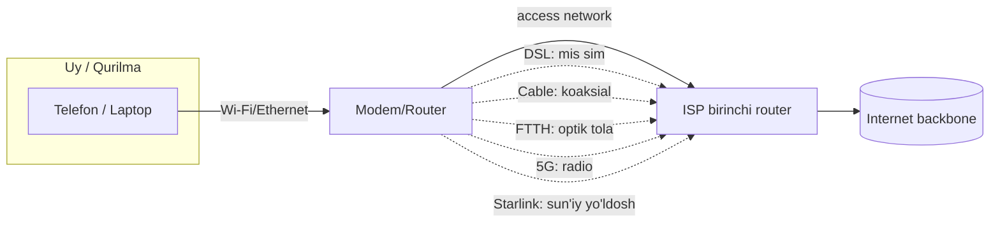

# 03. Access Networks — Internetga qanday ulanamiz?

## Muammo: "oxirgi mil" (last mile)

Oldingi darslarda Internet — bu tarmoqlarning tarmog'i, deb bilib oldik.
Lekin bitta savol qoladi: **sening telefoning yoki noutbuking o'sha ulkan
tarmoqqa aynan qanday ulanadi?**

Google serverlari optik tolalar bilan o'zaro ulangan — bu oson. Qiyin qismi —
millionlab uy va telefonni backbone'ga olib borish. Bu "**oxirgi mil**" (last
mile) muammosi deyiladi: eng qimmat va eng murakkab qism aynan foydalanuvchi
uyigacha bo'lgan oxirgi masofada.

**Access network** — bu sening qurilmangni birinchi router'gacha (ISP'gacha)
olib boradigan fizik ulanish. Bu darsda uning barcha turlarini ko'ramiz.

---

## Analogiya: uyingizga suv qanday keladi?

Suv shahar suv omboridan uyingizgacha qanday yetib keladi? Turli usullar bor:

- **Katta magistral quvur** — bu Internet backbone (optik tola).
- **Ko'changizdagi o'rta quvur** — bu ISP tarmog'i.
- **Uyingizga kiradigan oxirgi quvur** — bu **access network**.

Oxirgi quvur qanday materialdan (mis, plastik, temir) va qanday yo'g'onlikda
bo'lishi — sizning suv bosimingizni (tezligingizni) belgilaydi. Aynan shunday,
access network turi (mis sim, optik tola, radio to'lqin) Internet tezligingizni
belgilaydi.

---

## Sodda ta'rif

> **Access network** — foydalanuvchi qurilmasini Internet provayderining
> (ISP) birinchi router'iga ulaydigan fizik tarmoq. Ya'ni Internetga
> "kirish eshigi".

---

## Diagramma: umumiy manzara



Bir xil natija (Internetga ulanish), lekin **beshta boshqacha yo'l**. Endi
har birini ko'rib chiqamiz.

---

## Ulanish usullari

### 1. DSL (Digital Subscriber Line)

- **Nima orqali:** eski **telefon simlari** (mis sim).
- **Qanday:** ovoz va ma'lumot turli chastotalarda birga uzatiladi — telefonda
  gaplashib turib ham internet ishlaydi.
- **Tezlik:** 12-24 Mbit/s (yuklab olish), 1-2.5 Mbit/s (yuklash).
- **Cheklov:** ISP'dan ~5-16 km uzoqlashsa, tezlik keskin pasayadi.

📌 **Sodda:** telefon simi bor uyda internet ham bo'lishi mumkin. Eski, arzon,
lekin sekin. Bugun asta-sekin yo'qolmoqda.

### 2. Cable (HFC — Hybrid Fiber-Coaxial)

- **Nima orqali:** **kabel televidenie** liniyalari.
- **Qanday:** shahar markazidan optik tola keladi, keyin uyga **koaksial
  kabel** bilan ulanadi.
- **Standart:** DOCSIS (eng yangi — **DOCSIS 4.0**, 10 Gbit/s yuklab olishni va'da qiladi).
- **Kamchilik:** bir kabelni bir necha uy **baham ko'radi** — qo'shnilar ko'p
  ishlatsa, sekinlashadi.

📌 **Sodda:** televizor kabeli orqali internet. Tez, lekin "peak" vaqtlarda
qo'shnilar tufayli tezlik tushishi mumkin.

### 3. FTTH (Fiber To The Home)

- **Nima orqali:** **to'g'ridan-to'g'ri optik tola** uyingizgacha.
- **Standartlar:** GPON (~900 Mbit/s simmetrik), **XGS-PON** (2.5-10 Gbit/s simmetrik).
- **Qurilmalar:** OLT (ISP tomonda), ONT/ONU (uyda).
- **Latency:** birinchi hop'gacha atigi **1-4 ms** — eng past.

📌 **Sodda:** eng tez va eng ishonchli. Yorug'lik tezligida ma'lumot.
Qimmatroq, lekin sifat a'lo. Bugungi "oltin standart".

### 4. 5G / Fixed Wireless (FWA)

- **Nima orqali:** **radio to'lqin**, mobil operator antennasi (base station).
- **Tezlik:** 5G FWA odatda 200-600 Mbit/s yuklab olish, 30-80 Mbit/s yuklash.
- **Latency:** 15-50 ms.
- **Afzallik:** sim tortish shart emas — antennaga ko'rinish yetarli.

📌 **Sodda:** telefondagi mobil internet — bu 4G/5G. Uyga o'rnatilgan 5G modem
esa "Fixed Wireless Access". Kabel tortib bo'lmaydigan joylar uchun ideal.

### 5. Satellite (Starlink — LEO)

- **Nima orqali:** past orbitadagi (**LEO**, Low Earth Orbit) sun'iy yo'ldoshlar.
- **Tezlik (2025):** median ~128-200 Mbit/s yuklab olish, ~22 Mbit/s yuklash.
- **Latency:** ~25-50 ms (an'anaviy GEO yo'ldoshda ~600 ms edi!).
- **Afzallik:** dunyoning **istalgan** nuqtasida ishlaydi — tog', dala, dengiz.

📌 **Sodda:** Starlink past orbitadagi minglab yo'ldoshlar tufayli eski
sun'iy yo'ldosh internetidan **10 baravar** tez. Uzoq qishloqlar uchun inqilob.

---

## Notional machine: nega optik tola tezroq?

Kod ortida nima bo'lishini tushunaylik. Ma'lumot fizik muhitda **signal**
bo'lib uchadi. Muhit turi tezlik va sifatni belgilaydi:

| Muhit | Signal turi | Muammo |
|-------|-------------|--------|
| Mis sim (DSL) | Elektr | Masofa oshsa signal susayadi, shovqin bor |
| Koaksial (cable) | Elektr | Baham ko'riladi, "peak"da sekinlashadi |
| Optik tola (FTTH) | Yorug'lik (foton) | Deyarli yo'qotishsiz, ulkan tezlik |
| Radio (5G) | Elektromagnit to'lqin | Devor, masofa, ob-havo ta'sir qiladi |
| Sun'iy yo'ldosh | Radio (kosmosgacha) | Katta masofa = latency |

**Optik tola** yutadi, chunki yorug'lik shisha ichida deyarli yo'qotishsiz,
elektromagnit shovqinsiz va ulkan chastota diapazonida uzatiladi. Shuning
uchun kelajak — fiber.

---

## Worked example: qaysi ulanishni tanlash?

Aytaylik, sen uch xil vaziyat uchun access network tanlayapsan (subgoal
label'lar bilan):

```text
// --- Vaziyat 1: shahar markazi, gaming va streaming ---
Kerak: past latency, yuqori upload.
Tanlov: FTTH (fiber). Latency 1-4 ms, simmetrik tezlik.

// --- Vaziyat 2: yangi qurilgan uy, kabel yo'q ---
Kerak: tez o'rnatish, sim tortmasdan.
Tanlov: 5G Fixed Wireless. Antennaga ko'rinish yetarli.

// --- Vaziyat 3: tog'dagi qishloq, hech qanday sim yo'q ---
Kerak: har qanday joyda ishlash.
Tanlov: Starlink (LEO satellite). ~30 ms latency, global qamrov.
```

Ko'rib turganingdek, "eng yaxshi" ulanish yo'q — **kontekst** hal qiladi.

---

## 🤔 O'ylab ko'r

Nima uchun cable (DOCSIS) internetni bir necha qo'shni "baham ko'radi", lekin
FTTH'da har uy o'z liniyasiga ega bo'lishi mumkin?

<details>
<summary>💡 Javobni ko'rish</summary>

Cable'da bitta koaksial kabel butun bir mahalla/blokni ISP'ga ulaydi —
foydalanuvchilar shu bitta kabelning umumiy tezligini bo'lishadi. Shuning
uchun kechqurun hamma bir vaqtda foydalanganda tezlik tushadi.

FTTH'da esa optik tolaning o'tkazish qobiliyati shunchalik kattaki, splitter
orqali bo'linsa ham har bir uyga to'liq gigabit tezlik yetadi. Fiber "baham
ko'rish" muammosini deyarli sezilmas darajada kamaytiradi.
</details>

---

## Taqqoslash jadvali

| Texnologiya | Tezlik (down) | Latency | Narx | Qayerda |
|-------------|---------------|---------|------|---------|
| **DSL** | 12-24 Mbit/s | O'rta | Arzon | Eski shahar tarmoqlari |
| **Cable (DOCSIS 4.0)** | 1-10 Gbit/s | 5-15 ms | O'rta | Shahar, ko'p uy |
| **FTTH (XGS-PON)** | 2.5-10 Gbit/s | 1-4 ms | Qimmat | Zamonaviy shahar |
| **5G FWA** | 200-600 Mbit/s | 15-50 ms | O'rta | Sim yo'q joylar |
| **Starlink (LEO)** | 128-200 Mbit/s | 25-50 ms | Qimmat | Uzoq, chekka joylar |

**2026 tendensiyasi:** rivojlangan mamlakatlarda ~70% uy fiberga ega bo'lmoqda,
DSL yo'qolmoqda. 5G FWA va Starlink esa "sim yetmagan" joylarni qoplaydi.

---

## Ko'p uchraydigan xatolar

⚠️ **Xato 1:** "Wi-Fi — bu Internetga ulanish turi."
Noto'g'ri. Wi-Fi — bu faqat qurilmangni uydagi **router'ga** ulaydi (LAN
ichida). Router'dan Internetgacha bo'lgan ulanish (DSL/fiber/5G) — bu asl
access network. Wi-Fi'ni o'chirib, kabel bilan ulasang ham internet o'sha.

⚠️ **Xato 2:** "5G har doim fiberdan tez."
Noto'g'ri. 5G latency (15-50 ms) fiberdan (1-4 ms) yuqori, tezlik esa signal
kuchiga bog'liq va o'zgaruvchan. Fiber — barqarorlik va past latencyda hamon yetakchi.

⚠️ **Xato 3:** "Sun'iy yo'ldosh interneti har doim sekin va yaramaydi."
Eskirgan tasavvur. An'anaviy GEO yo'ldosh ~600 ms latency berardi. Lekin
Starlink (LEO) past orbita tufayli ~25-50 ms beradi — bu gaming va video
call uchun ham yetarli.

---

## Xulosa

- **Access network** — qurilmani ISP'ning birinchi router'iga ulaydigan fizik yo'l.
- Eng qiyin qism — "oxirgi mil" (uygacha bo'lgan masofa).
- Asosiy turlar: **DSL** (mis sim), **cable** (koaksial), **FTTH** (optik tola),
  **5G FWA** (radio), **Starlink** (LEO sun'iy yo'ldosh).
- Muhit turi tezlik va latencyni belgilaydi: yorug'lik (fiber) > elektr (mis) > radio.
- FTTH — bugungi oltin standart: eng tez, eng past latency.
- 5G va Starlink — sim tortib bo'lmaydigan joylarni qoplaydi.

---

## 🧠 Eslab qol

- Access network = Internetga kirish eshigi (oxirgi mil).
- Fiber (yorug'lik) > mis sim (elektr) > radio, tezlik bo'yicha.
- Cable baham ko'riladi, FTTH har uyga alohida.
- Starlink (LEO) eski sun'iy yo'ldoshdan 10x tez (~30 ms).

---

## ✅ O'z-o'zini tekshir

<details>
<summary>1. Nima uchun DSL'da ISP'dan uzoqlashsa tezlik pasayadi, lekin FTTH'da unchalik emas?</summary>

DSL mis sim orqali **elektr** signal uzatadi — bu signal masofa oshgani sari
susayadi (attenuation) va shovqinga uchraydi. FTTH esa **yorug'lik** uzatadi,
u shisha ichida deyarli yo'qotishsiz uzoq masofaga borishi mumkin. Shuning
uchun fiberda masofa deyarli muammo emas.
</details>

<details>
<summary>2. "Peak" vaqtlarda (kechqurun) cable internet nega sekinlashadi, fiber esa yo'q?</summary>

Cable'da bitta koaksial kabelni bir mahalla baham ko'radi — ko'p odam bir
vaqtda foydalansa, umumiy tezlik bo'linadi. Fiber esa har uyga amalda alohida
katta kanal beradi, shuning uchun qo'shnilar ta'siri sezilmaydi.
</details>

<details>
<summary>3. Uzoq tog'li qishloqqa internet kerak. Qaysi texnologiyani tanlaysan va nega?</summary>

**Starlink (LEO satellite)**. Chunki u hech qanday fizik sim (mis/kabel/fiber)
talab qilmaydi va dunyoning istalgan nuqtasida ishlaydi. ~25-50 ms latency
bilan hatto video call ham mumkin — bu chekka hududlar uchun eng amaliy yechim.
</details>

<details>
<summary>4. Wi-Fi access network turimi? Nega?</summary>

Yo'q. Wi-Fi — bu faqat qurilmani **uydagi router'ga** ulaydi (LAN ichida).
Asl access network — bu router'dan ISP'gacha bo'lgan ulanish (DSL, fiber, 5G).
Wi-Fi bo'lmasa ham (kabel bilan ulanib) access network o'sha bo'lib qoladi.
</details>

---

## 🛠 Amaliyot

1. **Oson (kuzatish):** O'z uying yoki telefoning internet turini aniqla:
   provayder qaysi texnologiyani ishlatadi (DSL/cable/fiber/mobil)? Speedtest
   (speedtest.net) orqali tezlik va ping (latency)ni o'lcha.

   <details><summary>Hint</summary>Ping 1-5 ms bo'lsa — fiber ehtimoli katta.
   30-50 ms bo'lsa — mobil yoki Starlink. 100+ ms — masofaviy server.</details>

2. **O'rta (taqqoslash):** Uch do'stingdan speedtest natijasini so'ra (download,
   upload, ping). Jadval qil va har birining access network turini taxmin qil.

   <details><summary>Hint</summary>Simmetrik tezlik (down = up) fiber belgisi.
   Yuqori download, past upload — cable belgisi.</details>

3. **Qiyin (loyihalash):** Yangi kvartira majmuasi (500 xonadon) uchun access
   network loyihalash: qaysi texnologiya, nega, taxminiy tezlik va cheklovlarni yoz.

   <details><summary>Hint</summary>Zich joylashuv → GPON/XGS-PON fiber eng
   samarali. OLT markazda, har xonadonga ONT. Splitter'lar bilan bo'lish.</details>

---

## 🔁 Takrorlash

- **Bog'liq darslar:** [01-tarmoq-va-internet-nima](01-tarmoq-va-internet-nima.md),
  [04-network-core-va-packet-switching](04-network-core-va-packet-switching.md),
  [06-latency-loss-throughput](06-latency-loss-throughput.md).
- **Takrorlash jadvali:** ertaga → 3 kundan keyin → 1 haftadan keyin savollarga qayt.
- **Feynman testi:** "Internetga qanday ulanamiz?" degan savolga "suv quvuri"
  analogiyasi orqali do'stingga 3 jumlada tushuntir.

---

## 📚 Manbalar

- Kurose & Ross, *Computer Networking: A Top-Down Approach*, 1-bob (access networks)
- [Home Internet 2026: GPON/XGS-PON vs DOCSIS 4.0 vs Fixed 5G — Smartees](https://smartees.tech/tools/speed-test/fiber-vs-5g-vs-cable-2026)
- [DOCSIS 4.0 vs Fiber — AT&T Business](https://www.business.att.com/learn/articles/docsis-vs-fiber-why-knowing-the-difference-matters.html)
- [Starlink Satellite Internet in 2026 — Packetstorm](https://packetstorm.com/starlink-satellite-internet-in-2026-bandwidth-latency-and-packet-loss-analyzed/)
- [Satellite Internet Speeds 2026 — Orbital Radar](https://orbitalradar.com/satellite-internet/speeds-and-latency)
